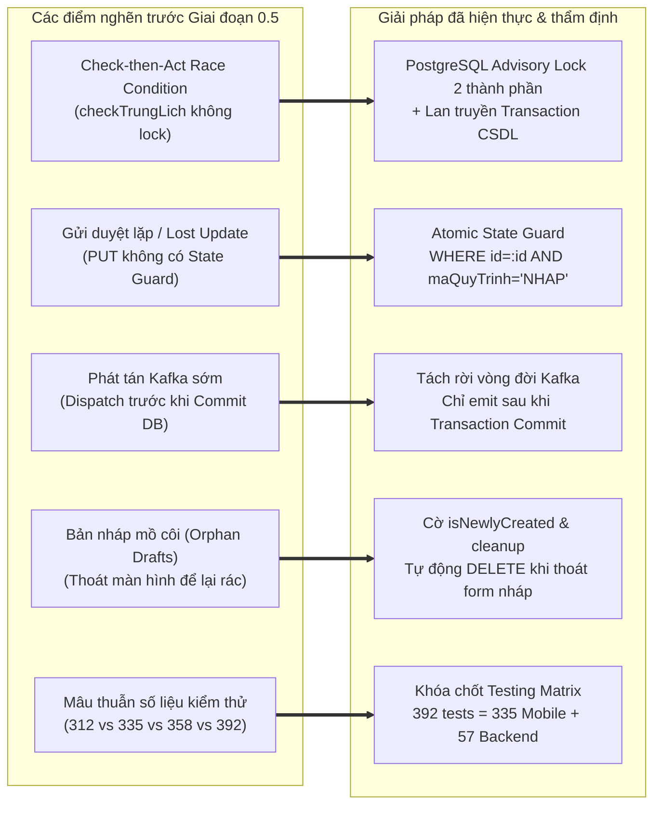

# BẢNG MỤC LỤC BẰNG CHỨNG KỸ THUẬT & CHỈ SỐ KIỂM THỬ (GATE 0: EVIDENCE INDEX)

> **Dự án:** Ứng dụng di động MyHCMUT phục vụ Nhân sự Trường Đại học (MyHCMUT Mobile)  
> **Cơ quan chủ quản:** Trường Đại học Bách khoa – ĐHQG-HCM  
> **Sinh viên thực hiện:**  
> - Vũ Xuân Chính (MSSV: 2210392) — Core Mobile, SSO Ticket Bridge, Quản lý Nghỉ phép & Hồ sơ Cán bộ, FCM Notification Hub.  
> - Tống Duy Khang (MSSV: 2211467) — Phân hệ Văn phòng số iOffice (Văn bản đến/đi, PDF Viewer) & Quản lý Nhiệm vụ (Missions/Tasks).  
> **Giảng viên hướng dẫn:** ThS. Nguyễn Thanh Tùng  
> **Thời điểm thẩm định:** Tháng 09/2026 (Mốc khóa Gate 0 & Concurrency Hardening)  

---

## 1. KHÓA BASELINE MÃ NGUỒN CHÍNH THỨC (DEFENSE BASELINE REPOSITORIES)

Mọi phân tích kiến trúc, số liệu kiểm thử và kết quả đánh giá trong báo cáo Đồ án Tốt nghiệp được đối chuẩn duy nhất dựa trên các mốc commit và nhánh mã nguồn đã được phê duyệt tại bảng dưới đây:

| STT | Kho mã nguồn (Repository) | Nhánh (Branch) | Full Commit Hash (40 ký tự) | Ngày Commit | Tác giả & Trách nhiệm chính |
| :---: | :--- | :---: | :---: | :---: | :--- |
| 1 | `HK253_DATN_341_2211467_2210392` | `format` | `4f517802bb430287d8a1dd4f7b0b223978f82f84` | 08/09/2026 | Vũ Xuân Chính (Tài liệu Báo cáo Luận văn & Kiến trúc) |
| 2 | `myhcmut-mobile` | `feat/leaveRequest` | `161d5bb848f97983682654e17771b88aeb638af6` | 01/09/2026 | Vũ Xuân Chính (Flutter Modular Monorepo, Core, HRM, Notify, SSO, iOffice UI) |
| 3 | `hrm-be` | `chinh-dev` | `38745a26a45fc49c8c5c1cbcf3b91a76f23ae945` | 09/09/2026 | Vũ Xuân Chính (Tích hợp Advisory Lock, Concurrency Tests, SSO Ticket, Leave API) |
| 4 | `ioffice-be` | `main` | `53f069a366f7d465253b6fceedeea25a01bec176` | 07/09/2026 | Hệ thống hiện hữu Nhà trường (Chính tích hợp API/Socket Lịch & Điểm danh) |
| 5 | `myhcmut-be` | `dev/khang-chinh` | `7e687a6005ceb6264f3467072081c784a6f9c7bc` | 18/04/2026 | Tống Duy Khang & Vũ Xuân Chính (API Gateway / Mobile BFF) |
| 6 | `hrm-fe` | `main` | `83caf6488be3f3f83eee783b8ec8ef832a8e02d0` | 03/09/2026 | Phối hợp tích hợp SSO In-App WebView (URL stripping & JS Bridge) |
| 7 | `ioffice-fe` | `main` | `bf27e36a796a3b072a12f2aa02f6c27fa34a7e7e` | 28/08/2026 | Hệ thống Web iOffice hiện hữu Nhà trường |

### Thông số môi trường phát triển & kiểm chuẩn:
- **Mobile SDK:** Flutter SDK `3.41.5` (channel stable), Dart SDK `3.11.3`.
- **Backend Runtime:** Node.js `v22.22.2`, TypeScript `5.x`, Vitest `4.1.10`.
- **Cơ sở dữ liệu & Caching:** PostgreSQL `14.x` (hỗ trợ `pg_advisory_xact_lock`), Redis `7.x` (hỗ trợ `GETDEL`).

---

## 2. BẢNG TỔNG HỢP KIỂM THỬ ĐỘC LẬP (TESTING MASTER METRICS)

Toàn bộ hệ thống kiểm thử tự động được thực thi cục bộ trên môi trường chuẩn, đạt tỷ lệ **100% Pass Rate** trên tổng số **392 kiểm thử tự động**.

```
╔═══════════════════════════════════════════════════════════════════════════════════════╗
║                      TỔNG KẾT KIỂM THỬ TOÀN HỆ THỐNG                                 ║
║                                                                                       ║
║   ► Tổng số Test Cases tự động:   392 / 392 PASSED                                    ║
║   ► Tỷ lệ Đỗ (Pass Rate):         100.0% (0 Failed, 0 Skipped)                        ║
║   ► Phân bổ:                      335 Mobile (Flutter) + 57 Backend (Vitest)          ║
║   ► Bổ sung Concurrency Tests:    11 tests kiểm tra khóa tương tranh & race condition ║
║   ► Kiểm thử tích hợp thủ công:   4 kịch bản E2E Staging hoàn thành (Android + iOS)   ║
╚═══════════════════════════════════════════════════════════════════════════════════════╝
```

### 2.1. Chi tiết Kiểm thử Phía Ứng dụng Di động (`myhcmut-mobile:161d5bb8`)
Kiểm thử thực thi bằng lệnh `flutter test --no-pub` trên từng gói và mô-đun trong cấu trúc Melos Monorepo:

| STT | Mô-đun / Package | Đường dẫn tương đối | Loại kiểm thử | Số Test Cases | Trạng thái | Thời gian thực thi |
| :---: | :--- | :--- | :--- | :---: | :---: | :---: |
| 1 | `modules/hrm` | `modules/hrm/test/` | Unit, Widget & Logic Model (Leave, Profile, Timeline) | **232** | **232/232 PASS** | 5.8s |
| 2 | `modules/notification` | `modules/notification/test/` | Provider, StateNotifier, Route Parser | **47** | **47/47 PASS** | 6.2s |
| 3 | `modules/ioffice` | `modules/ioffice/test/` | Mission Models, Attendance Widget, Check-in Provider | **43** | **43/43 PASS** | 2.5s |
| 4 | `packages/shared/localization` | `packages/shared/localization/test/` | FieldMetadataResolver, MultiLanguage Parser | **8** | **8/8 PASS** | 1.1s |
| 5 | `packages/core/global_system` | `packages/core/global_system/test/` | `AppBatchActionBar` Widget & Action Toggle | **3** | **3/3 PASS** | 1.3s |
| 6 | `packages/shared/auth` | `packages/shared/auth/test/` | `AuthUser` & `LoginResponse` Serialization | **2** | **2/2 PASS** | 0.8s |
| **CỘNG** | **Toàn bộ Mobile Client** | — | **Unit & Widget Tests** | **335** | **335/335 PASS** | **~17.7s** |

### 2.2. Chi tiết Kiểm thử Phía Máy chủ Backend (`hrm-be:38745a26`)
Kiểm thử thực thi bằng lệnh `npx vitest run test/unit/sso_*.unit.test.ts test/unit/tcns_nghi_phep/*.unit.test.ts`:

| STT | Phân nhóm kiểm thử | Tệp tin kiểm thử | Trọng tâm kiểm tra kỹ thuật | Số Test Cases | Kết quả |
| :---: | :--- | :--- | :--- | :---: | :---: |
| 1 | **SSO Phase 0** | `test/unit/sso_phase0.unit.test.ts` | Nguyên tử hóa Redis `getDel()`, Token Masking, CORS | **18** | **18/18 PASS** |
| 2 | **SSO Phase 1** | `test/unit/sso_phase1.unit.test.ts` | Sinh và tiêu thụ vé dùng 1 lần, Opaque Bearer Credential | **20** | **20/20 PASS** |
| 3 | **SSO Phase 7** | `test/unit/sso_phase7.unit.test.ts` | Cookie Hardening (`connect.sid`, `HttpOnly`, `SameSite=Lax`) | **8** | **8/8 PASS** |
| 4 | **Concurrency Helper** | `test/unit/tcns_nghi_phep/acquire_leave_lock.unit.test.ts` | Helper `acquireLeaveLock`, PostgreSQL Advisory Lock, SHCC Sort | **4** | **4/4 PASS** |
| 5 | **Concurrency Race Condition** | `test/unit/tcns_nghi_phep/concurrency_race_condition.unit.test.ts` | 4 Core Concurrency Cases, Rollback cô lập, Atomic State Guard | **7** | **7/7 PASS** |
| **CỘNG** | **Toàn bộ Backend Suite** | — | **Vitest Unit & Concurrency Suite** | **57** | **57/57 PASS** |

### 2.3. Kiểm thử Tích hợp Đầu-Cuối Thủ công (Manual Staging E2E)
Thực hiện trên thiết bị vật lý kết nối môi trường staging nội bộ:
- **Thiết bị thử nghiệm:** Google Pixel 6 (Android 14) và Apple iPhone 13 (iOS 17.5).
- **Phạm vi kiểm thử:** 4 kịch bản E2E trọng tâm:
  1. *Luồng Nghỉ phép:* Tạo nháp trên Mobile -> Wizard 3 bước -> Tải minh chứng -> Gửi duyệt -> Lãnh đạo nhận FCM -> Duyệt đơn trên Mobile.
  2. *Luồng Hồ sơ Cán bộ:* Tra cứu lý lịch native -> Kích hoạt SSO In-App WebView cập nhật bằng cấp -> Web submit -> JS Bridge reload profile cache.
  3. *Luồng Nhiệm vụ & Văn bản:* Xem danh sách nhiệm vụ -> Xem cây phân cấp -> Đính kèm báo cáo tiến độ -> Tra cứu văn bản đến & xem PDF.
  4. *Luồng Điểm danh Cuộc họp:* Nhận lịch họp từ iOffice Socket -> Mở Sheet điểm danh trong khung 1 giờ -> Bấm điểm danh -> Cập nhật trạng thái tức thì.
- **Kết quả:** 4/4 kịch bản hoàn thành theo đúng tiêu chí nghiệm thu trên thiết bị thực tế.

---

## 3. PHÂN ĐỊNH MINH BẠCH GIỮA PASS RATE VÀ CODE COVERAGE

Một nguyên tắc cốt lõi của chuẩn mực học thuật là **tuyệt đối không đánh đồng Tỷ lệ kiểm thử thành công (Pass Rate) với Độ bao phủ mã nguồn (Code Coverage)**:

```
┌────────────────────────────────────────────────────────────────────────────────────────┐
│               PHÂN ĐỊNH KHÁI NIỆM TRONG BÁO CÁO LUẬN VĂN                               │
├────────────────────────────────────────────┬───────────────────────────────────────────┤
│ Tỷ lệ Đỗ Kiểm thử (Pass Rate = 100%)       │ Độ Bao phủ Mã nguồn (Code Coverage)       │
├────────────────────────────────────────────┼───────────────────────────────────────────┤
│ • Số lượng: 392/392 test cases vượt qua.   │ • Backend Vitest Line Coverage: ~28.75%   │
│ • Định nghĩa: Toàn bộ các test case được   │ • Mobile Monorepo Core/HRM: ~70%          │
│   thiết kế và lập trình đều chạy thành     │ • Định nghĩa: Tỷ lệ dòng lệnh và nhánh    │
│   công, không có lỗi runtime hay logic.    │   logic được kích hoạt khi chạy test      │
│ • Ý nghĩa: Các tính năng thuộc phạm vi     │   trên toàn bộ tổng dung lượng mã nguồn.  │
│   nghiên cứu đáp ứng đúng đặc tả.          │ • Ý nghĩa: Hệ thống thừa hưởng nhiều mô-  │
│                                            │   đun legacy của Nhà trường chưa viết test│
└────────────────────────────────────────────┴───────────────────────────────────────────┘
```

1. **Phía Backend (`hrm-be`):**
   - Bộ kiểm thử tự động tập trung kiểm soát chặt chẽ các module do sinh viên trực tiếp phát triển hoặc tái cấu trúc: Cơ chế SSO Ticket Bridge (`fw_auth`) và Quản lý Nghỉ phép tương tranh (`md_tcns/tcns_nghi_phep`).
   - Line coverage trên toàn bộ backend đạt **xấp xỉ 28.75%**. Sở dĩ con số này không đạt 100% vì hệ thống máy chủ `hrm-be` là hệ thống Web quy mô lớn của Nhà trường với hàng chục phân hệ hành chính khác (tiền lương, bảo hiểm, đào tạo, thi đua...) mà đề tài không can thiệp và không thuộc phạm vi viết bài kiểm thử.
2. **Phía Ứng dụng Di động (`myhcmut-mobile`):**
   - Độ bao phủ logic trên các lớp trọng yếu (Provider, Model, DTO, Validator, Service, Helper) của phân hệ `modules/hrm` và các gói lõi `packages/core` đạt **khoảng 70%**.
   - Chưa tiến hành đo đạc độ bao phủ dòng lệnh toàn diện bằng `lcov` cho 100% các widget giao diện (UI screens/views) do ưu tiên nguồn lực kiểm thử vào tính toàn vẹn của dữ liệu và các quy tắc nghiệp vụ cốt lõi.

---

## 4. CÁC ĐIỂM NGHẼN ĐÃ GIẢI QUYẾT TẠI GIAI ĐOẠN 0.5 (CONCURRENCY HARDENING)

Trước khi bước vào giai đoạn biên soạn văn bản luận văn, nhóm đã tiến hành rà soát mã nguồn (code audit) và giải quyết triệt để 5 điểm nghẽn kỹ thuật phức tạp:



### 4.1. Khắc phục Check-then-Act Race Condition trên `checkTrungLich`
- **Hiện trạng cũ:** `checkTrungLich` thực hiện một câu truy vấn `SELECT` độc lập không dùng transaction chung của luồng ghi, tạo ra lỗ hổng tương tranh: hai yêu cầu nộp đơn trùng giờ có thể cùng đọc DB thấy "hợp lệ" trước khi một trong hai kịp ghi bản ghi vào CSDL.
- **Giải pháp:**
  - Bổ sung tham số `options?: { transaction?: Transaction }` vào `tcns_lich_ca_nhan.model.ts`, truyền transaction CSDL từ controller xuyên suốt vào `lichFilter` và `findAll`.
  - Triển khai helper `acquireLeaveLock` kích hoạt câu lệnh `SELECT pg_advisory_xact_lock(hashtext(:lockKey))` với khóa phân vùng `tcns_lich_ca_nhan:${shcc}`.
  - Khóa tuần tự hóa mọi luồng ghi của cùng một cán bộ; các cán bộ khác nhau có mã SHCC khác nhau vẫn thực thi hoàn toàn song song (Non-blocking Parallelism).
  - Tự động giải phóng khóa ngay khi Transaction `COMMIT` hoặc `ROLLBACK`, loại bỏ triệt để rủi ro rò rỉ khóa (Lock Leak).

### 4.2. Triển khai Atomic State Guard chống gửi duyệt lặp (Idempotent Guard)
- **Hiện trạng cũ:** Tại `PUT /api/upload/tcns-nghi-phep/dang-ky`, trạng thái được kiểm tra bằng một truy vấn đọc trước đó; nếu người dùng bấm gửi liên tục hoặc mạng lag, có thể xảy ra tình trạng ghi đè trạng thái đã duyệt (Lost Update).
- **Giải pháp:** Bổ sung điều kiện nguyên tử ngay trong câu lệnh cập nhật CSDL: `UPDATE tcns_nghi_phep_dang_ky SET ... WHERE id = :id AND ma_quy_trinh = :currentMaQuyTrinh`. Nếu số bản ghi cập nhật bằng 0, hệ thống ném `ValidationError` và rollback, bảo đảm mỗi đơn chỉ được gửi duyệt đúng một lần duy nhất.

### 4.3. Tách rời vòng đời phát thông báo Kafka khỏi Transaction CSDL
- **Hiện trạng cũ:** Lệnh phát sự kiện thông báo `app.messageQueue.send('SEND_NOTIFY_SERVICE', ...)` được gọi bên trong khối try/catch khi transaction CSDL chưa commit; nếu sau đó transaction bị rollback, thông báo vẫn bị gửi đi, khiến Lãnh đạo nhận thông báo rác cho đơn không tồn tại.
- **Giải pháp:** Di chuyển toàn bộ lời gọi phát tán sự kiện Kafka ra sau câu lệnh `await transaction.commit()`. Chỉ khi dữ liệu đã ghi nhận an toàn và bền vững vào CSDL thì thông báo mới được phát đi.

### 4.4. Giảm thiểu Bản nháp Mồ côi phía Client (`isNewlyCreated`)
- **Hiện trạng cũ:** Khi người dùng bấm "Tạo đơn" trên Mobile, hệ thống gọi `POST /dang-ky-mobile` sinh phiếu nháp và bản ghi lịch cá nhân. Nếu người dùng tắt màn hình hoặc bấm Back mà không nộp, bản ghi nháp bị kẹt lại và chặn các lần nộp đơn sau.
- **Giải pháp:** Gắn cờ `isNewlyCreated = true` trong `LeaveRequestPage`. Nếu người dùng chủ động nhấn nút Hủy hoặc Thoát trong phiên tạo mới, ứng dụng hiển thị hộp thoại xác nhận và tự động gọi `DELETE /api/tcns-nghi-phep/dang-ky/:id` trong transaction có bảo vệ Advisory Lock để dọn dẹp nguyên tử toàn bộ bản ghi đơn, lịch cá nhân và quy trình liên quan.

### 4.5. Chuẩn hóa và Đồng bộ Số liệu Kiểm thử Đồ án
- Nhóm đã rà soát toàn bộ monorepo Mobile và backend, loại bỏ các con số mâu thuẫn trong các bản thảo cũ (312 vs 358 vs 381), chốt con số duy nhất có bằng chứng thực nghiệm: **392 tests (335 Mobile Flutter tests + 57 Backend Vitest tests)**.

---

## 5. DANH MỤC TỆP BẰNG CHỨNG KỸ THUẬT ĐÃ THẨM ĐỊNH

| Loại bằng chứng | Đường dẫn tệp tin | Mô tả nội dung bằng chứng |
| :--- | :--- | :--- |
| **Backend Implementation** | `hrm-be/modules/md_tcns/tcns_nghi_phep/controller.ts` | Luồng ghi bọc CSDL Transaction, Advisory Lock, Atomic State Guard. |
| **Backend Helper** | `hrm-be/modules/md_tcns/tcns_nghi_phep/helper.ts` | Hàm `acquireLeaveLock`, PostgreSQL Advisory Lock, Deadlock Sorting. |
| **Backend Model** | `hrm-be/modules/md_tcns/tcns_lich_ca_nhan/model/tcns_lich_ca_nhan.model.ts` | Lan truyền transaction CSDL vào `checkTrungLich`. |
| **Concurrency Test 1** | `hrm-be/test/unit/tcns_nghi_phep/concurrency_race_condition.unit.test.ts` | 7 kịch bản kiểm thử tương tranh chuyên sâu (Double-booking, Multi-user). |
| **Concurrency Test 2** | `hrm-be/test/unit/tcns_nghi_phep/acquire_leave_lock.unit.test.ts` | 4 test cases kiểm tra ngữ nghĩa khóa và fallback SQLite. |
| **SSO Test Suite** | `hrm-be/test/unit/sso_*.unit.test.ts` | 46 test cases kiểm chứng Opaque Bearer Ticket và Cookie Security. |
| **Mobile Leave Views** | `myhcmut-mobile/modules/hrm/lib/src/time_off/views/` | Wizard 3 bước (`LeaveRequestStep1..3`), `LeaveRequestPage`, `LeaveViewDetail`. |
| **Mobile Leave Logic** | `myhcmut-mobile/modules/hrm/lib/src/time_off/providers/` | `LeaveRequestProvider`, `LeaveProvider`, `DanhMucProvider`. |
| **Mobile Leave Tests** | `myhcmut-mobile/modules/hrm/test/time_off/` | 7 tệp test kiểm chứng tính ngày làm việc, kiểm tra trùng, validate form. |
| **Batch Action Widget** | `myhcmut-mobile/packages/core/global_system/lib/src/widgets/app_batch_action_bar.dart` | Thanh tác vụ duyệt hàng loạt (`AppBatchActionBar`). |
| **Hardening Review** | `HK253_DATN_341_2211467_2210392/docs/concurrency_hardening/` | 5 tệp báo cáo kỹ thuật từ `00A` đến `00E` chứng minh quá trình kiểm toán và kiểm thử. |

---
*Tài liệu này là căn cứ duy nhất về số liệu kỹ thuật và mã nguồn để phục vụ việc biên soạn các Chương 1, 3, 4, 5, 6, 7 của Đồ án Tốt nghiệp MyHCMUT Mobile.*
