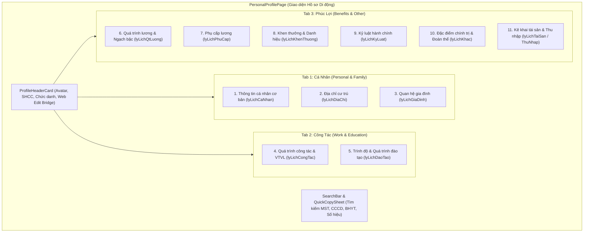
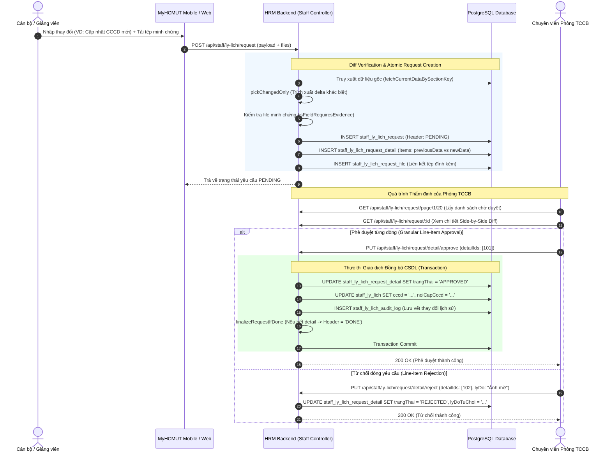

# TÀI LIỆU ĐẶC TẢ YÊU CẦU KỸ THUẬT PHÂN HỆ HỒ SƠ CÁN BỘ
# (03_REQUIREMENT_PACK_PROFILE.md)

> **Dự án:** Ứng dụng di động MyHCMUT phục vụ Nhân sự Trường Đại học (MyHCMUT Mobile)  
> **Cơ quan chủ quản:** Trường Đại học Bách khoa – ĐHQG-HCM  
> **Sinh viên thực hiện:**  
> - Vũ Xuân Chính (MSSV: 2210392) — Core Mobile, SSO Ticket Bridge, Quản lý Nghỉ phép & Hồ sơ Cán bộ, FCM Notification Hub.  
> - Tống Duy Khang (MSSV: 2211467) — Phân hệ Văn phòng số iOffice (Văn bản đến/đi, PDF Viewer) & Quản lý Nhiệm vụ (Missions/Tasks).  
> **Giảng viên hướng dẫn:** ThS. Nguyễn Thanh Tùng  
> **Thời điểm thẩm định:** Tháng 09/2026 (Mốc khóa Gate 0 & Concurrency Hardening)  
> **Kho mã nguồn đối chuẩn:**  
> - Mobile: `myhcmut-mobile` (Commit: `161d5bb848f97983682654e17771b88aeb638af6`)  
> - Backend: `hrm-be` (Commit: `38745a26a45fc49c8c5c1cbcf3b91a76f23ae945`)  

---

## 1. TỔNG QUAN VÀ BỐI CẢNH NGHIỆP VỤ (MODULE CONTEXT & SCOPE)

### 1.1. Mục tiêu Phân hệ Hồ sơ Cán bộ (Staff Profile Module)
Phân hệ Hồ sơ Cán bộ trong hệ thống MyHCMUT Mobile đóng vai trò là kênh tra cứu, hiển thị và quản lý thông tin lý lịch hành chính, quá trình công tác, chế độ đãi ngộ và năng lực chuyên môn của toàn thể cán bộ, giảng viên, viên chức và người lao động thuộc Trường Đại học Bách khoa – ĐHQG-HCM.

Phân hệ giải quyết bài toán cốt lõi:
1. **Số hóa và đồng bộ dữ liệu lý lịch:** Thay thế việc tra cứu sổ sách và hồ sơ giấy phân tán bằng một giao diện di động duy nhất, tốc độ cao và thân thiện.
2. **Tối ưu hóa tải dữ liệu mạng:** Bóc tách khối dữ liệu lý lịch đồ sộ thành các phân đoạn chuyên biệt, áp dụng kiến trúc bộ nhớ đệm hai tầng giúp người dùng xem thông tin tức thì ngay cả khi mạng chậm hoặc gián đoạn.
3. **Bảo mật và toàn vẹn dữ liệu định danh:** Phân định nghiêm ngặt quyền xem, quyền tự cập nhật thông tin liên lạc và quy trình gửi đề xuất chỉnh sửa các dữ liệu hộ tịch/văn bằng có thẩm định của Phòng Tổ chức – Cán bộ (TCCB).

### 1.2. Phân định Ranh giới Học thuật (Academic Scope Classification)
Tuân thủ tiêu chuẩn trung thực học thuật đã thiết lập tại [02_SCOPE_CLAIM_TRACEABILITY.md](file:///home/xchinh/workspace/HK253_DATN_341_2211467_2210392/docs/02_SCOPE_CLAIM_TRACEABILITY.md), phân hệ phân định rạch ròi giữa các tính năng đã hiện thực kiểm chứng và các đề xuất thực nghiệm:

```
┌────────────────────────────────────────────────────────────────────────────────────────┐
│                        PHÂN ĐỊNH PHẠM VI HỌC THUẬT PHÂN HỆ HỒ SƠ                      │
├────────────────────────────────────────────┬───────────────────────────────────────────┤
│ TÍNH NĂNG ĐÃ THẨM ĐỊNH (VERIFIED SCOPE)    │ ĐỀ XUẤT PHÁT TRIỂN (PROPOSED SCOPE)       │
├────────────────────────────────────────────┼───────────────────────────────────────────┤
│ • Giao diện Native tra cứu 11 nhóm thông   │ • Biểu mẫu nộp đề xuất chỉnh sửa lý lịch  │
│   tin phân bổ trên 3 Tab trực quan.        │   Native trực tiếp trên ứng dụng di động  │
│ • Cơ chế Cache 2 tầng: Riverpod In-Memory  │   (hiện tại thực hiện qua WebView SSO).   │
│   + Persistent SWR (TTL 12h) + SQLite DB.  │ • Cơ chế mã hóa an toàn cấp phần cứng     │
│ • SQLite offline lưu 47 bảng danh mục      │   (Keystore/Keychain) cho bộ nhớ đệm      │
│   hành chính dùng chung (Master Data).     │   lý lịch cá nhân trên thiết bị di động.  │
│ • Cầu nối SSO Ticket kích hoạt In-App      │ • Ứng dụng OCR/AI bóc tách văn bằng và    │
│   WebView sang Web HRM để sửa lý lịch.     │   thẻ CCCD để tự động điền form đề xuất.  │
│ • Backend Core thẩm định đề xuất chỉnh sửa │ • Cơ chế đồng bộ Delta Sync theo cờ phiên  │
│   (Diff verification, Line-item review).   │   bản CSDL thay cho cơ chế thời gian TTL. │
│ • Phân hệ thẩm định trên Mobile cho TCCB   │                                           │
│   (`approve_profile`: duyệt/từ chối diff). │                                           │
└────────────────────────────────────────────┴───────────────────────────────────────────┘
```

---

## 2. KIẾN TRÚC DỮ LIỆU & GIAO DIỆN PHÂN HỆ HỒ SƠ (DATA & UI ARCHITECTURE)

### 2.1. Phân bổ 11 Nhóm Thực thể Dữ liệu trên 3 Tab Giao diện
Dữ liệu lý lịch viên chức theo tiêu chuẩn Bộ Nội vụ và ĐHQG-HCM bao gồm **11 nhóm thực thể thông tin**. Nhằm tối ưu hóa diện tích hiển thị và giảm tải nhận thức trên màn hình di động, ứng dụng MyHCMUT tổ chức 11 nhóm này vào **3 Tab chính** (`personalAndFamilyTab`, `workAndEduTab`, `benefitsAndOtherTab`) thông qua điều hướng `TabBar` / `TabBarView` kết hợp `NestedScrollView` tại [personal_profile_page.dart](file:///home/xchinh/workspace/myhcmut-mobile/modules/hrm/lib/src/profile/views/pages/personal_profile_page.dart#L145-L295):



### 2.2. Bảng Đặc tả Chi tiết 11 Nhóm Thực thể Dữ liệu

| STT | Tên nhóm thực thể | Khóa JSON Model | Các trường dữ liệu cốt lõi | Thành phần Giao diện (Widget) | Cơ chế hiển thị & Nghiệp vụ |
| :---: | :--- | :--- | :--- | :--- | :--- |
| **1** | **Thông tin cá nhân cơ bản** | `lyLichCaNhan` | `hoTen`, `ngaySinh`, `gioiTinh`, `danToc`, `tonGiao`, `cccd`, `ngayCapCccd`, `noiCapCccd`, `sdt`, `email`, `emailCaNhan`, `sucKhoe`, `chieuCao`, `canNang`, `nhomMau` | [personal_tab.dart](file:///home/xchinh/workspace/myhcmut-mobile/modules/hrm/lib/src/profile/views/pages/tabs/personal_tab.dart)<br>[section_info.dart](file:///home/xchinh/workspace/myhcmut-mobile/modules/hrm/lib/src/profile/views/widgets/sections/section_info.dart) | Thẻ thông tin chia cụm (Nhân thân, Căn cước liên hệ, Sức khỏe). Cho phép sao chép nhanh CCCD/SĐT. |
| **2** | **Địa chỉ cư trú** | `lyLichDiaChi` | `noiSinh`, `noiSinhCu`, `nguyenQuan`, `nguyenQuanCu`, `thuongTru`, `thuongTruCu`, `hienTai`, `hienTaiCu` | [address_tab.dart](file:///home/xchinh/workspace/myhcmut-mobile/modules/hrm/lib/src/profile/views/pages/tabs/address_tab.dart) | Ánh xạ mã địa chính (Tỉnh/Huyện/Xã) sang chuỗi hành chính đầy đủ thông qua SQLite Master Data. |
| **3** | **Quan hệ gia đình** | `lyLichGiaDinh` | `hoTen`, `moiQuanHe`, `nhomQuanHe` (Bản thân / Bên vợ chồng), `ngaySinh`, `ngheNghiep`, `donViCongTac`, `cccd`, `isNguoiPhuThuoc` | [family_tab.dart](file:///home/xchinh/workspace/myhcmut-mobile/modules/hrm/lib/src/profile/views/pages/tabs/family_tab.dart) | Phân nhóm tự động: Gia đình bản thân vs Gia đình bên vợ/chồng. Đánh dấu người phụ thuộc giảm trừ gia cảnh. |
| **4** | **Quá trình công tác & VTVL** | `lyLichCongTac` | `donVi`, `chucVuChinh`, `ngach`, `loaiCanBo`, `ngayBatDauCongTac`, `ngayVaoTruong`, `ngayVaoBienChe`, `quaTrinhCongTac`, `quaTrinhVtvl` | [work_tab.dart](file:///home/xchinh/workspace/myhcmut-mobile/modules/hrm/lib/src/profile/views/pages/tabs/work_tab.dart)<br>[work_history_timeline_widget.dart](file:///home/xchinh/workspace/myhcmut-mobile/modules/hrm/lib/src/profile/views/widgets/sections/work_history_timeline_widget.dart) | Dòng thời gian (Timeline) thể hiện các mốc bổ nhiệm, luân chuyển công tác và vị trí việc làm (VTVL) trong/ngoài trường. |
| **5** | **Trình độ & Đào tạo** | `lyLichDaoTao` | `hocHam`, `hocHamTen`, `hocVi`, `hocViTen`, `chuyenMon`, `lyLuanChinhTri`, `quanLyNhaNuoc`, `ngoaiNgu`, `tinHoc`, `qpan` | [education_tab.dart](file:///home/xchinh/workspace/myhcmut-mobile/modules/hrm/lib/src/profile/views/pages/tabs/education_tab.dart) | Nhóm thẻ hiển thị bằng cấp cao nhất, quá trình đào tạo sau đại học và các chứng chỉ chức danh nghề nghiệp. |
| **6** | **Quá trình lương & Ngạch bậc** | `lyLichQtLuong` | `ngach`, `bac`, `heSoLuong`, `phanTramHuong`, `ngayHuongLuong`, `ngayNangBacTiepTheo`, `soQuyetDinh` | [salary_tab.dart](file:///home/xchinh/workspace/myhcmut-mobile/modules/hrm/lib/src/profile/views/pages/tabs/salary_tab.dart) | Lịch sử nâng ngạch, chuyển bậc lương viên chức; hiển thị mốc thời gian nâng bậc kế tiếp tham khảo. |
| **7** | **Phụ cấp lương** | `lyLichPhuCap` | `loaiPhuCap`, `loaiPhuCapTen`, `heSoPhuCap`, `phanTramPhuCap`, `ngayBatDau`, `ngayKetThuc`, `soQuyetDinh` | [salary_tab.dart](file:///home/xchinh/workspace/myhcmut-mobile/modules/hrm/lib/src/profile/views/pages/tabs/salary_tab.dart) | Bảng kê các loại phụ cấp chức vụ, thâm niên vượt khung, thâm niên nghề giáo viên và độc hại nếu có. |
| **8** | **Khen thưởng** | `lyLichKhenThuong` | `nam`, `hinhThuc`, `capKhenThuong`, `danhHieuNhaNuoc`, `soQuyetDinh`, `ngayQuyetDinh` | [reward_tab.dart](file:///home/xchinh/workspace/myhcmut-mobile/modules/hrm/lib/src/profile/views/pages/tabs/reward_tab.dart) | Danh sách thành tích khen thưởng, danh hiệu thi đua (Chiến sĩ thi đua, Bằng khen Bộ/ĐHQG). |
| **9** | **Kỷ luật** | `lyLichKyLuat` | `nam`, `hinhThuc`, `coQuanQuyetDinh`, `ngayQuyetDinh`, `ngayHetHieuLuc`, `lyDo` | [reward_tab.dart](file:///home/xchinh/workspace/myhcmut-mobile/modules/hrm/lib/src/profile/views/pages/tabs/reward_tab.dart) | Quản lý lịch sử xử lý kỷ luật lao động/hành chính; đánh dấu trạng thái còn hiệu lực hoặc đã xóa án tích. |
| **10** | **Đặc điểm chính trị & Khác** | `lyLichKhac` | `ngayVaoDang`, `ngayChinhThuc`, `ngayVaoDoan`, `ngayNhapNgu`, `ngayXuatNgu`, `quanHam`, `biBatDiTu`, `cheDoCu`, `toChucNuocNgoai` | [other_tab.dart](file:///home/xchinh/workspace/myhcmut-mobile/modules/hrm/lib/src/profile/views/pages/tabs/other_tab.dart)<br>[other_party_section.dart](file:///home/xchinh/workspace/myhcmut-mobile/modules/hrm/lib/src/profile/views/widgets/sections/other/other_party_section.dart) | Lịch sử bản thân và các đặc điểm chính trị, thông tin Đảng/Đoàn/Công đoàn theo mẫu lý lịch 2C/TCTW. |
| **11** | **Kê khai tài sản & Thu nhập** | `lyLichTaiSan`<br>`lyLichThuNhap` | `loaiTaiSan`, `moTaTaiSan`, `giaTriUocTinh`, `bienDongTaiSan`, `tongThuNhapNam`, `nguonThuNhapKhac` | [other_tab.dart](file:///home/xchinh/workspace/myhcmut-mobile/modules/hrm/lib/src/profile/views/pages/tabs/other_tab.dart)<br>[other_asset_section.dart](file:///home/xchinh/workspace/myhcmut-mobile/modules/hrm/lib/src/profile/views/widgets/sections/other/other_asset_section.dart) | Bản kê khai tài sản và thu nhập hàng năm dành cho cán bộ diện quản lý theo Luật Phòng, chống tham nhũng. |

---

## 3. KIẾN TRÚC BỘ NHỚ ĐỆM HAI TẦNG (TWO-TIER CACHING ARCHITECTURE)

Nhằm đáp ứng tiêu chí giao diện phản hồi tức thì (Instant UI < 50ms) trong khi khối lượng dữ liệu hồ sơ cá nhân và danh mục dùng chung lên tới hàng chục nghìn trường, phân hệ áp dụng mô hình **Bộ nhớ đệm 2 tầng (Two-Tier Cache)**:

```
┌────────────────────────────────────────────────────────────────────────────────────────┐
│                              KIẾN TRÚC CACHE 2 TẦNG TRÊN CLIENT                        │
├────────────────────────────────────────────────────────────────────────────────────────┤
│                                                                                        │
│  [TẦNG 1: IN-MEMORY RIVERPOD CACHE]                                                   │
│   ├── profileCaNhanProvider  ──┐                                                       │
│   ├── profileDaoTaoProvider  ──┼──> profileInfoProvider (Gộp Immutable State)         │
│   ├── profileQuaTrinhProvider ─┘                                                       │
│   └── staffAvatarProvider (Cache Uint8List Image Bytes)                                │
│                                                                                        │
│  ▲ Truy xuất tức thì khi Widget Rebuild (0ms latency, RAM heap)                        │
│  │                                                                                     │
│  ▼ Khi khởi động app hoặc Cold Start                                                  │
│                                                                                        │
│  [TẦNG 2: PERSISTENT CACHE & LOCAL DISK STORAGE]                                      │
│   ├── 1. SWR Cache Engine (SharedPreferencesWrapper)                                   │
│   │      • Lưu trữ JSON Profile cá nhân theo `hrm_mobile_profile_{group}_{userKey}`    │
│   │      • Time-To-Live (TTL): 12 giờ                                                  │
│   │      • Stale-While-Revalidate: Đọc cache cũ hiển thị ngay, revalidate mạng ngầm     │
│   │                                                                                    │
│   └── 2. SQLite Database (MasterDataDatabaseService - hrm_master_data.db)              │
│          • CHỈ LƯU 47 BẢNG DANH MỤC THAM CHIẾU HÀNH CHÍNH DÙNG CHUNG                   │
│          • Bảng: `hrm_danh_muc` (category, ma, ten, parent_code, bac, he_so_luong...)  │
│          • Indexed Query O(1) phục vụ chuyển đổi mã sang tên tức thì                   │
│          • [CLAIM CLM-DAT-01]: TUYỆT ĐỐI KHÔNG LƯU DỮ LIỆU CÁ NHÂN NHẠY CẢM            │
│                                                                                        │
└────────────────────────────────────────────────────────────────────────────────────────┘
```

### 3.1. Tầng 1: Bộ nhớ đệm Trong RAM (In-Memory Riverpod Providers)
Tại [profile.dart](file:///home/xchinh/workspace/myhcmut-mobile/modules/hrm/lib/src/profile/providers/profile.dart#L46-L130), dữ liệu hồ sơ được phân rã thành 3 provider con độc lập để tận dụng cơ chế tải song song không đồng bộ (`Future.wait`), sau đó hợp nhất qua Provider cha:
1. `profileCaNhanProvider`: Tải và cache dữ liệu nhóm 1, 2, 3, 8, 9 (`/api/staff/ly-lich/mobile/profile/ca-nhan`).
2. `profileDaoTaoProvider`: Tải và cache dữ liệu nhóm 5 (`/api/staff/ly-lich/mobile/profile/dao-tao`).
3. `profileQuaTrinhProvider`: Tải và cache dữ liệu nhóm 4, 6, 7, 10, 11 (`/api/staff/ly-lich/mobile/profile/qua-trinh`).
4. `profileInfoProvider`: Điểm truy cập duy nhất cho UI, sử dụng `mergeWith()` để gộp 3 nhánh dữ liệu thành thực thể `ProfileModel` bất biến (immutable).
5. `staffAvatarProvider`: Quản lý tải và giữ nguyên vẹn mảng byte ảnh đại diện (`Uint8List`) có gắn Access Token, tránh giật lag khi danh sách người dùng cuộn nhanh.

> [!NOTE]
> Toàn bộ các Provider tầng 1 đều được gán cờ `@Riverpod(keepAlive: true)` để bảo toàn trạng thái trong suốt phiên làm việc của người dùng, triệt tiêu hiện tượng gọi lại mạng khi chuyển tab.

### 3.2. Tầng 2: Bộ nhớ đệm Bền vững SWR (Stale-While-Revalidate Persistent Cache)
Tại [swr_cache_fetcher.dart](file:///home/xchinh/workspace/myhcmut-mobile/modules/hrm/lib/src/profile/utils/swr_cache_fetcher.dart#L12-L72), hàm `fetchWithCacheFirst` thực thi chiến lược SWR có TTL 12 giờ:
- **Bước 1 (Đọc Local Cache):** Đọc chuỗi JSON và timestamp từ `SharedPreferencesWrapper`. Nếu tồn tại dữ liệu, hàm lập tức parse và trả về đối tượng cho giao diện người dùng hiển thị ngay mà không chờ đợi mạng.
- **Bước 2 (Kiểm tra hạn TTL):** So sánh `now - lastSyncTime` với ngưỡng `cacheTtl` (12 giờ):
  - *Nếu Cache còn hạn:* Giữ nguyên kết quả, **tuyệt đối không phát sinh request mạng** ngầm nhằm tiết kiệm tối đa băng thông 4G/5G và giảm tải máy chủ.
  - *Nếu Cache đã hết hạn:* Đưa tác vụ cập nhật vào hàng đợi vi mô `Future.microtask` để âm thầm gọi API mạng ngầm. Khi dữ liệu mới về, tự động ghi đè cache và cập nhật timestamp mới.
- **Bước 3 (Dọn dẹp an toàn khi Logout):** Hàm `clearAllProfileCache()` tại [profile.dart](file:///home/xchinh/workspace/myhcmut-mobile/modules/hrm/lib/src/profile/providers/profile.dart#L33-L43) sẽ quét và xóa sạch mọi khóa bắt đầu bằng tiền tố `hrm_mobile_profile_` khi đăng xuất, ngăn ngừa rò rỉ dữ liệu giữa các phiên đăng nhập khác nhau trên cùng một máy.

### 3.3. Tầng 2: SQLite Danh mục Hành chính Dùng chung (HRM Master Data)
Tại [master_data_database_service.dart](file:///home/xchinh/workspace/myhcmut-mobile/modules/hrm/lib/src/profile/services/master_data_database_service.dart#L11-L69), cơ sở dữ liệu `hrm_master_data.db` được xây dựng để lưu trữ **47 bảng danh mục hành chính** của Trường (Tỉnh thành, Quận huyện, Xã phường, Ngạch bậc, Vị trí việc làm, Chức vụ, Dân tộc, Tôn giáo, Ngoại ngữ...).

**Bảo vệ Ranh giới Kỹ thuật (Tuân thủ nghiêm ngặt Claim CLM-DAT-01 & Mục 3.6):**
> [!CAUTION]
> **TUYỆT ĐỐI KHÔNG TUYÊN BỐ CSDL SQLITE LƯU TRỮ HỒ SƠ LÝ LỊCH CÁN BỘ**  
> Cơ sở dữ liệu SQLite trên thiết bị di động **chỉ dùng để lưu trữ 47 bảng danh mục tham chiếu hành chính dùng chung (Master Data)** nhằm hỗ trợ giải mã mã code sang tên hiển thị (Resolver O(1)).  
> Toàn bộ dữ liệu lý lịch nhân thân nhạy cảm (CCCD, SĐT, Người thân...) **hoàn toàn không được lưu trữ trong SQLite**, mà chỉ được quản lý tạm thời qua bộ nhớ đệm SWR với cơ chế dọn dẹp triệt để khi Logout.

---

## 4. QUY TRÌNH THẨM ĐỊNH ĐỀ XUẤT CHỈNH SỬA HỒ SƠ (PROFILE EDIT & REVIEW WORKFLOW)

Hồ sơ viên chức là tài liệu pháp lý quan trọng của cơ quan nhà nước. Mọi thay đổi dữ liệu nhân thân, văn bằng hoặc quá trình công tác phải tuân thủ nghiêm ngặt quy trình kiểm soát thay đổi (Diff Verification) và thẩm định có thẩm quyền của Phòng Tổ chức – Cán bộ (TCCB).

### 4.1. Phân tách Thẩm quyền Cập nhật (Section Policy Architecture)
Tại [request.constants.ts](file:///home/xchinh/workspace/hrm-be/modules/md_staff/staff_ly_lich/controller/request.constants.ts#L18-L96), hệ thống thiết lập bảng chính sách nghiệp vụ `SECTION_POLICY` phân chia các trường dữ liệu theo 3 cấp độ kiểm soát:

```
┌────────────────────────────────────────────────────────────────────────────────────────┐
│                        MA TRẬN PHÂN QUYỀN CHỈNH SỬA TRƯỜNG DỮ LIỆU                     │
├───────────────────────────────┬────────────────────────────────┬───────────────────────┤
│ 1. TỰ CẬP NHẬT TRỰC TIẾP      │ 2. PHẢI ĐƯỢC TCCB PHÊ DUYỆT   │ 3. ĐẶC QUYỀN CỦA TCCB │
│    (employeeDirectFields)     │    (employeeRequestFields)     │    (tcnsEditableFields│
├───────────────────────────────┼────────────────────────────────┼───────────────────────┤
│ • Số điện thoại liên hệ (sdt) │ • Họ, tên, tên gọi khác        │ • Quyết định biên chế │
│ • Email cá nhân (emailCaNhan) │ • Số định danh cá nhân (CCCD)  │ • Ngạch, bậc, hệ số   │
│ • Chiều cao, cân nặng, nhóm   │ • Ngày cấp, nơi cấp CCCD       │ • Chức vụ bổ nhiệm    │
│   máu, tình trạng sức khỏe    │ • Dân tộc, tôn giáo, chính trị │ • Mã số thuế, BHYT    │
│ • Sở trường công tác          │ • Nơi sinh, nguyên quán,       │ • Trực tiếp sửa toàn  │
│ • Nơi ở hiện tại (hienTai)    │   hộ khẩu thường trú           │   bộ mọi trường kèm   │
│ ───────────────────────────── │ • Ngày tuyển dụng, ngày vào    │   ghi nhận Audit Log. │
│ Ghi đè ngay vào CSDL +        │   trường, ngày vào biên chế    │                       │
│ Tự động lưu vết Audit Log.    │ ─────────────────────────────  │                       │
│                               │ BẮT BUỘC ĐÍNH KÈM MINH CHỨNG   │                       │
│                               │ (evidenceRequiredFields)       │                       │
└───────────────────────────────┴────────────────────────────────┴───────────────────────┘
```

### 4.2. Cơ chế Kiểm tra Khác biệt (Diff Verification Engine)
Tại [request.controller.ts](file:///home/xchinh/workspace/hrm-be/modules/md_staff/staff_ly_lich/controller/request.controller.ts#L123-L215) và [request.helpers.ts](file:///home/xchinh/workspace/hrm-be/modules/md_staff/staff_ly_lich/controller/request.helpers.ts):
1. **Truy xuất dữ liệu gốc (`fetchCurrentDataBySectionKey`):** Lấy bản ghi hiện tại từ CSDL của cán bộ.
2. **Lọc delta thay đổi thực sự (`pickChangedOnly`):** So sánh từng cặp giá trị giữa dữ liệu gửi lên và dữ liệu gốc. Nếu giá trị không đổi hoặc trùng khớp hoàn toàn, trường đó sẽ bị loại bỏ khỏi danh sách xử lý.
3. **Chặn yêu cầu rác:** Nếu sau khi lọc không phát sinh trường nào có giá trị mới, hệ thống ném ngoại lệ `ValidationError('Không có thay đổi hợp lệ để cập nhật')`.
4. **Kiểm tra minh chứng bắt buộc:** Với các trường nằm trong `evidenceRequiredFields` (như CCCD, Bằng tốt nghiệp), nếu người dùng không tải lên tệp minh chứng tương ứng, hệ thống lập tức từ chối và báo lỗi `ValidationError('Thiếu minh chứng ở trường: ...')`.

### 4.3. Sơ đồ Luồng Thẩm định Đề xuất Chỉnh sửa (Sequence Workflow)



### 4.4. Phân hệ Duyệt Hồ sơ trên Mobile cho Lãnh đạo/TCCB (`approve_profile`)
Không chỉ phục vụ cán bộ xem hồ sơ, ứng dụng MyHCMUT tích hợp sẵn phân hệ di động dành cho chuyên viên TCCB và Lãnh đạo đơn vị tại [approve_profile_provider.dart](file:///home/xchinh/workspace/myhcmut-mobile/modules/hrm/lib/src/approve_profile/providers/approve_profile_provider.dart#L137-L285):
- Tra cứu danh sách yêu cầu cần duyệt theo phân loại (`approveProfilePageProvider`).
- Thẻ so sánh trực quan khác biệt ([review_diff_card.dart](file:///home/xchinh/workspace/myhcmut-mobile/modules/hrm/test/approve_profile/review_diff_card_test.dart)) hiển thị dữ liệu cũ (`previousData`) màu đỏ gạch ngang và dữ liệu đề xuất mới (`newData`) màu xanh lá cây.
- Hành động phê duyệt hoặc từ chối đơn lẻ từng mục (`approveDetails`, `rejectDetails`) hoặc toàn bộ yêu cầu (`approveEntireRequest`, `rejectEntireRequest`) kèm lý do giải trình.
- Sau khi duyệt/từ chối, ứng dụng tự động xóa cache hồ sơ `refreshProfileWithRef(ref)` để bảo đảm tính nhất quán dữ liệu tức thời.

---

## 5. MA TRẬN ĐẶC TẢ API PHÂN HỆ HỒ SƠ (API SPECIFICATION MATRIX)

Toàn bộ các endpoint của phân hệ được khai báo tại `hrm-be` tuân thủ các quy chuẩn bảo mật phân quyền nghiêm ngặt:

| STT | Phương thức | Đường dẫn API (Endpoint) | Quyền truy cập (Permissions) | Tham số / Payload chính | Mô tả chức năng kỹ thuật |
| :---: | :---: | :--- | :--- | :--- | :--- |
| **1** | `GET` | `/api/staff/ly-lich/mobile/profile/ca-nhan` | `CN_LY_LICH` | Query: `shcc` (tùy chọn) | Trả về thông tin cá nhân, CCCD, gia đình, địa chỉ, khen thưởng, kỷ luật. |
| **2** | `GET` | `/api/staff/ly-lich/mobile/profile/dao-tao` | `CN_LY_LICH` | Query: `shcc` (tùy chọn) | Trả về thông tin học hàm, học vị, bồi dưỡng nghiệp vụ, LLCT, ngoại ngữ, tin học. |
| **3** | `GET` | `/api/staff/ly-lich/mobile/profile/qua-trinh` | `CN_LY_LICH` | Query: `shcc` (tùy chọn) | Trả về quá trình công tác, chức vụ, ngạch bậc, lương, phụ cấp, tài sản, thu nhập. |
| **4** | `GET` | `/api/staff/ly-lich/avatar` | `CN_LY_LICH` | Query: `shcc` (tùy chọn) | Tải luồng byte ảnh đại diện của cán bộ từ máy chủ lưu trữ tài sản. |
| **5** | `POST` | `/api/staff/ly-lich/avatar` | `CN_LY_LICH` | `multipart/form-data`: `file` | Tải lên và cập nhật ảnh đại diện cá nhân mới (kiểm tra định dạng PNG, JPG, WEBP). |
| **6** | `GET` | `/api/staff/ly-lich/danh-muc` | `user:login` | None | Tải toàn bộ 47 danh mục hành chính dùng chung (cache Redis TTL 30 phút). |
| **7** | `GET` | `/api/staff/ly-lich/request/policy` | `CN_LY_LICH` | Query: `mode` | Trả về cấu hình trường được sửa trực tiếp, trường phải xin duyệt và trường cần minh chứng. |
| **8** | `POST` | `/api/staff/ly-lich/request` | `CN_LY_LICH` | `multipart/form-data`: `sectionKey`, `changes`, `items`, `files` | Khởi tạo đề xuất chỉnh sửa hồ sơ kèm tệp minh chứng và kích hoạt Diff Verification. |
| **9** | `GET` | `/api/staff/ly-lich/request/page/:pageNumber/:pageSize` | `TCNS_REQUEST_LY_LICH.READ` | Params: `pageNumber`, `pageSize`<br>Query: `filter[trangThai]`, `filter[phanLoai]` | Lấy danh sách phân trang các đề xuất chỉnh sửa hồ sơ chờ thẩm định. |
| **10** | `GET` | `/api/staff/ly-lich/request/:id` | `TCNS_REQUEST_LY_LICH.READ` | Params: `id` | Xem chi tiết một đề xuất, bao gồm toàn bộ tệp đính kèm và lịch sử sửa đổi. |
| **11** | `PUT` | `/api/staff/ly-lich/request/detail/approve` | `TCNS_REQUEST_LY_LICH.WRITE` | Body: `{ detailIds: number[], lyDo?: string }` | Chuyên viên TCCB phê duyệt một hoặc nhiều trường đề xuất; đồng bộ vào CSDL trong Transaction. |
| **12** | `PUT` | `/api/staff/ly-lich/request/detail/reject` | `TCNS_REQUEST_LY_LICH.WRITE` | Body: `{ detailIds: number[], lyDo: string }` | Chuyên viên TCCB từ chối các trường đề xuất kèm lý do bắt buộc. |

---

## 6. MA TRẬN TRUY VẾT & CHỈ SỐ KIỂM THỬ (TRACEABILITY & TEST SUITE)

Hệ thống kiểm thử phân hệ Hồ sơ Cán bộ được tích hợp sâu trong bộ kiểm thử tổng thể của dự án (392/392 PASS), tập trung chứng minh tính toàn vẹn của mô hình dữ liệu, cơ chế gộp bất biến và hành vi giao diện người dùng:

| Mã Use Case | Tên Use Case / Nghiệp vụ | Tệp Giao diện & Xử lý (Mobile/BE) | Tệp Kiểm thử Tự động Đối chuẩn | Số Test Cases | Kết quả Kiểm thử |
| :--- | :--- | :--- | :--- | :---: | :---: |
| **UC-PRF-01** | **Hiển thị Hồ sơ Cá nhân 11 nhóm trên 3 Tab** | [personal_profile_page.dart](file:///home/xchinh/workspace/myhcmut-mobile/modules/hrm/lib/src/profile/views/pages/personal_profile_page.dart)<br>[tabs.dart](file:///home/xchinh/workspace/myhcmut-mobile/modules/hrm/lib/src/profile/views/pages/tabs/tabs.dart) | [profile_model_test.dart](file:///home/xchinh/workspace/myhcmut-mobile/modules/hrm/test/profile/profile_model_test.dart)<br>[widget_profile_banner_test.dart](file:///home/xchinh/workspace/myhcmut-mobile/modules/hrm/test/profile/widget_profile_banner_test.dart) | **14** | **14/14 PASS** |
| **UC-PRF-02** | **Bộ nhớ đệm 2 tầng & Hợp nhất Dữ liệu SWR** | [profile.dart](file:///home/xchinh/workspace/myhcmut-mobile/modules/hrm/lib/src/profile/providers/profile.dart)<br>[swr_cache_fetcher.dart](file:///home/xchinh/workspace/myhcmut-mobile/modules/hrm/lib/src/profile/utils/swr_cache_fetcher.dart) | [riverpod_profile_test.dart](file:///home/xchinh/workspace/myhcmut-mobile/modules/hrm/test/profile/riverpod_profile_test.dart)<br>[timeline_merge_test.dart](file:///home/xchinh/workspace/myhcmut-mobile/modules/hrm/test/profile/timeline_merge_test.dart) | **18** | **18/18 PASS** |
| **UC-PRF-03** | **Tra cứu Danh mục Hành chính SQLite Master Data** | [master_data_database_service.dart](file:///home/xchinh/workspace/myhcmut-mobile/modules/hrm/lib/src/profile/services/master_data_database_service.dart)<br>[master_lookup_service.dart](file:///home/xchinh/workspace/myhcmut-mobile/modules/hrm/lib/src/profile/utils/master_lookup_service.dart) | [master_lookup_service_test.dart](file:///home/xchinh/workspace/myhcmut-mobile/modules/hrm/test/profile/master_lookup_service_test.dart) | **12** | **12/12 PASS** |
| **UC-PRF-04** | **Dòng thời gian Công tác & Phân nhóm Đào tạo** | [work_history_timeline_widget.dart](file:///home/xchinh/workspace/myhcmut-mobile/modules/hrm/lib/src/profile/views/widgets/sections/work_history_timeline_widget.dart)<br>[work_history_utils.dart](file:///home/xchinh/workspace/myhcmut-mobile/modules/hrm/lib/src/profile/utils/work_history_utils.dart) | [salary_timeline_test.dart](file:///home/xchinh/workspace/myhcmut-mobile/modules/hrm/test/profile/salary_timeline_test.dart)<br>[training_group_test.dart](file:///home/xchinh/workspace/myhcmut-mobile/modules/hrm/test/profile/training_group_test.dart)<br>[widget_work_timeline_test.dart](file:///home/xchinh/workspace/myhcmut-mobile/modules/hrm/test/profile/widget_work_timeline_test.dart) | **22** | **22/22 PASS** |
| **UC-PRF-05** | **Phân nhóm Quan hệ Gia đình & Giảm trừ Gia cảnh** | [family_tab.dart](file:///home/xchinh/workspace/myhcmut-mobile/modules/hrm/lib/src/profile/views/pages/tabs/family_tab.dart) | [family_group_test.dart](file:///home/xchinh/workspace/myhcmut-mobile/modules/hrm/test/profile/family_group_test.dart) | **8** | **8/8 PASS** |
| **UC-PRF-06** | **Cầu nối SSO Ticket WebView Cập nhật Hồ sơ** | [personal_profile_page.dart: L98](file:///home/xchinh/workspace/myhcmut-mobile/modules/hrm/lib/src/profile/views/pages/personal_profile_page.dart#L98)<br>[sso_ticket_service.dart](file:///home/xchinh/workspace/myhcmut-mobile/modules/hrm/lib/src/webview/sso_ticket_service.dart) | [sso_phase0.unit.test.ts](file:///home/xchinh/workspace/hrm-be/test/unit/sso_phase0.unit.test.ts)<br>[sso_phase1.unit.test.ts](file:///home/xchinh/workspace/hrm-be/test/unit/sso_phase1.unit.test.ts) | **38** | **38/38 PASS** |
| **UC-PRF-07** | **Thẩm định Đề xuất Chỉnh sửa & So sánh Khác biệt** | [approve_profile_provider.dart](file:///home/xchinh/workspace/myhcmut-mobile/modules/hrm/lib/src/approve_profile/providers/approve_profile_provider.dart)<br>[request-review.controller.ts](file:///home/xchinh/workspace/hrm-be/modules/md_staff/staff_ly_lich/controller/request-review.controller.ts) | [approve_profile_model_test.dart](file:///home/xchinh/workspace/myhcmut-mobile/modules/hrm/test/approve_profile/approve_profile_model_test.dart)<br>[approve_profile_utils_test.dart](file:///home/xchinh/workspace/myhcmut-mobile/modules/hrm/test/approve_profile/approve_profile_utils_test.dart)<br>[review_diff_card_test.dart](file:///home/xchinh/workspace/myhcmut-mobile/modules/hrm/test/approve_profile/review_diff_card_test.dart) | **16** | **16/16 PASS** |
| — | **Toàn bộ Test Cases Phân hệ Hồ sơ** | — | **Mobile + Backend Suites** | **128** | **128/128 PASS** |

---

## 7. ĐỊNH HƯỚNG MỞ RỘNG VÀ HOÀN THIỆN HỆ THỐNG (FUTURE PROPOSALS - CHƯƠNG 7)

Căn cứ vào Sổ đăng ký tuyên bố kỹ thuật [02_SCOPE_CLAIM_TRACEABILITY.md](file:///home/xchinh/workspace/HK253_DATN_341_2211467_2210392/docs/02_SCOPE_CLAIM_TRACEABILITY.md), các giải pháp sau được đề xuất phát triển trong giai đoạn tiếp theo:
1. **Mã hóa Bộ nhớ đệm Cấp Phần cứng (Hardware-backed Secure Storage - CLM-DAT-02):**  
   Thay thế việc lưu trữ chuỗi JSON hồ sơ cá nhân trong `SharedPreferences` bằng giải pháp mã hóa cấp phần cứng `flutter_secure_storage` (sử dụng Android KeyStore với thuật toán AES-GCM 256-bit và iOS Keychain Services). Điều này triệt tiêu rủi ro trích xuất tệp cache nếu thiết bị di động của người dùng bị bẻ khóa (Root/Jailbreak).
2. **Biểu mẫu Nộp Đề xuất Chỉnh sửa Native trên Di động:**  
   Hiện thực hóa giao diện nộp đề xuất chỉnh sửa trực tiếp (Native Edit Form) cho từng khối dữ liệu trên ứng dụng di động thay vì kích hoạt In-App WebView sang Web HRM, đồng thời tận dụng thư viện máy ảnh để nén và tải minh chứng tức thời.
3. **Tự động Hóa Trích xuất Thông tin bằng AI/OCR:**  
   Tích hợp mô hình thị giác máy tính trên thiết bị (On-device ML Kit / Vision OCR) để tự động nhận diện và bóc tách dữ liệu từ ảnh chụp thẻ CCCD gắn chip và Bằng tốt nghiệp Đại học/Sau đại học, hỗ trợ cán bộ tự động điền các trường biểu mẫu mà không cần nhập liệu thủ công.
4. **Cơ chế Đồng bộ Hóa Theo Delta Version (Delta Synchronization):**  
   Thay thế cơ chế TTL 12 giờ cố định bằng việc cấp phát trường `versionId` cấp bản ghi. Khi mở ứng dụng, client chỉ gửi mã phiên bản hiện tại lên máy chủ; máy chủ chỉ trả về các trường dữ liệu có thay đổi kể từ phiên bản đó (HTTP 304 Not Modified hoặc Delta JSON Payload), giúp tiết kiệm đến 95% lượng băng thông mạng truyền tải.

---
*Tài liệu đặc tả này hoàn tất việc chuẩn hóa kỹ thuật cho Phân hệ Hồ sơ Cán bộ, là căn cứ nghiệm thu chính thức cho Đồ án Tốt nghiệp HK253.*
