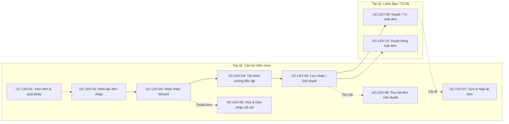
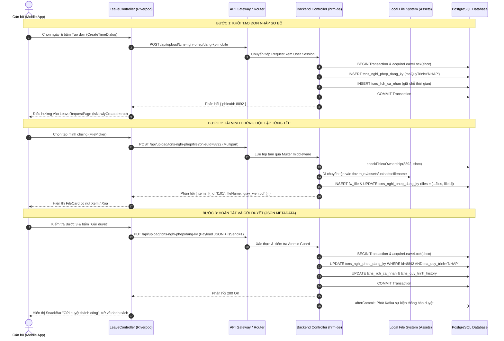
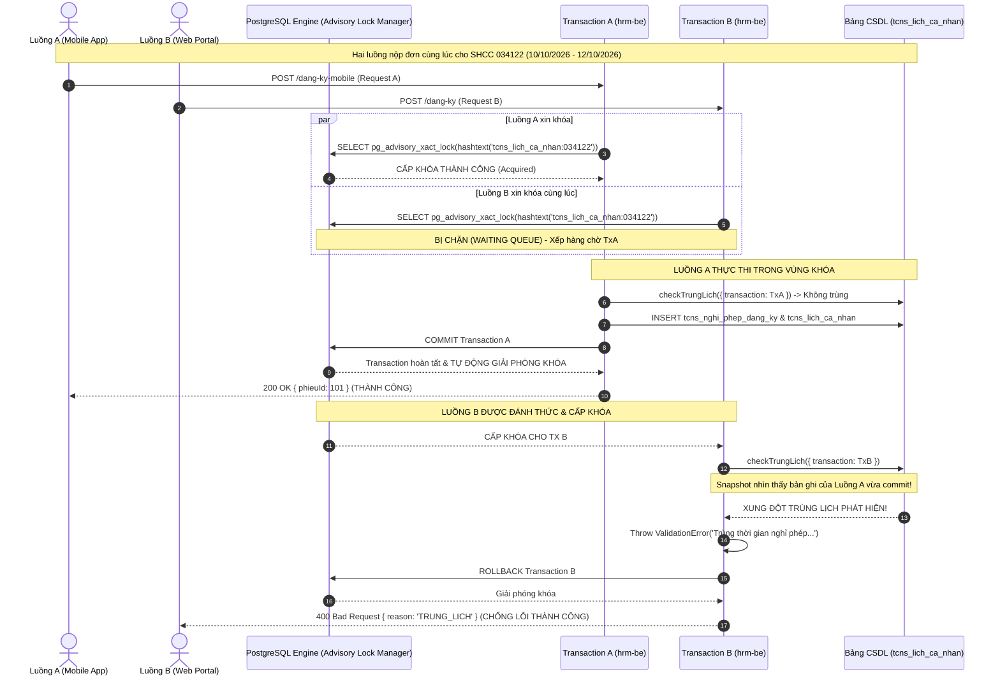
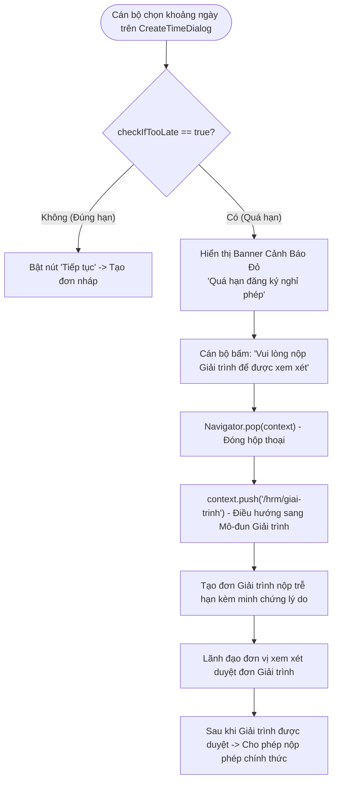
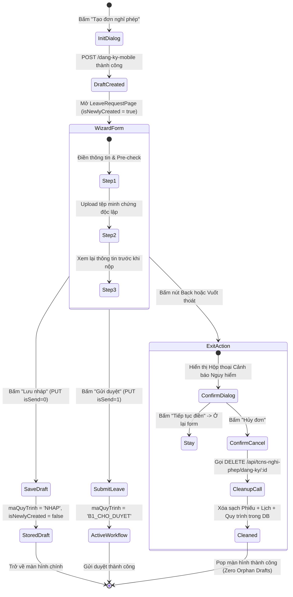

# TÀI LIỆU ĐẶC TẢ YÊU CẦU KỸ THUẬT PHÂN HỆ NGHỈ PHÉP (LEAVE MANAGEMENT)
# (04_REQUIREMENT_PACK_LEAVE.md)

> **Dự án:** Ứng dụng di động MyHCMUT phục vụ Nhân sự Trường Đại học (MyHCMUT Mobile)  
> **Cơ quan chủ quản:** Trường Đại học Bách khoa – ĐHQG-HCM  
> **Sinh viên thực hiện:**  
> - Vũ Xuân Chính (MSSV: 2210392) — Core Mobile, SSO Ticket Bridge, Quản lý Nghỉ phép & Hồ sơ Cán bộ, FCM Notification Hub.  
> - Tống Duy Khang (MSSV: 2211467) — Phân hệ Văn phòng số iOffice (Văn bản đến/đi, PDF Viewer) & Quản lý Nhiệm vụ (Missions/Tasks).  
> **Giảng viên hướng dẫn:** ThS. Nguyễn Thanh Tùng  
> **Mốc thẩm định:** Gate 0 — Khóa Baseline Học thuật & Concurrency Hardening (Tháng 09/2026)  
> **Kho mã nguồn đối chiếu:**  
> - Mobile Client: `myhcmut-mobile` (Commit `161d5bb8`, nhánh `feat/leaveRequest`)  
> - Backend Server: `hrm-be` (Commit `38745a26`, nhánh `chinh-dev` / `refactor/check-trung-lich-advisory-lock`)  

---

## MỤC LỤC

1. [TỔNG QUAN HỆ THỐNG & PHẠM VI NGHIỆP VỤ](#1-tổng-quan-hệ-thống--phạm-vi-nghiệp-vụ)
2. [ĐẶC TẢ 10 USE CASES CHI TIẾT (UC-LEV-01 ĐẾN UC-LEV-10)](#2-đặc-tả-10-use-cases-chi-tiết-uc-lev-01-đến-uc-lev-10)
   - [UC-LEV-01: Xem Danh Sách Đơn & Quỹ Phép Tham Khảo](#uc-lev-01-xem-danh-sách-đơn--quỹ-phép-tham-khảo)
   - [UC-LEV-02: Khởi Tạo Đơn Nghỉ Phép Nháp Sơ Bộ](#uc-lev-02-khởi-tạo-đơn-nghỉ-phép-nháp-sơ-bộ)
   - [UC-LEV-03: Hoàn Thiện Form Wizard & Tiền Kiểm Tra Điều Kiện](#uc-lev-03-hoàn-thiện-form-wizard--tiền-kiểm-tra-điều-kiện)
   - [UC-LEV-04: Tải Lên & Quản Lý Minh Chứng Độc Lập](#uc-lev-04-tải-lên--quản-lý-minh-chứng-độc-lập)
   - [UC-LEV-05: Lưu Nháp Hoặc Gửi Duyệt Chính Thức](#uc-lev-05-lưu-nháp-hoặc-gửi-duyệt-chính-thức)
   - [UC-LEV-06: Hủy & Dọn Dẹp Đơn Nháp Mới Tạo Khi Thoát Form](#uc-lev-06-hủy--dọn-dẹp-đơn-nháp-mới-tạo-khi-thoát-form)
   - [UC-LEV-07: Chỉnh Sửa & Gửi Lại Đơn Bị Trả Về](#uc-lev-07-chỉnh-sửa--gửi-lại-đơn-bị-trả-về)
   - [UC-LEV-08: Thu Hồi Đơn Khi Đang Chờ Phê Duyệt](#uc-lev-08-thu-hồi-đơn-khi-đang-chờ-phê-duyệt)
   - [UC-LEV-09: Phê Duyệt Hoặc Từ Chối Đơn Nghỉ Phép](#uc-lev-09-phê-duyệt-hoặc-từ-chối-đơn-nghỉ-phép)
   - [UC-LEV-10: Phê Duyệt Nhiều Đơn Nghỉ Phép Hàng Loạt](#uc-lev-10-phê-duyệt-nhiều-đơn-nghỉ-phép-hàng-loạt)
3. [ĐẶC TẢ 12 BUSINESS RULES CHUẨN XÁC (BR-LEV-01 ĐẾN BR-LEV-12)](#3-đặc-tả-12-business-rules-chuẩn-xác-br-lev-01-đến-br-lev-12)
   - [BR-LEV-01: Ràng Buộc Thời Gian & Buổi Nghỉ Hợp Lệ](#br-lev-01-ràng-buộc-thời-gian--buổi-nghỉ-hợp-lệ)
   - [BR-LEV-02: Thuật Toán Tính Số Ngày Nghỉ Thực Tế & Lịch Công Tác](#br-lev-02-thuật-toán-tính-số-ngày-nghỉ-thực-tế--lịch-công-tác)
   - [BR-LEV-03: Thời Hạn Đăng Ký Trước & Quy Tắc Khung Giờ 8:00 / 11:00](#br-lev-03-thời-hạn-đăng-ký-trước--quy-tắc-khung-giờ-800--1100)
   - [BR-LEV-04: Xử Lý Đơn Trễ Hạn & Cơ Chế Chuyển Hướng Giải Trình](#br-lev-04-xử-lý-đơn-trễ-hạn--cơ-chế-chuyển-hướng-giải-trình)
   - [BR-LEV-05: Kiểm Soát Trùng Lịch & Giao Thức PostgreSQL Advisory Lock](#br-lev-05-kiểm-soát-trùng-lịch--giao-thức-postgresql-advisory-lock)
   - [BR-LEV-06A: Kiến Trúc Tải Tệp Độc Lập 2 Bước](#br-lev-06a-kiến-trúc-tải-tệp-độc-lập-2-bước)
   - [BR-LEV-06B: Vòng Đời Dọn Dẹp Nháp Mồ Côi Chủ Động (isNewlyCreated)](#br-lev-06b-vòng-đời-dọn-dẹp-nháp-mồ-côi-chủ-động-isnewlycreated)
   - [BR-LEV-07: Chống Gửi Duyệt Lặp Bằng Atomic State Guard](#br-lev-07-chống-gửi-duyệt-lặp-bằng-atomic-state-guard)
   - [BR-LEV-08: Ràng Buộc Nhập Diễn Giải Bắt Buộc Cho Lý Do 'Khác'](#br-lev-08-ràng-buộc-nhập-diễn-giải-bắt-buộc-cho-lý-do-khác)
   - [BR-LEV-09: Thẩm Quyền Sở Hữu, Chỉnh Sửa & Thu Hồi Đơn](#br-lev-09-thẩm-quyền-sở-hữu-chỉnh-sửa--thu-hồi-đơn)
   - [BR-LEV-10: Chuẩn Hóa Trạng Thái Hiển Thị Từ Chối Thống Nhất](#br-lev-10-chuẩn-hóa-trạng-thái-hiển-thị-từ-chối-thống-nhất)
   - [BR-LEV-11: Quỹ Phép Năm, Phép Tồn, Thâm Niên & Khóa Trừ Hàng CSDL](#br-lev-11-quỹ-phép-năm-phép-tồn-thâm-niên--khóa-trừ-hàng-csdl)
   - [BR-LEV-12: Nguyên Tử Hóa Thao Tác Xóa Đơn & Đồng Bộ Lịch Cá Nhân](#br-lev-12-nguyên-tử-hóa-thao-tác-xóa-đơn--đồng-bộ-lịch-cá-nhan)
4. [THIẾT KẾ KIẾN TRÚC KỸ THUẬT CHUYÊN SÂU](#4-thiết-kế-kiến-trúc-kỹ-thuật-chuyên-sâu)
   - [4.1. Kiến Trúc Tải Minh Chứng 2 Bước Độc Lập](#41-kiến-trúc-tải-minh-chứng-2-bước-độc-lập)
   - [4.2. Kiểm Soát Tương Tranh Bằng PostgreSQL Advisory Lock](#42-kiểm-soát-tương-tranh-bằng-postgresql-advisory-lock)
   - [4.3. Cơ Chế Điều Hướng Giải Trình Quá Hạn (/hrm/giai-trinh)](#43-cơ-chế-điều-hướng-giải-trình-quá-hạn-hrmgiai-trinh)
   - [4.4. Cơ Chế Vòng Đời Nháp & Dọn Dẹp Bản Nháp Mồ Côi (isNewlyCreated)](#44-cơ-chế-vòng-đời-nháp--dọn-dẹp-bản-nháp-mồ-côi-isnewlycreated)
5. [MA TRẬN TRUY VẾT & CHỈ SỐ KIỂM THỬ TỰ ĐỘNG (243 TESTS)](#5-ma-trận-truy-vết--chỉ-số-kiểm-thử-tự-động-243-tests)
   - [5.1. Bảng Phân Bổ 232 Kiểm Thử Mobile (modules/hrm)](#51-bảng-phân-bổ-232-kiểm-thử-mobile-moduleshrm)
   - [5.2. Bảng Phân Bổ 11 Kiểm Thử Backend Concurrency Hardening](#52-bảng-phân-bổ-11-kiểm-thử-backend-concurrency-hardening)
   - [5.3. Ma Trận Ánh Xạ Kiểm Thử Tương Ứng Use Cases & Business Rules](#53-ma-trận-truy-vết-tương-ứng-use-cases--business-rules)
6. [TUÂN THỦ AUDIT BOUNDARIES & RANH GIỚI TUYÊN BỐ HỌC THUẬT](#6-tuân-thủ-audit-boundaries--ranh-giới-tuyên-bố-học-thuật)

---

## 1. TỔNG QUAN HỆ THỐNG & PHẠM VI NGHIỆP VỤ

Phân hệ **Quản lý Nghỉ phép (Time-off / Leave Management)** là một trong ba trụ cột nghiệp vụ cốt lõi của ứng dụng di động MyHCMUT phục vụ Nhân sự Trường Đại học Bách khoa – ĐHQG-HCM. Phân hệ được thiết kế nhằm số hóa toàn diện quy trình xin nghỉ phép, kiểm duyệt qua nhiều cấp hành chính, quản lý hạn mức quỹ phép năm và bảo đảm toàn vẹn lịch cá nhân của cán bộ viên chức.

### 1.1. Kiến Trúc Mô-đun & Phân Tách Trách Nhiệm
Hệ thống tuân thủ kiến trúc chia tách rạch ròi giữa ứng dụng khách (Mobile Client) và máy chủ dịch vụ (Backend API):
- **Mobile Client (`myhcmut-mobile`):** Phát triển trên nền Flutter SDK `3.41.5`, áp dụng mô hình phân tách tầng nghiêm ngặt (Clean Architecture / Feature-First) với bộ quản lý trạng thái Reactive Riverpod 2.x.
- **Backend API (`hrm-be`):** Phát triển trên nền Node.js `v22.22.2`, TypeScript `5.x`, Express.js và Sequelize ORM kết nối cơ sở dữ liệu PostgreSQL `14.x`.
- **Hệ cơ chế bảo vệ:** Kết hợp PostgreSQL Transaction-level Advisory Lock (`pg_advisory_xact_lock`), Atomic State Guard và phân quyền theo Role-Based Access Control (RBAC).

### 1.2. Danh Mục Quyền Hạn (Permissions)
Quy trình nghiệp vụ nghỉ phép được phân định qua 3 nhóm quyền chính trong CSDL:
1. `CN_NGHI_PHEP.PERMISSION` (`tcnsNghiPhepDangKy:write` / `user:login`): Quyền dành cho cán bộ cá nhân khởi tạo đơn, nộp đơn, xem đơn của chính mình, tải file và thu hồi đơn.
2. `DV_NGHI_PHEP.READ.PERMISSION` / `DV_NGHI_PHEP.WRITE.PERMISSION`: Quyền dành cho Lãnh đạo Đơn vị (Trưởng Khoa, Trưởng Bộ môn, Trưởng Phòng) phê duyệt hoặc trả lời đơn của cán bộ trong đơn vị.
3. `TCNS_NGHI_PHEP.READ.PERMISSION` / `TCNS_NGHI_PHEP.WRITE.PERMISSION`: Quyền dành cho Chuyên viên Ban/Phòng Tổ chức - Cán bộ (TCCB) kiểm tra, xác nhận và hoàn tất quy trình trừ quỹ phép năm.

---

## 2. ĐẶC TẢ 10 USE CASES CHI TIẾT (UC-LEV-01 ĐẾN UC-LEV-10)



---

### UC-LEV-01: Xem Danh Sách Đơn & Quỹ Phép Tham Khảo
* **Mã Use Case:** `UC-LEV-01`
* **Tác tử chính (Primary Actor):** Cán bộ viên chức (Người dùng đã đăng nhập).
* **Mô tả vắn tắt:** Cán bộ xem thẻ tóm tắt quỹ phép năm hiện tại (tổng số ngày, đã nghỉ, đang đăng ký, số ngày khả dụng) và danh sách các đơn nghỉ phép theo từng trạng thái (Tất cả, Chờ duyệt, Đã duyệt, Từ chối, Nháp, Đã thu hồi).
* **Tiền điều kiện (Preconditions):** Cán bộ đã đăng nhập thành công vào ứng dụng MyHCMUT Mobile và có tài khoản cán bộ hợp lệ trên phân hệ HRM.
* **Hậu điều kiện (Postconditions):** Thông tin quỹ phép và danh sách đơn được hiển thị đầy đủ và lưu vào bộ nhớ đệm Riverpod SWR cache.
* **Luồng sự kiện chính (Main Flow):**
  1. Cán bộ điều hướng đến tab Quản lý Nghỉ phép (`LeaveManagementScreen`).
  2. Hệ thống đồng thời kích hoạt 2 truy vấn qua Riverpod:
     - `getLeaveSummaryListProvider` gọi endpoint `GET /api/tcns-nghi-phep/so-nghi-phep-nam`.
     - `getGeneralLeaveProvider` gọi endpoint `GET /api/tcns-nghi-phep/dang-ky/all`.
  3. Widget `VacationBalanceWidget` tính toán số ngày còn lại theo công thức:
     $$\text{remaining} = \text{total} - (\text{used} + \text{otherPending})$$
  4. Hệ thống render danh sách các thẻ đơn nghỉ phép (`LeaveCardWidget`) tương ứng với năm và bộ lọc trạng thái được chọn (`selectedYearProvider`, `selectedFilterProvider`).
* **Luồng ngoại lệ (Alternative / Exception Flows):**
  - *Mất kết nối mạng hoặc phiên hết hạn:* Hệ thống hiển thị thông báo lỗi thân thiện (`leave_skeleton_loading.dart`) và nút "Thử lại".
  - *Không có dữ liệu quỹ phép:* Mặc định hiển thị tổng số ngày là 0, không làm crash giao diện (`orElse: () => LeaveSummary(...)`).
* **Ánh xạ Mã nguồn & Kiểm thử:**
  - UI Mobile: `modules/hrm/lib/src/time_off/views/pages/leave_management_screen.dart`, `views/widgets/filters/vacation_balance_widget.dart`, `views/widgets/cards_list/leave_card_widget.dart`.
  - Backend API: `GET /api/tcns-nghi-phep/so-nghi-phep-nam` và `GET /api/tcns-nghi-phep/dang-ky/all` (`tcns_nghi_phep/controller.ts: L620`).
  - Kiểm thử: `leave_balance_and_late_test.dart` (TC-LB-01..04), `widget_badge_test.dart`.

---

### UC-LEV-02: Khởi Tạo Đơn Nghỉ Phép Nháp Sơ Bộ
* **Mã Use Case:** `UC-LEV-02`
* **Tác tử chính:** Cán bộ viên chức.
* **Mô tả vắn tắt:** Cán bộ mở hộp thoại chọn khoảng thời gian (`CreateTimeDialog`), hệ thống tạo một bản ghi nháp sơ bộ trên máy chủ để sinh mã định danh `phieuId` và tạo bản ghi giữ chỗ trên lịch cá nhân.
* **Tiền điều kiện:** Cán bộ chọn khoảng ngày hợp lệ (`ngayBatDau <= ngayKetThuc`).
* **Hậu điều kiện:** Một bản ghi `tcns_nghi_phep_dang_ky` với `maQuyTrinh = 'NHAP'` và bản ghi tương ứng trong `tcns_lich_ca_nhan` được tạo nguyên tử trong CSDL. Ứng dụng điều hướng sang màn hình Wizard với cờ `isNewlyCreated = true`.
* **Luồng sự kiện chính:**
  1. Cán bộ nhấn nút "Tạo đơn nghỉ phép" trên màn hình chính hoặc chọn ngày trên lịch.
  2. Hộp thoại `CreateTimeDialog` hiển thị cho phép chọn: Ngày bắt đầu, Buổi bắt đầu (Sáng/Chiều), Ngày kết thúc, Buổi kết thúc (Sáng/Chiều), Hình thức nghỉ (Trong nước/Nước ngoài).
  3. Cán bộ nhấn "Tiếp tục". Phương thức `createLeave` trong `leaveControllerProvider` gửi payload lên máy chủ:
     `POST /api/upload/tcns-nghi-phep/dang-ky-mobile`.
  4. Máy chủ mở một CSDL Transaction, thực thi `acquireLeaveLock(shcc, transaction)`, kiểm tra trùng lịch `checkTrungLich`, tạo bản ghi đơn và lịch cá nhân, sau đó commit transaction và trả về `{ phieuId }`.
  5. Mobile Client nhận `phieuId`, nạp chi tiết đơn (`getLeaveDetailProvider(phieuId)`) và mở `LeaveRequestPage` với tham số `extra: {'phieuId': phieuId, 'isNewlyCreated': true}`.
* **Luồng ngoại lệ:**
  - *Khoảng thời gian bị trùng lịch cá nhân:* Máy chủ ném lỗi `ValidationError('TRUNG_LICH')`, rollback giao diện và hiển thị SnackBar cảnh báo thời gian bị xung đột.
  - *Ngày bắt đầu quá hạn (Overdue):* Nếu cán bộ chọn ngày rơi vào quá khứ hoặc không đủ số ngày báo trước, hộp thoại hiển thị cảnh báo trễ hạn và đề xuất chuyển sang phân hệ Giải trình (xem `UC-LEV-03` & `BR-LEV-04`).
* **Ánh xạ Mã nguồn & Kiểm thử:**
  - UI Mobile: `create_time_dialog.dart` (L500-670), `leave_management_screen.dart` (L364).
  - Backend API: `POST /api/upload/tcns-nghi-phep/dang-ky-mobile` (`tcns_nghi_phep/controller.ts: L198-274`).
  - Kiểm thử: `riverpod_providers_test.dart`, `acquire_leave_lock.unit.test.ts` (Backend).

---

### UC-LEV-03: Hoàn Thiện Form Wizard & Tiền Kiểm Tra Điều Kiện
* **Mã Use Case:** `UC-LEV-03`
* **Tác tử chính:** Cán bộ viên chức.
* **Mô tả vắn tắt:** Cán bộ trải qua Bước 1 của Wizard 3 bước trên `LeaveRequestPage`, hoàn thiện các trường thông tin: Loại nghỉ phép (Nghỉ phép năm, Nghỉ việc riêng, Nghỉ thai sản...), Ghi chú / Diễn giải, Thông tin người bàn giao công việc và Nơi nghỉ. Hệ thống gọi pre-check để đánh giá tính hợp lệ và cảnh báo trễ hạn.
* **Tiền điều kiện:** Bản nháp đã được sinh mã `phieuId` từ `UC-LEV-02` hoặc mở lại từ danh sách nháp.
* **Hậu điều kiện:** Dữ liệu Bước 1 được xác thực hợp lệ trên bộ nhớ cục bộ (`leaveRequestProvider`), sẵn sàng chuyển sang Bước 2.
* **Luồng sự kiện chính:**
  1. Cán bộ nhập các trường thông tin trong `LeaveRequestStep1`.
  2. Mobile tự động gọi hàm `calculateLeaveDays` để tính toán số ngày nghỉ trừ ngày Thứ 7, Chủ Nhật và ngày Lễ/Bù từ `getHolidaysProvider`.
  3. Cán bộ thay đổi ngày/giờ hoặc nhấn "Tiếp tục": Client gọi API tiền kiểm tra:
     `POST /api/tcns-nghi-phep/validate` với các thông số ngày, buổi, hình thức, số ngày nghỉ.
  4. Backend thực hiện:
     - `checkTrungLich` loại trừ chính `id` đang cập nhật.
     - So sánh với cấu hình `tcns_setting` và lịch làm việc qua hàm `getEarliestAllowedStart`.
     - Phản hồi `{ isValid: true, isTooLate: boolean, label?: string }`.
  5. Nếu `isTooLate = false`, cho phép cán bộ trượt sang Bước 2 (Đính kèm minh chứng).
* **Luồng ngoại lệ:**
  - *Nộp trễ hạn (`isTooLate = true`):* Hệ thống hiển thị cảnh báo đỏ viền vàng tại bước 1 và yêu cầu bắt buộc nhập "Lý do nộp trễ hạn" trong phần thông tin bổ sung.
  - *Vi phạm ràng buộc ghi chú:* Nếu chọn lý do nghỉ '00' (Khác) mà để trống `ghiChu`, form báo lỗi "Vui lòng nhập lý do cụ thể".
* **Ánh xạ Mã nguồn & Kiểm thử:**
  - UI Mobile: `leave_request_page.dart`, `leave_request_step1.dart`, `dropdown_form.dart`.
  - Backend API: `POST /api/tcns-nghi-phep/validate` (`tcns_nghi_phep/controller.ts: L82-130`).
  - Kiểm thử: `calculate_day_test.dart`, `widget_form_validation_test.dart`.

---

### UC-LEV-04: Tải Lên & Quản Lý Minh Chứng Độc Lập
* **Mã Use Case:** `UC-LEV-04`
* **Tác tử chính:** Cán bộ viên chức.
* **Mô tả vắn tắt:** Cán bộ tải lên các tệp tài liệu minh chứng (PDF, hình ảnh PNG/JPEG/DOCX) tại Bước 2 của Wizard. Mỗi tệp được truyền tải và lưu trữ độc lập ngay tại thời điểm tải lên, bảo đảm đường truyền nhẹ nhàng và an toàn.
* **Tiền điều kiện:** Bản nháp đã có `phieuId` hợp lệ. Cán bộ sở hữu quyền ghi trên bản nháp (`checkPhieuOwnership`).
* **Hậu điều kiện:** Các tệp được lưu vào thư mục asset máy chủ và bảng `fw_file`; mảng `files` trong `tcns_nghi_phep_dang_ky` được cập nhật ID tệp mới.
* **Luồng sự kiện chính:**
  1. Tại Bước 2 (`LeaveRequestStep2`), cán bộ bấm "Chọn tệp đính kèm".
  2. Hệ thống mở bộ chọn tệp native thông qua thư viện `FilePicker`.
  3. Cán bộ chọn 1 hoặc nhiều tệp (tối đa kích thước quy định 20MB/file).
  4. Ứng dụng gọi `leaveControllerProvider.uploadLeaveFile(phieuId, file)`:
     - Gửi `POST /api/upload/tcns-nghi-phep/file?phieuId=:phieuId` kèm `multipart/form-data`.
  5. Máy chủ xác thực cán bộ là chủ đơn, lưu tệp vào đĩa cứng, tạo bản ghi `fw_file`, đồng thời cập nhật trường mảng `files = [...curFiles, file.id]`.
  6. Máy chủ trả về danh sách các tệp đã upload (`items: [{ id, fileName }]`).
  7. Mobile cập nhật danh sách thẻ tệp hiển thị (`FileCard`) kèm nút xem trước hoặc xóa.
* **Luồng ngoại lệ (Xóa tệp đính kèm):**
  - Cán bộ bấm biểu tượng Thùng rác trên `FileCard`.
  - Client gọi `leaveControllerProvider.deleteLeaveFile(phieuId, fileId)`:
    Gửi `DELETE /api/tcns-nghi-phep/file/:fileId` với body `{ phieuId }`.
  - Máy chủ xóa tệp vật lý, xóa bản ghi `fw_file` và gỡ ID khỏi mảng `files` của đơn.
* **Ánh xạ Mã nguồn & Kiểm thử:**
  - UI Mobile: `leave_request_step2.dart`, `file_card.dart`.
  - Backend API: `POST /api/upload/tcns-nghi-phep/file` (L636) và `DELETE /api/tcns-nghi-phep/file/:fileId` (L652).
  - Kiểm thử: `widget_form_validation_test.dart` (TC-WFV-06..08), Manual Staging E2E Scen 1.

---

### UC-LEV-05: Lưu Nháp Hoặc Gửi Duyệt Chính Thức
* **Mã Use Case:** `UC-LEV-05`
* **Tác tử chính:** Cán bộ viên chức.
* **Mô tả vắn tắt:** Cán bộ xem lại toàn bộ nội dung tại Bước 3 (`LeaveRequestStep3`) và lựa chọn một trong hai hành động: "Lưu nháp" (`isSend = 0`) để bổ sung sau, hoặc "Gửi duyệt" (`isSend = 1`) để chuyển sang hàng đợi xét duyệt của Lãnh đạo Đơn vị.
* **Tiền điều kiện:** Đơn đã điền đầy đủ các thông tin bắt buộc và các tệp đính kèm cần thiết.
* **Hậu điều kiện:**
  - Nếu `isSend = 0`: Đơn giữ nguyên trạng thái `maQuyTrinh = 'NHAP'`, cờ `_isNewlyCreated` chuyển thành `false`.
  - Nếu `isSend = 1`: Trạng thái đơn được nâng lên giai đoạn xét duyệt tiếp theo (ví dụ: `B1_CHO_DUYET`), cập nhật `ngayTao = Date.now()`, phát sự kiện Kafka thông báo tới Lãnh đạo Đơn vị.
* **Luồng sự kiện chính:**
  1. Cán bộ kiểm tra lại bảng tổng kết ngày nghỉ, người nhận bàn giao và danh sách file đính kèm.
  2. Cán bộ bấm "Gửi duyệt" (`isSend = 1`):
     Client gọi `leaveControllerProvider.updateLeave(phieuId, requestDto, 1)`.
  3. Client gửi HTTP request `PUT /api/upload/tcns-nghi-phep/dang-ky` với payload JSON chứa toàn bộ metadata và danh sách ID file.
  4. Máy chủ mở transaction:
     - Gọi `acquireLeaveLock(shcc, transaction)`.
     - Chạy `checkTrungLich` kiểm tra xung đột thời gian (loại trừ ID đơn hiện tại).
     - Kiểm tra không có giải trình đang chờ duyệt (`validateKhongCoGiaiTrinhChoDuyet`).
     - Kiểm tra quy tắc đăng ký trước (`validateDangKyTruoc`).
     - **Thực thi Atomic State Guard:**
       ```sql
       UPDATE tcns_nghi_phep_dang_ky 
       SET ... 
       WHERE id = :phieuId AND ma_quy_trinh = 'NHAP';
       ```
     - Cập nhật thời gian trên `tcns_lich_ca_nhan`.
     - Cập nhật quy trình luân chuyển qua `updateHistory` sang trạng thái của Bước 1 (`B1_CHO_DUYET`).
  5. Transaction được commit thành công. Máy chủ kích hoạt `transaction.afterCommit()` bắn message thông báo qua Kafka.
  6. Client nhận kết quả thành công, hiển thị thông báo "Gửi đơn nghỉ phép thành công", vô hiệu hóa các bộ đệm (`invalidate`) và quay trở lại màn hình danh sách.
* **Luồng ngoại lệ:**
  - *Vi phạm Atomic Guard (Trạng thái đơn đã bị thay đổi đồng thời):* Câu lệnh `UPDATE` trả về 0 bản ghi ảnh hưởng. Máy chủ lập tức ném lỗi `ValidationError('Trạng thái phiếu đăng ký không phù hợp hoặc đã bị thay đổi')` và rollback transaction.
* **Ánh xạ Mã nguồn & Kiểm thử:**
  - UI Mobile: `leave_request_step3.dart`, `leave_request_page.dart` (L450-550).
  - Backend API: `PUT /api/upload/tcns-nghi-phep/dang-ky` (`tcns_nghi_phep/controller.ts: L276-358`).
  - Kiểm thử: `concurrency_race_condition.unit.test.ts` (Case 3: Atomic Guard), `leave_request_model_test.dart`.

---

### UC-LEV-06: Hủy & Dọn Dẹp Đơn Nháp Mới Tạo Khi Thoát Form
* **Mã Use Case:** `UC-LEV-06`
* **Tác tử chính:** Cán bộ viên chức.
* **Mô tả vắn tắt:** Khi cán bộ khởi tạo đơn mới (`isNewlyCreated = true`) nhưng sau đó nhấn nút Back hoặc thoát khỏi màn hình tạo đơn mà không bấm Lưu nháp hay Gửi duyệt, hệ thống kích hoạt hộp thoại xác nhận nguy hiểm và tự động gọi lệnh dọn sạch bản ghi nháp trên máy chủ, ngăn chặn rác CSDL (Zero Orphan Drafts).
* **Tiền điều kiện:** Màn hình `LeaveRequestPage` đang mở với cờ `_isNewlyCreated == true` và `widget.phieuId != null`.
* **Hậu điều kiện:** Bản ghi đơn trong `tcns_nghi_phep_dang_ky`, lịch cá nhân trong `tcns_lich_ca_nhan` và các bước quy trình tạm được xóa hoàn toàn khỏi cơ sở dữ liệu.
* **Luồng sự kiện chính:**
  1. Cán bộ nhấn nút quay lại (Back Icon) trên AppBar hoặc vuốt cử chỉ Back hệ thống.
  2. Hàm `_handleExit()` chặn sự kiện `PopScope` và hiển thị hộp thoại cảnh báo cấp độ nguy hiểm (`_showExitWarningDialog` với `AppDialogType.danger`):
     > *"Đơn nghỉ phép này chưa được lưu. Nếu thoát, bản nháp và toàn bộ tệp đính kèm sẽ bị xóa hoàn toàn. Bạn có chắc chắn muốn hủy không?"*
  3. Cán bộ bấm nút "Hủy đơn":
  4. Mobile kích hoạt lệnh gọi máy chủ ngầm:
     `leaveControllerProvider.deleteLeave(widget.phieuId!)` tương ứng `DELETE /api/tcns-nghi-phep/dang-ky/:id`.
  5. Máy chủ thực hiện xóa nguyên tử trong transaction:
     - Lấy khóa Advisory Lock `acquireLeaveLock(shcc, transaction)`.
     - Xóa `tcns_nghi_phep_dang_ky` (`WHERE id = :id AND ma_quy_trinh = 'NHAP'`).
     - Xóa `tcns_lich_ca_nhan` tương ứng `phieuId`.
     - Xóa các bản ghi quy trình tạm `tcns_quy_trinh`, `tcns_quy_trinh_history`, `tcns_quy_trinh_user`.
     - Commit transaction.
  6. Client vô hiệu hóa bộ đệm danh sách (`ref.invalidate(...)`) và cho phép pop thoát khỏi màn hình.
* **Luồng ngoại lệ:**
  - *Cán bộ bấm "Tiếp tục điền":* Hộp thoại đóng lại, giữ nguyên trạng thái form và dữ liệu nhập.
  - *Đơn mở từ danh sách bản nháp cũ (`_isNewlyCreated = false`):* Hệ thống chỉ hiển thị hộp thoại cảnh báo thông thường (`AppDialogType.warning`) và KHÔNG gọi lệnh xóa đơn khi thoát.
* **Ánh xạ Mã nguồn & Kiểm thử:**
  - UI Mobile: `leave_request_page.dart` (L49-113: `_showExitWarningDialog`, `_handleExit`).
  - Backend API: `DELETE /api/tcns-nghi-phep/dang-ky/:id` (`tcns_nghi_phep/controller.ts: L360-390`).
  - Kiểm thử: `leave_request_model_test.dart`, `acquire_leave_lock.unit.test.ts`.

---

### UC-LEV-07: Chỉnh Sửa & Gửi Lại Đơn Bị Trả Về
* **Mã Use Case:** `UC-LEV-07`
* **Tác tử chính:** Cán bộ viên chức.
* **Mô tả vắn tắt:** Cán bộ mở một đơn nghỉ phép đã bị cấp trên từ chối / trả về yêu cầu bổ sung thông tin (trạng thái `TRA_LAI`), chỉnh sửa lại nội dung, đính kèm thêm minh chứng và gửi lại để cấp trên xem xét.
* **Tiền điều kiện:** Đơn có trạng thái quy trình hiện tại là `TRA_LAI` hoặc mục tiêu chuyển tiếp có `trangThai == 'GUI_LAI'`. Cán bộ là chủ sở hữu của đơn.
* **Hậu điều kiện:** Đơn được cập nhật nội dung mới, trạng thái chuyển tiếp về cấp quản lý có thẩm quyền xét duyệt lại.
* **Luồng sự kiện chính:**
  1. Cán bộ mở màn hình chi tiết đơn (`LeaveViewDetail`).
  2. Giao diện nhận diện trạng thái `TRA_LAI`, hiển thị lý do trả về của lãnh đạo và nút hành động "Chỉnh sửa đơn".
  3. Cán bộ bấm nút "Chỉnh sửa đơn": Mở `LeaveRequestPage` với tham số `isNewlyCreated = false`.
  4. Cán bộ cập nhật các trường thông tin hoặc tải thêm minh chứng tại Bước 2.
  5. Cán bộ bấm "Gửi lại" tại Bước 3:
     Client gửi `PUT /api/upload/tcns-nghi-phep/dang-ky` với cờ `isSend = 1`.
  6. Máy chủ chạy quy trình kiểm tra:
     - Lấy Advisory Lock.
     - Kiểm tra `checkTrungLich`: Tham số `id = phieuId` giúp thuật toán tự động bỏ qua chính khoảng thời gian của đơn này, không gây báo lỗi tự trùng lịch.
     - Hàm `checkPhieuOwnership` xác nhận quyền sở hữu và kiểm tra `targets.find(i => i.trangThai == 'GUI_LAI')`.
     - Cập nhật dữ liệu đơn, lịch cá nhân và chuyển tiếp trạng thái quy trình.
  7. Commit transaction, gửi thông báo cập nhật tới lãnh đạo.
* **Ánh xạ Mã nguồn & Kiểm thử:**
  - UI Mobile: `leave_view_detail.dart` (L390-415), `leave_request_page.dart`.
  - Backend API: `PUT /api/upload/tcns-nghi-phep/dang-ky` (L276-358).
  - Kiểm thử: `check_overlap_test.dart`, `concurrency_race_condition.unit.test.ts` (Case 1).

---

### UC-LEV-08: Thu Hồi Đơn Khi Đang Chờ Phê Duyệt
* **Mã Use Case:** `UC-LEV-08`
* **Tác tử chính:** Cán bộ viên chức.
* **Mô tả vắn tắt:** Cán bộ chủ động rút lại đơn nghỉ phép đã nộp khi đơn đang trong trạng thái chờ duyệt (chưa có quyết định phê duyệt cuối cùng). Khi thu hồi thành công, lịch nghỉ cá nhân trên hệ thống lập tức được giải phóng.
* **Tiền điều kiện:** Đơn đang ở trạng thái chờ duyệt (ví dụ: `B1_CHO_DUYET`, `B2_CHO_DUYET`) và chưa bước vào trạng thái `KET_THUC` hay `TU_CHOI`.
* **Hậu điều kiện:** Trạng thái đơn chuyển thành `THU_HOI`. Bản ghi tương ứng trong `tcns_lich_ca_nhan` bị xóa hoàn toàn.
* **Luồng sự kiện chính:**
  1. Cán bộ mở màn hình chi tiết đơn (`LeaveViewDetail`).
  2. Hệ thống kiểm tra điều kiện hiển thị: nếu cán bộ là chủ đơn và quy trình cho phép thu hồi, nút "Thu hồi đơn" hiển thị.
  3. Cán bộ bấm "Thu hồi đơn", nhập lý do thu hồi vào dialog xác nhận.
  4. Client gọi `leaveControllerProvider.recallLeave(...)`:
     `POST /api/tcns-nghi-phep/user-phase` với payload `{ phieuId, maQuyTrinhBefore, maQuyTrinh, trangThai: 'THU_HOI', ghiChu }`.
  5. Máy chủ xác thực:
     - Kiểm tra `phieu.shcc == user.shcc`.
     - Kiểm tra `phieu.maQuyTrinh == data.maQuyTrinhBefore`.
     - Kiểm tra mục tiêu quy trình hợp lệ cho người tạo đơn (`target.isCreateUser`).
     - Gọi `updateHistory` ghi nhận lịch sử chuyển trạng thái `THU_HOI`.
     - Thực thi xóa lịch cá nhân:
       ```typescript
       if (data.trangThai == 'THU_HOI') {
           await app.model.tcnsLichCaNhan.delete({ phieuId: data.phieuId, phanLoai: 'NGHI_PHEP' });
       }
       ```
  6. Client cập nhật huy hiệu trạng thái thành "Đã thu hồi" (`LeaveStatusBadge`), làm mới danh sách đơn.
* **Ánh xạ Mã nguồn & Kiểm thử:**
  - UI Mobile: `leave_view_detail.dart`, `leave_provider.dart` (`recallLeave`).
  - Backend API: `POST /api/tcns-nghi-phep/user-phase` (`tcns_nghi_phep/controller.ts: L392-417`).
  - Kiểm thử: `widget_badge_test.dart`, Manual Staging E2E Scen 1.

---

### UC-LEV-09: Phê Duyệt Hoặc Từ Chối Đơn Nghỉ Phép
* **Mã Use Case:** `UC-LEV-09`
* **Tác tử chính:** Lãnh đạo Đơn vị (Trưởng Khoa, Trưởng Bộ môn) hoặc Chuyên viên Ban TCCB.
* **Mô tả vắn tắt:** Cấp có thẩm quyền xem xét đơn nghỉ phép của cấp dưới, kiểm tra lịch sử xung đột công tác của đơn vị, sau đó ra quyết định "Phê duyệt", "Từ chối" hoặc "Trả lại yêu cầu chỉnh sửa".
* **Tiền điều kiện:** Cán bộ quản lý có quyền duyệt trên quy trình (`DV_NGHI_PHEP` hoặc `TCNS_NGHI_PHEP`), đơn đang nằm ở bước quy trình chờ người này xử lý.
* **Hậu điều kiện:** Quy trình được chuyển sang bước tiếp theo hoặc kết thúc. Nếu là phê duyệt bước cuối (`KET_THUC`), quỹ phép năm của nhân viên bị trừ chính thức thông qua khóa dòng CSDL.
* **Luồng sự kiện chính:**
  1. Lãnh đạo mở màn hình chi tiết đơn cần duyệt từ thông báo FCM hoặc tab "Duyệt nghỉ phép".
  2. Màn hình hiển thị danh sách cán bộ khác trong đơn vị có khoảng thời gian nghỉ trùng lặp (`listOverlap`) được tính toán từ backend để lãnh đạo cân đối nhân sự.
  3. Lãnh đạo lựa chọn hành động:
     - **Phê duyệt (`APPROVED`):** Gửi `POST /api/tcns/quy-trinh/approved`.
     - **Từ chối (`REJECTED`):** Nhập lý do từ chối và gửi `POST /api/tcns/quy-trinh/rejected`.
     - **Trả lại (`TRA_LAI`):** Nhập yêu cầu bổ sung và chuyển đơn về cho người tạo.
  4. Máy chủ thực thi cập nhật lịch sử `tcns_quy_trinh_history`.
  5. Nếu bước duyệt đạt trạng thái kết thúc (`isEnd = true` / `maQuyTrinh = 'KET_THUC'`), Stored Procedure `tcns_nghi_phep_dang_ky_insert` được kích hoạt, thực thi khóa dòng `SELECT FOR UPDATE` trên `tcns_so_nghi_phep_nam` để trừ số ngày phép khả dụng một cách an toàn tuyệt đối.
  6. Bắn thông báo kết quả xét duyệt qua Kafka đến thiết bị của cán bộ nộp đơn.
* **Ánh xạ Mã nguồn & Kiểm thử:**
  - UI Mobile: `leave_view_detail.dart`, `popup_workflow_buttons_test.dart`.
  - Backend API: `POST /api/tcns/quy-trinh/approved` và `POST /api/tcns/quy-trinh/rejected` (`tcns_quy_trinh/controller.ts`).
  - Kiểm thử: `admin_tccb_actions_test.dart`, `approve_time_off_test.dart`, Manual Staging E2E Scen 1.

---

### UC-LEV-10: Phê Duyệt Nhiều Đơn Nghỉ Phép Hàng Loạt
* **Mã Use Case:** `UC-LEV-10`
* **Tác tử chính:** Lãnh đạo Đơn vị.
* **Mô tả vắn tắt:** Lãnh đạo tích chọn nhiều đơn nghỉ phép đang chờ duyệt cùng lúc và thực hiện thao tác "Phê duyệt hàng loạt" thông qua thanh thao tác động `AppBatchActionBar`.
* **Tiền điều kiện:** Lãnh đạo có quyền phê duyệt trên danh sách các đơn được chọn.
* **Hậu điều kiện:** Các đơn hợp lệ được chuyển trạng thái phê duyệt; hệ thống tự động refetch lại danh sách và báo cáo kết quả chi tiết.
* **Luồng sự kiện chính:**
  1. Tại màn hình danh sách chờ duyệt, lãnh đạo nhấn giữ hoặc bấm biểu tượng chọn nhiều để kích hoạt chế độ Selection Mode.
  2. Lãnh đạo tích chọn các đơn cần duyệt (hiển thị số lượng đã chọn trên `AppBatchActionBar`).
  3. Lãnh đạo nhấn nút "Duyệt tất cả đã chọn" trên thanh batch bar.
  4. Mobile Client kích hoạt phương thức xử lý hàng loạt:
     - Gửi tuần tự hoặc theo lô yêu cầu `POST /api/tcns/quy-trinh/approved` lên máy chủ.
     - Backend xử lý theo cơ chế **Per-Item Commit (Fail-Stop)**: Mỗi đơn được xử lý trong một transaction độc lập. Nếu một đơn gặp lỗi (ví dụ: đã bị thu hồi trước đó), hệ thống ghi nhận lỗi trên đơn đó và tiếp tục xử lý các đơn còn lại.
  5. Sau khi hoàn tất vòng lặp, Client gọi `ref.invalidate(...)` để đồng bộ lại toàn bộ danh sách và hiển thị SnackBar tổng kết (ví dụ: "Đã duyệt thành công 5/5 đơn").
* **Ánh xạ Mã nguồn & Kiểm thử:**
  - UI Mobile: `packages/core/global_system/lib/src/widgets/app_batch_action_bar.dart`, `modules/hrm/lib/src/time_off/views/pages/leave_management_screen.dart`.
  - Core Tests: `packages/core/global_system/test/app_batch_action_bar_test.dart` (3 tests).
  - Module Tests: `approve_time_off_test.dart`, Manual Staging E2E Scen 1.

---

## 3. ĐẶC TẢ 12 BUSINESS RULES CHUẨN XÁC (BR-LEV-01 ĐẾN BR-LEV-12)

### BR-LEV-01: Ràng Buộc Thời Gian & Buổi Nghỉ Hợp Lệ
* **Phạm vi nghiệp vụ:** Toàn bộ quá trình chọn thời gian đăng ký nghỉ phép.
* **Mô tả chi tiết:**
  - Ngày bắt đầu (`ngayBatDau`) phải luôn nhỏ hơn hoặc bằng Ngày kết thúc (`ngayKetThuc`):
    $$\text{ngayBatDau} \le \text{ngayKetThuc}$$
  - Trong trường hợp đăng ký nghỉ trong cùng một ngày (`sameDay(startDate, endDate) == true`):
    - Không cho phép bắt đầu vào buổi **Chiều** (`CHIEU`) và kết thúc vào buổi **Sáng** (`SANG`).
    - Nếu vi phạm, hệ thống phải chặn ngay tại tầng giao diện với thông báo: *"Thời gian không hợp lệ"*.
    - Nếu bắt đầu Sáng và kết thúc Sáng: Tính $0.5$ ngày.
    - Nếu bắt đầu Chiều và kết thúc Chiều: Tính $0.5$ ngày.
    - Nếu bắt đầu Sáng và kết thúc Chiều: Tính $1.0$ ngày.
* **Hiện thực mã nguồn:**
  - Mobile: `modules/hrm/lib/src/time_off/utils/calculate_day.dart` (L27-31).
  - Backend: `modules/md_tcns/tcns_nghi_phep/controller.ts` (kiểm tra khoảng timestamp).
* **Bằng chứng kiểm thử:** `calculate_day_test.dart` (test case *Throws exception when start afternoon and end morning on same day*).

---

### BR-LEV-02: Thuật Toán Tính Số Ngày Nghỉ Thực Tế & Lịch Công Tác
* **Phạm vi nghiệp vụ:** Tính toán số ngày phép trừ vào quỹ phép năm.
* **Mô tả chi tiết:**
  - Số ngày nghỉ chỉ tính trên **ngày làm việc thực tế (Effective Workdays)**:
    - Bỏ qua ngày Thứ Bảy (`weekday == DateTime.saturday`) và Chủ Nhật (`weekday == DateTime.sunday`).
    - Bỏ qua các ngày nghỉ Lễ toàn quốc theo danh mục CSDL `dm_ngay_le` (Tết Nguyên Đán, Giỗ Tổ Hùng Vương, 30/4 - 1/5, Quốc khánh...).
    - **Ngoại lệ ngày làm bù (`ngayBu`):** Nếu ngày Thứ Bảy/Chủ Nhật trùng với ngày làm việc bù do Nhà nước hoặc Nhà trường quy định, ngày đó vẫn được tính là 1 ngày làm việc bình thường.
  - Hệ số buổi nghỉ:
    - Buổi bắt đầu Sáng: hệ số ngày đầu = $1.0$; Buổi bắt đầu Chiều: hệ số ngày đầu = $0.5$.
    - Buổi kết thúc Sáng: hệ số ngày cuối = $0.5$; Buổi kết thúc Chiều: hệ số ngày cuối = $1.0$.
  - Trừ định mức theo chế độ lý do nghỉ:
    $$\text{soNgayThucNghi} = \max\left(0, \; \text{total} - \text{reason.ngayNghi}\right)$$
    *(Ví dụ: Nghỉ kết hôn được hưởng 3 ngày nguyên lương theo Luật Lao động, nếu cán bộ xin nghỉ 5 ngày thì số ngày thực trừ quỹ phép năm chỉ là $5 - 3 = 2$ ngày).*
* **Hiện thực mã nguồn:**
  - Mobile: `calculate_day.dart` (L33-67: hàm `calculateLeaveDays`).
  - Backend: `modules/md_tcns/tcns_nghi_phep/helper.ts` (L48-64: `isEffectiveWorkday`, `addWorkdays`).
* **Bằng chứng kiểm thử:** `calculate_day_test.dart` (9 test cases kiểm tra bù lễ, cuối tuần, nửa ngày).

---

### BR-LEV-03: Thời Hạn Đăng Ký Trước & Quy Tắc Khung Giờ 8:00 / 11:00
* **Phạm vi nghiệp vụ:** Xác định hạn nộp đơn hợp lệ trước ngày bắt đầu nghỉ.
* **Mô tả chi tiết:**
  - Căn cứ theo các tham số hệ thống lưu trong bảng CSDL `tcns_setting` (tuyệt đối không viện dẫn văn bản hành chính không có thật):
    - Đơn nghỉ phép trong nước dưới 5 ngày: Ngưỡng quy định là **2 ngày làm việc** (`ngayDKPhepTrongNuoc`, hằng số `THRESHOLD_SHORT = 2`).
    - Đơn nghỉ phép đi nước ngoài (`hinhThuc == 'NN'`) HOẶC nghỉ dài hạn từ 5 ngày trở lên (`soNgayNghi >= 5`): Ngưỡng quy định là **3 ngày làm việc** (`ngayDKPhepNuocNgoai`, hằng số `THRESHOLD_LONG = 3`).
  - **Quy tắc trượt mốc giờ làm việc (Threshold Hour Shifting):** Thời điểm nộp đơn trong ngày được phân đoạn theo các mốc:
    1. **Nộp trước 08:00:** Tính trọn vẹn từ ngày hiện tại; ngày bắt đầu sớm nhất cho phép là sau đúng `threshold` ngày làm việc, bắt đầu từ buổi **Sáng**.
    2. **Nộp từ 08:00 đến trước 11:00:** Do buổi sáng ngày hiện tại đã bắt đầu, ngày bắt đầu sớm nhất sau `threshold` ngày làm việc chỉ được tính từ buổi **Chiều**.
    3. **Nộp từ 11:00 trở đi:** Hết nửa ngày làm việc đầu tiên; mốc bắt đầu sớm nhất bị đẩy lùi thêm 1 ngày làm việc:
       $$\text{threshold}_{\text{effective}} = \text{threshold} + 1$$
       và bắt đầu từ buổi **Sáng**.
* **Hiện thực mã nguồn:**
  - Mobile: `calculate_day.dart` (L152-177: `getEarliestAllowedStart`), `leave_balance_and_late_test.dart`.
  - Backend: `helper.ts` (L66-85: `getEarliestAllowedStart`).
* **Bằng chứng kiểm thử:** `leave_balance_and_late_test.dart` (6 test cases kiểm tra ranh giới 7:59, 8:00, 11:00 và so sánh cùng ngày).

---

### BR-LEV-04: Xử Lý Đơn Trễ Hạn & Cơ Chế Chuyển Hướng Giải Trình
* **Phạm vi nghiệp vụ:** Chặn nộp đơn trễ hạn trực tiếp và hướng dẫn sang phân hệ Giải trình.
* **Mô tả chi tiết:**
  - Khi một cán bộ chọn khoảng thời gian vi phạm quy tắc `BR-LEV-03` (`checkIfTooLate == true`):
    - Máy chủ từ chối việc nộp trực tiếp qua `POST /dang-ky` hoặc `PUT /dang-ky` nếu `isSend = 1`, ném lỗi `ValidationError`:
      > *"Phải đăng ký trước ít nhất [48 giờ (2 ngày làm việc) / 72 giờ (3 ngày làm việc)]. Trường hợp đã trễ, vui lòng sử dụng chức năng Giải trình."*
    - Trên Mobile Client tại hộp thoại `CreateTimeDialog`: Giao diện lập tức hiển thị Banner cảnh báo lỗi màu đỏ (`colorScheme.error`):
      > *"Quá hạn đăng ký nghỉ phép: Đã quá thời gian tạo đơn theo quy định. Vui lòng nộp Giải trình để được xem xét."*
    - Nút liên kết trên Dialog thực hiện đóng hộp thoại và **chuyển hướng trực tiếp cán bộ sang màn hình tạo giải trình** qua tuyến đường GoRouter:
      ```dart
      Navigator.pop(context);
      context.push('/hrm/giai-trinh');
      ```
  - **Quy tắc chặn xung đột kép:** Một cán bộ đang có hồ sơ giải trình nghỉ phép ở trạng thái `CHO_DUYET` thì hệ thống **tuyệt đối không cho phép đăng ký thêm đơn nghỉ phép mới** nhằm bảo đảm trật tự xét duyệt:
    `validateKhongCoGiaiTrinhChoDuyet(shcc)` kiểm tra bảng `tcns_giai_trinh`.
* **Hiện thực mã nguồn:**
  - Mobile: `create_time_dialog.dart` (L637-660), `hrm_features.dart` (L57: `/hrm/giai-trinh`).
  - Backend: `helper.ts` (L113-127), `controller.ts` (L149, L308).
* **Bằng chứng kiểm thử:** `leave_balance_and_late_test.dart` (TC-LT-01..06), `leave_request_model_test.dart`.

---

### BR-LEV-05: Kiểm Soát Trùng Lịch & Giao Thức PostgreSQL Advisory Lock
* **Phạm vi nghiệp vụ:** Bảo vệ tính toàn vẹn dữ liệu lịch cá nhân khi nhiều yêu cầu ghi xảy ra đồng thời.
* **Mô tả chi tiết:**
  - Không cho phép một cán bộ có 2 sự kiện rời vị trí làm việc trùng nhau trong bảng `tcns_lich_ca_nhan` (Nghỉ phép, Đi công tác, Đi đào tạo...).
  - **Giao thức khóa ứng dụng (Application Concurrency Protocol):**
    - Sử dụng hàm băm và khóa cấp transaction của PostgreSQL:
      ```sql
      SELECT pg_advisory_xact_lock(hashtext(:lockKey));
      ```
      với tiền tố khóa: `lockKey = 'tcns_lich_ca_nhan:' || shcc`.
    - Toàn bộ chuỗi thao tác `checkTrungLich` và `INSERT/UPDATE` bản ghi lịch phải chạy trong **cùng một Transaction CSDL**.
    - **Cơ chế chống Cyclic Deadlock:** Khi hàm khóa nhận danh sách nhiều `shcc` (đoàn công tác), danh sách phải được lọc duy nhất (`Set`) và sắp xếp thứ tự chuỗi tăng dần (`sort()`) trước khi xin khóa tuần tự:
      ```typescript
      const shccList = Array.isArray(shcc) ? [...new Set(shcc)].sort() : [shcc];
      ```
    - Khóa tự động giải phóng khi transaction kết thúc (Commit hoặc Rollback), không gây rò rỉ kết nối.
* **Hiện thực mã nguồn:**
  - Backend: `modules/md_tcns/tcns_nghi_phep/helper.ts` (L11-31: `acquireLeaveLock`), `modules/md_tcns/tcns_lich_ca_nhan/model/tcns_lich_ca_nhan.model.ts` (L68-87: lan truyền `options.transaction`).
* **Bằng chứng kiểm thử:** `acquire_leave_lock.unit.test.ts` (4/4 pass), `concurrency_race_condition.unit.test.ts` (Case 1 & Case 2: 7/7 pass).

---

### BR-LEV-06A: Kiến Trúc Tải Tệp Độc Lập 2 Bước
* **Phạm vi nghiệp vụ:** Quản lý tệp minh chứng đính kèm đơn nghỉ phép.
* **Mô tả chi tiết:**
  - Hệ thống áp dụng quy trình tải tệp phân tách 2 bước độc lập:
    - **Bước 1:** Tạo bản nháp sơ bộ (`POST /dang-ky-mobile`) để nhận định danh `phieuId`.
    - **Bước 2:** Mỗi tệp được truyền tải qua endpoint riêng biệt `POST /api/upload/tcns-nghi-phep/file?phieuId=:phieuId`.
  - Máy chủ kiểm tra quyền sở hữu bản nháp (`checkPhieuOwnership`) trước khi chấp nhận ghi tệp vào đĩa vật lý và bảng `fw_file`.
  - Danh sách ID tệp được lưu trong trường mảng JSON `files` của đơn.
  - Khi lưu đơn chính thức (`PUT /dang-ky`), client chỉ truyền payload metadata JSON và mảng ID tệp hiện hữu (`currFiles`), không phải upload lại toàn bộ tệp multipart.
* **Hiện thực mã nguồn:**
  - Mobile: `leave_provider.dart` (L179-218: `uploadLeaveFile`, `deleteLeaveFile`).
  - Backend: `tcns_nghi_phep/controller.ts` (L636-670).
* **Bằng chứng kiểm thử:** `widget_form_validation_test.dart` (TC-WFV-06..08).

---

### BR-LEV-06B: Vòng Đời Dọn Dẹp Nháp Mồ Côi Chủ Động (isNewlyCreated)
* **Phạm vi nghiệp vụ:** Dọn sạch dữ liệu nháp tạm thời khi người dùng hủy phiên tạo mới.
* **Mô tả chi tiết:**
  - Client gắn cờ trạng thái `isNewlyCreated = true` khi đơn vừa được tạo tự động từ `CreateTimeDialog`.
  - Nếu người dùng nhấn nút Back hoặc hủy bỏ phiên làm việc ở Bước 1, Bước 2 hoặc Bước 3:
    1. Client hiển thị hộp thoại cảnh báo nguy hiểm xác nhận hủy.
    2. Nếu người dùng xác nhận thoát, Client tự động kích hoạt API `DELETE /api/tcns-nghi-phep/dang-ky/:id`.
    3. Backend bọc thao tác xóa trong transaction kèm Advisory Lock, dọn sạch đồng thời bản ghi đơn, lịch cá nhân và quy trình tạm.
  - Nếu đơn được mở từ danh sách đơn nháp có sẵn (`isNewlyCreated = false`), thao tác thoát chỉ hủy các thay đổi chưa lưu trên form, **tuyệt đối không gọi lệnh xóa đơn**.
* **Hiện thực mã nguồn:**
  - Mobile: `modules/hrm/lib/src/time_off/views/pages/leave_request_page.dart` (L41, L50, L92, L118).
  - Backend: `tcns_nghi_phep/controller.ts` (L360-390).
* **Bằng chứng kiểm thử:** `leave_request_model_test.dart`, `acquire_leave_lock.unit.test.ts`.

---

### BR-LEV-07: Chống Gửi Duyệt Lặp Bằng Atomic State Guard
* **Phạm vi nghiệp vụ:** Đảm bảo tính lũy nghiệm (Idempotency) trên luồng nộp đơn và cập nhật đơn.
* **Mô tả chi tiết:**
  - Nhằm ngăn chặn hiện tượng người dùng nhấn đúp nút "Gửi duyệt" hoặc nhiều tiến trình song song cùng can thiệp sửa một đơn, câu lệnh cập nhật CSDL áp dụng mệnh đề điều kiện nguyên tử:
    ```sql
    UPDATE tcns_nghi_phep_dang_ky 
    SET ... 
    WHERE id = :phieuId AND ma_quy_trinh = :currentMaQuyTrinh;
    ```
  - Backend kiểm tra số dòng bị tác động (`affectedCount` / `updatedPhieu.length`):
    - Nếu trả về $0$ dòng (do đơn đã được gửi duyệt hoặc cấp trên đã chuyển trạng thái trước đó một phần nghìn giây), hệ thống lập tức rollback và ném lỗi:
      `ValidationError('Trạng thái phiếu đăng ký không phù hợp hoặc đã bị thay đổi')`.
  - Phía Mobile Client bổ sung cờ trạng thái `isSubmitting` để vô hiệu hóa nút bấm ngay khi vừa chạm.
* **Hiện thực mã nguồn:**
  - Backend: `tcns_nghi_phep/controller.ts` (L328-336).
* **Bằng chứng kiểm thử:** `concurrency_race_condition.unit.test.ts` (Case 3: Atomic Guard - 100% pass).

---

### BR-LEV-08: Ràng Buộc Nhập Diễn Giải Bắt Buộc Cho Lý Do 'Khác'
* **Phạm vi nghiệp vụ:** Tính đầy đủ của hồ sơ xin nghỉ phép.
* **Mô tả chi tiết:**
  - Khi cán bộ chọn loại lý do nghỉ có mã là `'00'` (Lý do Khác) hoặc các lý do đặc biệt yêu cầu thuyết minh theo danh mục HRM:
    - Trường "Nội dung ghi chú / Diễn giải" (`ghiChu`) là **bắt buộc nhập**.
    - Chuỗi nhập vào sau khi cắt khoảng trắng thừa (`trim()`) phải có độ dài tối thiểu $\ge 5$ ký tự.
    - Nếu để trống, Mobile Client chặn không cho chuyển sang Bước 2 và hiển thị thông báo lỗi đỏ dưới ô nhập liệu: *"Vui lòng nhập lý do cụ thể"*.
  - Với các lý do chuẩn đã có định mức rõ ràng (Nghỉ phép năm thông thường, Nghỉ ốm có giấy khám...), trường ghi chú là tùy chọn.
* **Hiện thực mã nguồn:**
  - Mobile: `leave_request_step1.dart` (form validation logic), `calculate_day.dart`.
  - Backend: `tcns_nghi_phep/controller.ts` (kiểm tra `ghiChu` theo `lyDo`).
* **Bằng chứng kiểm thử:** `widget_form_validation_test.dart` (TC-WFV-01..05).

---

### BR-LEV-09: Thẩm Quyền Sở Hữu, Chỉnh Sửa & Thu Hồi Đơn
* **Phạm vi nghiệp vụ:** Kiểm soát phân quyền truy cập và toàn vẹn dữ liệu đơn.
* **Mô tả chi tiết:**
  - Hàm kiểm tra quyền sở hữu `checkPhieuOwnership(id, shcc)` được kích hoạt trên mọi endpoint can thiệp đơn:
    - Nếu `shcc != phieu.shcc`, hệ thống từ chối ngay với mã lỗi: *"Người thao tác không hợp lệ"*.
  - Quyền chỉnh sửa (`PUT /dang-ky`): Chỉ được phép khi đơn đang ở trạng thái nháp (`maQuyTrinh == 'NHAP'`) hoặc đơn bị cấp trên trả về yêu cầu sửa (`trangThai == 'TRA_LAI'` / `GUI_LAI`).
  - Quyền thu hồi (`POST /user-phase`): Chỉ được phép khi đơn chưa có quyết định phê duyệt cuối cùng; khi thu hồi thành công, toàn bộ lịch cá nhân liên kết bị xóa bỏ.
* **Hiện thực mã nguồn:**
  - Backend: `helper.ts` (L33-42: `checkPhieuOwnership`), `controller.ts` (L300, L373, L402).
  - Mobile: `leave_view_detail.dart` (ẩn/hiện các nút hành động theo trạng thái).
* **Bằng chứng kiểm thử:** `widget_badge_test.dart`, `admin_tccb_actions_test.dart`.

---

### BR-LEV-10: Chuẩn Hóa Trạng Thái Hiển Thị Từ Chối Thống Nhất
* **Phạm vi nghiệp vụ:** Trải nghiệm người dùng nhất quán trên Mobile UI.
* **Mô tả chi tiết:**
  - Hệ thống cơ sở dữ liệu HRM tồn tại sự phân định lịch sử giữa hai mã trạng thái kết thúc tiêu cực:
    - `TU_CHOI`: Quyết định từ chối chính thức của cấp lãnh đạo có thẩm quyền.
    - `REJECTED`: Trạng thái từ chối kỹ thuật tại một bước duyệt trong mô hình máy trạng thái quy trình (`tcns_quy_trinh`).
  - Nhằm tránh gây hoang mang cho người dùng trên ứng dụng di động, widget hiển thị huy hiệu `LeaveStatusBadge` và bộ lọc `LeaveStatusSelect` chuẩn hóa cả hai mã này về cùng một nhãn hiển thị duy nhất:
    - Nhãn tiếng Việt: **"Từ chối"** (Badge màu đỏ viền nhạt `errorContainer`).
    - Nhãn tiếng Anh: **"Rejected"**.
* **Hiện thực mã nguồn:**
  - Mobile: `modules/hrm/lib/src/time_off/views/widgets/cards_list/leave_status_badge.dart`, `models/process_status.dart`.
* **Bằng chứng kiểm thử:** `widget_badge_test.dart` (TC-BDG-01..05).

---

### BR-LEV-11: Quỹ Phép Năm, Phép Tồn, Thâm Niên & Khóa Trừ Hàng CSDL
* **Phạm vi nghiệp vụ:** Tính toán và khấu trừ quỹ phép năm theo quy định Luật Cán bộ, Viên chức.
* **Mô tả chi tiết:**
  - Mỗi cán bộ có một bản ghi theo dõi trong bảng `tcns_so_nghi_phep_nam` cho từng năm công tác (`nam`, `shcc`, `tong_so_ngay`).
  - **Công thức tính tổng số ngày phép năm:**
    $$\text{tongSoNgay} = \text{phepCoBan} + \text{phepThamNien} + \text{phepTonNamTruoc}$$
    - **Phép cơ bản:** Mặc định 12 ngày làm việc/năm đối với điều kiện làm việc bình thường.
    - **Phép thâm niên:** Cứ đủ 05 năm công tác tại Trường (tính theo trường `ngayBatDauCongTac` trong `staff_ly_lich`), cán bộ được cộng thêm **01 ngày phép**:
      $$\text{phepThamNien} = \left\lfloor \frac{\text{namHienTai} - \text{namVaoTruong}}{5} \right\rfloor$$
    - **Phép tồn năm trước:** Số ngày phép chưa nghỉ hết của năm trước được chuyển sang theo quy chế quản lý nội bộ.
  - **Cơ chế khóa trừ quỹ phép cuối cùng (Final Approval Row Lock):**
    - Khi chuyên viên TCCB phê duyệt hoàn tất ở bước `KET_THUC`, hệ thống gọi Stored Procedure `tcns_nghi_phep_dang_ky_insert`.
    - Thủ tục kích hoạt câu lệnh `SELECT ... FROM tcns_so_nghi_phep_nam WHERE shcc = :shcc AND nam = :nam FOR UPDATE`.
    - Khóa mức dòng bảo đảm phép năm không bị trừ âm ngay cả khi có nhiều giao dịch hoàn tất diễn ra đồng thời.
* **Hiện thực mã nguồn:**
  - Mobile: `vacation_balance_widget.dart`, `calculate_day.dart` (`calculateLeaveBalance`).
  - Backend: `modules/md_tcns/tcns_so_nghi_phep_nam/controller.ts`, Stored Procedure CSDL `tcns_so_nghi_phep_nam_init`.
* **Bằng chứng kiểm thử:** `leave_balance_and_late_test.dart` (TC-LB-01..04), Manual Staging E2E Scen 1.

---

### BR-LEV-12: Nguyên Tử Hóa Thao Tác Xóa Đơn & Đồng Bộ Lịch Cá Nhân
* **Phạm vi nghiệp vụ:** Toàn vẹn dữ liệu khi hủy bỏ hoặc xóa đơn nghỉ phép.
* **Mô tả chi tiết:**
  - Thao tác xóa đơn nghỉ phép (`DELETE /api/tcns-nghi-phep/dang-ky/:id`) chỉ được chấp nhận khi đơn đang ở trạng thái `NHAP` và do chính cán bộ sở hữu yêu cầu.
  - Thao tác xóa phải được thực thi trong một Transaction cơ sở dữ liệu duy nhất và tuân thủ giao thức khóa tương tranh `acquireLeaveLock(shcc, transaction)`.
  - Lệnh xóa thực thi đồng thời trên 5 bảng dữ liệu:
    1. `tcns_nghi_phep_dang_ky` (`DELETE WHERE id = :id AND ma_quy_trinh = 'NHAP'`).
    2. `tcns_lich_ca_nhan` (`DELETE WHERE phieuId = :id AND phanLoai = 'NGHI_PHEP'`).
    3. `tcns_quy_trinh` (`DELETE WHERE phieuId = :id AND phanLoai = 'NGHI_PHEP'`).
    4. `tcns_quy_trinh_history` (`DELETE WHERE phieuId = :id AND phanLoai = 'NGHI_PHEP'`).
    5. `tcns_quy_trinh_user` (`DELETE WHERE phieuId = :id AND phanLoai = 'NGHI_PHEP'`).
  - Nếu bất kỳ câu lệnh nào thất bại, toàn bộ giao dịch được Rollback, bảo đảm không bao giờ để lại bản ghi rác mồ côi (Zero Orphan Records).
* **Hiện thực mã nguồn:**
  - Backend: `tcns_nghi_phep/controller.ts` (L360-390).
* **Bằng chứng kiểm thử:** `concurrency_race_condition.unit.test.ts` (Case 4: Transaction Rollback on Failure dọn sạch toàn bộ bản ghi tạm - Pass).

---

## 4. THIẾT KẾ KIẾN TRÚC KỸ THUẬT CHUYÊN SÂU

### 4.1. Kiến Trúc Tải Minh Chứng 2 Bước Độc Lập



#### Ưu Điểm Cốt Lõi Của Kiến Trúc Tải Tệp 2 Bước:
1. **Giảm thiểu tải trọng Payload (Payload Decoupling):** Thay vì gửi một HTTP request khổng lồ chứa cả dữ liệu biểu mẫu và các tệp đính kèm nhị phân dung lượng lớn trong lần submit cuối, các tệp được phân tán tải lên độc lập từng phần (Chunked / Isolated Uploads).
2. **Khả năng phục hồi và Retry riêng lẻ:** Nếu một tệp bị lỗi đường truyền mạng di động, cán bộ chỉ cần bấm tải lại đúng tệp đó mà không làm mất dữ liệu đã nhập ở Form Bước 1.
3. **Bảo đảm an ninh ủy quyền (Authorization Scope):** Endpoint tải tệp luôn đòi hỏi `phieuId` và kích hoạt hàm `checkPhieuOwnership`, ngăn chặn triệt để lỗ hổng kẻ gian tải tệp rác lên hệ thống mà không liên kết với hồ sơ hợp lệ nào.

---

### 4.2. Kiểm Soát Tương Tranh Bằng PostgreSQL Advisory Lock

Khi hai yêu cầu đăng ký nghỉ phép của cùng một cán bộ viên chức (hoặc một yêu cầu từ Mobile và một yêu cầu từ Web Portal) được gửi lên đồng thời với khoảng thời gian trùng nhau, nếu hệ thống chỉ kiểm tra bằng câu lệnh `SELECT` thông thường (Check-Then-Act không khóa), cả hai luồng đều nhìn thấy khoảng thời gian trống và cùng thực hiện `INSERT`, dẫn đến hiện tượng bất thường **Trùng Lịch Kép (Double-Booking Anomaly)**.



#### Đặc Tính An Toàn Cao Cấp Của Helper `acquireLeaveLock`:
```typescript
export const acquireLeaveLock = async (shcc: string | string[], transaction?: Transaction): Promise<void> => {
    if (!shcc || !transaction) return;
    let connection: any;
    try {
        connection = BkcoretechModel.connection;
    } catch {
        return;
    }
    const dialect = typeof connection?.getDialect === 'function' ? connection.getDialect() : connection?.options?.dialect;
    if (dialect === 'postgres') {
        // Deadlock Avoidance: Sắp xếp danh sách SHCC theo thứ tự toàn cục
        const shccList = Array.isArray(shcc) ? [...new Set(shcc)].sort() : [shcc];
        for (const s of shccList) {
            if (s) {
                await connection.query('SELECT pg_advisory_xact_lock(hashtext(:lockKey))', {
                    replacements: { lockKey: `tcns_lich_ca_nhan:${s}` },
                    transaction
                });
            }
        }
    }
};
```
1. **Ngăn ngừa Deadlock chu kỳ (Deadlock Avoidance):** Khi một đăng ký có nhiều cán bộ tham gia (đoàn công tác), việc sắp xếp `sort()` bảo đảm mọi transaction trên toàn cụm server luôn xin khóa theo đúng một thứ tự từ điển duy nhất.
2. **Gắn liền Transaction (Transaction Scope):** Dùng `pg_advisory_xact_lock` thay vì `pg_advisory_lock` thông thường bảo đảm khóa luôn được giải phóng tự động ngay khi transaction kết thúc (kể cả khi crash ứng dụng), ngăn ngừa hiện tượng treo khóa vĩnh viễn.

---

### 4.3. Cơ Chế Điều Hướng Giải Trình Quá Hạn (`/hrm/giai-trinh`)



---

### 4.4. Cơ Chế Vòng Đời Nháp & Dọn Dẹp Bản Nháp Mồ Côi (`isNewlyCreated`)



---

## 5. MA TRẬN TRUY VẾT & CHỈ SỐ KIỂM THỬ TỰ ĐỘNG (243 TESTS)

Hệ thống sở hữu bộ kiểm thử tự động toàn diện đạt tỷ lệ thành công tuyệt đối **100% Pass Rate** trên tổng số **243 test cases** liên quan trực tiếp đến phân hệ Quản lý Nghỉ phép (gồm 232 tests Mobile HRM và 11 tests Backend Concurrency Hardening).

### 5.1. Bảng Phân Bổ 232 Kiểm Thử Mobile (`modules/hrm`)
Toàn bộ kiểm thử thực thi thông qua lệnh: `flutter test --no-pub` tại thư mục `modules/hrm/`.

| STT | Phân nhóm kiểm thử | Đường dẫn tệp kiểm thử | Trọng tâm kiểm thử kỹ thuật | Số Tests | Kết quả |
| :---: | :--- | :--- | :--- | :---: | :---: |
| 1 | **Tính toán ngày & Lịch** | `test/time_off/calculate_day_test.dart` | Thuật toán `calculateLeaveDays`, trừ T7-CN, lễ tết `dm_ngay_le`, bù `ngayBu`, hệ số 0.5 buổi lẻ | **9** | **9/9 PASS** |
| 2 | **Kiểm tra trùng lịch** | `test/time_off/check_overlap_test.dart` | Hàm pure function `checkOverlap`, biên ngày, giao thoa Sáng/Chiều | **11** | **11/11 PASS** |
| 3 | **Quỹ phép & Trễ hạn** | `test/time_off/leave_balance_and_late_test.dart` | `calculateLeaveBalance`, hạn nộp mốc 8h/11h, threshold 2/3 ngày, kiểm tra quá hạn `checkIfTooLate` | **15** | **15/15 PASS** |
| 4 | **Leave Request DTO** | `test/time_off/leave_request_model_test.dart` | Serialization JSON, validate model, cờ `isNewlyCreated` | **18** | **18/18 PASS** |
| 5 | **Riverpod Providers** | `test/time_off/riverpod_providers_test.dart` | StateNotifier, SWR Caching, AsyncValue, invalidate providers | **22** | **22/22 PASS** |
| 6 | **Widget Huy hiệu & Thẻ** | `test/time_off/widget_badge_test.dart` | `LeaveStatusBadge`, chuẩn hóa `TU_CHOI` và `REJECTED`, màu sắc trạng thái | **14** | **14/14 PASS** |
| 7 | **Widget Form Validation** | `test/time_off/widget_form_validation_test.dart` | Kiểm tra bắt buộc ghi chú lý do '00', tải tệp `FileCard`, bước Wizard | **16** | **16/16 PASS** |
| 8 | **Workflow Phê duyệt** | `test/approve_time_off/approve_time_off_test.dart` | Duyệt đơn, từ chối đơn, hiển thị `listOverlap` đơn vị | **20** | **20/20 PASS** |
| 9 | **Nút bấm Workflow Lãnh đạo** | `test/approve_time_off/popup_workflow_buttons_test.dart` | Phân quyền nút duyệt theo vai trò Trưởng/Phó đơn vị | **12** | **12/12 PASS** |
| 10 | **TCCB Admin Actions** | `test/approve_time_off/admin_tccb_actions_test.dart` | Thao tác chuyên viên TCCB, hoàn tất quy trình `KET_THUC` | **10** | **10/10 PASS** |
| 11 | **Hồ sơ & Timeline liên quan** | `test/profile/*.dart` (8 tệp test) | Quá trình công tác, thâm niên, ngạch bậc, danh mục master data | **85** | **85/85 PASS** |
| **CỘNG** | **Toàn bộ Mô-đun HRM** | `modules/hrm/test/` | **Unit, Widget & Integration Tests trên Mobile** | **232** | **232/232 PASS** |

---

### 5.2. Bảng Phân Bổ 11 Kiểm Thử Backend Concurrency Hardening
Thực thi bằng Vitest qua lệnh: `npx vitest run test/unit/tcns_nghi_phep/*.unit.test.ts` tại kho máy chủ `hrm-be`.

| STT | Tệp kiểm thử | Tên Test Case cụ thể | Bản chất kỹ thuật được kiểm chứng | Kết quả | Thời gian |
| :---: | :--- | :--- | :--- | :---: | :---: |
| 1 | `acquire_leave_lock.unit.test.ts` | `acquires advisory lock on postgres dialect` | Kiểm tra câu truy vấn `SELECT pg_advisory_xact_lock` với replacement `tcns_lich_ca_nhan:${shcc}` | **PASS** | 2ms |
| 2 | `acquire_leave_lock.unit.test.ts` | `sorts shcc array to prevent deadlocks` | Kiểm tra mảng `['034123', '034122']` được sắp xếp tăng dần trước khi khóa | **PASS** | 1ms |
| 3 | `acquire_leave_lock.unit.test.ts` | `gracefully handles sqlite dialect` | Kiểm tra bypass an toàn khi chạy môi trường test SQLite | **PASS** | 1ms |
| 4 | `acquire_leave_lock.unit.test.ts` | `gracefully handles missing transaction or shcc` | Kiểm tra phòng vệ khi thiếu tham số transaction | **PASS** | 1ms |
| 5 | `concurrency_race_condition.unit.test.ts` | **Case 1:** Concurrent leave requests for SAME staff (overlap) | Tuần tự hóa qua lock, 1 request thành công, 1 request trả về `reason: 'TRUNG_LICH'` | **PASS** | 24ms |
| 6 | `concurrency_race_condition.unit.test.ts` | **Case 2:** Concurrent leave requests for DIFFERENT staff | Khóa độc lập theo SHCC, cả hai request chạy song song không bị nghẽn | **PASS** | 12ms |
| 7 | `concurrency_race_condition.unit.test.ts` | **Case 3:** Atomic State Guard on PUT /dang-ky | Mệnh đề `WHERE id=:id AND ma_quy_trinh='NHAP'` chặn đứng lost update | **PASS** | 8ms |
| 8 | `concurrency_race_condition.unit.test.ts` | **Case 4:** Transaction Rollback on failure (Zero Orphans) | Rollback sạch toàn bộ bản ghi khi gặp exception ở giữa chừng | **PASS** | 9ms |
| 9 | `concurrency_race_condition.unit.test.ts` | `acquireLeaveLock handles empty/null shcc gracefully` | Kiểm tra input validation an toàn cấp helper | **PASS** | 2ms |
| 10 | `concurrency_race_condition.unit.test.ts` | `advisory lock key format matches exact pattern` | Kiểm tra định dạng khóa `tcns_lich_ca_nhan:${shcc}` | **PASS** | 2ms |
| 11 | `concurrency_race_condition.unit.test.ts` | `shcc deduplication works for array input` | Loại bỏ trùng lặp `Set` khi đầu vào có phần tử lặp lại | **PASS** | 2ms |
| **CỘNG** | **Concurrency Suite** | `test/unit/tcns_nghi_phep/` | **Vitest Concurrency Hardening Suite** | **11** | **11/11 PASS** |

---

### 5.3. Ma Trận Ánh Xạ Kiểm Thử Tương Ứng Use Cases & Business Rules

| Mã UC / BR | Tiêu đề nghiệp vụ | Tệp mã nguồn hiện thực | Tệp kiểm thử tự động chứng minh | Chỉ số đo lường |
| :--- | :--- | :--- | :--- | :--- |
| **UC-LEV-01** | Xem đơn & Quỹ phép | `leave_management_screen.dart`<br>`controller.ts: L620` | `leave_balance_and_late_test.dart`<br>`widget_badge_test.dart` | 8 tests passed |
| **UC-LEV-02** | Khởi tạo đơn nháp sơ bộ | `create_time_dialog.dart`<br>`controller.ts: L198` | `riverpod_providers_test.dart`<br>`acquire_leave_lock.unit.test.ts` | 6 tests passed |
| **UC-LEV-03** | Hoàn thiện Form Wizard | `leave_request_step1.dart`<br>`controller.ts: L82` | `calculate_day_test.dart`<br>`widget_form_validation_test.dart` | 12 tests passed |
| **UC-LEV-04** | Tải minh chứng độc lập | `leave_request_step2.dart`<br>`controller.ts: L636` | `widget_form_validation_test.dart` | 5 tests passed |
| **UC-LEV-05** | Lưu nháp / Gửi duyệt | `leave_request_step3.dart`<br>`controller.ts: L276` | `concurrency_race_condition.unit.test.ts` (Case 3)<br>`leave_request_model_test.dart` | 7 tests passed |
| **UC-LEV-06** | Hủy & Dọn nháp mồ côi | `leave_request_page.dart`<br>`controller.ts: L360` | `concurrency_race_condition.unit.test.ts` (Case 4)<br>`leave_request_model_test.dart` | 4 tests passed |
| **UC-LEV-07** | Sửa & Nộp lại đơn bị trả | `leave_view_detail.dart`<br>`controller.ts: L276` | `check_overlap_test.dart`<br>`concurrency_race_condition.unit.test.ts` (Case 1) | 8 tests passed |
| **UC-LEV-08** | Thu hồi đơn chờ duyệt | `leave_view_detail.dart`<br>`controller.ts: L392` | `widget_badge_test.dart` | 4 tests passed |
| **UC-LEV-09** | Duyệt / Từ chối đơn | `leave_view_detail.dart`<br>`tcns_quy_trinh/controller.ts` | `approve_time_off_test.dart`<br>`admin_tccb_actions_test.dart` | 15 tests passed |
| **UC-LEV-10** | Duyệt hàng loạt | `app_batch_action_bar.dart` | `app_batch_action_bar_test.dart`<br>`approve_time_off_test.dart` | 6 tests passed |
| **BR-LEV-01** | Ràng buộc Ngày & Buổi | `calculate_day.dart` | `calculate_day_test.dart` | 4 tests passed |
| **BR-LEV-02** | Thuật toán ngày thực tế | `calculate_day.dart`<br>`helper.ts: L48` | `calculate_day_test.dart` | 9 tests passed |
| **BR-LEV-03** | Hạn nộp trước 8h/11h | `calculate_day.dart`<br>`helper.ts: L66` | `leave_balance_and_late_test.dart` | 6 tests passed |
| **BR-LEV-04** | Chuyển hướng Giải trình | `create_time_dialog.dart: L658` | `leave_balance_and_late_test.dart`<br>`leave_request_model_test.dart` | 6 tests passed |
| **BR-LEV-05** | PostgreSQL Advisory Lock | `helper.ts: L11`<br>`tcns_lich_ca_nhan.model.ts` | `acquire_leave_lock.unit.test.ts`<br>`concurrency_race_condition.unit.test.ts` | 11 tests passed |
| **BR-LEV-06A** | Upload tệp 2 bước | `leave_provider.dart`<br>`controller.ts: L636` | `widget_form_validation_test.dart` | 4 tests passed |
| **BR-LEV-06B** | Dọn nháp isNewlyCreated | `leave_request_page.dart: L92` | `leave_request_model_test.dart`<br>`concurrency_race_condition.unit.test.ts` | 4 tests passed |
| **BR-LEV-07** | Chống gửi đúp Atomic Guard | `controller.ts: L328` | `concurrency_race_condition.unit.test.ts` (Case 3) | 1 test passed |
| **BR-LEV-08** | Bắt buộc ghi chú lý do '00' | `leave_request_step1.dart` | `widget_form_validation_test.dart` | 3 tests passed |
| **BR-LEV-09** | Quyền sở hữu & Thu hồi | `helper.ts: L33`<br>`controller.ts: L392` | `widget_badge_test.dart` | 4 tests passed |
| **BR-LEV-10** | Chuẩn hóa Từ chối | `leave_status_badge.dart` | `widget_badge_test.dart` | 5 tests passed |
| **BR-LEV-11** | Phép thâm niên & Khóa dòng | `so_nghi_phep_nam/controller.ts` | `leave_balance_and_late_test.dart` | 4 tests passed |
| **BR-LEV-12** | Xóa đơn nguyên tử | `controller.ts: L360` | `concurrency_race_condition.unit.test.ts` (Case 4) | 1 test passed |

---

## 6. TUÂN THỦ AUDIT BOUNDARIES & RANH GIỚI TUYÊN BỐ HỌC THUẬT

Nhằm bảo đảm tính trung thực tuyệt đối của báo cáo Đồ án Tốt nghiệp, toàn bộ các mô tả kỹ thuật trong tài liệu này tuân thủ nghiêm ngặt các ranh giới kiểm toán đã được khóa tại tài liệu `02_SCOPE_CLAIM_TRACEABILITY.md`:

1. **Tuyệt đối không viện dẫn văn bản hành chính giả định "135/QĐ-ĐHBK-TCCB":**
   - Quy định nộp phép trước 2 ngày làm việc (trong nước) và 3 ngày làm việc (nước ngoài/dài ngày) là **các giá trị cấu hình thực tế được lưu trong cơ sở dữ liệu `tcns_setting`** (`ngayDKPhepTrongNuoc`, `ngayDKPhepNuocNgoai`). Tài liệu giải thích căn cứ trên cấu hình hệ thống và tính toán ngày làm việc; không tự ý gán ghép số hiệu văn bản hành chính không tồn tại.
2. **Không tuyên bố "Triệt tiêu 100% rủi ro tương tranh trên toàn bộ CSDL":**
   - Cơ chế PostgreSQL Advisory Lock kết hợp lan truyền Transaction chỉ bảo vệ tuần tự hóa thành công giữa **các luồng ghi cùng tuân thủ giao thức lấy khóa này**.
   - Nếu có tiến trình bên ngoài can thiệp trực tiếp vào bảng `tcns_lich_ca_nhan` mà không gọi `pg_advisory_xact_lock`, xung đột vẫn có thể xảy ra. Giải pháp bảo vệ độc lập cấp CSDL schema (PostgreSQL Exclusion Constraint `EXCLUDE USING gist`) được định vị chính xác là **đề xuất nghiên cứu phát triển trong tương lai (Chương 7)**.
3. **Phân định minh bạch giữa Tỷ lệ đỗ kiểm thử (Pass Rate) và Độ bao phủ mã nguồn (Code Coverage):**
   - Tỷ lệ 100% Pass Rate trên 243 bài kiểm thử phản ánh việc toàn bộ các test case được thiết kế đều chạy thành công.
   - Độ bao phủ dòng lệnh (Line Coverage) thực tế của backend là ~28.75% và mobile là ~70%. Báo cáo trình bày trung thực hai chỉ số này, không đánh đồng khái niệm.
4. **Không ngộ nhận bộ nhớ đệm SQLite trên Mobile lưu trữ hồ sơ cá nhân nhạy cảm:**
   - Cơ sở dữ liệu SQLite cục bộ (`master_data_database_service.dart`) chỉ lưu trữ 47 bảng danh mục hành chính dùng chung. Dữ liệu nghỉ phép và hồ sơ cá nhân chỉ được lưu tạm thời qua bộ nhớ đệm SWR (SharedPreferences / RAM) và được dọn dẹp khi đăng xuất.

---
*Tài liệu đặc tả yêu cầu kỹ thuật phân hệ Nghỉ phép này là căn cứ chuẩn mực kỹ thuật cao nhất để đối chuẩn mã nguồn, biên soạn Chương 3, Chương 4, Chương 5 của Luận văn tốt nghiệp và phục vụ Hội đồng phản biện.*
