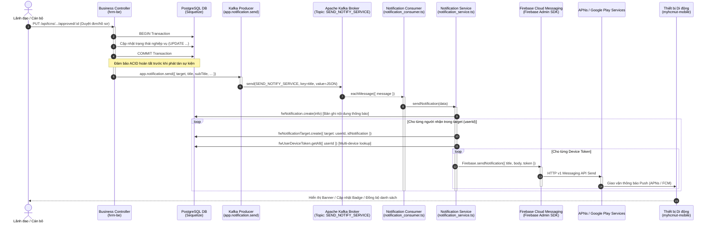
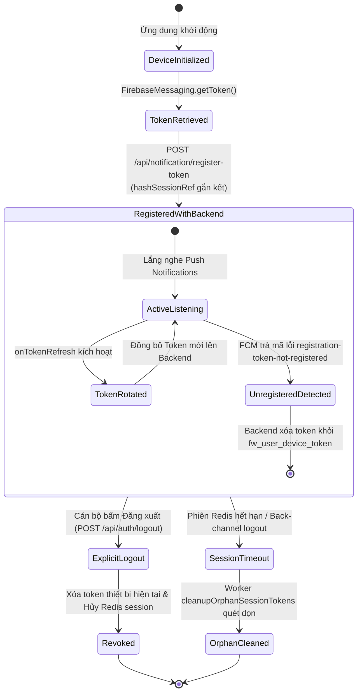
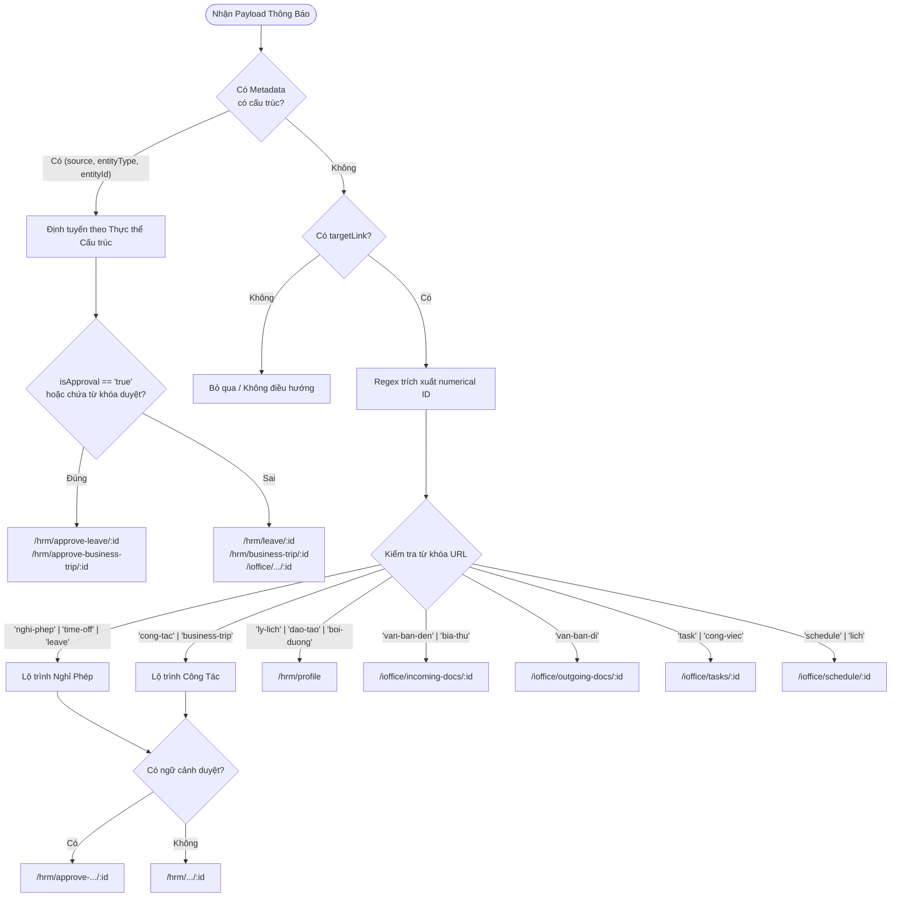
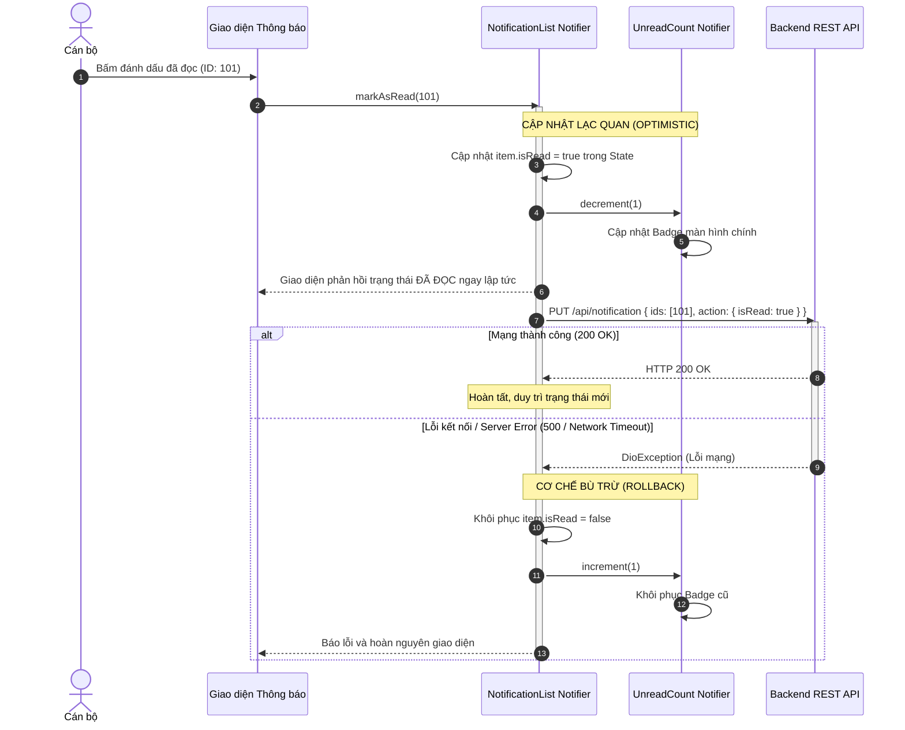

# ĐẶC TẢ YÊU CẦU KỸ THUẬT PHÂN HỆ THÔNG BÁO ĐẨY VÀ TRUNG TÂM THÔNG BÁO DI ĐỘNG
# (05_REQUIREMENT_PACK_NOTIFICATION.md)

> **Dự án:** Ứng dụng di động MyHCMUT phục vụ Nhân sự Trường Đại học (MyHCMUT Mobile)  
> **Cơ quan chủ quản:** Trường Đại học Bách khoa – ĐHQG-HCM  
> **Sinh viên thực hiện:**  
> - Vũ Xuân Chính (MSSV: 2210392) — Core Mobile, SSO Ticket Bridge, Quản lý Nghỉ phép & Hồ sơ Cán bộ, FCM Notification Hub.  
> - Tống Duy Khang (MSSV: 2211467) — Phân hệ Văn phòng số iOffice (Văn bản đến/đi, PDF Viewer) & Quản lý Nhiệm vụ (Missions/Tasks).  
> **Giảng viên hướng dẫn:** ThS. Nguyễn Thanh Tùng  
> **Thời điểm thẩm định:** Tháng 09/2026 (Mốc khóa Baseline Học thuật Gate 0)  
> **Tài liệu tham chiếu:**  
> - `01_GATE0_EVIDENCE_INDEX.md` (Bảng mục lục bằng chứng kiểm thử)  
> - `02_SCOPE_CLAIM_TRACEABILITY.md` (Sổ đăng ký tuyên bố kỹ thuật & Ma trận truy vết)  
> - Kho mã nguồn Mobile: `myhcmut-mobile/modules/notification` (Branch `feat/leaveRequest`)  
> - Kho mã nguồn Backend: `hrm-be` (Branch `chinh-dev`)  

---

## 1. TỔNG QUAN VÀ MỤC TIÊU PHÂN HỆ THÔNG BÁO

Phân hệ Thông báo trong hệ sinh thái MyHCMUT đóng vai trò là kênh truyền tải thông tin thời gian thực giữa hai máy chủ lõi (**HRM Server** quản lý công tác nhân sự và **iOffice Server** quản lý văn phòng điện tử) đến ứng dụng di động của cán bộ, giảng viên và lãnh đạo nhà trường.

### 1.1. Phạm vi nghiệp vụ và mục tiêu kỹ thuật
1. **Thông tin luân chuyển quy trình nhân sự (HRM):** Thông báo biến động trạng thái đơn xin nghỉ phép, duyệt kế hoạch công tác, nhắc nhở bổ sung hồ sơ lý lịch, gia hạn hợp đồng lao động, đào tạo bồi dưỡng.
2. **Thông tin văn bản điều hành và nhiệm vụ (iOffice):** Thông báo văn bản đến mới phát hành, văn bản đi cần xử lý, nhiệm vụ được giao, và thông báo lịch họp/cuộc họp cần điểm danh.
3. **Trung tâm thông báo hợp nhất (Unified Mobile Notification Center):** Hợp nhất dòng thông báo từ hai nguồn máy chủ khác biệt (HRM và iOffice), phân trang đồng bộ, hiển thị trạng thái đã đọc/chưa đọc, cung cấp cơ chế lọc theo nguồn, xóa tạm thời hỗ trợ hoàn tác (Undo), và thao tác hàng loạt (Batch Processing).
4. **Phát tán đa kênh tin cậy (Multi-platform Push Dispatch):** Tận dụng hạ tầng Firebase Cloud Messaging (FCM), APNs (Apple Push Notification service cho iOS) và FCM Transport (Google Play Services cho Android) để gửi thông báo tức thì ngay cả khi ứng dụng bị tắt hoàn toàn.

---

## 2. KIẾN TRÚC PIPELINE TRUYỀN TẢI SỰ KIỆN (EVENT DISPATCH PIPELINE)

### 2.1. Sơ đồ tuần tự truyền tải đầu-cuối (End-to-End Event Sequence)

Toàn bộ luồng phát tán thông báo từ lúc phát sinh thao tác nghiệp vụ tại máy chủ đến khi xuất hiện trên thiết bị di động được mô tả chi tiết qua sơ đồ sau:



### 2.2. Phân tích chi tiết từng chặng xử lý

#### Chặng 1: Giao dịch CSDL và Mẫu thiết kế Post-commit Hook
- **Nguyên lý thiết kế:** Tuyệt đối không phát tán sự kiện thông báo bên trong phạm vi giao dịch cơ sở dữ liệu (Database Transaction). 
- **Minh chứng mã nguồn:** Tại `modules/md_tcns/tcns_cong_tac/controller/tcns_cong_tac_yeu_cau.controller.ts` và `modules/md_tcns/tcns_nghi_phep/controller.ts`, lệnh `await app.notification.send(...)` chỉ được triệu gọi sau khi giao dịch CSDL đã hoàn thành (`transaction.commit()`).
- **Mục đích bảo vệ:** Ngăn ngừa tình trạng *Phantom Notification* (thông báo ma) — hiện tượng cán bộ nhận được thông báo "Đơn đã được duyệt" trong khi giao dịch CSDL thực tế bị lỗi, rollback dữ liệu và không hề được duyệt thành công.
- **Ranh giới học thuật (Claim Traceability CLM-NOT-01 & CLM-NOT-02):**
  - Mặc dù việc gọi `app.notification.send()` sau commit ngăn được thông báo ma, kiến trúc hiện tại vẫn tồn tại rủi ro mất mát thông báo nếu broker Kafka bị sự cố gián đoạn kết nối đúng tại thời điểm sau commit.
  - Giải pháp tối ưu lý thuyết là **Transactional Outbox Pattern** (bảng đệm `fw_outbox` ghi cùng transaction với dữ liệu nghiệp vụ, được Kafka Connect / Debezium CDC quét đẩy ra ngoài) — được định vị là đề xuất nghiên cứu phát triển ở Chương 7.

#### Chặng 2: Kafka Producer Client Wrapper
- Chức năng phát thông báo được đóng gói qua lớp tiện ích `config/lib/notification.ts`:
  ```ts
  export class Notification {
      static async send(data: TNotificationServiceSend) {
          if (!data.target || !data.target.length) throw 'Target is empty';
          if (!data.title) throw 'Title of notification is empty';

          await app.kafkaClient.send(app.kafkaClient.topics.SEND_NOTIFY_SERVICE.topic, {
              key: data.title,
              value: JSON.stringify(data),
          });
      }
  }
  ```
- **Topic cấu hình:** `SEND_NOTIFY_SERVICE` được đăng ký trong danh mục tĩnh tại `config/lib/kafka.ts`.
- **Cấu trúc tải trọng sự kiện (Event Payload Schema):**
  ```ts
  export type TNotificationServiceSend = {
      target: number[];       // Mảng chứa danh sách ID người dùng nhận (fw_user.id)
      title: string;          // Tiêu đề ngắn gọn của thông báo (bắt buộc)
      subTitle?: string;      // Nội dung mô tả chi tiết của thông báo
      icon?: string;          // Lớp biểu tượng FontAwesome (mặc định 'fa-commenting')
      iconColor?: string;     // Màu sắc biểu tượng (mã hex hoặc chuỗi 'primary'|'success'|'danger')
      targetLink?: string;    // Đường dẫn điều hướng sâu (Deep Link URL)
  }
  ```

#### Chặng 3: Kafka Consumer & Tầng dịch vụ Thông báo (Notification Service)
- **Cơ chế sẵn sàng (Ready-hook):** `SendNotificationServiceConsumer` chỉ khởi chạy khi cờ môi trường `app.env.IS_SERVICE = true` và client Kafka đã kết nối ổn định (`config/lib/ready-hook.ts`).
- **Lưu trữ CSDL phân tách:**
  1. `fw_notification`: Lưu thông tin thực thể thông báo (tiêu đề, nội dung, biểu tượng, màu sắc, thời điểm gửi `sendTime`).
  2. `fw_notification_target`: Lưu quan hệ phân tán (fan-out) một-nhiều giữa thông báo và từng cán bộ thụ hưởng (`target: userId`, `idNotification`).
  3. `fw_notification_logs`: Không được tạo trước tại thời điểm phát tán; chỉ được sinh ra trễ (lazily created) khi cán bộ mở đọc (`isRead=true`) hoặc xóa thông báo (`isDelete=true`) thông qua REST API.

#### Chặng 4: Firebase Dispatch & Cầu nối Thiết bị Đa nền tảng
- Tầng dịch vụ gọi tới SDK máy chủ `firebase-admin` (`config/lib/firebase.ts`):
  ```ts
  const message = { notification: { title, body }, token };
  const response = await admin.messaging().send(message);
  ```
- Google Play Services (cho Android) và Apple Push Notification service - APNs (cho iOS) đảm nhận việc định tuyến chặng cuối qua sóng di động/Wi-Fi đến chip modem của thiết bị người dùng.

---

## 3. VÒNG ĐỜI TOKEN THIẾT BỊ (FCM TOKEN LIFECYCLE) & HỖ TRỢ ĐA THIẾT BỊ (MULTI-DEVICE)

Hệ thống cung cấp cơ chế quản lý vòng đời token chặt chẽ, bảo đảm một cán bộ có thể sử dụng đồng thời nhiều thiết bị (điện thoại cá nhân, máy tính bảng, điện thoại công vụ) mà không làm rò rỉ thông báo khi đã đăng xuất.



### 3.1. Đăng ký Token thiết bị (Token Registration)
- **Phía Ứng dụng Di động (`fcm_service.dart`):**
  - Khi khởi động và người dùng đã xác thực, hàm `FcmService.syncToken()` được kích hoạt:
    ```dart
    final token = await FirebaseMessaging.instance.getToken();
    if (token != null) {
      await _sendTokenToBackend(token);
    }
    ```
  - Gửi yêu cầu HTTP `POST /api/notification/register-token` kèm thông số hệ điều hành (`android` hoặc `ios`).
- **Phía Máy chủ Backend (`controller.ts` & `device_token.service.ts`):**
  - Backend băm định danh phiên làm việc qua hàm HMAC-SHA256 kết hợp chuỗi bí mật hệ thống:
    ```ts
    export const hashSessionRef = (sessionId: string): string =>
        createHash('sha256').update(`${sessionId}${process.env.SESSION_SECRET}`).digest('base64url');
    ```
  - Thực hiện cập nhật hoặc chèn mới nguyên tử (`upsert`) vào bảng `fw_user_device_token`:
    ```ts
    await app.model.fwUserDeviceToken.model.upsert({
        userId,
        deviceToken: token,
        sessionRef: sessionRef ?? undefined,
        createTime: now,
        lastSeen: now,
    }, { conflictFields: ['device_token'] });
    ```
  - Khóa xung đột `device_token` bảo đảm một thiết bị vật lý chỉ thuộc về một cán bộ duy nhất tại một thời điểm. Nếu cán bộ B đăng nhập trên cùng thiết bị của cán bộ A, bản ghi token sẽ được chuyển quyền sở hữu sang cán bộ B mà không gây trùng lặp.

### 3.2. Làm mới Token tự động (Token Refresh & Self-healing)
- **Token Rotation phía Client:** Lắng nghe luồng sự kiện `FirebaseMessaging.instance.onTokenRefresh`. Khi Google FCM làm mới token định kỳ, client lập tức gửi token mới lên backend để cập nhật lại cơ sở dữ liệu.
- **Tự dọn dẹp lỗi thời phía Backend (Backend Self-healing):**
  - Trong `config/lib/firebase.ts`, khi gọi `admin.messaging().send()` mà FCM trả về mã lỗi `messaging/registration-token-not-registered` (xảy ra khi người dùng gỡ cài đặt ứng dụng hoặc xóa sạch dữ liệu ứng dụng):
    ```ts
    const isUnregistered = error?.errorInfo?.code === 'messaging/registration-token-not-registered';
    if (isUnregistered) {
        await app.model.fwUserDeviceToken.delete({ deviceToken: token });
    }
    ```
  - Cơ chế phòng vệ này tự động loại bỏ các token "chết", ngăn chặn việc lãng phí tài nguyên và làm chậm tiến trình gửi thông báo hàng loạt trong tương lai.

### 3.3. Thu hồi Token khi Đăng xuất (Token Revocation & Session Cleanliness)
1. **Đăng xuất chủ động (Explicit Logout):**
   - Khi cán bộ chọn đăng xuất trên ứng dụng (`POST /api/auth/logout`), backend trích xuất `deviceToken` liên kết với phiên hiện tại và thực hiện xóa bản ghi:
     ```ts
     if (user.deviceToken) {
         await app.model.fwUserDeviceToken.delete({ userId: user.id, deviceToken: user.deviceToken });
     }
     await app.session.destroy(req);
     ```
   - Điều này ngăn chặn triệt để tình trạng một người dùng khác sau khi mượn máy hoặc phiên làm việc kết thúc vẫn nhận được thông báo riêng tư của cán bộ cũ.
2. **Dọn dẹp Token mồ côi (Orphan Token Cleanup):**
   - Định kỳ hoặc khi có sự kiện hủy phiên tập trung (SSO Back-channel Logout), hàm `cleanupOrphanSessionTokens` quét toàn bộ các phiên hoạt động trên Redis (`APP_NAME_sess:*`). Bất kỳ token nào trong `fw_user_device_token` có `sessionRef` không còn tồn tại trên Redis đều bị xóa sạch.

---

## 4. CƠ CHẾ XỬ LÝ PAYLOAD & ĐIỀU HƯỚNG SÂU (DEEP LINKING)

Phân hệ thông báo di động phải xử lý payload một cách nhất quán qua 3 trạng thái vòng đời của ứng dụng: **Foreground (Tiền cảnh)**, **Background (Hậu cảnh)**, và **Terminated (Đã tắt hoàn toàn)**.

### 4.1. Ma trận xử lý 3 trạng thái ứng dụng

| Trạng thái ứng dụng | Cơ chế bắt sự kiện (Event Hook) | Hành vi giao diện & Thông báo | Luồng điều hướng sâu (Deep Linking) |
| :--- | :--- | :--- | :--- |
| **Foreground**<br>*(Đang mở & tương tác)* | `FirebaseMessaging.onMessage.listen()` | - Tự động tăng đếm unread (`notificationUnreadCountProvider.increment()`).<br>- Hủy cache danh sách (`ref.invalidate(notificationListProvider)`).<br>- Kích hoạt `LocalNotificationService.showNotification()` tạo thông báo nổi cục bộ. | Khi cán bộ bấm vào thông báo cục bộ nổi: gọi `_handleNotificationTap` -> giải mã payload -> kích hoạt `GoRouter.of(context).go(route)`. |
| **Background**<br>*(Đang ẩn dưới nền)* | 1. Tương tác banner: `FirebaseMessaging.onMessageOpenedApp.listen()`<br>2. Xử lý nền: `firebaseMessagingBackgroundHandler()` | - Không hiển thị thông báo trùng lặp.<br>- Background handler trích xuất `badge` từ data payload, cập nhật SharedPreferences và đổi huy hiệu launcher qua `AppBadgePlus.updateBadge(newCount)`. | Khi cán bộ bấm vào thông báo trên thanh thông báo hệ thống: `onMessageOpenedApp` nhận `RemoteMessage.data` -> chuyển tới `handleNotificationPayload` -> `GoRouter`. |
| **Terminated**<br>*(Ứng dụng bị đóng hẳn)* | `FirebaseMessaging.instance.getInitialMessage()` | - Hệ điều hành (Android System / iOS Notification Center) quản lý việc hiển thị banner push.<br>- Khi bấm mở ứng dụng, `checkInitialMessage()` được gọi trong quá trình khởi tạo. | Trích xuất `initialMessage.data` -> phân tích lộ trình -> đợi `navigatorKey.currentContext` sẵn sàng -> kích hoạt `GoRouter.of(context).go(route)`. |

### 4.2. Cấu hình Kênh thông báo Android (High Importance Channel)
Để bảo đảm thông báo nổi (heads-up banner) hiển thị ngay cả khi ứng dụng đang chạy tiền cảnh trên Android 8.0+ (API level 26+), `LocalNotificationService` tạo kênh ưu tiên cao:
```dart
const channel = AndroidNotificationChannel(
  'notification_center_channel',
  'Notification Center',
  description: 'Main notification channel for MyHCMUT App',
  importance: Importance.max,
);
await androidPlugin.createNotificationChannel(channel);
```

### 4.3. Động cơ phân tích lộ trình (Notification Route Parser)

Hệ thống triển khai một bộ giải mã lộ trình thông minh `NotificationRouteParser` hỗ trợ phân tích hai cấp độ: **Metadata có cấu trúc (Structured Metadata)** và **Đường dẫn Web kế thừa (Legacy Web Link Fallback)**.



#### Bảng quyết định định tuyến chi tiết (Routing Decision Table)

| Nguồn phát sinh | URL gốc hoặc Metadata | Từ khóa nhận diện phê duyệt | Route ứng dụng di động đích (GoRouter) | Ý nghĩa nghiệp vụ |
| :--- | :--- | :---: | :--- | :--- |
| **HRM** | `source=hrm, entityType=leave, id=101` | Không | `/hrm/leave/101` | Cán bộ xem chi tiết đơn nghỉ phép của bản thân |
| **HRM** | `source=hrm, entityType=leave, id=101` | Có (`isApproval=true` hoặc từ khóa) | `/hrm/approve-leave/101` | Lãnh đạo mở màn hình phê duyệt đơn nghỉ phép |
| **HRM** | `/staff/user/my/dang-ky-nghi-phep/555` | Không | `/hrm/leave/555` | Xem chi tiết đơn nghỉ phép từ đường link web |
| **HRM** | `/staff/user/service/quan-ly-nghi-phep/555` | Có (`service`, `quan-ly`) | `/hrm/approve-leave/555` | Phê duyệt đơn nghỉ phép từ đường link web quản lý |
| **HRM** | `source=hrm, entityType=business-trip, id=201` | Không | `/hrm/business-trip/201` | Xem chi tiết đăng ký công tác |
| **HRM** | `/staff/user/service/dang-ky-cong-tac/chi-tiet/201` | Có (`service`) | `/hrm/approve-business-trip/201` | Lãnh đạo phê duyệt kế hoạch công tác |
| **HRM** | `/staff/user/my/ly-lich/request?tab=congTac` | Không | `/hrm/profile` | Điều hướng sang phân hệ Hồ sơ / Lý lịch |
| **HRM** | `/staff/user/my/dao-tao-boi-duong/301` | Không | `/hrm/profile` | Thông báo đào tạo, bồi dưỡng nhân sự |
| **iOffice** | `source=ioffice, entityType=incoming-doc, id=401` | Không | `/ioffice/incoming-docs/401` | Mở trực tiếp văn bản đến kèm tệp PDF |
| **iOffice** | `/staff/user/van-ban-den?id=401` | Không | `/ioffice/incoming-docs/401` | Phân tích regex ID từ query parameter văn bản đến |
| **iOffice** | `source=ioffice, entityType=outgoing-doc, id=402` | Không | `/ioffice/outgoing-docs/402` | Mở xem chi tiết văn bản đi |
| **iOffice** | `source=ioffice, entityType=task, id=403` | Không | `/ioffice/tasks/403` | Mở màn hình chi tiết nhiệm vụ / công việc |
| **iOffice** | `source=ioffice, entityType=schedule, id=404` | Không | `/ioffice/schedule/404` | Mở chi tiết lịch họp / cuộc họp điểm danh |

#### Thuật toán nhận diện ngữ cảnh phê duyệt (Vietnamese Semantic Keyword Matching)
Bộ phân tích quét chuỗi kết hợp `targetLink + title + subTitle` chuyển thành chữ thường để phát hiện các ngữ cảnh hành chính:
- `cần duyệt`, `chờ duyệt`, `xét duyệt`, `phê duyệt`, `duyệt phiếu`
- `quan-ly`, `service`, `approve`
Giúp chuyển hướng chính xác đến luồng phê duyệt mà không phụ thuộc tuyệt đối vào việc backend có truyền cờ `isApproval` hay không.

---

## 5. QUẢN LÝ HUY HIỆU (BADGE COUNTER) & ĐỒNG BỘ TRẠNG THÁI ĐỌC

### 5.1. Kiến trúc lưu trữ và tính toán Huy hiệu Unread
- **Nguồn chân lý (Single Source of Truth):** Quản lý qua Riverpod `NotificationUnreadCount` notifier (`lib/src/config/notification_count_provider.dart`), được đánh dấu `keepAlive: true`.
- **Độ bền vững cục bộ (Local Persistence):** Trạng thái số đếm được lưu đồng bộ vào `SharedPreferences` dưới khóa `unread_notifications_count`. Khi khởi động ứng dụng, giá trị này được nạp ngay lập tức để tránh hiện tượng nhấp nháy giao diện.
- **Giới hạn cận biên (Clamping Boundary):** Số lượng huy hiệu được kẹp chặt trong khoảng $[0, 999]$:
  $$\text{badge} = \max(0, \min(\text{count}, 999))$$
- **Đồng bộ Huy hiệu OS Launcher (`AppBadgePlus`):** Mỗi khi biến trạng thái thay đổi, hệ thống gọi `AppBadgePlus.updateBadge(state)` để cập nhật số hiển thị trên biểu tượng ứng dụng ở màn hình chính điện thoại.

### 5.2. Cơ chế Hợp nhất Hai Nguồn Dữ liệu (Dual-Source Aggregation)
Khi nạp danh sách thông báo hoặc làm mới dữ liệu, máy chủ thực hiện triệu gọi song song qua `Future.wait`:
1. `HrmNotificationRepository.fetchPage(1, 20)`
2. `IOfficeNotificationRepository.fetchPage(1, 20)`

Danh sách kết quả được gộp lại (`[...hrmList, ...iofficeList]`) và sắp xếp giảm dần theo mốc thời gian thực tế (`sendTime.compareTo`):
$$\text{unreadCount}_{\text{total}} = \sum_{i=1}^{M} [\neg \text{item}_i.\text{isRead}]$$

### 5.3. Cập nhật Lạc quan (Optimistic Update) & Cơ chế Bù trừ Rollback

Để bảo đảm trải nghiệm người dùng mượt mà tức thì, các thao tác thay đổi trạng thái đều tuân theo mô hình **Optimistic Update có hỗ trợ Rollback**:



### 5.4. Cơ chế Xóa trễ 3 giây & Hoàn tác (Undo Delete Mechanism)
Khi cán bộ vuốt để xóa thông báo hoặc bấm biểu tượng xóa:
1. **Giao diện phản hồi tức thì:** Mục thông báo được rút khỏi danh sách trên màn hình ngay lập tức; huy hiệu chưa đọc tự động giảm nếu mục đó chưa đọc.
2. **Khởi tạo đồng hồ đếm ngược 3 giây:** Một `Timer(Duration(seconds: 3))` được kích hoạt và lưu vết trong bản đồ `_pendingDeletes[id]`.
3. **Kịch bản Hoàn tác (Undo):** Nếu cán bộ bấm nút "Hoàn tác" (Undo) trên thanh SnackBar trong vòng 3 giây, `undoDelete(id)` sẽ hủy Timer, chèn lại mục thông báo vào đúng vị trí chỉ mục ban đầu, và khôi phục số huy hiệu.
4. **Kịch bản Chốt xóa (Commit Delete):** Hết 3 giây mà không có lệnh hoàn tác, Timer kích hoạt gọi HTTP `PUT /api/notification` với `{ ids: [id], action: { isDelete: true } }`.
5. **Bảo toàn vòng đời (Provider Dispose Safety):** Nếu người dùng thoát khỏi màn hình khiến `NotificationList` provider bị hủy (`ref.onDispose`), toàn bộ các lệnh xóa đang đếm dở trong `_pendingDeletes` lập tức hủy timer và ép thực thi xóa lên backend ngay, không làm mất hiệu lực thao tác người dùng.

---

## 6. PHÂN TÍCH KỊCH BẢN LỖI (FAILURE MODES) VÀ ĐỐI SÁCH BÙ TRỪ

Nhằm bảo đảm tính trung thực học thuật theo tiêu chuẩn của Đồ án Tốt nghiệp Bách khoa, hệ thống phân định rõ ràng các giới hạn kỹ thuật thực tế và đối sách tương ứng:

| Mã Kịch bản | Tình huống lỗi thực tế (Failure Scenario) | Điểm nghẽn kỹ thuật & Hệ quả | Đối sách hiện thực trong mã nguồn | Định hướng nâng cấp lý thuyết (Chương 7) |
| :---: | :--- | :--- | :--- | :--- |
| **FAIL-01** | **Kafka Broker gián đoạn kết nối sau DB commit** | Giao dịch nghiệp vụ lưu thành công nhưng Kafka producer ném lỗi, dẫn đến mất sự kiện thông báo. | Bọc lỗi và ghi nhật ký cảnh báo (`Logger.error`), không làm sập tiến trình Express. | Áp dụng **Transactional Outbox Pattern** kết hợp CDC Debezium để bảo đảm chuyển phát At-least-once tin cậy tuyệt đối từ CSDL. |
| **FAIL-02** | **FCM chuyển phát lặp lại (Duplicate Push)** | Mạng di động chập chờn khiến APNs/FCM gửi lại bản tin Push nhiều lần. | Module di động xử lý idempotent: kiểm tra `message.hashCode` và không tăng số lượng trùng trên cùng phiên nạp. | Bổ sung khóa định danh duy nhất `eventId` trên toàn bộ payload sự kiện từ backend. |
| **FAIL-03** | **Kafka Consumer gặp sự cố khi ghi DB** | `notification_consumer.ts` bắt lỗi trong `eachMessage` nhưng không ném lại, khiến kafkajs auto-commit offset. | Ghi vết chi tiết `Logger.error` thông tin bản tin thất bại. | Xây dựng hàng đợi thư chết **Dead Letter Queue (SEND_NOTIFY_SERVICE_DLQ)** và retry worker có exponential backoff. |
| **FAIL-04** | **Thiết bị mất mạng khi thao tác đọc/xóa** | Client gửi request `PUT /api/notification` nhưng bị gián đoạn mạng hoặc máy chủ trả HTTP 500. | Cơ chế Rollback tự động: khôi phục nguyên trạng thái danh sách và bù trừ lại số lượng Badge. | Hàng đợi đồng bộ Offline (Offline Queue lưu trong SQLite cục bộ và đồng bộ lại khi có mạng). |
| **FAIL-05** | **Token thiết bị hết hạn / Người dùng gỡ App** | Thiết bị không còn nhận thông báo nhưng token vẫn nằm trong cơ sở dữ liệu. | Tự sửa lỗi (Self-healing): Bắt mã lỗi FCM `registration-token-not-registered` và xóa ngay khỏi CSDL. | Bổ sung timestamp `lastSeen` và Cron job định kỳ dọn token không hoạt động quá 60 ngày. |
| **FAIL-06** | **Xung đột hiển thị Badge trên Android Launcher** | Một số dòng máy OEM (Xiaomi MIUI, Samsung OneUI, Google Pixel) không hỗ trợ cập nhật số lượng qua Intent ngoài. | Bọc trong khối `try/catch`, kiểm tra `AppBadgePlus.isSupported()`, chấp nhận hiển thị dấu chấm (dot badge) nếu launcher hạn chế. | Ghi nhận tính phân mảnh của hệ điều hành Android trong báo cáo, không cam kết hiển thị số trên 100% launcher. |

> [!IMPORTANT]
> **Tuyên bố Học thuật về Tính toàn vẹn (Academic Notice on FCM Delivery):**  
> Trong toàn bộ tài liệu luận văn, **tuyệt đối không tuyên bố hạ tầng FCM bảo đảm phát tán chính xác một lần duy nhất (Exactly-Once Delivery)**. FCM và APNs là các mạng phân tán quy mô toàn cầu hoạt động trên nguyên lý **At-Least-Once Delivery kết hợp Best-Effort**. Các cơ chế Idempotent State Guard và Transactional Outbox là các giải pháp bù trừ cần thiết được phân tích khoa học tại Chương 3 và Chương 7.

---

## 7. BẢNG ÁNH XẠ KIỂM THỬ ĐỘC LẬP (47 TEST CASES TRACEABILITY MATRIX)

Toàn bộ **47 bài kiểm thử tự động** (Unit & Widget Tests) của mô-đun thông báo (`myhcmut-mobile/modules/notification/test/`) đều vượt qua với tỷ lệ thành công tuyệt đối (**100% Pass Rate**):

### 7.1. Nhóm 1: Kiểm thử Mô hình Dữ liệu & DTO (5 Test Cases)
*Đường dẫn tệp:* `test/models/notification_model_test.dart`

| Test ID | Tên bài kiểm thử kỹ thuật | Trọng tâm kiểm tra kỹ thuật | Kết quả |
| :---: | :--- | :--- | :---: |
| **TC-MOD-01** | Standard NotificationModel fromJson and toJson | Serialization/Deserialization chuẩn của model thông báo HRM | **PASS** |
| **TC-MOD-02** | Safe type casting and dynamic parsers in NotificationModel | Xử lý ép kiểu an toàn: chuỗi số sang int, boolean dạng chuỗi '1'/'true' | **PASS** |
| **TC-MOD-03** | Default values and boolean string representations | Giá trị mặc định khi JSON bị null hoặc thiếu trường | **PASS** |
| **TC-MOD-04** | Extension sentAt converts sendTime to DateTime accurately | Hàm mở rộng chuyển đổi epoch milliseconds sang đối tượng DateTime | **PASS** |
| **TC-MOD-05** | NotificationPage fromJson and pagination metadata | Bóc tách đối tượng phân trang: `totalItems`, `totalUnread`, `pageTotal` | **PASS** |

### 7.2. Nhóm 2: Kiểm thử Động cơ Phân tích Lộ trình (9 Test Cases)
*Đường dẫn tệp:* `test/utils/notification_route_parser_test.dart`

| Test ID | Tên bài kiểm thử kỹ thuật | Trọng tâm kiểm tra kỹ thuật | Kết quả |
| :---: | :--- | :--- | :---: |
| **TC-PAR-01a** | HRM Leave routes (regular vs approval) | Phân biệt route đơn cá nhân (`/hrm/leave/:id`) và duyệt (`/hrm/approve-leave/:id`) | **PASS** |
| **TC-PAR-01b** | HRM Business Trip routes (regular vs approval) | Phân biệt route công tác cá nhân và duyệt công tác | **PASS** |
| **TC-PAR-02** | iOffice Structured Entities (Incoming, Outgoing, Task) | Định tuyến thực thể có cấu trúc của văn phòng điện tử iOffice | **PASS** |
| **TC-PAR-03a** | Extracts ID from query params or path in Leave links | Bóc tách ID bằng biểu thức chính quy từ URL Web nghỉ phép | **PASS** |
| **TC-PAR-03b** | Extracts ID from Business Trip links | Bóc tách ID bằng biểu thức chính quy từ URL Web công tác | **PASS** |
| **TC-PAR-03c** | HRM Profile / Training links | Điều hướng các liên kết lý lịch, hồ sơ, đào tạo bồi dưỡng về `/hrm/profile` | **PASS** |
| **TC-PAR-03d** | iOffice Documents, Tasks and Schedules | Bóc tách ID các liên kết văn bản đến/đi, nhiệm vụ và lịch biểu | **PASS** |
| **TC-PAR-04** | Vietnamese Approval Keywords detection in combined text | Nhận diện 7 từ khóa tiếng Việt phê duyệt trong tiêu đề và nội dung | **PASS** |
| **TC-PAR-05** | General fallbacks and edge cases (null, empty, unknown) | Xử lý an toàn các trường hợp link null, link rỗng hoặc URL ngoài hệ thống | **PASS** |

### 7.3. Nhóm 3: Kiểm thử Bộ quản lý Trạng thái Danh sách (9 Test Cases)
*Đường dẫn tệp:* `test/providers/notification_list_provider_test.dart`

| Test ID | Tên bài kiểm thử kỹ thuật | Trọng tâm kiểm tra kỹ thuật | Kết quả |
| :---: | :--- | :--- | :---: |
| **TC-LST-01** | build() fetches page 1, merges and sorts descending | Nạp trang 1 song song từ HRM & iOffice, gộp và sắp xếp theo `sendTime` | **PASS** |
| **TC-LST-02** | fetchNextPage() appends new items and handles hasMore | Tải vô tận (Infinite Scroll), nối dữ liệu và chặn cận biên hết trang | **PASS** |
| **TC-LST-03** | refresh() reloads list and resets page counter | Làm mới danh sách (Pull-to-Refresh), đặt lại bộ đếm trang về 1 | **PASS** |
| **TC-LST-04** | markAsRead() optimistic update changes status and count | Cập nhật lạc quan trạng thái đã đọc và giảm biến đếm unread | **PASS** |
| **TC-LST-05** | markAsRead() rollbacks on repository error | Tự động rollback trạng thái và tăng lại unread khi API gặp sự cố | **PASS** |
| **TC-LST-06** | markAllAsRead() separates HRM & iOffice ids | Đánh dấu tất cả đã đọc, tách biệt ID gửi song song cho 2 backend | **PASS** |
| **TC-LST-07** | markSelectedAsRead() only updates selected ids | Đánh dấu đã đọc theo danh sách chọn lọc nhiều mục | **PASS** |
| **TC-LST-08** | deleteNotification() optimistic remove and undoDelete() | Xóa lạc quan khỏi UI và phục hồi đúng vị trí ban đầu khi bấm Undo | **PASS** |
| **TC-LST-09** | deleteNotification() executes backend call after 3s delay | Kích hoạt gọi API xóa thực sự lên máy chủ sau 3 giây đếm ngược | **PASS** |

### 7.4. Nhóm 4: Kiểm thử Bộ đếm Huy hiệu Unread (4 Test Cases)
*Đường dẫn tệp:* `test/providers/notification_unread_count_test.dart`

| Test ID | Tên bài kiểm thử kỹ thuật | Trọng tâm kiểm tra kỹ thuật | Kết quả |
| :---: | :--- | :--- | :---: |
| **TC-CNT-01** | Initializes default 0 and loads from SharedPreferences | Khởi tạo giá trị 0 và nạp bất đồng bộ từ bộ nhớ cục bộ | **PASS** |
| **TC-CNT-02** | increment increases count and clamps at 999 | Tăng số lượng, chặn trên ngưỡng 999, lưu bền vững vào local storage | **PASS** |
| **TC-CNT-03** | decrement decreases count and clamps at 0 | Giảm số lượng, chặn dưới ngưỡng 0, lưu bền vững vào local storage | **PASS** |
| **TC-CNT-04** | fetchUnreadCount aggregates counts from HRM & iOffice | Tổng hợp số lượng thông báo chưa đọc từ cả 2 nguồn máy chủ | **PASS** |

### 7.5. Nhóm 5: Kiểm thử Tầng Dịch vụ Kho Dữ liệu (6 Test Cases)
*Đường dẫn tệp:* `test/repositories/notification_repositories_test.dart`

| Test ID | Tên bài kiểm thử kỹ thuật | Trọng tâm kiểm tra kỹ thuật | Kết quả |
| :---: | :--- | :--- | :---: |
| **TC-REP-01** | fetchPage parses data.page envelope (HRM) | Phân tích vỏ bọc phản hồi HTTP GET và gán nguồn NotificationSource.hrm | **PASS** |
| **TC-REP-02** | fetchPage parses page envelope (iOffice) | Phân tích phản hồi HTTP GET và gán nguồn NotificationSource.iOffice | **PASS** |
| **TC-REP-03a** | markAsRead and delete sends PUT requests (HRM) | Gửi payload `{ ids, action: { isRead/isDelete: true } }` chuẩn tới HRM | **PASS** |
| **TC-REP-03b** | markAsRead and delete functions properly (iOffice) | Gửi payload cập nhật trạng thái chuẩn tới iOffice | **PASS** |
| **TC-REP-04a** | fetchPage handles HTTP 500 error (HRM) | Bắt ngoại lệ DioException trên mã lỗi 500 và chuyển đổi thành Exception | **PASS** |
| **TC-REP-04b** | iOffice error handling on HTTP 500 | Xử lý lỗi kết nối máy chủ phía kho iOffice an toàn | **PASS** |

### 7.6. Nhóm 6: Kiểm thử Giao diện Người dùng - Widget Tests (14 Test Cases)
*Đường dẫn tệp:* `test/widgets/`

| Test ID | Tệp kiểm thử | Tên bài kiểm thử kỹ thuật | Trọng tâm kiểm tra kỹ thuật | Kết quả |
| :---: | :--- | :--- | :--- | :---: |
| **TC-WDG-01** | `notification_bell_widget_test.dart` | Badge is hidden when unreadCount == 0 | Huy hiệu đỏ tự động ẩn khi số lượng unread bằng 0 | **PASS** |
| **TC-WDG-02** | `notification_bell_widget_test.dart` | Badge displays exact count for 1..99 | Hiển thị chính xác chuỗi số từ 1 đến 99 trên chuông | **PASS** |
| **TC-WDG-03** | `notification_bell_widget_test.dart` | Badge displays 99+ when unreadCount > 99 | Hiển thị chuỗi '99+' khi số lượng vượt ngưỡng 99 | **PASS** |
| **TC-WDG-04** | `notification_bell_widget_test.dart` | Tapping bell icon navigates to /notification/list | Nhấn vào chuông kích hoạt chuyển hướng sang danh sách | **PASS** |
| **TC-WDG-05** | `notification_item_widget_test.dart` | Renders title, subtitle and HRM badge | Hiển thị đầy đủ tiêu đề, nội dung và nhãn nguồn HRM | **PASS** |
| **TC-WDG-06** | `notification_item_widget_test.dart` | Renders unread state vs read state indicator | Phân biệt hiển thị trực quan giữa mục đã đọc và chưa đọc | **PASS** |
| **TC-WDG-07** | `notification_item_widget_test.dart` | Selection Mode displays Checkbox | Chế độ chọn nhiều hiển thị ô Checkbox và tương tác toggle | **PASS** |
| **TC-WDG-08** | `notification_item_widget_test.dart` | Tapping item triggers onTap callback | Bấm vào dòng thông báo gọi hàm phản hồi onTap tương ứng | **PASS** |
| **TC-WDG-09** | `notification_item_widget_test.dart` | Swiping item triggers Dismissible onDismiss | Vuốt từ phải sang trái kích hoạt cơ chế xóa nhanh Dismissible | **PASS** |
| **TC-WDG-10** | `notification_list_screen_test.dart` | Shows Loading Skeleton when fetching | Hiển thị hiệu ứng khung xương (Skeleton Loading) khi đang nạp | **PASS** |
| **TC-WDG-11** | `notification_list_screen_test.dart` | Shows Error State and Retry button | Hiển thị màn hình báo lỗi kèm nút "Thử lại" khi mất kết nối | **PASS** |
| **TC-WDG-12** | `notification_list_screen_test.dart` | Shows AppEmptyState when list is empty | Hiển thị trạng thái trống khi không có thông báo | **PASS** |
| **TC-WDG-13** | `notification_list_screen_test.dart` | Renders list and tabs correctly | Hiển thị 3 tab lọc: Tất cả, HRM, iOffice hoạt động chuẩn xác | **PASS** |
| **TC-WDG-14** | `notification_list_screen_test.dart` | Batch Selection Mode toggle and action bar | Kích hoạt thanh thao tác hàng loạt, chọn tất cả và bỏ chọn | **PASS** |

---

## 8. KẾT LUẬN VÀ LỘ TRÌNH PHÁT TRIỂN CHƯƠNG 7

Phân hệ Thông báo Đẩy và Trung tâm Thông báo Di động đã hoàn thành việc tích hợp toàn diện giữa kiến trúc sự kiện không đồng bộ phía máy chủ (PostgreSQL Post-commit $\to$ Apache Kafka $\to$ Firebase Admin SDK) và ứng dụng di động MyHCMUT (Firebase Messaging $\to$ Local Notifications $\to$ Riverpod State Management $\to$ GoRouter).

Toàn bộ 47 kịch bản kiểm thử đơn vị và giao diện đã chứng minh tính bền vững của các giải pháp thiết kế:
1. **Bảo vệ toàn vẹn trạng thái:** Cập nhật lạc quan kết hợp tự động rollback khi gặp sự cố mạng.
2. **Trải nghiệm người dùng cao cấp:** Hỗ trợ hoàn tác thao tác xóa trong 3 giây và thao tác xử lý hàng loạt.
3. **Định tuyến ngữ cảnh chính xác:** Động cơ nhận diện từ khóa tiếng Việt phân biệt rạch ròi giữa đơn cần duyệt và đơn cá nhân.

### Định hướng mở rộng trong Chương 7 của Luận văn:
- **Transactional Outbox & CDC:** Triển khai Debezium bắt sự kiện thay đổi từ CSDL để xóa bỏ hoàn toàn cửa sổ rủi ro mất mát thông báo khi Kafka gặp sự cố.
- **Tối ưu hóa truy vấn hàng loạt (Batching & N+1 Elimination):** Chuyển đổi vòng lặp tuần tự tạo bản ghi `fw_notification_target` sang `bulkCreate`, và áp dụng FCM Multicast API (`admin.messaging().sendEachForMulticast`) cho phép phát tán tối đa 500 thiết bị trên mỗi cuộc gọi mạng.
- **Bao bọc thông điệp có phiên bản (Schema Versioning Envelope):** Bổ sung trường `eventId` (UUID), `schemaVersion`, và `traceId` vào tải trọng Kafka nhằm hỗ trợ chống lặp thông điệp (deduplication) tại tầng consumer.
