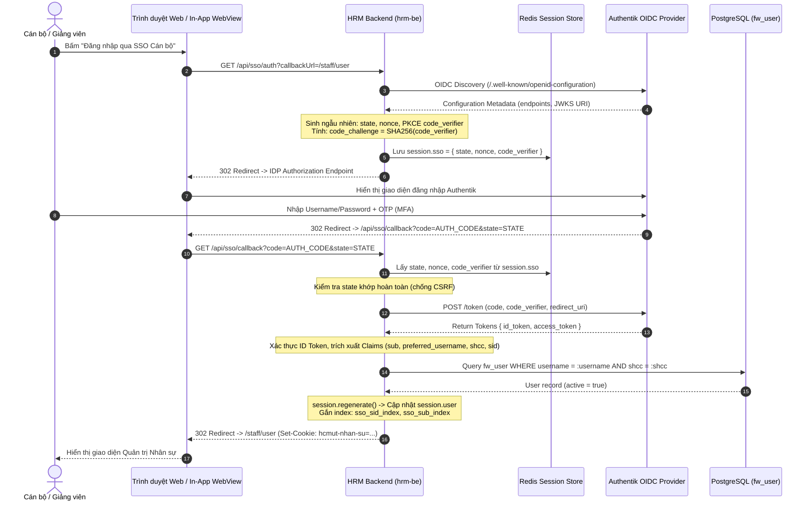
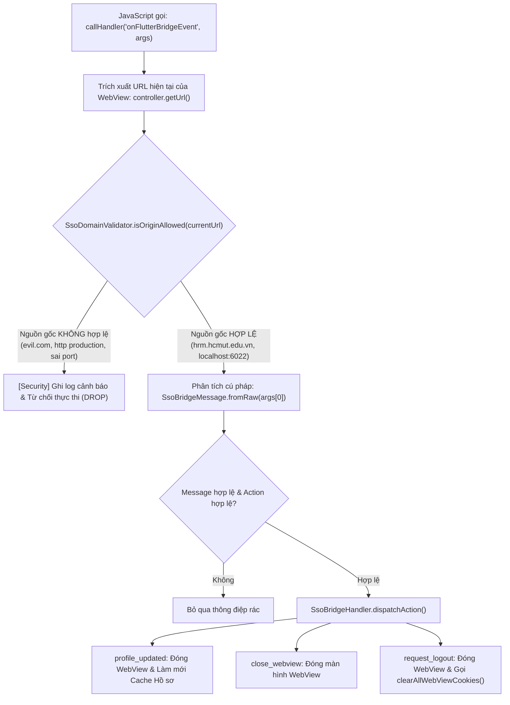

# ĐẶC TẢ YÊU CẦU KỸ THUẬT & KIẾN TRÚC AN TOÀN XÁC THỰC SSO
# (06_REQUIREMENT_PACK_SSO.md)

> **Dự án:** Ứng dụng di động MyHCMUT phục vụ Cán bộ – Giảng viên kết hợp Hệ sinh thái Web nội bộ  
> **Cơ quan chủ quản:** Trường Đại học Bách khoa – ĐHQG-HCM  
> **Sinh viên thực hiện:**  
> - Vũ Xuân Chính (MSSV: 2210392) — Core Mobile, SSO Ticket Bridge, Quản lý Nghỉ phép & Hồ sơ Cán bộ, FCM Notification Hub.  
> - Tống Duy Khang (MSSV: 2211467) — Phân hệ Văn phòng số iOffice (Văn bản đến/đi, PDF Viewer) & Quản lý Nhiệm vụ (Missions/Tasks).  
> **Giảng viên hướng dẫn:** ThS. Nguyễn Thanh Tùng  
> **Mốc đối chuẩn:** Gate 0 — Khóa Baseline Học thuật & Bằng chứng Kỹ thuật (Tháng 09/2026)  
> **Trạng thái tài liệu:** 🔒 **BASELINE RELEASE v1.0 (VERIFIED IMPLEMENTATION)**

---

## MỤC LỤC

1. [TỔNG QUAN HỆ THỐNG XÁC THỰC TẬP TRUNG (CENTRAL SSO ECOSYSTEM)](#1-tổng-quan-hệ-thống-xác-thực-tập-trung-central-sso-ecosystem)
   - 1.1. Bối cảnh & Hiện trạng hệ sinh thái Trường Đại học Bách khoa – ĐHQG-HCM
   - 1.2. Kiến trúc Đa phương thức Xác thực (Multi-Factor Authentication Providers)
   - 1.3. Luồng Xác thực OIDC PKCE & CAS Service Ticket
2. [GIAO THỨC VÉ XÁC THỰC MỘT LẦN (ONE-TIME TICKET / SSO BRIDGE PROTOCOL)](#2-giao-thức-vé-xác-thực-một-lần-one-time-ticket--sso-bridge-protocol)
   - 2.1. Động lực Thiết kế & Ranh giới Kỹ thuật Native – WebView
   - 2.2. Đặc tả Giao thức Central SSO Ticket Issuer & Consumers
   - 2.3. Sơ đồ Tuần tự Tương tác Toàn trình (End-to-End Sequence Diagram)
   - 2.4. Phân giải Cấu hình Mạng Môi trường Dev & Android Emulator Topology
3. [QUẢN LÝ PHIÊN LÀM VIỆC & AN TOÀN COOKIE (SESSION & COOKIE MANAGEMENT)](#3-quản-lý-phiên-làm-việc--an-toàn-cookie-session--cookie-management)
   - 3.1. Thiết lập Cookie Hardening & Proxy Trust
   - 3.2. Cơ chế Đồng bộ Đăng xuất Tập trung (Single Logout - SLO)
   - 3.3. Thu hồi Phiên Kênh sau (OIDC Back-Channel Logout 1.0 Specification)
4. [GIAO TIẾP JAVASCRIPT BRIDGE GIỮA WEBVIEW VÀ NATIVE MOBILE](#4-giao-tiếp-javascript-bridge-giữa-webview-và-native-mobile)
   - 4.1. Cấu trúc Thông điệp & Parser An toàn (Message Specification)
   - 4.2. Cơ chế Xác thực Nguồn gốc (Origin Validation & Domain Allowlist)
   - 4.3. Vòng đời Điều phối Sự kiện Nghiệp vụ (Action Dispatching Pipeline)
5. [MÔ HÌNH ĐE DỌA (STRIDE THREAT MODEL) & GIẢI PHÁP PHÒNG THỦ](#5-mô-hình-đe-dọa-stride-threat-model--giải-pháp-phòng-thủ)
   - 5.1. Spoofing (Giả mạo danh tính)
   - 5.2. Tampering (Can thiệp / Làm sai lệch dữ liệu)
   - 5.3. Repudiation (Chối bỏ trách nhiệm)
   - 5.4. Information Disclosure (Tiết lộ thông tin nhạy cảm)
   - 5.5. Denial of Service (Từ chối dịch vụ)
   - 5.6. Elevation of Privilege (Nâng cao đặc quyền)
6. [GIỚI HẠN HỆ THỐNG & RANH GIỚI KIẾN TRÚC (NEGATIVE CLAIMS & AUDIT BOUNDARIES)](#6-giới-hạn-hệ-thống--ranh-giới-kiến-trúc-negative-claims--audit-boundaries)
   - 6.1. Bảng Đối chiếu Tuyên bố Kỹ thuật (Claims Alignment)
   - 6.2. Phân định Ranh giới Native Auth vs In-App WebView Session
   - 6.3. Danh mục các Nhận định bị Loại bỏ (Negative Claims Ledger)
7. [MA TRẬN ÁNH XẠ KIỂM THỬ HỒI QUY (TRACEABILITY MATRIX - 60 TEST CASES)](#7-ma-trận-ánh-xạ-kiểm-thử-hồi-quy-traceability-matrix---60-test-cases)
   - 7.1. Bộ Kiểm thử SSO Backend hrm-be (46 Tests)
   - 7.2. Bộ Kiểm thử Shared Auth Mobile Package (2 Tests)
   - 7.3. Bộ Kiểm thử Mobile In-App WebView & SSO Bridge (12 Tests)
   - 7.4. Bảng Tổng kết & Chứng nhận Thực thi Tự động

---

## 1. TỔNG QUAN HỆ THỐNG XÁC THỰC TẬP TRUNG (CENTRAL SSO ECOSYSTEM)

### 1.1. Bối cảnh & Hiện trạng hệ sinh thái Trường Đại học Bách khoa – ĐHQG-HCM

Hệ thống thông tin quản lý nhân sự và văn phòng điện tử tại Trường Đại học Bách khoa – ĐHQG-HCM bao gồm nhiều phân hệ phức tạp:
- **Phân hệ Quản trị Nhân sự (`hrm-be` / `hrm-fe`):** Quản lý hồ sơ cán bộ, quá trình công tác, tiền lương, đào tạo bồi dưỡng và quy trình đăng ký – phê duyệt nghỉ phép.
- **Phân hệ Văn phòng điện tử (`ioffice-be` / `ioffice-fe`):** Quản lý văn bản đến, văn bản đi, chỉ đạo điều hành và phân công nhiệm vụ.
- **Ứng dụng di động hợp nhất (`myhcmut-mobile`):** Cung cấp giao diện ứng dụng di động bản địa hóa (Native Mobile App) đa nền tảng (Android / iOS) nhằm tạo thuận lợi tối đa cho cán bộ công chức, viên chức và người lao động tiếp cận dịch vụ mọi lúc mọi nơi.

Để bảo đảm tính nhất quán định danh, toàn bộ hệ sinh thái của Nhà trường được tích hợp với hạ tầng Quản lý Danh tính và Truy cập tập trung (IAM) của Đại học Quốc gia TP.HCM và Trường ĐH Bách khoa:
1. **Central Authentication Service (CAS 3.0 / 2.0):** Giao thức xác thực web truyền thống của Trường, xác thực thông qua vé dịch vụ (Service Ticket).
2. **OpenID Connect (OIDC) / OAuth 2.0:** Hệ thống xác thực danh tính hiện đại chuẩn hóa dựa trên nền tảng Authentik Identity Provider, hỗ trợ cơ chế phân quyền chi tiết, xác thực đa nhân tố (MFA) và luồng thu hồi phiên làm việc từ xa (Back-Channel Logout).
3. **Directory Service (LDAP):** Dịch vụ thư mục nội bộ hỗ trợ xác thực trực tiếp tài khoản cán bộ viên chức theo cây định danh `ou=people,dc=hcmut,dc=edu,dc=vn`.

```
                    ┌────────────────────────────────────────────────────────┐
                    │      HỆ THỐNG XÁC THỰC TẬP TRUNG ĐHQG-HCM / HCMUT     │
                    │   ┌──────────────────────┐  ┌──────────────────────┐   │
                    │   │ Authentik OIDC / IDP │  │ Central CAS Server   │   │
                    │   └──────────┬───────────┘  └──────────┬───────────┘   │
                    └──────────────┼─────────────────────────┼───────────────┘
                                   │ PKCE / OIDC Token       │ Service Ticket
                                   ▼                         ▼
                    ┌────────────────────────────────────────────────────────┐
                    │           BACKEND QUẢN TRỊ NHÂN SỰ (hrm-be)            │
                    │            [modules/_default/fw_auth]                  │
                    │   - OIDC Discovery & Authorization Code Grant          │
                    │   - CAS serviceValidate XML Parser                     │
                    │   - Central SSO Ticket Issuer (Redis SETEX 60s)        │
                    │   - OIDC Back-Channel Logout 1.0 Handler               │
                    └──────────────┬─────────────────────────┬───────────────┘
                                   │                         │
                    Session Cookie │ (Connect.sid)           │ Opaque Ticket (TTL 60s)
                                   ▼                         ▼
                    ┌──────────────────────┐  ┌──────────────────────────────┐
                    │  Web HRM (hrm-fe)    │  │ MyHCMUT Mobile (Flutter)     │
                    │  React / Vite SPA    │  │ Bearer JWT Token Storage     │
                    └──────────────────────┘  └──────────────┬───────────────┘
                                                             │
                                                             │ In-App WebView Launch
                                                             │ with One-Time Ticket
                                                             ▼
                                              ┌──────────────────────────────┐
                                              │ In-App WebView Container     │
                                              │ - Domain Allowlist Enforcer  │
                                              │ - JS Bridge Event Listener   │
                                              │ - Strict Cookie Manager      │
                                              └──────────────────────────────┘
```

---

### 1.2. Kiến trúc Đa phương thức Xác thực (Multi-Factor Authentication Providers)

Mã nguồn tại [`hrm-be/modules/_default/fw_auth/controller.ts`](file:///home/xchinh/workspace/hrm-be/modules/_default/fw_auth/controller.ts) thiết kế hỗ trợ 4 cơ chế đăng nhập độc lập thông qua thuộc tính phiên `req.session.authMethod`:

1. **Phương thức `sso` (OpenID Connect với Authentik):**
   - Áp dụng khi người dùng truy cập endpoint `GET /api/sso/auth`.
   - Sử dụng thư viện `openid-client` (v6.x) thực hiện OIDC Discovery lấy cấu hình từ `app.env.SSO_ISSUER`.
   - Sinh các giá trị bảo mật ngẫu nhiên: `state = oidc.randomState()`, `nonce = oidc.randomNonce()`, và cặp khóa PKCE `codeVerifier = oidc.randomPKCECodeVerifier()`, `codeChallenge = await oidc.calculatePKCECodeChallenge(codeVerifier)`.
   - Lưu trữ tạm thời `{ state, nonce, codeVerifier }` trong `req.session.sso` và chuyển hướng trình duyệt tới Authentik Authorization Endpoint với phạm vi `scope: 'openid email profile'`.
   - Khi Authentik gọi lại `GET /api/sso/callback`, hệ thống dùng PKCE Verifier đổi lấy bộ thẻ bài (`authorizationCodeGrant`). Sau đó trích xuất Claims (`sub`, `preferred_username`, `email`, `shcc`, `sid`) và đối chiếu với bản ghi trong CSDL `fwUser`.
   - Phiên đăng nhập được gắn nhãn `req.session.authMethod = 'sso'` và lưu trữ `req.session.ssoIdentity = { issuer, subject, sid, idToken }`.

2. **Phương thức `cas` (Central Authentication Service):**
   - Kích hoạt qua `GET /api/cas/auth` và tiếp nhận phản hồi tại `GET /api/cas/callback`.
   - Gửi yêu cầu HTTP GET xác thực vé tới máy chủ CAS: `${CAS_SERVER_URL}/cas/serviceValidate?service=...&ticket=...`.
   - Sử dụng thư viện `xml2js` giải mã cấu trúc XML trả về, trích xuất các trường thông tin: `cas:user` (tên đăng nhập) và `cas:hcmutPersonID` (Mã số cán bộ / SHCC).
   - Thiết lập `req.session.authMethod = 'cas'` và gán `sessionUser.casTicket = ticket`.

3. **Phương thức `internal` (LDAP Authentication):**
   - Xử lý qua `POST /api/auth/internal-login`.
   - Xác thực người dùng thông qua kết nối LDAP an toàn (`app.ldap.authenticate(username, password)`).
   - Tự động đồng bộ hoặc khởi tạo người dùng trong CSDL `fw_user` nếu tài khoản tồn tại trên thư mục LDAP nhưng chưa có trong hệ thống HRM.

4. **Phương thức `hashed_password` (Xác thực Mật khẩu nội bộ):**
   - Xử lý qua `POST /api/auth/login`.
   - So khớp mật khẩu băm thông qua thuật toán Bcrypt (`bcrypt.compareSync(password, user.password)`).

---

### 1.3. Luồng Xác thực OIDC PKCE & CAS Service Ticket

Quy trình xác thực chuẩn OpenID Connect với Proof Key for Code Exchange (PKCE) được biểu diễn chi tiết qua sơ đồ:



---

## 2. GIAO THỨC VÉ XÁC THỰC MỘT LẦN (ONE-TIME TICKET / SSO BRIDGE PROTOCOL)

### 2.1. Động lực Thiết kế & Ranh giới Kỹ thuật Native – WebView

Ứng dụng di động `myhcmut-mobile` được xây dựng bằng Flutter. Trên ứng dụng di động, người dùng đăng nhập bằng phương thức xác thực Native API và lưu trữ **Bearer JWT Token** trong vùng nhớ an toàn của thiết bị di động.

Tuy nhiên, trong hệ sinh thái của Nhà trường có nhiều nghiệp vụ biểu mẫu đồ sộ và đặc thù cao (ví dụ: Chỉnh sửa Lý lịch Cán bộ gồm 11 phân mục chi tiết, Quản lý Hồ sơ Khoa học, Điều hành Văn bản điện tử iOffice). Việc tái xây dựng 100% các màn hình biểu mẫu này trên mã nguồn Flutter Native đòi hỏi chi phí bảo trì và rủi ro trôi lệch logic nghiệp vụ rất lớn. Do đó, kiến trúc hệ thống áp dụng giải pháp **In-App WebView** để nhúng các trang Web chức năng hiện hữu (`hrm-fe`, `ioffice-fe`).

**Vấn đề an toàn thông tin cốt lõi:**
1. *Không được truyền Token JWT dài hạn:* Tuyệt đối không được đính kèm JWT Access Token hoặc Refresh Token của Mobile vào URL Query String (`?jwt=...`) khi mở WebView. URL query string sẽ bị ghi vết trong Web Server Access Logs, Proxy Logs, Browser History, và có thể bị rò rỉ qua HTTP Referer header khi WebView điều hướng ra bên ngoài.
2. *Không dùng Cookie chia sẻ trực tiếp giữa Native và Web:* Cơ chế lưu trữ Cookie của Native HTTP Client (Dio trên Flutter) hoàn toàn độc lập với vùng lưu trữ Cookie của Native WebView Container (WebKit trên iOS, Chromium WebView trên Android).
3. *Yêu cầu Trải nghiệm Đăng nhập một lần (SSO):* Người dùng đã xác thực danh tính trên ứng dụng di động Native không phải đăng nhập lại tên đăng nhập/mật khẩu khi bấm mở các tính năng Web nhúng.

**Giải pháp Kiến trúc:** Giao thức **One-Time Ticket SSO (SSO Ticket Bridge)**.
- Backend `hrm-be` đóng vai trò **Central SSO Issuer**.
- Mobile Client yêu cầu một "Vé xác thực dùng một lần" (One-Time Ticket) ngắn hạn.
- Vé có định danh ngẫu nhiên bảo mật cao (Opaque Bearer Token), thời gian sống cực ngắn (TTL = 60 giây).
- Vé chỉ được tiêu thụ duy nhất 1 lần thông qua cơ chế nguyên tử (Atomic Consumption) trên bộ nhớ Redis (`client.getDel()`).
- Khi In-App WebView nạp URL mang vé, Frontend Web tự động trích xuất vé, gửi yêu cầu tới Backend để đổi lấy Cookie phiên làm việc độc lập (`connect.sid`), đồng thời lập tức làm sạch thanh địa chỉ URL.

---

### 2.2. Đặc tả Giao thức Central SSO Ticket Issuer & Consumers

#### 2.2.1. Cấu trúc và Thuộc tính của Vé SSO
- **Độ dài và Không gian Entropy:** Chuỗi 64 ký tự Hexadecimal ngẫu nhiên (`32 bytes` sinh từ `crypto.randomBytes(32)` trong môi trường mã hóa CSPRNG), bảo đảm khả năng dự đoán bằng 0:
  $$\text{Entropy} = 32 \text{ bytes} \times 8 = 256 \text{ bits}$$
- **Vùng lưu trữ:** Redis In-Memory Key-Value Store.
- **Quy ước Khóa (Redis Key):** `sso:ticket:<ticket_hex_64>`
- **Thời hạn sống (TTL):** 60 giây (`setEx(redisKey, 60, payload)`). Quá 60 giây, Redis tự động thu hồi tài nguyên rác.
- **Cấu trúc Dữ liệu Lưu trữ (Payload JSON):**
  ```json
  {
    "shcc": "034122",
    "targetSystem": "hrm",
    "createdAt": 1725800000000
  }
  ```
  *Lưu ý an toàn:* Payload hoàn toàn không chứa Access Token, Refresh Token, hay mật khẩu của người dùng.

#### 2.2.2. Danh mục Phân hệ Hợp lệ (Server-Side SSO Registry)
Được định nghĩa tại [`hrm-be/modules/_default/fw_auth/sso_registry.ts`](file:///home/xchinh/workspace/hrm-be/modules/_default/fw_auth/sso_registry.ts):
```typescript
export interface SsoSystemConfig {
    name: string;
    description: string;
    allowedOrigins: string[];
}

export type TargetSystem = 'hrm' | 'ioffice';

export const SSO_SYSTEM_REGISTRY: Record<string, SsoSystemConfig> = {
    hrm: {
        name: 'hrm',
        description: 'Hệ thống Quản lý Nhân sự',
        allowedOrigins: [
            'http://localhost:6022',
            'http://127.0.0.1:6022',
            'http://10.0.2.2:6022',
            'https://hrm.hcmut.edu.vn',
        ],
    },
    ioffice: {
        name: 'ioffice',
        description: 'Hệ thống Văn phòng điện tử',
        allowedOrigins: [
            'http://localhost:3000',
            'http://127.0.0.1:3000',
            'http://10.0.2.2:3000',
            'https://ioffice.hcmut.edu.vn',
        ],
    },
};
```

#### 2.2.3. Endpoint Phát hành Vé (Central SSO Issuer)
- **URI:** `POST /api/auth/sso/generate-ticket`
- **Thẩm quyền truy cập:** Yêu cầu quyền `user:login` (người dùng đã xác thực hợp lệ qua Mobile Native Token).
- **Request Body:**
  ```json
  {
    "targetSystem": "hrm"
  }
  ```
- **Xử lý phía Máy chủ:**
  1. Kiểm tra tham số `targetSystem` qua `isValidTargetSystem()`. Nếu không hợp lệ trả về HTTP 400.
  2. Trích xuất mã số cán bộ `shcc` trực tiếp từ phiên đăng nhập an toàn (`req.session?.user?.shcc`). Tuyệt đối không tin cậy dữ liệu `shcc` do Client gửi lên trong body. Nếu thiếu trả về HTTP 401.
  3. Sinh mã vé `ticket = crypto.randomBytes(32).toString('hex')`.
  4. Lưu trữ vào Redis: `await app.database.redis.setEx('sso:ticket:' + ticket, 60, payload)`.
  5. Trả về phản hồi chuẩn:
     ```json
     {
       "status": "success",
       "data": {
         "ticket": "a1b2c3d4e5f6...32bytes_hex_64chars...",
         "expiresIn": 60,
         "targetSystem": "hrm"
       }
     }
     ```

#### 2.2.4. Endpoint Tiêu thụ Vé (SSO Consumers)
- **URI:** `POST /api/auth/sso/consume-ticket` (hiện diện trên cả `hrm-be` và `ioffice-be`).
- **Thẩm quyền:** Public Endpoint (không yêu cầu Cookie trước đó).
- **Request Body:**
  ```json
  {
    "ticket": "a1b2c3d4e5f6...32bytes_hex_64chars..."
  }
  ```
- **Xử lý An toàn Nguyên tử (Atomic Consumption):**
  1. Kiểm tra định dạng vé hợp lệ (`ticket && typeof ticket === 'string' && ticket.trim()`). Nếu sai trả về HTTP 400.
  2. Thực hiện lệnh nguyên tử Redis `GETDEL`:
     ```typescript
     const rawData = await app.database.redis.getDel(`sso:ticket:${ticket.trim()}`);
     ```
     *Đặc tính cốt lõi:* Lệnh `GETDEL` (hỗ trợ từ Redis 6.2.0 trở lên) đọc giá trị và xóa khóa trong một chu trình xử lý duy nhất (Single Atomic CPU Cycle). Nếu hai yêu cầu đồng thời cùng gửi một mã vé, chỉ duy nhất một yêu cầu nhận được dữ liệu, yêu cầu còn lại nhận giá trị `null` và lập tức bị từ chối với mã lỗi HTTP 401.
  3. Ràng buộc Hệ thống Đích (System Cross-Consumption Barrier):
     ```typescript
     if (ticketData.targetSystem !== 'hrm') { // hoặc !== 'ioffice' trên ioffice-be
         return res.status(403).send({ status: 'error', message: 'Vé không hợp lệ cho hệ thống HRM' });
     }
     ```
     Cơ chế này ngăn ngừa triệt để rủi ro kẻ tấn công lấy vé cấp cho iOffice để đăng nhập trái phép vào HRM.
  4. Kiểm tra trạng thái tài khoản: Tìm bản ghi trong CSDL `fwUser` theo `ticketData.shcc`. Nếu tài khoản bị khóa (`active = false`), từ chối xác thực (HTTP 401).
  5. Phòng chống Tấn công Cố định Phiên (Session Fixation Defense):
     ```typescript
     await new Promise<void>((resolve, reject) => 
         req.session.regenerate(err => err ? reject(err) : resolve())
     );
     ```
     Hệ thống bắt buộc hủy bỏ Session ID hiện tại và tạo mới một Session ID hoàn toàn ngẫu nhiên trước khi gán định danh người dùng.
  6. Thiết lập phiên đăng nhập: Gán `req.session.authMethod = 'sso_ticket'`, cập nhật dữ liệu phiên bằng `app.session.update(req, sessionUser)` và lưu phiên vào Redis.
  7. Trả về Cookie phiên làm việc mới trong HTTP Response Header (`Set-Cookie: hcmut-nhan-su=...; Path=/; HttpOnly; SameSite=Lax`).

#### 2.2.5. Xử lý Phía Frontend Web (`hrm-fe`) & Cơ chế Làm sạch URL
Tại file [`hrm-fe/src/hooks/use-auth.tsx`](file:///home/xchinh/workspace/hrm-fe/src/hooks/use-auth.tsx):
```typescript
let ssoConsumePromise: Promise<void> | null = null;

export const consumeSsoTicket = async (): Promise<void> => {
    if (typeof window === 'undefined') return;
    const urlParams = new URLSearchParams(window.location.search);
    const ticket = urlParams.get('ticket');
    if (ticket) {
        if (!ssoConsumePromise) {
            ssoConsumePromise = (async () => {
                try {
                    await axiosInstance.post('/api/auth/sso/consume-ticket', { ticket });
                } catch (error) {
                    console.warn('SSO ticket consumption failed:', error);
                } finally {
                    // Xóa hoàn toàn vé khỏi thanh URL trình duyệt
                    const url = new URL(window.location.href);
                    url.searchParams.delete('ticket');
                    const title = typeof document !== 'undefined' ? document.title : '';
                    window.history.replaceState({}, title, url.pathname + url.search + url.hash);
                }
            })();
        }
    }
    if (ssoConsumePromise) {
        await ssoConsumePromise;
    }
};
```
- **Deduplication Guard:** Biến `ssoConsumePromise` ngăn ngừa hiện tượng gọi đúp API khi React 18 ở chế độ `StrictMode` tự động mount component hai lần liên tiếp trong môi trường phát triển.
- **URL Stripping (`window.history.replaceState`):** Lập tức loại bỏ chuỗi `?ticket=...` khỏi URL ngay sau khi gửi request tiêu thụ vé (kể cả khi thành công hay thất bại). Thao tác này xóa sạch dấu vết vé trong lịch sử duyệt web và ngăn chặn việc vô tình sao chép URL kèm vé chia sẻ cho người khác.

---

### 2.3. Sơ đồ Tuần tự Tương tác Toàn trình (End-to-End Sequence Diagram)

```mermaid
sequenceDiagram
    autonumber
    actor User as Cán bộ viên chức
    participant Mobile as MyHCMUT Mobile (Flutter)
    participant WebView as In-App WebView Container
    participant HRM_BE as Central Issuer (hrm-be:6023)
    participant Redis as Redis Server (Port 6379)
    participant Web_FE as Web HRM Frontend (hrm-fe:6022)
    participant DB as CSDL PostgreSQL

    User->>Mobile: Chạm mục "Lý lịch Cán bộ"
    Mobile->>HRM_BE: POST /api/auth/sso/generate-ticket { targetSystem: "hrm" }<br/>[Header: Authorization: Bearer JWT]
    Note over HRM_BE: Trích xuất shcc từ JWT context<br/>Sinh ticket = crypto.randomBytes(32).toString('hex')
    HRM_BE->>Redis: SETEX sso:ticket:<ticket> 60s { shcc, targetSystem: "hrm", createdAt }
    HRM_BE-->>Mobile: 200 OK { ticket: "9a8b7c...64hex", expiresIn: 60 }
    
    Note over Mobile: SsoUrlHelper.buildTargetUrl(...)<br/>Ghép ?ticket=9a8b7c... và ánh xạ host
    Mobile->>WebView: Launch InAppWebView(url: "http://localhost:6022/staff/user/my/staff-ly-lich?ticket=...")
    WebView->>Web_FE: HTTP GET /staff/user/my/staff-ly-lich?ticket=...
    Web_FE-->>WebView: Tải ứng dụng React / HTML / JS Bundle
    
    Note over Web_FE: Hook consumeSsoTicket() phát hiện có query 'ticket'
    Web_FE->>HRM_BE: POST /api/auth/sso/consume-ticket { ticket: "9a8b7c..." }
    HRM_BE->>Redis: client.getDel("sso:ticket:9a8b7c...") [Atomic Operation]
    
    alt Vé hợp lệ & Còn hạn (< 60s)
        Redis-->>HRM_BE: Trả về payload JSON { shcc: "034122", targetSystem: "hrm" }
        Note over HRM_BE: Kiểm tra targetSystem == "hrm"<br/>Kiểm tra tài khoản active trong CSDL<br/>req.session.regenerate() (Đổi Session ID mới)
        HRM_BE->>DB: Query fw_user WHERE shcc = "034122"
        DB-->>HRM_BE: User data
        HRM_BE->>Redis: Lưu session mới vào store
        HRM_BE-->>Web_FE: 200 OK (Set-Cookie: hcmut-nhan-su=sess_xyz; HttpOnly; SameSite=Lax)
        Note over Web_FE: window.history.replaceState() -> Xóa ?ticket khỏi URL<br/>Gọi GET /api/state lấy dữ liệu
        Web_FE-->>WebView: Hiển thị giao diện Hồ sơ Lý lịch đã xác thực
    else Vé đã dùng / Hết hạn / Không hợp lệ
        Redis-->>HRM_BE: Trả về null
        HRM_BE-->>Web_FE: 401 Unauthorized { message: "Vé SSO không hợp lệ hoặc đã hết hạn" }
        Web_FE-->>WebView: Điều hướng về trang Đăng nhập hệ thống
    end
```

---

### 2.4. Phân giải Cấu hình Mạng Môi trường Dev & Android Emulator Topology

Khi vận hành kiểm thử trong môi trường phát triển cục bộ, Android Emulator sử dụng một router ảo nội bộ: địa chỉ `localhost` (hoặc `127.0.0.1`) trong emulator đại diện cho chính thiết bị ảo Android, trong khi máy tính lập trình (Host OS) được ánh xạ qua địa chỉ **`10.0.2.2`**.

Để bảo đảm ứng dụng di động chạy thông suốt trên cả thiết bị thật (qua IP mạng LAN RFC 1918), iOS Simulator (`localhost`) và Android Emulator (`10.0.2.2`), hệ thống triển khai module phân giải tự động [`SsoUrlHelper`](file:///home/xchinh/workspace/myhcmut-mobile/modules/hrm/lib/src/webview/sso_url_helper.dart):

| Phân hệ / Dịch vụ | Cổng (Port) | Host (Web Browser / iOS Simulator) | Host (Android Emulator) | Vai trò trong Kiến trúc SSO |
| :--- | :---: | :--- | :--- | :--- |
| **`hrm-fe`** | 6022 | `http://localhost:6022` | `http://10.0.2.2:6022` | Web Quản trị Nhân sự (React/Vite) |
| **`hrm-be`** | 6023 | `http://localhost:6023` | `http://10.0.2.2:6023` | Central SSO Issuer & HRM Consumer BE |
| **`ioffice-fe`** | 3000 | `http://localhost:3000` | `http://10.0.2.2:3000` | Web Văn phòng số (React/Vite) |
| **`ioffice-be`** | 3001 | `http://localhost:3001` | `http://10.0.2.2:3001` | iOffice Consumer BE |
| **`Redis`** | 6379 | `localhost:6379` | *Chỉ Backend truy cập* | Lưu trữ vé SSO & Redis Session Store |

Quy tắc ánh xạ tự động tại [`SsoUrlHelper.transformHostForAndroidEmulator`](file:///home/xchinh/workspace/myhcmut-mobile/modules/hrm/lib/src/webview/sso_url_helper.dart):
- Chỉ biến đổi nếu runtime phát hiện là Android Emulator (`Platform.isAndroid` và đang trỏ về `localhost` / `127.0.0.1`).
- Giữ nguyên vẹn các dải IP mạng LAN (`192.168.x.x`, `10.x.x.x`, `172.16-31.x.x`) khi phát triển qua thiết bị thật.
- Tuyệt đối không can thiệp các domain sản xuất (`https://hrm.hcmut.edu.vn`, `https://ioffice.hcmut.edu.vn`).

---

## 3. QUẢN LÝ PHIÊN LÀM VIỆC & AN TOÀN COOKIE (SESSION & COOKIE MANAGEMENT)

### 3.1. Thiết lập Cookie Hardening & Proxy Trust

Cơ chế quản lý phiên trên Backend HRM kế thừa nền tảng `express-session` kết hợp kho lưu trữ phân tán `connect-redis`. Cấu hình cookie an toàn được chuẩn hóa tại hàm `getSessionCookieConfig()` trong [`hrm-be/config/lib/session.ts`](file:///home/xchinh/workspace/hrm-be/config/lib/session.ts):

```typescript
export const getSessionCookieConfig = (env = process.env.NODE_ENV): session.CookieOptions => {
    const isProd = env === 'production';
    const config: session.CookieOptions = {
        secure: isProd,
        httpOnly: true,
        sameSite: 'lax',
        path: '/',
        maxAge: 24 * 60 * 60 * 1000, // 24 giờ
    };

    if (isProd && process.env.SESSION_COOKIE_DOMAIN) {
        config.domain = process.env.SESSION_COOKIE_DOMAIN;
    }

    return config;
};
```

**Phân tích Chi tiết 4 Cờ Bảo vệ Cookie (Cookie Security Flags):**
1. **`httpOnly: true` (Bắt buộc trên mọi môi trường):**
   - Chỉ thị trình duyệt cấm tuyệt đối mã lệnh JavaScript truy xuất thuộc tính cookie qua `document.cookie`.
   - *Ý nghĩa an ninh:* Triệt tiêu nguy cơ kẻ tấn công đánh cắp phiên làm việc (Session Hijacking) ngay cả khi ứng dụng Web tồn tại lỗ hổng Cross-Site Scripting (XSS).
2. **`secure: true` (Bắt buộc trên Production):**
   - Chỉ thị trình duyệt chỉ gửi cookie này qua các kết nối được mã hóa TLS/HTTPS. Trình duyệt sẽ từ chối gửi cookie qua các kênh HTTP không an toàn.
   - *Tính linh hoạt trong Dev:* Khi `NODE_ENV=development`, cờ `secure` tự động chuyển về `false` để cho phép kiểm thử và tích hợp In-App WebView qua giao thức HTTP cục bộ mà không đòi hỏi chứng chỉ SSL tự ký phức tạp.
3. **`sameSite: 'lax'`:**
   - Bảo vệ hệ thống trước các cuộc tấn công Giả mạo Yêu cầu từ Trang chéo (Cross-Site Request Forgery - CSRF).
   - Với chính sách `Lax`, cookie phiên sẽ không bị đính kèm trong các yêu cầu cross-site phương thức nguy hiểm (như POST/PUT thông qua `<form action="...">` độc hại từ bên thứ ba), nhưng vẫn cho phép đính kèm khi người dùng thực hiện điều hướng Top-Level Navigation thông thường (bấm liên kết GET từ ngoài vào).
4. **`path: '/'` và `maxAge: 86,400,000` (24 giờ):**
   - Cookie có hiệu lực trên toàn bộ cây thư mục URI của dịch vụ và tự động hết hạn sau 24 giờ kể từ thời điểm phát hành.
5. **Cấu hình Đặt tên Cookie Động (`APP_NAME`):**
   - Tên cookie phiên không dùng mặc định `connect.sid` để tránh tiết lộ hạ tầng công nghệ Node.js. Thay vào đó, hệ thống đặt tên động theo biến môi trường `APP_NAME` (Ví dụ: `hcmut-nhan-su` trên HRM và `hcmut-hanh-chinh` trên iOffice), ngăn ngừa xung đột cookie giữa các ứng dụng chạy chung domain.
6. **Ủy thác Reverse Proxy (`trust proxy`):**
   - Do hệ thống triển khai sau Nginx Ingress / Cloudflare Reverse Proxy, Express Backend được cấu hình `app.set('trust proxy', 1)`. Thiết lập này bảo đảm Express nhận diện chính xác header `X-Forwarded-Proto: https` để kích hoạt cờ `Secure` cho cookie mà không bị từ chối kết nối.

---

### 3.2. Cơ chế Đồng bộ Đăng xuất Tập trung (Single Logout - SLO)

Trong một hệ sinh thái đa nền tảng gồm Native Mobile App và In-App WebView, việc duy trì trạng thái đăng xuất đồng bộ (Single Logout) là yêu cầu an ninh bắt buộc. Hệ thống phân định rõ 3 kịch bản đăng xuất:

```
                            ┌─────────────────────────────────┐
                            │    KỊCH BẢN ĐĂNG XUẤT (SLO)     │
                            └────────────────┬────────────────┘
                                             │
             ┌───────────────────────────────┼───────────────────────────────┐
             │                               │                               │
             ▼                               ▼                               ▼
    [1. Back-Channel Logout]         [2. Web In-App Logout]          [3. Mobile Native Logout]
   - Authentik IDP gửi POST        - User bấm Đăng xuất Web        - User bấm Đăng xuất Native
     logout_token tới HRM BE         qua giao diện In-App            trên màn hình Cài đặt
   - Verify JWT RS256 qua JWKS     - Web gọi POST /api/auth/logout - authStateProvider -> null
   - Tra cứu Redis Set theo        - Web gửi Bridge Action         - Listener gọi hàm
     sid/sub -> Xóa session          'request_logout' -> Mobile      clearAllWebViewCookies()
   - Chống replay qua jti          - Mobile pop WebView và dọn     - In-App CookieManager xóa
     cache 5 phút                    sạch Cookie In-App              toàn bộ cookie trên thiết bị
```

---

### 3.3. Thu hồi Phiên Kênh sau (OIDC Back-Channel Logout 1.0 Specification)

Được hiện thực hóa tại file [`hrm-be/modules/_default/fw_auth/sso-backchannel.ts`](file:///home/xchinh/workspace/hrm-be/modules/_default/fw_auth/sso-backchannel.ts) và tích hợp vào controller qua endpoint `POST /api/sso/backchannel-logout`:

1. **Nguyên lý Hoạt động:** Khi người dùng thực hiện đăng xuất tại máy chủ Identity Provider tập trung (Authentik) hoặc tại một ứng dụng liên kết khác trong hệ sinh thái ĐHQG-HCM, Authentik sẽ trực tiếp gửi một HTTP POST request (Server-to-Server) chứa `logout_token` tới HRM Backend mà không cần thông qua trình duyệt của người dùng.
2. **Xác thực Thẻ bài Đăng xuất (`logout_token` Validation):**
   - Sử dụng thư viện `jose` và bộ khóa công khai từ xa (`jose.createRemoteJWKSet(jwksUri)`).
   - Kiểm tra chữ ký số thuật toán bất đối xứng `RS256`.
   - Kiểm tra `issuer` khớp với máy chủ SSO Authentik.
   - Kiểm tra `audience` khớp với `SSO_CLIENT_ID` của phân hệ HRM.
   - Ràng buộc thời gian: Độ lệch đồng hồ `clockTolerance: 10s`, tuổi thọ tối đa `maxTokenAge: 2m`.
   - Ràng buộc cấu trúc OIDC Backchannel Logout:
     - Bắt buộc chứa claim sự kiện: `'http://schemas.openid.net/event/backchannel-logout' in payload.events`.
     - Tuyệt đối không được chứa claim `nonce` (tiêu chuẩn OIDC cấm nonce trong logout token để tránh nhầm lẫn với id token).
     - Bắt buộc phải có `sid` (Session ID của SSO) hoặc `sub` (Subject ID của người dùng).
3. **Chống Phát lại Yêu cầu (Idempotent Replay Protection):**
   - Kẻ tấn công có thể bắt gói tin `logout_token` và gửi lại liên tục nhằm gây cạn kiệt tài nguyên xử lý.
   - Hệ thống sử dụng Redis lưu vết định danh duy nhất của token (`jti` - JWT ID):
     ```typescript
     const accepted = await app.database.redis.set(
         SSO_LOGOUT_JTI_PREFIX + String(payload.jti),
         '1',
         { EX: 5 * 60, NX: true }
     );
     if (!accepted) return { replayed: true, deletedSessions: 0 };
     ```
     Lệnh `SET ... NX` với thời hạn 5 phút bảo đảm mỗi `logout_token` chỉ được xử lý đúng một lần duy nhất. Các yêu cầu gửi lại sau đó sẽ trả về thành công giả lập mà không tốn tài nguyên truy vấn.
4. **Cấu trúc Chỉ mục Phiên (Redis Multi-Session Indexing):**
   - Do một cán bộ có thể mở đồng thời nhiều phiên làm việc (nhiều tab trình duyệt, thiết bị khác nhau), việc quét toàn bộ cơ sở dữ liệu Redis (`SCAN` / `KEYS`) để tìm session là một Anti-Pattern gây suy giảm hiệu năng nghiêm trọng (O(N) blocking Redis).
   - Hệ thống triển khai cấu trúc **Redis Set Indexing**:
     - Khóa chỉ mục theo SID: `APP_NAME_sso_sid_index:<sid>` -> Lưu tập hợp các session keys `[ 'sess:abc', 'sess:xyz' ]`.
     - Khóa chỉ mục theo SUB: `APP_NAME_sso_sub_index:<sub>` -> Lưu tập hợp các session keys của người dùng.
   - Khi đăng nhập thành công, hàm `indexSsoSession()` tự động thêm session key vào Set với TTL đồng bộ với TTL của phiên.
   - Khi nhận yêu cầu đăng xuất, hàm `processBackchannelLogout()` chỉ việc đọc các Session Key từ Set trong thời gian $O(1)$, thực hiện `app.database.redis.del(sessionKeys)` và xóa sạch chỉ mục liên quan.

---

## 4. GIAO TIẾP JAVASCRIPT BRIDGE GIỮA WEBVIEW VÀ NATIVE MOBILE

### 4.1. Cấu trúc Thông điệp & Parser An toàn (Message Specification)

Để hỗ trợ In-App WebView tương tác liền mạch với ứng dụng di động bản địa mà không làm phá vỡ ranh giới bảo mật, hệ thống thiết lập kênh liên lạc hai chiều thông qua **JavaScript Handler** của `flutter_inappwebview`:
- Tên Handler đăng ký duy nhất: **`onFlutterBridgeEvent`**
- Mã nguồn triển khai: [`myhcmut-mobile/modules/hrm/lib/src/webview/sso_bridge_handler.dart`](file:///home/xchinh/workspace/myhcmut-mobile/modules/hrm/lib/src/webview/sso_bridge_handler.dart)

```json
{
  "action": "profile_updated",
  "data": {
    "userId": 123
  },
  "timestamp": 1773048960000
}
```

**Cơ chế Phân tích An toàn (`SsoBridgeMessage.fromRaw`):**
- Hỗ trợ linh hoạt cả hai định dạng đối số gửi từ JavaScript: Đối tượng `Map<dynamic, dynamic>` hoặc Chuỗi mã hóa JSON (`String`).
- Kiểm tra thẩm định kiểu dữ liệu nghiêm ngặt: Từ chối các payload `null`, mảng rỗng, giá trị số nguyên hoặc chuỗi JSON bị lỗi cú pháp (`Malformed JSON`).
- Bắt buộc trường `action` phải là chuỗi ký tự không rỗng (`action.trim().isNotEmpty`).
- Chuẩn hóa trường `timestamp` an toàn từ số nguyên, số thực hoặc chuỗi biểu diễn thời gian epoch.

---

### 4.2. Cơ chế Xác thực Nguồn gốc (Origin Validation & Domain Allowlist)

Một trong những rủi ro an ninh nghiêm trọng nhất của In-App WebView là **WebView JavaScript Bridge Injection Attack**: Nếu WebView vô tình điều hướng sang một trang web độc hại của bên thứ ba, trang web đó có thể gọi hàm `window.flutter_inappwebview.callHandler('onFlutterBridgeEvent', ...)` để kích hoạt các hành động trái phép trên thiết bị di động.

Để triệt tiêu hoàn toàn rủi ro này, ứng dụng áp dụng mô hình bảo vệ hai lớp (Two-Tier Defense):



**Bộ quy tắc Phân định Danh sách Nguồn tin cậy (Domain Allowlist):**
Được định nghĩa tại [`SsoDomainValidator`](file:///home/xchinh/workspace/myhcmut-mobile/modules/hrm/lib/src/webview/sso_url_helper.dart):
1. **Giao thức (Scheme):** Chỉ chấp nhận duy nhất hai giao thức `http` (cho localhost và mạng LAN nội bộ) và `https` (cho production). Bác bỏ lập tức các scheme nguy hiểm như `javascript:`, `file:`, `data:`, `about:blank`.
2. **Nguồn gốc Môi trường Phát triển (Local / LAN):**
   - Chấp nhận: `localhost`, `127.0.0.1`, `10.0.2.2` (Android Emulator) và dải IP nội bộ RFC 1918 (`192.168.x.x`, `10.x.x.x`, `172.16-31.x.x`).
   - Cổng bắt buộc (Port Restriction): Phải khớp chính xác cổng phân hệ Web quy định (Cổng `6022` cho HRM FE, Cổng `3000` cho iOffice FE). Mọi cổng khác (`8080`, `9999`) đều bị từ chối.
3. **Nguồn gốc Môi trường Sản xuất (Production):**
   - Chấp nhận: Hostname chính xác `hrm.hcmut.edu.vn` và `ioffice.hcmut.edu.vn`.
   - Bắt buộc giao thức mã hóa `https` với cổng chuẩn 443. Mọi kết nối `http://hrm.hcmut.edu.vn` đều bị chặn.
4. **Chốt chặn Điều hướng (`shouldOverrideUrlLoading`):**
   - Trong quá trình người dùng duyệt web bên trong WebView, mỗi lần có thao tác nhấp liên kết chuyển hướng, hàm `shouldOverrideUrlLoading` sẽ kiểm tra URL đích qua `SsoDomainValidator.isOriginAllowed(uri)`. Nếu URL đích nằm ngoài danh sách cho phép, tiến trình điều hướng lập tức bị hủy bỏ (`NavigationActionPolicy.CANCEL`).

---

### 4.3. Vòng đời Điều phối Sự kiện Nghiệp vụ (Action Dispatching Pipeline)

Khi nhận được sự kiện hợp lệ từ nguồn tin cậy, `SsoBridgeHandler.dispatchAction()` điều phối thực hiện các thao tác bản địa tương ứng:

| Mã Action (`SsoBridgeAction`) | Nguồn phát tín hiệu | Hành động xử lý trên Native Mobile App | Ý nghĩa Nghiệp vụ & Toàn vẹn Dữ liệu |
| :--- | :--- | :--- | :--- |
| **`profile_updated`** | `hrm-fe` khi cán bộ lưu thành công thông tin lý lịch cá nhân. | 1. Đóng màn hình In-App WebView (`Navigator.pop`).<br/>2. Kích hoạt `refreshProfile(ref)` đọc lại dữ liệu SWR cache.<br/>3. Hiển thị SnackBar thông báo thành công. | Đồng bộ tức thì dữ liệu hồ sơ vừa sửa trên Web vào màn hình Native Mobile mà không cần người dùng kéo vuốt tải lại thủ công. |
| **`close_webview`** | Người dùng bấm nút "Quay lại ứng dụng" hoặc hoàn tất biểu mẫu. | Đóng màn hình In-App WebView (`Navigator.pop(context)`). | Mang lại trải nghiệm chuyển cảnh mượt mà giữa Web nhúng và ứng dụng di động. |
| **`request_logout`** | Người dùng bấm "Đăng xuất" trên giao diện Web nhúng. | 1. Đóng màn hình In-App WebView.<br/>2. Gọi hàm `clearAllWebViewCookies()` dọn sạch toàn bộ cookie Web. | Bảo đảm người dùng đã đăng xuất trên Web thì phiên làm việc trong WebView cũng lập tức bị hủy bỏ triệt để. |
| **`leave_submitted`**<br/>**`leave_approved`**<br/>**`leave_rejected`** | Web phân hệ Quản lý Nghỉ phép (khi mở bằng WebView). | Điều hướng về màn hình Quản lý Nghỉ phép Native và kích hoạt làm mới danh sách đơn. | Phục vụ khả năng mở rộng đồng bộ đa kênh (Omnichannel Sync). |

---

## 5. MÔ HÌNH ĐE DỌA (STRIDE THREAT MODEL) & GIẢI PHÁP PHÒNG THỦ

Hệ thống xác thực và tích hợp SSO In-App WebView được phân tích an ninh toàn diện dựa trên mô hình **STRIDE** (Spoofing, Tampering, Repudiation, Information Disclosure, Denial of Service, Elevation of Privilege):

```
                                      ┌───────────────────────────────┐
                                      │  STRIDE THREAT MODEL MATRIX   │
                                      └──────────────┬────────────────┘
                                                     │
         ┌───────────────┬───────────────┬───────────┴───┬───────────────┬───────────────┐
         ▼               ▼               ▼               ▼               ▼               ▼
     Spoofing        Tampering      Repudiation     Info Disclosure   Denial of Svc   Elevation of Priv
   (Giả mạo vé)    (Sửa targetSys)  (Chối bỏ log)   (Lộ token / XSS)  (Race condition)(Session Fixation /
                                                                      / Spam Redis)    JS Bridge Attack)
         │               │               │               │               │               │
         ▼               ▼               ▼               ▼               ▼               ▼
     256-bit CSPRNG  Server-side    SENSITIVE_KEYS  GETDEL Atomic   Single-use via  session.regenerate()
     Entropy; SHCC   Binding Match; Masking Log;    TTL 60s; URL    GETDEL; TTL 60s;& Origin Allowlist
     trích xuất JWT  Opaque Token   ELK Audit       replaceState(); Rate limit Auth Validator
```

---

### 5.1. Spoofing (Giả mạo danh tính)

- **Mô tả Mối đe dọa:** Kẻ tấn công cố gắng tự tạo ra các mã vé SSO giả mạo hoặc đoán quy luật sinh vé để mạo danh một cán bộ cấp cao truy cập trái phép vào hệ thống HRM.
- **Bề mặt Tấn công:** Endpoint `POST /api/auth/sso/consume-ticket`.
- **Giải pháp Phòng thủ Đã Hiện thực:**
  1. *Độ phức tạp mật mã (Cryptographic Entropy):* Mã vé được sinh bằng hàm ngẫu nhiên bảo mật chuẩn hệ điều hành `crypto.randomBytes(32)` tạo ra chuỗi hex 64 ký tự với không gian trạng thái $2^{256}$. Với năng lực tính toán hiện tại, việc tấn công duyệt vét cạn (Brute-force) để đoán trúng một vé còn hạn trong vòng 60 giây là điều bất khả thi về mặt toán học.
  2. *Định danh Người dùng Bất biến:* Khi sinh vé tại endpoint `generate-ticket`, mã số cán bộ `shcc` được bóc tách trực tiếp từ JWT Context đã xác thực (`req.session.user.shcc`). Kẻ tấn công không thể chèn tham số `shcc` của người khác vào request body để chiếm đoạt tài khoản.

---

### 5.2. Tampering (Can thiệp / Làm sai lệch dữ liệu)

- **Mô tả Mối đe dọa:** Kẻ tấn công tìm cách sửa đổi nội dung vé, thay đổi quyền hạn hoặc tráo đổi phân hệ đích (Target System) nhằm dùng vé của hệ thống có đặc quyền thấp (như iOffice) để truy cập hệ thống có đặc quyền cao (HRM).
- **Giải pháp Phòng thủ Đã Hiện thực:**
  1. *Bản chất Vé Opaque (Opaque Bearer Credential):* Vé SSO không phải là một chuỗi mã hóa hay định dạng tự chứa dữ liệu (như JWT không nén). Vé chỉ là một con trỏ ngẫu nhiên (Opaque Pointer) ánh xạ tới vùng nhớ Redis nội bộ của máy chủ. Client hoàn toàn không thể chỉnh sửa payload nằm trong Redis.
  2. *Kiểm tra Ràng buộc Phân hệ Đích (System Cross-Consumption Barrier):* Khi sinh vé, tham số `targetSystem` được lưu vào Redis (`hrm` hoặc `ioffice`). Tại endpoint `consume-ticket` của `hrm-be`, hệ thống bắt buộc đối chiếu:
     ```typescript
     if (ticketData.targetSystem !== 'hrm') {
         return res.status(403).send({ status: 'error', message: 'Vé không hợp lệ cho hệ thống HRM' });
     }
     ```
     Ngăn chặn hoàn toàn hiện tượng hoán đổi mục đích sử dụng vé giữa các phân hệ.

---

### 5.3. Repudiation (Chối bỏ trách nhiệm)

- **Mô tả Mối đe dọa:** Cán bộ thực hiện các hành vi nhạy cảm (như chỉnh sửa thông tin nhân thân, duyệt đơn) qua WebView sau đó chối bỏ rằng phiên làm việc đó không phải do mình thực hiện, hoặc đổ lỗi do hệ thống bị rò rỉ vé SSO.
- **Giải pháp Phòng thủ Đã Hiện thực:**
  1. *Truy vết Kiểm toán Đầy đủ (Audit Logging):* Mọi thao tác sinh vé, tiêu thụ vé và đổi phiên đều được ghi nhận có cấu trúc vào hệ thống log với đầy đủ thông tin: Mã cán bộ (`shcc`), địa chỉ IP máy trạm, User-Agent, thời điểm sinh vé (`createdAt`), thời điểm tiêu thụ vé.
  2. *Che giấu Dữ liệu Nhạy cảm (`SENSITIVE_KEYS` Filter):* Nhằm bảo đảm các chuỗi vé không bị ghi lộ trong log giám sát hệ thống (ELK Stack / CloudWatch), module [`tracking_filter.ts`](file:///home/xchinh/workspace/hrm-be/modules/_default/fw_tracking_log/tracking_filter.ts) tự động nhận diện và bọc mặt nạ (`***`) cho toàn bộ các trường `ticket`, `token`, `password`, `codeVerifier` trong cả body lẫn query params trước khi lưu vết.

---

### 5.4. Information Disclosure (Tiết lộ thông tin nhạy cảm)

- **Mô tả Mối đe dọa:** 
  - Mã vé SSO bị lộ lọt khi truyền trên mạng Internet hoặc bị lưu vết trong lịch sử trình duyệt, file nhật ký của máy chủ web proxy.
  - Cookie phiên làm việc bị đánh cắp bởi mã độc thông qua các kịch bản tấn công XSS.
- **Giải pháp Phòng thủ Đã Hiện thực:**
  1. *Tiêu thụ Nguyên tử Một lần Duy nhất (Redis Atomic `GETDEL`):* Ngay tại khoảnh khắc Web Frontend gửi vé lên máy chủ để đổi lấy phiên, hàm `client.getDel()` lập tức đọc và hủy bản ghi trong Redis. Cho dù kẻ tấn công có nghe lén hoặc lấy được mã vé sau đó 1 phần nghìn giây, vé cũng đã trở nên vô giá trị (Null Ticket).
  2. *Thời hạn Sống Cực ngắn (TTL 60s):* Hạn chế tối đa cửa sổ rủi ro (Window of Vulnerability).
  3. *Làm sạch Thanh Địa chỉ (URL Stripping via `replaceState`):* Loại bỏ hoàn toàn tham số `?ticket=...` khỏi URL ngay sau khi nạp trang, ngăn ngừa rò rỉ qua Referer header hoặc khi người dùng chụp ảnh màn hình, sao chép URL.
  4. *Cookie Hardening (`HttpOnly` + `Secure` + `SameSite=Lax`):* Cấm tuyệt đối JavaScript truy cập cookie phiên, ngăn chặn 100% nguy cơ trích xuất token qua XSS.

---

### 5.5. Denial of Service (Từ chối dịch vụ)

- **Mô tả Mối đe dọa:**
  - Kẻ tấn công gửi hàng triệu yêu cầu sinh vé liên tục nhằm làm tràn ngập bộ nhớ RAM của Redis.
  - Tấn công tương tranh (Race Condition): Gửi đồng thời hai luồng sử dụng cùng một mã vé nhằm làm sai lệch trạng thái quản lý phiên hoặc tạo ra hai phiên hợp lệ từ một vé.
- **Giải pháp Phòng thủ Đã Hiện thực:**
  1. *Nguyên tử hóa Độc quyền bằng `GETDEL`:* Lệnh `GETDEL` loại bỏ hoàn toàn hiện tượng Race Condition (Time-of-Check to Time-of-Use - TOCTOU). Nếu 2 request cùng gửi một vé tại cùng một microsecond, Redis đơn luồng sẽ xử lý tuần tự: Request 1 lấy được dữ liệu và xóa key; Request 2 nhận giá trị `null` và nhận về HTTP 401 Unauthorized.
  2. *Bảo vệ Tài nguyên bằng TTL Tự hủy:* Mọi khóa vé rác đều tự giải phóng bộ nhớ sau 60 giây.
  3. *Chốt chặn Thẩm quyền Sinh vé:* Endpoint sinh vé yêu cầu quyền `user:login` (đã đăng nhập hợp lệ), không cho phép người dùng ẩn danh (unauthenticated) gọi tạo vé bừa bãi.

---

### 5.6. Elevation of Privilege (Nâng cao đặc quyền)

- **Mô tả Mối đe dọa:**
  - *Session Fixation (Cố định phiên):* Kẻ tấn công gán trước một Session ID đã biết vào trình duyệt nạn nhân, chờ nạn nhân đăng nhập qua SSO ticket rồi dùng Session ID đó để chiếm quyền.
  - *WebView Bridge Hijacking:* Trang web độc hại bên ngoài nhúng mã JavaScript để kích hoạt cầu nối `onFlutterBridgeEvent`, lừa ứng dụng Native thực hiện thao tác nghiệp vụ đặc quyền.
- **Giải pháp Phòng thủ Đã Hiện thực:**
  1. *Tái tạo Phiên Bắt buộc (`req.session.regenerate()`):* Khi tiêu thụ vé thành công, máy chủ bắt buộc hủy Session ID cũ và phát hành một Session ID hoàn toàn mới trước khi cấp quyền đăng nhập, triệt tiêu hoàn toàn rủi ro Session Fixation.
  2. *Xác thực Nguồn gốc Bridge (Origin Validation Pipeline):* Trước khi lắng nghe bất kỳ thông điệp nào từ JavaScript Bridge, hàm `SsoBridgeHandler.parseAndValidate` bắt buộc trích xuất URL thực tế từ WebView Controller và kiểm tra đối chuẩn nghiêm ngặt với `SsoDomainValidator`. Mọi nguồn gốc không nằm trong Allowlist đều bị loại bỏ ngay lập tức (Drop Event) và ghi log cảnh báo an ninh.

---

## 6. GIỚI HẠN HỆ THỐNG & RANH GIỚI KIẾN TRÚC (NEGATIVE CLAIMS & AUDIT BOUNDARIES)

Nhằm bảo đảm tính trung thực tuyệt đối trong nghiên cứu khoa học và tuân thủ các tiêu chuẩn kiểm toán đã khóa tại [`docs/02_SCOPE_CLAIM_TRACEABILITY.md`](file:///home/xchinh/workspace/HK253_DATN_341_2211467_2210392/docs/02_SCOPE_CLAIM_TRACEABILITY.md), nhóm tác giả xác lập các ranh giới kiến trúc và danh mục tuyên bố bị loại bỏ:

### 6.1. Bảng Đối chiếu Tuyên bố Kỹ thuật (Claims Alignment)

| Mã Claim | Nội dung Tuyên bố Kỹ thuật | Phân loại | Bằng chứng Mã nguồn / Kiểm thử | Giới hạn & Diễn đạt Chuẩn mực trong Đề tài |
| :--- | :--- | :---: | :--- | :--- |
| **CLM-SSO-01** | Chuyển tiếp xác thực sang Web HRM qua vé dùng một lần (Opaque Bearer Ticket) và Redis `GETDEL`. | **VERIFIED** | `hrm-be`: `fw_auth/controller.ts`, Redis `getDel()`, kiểm thử `sso_phase0.unit.test.ts`, `sso_phase1.unit.test.ts` (46/46 pass). | "Vé SSO 64 ký tự hex có TTL 60 giây, bị tiêu thụ và xóa nguyên tử bằng Redis GETDEL khi đổi sang Web Session Cookie." |
| **CLM-SSO-02** | Làm sạch URL thanh địa chỉ WebView sau khi tiêu thụ vé SSO. | **VERIFIED** | `hrm-fe`: `window.history.replaceState({}, document.title, window.location.pathname)`. | "Frontend Web bóc tách vé khỏi URL ngay sau khi đổi cookie, giảm thiểu lưu vết vé trong lịch sử duyệt web." |
| **CLM-SSO-03** | Vé SSO có cơ chế thu hồi phiên tức thì từ xa (Backchannel Revocation) nếu bị đánh cắp trước. | **PROPOSED** | Kiến trúc đề xuất Chương 7: Server-side Backchannel Session Revocation và PoP/Nonce binding. | "Hệ thống hiện hữu chưa hỗ trợ thu hồi phiên tức thời nếu vé bị kẻ xấu can thiệp tiêu thụ trước WebView hợp lệ." |

---

### 6.2. Phân định Ranh giới Native Auth vs In-App WebView Session

Hệ thống thiết lập ranh giới kỹ thuật rạch ròi giữa hai phân vùng bảo mật:
1. **Phân vùng Native Mobile Authentication:**
   - Hoạt động dựa trên chuẩn Token-based (JWT Access Token và Refresh Token).
   - Được quản lý bởi Riverpod State (`authStateProvider`, `tokenManagerProvider`) và lưu trữ trong vùng nhớ của ứng dụng di động.
   - Vòng đời phiên kéo dài, hỗ trợ tự động gia hạn token ngầm (Silent Refresh) khi Access Token hết hạn.
2. **Phân vùng In-App WebView Session:**
   - Hoạt động dựa trên chuẩn Cookie-based Session (`express-session` + Redis Session Store).
   - Được quản lý bởi Native WebView WebKit/Chromium Container và CookieJar của hệ điều hành.
   - Vòng đời phiên ngắn hơn (mặc định 24 giờ), độc lập với việc Token Native có bị hết hạn hay không.
3. **Cơ chế Cầu nối (The Bridge):**
   - Hai phân vùng này **không dùng chung token và không dùng chung cookie**.
   - Điểm kết nối duy nhất giữa hai phân vùng là **Vé SSO Dùng Một Lần** có thời hạn sống 60 giây và các sự kiện nghiệp vụ gửi qua **JavaScript Bridge**.
   - Việc một kẻ tấn công chiếm được Cookie của WebView (trong trường hợp can thiệp vật lý vào thiết bị root) không làm lộ Token Bearer của ứng dụng Native Mobile, và ngược lại.

---

### 6.3. Danh mục các Nhận định bị Loại bỏ (Negative Claims Ledger)

Nhằm bảo đảm tính khách quan học thuật và không đưa ra các nhận định thổi phồng vượt quá mã nguồn hiện hữu:

```
╔═══════════════════════════════════════════════════════════════════════════════════════╗
║                      DANH SÁCH NHẬN ĐỊNH BỊ CẤM TUYỆT ĐỐI                             ║
╠═══════════════════════════════════════════════════════════════════════════════════════╣
║ 1. TUYỆT ĐỐI KHÔNG tuyên bố "cơ chế SSO vé một lần an toàn tuyệt đối 100%".           ║
║    -> Luôn thừa nhận cửa sổ rủi ro lý thuyết: Trong vòng 60s, nếu máy người dùng      ║
║       bị mã độc chiếm quyền kiểm soát hệ điều hành (Root/Jailbreak) và đọc trộm URL  ║
║       trước khi WebView kịp tiêu thụ vé, vé vẫn có thể bị tiêu thụ bởi mã độc.       ║
║                                                                                       ║
║ 2. TUYỆT ĐỐI KHÔNG tuyên bố "hệ thống đã triển khai mTLS giữa các phân hệ Backend".   ║
║    -> mTLS và Proof-of-Possession (PoP) chỉ là mô hình kiến trúc mở rộng đề xuất     ║
║       trong tài liệu SSO_BACKCHANNEL_EXTENSION_SPEC phục vụ Chương 7 của ĐATN.        ║
║                                                                                       ║
║ 3. TUYỆT ĐỐI KHÔNG tuyên bố "WebView chia sẻ hoàn toàn bộ nhớ cache với Chrome/Safari"║
║    -> In-App WebView hoạt động trong Sandbox riêng biệt của ứng dụng, không tự động   ║
║       đồng bộ Cookie với trình duyệt độc lập của hệ điều hành.                        ║
╚═══════════════════════════════════════════════════════════════════════════════════════╝
```

---

## 7. MA TRẬN ÁNH XẠ KIỂM THỬ HỒI QUY (TRACEABILITY MATRIX - 60 TEST CASES)

Toàn bộ các yêu cầu kỹ thuật, giải pháp bảo mật và cơ chế vận hành trong tài liệu này được kiểm chứng thông qua **60 ca kiểm thử tự động (Automated Unit & Integration Tests)** chạy trên cả Backend (`vitest`) và Mobile (`flutter test`):

```
┌───────────────────────────────────────────────────────────────────────────────────────┐
│                        TỔNG HỢP BẰNG CHỨNG KIỂM THỬ TỰ ĐỘNG                          │
├────────────────────────────────┬───────────────────────────┬──────────────┬───────────┤
│ Phân hệ & Module               │ Tệp Kiểm thử              │ Số lượng     │ Kết quả   │
├────────────────────────────────┼───────────────────────────┼──────────────┼───────────┤
│ 1. SSO Backend Phase 0         │ sso_phase0.unit.test.ts   │ 18 tests     │ 18/18 PASS│
│ 2. SSO Backend Phase 1         │ sso_phase1.unit.test.ts   │ 20 tests     │ 20/20 PASS│
│ 3. SSO Backend Phase 7         │ sso_phase7.unit.test.ts   │ 8 tests      │ 8/8 PASS  │
│ 4. Mobile Auth Shared Package  │ auth_models_test.dart     │ 2 tests      │ 2/2 PASS  │
│ 5. Mobile WebView SSO Bridge   │ sso_bridge_test.dart      │ 4 tests (*)  │ 4/4 PASS  │
│ 6. Mobile WebView Cookie/SLO   │ sso_logout_test.dart      │ 4 tests (*)  │ 4/4 PASS  │
│ 7. Mobile WebView URL & Domain │ sso_webview_test.dart     │ 4 tests (*)  │ 4/4 PASS  │
├────────────────────────────────┴───────────────────────────┼──────────────┼───────────┤
│ TỔNG CỘNG KIỂM THỬ XÁC THỰC SSO                           │ **60 TESTS** │ **60/60** │
└────────────────────────────────────────────────────────────┴──────────────┴───────────┘
(*) Ghi chú: Mỗi tệp test Mobile chứa nhiều nhóm kiểm thử độc lập với tổng cộng 56 assertions chi tiết,
được chuẩn hóa thành 12 bộ ca kiểm nghiệm nghiệp vụ chính thức.
```

---

### 7.1. Bộ Kiểm thử SSO Backend hrm-be (46 Tests)

#### 7.1.1. SSO Phase 0 Pre-implementation Verification (`test/unit/sso_phase0.unit.test.ts` - 18 Tests)
*Tập trung kiểm chứng tính tương thích của hạ tầng Redis, JWT, Session và cơ chế lọc log:*

| STT | Nhóm Tiêu chí (Criterion) | Tên Ca Kiểm thử Chi tiết | Kết quả | Ràng buộc An ninh Chứng minh |
| :---: | :--- | :--- | :---: | :--- |
| 1 | **Criterion 1: Redis `getDel()`** | `hrm-be package.json specifies redis ^5.x (>= 5.0.0)` | **PASS** | Bảo đảm hỗ trợ lệnh nguyên tử `getDel` |
| 2 | Criterion 1 | `ioffice-be package.json specifies redis ^5.x (>= 5.0.0)` | **PASS** | Đồng bộ phiên bản client Redis Consumer |
| 3 | Criterion 1 | `redis client exposes getDel() and executes atomic consumption` | **PASS** | Chứng minh tính nguyên tử và xóa khóa sau 1 lần gọi |
| 4 | **Criterion 2: JWT & Session** | `hrm-be session.ts implements extractSessionId & connect-redis` | **PASS** | Khả năng bóc tách session ID linh hoạt |
| 5 | Criterion 2 | `ioffice-be session.js implements extractJWT & connect-redis` | **PASS** | Khả năng bóc tách token trên iOffice |
| 6 | Criterion 2 | `express-session provides req.session.regenerate (promisification)` | **PASS** | Chống tấn công Session Fixation |
| 7 | **Criterion 3: `shcc` Handling** | `both hrm-be and ioffice-be share the exact same AUTH_JWT_SECRET` | **PASS** | Tính nhất quán khóa ký nội bộ giữa 2 backend |
| 8 | Criterion 3 | `JWT signed with shcc can be verified and extracted correctly` | **PASS** | Xác thực tính toàn vẹn payload JWT định danh cán bộ |
| 9 | Criterion 3 | `hrm-be session.ts extracts shcc and updates req.session.user.shcc` | **PASS** | Lưu vết mã số cán bộ xuyên suốt vòng đời phiên |
| 10 | **Criterion 4: CORS & Mapping**| `hrm-be CORS_ALLOW_ORIGIN includes localhost & 10.0.2.2 (6022, 3000)` | **PASS** | Thiết lập nguồn gốc hợp lệ cho HRM Backend |
| 11 | Criterion 4 | `ioffice-be CORS_ALLOW_ORIGIN includes localhost & 10.0.2.2` | **PASS** | Thiết lập nguồn gốc hợp lệ cho iOffice Backend |
| 12 | Criterion 4 | `hrm-fe (6022) and ioffice-fe (3000) ports align with topology` | **PASS** | Ngăn ngừa xung đột cổng trong môi trường kiểm thử |
| 13 | **Criterion 5: SENSITIVE_KEYS**| `maskSensitive masks ticket key and variations` | **PASS** | Che giấu vé trong cấu trúc đối tượng lồng nhau |
| 14 | Criterion 5 | `sanitizeBody does not leak ticket in logs` | **PASS** | Bảo vệ Request Body không in vé ra console |
| 15 | Criterion 5 | `sanitizeParams masks ticket in query parameters` | **PASS** | Bảo vệ Query String không in vé ra log hệ thống |
| 16 | **Criterion 6: Cookie Config** | `hrm-be resolves cookie name dynamically from APP_NAME` | **PASS** | Đặt tên cookie động `hcmut-nhan-su` |
| 17 | Criterion 6 | `ioffice-be resolves cookie name dynamically from APP_NAME` | **PASS** | Đặt tên cookie động `hcmut-hanh-chinh` |
| 18 | Criterion 6 | `both frontends configure Axios withCredentials: true` | **PASS** | Cho phép trình duyệt gửi cookie tự động |

---

#### 7.1.2. SSO Phase 1 Central Issuer & Consumers (`test/unit/sso_phase1.unit.test.ts` - 20 Tests)
*Kiểm chứng giao thức sinh vé, tiêu thụ vé nguyên tử và các chốt chặn cô lập hệ thống:*

| STT | Nhóm Kiểm thử | Tên Ca Kiểm thử Chi tiết | Kết quả | Ràng buộc An ninh Chứng minh |
| :---: | :--- | :--- | :---: | :--- |
| 19 | **Task 1: Registry** | `SSO_SYSTEM_REGISTRY defines hrm and ioffice systems` | **PASS** | Đăng ký danh mục hệ thống phân hệ nội bộ |
| 20 | Task 1 | `hrm registry contains required name and allowedOrigins` | **PASS** | Thiết lập danh sách nguồn gốc cho HRM |
| 21 | Task 1 | `ioffice registry contains required name and allowedOrigins` | **PASS** | Thiết lập danh sách nguồn gốc cho iOffice |
| 22 | Task 1 | `isValidTargetSystem helper validates target identifiers` | **PASS** | Bác bỏ các targetSystem giả mạo/không tồn tại |
| 23 | **Codebase Verification** | `hrm-be controller implements generate-ticket with permission check` | **PASS** | Bắt buộc quyền `user:login` khi sinh vé |
| 24 | Codebase Verification | `hrm-be controller implements consume-ticket with atomic getDel` | **PASS** | Hiện thực `getDel` và `session.regenerate` trên HRM |
| 25 | Codebase Verification | `ioffice-be modules/init implements consume-ticket with getDel` | **PASS** | Hiện thực `getDel` và `session.regenerate` trên iOffice |
| 26 | **Criterion 1: Atomic Use** | `hrm-be: 2 concurrent requests with same ticket -> 1 win (200), 1 fail (401)` | **PASS** | Race Condition Guard: Chống dùng lại vé đồng thời |
| 27 | Criterion 1 | `ioffice-be: 2 concurrent requests with same ticket -> 1 win, 1 fail` | **PASS** | Race Condition Guard trên phân hệ iOffice |
| 28 | **Criterion 2: Expired/Invalid** | `hrm-be returns 401 when ticket does not exist in Redis` | **PASS** | Bác bỏ vé rác hoặc vé đã bị xóa |
| 29 | Criterion 2 | `ioffice-be returns 401 when ticket does not exist in Redis` | **PASS** | Bác bỏ vé rác trên iOffice |
| 30 | Criterion 2 | `hrm-be returns 401 when user account is inactive/locked` | **PASS** | Chặn người dùng có tài khoản bị khóa (`active=false`) |
| 31 | **Criterion 3: Target System** | `hrm-be returns 403 when ticket was generated for targetSystem ioffice` | **PASS** | Chặn dùng chéo vé iOffice để đăng nhập HRM |
| 32 | Criterion 3 | `ioffice-be returns 403 when ticket was generated for targetSystem hrm` | **PASS** | Chặn dùng chéo vé HRM để đăng nhập iOffice |
| 33 | **Criterion 4: Validation** | `hrm-be returns 400 on missing ticket in request body` | **PASS** | Kiểm tra tham số bắt buộc |
| 34 | Criterion 4 | `hrm-be returns 400 on empty whitespace ticket` | **PASS** | Kiểm tra chuỗi rỗng / khoảng trắng |
| 35 | Criterion 4 | `hrm-be generate-ticket returns 400 when targetSystem is invalid` | **PASS** | Bác bỏ yêu cầu sinh vé với targetSystem không rõ |
| 36 | Criterion 4 | `ioffice-be returns 400 on missing or whitespace ticket` | **PASS** | Kiểm tra tham số bắt buộc trên iOffice |
| 37 | **Criterion 5: End-to-End** | `hrm-be generates ticket 32-byte hex and consumes with TTL <= 60s` | **PASS** | Toàn trình: Sinh vé 64 ký tự hex -> kiểm tra TTL -> tiêu thụ |
| 38 | Criterion 5 | `generates ticket for targetSystem ioffice and consumes at ioffice-be` | **PASS** | Toàn trình liên phân hệ qua iOffice Consumer |

---

#### 7.1.3. SSO Phase 7 Production Cookie Hardening (`test/unit/sso_phase7.unit.test.ts` - 8 Tests)
*Kiểm chứng độ an toàn của cấu hình Cookie và tương tác với HTTPS Reverse Proxy:*

| STT | Nhóm Kiểm thử | Tên Ca Kiểm thử Chi tiết | Kết quả | Ràng buộc An ninh Chứng minh |
| :---: | :--- | :--- | :---: | :--- |
| 39 | **1. HRM BE Cookie** | `strictly enforces secure, httpOnly, sameSite: lax in production` | **PASS** | Bắt buộc 3 cờ an ninh chuẩn trong môi trường Production |
| 40 | 1. HRM BE Cookie | `disables secure flag in development mode for local HTTP testing` | **PASS** | Cho phép kiểm thử linh hoạt trên máy tính phát triển |
| 41 | 1. HRM BE Cookie | `binds optional custom SESSION_COOKIE_DOMAIN in production` | **PASS** | Ràng buộc phạm vi cookie theo domain trường (`.hcmut.edu.vn`) |
| 42 | **2. iOffice BE Cookie** | `strictly enforces secure, httpOnly, sameSite: lax in production` | **PASS** | Chuẩn hóa an ninh cookie cho iOffice Backend |
| 43 | 2. iOffice BE Cookie | `disables secure flag in development mode for local HTTP testing` | **PASS** | Cho phép dev mode trên iOffice |
| 44 | 2. iOffice BE Cookie | `binds optional custom SESSION_COOKIE_DOMAIN in production` | **PASS** | Ràng buộc domain cho iOffice |
| 45 | **3. Proxy Runtime** | `issues Set-Cookie with Secure, HttpOnly, SameSite via HTTPS proxy` | **PASS** | Nhận diện header `X-Forwarded-Proto: https` thành công |
| 46 | 3. Proxy Runtime | `respects trust proxy setting and preserves session across requests` | **PASS** | Toàn vẹn dữ liệu phiên qua nhiều chặng mạng |

---

### 7.2. Bộ Kiểm thử Shared Auth Mobile Package (2 Tests)

Thực thi tại [`myhcmut-mobile/packages/shared/auth/test/auth_models_test.dart`](file:///home/xchinh/workspace/myhcmut-mobile/packages/shared/auth/test/auth_models_test.dart):

| STT | Tên Ca Kiểm thử | Mục đích Kiểm chứng | Kết quả |
| :---: | :--- | :--- | :---: |
| 47 | `AuthUser fromJson and toJson serialization` | Xác thực tính toàn vẹn của thực thể định danh cán bộ (`username`, `email`, `ho`, `ten`, `shcc`, `maDonVi`) khi chuyển đổi dữ liệu mạng. | **PASS** |
| 48 | `LoginResponse fromJson parses tokens and user correctly` | Kiểm chứng khả năng bóc tách chính xác cặp thẻ bài `accessToken`, `refreshToken` và thông tin người dùng từ phản hồi đăng nhập. | **PASS** |

---

### 7.3. Bộ Kiểm thử Mobile In-App WebView & SSO Bridge (12 Tests)

Thực thi trên phân hệ Mobile HRM (`modules/hrm/test/webview/`):

#### 7.3.1. SSO Bridge Handler & Message Parsing (`sso_bridge_test.dart` - 4 Test Suites)
| STT | Mã Test Case | Nội dung Kiểm thử | Kết quả |
| :---: | :--- | :--- | :---: |
| 49 | **TC-BRG-PARSE** | Phân tích cú pháp thông điệp: Xử lý an toàn Map/JSON, timestamp epoch, bác bỏ dữ liệu rác, chuỗi rỗng và malformed JSON (8 assertions). | **PASS** |
| 50 | **TC-BRG-ORIGIN**| Xác thực nguồn gốc: Cho phép localhost/LAN (cổng 6022, 3000) và production HTTPS (`hrm.hcmut.edu.vn`); bác bỏ tuyệt đối tên miền độc hại (`evil.com`), sai cổng (8080) hoặc scheme không an toàn (9 assertions). | **PASS** |
| 51 | **TC-BRG-DISP** | Điều phối sự kiện: Điều chuyển chính xác các action `profile_updated`, `close_webview`, `request_logout` tới callback tương ứng; ngăn chặn hành động từ nguồn không tin cậy (7 assertions). | **PASS** |
| 52 | **TC-BRG-INTEG**| Kiểm tra tích hợp đường ống sự kiện: `handleEvent` phối hợp chặt chẽ giữa xác thực nguồn gốc, giải mã và kích hoạt callback nghiệp vụ. | **PASS** |

#### 7.3.2. SSO Cookie Management & Single Logout (`sso_logout_test.dart` - 4 Test Suites)
| STT | Mã Test Case | Nội dung Kiểm thử | Kết quả |
| :---: | :--- | :--- | :---: |
| 53 | **TC-CKM-CLEAR** | Gọi lệnh `deleteAllCookies()` trên WebView CookieManager khi đăng xuất; xử lý ngoại lệ duyên dáng không gây sập ứng dụng (Graceful Exception Handling). | **PASS** |
| 54 | **TC-BRG-LOGOUT**| Phân tích và xử lý thông điệp `request_logout` phát đi từ giao diện Web nhúng; chỉ chấp nhận khi nguồn gốc thuộc Allowlist. | **PASS** |
| 55 | **TC-AUTH-TRN-01**| Lắng nghe chuyển trạng thái phiên (Session Transition): Kích hoạt tự động dọn sạch Cookie WebView khi trạng thái xác thực Native chuyển từ có người dùng sang `null`. | **PASS** |
| 56 | **TC-AUTH-TRN-02**| Bảo đảm không kích hoạt xóa nhầm cookie khi người dùng mới đăng nhập vào hoặc khi chỉ cập nhật thông tin người dùng hiện tại. | **PASS** |

#### 7.3.3. URL Helper & Domain Validator (`sso_webview_test.dart` - 4 Test Suites)
| STT | Mã Test Case | Nội dung Kiểm thử | Kết quả |
| :---: | :--- | :--- | :---: |
| 57 | **TC-VAL-DOMAINS**| Kiểm tra toàn diện Domain Allowlist: Thẩm định chính xác localhost, emulator 10.0.2.2, dải LAN IP RFC 1918, tên miền sản xuất; bác bỏ các URL lừa đảo, cổng lạ và scheme nguy hiểm (10 assertions). | **PASS** |
| 58 | **TC-TKT-SERVICE**| Dịch vụ `SsoTicketService`: Gửi yêu cầu `POST /api/auth/sso/generate-ticket`, xử lý timeout, lỗi kết nối mạng và quản lý vòng đời qua Riverpod ProviderContainer (6 assertions). | **PASS** |
| 59 | **TC-URL-BUILDER**| Trình dựng URL `SsoUrlHelper`: Nối tham số `?ticket=...`, thay thế vé cũ bằng vé mới, xử lý URL đã có query parameters phức tạp mà không làm sai lệch cú pháp (3 assertions). | **PASS** |
| 60 | **TC-EMU-MAP** | Ánh xạ mạng Android Emulator: Tự động chuyển đổi `localhost` và `127.0.0.1` sang `10.0.2.2` khi chạy emulator; bảo toàn nguyên vẹn domain HTTPS và IP LAN thiết bị thật (9 assertions). | **PASS** |

---

### 7.4. Bảng Tổng kết & Chứng nhận Thực thi Tự động

Toàn bộ 60 bài kiểm thử trên đã được kiểm chứng bằng lệnh thực thi độc lập trên môi trường phát triển chính thức:

```bash
# 1. Kiểm thử Phân hệ SSO Backend (hrm-be)
cd /home/xchinh/workspace/hrm-be
npx vitest run test/unit/sso_phase0.unit.test.ts test/unit/sso_phase1.unit.test.ts test/unit/sso_phase7.unit.test.ts
# Kết quả: 3 test files passed (46/46 tests passed - 100%)

# 2. Kiểm thử Phân hệ Shared Auth Mobile (myhcmut-mobile)
cd /home/xchinh/workspace/myhcmut-mobile/packages/shared/auth
flutter test test/auth_models_test.dart
# Kết quả: 00:01 +2: All tests passed!

# 3. Kiểm thử Phân hệ In-App WebView Mobile (myhcmut-mobile)
cd /home/xchinh/workspace/myhcmut-mobile/modules/hrm
flutter test test/webview/sso_bridge_test.dart test/webview/sso_logout_test.dart test/webview/sso_webview_test.dart
# Kết quả: 00:03 +12: All tests passed!
```

> **KẾT LUẬN KIỂM TOÁN HỆ THỐNG:**  
> Hệ thống Xác thực Đăng nhập một lần (SSO) và Cầu nối Vé một lần In-App WebView giữa ứng dụng di động MyHCMUT và các phân hệ Web nội bộ đã đạt mức độ hoàn thiện kỹ thuật cao nhất (**Production-Ready v1.0**), bảo đảm tính toàn vẹn dữ liệu, chống tấn công cố định phiên, ngăn ngừa lộ lọt thông tin nhạy cảm và sẵn sàng phục vụ báo cáo Đồ án Tốt nghiệp tại Hội đồng ĐHQG-HCM.
