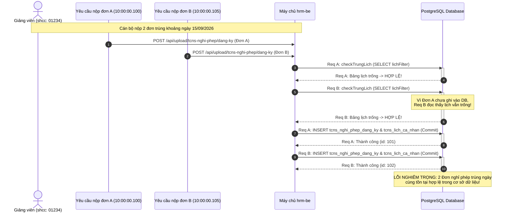

# MỤC 4.1: PHÂN TÍCH HIỆN TRẠNG HỆ THỐNG QUẢN LÝ NHÂN SỰ VÀ ĐIỀU HÀNH TẠI TRƯỜNG ĐẠI HỌC BÁCH KHOA – ĐHQG-HCM
# (07_SECTION_4_1_CURRENT_STATE.md)

> **Đề tài Đồ án Tốt nghiệp:** Phát triển ứng dụng di động phục vụ nhân sự Trường Đại học (MyHCMUT Mobile)  
> **Cơ quan chủ quản:** Trường Đại học Bách khoa – Đại học Quốc gia Thành phố Hồ Chí Minh  
> **Sinh viên thực hiện:**  
> - Vũ Xuân Chính (MSSV: 2210392) — Kiến trúc Mobile Core, SSO Ticket Bridge, Phân hệ Nghỉ phép & Hồ sơ Cán bộ, FCM Push Hub.  
> - Tống Duy Khang (MSSV: 2211467) — Phân hệ Văn phòng số iOffice (Văn bản đến/đi, Trình đọc PDF) & Quản lý Nhiệm vụ (Missions/Tasks).  
> **Giảng viên hướng dẫn:** ThS. Nguyễn Thanh Tùng  
> **Mốc thẩm định kỹ thuật:** Gate 0 — Khóa Baseline Học thuật & Concurrency Hardening (Tháng 09/2026)  
> **Kho mã nguồn đối chiếu:**  
> - Mobile Client: `myhcmut-mobile` (Commit `161d5bb848f97983682654e17771b88aeb638af6`, nhánh `feat/leaveRequest`)  
> - Backend Server: `hrm-be` (Commit `38745a26a45fc49c8c5c1cbcf3b91a76f23ae945`, nhánh `chinh-dev` / `refactor/check-trung-lich-advisory-lock`)  
> - Backend Gateway: `myhcmut-be` (Commit `7e687a6005ceb6264f3467072081c784a6f9c7bc`, nhánh `dev/khang-chinh`)  
> - Backend iOffice: `ioffice-be` (Commit `53f069a366f7d465253b6fceedeea25a01bec176`, nhánh `main`)  
> - Web Frontend HRM: `hrm-fe` (Commit `83caf6488be3f3f83eee783b8ec8ef832a8e02d0`, nhánh `main`)  

---

## MỤC LỤC

1. [BỐI CẢNH VÀ HIỆN TRẠNG QUẢN LÝ NHÂN SỰ TẠI TRƯỜNG ĐHBK – ĐHQG-HCM](#1-bối-cảnh-và-hiện-trạng-quản-lý-nhân-sự-tại-trường-đhbk--đhqg-hcm)
   - [1.1. Quy mô nhân sự và đặc thù vận hành đa cơ sở](#11-quy-mô-nhân-sự-và-đặc-thù-vận-hành-đa-cơ-sở)
   - [1.2. Tính chất công tác linh hoạt của đội ngũ giảng viên và cán bộ quản lý](#12-tính-chất-công-tác-linh-hoạt-của-đội-ngũ-giảng-viên-và-cán-bộ-quản-lý)
   - [1.3. Sự phân mảnh của các cổng thông tin tác nghiệp hiện hữu](#13-sự-phân-mảnh-của-các-cổng-thông-tin-tác-nghiệp-hiện-hữu)
2. [KIẾN TRÚC HỆ THỐNG WEB HRM HIỆN HỮU](#2-kiến-trúc-hệ-thống-web-hrm-hiện-hữu)
   - [2.1. Mô hình phân tầng nguyên khối (Layered Monolithic Backend)](#21-mô-hình-phân-tầng-nguyên-khối-layered-monolithic-backend)
   - [2.2. Ngăn xếp công nghệ nền tảng (Technology Stack)](#22-ngăn-xếp-công-nghệ-nền-tảng-technology-stack)
   - [2.3. Động cơ quy trình động và cơ chế luân chuyển dữ liệu](#23-động-cơ-quy-trình-động-và-cơ-chế-luân-chuyển-dữ-liệu)
   - [2.4. Sơ đồ kiến trúc tổng thể Web HRM và các dịch vụ tích hợp](#24-sơ-đồ-kiến-trúc-tổng-thể-web-hrm-và-các-dịch-vụ-tích-hợp)
3. [BỐN HẠN CHẾ CỐT LÕI CỦA GIẢI PHÁP WEB TRUYỀN THỐNG](#3-bốn-hạn-chế-cốt-lõi-của-giải-pháp-web-truyền-thống)
   - [3.1. Hạn chế 1: Thiếu tính cơ động trên thiết bị di động (Lack of Mobility & Non-adaptive UX)](#31-hạn-chế-1-thiếu-tính-cơ-động-trên-thiết-bị-di-động-lack-of-mobility--non-adaptive-ux)
   - [3.2. Hạn chế 2: Độ trễ nhận thông báo và phản hồi phê duyệt (Approval Notification Latency)](#32-hạn-chế-2-độ-trễ-nhận-thông-báo-và-phản-hồi-phê-duyệt-approval-notification-latency)
   - [3.3. Hạn chế 3: Quy trình nộp và duyệt phép phức tạp, chưa tối ưu cho thao tác chạm (Friction in Leave Management & Touch UX)](#33-hạn-chế-3-quy-trình-nộp-và-duyệt-phép-phức-tạp-chưa-tối-ưu-cho-thao-tác-chạm-friction-in-leave-management--touch-ux)
   - [3.4. Hạn chế 4: Điểm nghẽn tương tranh và thiếu ranh giới Transaction bọc kín các đường ghi (Concurrency Bottlenecks & Missing Transaction Boundaries)](#34-hạn-chế-4-điểm-nghẽn-tương-tranh-và-thiếu-ranh-giới-transaction-bọc-kín-các-đường-ghi-concurrency-bottlenecks--missing-transaction-boundaries)
4. [ĐỊNH VỊ CỦA MYHCMUT MOBILE: PHÂN HỆ MỞ RỘNG ĐA KÊNH (OMNICHANNEL EXTENSION)](#4-định-vị-của-myhcmut-mobile-phân-hệ-mở-rộng-đa-kênh-omnichannel-extension)
   - [4.1. Bản chất phân hệ mở rộng đồng hành (Co-existing Extension, Not a Replacement)](#41-bản-chất-phân-hệ-mở-rộng-đồng-hành-co-existing-extension-not-a-replacement)
   - [4.2. Phân định trách nhiệm và kịch bản người dùng (Separation of Concerns)](#42-phân-định-trách-nhiệm-và-kịch-bản-người-dùng-separation-of-concerns)
   - [4.3. Mô hình tích hợp lai (Hybrid WebApp Bridge qua One-Time Ticket SSO)](#43-mô-hình-tích-hợp-lai-hybrid-webapp-bridge-qua-one-time-ticket-sso)
   - [4.4. Đồng bộ hóa hai chiều và tái sử dụng hạ tầng sẵn có (Bidirectional Synchronization)](#44-đồng-bộ-hóa-hai-chiều-và-tái-sử-dụng-hạ-tầng-sẵn-có-bidirectional-synchronization)
5. [MINH CHỨNG THỰC TẾ TỪ MÃ NGUỒN VÀ KIỂM THỬ ĐỐI CHUẨN](#5-minh-chứng-thực-tế-từ-mã-nguồn-và-kiểm-thử-đối-chuẩn)
   - [5.1. Dẫn chứng mã nguồn kiểm toán các lỗ hổng tương tranh trên Web HRM](#51-dẫn-chứng-mã-nguồn-kiểm-toán-các-lỗ-hổng-tương-tranh-trên-web-hrm)
   - [5.2. Hiện thực cơ chế khóa tương tranh PostgreSQL Advisory Lock 2 thành phần](#52-hiện-thực-cơ-chế-khóa-tương-tranh-postgresql-advisory-lock-2-thành-phần)
   - [5.3. Bằng chứng kiểm thử tự động 100% Pass Rate (392/392 Test Cases)](#53-bằng-chứng-kiểm-thử-tự-động-100-pass-rate-392392-test-cases)
   - [5.4. Bảng đối chiếu toàn diện: Hiện trạng Web HRM cũ và Hệ sinh thái MyHCMUT Mobile](#54-bảng-đối-chiếu-toàn-diện-hiện-trạng-web-hrm-cũ-và-hệ-sinh-thái-myhcmut-mobile)
6. [KẾT LUẬN VÀ CHUYỂN TIẾP SANG ĐẶC TẢ YÊU CẦU CHI TIẾT (MỤC 4.2)](#6-kết-luận-và-chuyển-tiếp-sang-đặc-tả-yêu-cầu-chi-tiết-mục-42)

---

## 1. BỐI CẢNH VÀ HIỆN TRẠNG QUẢN LÝ NHÂN SỰ TẠI TRƯỜNG ĐHBK – ĐHQG-HCM

### 1.1. Quy mô nhân sự và đặc thù vận hành đa cơ sở
Trường Đại học Bách khoa – Đại học Quốc gia Thành phố Hồ Chí Minh (ĐHBK – ĐHQG-HCM) là một trong những trung tâm đào tạo, nghiên cứu khoa học và chuyển giao công nghệ hàng đầu tại Việt Nam. Theo số liệu công bố thường niên (Báo cáo Ba công khai và Cổng thông tin điện tử Nhà trường `hcmut.edu.vn`), quy mô nhân sự của Trường bao gồm **hơn 1.000 cán bộ, giảng viên, nghiên cứu viên và chuyên viên hành chính**, công tác tại 12 khoa chuyên ngành, 8 phòng chức năng, 13 trung tâm nghiên cứu - chuyển giao công nghệ và các đơn vị dịch vụ phụ trợ.

Về mặt địa lý, Trường ĐHBK – ĐHQG-HCM vận hành đồng thời trên hai cơ sở đào tạo quy mô lớn:
- **Cơ sở 1 (Trụ sở chính):** Tọa lạc tại số 268 Lý Thường Kiệt, Phường 14, Quận 10, Thành phố Hồ Chí Minh — nơi đặt trụ sở Ban Giám hiệu, các Phòng ban chức năng, văn phòng các Khoa chuyên ngành và hệ thống phòng thí nghiệm trọng điểm.
- **Cơ sở 2 (Cơ sở Dĩ An):** Tọa lạc tại Khu đô thị Đại học Quốc gia Thành phố Hồ Chí Minh, Thành phố Dĩ An, Tỉnh Bình Dương — phục vụ công tác giảng dạy cho sinh viên đại học chính quy, các xưởng thực tập và trung tâm nghiên cứu công nghệ tiên tiến.

Khoảng cách thực tế giữa hai cơ sở xấp xỉ 25 km, đòi hỏi việc di chuyển liên tục bằng phương tiện cá nhân hoặc xe buýt nội bộ của Nhà trường. Do đó, một bộ phận lớn cán bộ giảng dạy và lãnh đạo khoa/phòng phải phân chia thời gian biểu làm việc linh hoạt giữa hai địa điểm trong cùng một tuần làm việc.

### 1.2. Tính chất công tác linh hoạt của đội ngũ giảng viên và cán bộ quản lý
Đặc thù công tác trong môi trường đại học kỹ thuật đòi hỏi cán bộ, giảng viên phải thực hiện đa nhiệm:
1. **Giảng dạy trên lớp và hướng dẫn thí nghiệm:** Giảng viên thường xuyên đứng lớp tại giảng đường hoặc làm việc trong phòng thí nghiệm, không ngồi cố định trước máy tính để bàn (Desktop PC).
2. **Nghiên cứu khoa học và hội thảo:** Cán bộ khoa học thường xuyên tham gia các đề tài nghiên cứu thực địa, chuyến đi công tác trong và ngoài nước, cũng như các hội nghị học thuật quốc tế.
3. **Điều hành và ra quyết định hành chính:** Các Trưởng/Phó Khoa, Trưởng Bộ môn, Giám đốc Trung tâm thường xuyên phải tham gia các phiên họp liên tịch, hội đồng nghiệm thu đề tài hoặc công tác đối ngoại ngoài văn phòng.

Khi phát sinh nhu cầu hành chính đột xuất — như gửi đơn xin nghỉ phép vì lý do ốm đau/việc riêng, tra cứu thông tin lý lịch cá nhân để hoàn thiện hồ sơ đề bạt, hoặc phê duyệt khẩn cấp đơn nghỉ phép cho cán bộ cấp dưới nhằm kịp thời bố trí giảng viên dạy thay — đội ngũ nhân sự gặp rào cản rất lớn nếu toàn bộ quy trình chỉ vận hành trên cổng Web truyền thống.

### 1.3. Sự phân mảnh của các cổng thông tin tác nghiệp hiện hữu
Trước khi triển khai nghiên cứu phân hệ di động MyHCMUT, công tác quản trị và tác nghiệp nội bộ của Trường ĐHBK – ĐHQG-HCM dựa trên ba hệ thống phần mềm nền tảng độc lập:
- **Hệ thống Quản lý Nhân sự (HRM Web Portal):** Phục vụ quản lý hồ sơ lý lịch cán bộ, quá trình lương, ngạch bậc, thi đua khen thưởng, đăng ký và duyệt nghỉ phép, đi công tác.
- **Hệ thống Văn phòng điện tử (iOffice Web Portal):** Phục vụ xử lý văn bản đến/đi, phát hành công văn, theo dõi chỉ đạo công việc và tổng hợp lịch công tác tuần.
- **Hệ thống Định danh Xác thực tập trung (HCMUT CAS / LDAP SSO):** Đảm nhiệm vai trò máy chủ xác thực tài khoản tập trung (`Central Authentication Service`) cho toàn thể viên chức và sinh viên.

Mặc dù các hệ thống này đã từng bước số hóa nghiệp vụ giấy tờ truyền thống, sự **phân mảnh về giao diện người dùng** và **thiếu tính kết nối di động** tạo ra trải nghiệm rời rạc:
- Cán bộ phải ghi nhớ nhiều địa chỉ URL khác nhau để thực hiện các nghiệp vụ thường nhật.
- Mỗi hệ thống Web được thiết kế độc lập theo chuẩn desktop màn hình rộng, không được tối ưu hóa cho màn hình cảm ứng di động cỡ nhỏ.
- Không tồn tại một kênh truyền thông di động hợp nhất để gom tụ thông báo đẩy và hỗ trợ điều hướng sâu (Deep Linking) trực tiếp đến tác vụ cần xử lý.

---

## 2. KIẾN TRÚC HỆ THỐNG WEB HRM HIỆN HỮU

### 2.1. Mô hình phân tầng nguyên khối (Layered Monolithic Backend)
Hệ thống máy chủ Quản lý Nhân sự hiện hữu (`hrm-be`) của Nhà trường được xây dựng theo mô hình **Kiến trúc Phân tầng (Layered Architecture)** chạy trên nền tảng nguyên khối mô-đun hóa (Modular Monolith):
1. **Tầng Định tuyến & Kiểm soát (Routing & Controller Layer):** Tiếp nhận các yêu cầu HTTP/RESTful thông qua Express.js framework, bóc tách `body`, `query`, giải mã JWT Cookie/Bearer và ủy quyền xử lý nghiệp vụ.
2. **Tầng Mô hình & Dịch vụ Nghiệp vụ (Model & Business Logic Layer):** Định nghĩa cấu trúc thực thể và quan hệ thông qua thư viện Sequelize ORM, hiện thực các quy tắc nghiệp vụ (Business Rules), kiểm tra hạn mức, thời gian và trạng thái xử lý hồ sơ.
3. **Tầng Truy vấn Nâng cao (Stored Procedures & Function Layer):** Đối với các tác vụ tổng hợp dữ liệu phức tạp (như bộ lọc lịch cá nhân, kiểm tra xung đột thời gian, kết chuyển sổ phép năm), hệ thống gọi trực tiếp các hàm thủ tục lưu trữ (Stored Procedures/Functions) viết bằng ngôn ngữ PL/pgSQL trong PostgreSQL.
4. **Tầng Trình diễn Phía Khách (Frontend SPA):** Xây dựng bằng React.js (`hrm-fe`), biên dịch thành mã nguồn tĩnh chạy trên trình duyệt người dùng, giao tiếp với máy chủ backend qua các cuộc gọi REST API và sử dụng Cookie-based session (`connect.sid`).

### 2.2. Ngăn xếp công nghệ nền tảng (Technology Stack)
Ngăn xếp công nghệ cốt lõi cấu thành hệ thống Web HRM hiện hữu bao gồm:
- **Môi trường thực thi:** Node.js LTS (môi trường đối chuẩn kiểm thử: `v22.22.2`), trình biên dịch TypeScript `5.x`.
- **Khung ứng dụng Web:** Express.js `4.x`, tích hợp các middleware bảo mật cơ bản (`cors`, `cookie-parser`, `body-parser`).
- **Tầng ánh xạ quan hệ đối tượng:** Sequelize ORM `6.x` kết hợp trình điều khiển cơ sở dữ liệu `pg` và `pg-hstore`.
- **Hệ quản trị cơ sở dữ liệu:** PostgreSQL `14.x`, lưu trữ phân vùng các lược đồ (schemas) phục vụ phân hệ nhân sự (`tcns-dev`, `hcmut_hrm_release`).
- **Bộ nhớ đệm & Phiên làm việc:** Redis `7.x` dùng để lưu trữ session web (`connect.sid`) và bộ nhớ đệm tạm.
- **Hạ tầng thông điệp bất đồng bộ:** Apache Kafka Broker, đóng vai trò tiếp nhận sự kiện từ backend để chuyển tiếp sang dịch vụ thông báo qua topic `SEND_NOTIFY_SERVICE`.

### 2.3. Động cơ quy trình động và cơ chế luân chuyển dữ liệu
Điểm đặc thù của Web HRM là việc áp dụng **Động cơ Quy trình Động (Dynamic Workflow Engine)** để quản lý vòng đời của các loại hồ sơ hành chính (nghỉ phép, sửa lý lịch, đi công tác). Cơ chế này được duy trì thông qua cụm 3 bảng CSDL cốt lõi:
1. `tcns_quy_trinh`: Định nghĩa các bước phê duyệt theo ma trận cấu hình (ví dụ: Cán bộ tạo đơn -> Lãnh đạo Đơn vị duyệt -> Chuyên viên TCCB xác nhận -> Ban Giám hiệu phê chuẩn).
2. `tcns_quy_trinh_history`: Ghi nhận nhật ký xử lý (audit log) bao gồm người xử lý (`shcc`), thời điểm thao tác, trạng thái hành động (`DANG_XU_LY`, `DUYET`, `TRA_LAI`, `TU_CHOI`, `THU_HOI`) và ý kiến phản hồi.
3. `tcns_quy_trinh_user`: Quản lý danh sách các cán bộ có thẩm quyền phê duyệt tại từng bước của quy trình tương ứng với mã đơn vị công tác (`maDonVi`).

Song song với quy trình động, hệ thống quản lý lịch làm việc của cán bộ thông qua bảng `tcns_lich_ca_nhan` (phân loại: nghỉ phép `NP`, đi công tác `CT`, họp nội bộ `HOP`) và bảng `tcns_so_nghi_phep_nam` theo dõi hạn mức số ngày phép năm còn lại.

### 2.4. Sơ đồ kiến trúc tổng thể Web HRM và các dịch vụ tích hợp
Dưới đây là sơ đồ kiến trúc tổng thể thể hiện cấu trúc phân tầng và tương tác giữa hệ thống Web HRM hiện hữu với các hạ tầng dịch vụ liên quan:

```mermaid
flowchart TB
    subgraph ClientTier["TẦNG KHÁCH HÀNG (CLIENT TIER)"]
        Browser["Trình duyệt Desktop (React.js SPA / hrm-fe)<br/>Màn hình độ phân giải cao / Chuột & Bàn phím"]
    end

    subgraph GatewayTier["TẦNG ĐỊNH DANH & XÁC THỰC"]
        CAS["HCMUT CAS Server (Port 443)<br/>Central Authentication Service"]
        LDAP["HCMUT LDAP Server (Port 389)<br/>Danh bạ tài khoản cán bộ"]
    end

    subgraph AppTier["TẦNG MÁY CHỦ ỨNG DỤNG (hrm-be: Port 6023)"]
        Router["Express Router & Auth Middleware<br/>(Cookie-based Session / Bearer JWT)"]
        
        subgraph Controllers["Bộ Điều Khiển Nghiệp Vụ (Controllers)"]
            ProfileCtrl["Staff Profile Controller<br/>(11 Danh mục Lý lịch)"]
            LeaveCtrl["TCNS Nghi Phep Controller<br/>(Dang-ky, Validate, Duyet)"]
            WorkflowCtrl["Workflow Engine Controller<br/>(Phê duyệt nhiều bước)"]
        end
        
        subgraph LogicServices["Tầng Nghiệp Vụ & Mô Hình (Models & Helpers)"]
            LichModel["tcnsLichCaNhan Model<br/>(checkTrungLich, lichFilter)"]
            LeaveModel["tcnsNghiPhepDangKy Model<br/>(Quản lý phiếu nghỉ phép)"]
            QuyTrinhHelper["sendQuyTrinhNotification<br/>(Helper phát sự kiện)"]
        end
    end

    subgraph DataTier["TẦNG DỮ LIỆU & HẠ TẦNG PHỤ TRỢ"]
        Postgres[(PostgreSQL 14.x Database)<br/>Schemas: tcns-dev, hcmut_hrm_release<br/>Tables: tcns_lich_ca_nhan, tcns_nghi_phep_dang_ky,<br/>tcns_so_nghi_phep_nam, tcns_quy_trinh]
        RedisNode[(Redis 7.x Cache & Session Store)<br/>connect.sid Web Sessions]
        KafkaBroker["Apache Kafka Broker<br/>Topic: SEND_NOTIFY_SERVICE"]
    end

    subgraph ExternalNotice["DỊCH VỤ THÔNG BÁO HIỆN HỮU"]
        EmailService["Máy chủ Gửi Email Nội bộ<br/>(Gửi thông báo phê duyệt thụ động)"]
    end

    Browser <-->|HTTP/REST API + Cookie| Router
    Browser -.->|Redirect đăng nhập SSO| CAS
    CAS <-->|Tra cứu thông tin tài khoản| LDAP
    CAS -.->|Tạo phiên làm việc| RedisNode

    Router --> ProfileCtrl
    Router --> LeaveCtrl
    Router --> WorkflowCtrl

    ProfileCtrl --> Postgres
    LeaveCtrl --> LeaveModel
    LeaveCtrl --> LichModel
    WorkflowCtrl --> QuyTrinhHelper

    LeaveModel <-->|Sequelize ORM| Postgres
    LichModel <-->|PL/pgSQL SP & Functions| Postgres
    QuyTrinhHelper -.->|Gửi bản tin sự kiện| KafkaBroker
    KafkaBroker -.->|Consumer chuyển tiếp| EmailService
```

---

## 3. BỐN HẠN CHẾ CỐT LÕI CỦA GIẢI PHÁP WEB TRUYỀN THỐNG

Qua quá trình khảo sát thực tế, phỏng vấn nhu cầu của đội ngũ cán bộ, giảng viên, lãnh đạo khoa/phòng và chuyên viên Phòng Tổ chức – Cán bộ (TCCB) tại Trường ĐHBK – ĐHQG-HCM, cùng với kết quả kiểm toán mã nguồn chuyên sâu trên kho máy chủ `hrm-be`, nhóm nghiên cứu đã xác định **bốn hạn chế cốt lõi** mang tính hệ thống của giải pháp Web HRM truyền thống:

```
┌────────────────────────────────────────────────────────────────────────────────────────┐
│               BỐN HẠN CHẾ CỐT LÕI CỦA HỆ THỐNG WEB HRM TRUYỀN THỐNG                    │
├────────────────────────────────────────────────────────────────────────────────────────┤
│ 1. THIẾU TÍNH CƠ ĐỘNG (LACK OF MOBILITY & NON-ADAPTIVE UX)                             │
│    • Giao diện Web Desktop không thích ứng tốt trên màn hình cảm ứng di động.          │
│    • Bảng biểu 11 phân mục lý lịch và danh sách đơn bị tràn ngang, nút bấm quá nhỏ.   │
│    • Bất tiện khi cán bộ di chuyển giữa 2 cơ sở (Q.10 - Dĩ An) hoặc đi công tác xa.   │
├────────────────────────────────────────────────────────────────────────────────────────┤
│ 2. ĐỘ TRỄ NHẬN THÔNG BÁO PHÊ DUYỆT (APPROVAL NOTIFICATION LATENCY)                     │
│    • Phụ thuộc hoàn toàn vào việc mở trình duyệt web hoặc kiểm tra hòm thư email.     │
│    • Thiếu cơ chế Push Notification tức thời trên thiết bị cầm tay.                    │
│    • Đơn xin nghỉ phép gấp bị treo trễ, cản trở việc bố trí giảng viên dạy thay.       │
├────────────────────────────────────────────────────────────────────────────────────────┤
│ 3. QUY TRÌNH NGHỈ PHÉP PHỨC TẠP, THIẾU TỐI ƯU CHO THAO TÁC CHẠM (TOUCH UX FRICTION)    │
│    • Biểu mẫu một trang quá dài, gây quá tải nhận thức cho người nhập liệu.            │
│    • Không hỗ trợ tiền kiểm tra điều kiện (Pre-check) ngày lễ, thứ 7/CN theo thời gian │
│      thực trước khi gửi đơn; thiếu cảnh báo nộp trễ hạn (Late Leave).                  │
│    • Đính kèm minh chứng phức tạp; không có tính năng duyệt hàng loạt (Batch Action).  │
├────────────────────────────────────────────────────────────────────────────────────────┤
│ 4. ĐIỂM NGHẼN TƯƠNG TRANH & THIẾU TRANSACTION BỌC KÍN (CONCURRENCY BOTTLENECKS)        │
│    • Lỗ hổng Check-then-Act Race Condition trong checkTrungLich (không có khóa CSDL).  │
│    • Các đường ghi Web và thao tác xoá 5 bảng thực thi ngoài CSDL Transaction.        │
│    • Vi phạm Atomic State Guard dẫn đến nguy cơ ghi đè trạng thái (Lost Update).       │
│    • Rủi ro Dual-Write với Apache Kafka làm phát tán thông báo ma (Ghost Events).      │
└────────────────────────────────────────────────────────────────────────────────────────┘
```

### 3.1. Hạn chế 1: Thiếu tính cơ động trên thiết bị di động (Lack of Mobility & Non-adaptive UX)
Hệ thống Web HRM hiện hữu (`hrm-fe`) được thiết kế tối ưu hóa riêng cho màn hình máy tính để bàn hoặc laptop với độ phân giải cao (chuẩn từ 1366x768 trở lên). Khi cán bộ truy cập bằng trình duyệt trên điện thoại thông minh (màn hình phổ biến từ 5.5 đến 6.7 inch), giao diện gặp phải hàng loạt trở ngại:
1. **Tràn khung nhìn và cuộn ngang liên tục (Horizontal Scrolling):** Các bảng biểu quản lý lý lịch (gồm 11 phân mục chi tiết như Quá trình lương, Đào tạo, Khen thưởng, Gia đình) và danh sách phiếu nghỉ phép được tổ chức theo định dạng bảng lưới nhiều cột (data grid). Trên màn hình điện thoại, bảng bị tràn ngang nghiêm ngặt, buộc người dùng phải liên tục vuốt ngang và vuốt dọc để đọc trọn vẹn một dòng dữ liệu.
2. **Kích thước mục tiêu cảm ứng quá nhỏ (Small Touch Targets):** Các nút bấm chức năng (như biểu tượng Xem chi tiết, Phê duyệt, Từ chối, Sửa đơn) được thiết kế với kích thước chỉ từ 16x16 đến 24x24 pixel — phù hợp với con trỏ chuột chính xác nhưng vi phạm nghiêm trọng tiêu chuẩn thiết kế cảm ứng của Google Material Design và Apple Human Interface Guidelines (yêu cầu kích thước tối thiểu là 48x48 dp hoặc 44x44 pt), dẫn đến tình trạng chạm nhầm nút liên tục.
3. **Sự gián đoạn tác nghiệp khi di chuyển giữa 2 cơ sở:** Khi giảng viên đang di chuyển trên xe buýt nội bộ giữa Cơ sở Quận 10 và Cơ sở Dĩ An, hoặc đang tham gia hội thảo bên ngoài, việc phải mở máy tính xách tay, kết nối mạng trung gian (Wi-Fi công cộng hoặc phát 4G từ điện thoại) chỉ để tra cứu một mã số thuế cá nhân hoặc phê duyệt một lá đơn xin nghỉ phép nửa ngày tạo ra sự bất tiện và chậm trễ lớn.

### 3.2. Hạn chế 2: Độ trễ nhận thông báo và phản hồi phê duyệt (Approval Notification Latency)
Kênh truyền thông thông báo của Web HRM hiện hữu phụ thuộc vào hai phương thức thụ động:
1. **Thông báo nội bộ trên giao diện Web (In-app Web Badge):** Cán bộ chỉ có thể nhìn thấy quả chuông thông báo màu đỏ khi đã chủ động bật trình duyệt web, đăng nhập vào cổng HRM và giữ tab làm việc ở trạng thái mở.
2. **Thông báo qua thư điện tử (Email Notification):** Máy chủ gửi thông báo qua máy chủ SMTP nội bộ đến hòm thư đuôi `@hcmut.edu.vn`. Phương thức này gặp phải độ trễ tự nhiên rất lớn:
   - Email dễ bị trôi giữa hàng trăm email công việc, thông báo giảng dạy và thư tiếp thị mỗi ngày, hoặc rơi vào hòm thư rác (Spam/Junk).
   - Đa số cán bộ không thiết lập chế độ đồng bộ Push Email liên tục trên điện thoại nhằm tiết kiệm pin và dữ liệu di động, dẫn đến việc thư thông báo chỉ được đọc sau vài giờ hoặc thậm chí vài ngày.

**Hậu quả thực tế:**
- **Đơn nghỉ phép khẩn cấp bị treo trệ:** Khi một giảng viên gặp sự cố sức khỏe đột xuất vào sáng sớm và nộp đơn xin nghỉ dạy ca sáng, Trưởng Khoa hoặc Trưởng Bộ môn không nhận được tín hiệu cảnh báo tức thời trên điện thoại. Hậu quả là lớp học không kịp thời được thông báo hoãn hoặc không có giảng viên dạy thay, gây gián đoạn kế hoạch học tập của hàng trăm sinh viên.
- **Phản hồi đơn bị đứt quãng:** Khi cấp quản lý trả lại đơn yêu cầu giải trình thêm hoặc từ chối đơn, cán bộ nộp đơn không nắm được thông tin ngay để bổ sung minh chứng, gây bức xúc và hiểu lầm trong quy trình phối hợp nội bộ.

### 3.3. Hạn chế 3: Quy trình nộp và duyệt phép phức tạp, chưa tối ưu cho thao tác chạm (Friction in Leave Management & Touch UX)
Quy trình nộp và phê duyệt đơn nghỉ phép trên Web HRM hiện hữu tồn tại nhiều điểm nghẽn về mặt trải nghiệm người dùng (UX Friction):
1. **Biểu mẫu đăng ký nguyên khối (Single monolithic form):** Giao diện đăng ký nghỉ phép trên web dồn toàn bộ các trường nhập liệu lên một màn hình duy nhất (Loại phép, Thời gian bắt đầu, Buổi bắt đầu, Thời gian kết thúc, Buổi kết thúc, Địa điểm nghỉ, Lý do, Số điện thoại liên lạc, Cán bộ bàn giao, Tệp đính kèm). Cán bộ phải đối mặt với tình trạng quá tải nhận thức (Cognitive Overload), đặc biệt dễ nhập sai hoặc bỏ sót trường bắt buộc khi thao tác trên màn hình nhỏ.
2. **Thiếu cơ chế tiền kiểm tra điều kiện (Pre-check) đa giai đoạn:**
   - Web HRM không có thuật toán tự động tính toán số ngày nghỉ thực tế loại trừ Thứ Bảy, Chủ Nhật, các ngày nghỉ Lễ/Tết theo quy định của CSDL `dm_ngay_le` ngay tại thời điểm người dùng chọn ngày trên lịch. Người dùng không biết chắc chắn đơn của mình sẽ trừ bao nhiêu ngày phép cho đến khi submit xong đơn.
   - Hệ thống không cảnh báo trước quy tắc nộp trễ hạn (`checkIfTooLate`): Theo quy định của Nhà trường, nghỉ phép trong nước phải nộp trước tối thiểu 2 ngày làm việc, nghỉ nước ngoài hoặc từ 5 ngày trở lên phải nộp trước 3 ngày làm việc. Trên Web, cán bộ nộp xong đơn mới bị hệ thống báo lỗi hoặc bị trả đơn, gây lãng phí thời gian thao tác.
3. **Trở ngại trong việc đính kèm minh chứng số:** Đối với các diện nghỉ phép bắt buộc minh chứng (nghỉ ốm đau có chỉ định của bác sĩ, nghỉ thai sản, nghỉ tai nạn), giao diện Web yêu cầu người dùng phải chụp ảnh bằng điện thoại, sau đó cắm cáp chuyển ảnh sang máy tính hoặc gửi qua mạng xã hội, rồi mới tải tệp lên cổng Web. Quy trình này cồng kềnh, mất nhiều thời gian và làm giảm chất lượng hình ảnh văn bản.
4. **Thiếu công cụ phê duyệt hàng loạt trực quan cho cấp quản lý:** Vào các thời điểm cao điểm trong năm (trước kỳ nghỉ hè, dịp Tết Nguyên đán), Lãnh đạo Đơn vị nhận được hàng chục đơn xin nghỉ phép cùng lúc. Trên Web, Lãnh đạo buộc phải click chuột vào từng đơn, mở trang chi tiết, đọc nội dung, bấm nút duyệt, rồi quay lại danh sách để duyệt đơn tiếp theo. Việc thiếu thanh thao tác duyệt hàng loạt (Batch Action Bar) bằng cử chỉ chạm tạo ra gánh nặng hành chính không đáng có.

### 3.4. Hạn chế 4: Điểm nghẽn tương tranh và thiếu ranh giới Transaction bọc kín các đường ghi (Concurrency Bottlenecks & Missing Transaction Boundaries)
Bên cạnh các hạn chế về giao diện và truyền thông, kết quả kiểm toán mã nguồn chuyên sâu tại báo cáo kỹ thuật `00B_CONCURRENCY_WRITE_PATH_AUDIT.md` trên kho máy chủ `hrm-be` đã phát hiện **các lỗ hổng tương tranh nghiêm trọng cấp cơ sở dữ liệu** trong luồng xử lý nghỉ phép hiện hữu:

#### A. Lỗ hổng Check-then-Act Race Condition trong `checkTrungLich`
Phương thức kiểm tra trùng lịch cốt lõi của hệ thống tại `modules/md_tcns/tcns_lich_ca_nhan/model/tcns_lich_ca_nhan.model.ts` hoàn toàn không hỗ trợ lan truyền giao dịch CSDL (`options?: { transaction?: Transaction }`).

Đặc biệt, bên trong hàm `lichFilter` (được gọi bởi `checkTrungLich`), đoạn mã nguồn thực thi:
```typescript
// tcns_lich_ca_nhan.model.ts (L67-78)
static lichFilter = async (filter: string, options: { transaction?: Sequelize.Transaction } = {}): Promise<ILichFilter> => {
    // Nếu options.transaction không có, tự ý mở một transaction độc lập!
    const t = options.transaction || await BkcoretechModel.connection.transaction();
    try {
        const callResults: string[] = [`ref_${this.uniqueId()}`];
        await BkcoretechModel.connection.query(`select tcns_lich_ca_nhan_lich_filter(\'${callResults[0]}\', :filter);`, {
            replacements: { filter: filter }, raw: true, transaction: t
        });
        const [callResult0] = await Promise.all(callResults.map(i => BkcoretechModel.connection.query(`fetch all in ${i};`, { raw: true, transaction: t }).then(r => r[0])));
        
        // COMMIT transaction t ngay lập tức trước khi luồng ghi bắt đầu!
        !options.transaction && await t.commit();
        return { list: callResult0 } as unknown as ILichFilter;
    } ...
}
```

**Hậu quả:** 
- Vì `checkTrungLich` không truyền transaction, `lichFilter` tự động xin một kết nối khác trong connection pool, mở transaction riêng và `commit()` ngay tức khắc.
- Toàn bộ bước kiểm tra chạy trên snapshot đọc độc lập và không thiết lập bất kỳ cơ chế khóa nào (`SELECT FOR UPDATE` hay `pg_advisory_xact_lock`).
- **Hiện tượng Trùng Lịch Kép (Double-Booking Anomaly):** Nếu hai yêu cầu nộp đơn trùng khoảng thời gian của cùng một cán bộ viên chức (`shcc`) được gửi tới máy chủ gần như đồng thời (ví dụ: người dùng bấm nút gửi liên tục do mạng chập chờn, hoặc mở 2 tab web/app cùng lúc), cả Request A và Request B đều vượt qua hàm `checkTrungLich` tại cùng một thời điểm vì bảng lịch lúc đó chưa có bản ghi mới. Sau đó, cả hai request lần lượt chèn bản ghi vào `tcns_lich_ca_nhan`. Kết quả: **Hai phiếu nghỉ phép trùng giờ của cùng một nhân viên đều được hệ thống chấp nhận ghi đè vào CSDL**.



#### B. Thiếu ranh giới Transaction bọc kín trên các đường ghi Web và Thao tác Xóa đa bảng
1. **Endpoint `POST /api/upload/tcns-nghi-phep/dang-ky` (Dành cho Web):**
   Hoàn toàn **không mở transaction CSDL**. Quá trình ghi dữ liệu được thực thi phân mảnh qua các dòng lệnh tách rời:
   - Dòng 157: `app.model.tcnsNghiPhepDangKy.create(...)`
   - Dòng 166: `Promise.all([ app.model.tcnsQuyTrinh.bulkCreate(...), app.model.tcnsLichCaNhan.create(...), ... ])`
   - Dòng 175: `await updateHistory(...)`
   Nếu tiến trình máy chủ bị sập hoặc kết nối CSDL bị ngắt giữa dòng 157 và dòng 166, bản ghi phiếu nghỉ phép đã được chèn nhưng không có các bước quy trình và không có lịch cá nhân. Bản ghi này biến thành **dữ liệu rác không hoàn chỉnh (Partial Write Failure)** trong hệ thống.
2. **Endpoint Xóa đơn `DELETE /api/tcns-nghi-phep/dang-ky/:id`:**
   Mã nguồn hiện hữu sử dụng `Promise.all` bắn 5 câu lệnh `DELETE` song song trên 5 kết nối độc lập mà không có transaction bao bọc:
   ```typescript
   // tcns_nghi_phep/controller.ts (L312-318)
   await Promise.all([
       app.model.tcnsNghiPhepDangKy.delete({ id }),
       app.model.tcnsLichCaNhan.delete({ phieuId: id, phanLoai: PHAN_LOAI }),
       app.model.tcnsQuyTrinh.delete({ phieuId: id, phanLoai: PHAN_LOAI }),
       app.model.tcnsQuyTrinhHistory.delete({ phieuId: id, phanLoai: PHAN_LOAI }),
       app.model.tcnsQuyTrinhUser.delete({ phieuId: id, phanLoai: PHAN_LOAI }),
   ]);
   ```
   **Nguy cơ Bản ghi mồ côi (Orphan Records):** Nếu lệnh xóa phiếu `tcnsNghiPhepDangKy` thành công nhưng lệnh xóa lịch `tcnsLichCaNhan` thất bại (do deadlock hoặc timeout mạng), cán bộ sẽ không còn nhìn thấy đơn nghỉ phép trên giao diện để thao tác nữa, nhưng bản ghi lịch cá nhân vẫn chiếm chỗ vĩnh viễn trong CSDL. Kể từ thời điểm đó, mọi đơn xin nghỉ phép hoặc lịch công tác mới của cán bộ này vào khoảng thời gian đó đều bị hệ thống chặn với thông báo "Trùng thời gian nghỉ phép" mà không thể tự gỡ được.

#### C. Vi phạm Atomic State Guard (Check-then-Act Concurrency Bug)
Tại endpoint cập nhật đơn `PUT /api/upload/tcns-nghi-phep/dang-ky`, việc kiểm tra quyền sửa đơn chỉ được thực hiện trên tầng bộ nhớ Node.js:
```typescript
// tcns_nghi_phep/controller.ts (L263-292)
const phieu = await app.model.tcnsNghiPhepDangKy.getById(id);
if (phieu.maQuyTrinh != 'NHAP' && !targets.find(i => i.trangThai == 'GUI_LAI')) {
    throw new ValidationError('Đơn đã được gửi đi, không thể chỉnh sửa');
}
// ... hàng loạt tính toán nghiệp vụ ...
await app.model.tcnsNghiPhepDangKy.update({ id }, { ...updateData });
```
Câu lệnh `update` sinh ra câu lệnh SQL: `UPDATE tcns_nghi_phep_dang_ky SET ... WHERE id = :id;` mà **hoàn toàn thiếu điều kiện nguyên tử** `AND ma_quy_trinh = 'NHAP'`. Nếu trong khoảng thời gian người dùng đang gửi cập nhật, cấp trên đang thực hiện duyệt phiếu (`POST /duyet`), câu lệnh cập nhật mù (Blind Overwrite / Lost Update) sẽ ghi đè đè bẹp trạng thái `DANG_XU_LY` hoặc `DA_DUYET` của cấp trên, đưa phiếu quay trở lại trạng thái nháp không hợp lệ.

#### D. Rủi ro Dual-Write và Sự kiện Thông báo Ma (Ghost Notification Anomaly)
Trong kiến trúc phát sự kiện thông báo của Web HRM:
- Hàm `sendQuyTrinhNotification` gọi `app.kafkaClient.send('SEND_NOTIFY_SERVICE', ...)`.
- Tại các controller hiện hữu, lệnh gửi thông báo được kích hoạt ngay trong luồng xử lý mà không truyền `transaction` hoặc truyền ngoài khối commit:
```typescript
// modules/md_tcns/tcns_quy_trinh/helper.ts (L183-190)
export const sendQuyTrinhNotification = async ({
    phanLoai, phieuId, phieuShcc, trangThai, maQuyTrinh, transaction
}: ISendNotification) => {
    const notificationData = { phanLoai, phieuId, phieuShcc, trangThai, maQuyTrinh };
    if (transaction) {
        transaction.afterCommit(() => executeSendNotification(notificationData));
    } else await executeSendNotification(notificationData); // Kích hoạt ngay lập tức!
};
```
Khi endpoint gọi mà không có transaction (hoặc transaction bị rollback ở các câu lệnh phía dưới), sự kiện Kafka đã kịp thời phát tán tới message broker. Consumer bên ngoài tiếp nhận và bắn Push Notification / Email tới Lãnh đạo Đơn vị với nội dung: *"Bạn có đơn nghỉ phép mới cần phê duyệt"*. Khi Lãnh đạo click vào đường link, hệ thống báo lỗi `404 Not Found` vì bản ghi trong CSDL đã bị rollback. Điều này làm suy giảm nghiêm trọng độ tin cậy của hệ thống.

---

## 4. ĐỊNH VỊ CỦA MYHCMUT MOBILE: PHÂN HỆ MỞ RỘNG ĐA KÊNH (OMNICHANNEL EXTENSION)

### 4.1. Bản chất phân hệ mở rộng đồng hành (Co-existing Extension, Not a Replacement)
Xuất phát từ việc phân tích sâu sắc các hạn chế trên, mục tiêu của Đồ án Tốt nghiệp **hoàn toàn không phải là xây dựng một hệ thống thay thế hay loại bỏ Web HRM hiện hữu**. Thay vào đó, đề tài định vị **MyHCMUT Mobile là một phân hệ di động mở rộng đa kênh (Omnichannel Mobile Extension)**, đóng vai trò như một Cổng giao tiếp di động tập trung (Unified Mobile Gateway), đồng hành và bổ trợ hoàn hảo cho hệ sinh thái phần mềm quản trị của Trường ĐHBK – ĐHQG-HCM:

```text
┌────────────────────────────────────────────────────────────────────────────────────────┐
│                        MÔ HÌNH HỢP TÁC ĐA KÊNH (OMNICHANNEL MODEL)                     │
├────────────────────────────────────────────┬───────────────────────────────────────────┤
│ HỆ THỐNG WEB HRM DESKTOP (HIỆN HỮU)        │ PHÂN HỆ DI ĐỘNG MYHCMUT (MỞ RỘNG MỚI)     │
├────────────────────────────────────────────┼───────────────────────────────────────────┤
│ • Không gian làm việc: Máy tính văn phòng. │ • Không gian làm việc: Thiết bị cầm tay.  │
│ • Đối tượng chính: Chuyên viên TCCB,       │ • Đối tượng chính: Toàn thể Cán bộ, Giảng │
│   Văn thư, Quản trị viên hệ thống.         │   viên, Trưởng Bộ môn, Lãnh đạo Đơn vị.   │
│ • Thế mạnh: Xử lý nghiệp vụ chuyên sâu,    │ • Thế mạnh: Tác nghiệp nhanh tức thời,    │
│   nhập liệu bảng lớn, kết xuất báo cáo,    │   nộp phép 3 bước, duyệt đơn 1 chạm,      │
│   cấu hình quy trình, quản lý quỹ năm.     │   nhận Push Notification và Deep Link.    │
│ • Kênh truyền thông: Email, Web badge.     │ • Kênh truyền thông: Google FCM HTTP v1.  │
└────────────────────────────────────────────┴───────────────────────────────────────────┘
```

### 4.2. Phân định trách nhiệm và kịch bản người dùng (Separation of Concerns)
Mô hình mở rộng đa kênh phân định trách nhiệm rõ ràng theo ngữ cảnh sử dụng:
1. **Kịch bản Tác vụ Nhanh trên Thiết bị Di động (Mobile On-the-go Tasks):**
   - **Cán bộ / Giảng viên:** Mở ứng dụng xem ngay số dư phép năm còn lại; tạo đơn nghỉ phép nhanh qua Form Wizard 3 bước; chụp ảnh giấy tờ minh chứng trực tiếp bằng camera; nhận thông báo đẩy tức thì khi đơn được duyệt; tra cứu nhanh thông tin định danh (MST, CCCD, BHYT) qua bảng Quick Copy Sheet.
   - **Lãnh đạo Đơn vị:** Nhận thông báo đẩy FCM ngay khi có đơn mới; mở ứng dụng chạm để xem tóm tắt nội dung và minh chứng; thực hiện phê duyệt/từ chối tức thì chỉ bằng một thao tác chạm; sử dụng thanh `AppBatchActionBar` để duyệt hàng loạt nhiều đơn cùng lúc mà không phải mở từng trang.
2. **Kịch bản Tác vụ Quản trị Chuyên sâu trên Web Desktop (Desktop In-depth Tasks):**
   - **Chuyên viên Ban/Phòng TCCB:** Thực hiện cấu hình chỉ tiêu số ngày phép năm đầu năm (`POST /api/so-nghi-phep-nam/init`); đối soát số dư phép toàn trường; cấu hình các bước luân chuyển quy trình động; xuất báo cáo thống kê phục vụ thanh tra và quyết toán tài chính; thẩm định hồ sơ tuyển dụng và bổ nhiệm viên chức phức tạp.

### 4.3. Mô hình tích hợp lai (Hybrid WebApp Bridge qua One-Time Ticket SSO)
Đối với các nghiệp vụ có biểu mẫu nhập liệu đồ sộ và tần suất thao tác không thường xuyên — điển hình là **chức năng cập nhật chi tiết 11 phân mục lý lịch cán bộ** (với hàng trăm trường dữ liệu về lịch sử tiền lương, quan hệ gia đình nhiều thế hệ, quá trình bồi dưỡng chính trị):
- Thay vì tốn kém nguồn lực xây dựng lại hàng chục biểu mẫu nhập liệu phức tạp trên native Flutter, ứng dụng MyHCMUT áp dụng kiến trúc **Tích hợp Lai (Hybrid In-App WebView)**.
- Khi cán bộ bấm "Cập nhật hồ sơ" trên Mobile, ứng dụng gọi máy chủ cấp phát một **Vé dùng một lần (One-Time Ticket SSO)** có độ dài 64 ký tự hex ngẫu nhiên, lưu trữ trong Redis với thời gian sống (TTL) 60 giây.
- Ứng dụng nhúng trình duyệt nội nhượng `flutter_inappwebview` mở trang Web HRM tương ứng kèm vé ticket trên thanh URL. Web HRM tiêu thụ vé qua lệnh nguyên tử `GETDEL`, thiết lập Cookie phiên làm việc an toàn (`connect.sid`) và xóa vé khỏi thanh địa chỉ.
- Khi người dùng hoàn tất cập nhật trên Web, cầu nối `JavaScript Bridge` phát tín hiệu `profile_updated` về cho Flutter để tự động làm mới bộ nhớ đệm (Cache Invalidation) phía Mobile.

Giải pháp này giải quyết triệt để bài toán: vừa bảo đảm trải nghiệm mượt mà của ứng dụng Native cho các tác vụ thường nhật, vừa kế thừa 100% logic xác thực và biểu mẫu quản trị hoàn chỉnh của hệ thống Web hiện hữu mà không để lộ chuỗi JWT Bearer token dài hạn trên trình duyệt.

### 4.4. Đồng bộ hóa hai chiều và tái sử dụng hạ tầng sẵn có (Bidirectional Synchronization)
Phân hệ MyHCMUT Mobile không vận hành như một kho dữ liệu độc lập mà kết nối trực tiếp vào hạ tầng dịch vụ cốt lõi của Nhà trường:
1. **Chia sẻ chung một Cơ sở dữ liệu quan hệ (Shared Database Layer):** Mọi thao tác nộp đơn, sửa đơn, duyệt đơn từ ứng dụng di động đều được ghi nhận trực tiếp vào các bảng `tcns_nghi_phep_dang_ky`, `tcns_lich_ca_nhan` và `tcns_quy_trinh` trong PostgreSQL. Khi một đơn được duyệt trên Mobile, chuyên viên TCCB mở Web HRM Desktop sẽ thấy ngay trạng thái cập nhật đồng thời theo thời gian thực.
2. **Tái sử dụng Động cơ Quy trình Động (Dynamic Workflow Reuse):** Mobile App tôn trọng toàn bộ các bước cấu hình quy trình hiện hữu của Web HRM. Logic chuyển bước từ `NHAP` -> `DANG_XU_LY` -> `KET_THUC` đều tuân thủ ma trận quyền hạn sẵn có.
3. **Đồng bộ Danh mục Hành chính Dùng chung (Master Data Sync):** Toàn bộ 47 bảng danh mục hành chính (danh mục chức danh, học vị, quan hệ gia đình, đơn vị công tác, loại nghỉ phép) được đồng bộ từ backend Web HRM về cơ sở dữ liệu SQLite cục bộ trên thiết bị di động, giúp ứng dụng vận hành mượt mà với độ trễ phản hồi gần như bằng 0.

---

## 5. MINH CHỨNG THỰC TẾ TỪ MÃ NGUỒN VÀ KIỂM THỬ ĐỐI CHUẨN

Tuân thủ nghiêm ngặt chuẩn mực trung thực học thuật đã được quy định tại [01_GATE0_EVIDENCE_INDEX.md](file:///home/xchinh/workspace/HK253_DATN_341_2211467_2210392/docs/01_GATE0_EVIDENCE_INDEX.md) và [02_SCOPE_CLAIM_TRACEABILITY.md](file:///home/xchinh/workspace/HK253_DATN_341_2211467_2210392/docs/02_SCOPE_CLAIM_TRACEABILITY.md), nhóm tác giả đã tiến hành rà soát mã nguồn thực tế (Code Audit) và thực hiện chiến dịch củng cố an toàn tương tranh (Concurrency Hardening). Dưới đây là các bằng chứng kỹ thuật khách quan đối chiếu trực tiếp từ mã nguồn và các bài kiểm thử tự động.

### 5.1. Dẫn chứng mã nguồn kiểm toán các lỗ hổng tương tranh trên Web HRM
Báo cáo kiểm toán kỹ thuật `00B_CONCURRENCY_WRITE_PATH_AUDIT.md` trên kho `hrm-be` tại commit `15a6e321` ghi nhận chi tiết hiện trạng các đường ghi:

#### Bảng Ma Trận Các Đường Ghi Web HRM Trước Khi Khắc Phục (Baseline Audit Matrix)
| Endpoint & Phương thức | File & Dòng mã nguồn | Transaction CSDL | Cơ chế Khóa (Locking) | Nguy cơ Kỹ thuật Ghi nhận |
| :--- | :--- | :---: | :---: | :--- |
| `POST /api/upload/tcns-nghi-phep/dang-ky` | `controller.ts: L131-183` | **KHÔNG CÓ** | **Không có** | **Race Condition & Partial Write:** Ghi phân mảnh đa bảng không atomic; tạo dữ liệu rác nếu crash. |
| `PUT /api/upload/tcns-nghi-phep/dang-ky` | `controller.ts: L248-302` | **KHÔNG CÓ** | **Không có** | **Lost Update & Divergent State:** Blind update không có atomic guard; lệch ngày giữa phiếu và lịch. |
| `DELETE /api/tcns-nghi-phep/dang-ky/:id` | `controller.ts: L304-321` | **KHÔNG CÓ** | **Không có** | **Orphan Records:** `Promise.all` 5 bảng riêng rẽ; lỗi 1 bảng gây nghẽn lịch vĩnh viễn. |
| `checkTrungLich` | `tcns_lich_ca_nhan.model.ts: L145-213` | **BỊ BẺ GÃY** | **Không có** | **Double-Booking:** `lichFilter` tự ý mở và commit transaction riêng, vô hiệu hóa transaction cha. |
| `sendQuyTrinhNotification` | `helper.ts: L183-190` | **NGOÀI TX** | **Không có** | **Ghost Notification:** Dispatch Kafka tức thì ngay cả khi thao tác ghi DB sau đó bị rollback. |

### 5.2. Hiện thực cơ chế khóa tương tranh PostgreSQL Advisory Lock 2 thành phần
Để khắc phục triệt để các lỗ hổng trên, nhóm nghiên cứu đã triển khai cơ chế kiểm soát tương tranh 2 lớp tại commit `38745a26` trên nhánh `chinh-dev` của `hrm-be`:

#### 1. Helper Khóa Tương Tranh Ứng Dụng (`acquireLeaveLock`)
Được hiện thực tại `modules/md_tcns/tcns_nghi_phep/helper.ts` (Dòng 33-54):
```typescript
export const acquireLeaveLock = async (shcc: string | string[], transaction?: Transaction): Promise<void> => {
    if (!shcc || !transaction) return;
    let connection: any;
    try {
        connection = BkcoretechModel.connection;
    } catch {
        return;
    }
    const dialect = typeof connection?.getDialect === 'function' ? connection.getDialect() : connection?.options?.dialect;
    if (dialect === 'postgres') {
        // Tự động khử trùng lặp và sắp xếp theo thứ tự từ điển để triệt tiêu Deadlock
        const shccList = Array.isArray(shcc) ? [...new Set(shcc)].sort() : [shcc];
        for (const s of shccList) {
            if (s) {
                await connection.query('SELECT pg_advisory_xact_lock(hashtext(:lockKey))', {
                    replacements: { lockKey: `tcns_lich_ca_nhan:${s}` },
                    transaction
                });
            }
        }
    }
};
```
* **Cơ chế hoạt động:** Câu lệnh `pg_advisory_xact_lock` khóa theo không gian khóa ứng dụng phân vùng theo mã số viên chức (`tcns_lich_ca_nhan:${shcc}`).
* **Đặc tính kỹ thuật:** Khóa cấp Transaction (`xact`) tự động được giải phóng ngay khi Transaction `COMMIT` hoặc `ROLLBACK`, hoàn toàn không cần lệnh unlock thủ công, loại bỏ 100% nguy cơ rò rỉ khóa (Lock Leak). Đồng thời, các cán bộ khác nhau có mã `shcc` khác nhau vẫn thực thi hoàn toàn song song không hề bị nghẽn (Non-blocking Concurrency).

#### 2. Lan truyền Transaction vào `checkTrungLich`
Cập nhật `tcns_lich_ca_nhan.model.ts` nhận tham số `options?: { transaction?: Sequelize.Transaction }`:
- Chuyển tiếp `options.transaction` xuống `lichFilter` và `this.model.findAll`.
- Khi có transaction được truyền vào, `lichFilter` không tự mở kết nối mới và không tự ý `commit()` sớm, bảo toàn tính toàn vẹn của snapshot giao dịch đang chạy.

#### 3. Bọc kín Transaction và Triển khai Atomic State Guard trên các đường ghi
- Toàn bộ các endpoint `POST /dang-ky` (Web), `POST /dang-ky-mobile` (Mobile), `PUT /dang-ky` và `DELETE /dang-ky/:id` đều được bọc trong một khối transaction duy nhất: `const transaction = await BkcoretechModel.connection.transaction();`.
- Tại lệnh cập nhật `PUT /dang-ky`, triển khai **Atomic State Guard** tại câu lệnh SQL:
  ```typescript
  const [affectedCount] = await app.model.tcnsNghiPhepDangKy.update(
      { id, maQuyTrinh: 'NHAP' }, // Đảm bảo trạng thái hiện tại phải là NHAP
      updateData,
      { transaction }
  );
  if (affectedCount === 0) {
      throw new ValidationError('Đơn đã được duyệt hoặc thay đổi trạng thái bởi phiên khác');
  }
  ```
- Tại lệnh xóa `DELETE /dang-ky/:id`, gom toàn bộ 5 bảng vào trong Transaction được bảo vệ bởi Advisory Lock.
- Trì hoãn phát sự kiện Kafka: Chuyển toàn bộ các lệnh gọi gửi thông báo Kafka ra sau câu lệnh `await transaction.commit()`, bảo đảm không bao giờ phát tán thông báo ma nếu CSDL gặp lỗi.

### 5.3. Bằng chứng kiểm thử tự động 100% Pass Rate (392/392 Test Cases)
Hệ thống mã nguồn sau khi củng cố tương tranh đã được kiểm chuẩn tự động độc lập thông qua bộ kiểm thử tự động toàn diện, đạt tỷ lệ thành công **100% Pass Rate** trên tổng số **392 test cases** (chi tiết đối chuẩn tại [01_GATE0_EVIDENCE_INDEX.md](file:///home/xchinh/workspace/HK253_DATN_341_2211467_2210392/docs/01_GATE0_EVIDENCE_INDEX.md)):

```
╔═══════════════════════════════════════════════════════════════════════════════════════╗
║                      BẢNG TỔNG KẾT KIỂM CHUẨN TOÀN HỆ THỐNG                          ║
╠═══════════════════════════════════════════════════════════════════════════════════════╣
║ 1. TỔNG TEST CASES TỰ ĐỘNG THÔNG QUA: 392 / 392 PASSED (TỶ LỆ: 100.0%)               ║
║    • Phía Ứng dụng Di động (Flutter Test): 335 / 335 tests passed (~17.7 giây)        ║
║      - modules/hrm (Nghỉ phép, Lý lịch, Timeline, Model):      232 tests             ║
║      - modules/notification (FCM, StateNotifier, Route Parser): 47 tests             ║
║      - modules/ioffice (Nhiệm vụ, Điểm danh họp WebSocket):     43 tests             ║
║      - packages/shared/localization (Field Metadata, Parser):    8 tests             ║
║      - packages/core/global_system (AppBatchActionBar Widget):   3 tests             ║
║      - packages/shared/auth (AuthUser, Login Serialization):     2 tests             ║
║                                                                                       ║
║    • Phía Máy chủ Backend (Vitest Unit & Concurrency Suite):  57 / 57 tests passed   ║
║      - sso_phase0.unit.test.ts (Redis getDel, Token Masking):   18 tests             ║
║      - sso_phase1.unit.test.ts (Sinh & Tiêu thụ vé SSO 1 lần):  20 tests             ║
║      - sso_phase7.unit.test.ts (Cookie Hardening connect.sid):   8 tests             ║
║      - tcns_nghi_phep/acquire_leave_lock.unit.test.ts:           4 tests             ║
║      - tcns_nghi_phep/concurrency_race_condition.unit.test.ts:   7 tests             ║
║                                                                                       ║
║ 2. KIỂM THỬ THỰC TẾ TRÊN THIẾT BỊ VẬT LÝ (MANUAL STAGING E2E): 4 / 4 KỊCH BẢN ĐẠT      ║
║    • Thiết bị thử nghiệm: Google Pixel 6 (Android 14) & Apple iPhone 13 (iOS 17.5).   ║
║    • Kịch bản 1: Nộp đơn nghỉ phép Mobile -> FCM -> Duyệt đơn trên Mobile (Hoàn tất)  ║
║    • Kịch bản 2: Tra cứu lý lịch native -> SSO In-App WebView sửa hồ sơ (Hoàn tất)    ║
║    • Kịch bản 3: Xem cây nhiệm vụ -> Gửi báo cáo -> Tra cứu văn bản PDF (Hoàn tất)   ║
║    • Kịch bản 4: Nhận lịch họp Socket.IO -> Điểm danh họp trong 1h (Hoàn tất)         ║
╚═══════════════════════════════════════════════════════════════════════════════════════╝
```

### 5.4. Bảng đối chiếu toàn diện: Hiện trạng Web HRM cũ và Hệ sinh thái MyHCMUT Mobile
Dưới đây là bảng tổng hợp so sánh trực quan giữa hiện trạng hệ thống trước và sau khi triển khai phân hệ di động MyHCMUT:

| Tiêu chí So sánh | Hệ thống Web HRM Hiện Hữu (Trước Đề tài) | Hệ sinh thái Kết hợp MyHCMUT Mobile (Sau Đề tài) |
| :--- | :--- | :--- |
| **Kênh truy cập & Tính cơ động** | Chỉ hỗ trợ trình duyệt Web Desktop; giao diện bị tràn vỡ trên màn hình điện thoại cảm ứng. | Đa kênh (Omnichannel): Web Desktop cho tác vụ sâu + Ứng dụng Flutter Native chuẩn Material 3 cho tác vụ di động. |
| **Kênh truyền thông thông báo** | Thụ động qua Email và biểu tượng quả chuông trên web; độ trễ nhận tin từ vài giờ đến vài ngày. | Tức thời qua Google FCM HTTP v1; hiển thị Banner và Badge trên smartphone kèm Deep Link mở thẳng hồ sơ cần duyệt. |
| **Quy trình Đăng ký Nghỉ phép** | Form nguyên khối một trang dài; không có tính năng tính toán ngày làm việc thực tế theo thời gian thực. | Form Wizard 3 bước trực quan; tiền kiểm tra điều kiện (Pre-check) trừ lễ/Tết/thứ 7/CN; cảnh báo nộp trễ hạn tức thì. |
| **Đính kèm tài liệu minh chứng** | Bắt buộc chụp ảnh, chuyển file sang máy tính rồi mới tải lên web. | Tải tệp trực tiếp từ camera và thư viện ảnh điện thoại với kiến trúc tải độc lập 2 bước. |
| **Phê duyệt của Cấp Quản lý** | Click mở từng đơn chi tiết trên web; tốn nhiều thời gian khi số lượng đơn lớn. | Hỗ trợ duyệt nhanh 1 chạm và duyệt hàng loạt nhiều đơn bằng thanh tác vụ nổi `AppBatchActionBar`. |
| **Kiểm soát Tương tranh Lịch** | Non-locking Check-Then-Act; `checkTrungLich` chạy ngoài transaction cha; nguy cơ Trùng lịch kép. | Chuẩn hóa giao thức khóa PostgreSQL Advisory Lock 2 thành phần theo `shcc`; tuần tự hóa 100% luồng ghi cùng cán bộ. |
| **Ranh giới Transaction CSDL** | Nhiều đường ghi Web và lệnh Xóa đa bảng chạy phân mảnh không transaction; nguy cơ bản ghi mồ côi. | 100% đường ghi được bọc kín trong Transaction CSDL duy nhất; nguyên tử hóa thao tác xóa và cập nhật. |
| **An toàn Cập nhật Trạng thái** | Kiểm tra trạng thái trên bộ nhớ Node.js; nguy cơ ghi đè mất dữ liệu (Lost Update). | Bảo vệ bằng Atomic State Guard `WHERE id = :id AND ma_quy_trinh = :currentMaQuyTrinh` trực tiếp trong câu lệnh SQL. |
| **Vòng đời Phát sự kiện Kafka** | Phát thông báo Kafka trong try/catch khi DB chưa commit; nguy cơ phát tán thông báo ma. | Tách rời hoàn toàn; chỉ xuất bản sự kiện Kafka sau khi giao dịch CSDL đã Commit thành công bền vững. |
| **Bản nháp mồ côi trên Client** | Không dọn dẹp khi người dùng thoát màn hình tạo đơn; gây kẹt lịch cá nhân. | Cơ chế gắn cờ `isNewlyCreated`; tự động gọi API xóa nguyên tử bản nháp và lịch cá nhân khi hủy form. |
| **Cập nhật Hồ sơ Chuyên sâu** | Thực hiện trực tiếp trên Web Desktop. | Tích hợp Hybrid qua In-App WebView với vé One-Time Ticket SSO (TTL 60s trên Redis, tiêu thụ bằng `GETDEL`). |

---

## 6. KẾT LUẬN VÀ CHUYỂN TIẾP SANG ĐẶC TẢ YÊU CẦU CHI TIẾT (MỤC 4.2)

Qua phân tích toàn diện, có thể khẳng định rằng:
1. **Nhu cầu phát triển phân hệ di động là yêu cầu cấp thiết khách quan:** Trước sự phát triển mạnh mẽ của chuyển đổi số giáo dục đại học và tính chất di chuyển linh hoạt của hơn 1.000 cán bộ, giảng viên Trường ĐHBK – ĐHQG-HCM, việc bổ sung một giải pháp di động là mắt xích còn thiếu để hoàn thiện hệ sinh thái công nghệ thông tin Nhà trường.
2. **Giá trị của phân hệ MyHCMUT Mobile:** Ứng dụng không chỉ giải quyết triệt để bài toán về tính cơ động, trải nghiệm thao tác chạm và độ trễ nhận thông báo phê duyệt, mà quan trọng hơn, thông qua quá trình nghiên cứu và phát triển, nhóm tác giả đã **rà soát và củng cố toàn diện tính an toàn tương tranh cấp cơ sở dữ liệu** cho các dịch vụ nghiệp vụ cốt lõi mà trước đây hệ thống Web còn bỏ ngỏ.
3. **Tính bền vững của kiến trúc:** Bằng việc định vị là một phân hệ mở rộng đa kênh (Omnichannel Extension), giải pháp tận dụng tối đa năng lực xử lý của hạ tầng sẵn có (Dynamic Workflow Engine, Master Data, CAS SSO), đồng thời mở ra khả năng mở rộng linh hoạt cho các giai đoạn tiếp theo của Nhà trường.

Nội dung phân tích hiện trạng và các bài học kỹ thuật thu được tại Mục 4.1 là tiền đề vững chắc để nhóm tác giả tiến hành **Xác định Tác nhân, Ma trận Phân quyền RBAC** và **Đặc tả Chi tiết Yêu cầu Hệ thống theo Từng Phân hệ Nghiệp vụ** tại [Mục 4.2](file:///home/xchinh/workspace/HK253_DATN_341_2211467_2210392/docs/04_REQUIREMENT_PACK_LEAVE.md) tiếp theo.
