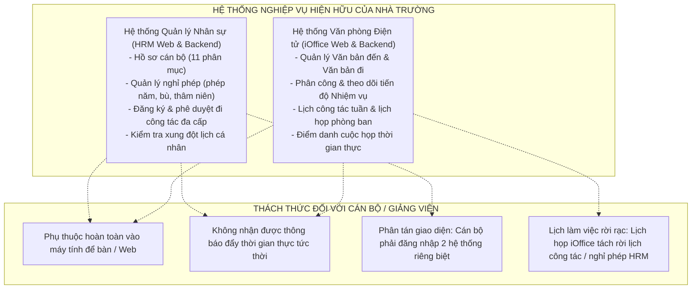
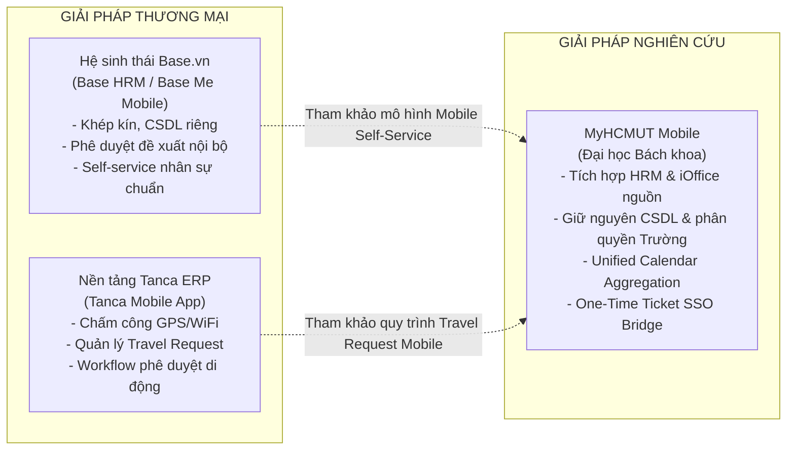
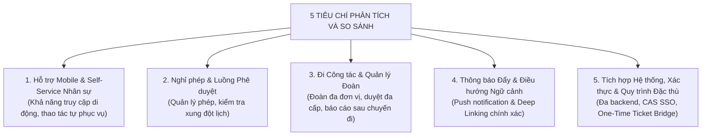
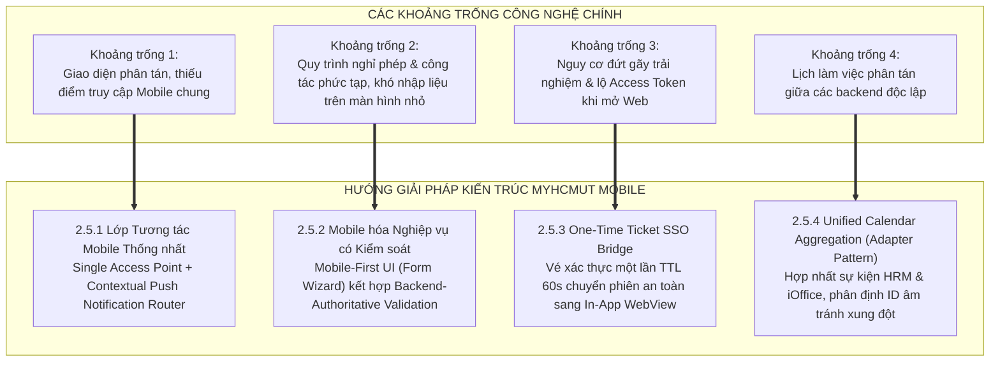
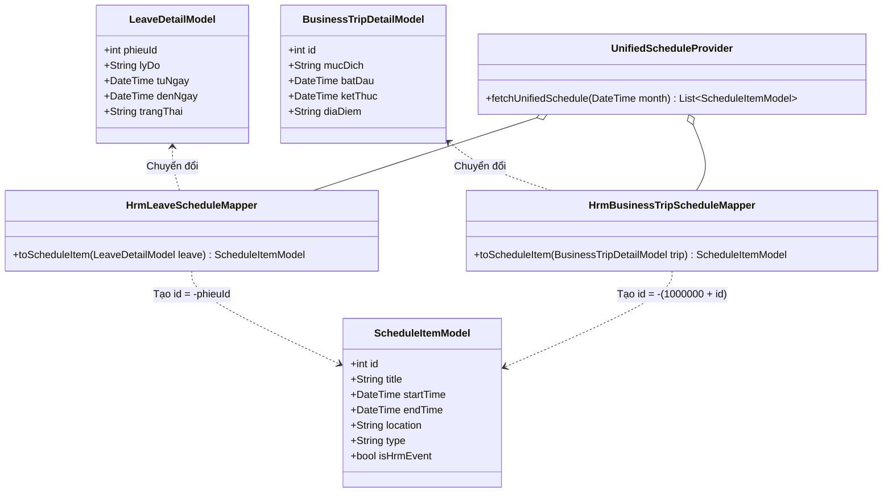
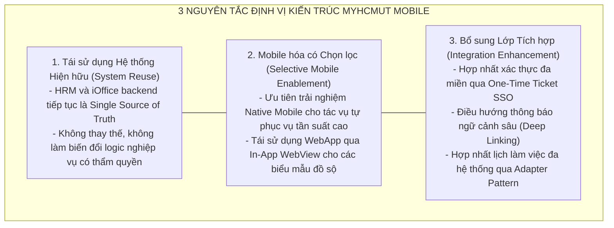

# CHƯƠNG 2: PHÂN TÍCH CÁC HỆ THỐNG CÓ LIÊN QUAN TRÊN THỊ TRƯỜNG
# (09_CHAPTER_2_RELATED_SYSTEMS.md)

> **Đề tài:** Phát triển ứng dụng di động phục vụ nhân sự Trường Đại học (MyHCMUT Mobile)  
> **Cơ quan chủ quản:** Trường Đại học Bách khoa – Đại học Quốc gia Thành phố Hồ Chí Minh  
> **Khoa:** Khoa Khoa học và Kỹ thuật Máy tính  
> **Sinh viên thực hiện:**  
> - **Vũ Xuân Chính** (MSSV: 2210392) — Thiết kế kiến trúc nền tảng MyHCMUT Mobile và các thành phần dùng chung (mạng, trạng thái, bộ điều hướng); thiết kế và hiện thực cơ chế cầu nối tích hợp xác thực Mobile–Web SSO qua One-Time Ticket; phân hệ Quản lý Hồ sơ cán bộ và Quản lý Nghỉ phép (giao diện Mobile và mở rộng backend); phân hệ Lịch công tác, Điểm danh họp và Trung tâm Thông báo nghiệp vụ.  
> - **Tống Duy Khang** (MSSV: 2211467) — Phân hệ Quản lý Đi công tác: thiết kế mô hình dữ liệu phía client, Form Wizard đăng ký 5 bước và các màn hình xử lý thẩm định/phê duyệt; phân hệ Quản lý Nhiệm vụ và Công việc (Tasks) thuộc phạm vi tích hợp iOffice; thiết kế giao diện và xử lý luồng phê duyệt đa cấp theo thẩm quyền cho các quy trình nghiệp vụ; phối hợp kiểm thử tích hợp luồng nghiệp vụ liên phân hệ và kiểm thử đầu-cuối.  
> **Giảng viên hướng dẫn:** ThS. Nguyễn Thanh Tùng  
> **Mốc hoàn thiện & Kiểm chuẩn:** Tháng 09/2026 (Khóa Baseline V3.1)  

---

## MỤC LỤC CHI TIẾT

- [CHƯƠNG 2: PHÂN TÍCH CÁC HỆ THỐNG CÓ LIÊN QUAN TRÊN THỊ TRƯỜNG](#chương-2-phân-tích-các-hệ-thống-có-liên-quan-trên-thị-trường)
  - [MỤC LỤC CHI TIẾT](#mục-lục-chi-tiết)
  - [LỜI MỞ ĐẦU CHƯƠNG](#lời-mở-đầu-chương)
  - [2.1. CÁC HỆ THỐNG NGHIỆP VỤ HIỆN HỮU CỦA NHÀ TRƯỜNG](#21-các-hệ-thống-nghiệp-vụ-hiện-hữu-của-nhà-trường)
    - [2.1.1. Hệ thống Quản lý Nhân sự HRM](#211-hệ-thống-quản-lý-nhân-sự-hrm)
    - [2.1.2. Hệ thống Văn phòng Điện tử iOffice](#212-hệ-thống-văn-phòng-điện-tử-ioffice)
    - [2.1.3. Nhu cầu về một Lớp tương tác Mobile Thống nhất](#213-nhu-cầu-về-một-lớp-tương-tác-mobile-thống-nhất)
  - [2.2. MỘT SỐ GIẢI PHÁP CÓ LIÊN QUAN TRÊN THỊ TRƯỜNG](#22-một-số-giải-pháp-có-liên-quan-trên-thị-trường)
    - [2.2.1. Hệ sinh thái Base HRM (Base Me / Mobile)](#221-hệ-sinh-thái-base-hrm-base-me--mobile)
    - [2.2.2. Nền tảng Quản trị Doanh nghiệp Tanca](#222-nền-tảng-quản-trị-doanh-nghiệp-tanca)
  - [2.3. TIÊU CHÍ PHÂN TÍCH VÀ SO SÁNH](#23-tiêu-chí-phân-tích-và-so-sánh)
    - [2.3.1. Hỗ trợ Mobile và Self-Service Nhân sự](#231-hỗ-trợ-mobile-và-self-service-nhân-sự)
    - [2.3.2. Quản lý Nghỉ phép và Luồng Phê duyệt](#232-quản-lý-nghỉ-phép-và-luồng-phê-duyệt)
    - [2.3.3. Đi Công tác và Quản lý Đoàn Công tác](#233-đi-công-tác-và-quản-lý-đoàn-công-tác)
    - [2.3.4. Cơ chế Thông báo Đẩy và Điều hướng Ngữ cảnh (Contextual Routing)](#234-cơ-chế-thông-báo-đẩy-và-điều-hướng-ngữ-cảnh-contextual-routing)
    - [2.3.5. Khả năng Tích hợp Hệ thống, Cơ chế Xác thực và Quy trình Đặc thù](#235-khả-năng-tích-hợp-hệ-thống-cơ-chế-xác-thực-và-quy-trình-đặc-thù)
  - [2.4. BẢNG SO SÁNH CÁC GIẢI PHÁP VÀ PHÂN TÍCH LUẬN CỨ KHOA HỌC](#24-bảng-so-sánh-các-giải-pháp-và-phân-tích-luận-cứ-khoa-học)
    - [2.4.1. Bảng Đối chiếu Tính năng và Kiến trúc](#241-bảng-đối-chiếu-tính-năng-và-kiến-trúc)
    - [2.4.2. Phân tích Luận cứ Khoa học](#242-phân-tích-luận-cứ-khoa-học)
  - [2.5. KHOẢNG TRỐNG VÀ HƯỚNG GIẢI PHÁP CỦA MYHCMUT MOBILE](#25-khoảng-trống-và-hướng-giải-pháp-của-myhcmut-mobile)
    - [2.5.1. Lớp Tương tác Mobile Thống nhất (Unified Mobile Interaction Layer)](#251-lớp-tương-tác-mobile-thống-nhất-unified-mobile-interaction-layer)
    - [2.5.2. Mobile hóa Quy trình Nghỉ phép và Công tác (Mobile-First, Backend-Authoritative)](#252-mobile-hóa-quy-trình-nghỉ-phép-và-công-tác-mobile-first-backend-authoritative)
    - [2.5.3. Tái sử dụng Web và Tích hợp Xác thực qua One-Time Ticket SSO](#253-tái-sử-dụng-web-và-tích-hợp-xác-thực-qua-one-time-ticket-sso)
    - [2.5.4. Tổng hợp Lịch làm việc Đa phân hệ (Unified Calendar Aggregation - Adapter Pattern)](#254-tổng-hợp-lịch-làm-việc-đa-phân-hệ-unified-calendar-aggregation---adapter-pattern)
    - [2.5.5. Định vị Giải pháp Dựa trên Ba Nguyên tắc Cốt lõi](#255-định-vị-giải-pháp-dựa-trên-ba-nguyên-tắc-cốt-lõi)
  - [2.6. KẾT LUẬN CHƯƠNG](#26-kết-luận-chương)

---

## LỜI MỞ ĐẦU CHƯƠNG

Trong tiến trình chuyển đổi số tại các cơ sở giáo dục đại học, việc hiện đại hóa các kênh tương tác phục vụ đội ngũ cán bộ, giảng viên và viên chức đóng vai trò then chốt trong việc nâng cao hiệu quả điều hành và tối ưu hóa trải nghiệm làm việc hàng ngày. Tại Trường Đại học Bách khoa – ĐHQG-HCM, hai hệ thống nghiệp vụ lõi đang vận hành là **Hệ thống Quản lý Nhân sự (HRM)** và **Hệ thống Văn phòng Điện tử (iOffice)**. Cả hai hệ thống này đều được thiết kế ban đầu phục vụ người dùng qua giao diện trình duyệt Web trên máy tính, sở hữu kho dữ liệu đồ sộ cùng các quy trình nghiệp vụ chuyên biệt.

Chương này trình bày kết quả khảo sát toàn diện các hệ thống nghiệp vụ hiện hữu của Nhà trường, đồng thời phân tích đối chiếu với các giải pháp quản trị nhân sự và điều hành tiêu biểu trên thị trường doanh nghiệp hiện nay (Base HRM, Tanca). Thông qua 5 tiêu chí so sánh khoa học, nhóm tác giả làm rõ những chức năng đã có, cách thức các nền tảng thương mại hỗ trợ môi trường di động, từ đó định hình các **khoảng trống công nghệ** và đề xuất **hướng giải pháp mang tính kiến trúc** của ứng dụng **MyHCMUT Mobile**.

---

## 2.1. CÁC HỆ THỐNG NGHIỆP VỤ HIỆN HỮU CỦA NHÀ TRƯỜNG

### 2.1.1. Hệ thống Quản lý Nhân sự HRM

Nhà trường đã xây dựng và đưa vào vận hành hệ thống HRM phục vụ toàn diện các nghiệp vụ quản trị nhân lực. Trong khuôn khổ đề tài tốt nghiệp, hệ thống HRM được xác định là **hệ thống nghiệp vụ hiện hữu**, hoàn toàn không phải là thành phần được xây dựng mới từ đầu.

HRM đảm nhiệm việc lưu trữ toàn vẹn dữ liệu và điều phối các quy trình liên quan mật thiết đến cán bộ viên chức. Những mảng nội dung nghiệp vụ có liên hệ trực tiếp với phạm vi của MyHCMUT Mobile bao gồm:
- **Quản lý Hồ sơ Cán bộ:** HRM đóng vai trò là nguồn dữ liệu gốc (Single Source of Truth) lưu trữ lý lịch nhân sự chi tiết của cán bộ (bao gồm 11 phân mục thông tin: lý lịch bản thân, thông tin tuyển dụng, ngạch/bậc lương, bảo hiểm xã hội, bằng cấp đào tạo, quá trình công tác, khen thưởng, kỷ luật, v.v.). Đây là kho dữ liệu mà ứng dụng Mobile cần kết nối để cán bộ có thể tra cứu nhanh chóng mọi lúc mọi nơi. Đồng thời, đối với các biểu mẫu cập nhật có độ phức tạp cao, nhiều trường dữ liệu và yêu cầu đính kèm hồ sơ pháp lý đồ sộ, hệ thống tiếp tục tái sử dụng giao diện Web hiện hữu thông qua WebView tích hợp thay vì viết lại toàn bộ trên thiết bị di động.
- **Quản lý Nghỉ phép:** Hệ thống lưu trữ và quản lý hạn mức phép năm, phép thâm niên, số ngày nghỉ đã sử dụng, các cấu hình nghiệp vụ theo quy chế của Nhà trường, danh sách đơn xin nghỉ và toàn bộ quy trình phê duyệt của Trưởng đơn vị/Lãnh đạo phụ trách. MyHCMUT Mobile cung cấp giao diện đăng ký thuận tiện trên thiết bị cầm tay, song toàn bộ các kiểm tra tính hợp lệ, tính toán trừ hạn ngạch phép và cập nhật trạng thái có thẩm quyền đều thuộc trách nhiệm xử lý của HRM backend.
- **Quản lý Đi công tác:** HRM hỗ trợ đa dạng loại hình hồ sơ và luồng luân chuyển phức tạp. Cán bộ có thể lập hồ sơ công tác cá nhân hoặc đoàn công tác, khai báo chi tiết khoảng thời gian, địa điểm, kế hoạch làm việc cụ thể, danh sách thành viên tham gia, nguồn kinh phí chi trả và các tệp tài liệu minh chứng kèm theo. Hồ sơ có thể được lưu ở trạng thái nháp hoặc đệ trình vào quy trình thẩm định, phê duyệt.
- **Quy trình Phê duyệt Công tác Đa cấp và Song song:** Tùy thuộc vào tính chất chuyến đi (trong nước hay ngoài nước, sử dụng nguồn kinh phí của Trường hay tự túc), luồng phê duyệt có thể dừng ở cấp đơn vị cơ sở hoặc tiếp tục luân chuyển qua Phòng Tổ chức Cán bộ và Ban Giám Hiệu. Đặc biệt, đối với các đoàn công tác bao gồm thành viên trực thuộc nhiều khoa/phòng ban khác nhau, quy trình đòi hỏi cơ chế xử lý song song giữa lãnh đạo các đơn vị liên quan. Trong quá trình xét duyệt, cấp quản lý có quyền trả lại hồ sơ yêu cầu cán bộ giải trình, bổ sung hồ sơ minh chứng trước khi nộp lại. Sau khi kết thúc chuyến đi, quy trình hỗ trợ việc nộp báo cáo kết quả công tác và nghiệm thu kinh phí.
- **Ràng buộc Lịch Cá nhân Dùng chung:** Cả nghỉ phép và đi công tác đều trực tiếp chiếm dụng quỹ thời gian làm việc của cán bộ. Backend HRM sở hữu cơ chế kiểm tra lịch dùng chung nhằm chủ động phát hiện các khoảng thời gian có khả năng xung đột (chẳng hạn không thể đăng ký nghỉ phép trùng với ngày đang đi công tác đã được duyệt). Do đó, hai phân hệ này không hề độc lập mà có sự ràng buộc dữ liệu mật thiết.

Ứng dụng MyHCMUT Mobile không xây dựng một mô hình nhân sự riêng biệt để thay thế HRM. Thay vào đó, ứng dụng đóng vai trò là một **kênh tương tác bổ sung trên thiết bị di động**, kế thừa và tái sử dụng toàn bộ dữ liệu, dịch vụ RESTful API và quy trình nghiệp vụ sẵn có, đồng thời bổ sung các lớp trung gian kỹ thuật cần thiết để tối ưu hóa trải nghiệm trên môi trường di động.

---

### 2.1.2. Hệ thống Văn phòng Điện tử iOffice

Song song với HRM, Nhà trường đang vận hành hệ thống Văn phòng Điện tử (iOffice) nhằm phục vụ công tác chỉ đạo, điều hành và quản lý hành chính số. Trong phạm vi nghiên cứu và tích hợp của MyHCMUT Mobile, các nhóm nghiệp vụ trọng tâm bao gồm:
- **Quản lý Văn bản Đến và Văn bản Đi:** Hệ thống hỗ trợ cán bộ tra cứu danh mục văn bản đến, văn bản nội bộ và văn bản ban hành thuộc thẩm quyền phân phối hoặc chỉ đạo xử lý. Ứng dụng di động cần hỗ trợ đọc nhanh trích yếu, theo dõi sổ văn bản, tình trạng xử lý và hiển thị trực tiếp các tệp văn bản đính kèm (định dạng PDF) ngay trên thiết bị.
- **Quản lý Nhiệm vụ và Công việc (Tasks/Missions):** Ứng dụng cung cấp giao diện trực quan cho phép cán bộ theo dõi danh sách nhiệm vụ được lãnh đạo phân công, cấu trúc cây phân rã đầu việc (outlined-tree), thời hạn hoàn thành (deadline), cập nhật tiến độ thực hiện và gửi báo cáo đợt kèm văn bản phản hồi.
- **Lịch Công tác Tuần và Điểm danh Họp:** Người dùng có thể tra cứu lịch công tác chung của Trường, lịch họp của đơn vị theo từng ngày/tuần, nhận thông báo nhắc họp và thực hiện các thao tác xác nhận tham dự hoặc điểm danh phòng họp thời gian thực theo quy định của hệ thống.

Tương tự như HRM, iOffice là hệ thống nghiệp vụ sẵn có với backend và cơ sở dữ liệu độc lập. Đề tài không thay thế backend iOffice mà xây dựng lớp tương tác người dùng trên thiết bị di động, kết nối trực tiếp đến các API dịch vụ hiện hữu.

Việc tích hợp đồng thời cả HRM và iOffice trong cùng một ứng dụng di động đặt ra bài toán kiến trúc khác biệt hoàn toàn so với việc phát triển một ứng dụng HRM độc lập. Phía Mobile Client buộc phải đồng thời giao tiếp với nhiều miền backend khác nhau (đa máy chủ, đa cấu trúc xác thực), quản lý việc điều hướng luồng dữ liệu mượt mà giữa các phân hệ và duy trì tính nhất quán về trải nghiệm thị giác cũng như trạng thái bảo mật cho người dùng.

---

### 2.1.3. Nhu cầu về một Lớp tương tác Mobile Thống nhất

Sự hiện hữu và ổn định của HRM và iOffice trên nền tảng Web không đồng nghĩa với việc cần phải sao chép hay viết lại toàn bộ hai hệ thống này lên thiết bị di động. Ngược lại, đây là tiền đề thực tiễn để đề tài tập trung giải quyết bài toán: **tích hợp liên hệ thống và mở rộng khả năng tiếp cận linh hoạt cho người dùng.**

Nhiều phân hệ quản trị nghiệp vụ có mật độ trường dữ liệu lớn, quy mô bảng biểu phức tạp và tần suất thao tác tập trung tại văn phòng vốn rất phù hợp với giao diện Web trên máy tính. Tuy nhiên, các thao tác mang tính tức thời của cán bộ và lãnh đạo như:
- Nhận thông báo việc cần xử lý;
- Tra cứu nhanh lý lịch, hạn mức ngày phép;
- Tạo nhanh yêu cầu nghỉ phép đột xuất hoặc đăng ký công tác;
- Phê duyệt/từ chối đơn từ khẩn cấp của cấp dưới khi đang đi công tác bên ngoài;
- Xem nhanh trích yếu văn bản đến hoặc điểm danh cuộc họp sắp diễn ra;

đều có thể được nâng cao hiệu suất vượt bậc nếu được cung cấp qua một ứng dụng di động bản địa.

Đặc biệt, môi trường Mobile sở hữu những ưu thế kỹ thuật mà giao diện Web truyền thống bị hạn chế:
1. **Khả năng tiếp nhận Thông báo Đẩy (Push Notifications):** Thiết bị nhận thông báo sự kiện nghiệp vụ tức thời thông qua kết nối hệ thống ngầm ngay cả khi ứng dụng đã đóng hoặc màn hình đang khóa.
2. **Khả năng Điều hướng Ngữ cảnh Sâu (Deep Linking):** Người dùng có thể nhấn trực tiếp vào thông báo để mở chính xác màn hình chi tiết của đối tượng nghiệp vụ cần xử lý (ví dụ: mở đúng đơn công tác cần duyệt hoặc văn bản đến vừa nhận), loại bỏ hoàn toàn các bước tìm kiếm thủ công.

Do đó, vấn đề cốt lõi không phải là sự lựa chọn mang tính loại trừ tuyệt đối giữa "Web" hay "Mobile", mà là **xác định ranh giới chức năng hợp lý**: nghiệp vụ nào phù hợp với trải nghiệm di động tương tác nhanh sẽ được phát triển giao diện Native Mobile; nghiệp vụ quản trị phức tạp, nhập liệu chuyên sâu sẽ tiếp tục tái sử dụng giao diện WebApp hiện hữu thông qua giải pháp tích hợp thông minh.

---

## 2.2. MỘT SỐ GIẢI PHÁP CÓ LIÊN QUAN TRÊN THỊ TRƯỜNG

Để có góc nhìn đối chuẩn khách quan về cách thức các nền tảng quản trị hiện đại giải quyết bài toán nghiệp vụ nhân sự và điều hành trên thiết bị di động, nhóm nghiên cứu đã tiến hành khảo sát hai giải pháp tiêu biểu trên thị trường Việt Nam: **Base HRM** và **Tanca**. Quá trình khảo sát bám sát các tài liệu công bố chính thức từ nhà sản xuất và tập trung vào những tính năng có liên hệ mật thiết với phạm vi nghiên cứu của đề tài.

### 2.2.1. Hệ sinh thái Base HRM (Base Me / Mobile)

Base HRM là giải pháp phần mềm quản trị nhân sự thuộc hệ sinh thái số Base.vn, hướng tới đối tượng doanh nghiệp vừa và lớn. Hệ thống cung cấp các khối chức năng toàn diện gồm: quản lý sơ đồ tổ chức, hồ sơ nhân sự điện tử, lịch làm việc/chấm công, chính sách nghỉ phép và các chế độ đãi ngộ.

Theo tài liệu chính thức từ nhà phát triển, Base HRM hỗ trợ ứng dụng trên thiết bị di động thông qua ứng dụng **Base Me / Base Mobile**:
- Ứng dụng cho phép nhân viên tiếp cận dữ liệu hồ sơ cá nhân, bảng công, lịch làm việc và thực hiện các thao tác tự phục vụ (Self-service).
- Cán bộ/nhân viên có thể tạo yêu cầu xin nghỉ phép, theo dõi hạn ngạch phép còn lại trong năm và nhận thông báo khi có phản hồi.
- Cấp quản lý có thể xem xét, phê duyệt, từ chối hoặc chuyển tiếp các đề xuất nghỉ phép ngay trên giao diện điện thoại.

**Giá trị tham khảo đối với đề tài:** Base Me chứng minh tính hiệu quả của mô hình Mobile Self-service trong quản trị nhân sự. Người dùng có thể tiếp cận các thông tin cá nhân và giải quyết các nghiệp vụ hành chính thông dụng mà không bị phụ thuộc vào máy tính văn phòng.

**Hạn chế và Sự khác biệt trong bối cảnh Đề tài:**
1. **Kiến trúc đóng kín và Cơ sở dữ liệu riêng biệt:** Base HRM là một sản phẩm thương mại hoàn chỉnh với cơ sở dữ liệu, mô hình phân quyền và luồng nghiệp vụ độc lập. Trong khi đó, Trường Đại học Bách khoa – ĐHQG-HCM đã có hệ thống HRM và iOffice đang hoạt động ổn định với hàng nghìn tài khoản và lịch sử dữ liệu lâu năm. Việc mua mới và chuyển đổi toàn diện sang Base đòi hỏi chi phí bản quyền lớn và rủi ro chuyển dịch dữ liệu không phù hợp với mục tiêu đề tài.
2. **Quy trình Công tác Đặc thù:** Nghiệp vụ cử cán bộ đi công tác tại các trường đại học công lập có tính chất pháp lý và hành chính chặt chẽ: phân loại công tác trong nước và ngoài nước, đoàn công tác phối hợp đa khoa/viện, luồng phê duyệt đa cấp theo thẩm quyền (Trưởng đơn vị $\rightarrow$ Phòng Tổ chức Cán bộ $\rightarrow$ Ban Giám Hiệu), cùng yêu cầu nghiệm thu báo cáo công tác sau chuyến đi. Tài liệu chính thức của Base chưa thể hiện việc hỗ trợ sẵn sàng các luồng duyệt song song liên đơn vị phức tạp này nếu không qua các gói tùy biến chuyên sâu.

---

### 2.2.2. Nền tảng Quản trị Doanh nghiệp Tanca

Tanca là một nền tảng chuyển đổi số quản trị doanh nghiệp (ERP/HRM) được phát triển tại Việt Nam, cung cấp các giải pháp chuyên sâu về quản lý chấm công, tính lương, quản trị nhân sự và điều hành công việc.

Tài liệu sản phẩm của Tanca ghi nhận các tính năng nổi bật trên ứng dụng di động:
- **Chấm công và Self-service:** Tích hợp chấm công bằng định vị GPS, nhận diện khuôn mặt và kết nối mạng không dây; cho phép nhân viên xem bảng lương, quỹ phép và gửi yêu cầu nghỉ phép.
- **Quản lý Yêu cầu Đi công tác (Travel Request):** Ứng dụng di động của Tanca cho phép nhân viên lập phiếu đề xuất công tác, khai báo địa điểm đến, lịch trình thời gian, mục đích chuyến đi và dự toán chi phí di chuyển/lưu trú kèm tài liệu minh chứng. Quản lý có thể xem xét và phê duyệt hoặc bác bỏ yêu cầu trực tiếp trên app.

**Giá trị tham khảo đối với đề tài:** Tanca là minh chứng thực tế khẳng định rằng cả hai nhóm nghiệp vụ trọng tâm của đề tài — **Quản lý Nghỉ phép** và **Quản lý Đi công tác** — hoàn toàn có thể được tổ chức hiệu quả dưới mô hình Mobile Self-service kết hợp luồng phê duyệt di động (Workflow Mobile Approval).

**Hạn chế và Sự khác biệt trong bối cảnh Đề tài:**
- Tanca được xây dựng tối ưu cho các doanh nghiệp thương mại/dịch vụ với mô hình quản lý tập trung theo cấp bậc công ty. Hệ thống sử dụng hạ tầng đám mây độc lập của nhà cung cấp.
- Trái lại, MyHCMUT Mobile phải giải quyết bài toán tích hợp đa hệ thống nội bộ của một trường đại học: vừa kết nối dịch vụ HRM, vừa tích hợp văn phòng số iOffice, đồng thời kế thừa hạ tầng xác thực tập trung (Central Authentication Service - CAS / Authentik) của Trường. Do đó, Tanca là hình mẫu tham khảo về quy trình người dùng, không phải là một giải pháp có thể triển khai thay thế trực tiếp cho hệ sinh thái hiện có của Nhà trường.

---

## 2.3. TIÊU CHÍ PHÂN TÍCH VÀ SO SÁNH

Nhằm thiết lập cơ sở đánh giá khoa học và khách quan giữa hệ thống hiện hữu của Nhà trường, các giải pháp thương mại trên thị trường và ứng dụng MyHCMUT Mobile, nhóm nghiên cứu xác lập **5 tiêu chí phân tích cốt lõi**:

### 2.3.1. Hỗ trợ Mobile và Self-Service Nhân sự
Tiêu chí này đánh giá khả năng người dùng tiếp cận và thực hiện các tác vụ nhân sự trên điện thoại thông minh hoặc máy tính bảng khi rời xa văn phòng. Đồng thời, tiêu chí xem xét mức độ thuận tiện trong việc tra cứu hồ sơ cá nhân và thực thi các thao tác tự phục vụ.
- Đối với MyHCMUT Mobile, hệ thống hiện thực giao diện tra cứu 11 phân mục lý lịch cán bộ ngay trên điện thoại; tuy nhiên, HRM backend tiếp tục là nguồn dữ liệu thẩm quyền duy nhất, ứng dụng client không tự ý lưu trữ hay quản lý một bản sao CSDL nhân sự độc lập.

### 2.3.2. Quản lý Nghỉ phép và Luồng Phê duyệt
Tiêu chí xem xét năng lực khai báo yêu cầu nghỉ phép, theo dõi hạn ngạch ngày phép còn lại, tra cứu lịch sử nghỉ và quy trình xét duyệt của cấp quản lý.
- Đối với MyHCMUT Mobile, mọi quy tắc về ngày nghỉ, cấu hình nghiệp vụ và kiểm tra điều kiện đều phải tuân thủ nghiêm ngặt logic của HRM backend hiện hữu. Đặc biệt, backend sử dụng cơ chế kiểm tra lịch dùng chung nhằm phát hiện và ngăn ngừa tình trạng đăng ký trùng lịch với các hoạt động công tác hoặc nhiệm vụ khác.

### 2.3.3. Đi Công tác và Quản lý Đoàn Công tác
Nghiệp vụ công tác tại cơ sở giáo dục đại học có độ phức tạp vượt trội so với một yêu cầu công tác doanh nghiệp thông thường. Tiêu chí này kiểm tra mức độ đáp ứng đối với:
- Phân loại hồ sơ cá nhân và hồ sơ đoàn công tác;
- Khai báo lộ trình, kế hoạch làm việc theo từng ngày và dự toán ngân sách;
- Quản lý danh sách thành viên thuộc nhiều đơn vị khác nhau;
- Cơ chế phê duyệt song song liên đơn vị và thẩm định nhiều cấp (Đơn vị $\rightarrow$ Phòng TCCB $\rightarrow$ Ban Giám Hiệu);
- Cơ chế trả lại hồ sơ yêu cầu cán bộ chỉnh sửa/bổ sung;
- Quy trình nộp báo cáo kết quả sau chuyến đi.

### 2.3.4. Cơ chế Thông báo Đẩy và Điều hướng Ngữ cảnh (Contextual Routing)
**Cơ chế thông báo nghiệp vụ xuyên suốt** không phải miền nghiệp vụ độc lập; nó hỗ trợ HRM và iOffice bằng cách trích xuất siêu dữ liệu (Payload) từ sự kiện để **điều hướng người dùng tới chính xác màn hình và đối tượng nghiệp vụ tương ứng**. Backend chỉ phát sự kiện thông báo; FCM không bảo đảm thiết bị nhận được thông báo.

### 2.3.5. Khả năng Tích hợp Hệ thống, Cơ chế Xác thực và Quy trình Đặc thù
Đây là tiêu chí mang tính phân định quyết định đối với đề tài. Trong khi các giải pháp thương mại vận hành khép kín trên hạ tầng riêng, MyHCMUT Mobile bắt buộc phải:
- Kết nối đồng thời với các backend độc lập (HRM và iOffice);
- Tương thích hoàn toàn với hệ thống Đăng nhập một lần (SSO) kế thừa từ hệ thống định danh CAS của Nhà trường;
- Hiện thực cơ chế chuyển giao phiên làm việc an toàn giữa Native Mobile và WebApp (thông qua One-Time Ticket SSO Bridge) nhằm tái sử dụng các biểu mẫu Web sẵn có mà không gây lộ lọt thẻ bài truy cập (Access Token);
- Bảo toàn tuyệt đối các quy tắc nghiệp vụ hành chính đặc thù của Nhà trường mà không đòi hỏi phải cấu hình lại hay viết lại hệ sinh thái hiện tại.

---

## 2.4. BẢNG SO SÁNH CÁC GIẢI PHÁP VÀ PHÂN TÍCH LUẬN CỨ KHOA HỌC

### 2.4.1. Bảng Đối chiếu Tính năng và Kiến trúc

Dựa trên 5 tiêu chí đã xác lập, Bảng 2.1 dưới đây tổng hợp và đối chiếu các đặc tính giữa Hệ thống HRM/iOffice hiện hữu, Các giải pháp thương mại tiêu biểu (Base HRM / Tanca) và Ứng dụng MyHCMUT Mobile.

**Bảng 2.1:** Bảng so sánh tổng hợp các hệ thống và giải pháp liên quan

| Tiêu chí phân tích | HRM / iOffice hiện hữu của Trường | Giải pháp thương mại (Base HRM / Tanca) | Giải pháp đề tài: MyHCMUT Mobile |
| :--- | :--- | :--- | :--- |
| **1. Hỗ trợ Mobile Self-Service (Nhân sự, Nghỉ phép)** | Hạn chế (Chủ yếu vận hành qua trình duyệt Web máy tính) | Có sẵn trong ứng dụng di động của hệ sinh thái (Base Me, Tanca App) | **Có**, xây dựng giao diện Mobile tối ưu, tích hợp trực tiếp quy trình HRM hiện hữu |
| **2. Quản lý Yêu cầu & Luồng Phê duyệt Công tác** | Có đầy đủ quy trình nghiệp vụ trên Web HRM | Có hỗ trợ tạo yêu cầu công tác (Travel request), nhưng không tương thích sẵn với quy trình đặc thù của Trường | **Có**, Mobile hóa bằng Form Wizard nhiều bước, bảo toàn đầy đủ quy trình phê duyệt đa cấp của Trường |
| **3. Thông báo và Điều hướng Ngữ cảnh trên Mobile** | Không có thông báo đẩy trực tiếp đến thiết bị di động | Có hệ thống push notification nội bộ trong app | **Có**, hỗ trợ thông báo đẩy thời gian thực kèm cơ chế Deep Linking theo ngữ cảnh đối tượng |
| **4. Tích hợp trực tiếp HRM & iOffice của Nhà trường** | Là hai hệ thống backend nguồn độc lập đang vận hành | Hoàn toàn không tích hợp sẵn (Kiến trúc đóng, CSDL riêng biệt) | **Là mục tiêu thiết kế cốt lõi**: Đóng vai trò lớp tích hợp và tương tác hợp nhất |
| **5. Phù hợp Quy trình Đặc thù và Cơ chế Định danh Hiện hữu** | Tương thích tuyệt đối với quy chế nội bộ của Trường | Cần chi phí lớn để khảo sát tùy biến, chuyển đổi dữ liệu và quy trình | **Tái sử dụng trực tiếp**: Kế thừa CAS SSO, luồng duyệt song song, kiểm tra lịch cá nhân và tái sử dụng Web qua One-Time Ticket |

---

### 2.4.2. Phân tích Luận cứ Khoa học

Từ kết quả đối chiếu tại Bảng 2.1, nhóm nghiên cứu rút ra các luận cứ khoa học quan trọng sau:

1. **Về tính sẵn sàng của loại hình ứng dụng:** Các giải pháp thương mại hàng đầu như Base HRM hay Tanca đã khẳng định tính tất yếu và tính khả thi cao của việc cung cấp các nghiệp vụ Employee Self-service, Quản lý Nghỉ phép và Duyệt đi công tác ngay trên thiết bị di động. Điều này chứng minh rằng nhu cầu số hóa nghiệp vụ di động tại Trường ĐH Bách khoa là một xu thế hoàn toàn phù hợp với thực tiễn quản trị hiện đại.
2. **Về giới hạn của phương án mua mới phần mềm đóng gói:** Nếu bài toán của Nhà trường là xây dựng một hệ sinh thái quản trị từ vạch số không, việc lựa chọn một nền tảng SaaS thương mại là phương án có thể xem xét. Tuy nhiên, bối cảnh thực tiễn của Trường Đại học Bách khoa là đã có hàng nghìn cán bộ đang quen thuộc với quy trình của HRM và iOffice. Việc thay thế toàn bộ sẽ kéo theo chi phí bản quyền định kỳ rất lớn, rủi ro gián đoạn hoạt động, khó khăn trong việc di chuyển dữ liệu lịch sử và đặc biệt là sự kháng cự thay đổi từ phía người dùng cuối.
3. **Về tính chất đặc thù của quy trình hành chính công lập:** Quy trình công tác tại Nhà trường phân biệt rành mạch giữa đoàn công tác có cán bộ liên đơn vị, các nguồn kinh phí từ ngân sách trường hoặc dự án nghiên cứu, cơ chế thẩm định qua Phòng TCCB và Ban Giám Hiệu, cũng như chế độ nộp báo cáo kết quả. Các phần mềm doanh nghiệp như Base hay Tanca hướng tới các luồng duyệt tinh gọn của kinh tế tư nhân, do đó không thể đáp ứng ngay các quy chế học thuật và hành chính công mà không trải qua quá trình chỉnh sửa mã nguồn tốn kém.
4. **Xác lập giá trị cốt lõi của MyHCMUT Mobile:** Điểm khác biệt và giá trị học thuật của MyHCMUT Mobile không nằm ở tham vọng cạnh tranh số lượng tính năng với các phần mềm ERP đồ sộ trên thị trường. **Giá trị cốt lõi của đề tài nằm ở giải pháp kiến trúc tích hợp**: làm thế nào để tạo ra một điểm chạm di động hiện đại, thống nhất, kết nối thông suốt với các backend nghiệp vụ sẵn có, kế thừa nguyên vẹn logic nghiệp vụ có thẩm quyền mà không làm xáo trộn kiến trúc CNTT chung của Nhà trường.

---

## 2.5. KHOẢNG TRỐNG VÀ HƯỚNG GIẢI PHÁP CỦA MYHCMUT MOBILE

Từ các kết quả phân tích hệ thống hiện hữu và đối chuẩn thị trường, đề tài đã xác định **4 khoảng trống công nghệ then chốt** cần giải quyết và thiết lập các hướng giải pháp tương ứng:

### 2.5.1. Lớp Tương tác Mobile Thống nhất (Unified Mobile Interaction Layer)

- **Khoảng trống thực tế:** Cán bộ hiện phải tiếp cận HRM và iOffice qua hai địa chỉ trang web khác nhau, với hai giao diện và trải nghiệm người dùng tách biệt. Khi phát sinh công việc cần xử lý, người dùng không có một trung tâm điều hành chung trên thiết bị di động.
- **Hướng giải pháp:** MyHCMUT Mobile thiết lập một điểm truy cập di động hợp nhất (Unified Mobile Layer). Ứng dụng không thực hiện việc gộp cơ sở dữ liệu vật lý của HRM và iOffice ở tầng dưới, mà đóng vai trò là **bộ điều phối giao diện thống nhất** ở tầng trên.
- **Cơ chế Điều hướng Ngữ cảnh (Contextual Navigation & Deep Linking):** Khi một chuyển trạng thái nghiệp vụ phát sinh sự kiện thông báo (ví dụ hồ sơ công tác bị trả lại hoặc có nhiệm vụ iOffice mới), cơ chế thông báo nghiệp vụ xuyên suốt có thể chuyển phát payload về điện thoại. Nếu thiết bị nhận và người dùng bấm vào thông báo, ứng dụng bóc tách payload để điều hướng trực tiếp tới hồ sơ tương ứng.

---

### 2.5.2. Mobile hóa Quy trình Nghỉ phép và Công tác (Mobile-First, Backend-Authoritative)

- **Khoảng trống thực tế:** Biểu mẫu công tác và nghỉ phép trên Web HRM có nhiều thông tin, gồm nhiều danh mục phụ thuộc (loại kinh phí, phương tiện di chuyển, danh sách thành viên, tài liệu scan). Nếu đưa nguyên bản giao diện Web lên màn hình nhỏ của điện thoại sẽ gây quá tải thị giác và khó khăn cho thao tác chạm. Ngược lại, nếu ứng dụng Mobile tự ý đơn giản hóa và tự kiểm tra nghiệp vụ cục bộ, dữ liệu sẽ dễ bị sai lệch so với quy chế của Nhà trường.
- **Hướng giải pháp:** Áp dụng triết lý thiết kế **Mobile-first ở lớp trình diễn (Presentation Layer)** nhưng **Backend-authoritative ở lớp nghiệp vụ (Domain Layer)**:
  - **Mô hình Form Wizard chia nhỏ tác vụ:** Quy trình lập hồ sơ công tác được cấu trúc lại thành Form Wizard nhiều bước trực quan (Khai báo lộ trình/thời gian $\rightarrow$ Kế hoạch làm việc $\rightarrow$ Thành viên đoàn $\rightarrow$ Dự toán kinh phí $\rightarrow$ Đính kèm minh chứng và Xem lại). Điều này giúp giảm tải nhận thức cho người dùng trên màn hình cảm ứng.
  - **Backend-Authoritative Validation:** Phía Mobile Client chỉ thực hiện các kiểm tra tính hợp lệ cơ bản về mặt hình thức (Form Validation như định dạng ngày, bắt buộc nhập). Mọi quyết định có thẩm quyền về hạn mức phép, thẩm quyền phê duyệt theo chức vụ và kiểm tra chồng lấn thời gian làm việc đều được thực thi hoàn toàn tại HRM backend thông qua các API chính thức.
  - **Kiểm tra Ràng buộc Lịch Dùng chung (Cross-validation):** Tái sử dụng engine kiểm tra lịch cá nhân của HRM backend để phát hiện tức thời các xung đột giữa lịch nghỉ phép và lịch đi công tác, đảm bảo tính toàn vẹn dữ liệu xuyên suốt các phân hệ.

---

### 2.5.3. Tái sử dụng Web và Tích hợp Xác thực qua One-Time Ticket SSO

- **Khoảng trống thực tế:** Việc tái phát triển toàn bộ 100% các tính năng hành chính của HRM (chẳng hạn các biểu mẫu lý lịch cán bộ chuyên sâu với hàng trăm trường dữ liệu) lên giao diện Mobile Native sẽ làm phình to phạm vi dự án một cách không cần thiết và tạo ra gánh nặng bảo trì song song hai hệ thống mã nguồn. Tuy nhiên, nếu mở trực tiếp trang Web trong ứng dụng, người dùng buộc phải đăng nhập lại từ đầu, hoặc nếu Mobile truyền trực tiếp JWT Access Token lên URL thì sẽ tạo ra lỗ hổng bảo mật nghiêm trọng (rò rỉ token qua URL log hoặc proxy trung gian).
- **Hướng giải pháp:** Kết hợp mô hình giao diện hỗn hợp (Hybrid Approach) thông qua công nghệ **In-App WebView** và cơ chế bảo mật **One-Time Ticket SSO Bridge**:
  - Đối với các biểu mẫu cập nhật phức tạp, Mobile Client mở trang WebApp tương ứng bên trong In-App WebView mà không làm gián đoạn trải nghiệm người dùng.
  - Để chuyển phiên an toàn mà không cần đăng nhập lại, Mobile Client gửi yêu cầu đến Auth Backend để nhận một vé xác thực dùng một lần (**One-Time Ticket**) có thời gian sống cực ngắn (TTL = 60 giây).
  - Mobile truyền ticket này qua tham số URL khi tải trang Web. Web Server sau khi tiếp nhận sẽ gọi nội bộ đến Auth Server để xác thực ticket, hủy vé ngay lập tức (chống tấn công Replay Attack) và thiết lập Session Cookie an toàn cho trình duyệt WebView. Bằng cách này, Access Token tuyệt đối không bị lộ lọt ra môi trường bên ngoài.

---

### 2.5.4. Tổng hợp Lịch làm việc Đa phân hệ (Unified Calendar Aggregation - Adapter Pattern)

- **Khoảng trống thực tế:** Trong hoạt động hàng ngày, lịch trình của một cán bộ, giảng viên bị phân mảnh thành nhiều mảng riêng biệt:
  - Lịch họp phòng ban, lịch công tác chung của Trường được quản lý bởi hệ thống iOffice dưới cấu trúc `ScheduleItemModel`;
  - Lịch nghỉ phép cá nhân (phép năm, nghỉ ốm, nghỉ bù) được quản lý bởi hệ thống HRM dưới cấu trúc `LeaveDetailModel`;
  - Lịch các chuyến đi công tác cá nhân và đoàn được quản lý bởi hệ thống HRM dưới cấu trúc `BusinessTripDetailModel`.

  Việc hai hệ thống backend này hoạt động độc lập khiến cán bộ không thể theo dõi một bức tranh tổng thể về quỹ thời gian làm việc của mình trên một giao diện lịch duy nhất. Cán bộ có nguy cơ nhận lịch họp trùng vào ngày mình đang nghỉ phép hoặc đang đi công tác xa mà không được cảnh báo trực quan.
- **Hướng giải pháp:** MyHCMUT Mobile xây dựng giải pháp **Tổng hợp Lịch làm việc Đa phân hệ (Unified Calendar Aggregation)** áp dụng mẫu thiết kế **Adapter Pattern** trực tiếp tại tầng Data & Domain của ứng dụng di động:

- **Quy tắc Chuyển đổi Adapter và Phân định Khóa chính An toàn:**
  - Hai bộ chuyển đổi chuyên biệt là `HrmLeaveScheduleMapper` và `HrmBusinessTripScheduleMapper` tiếp nhận dữ liệu sự kiện từ HRM và chuẩn hóa về mô hình `ScheduleItemModel` của iOffice.
  - **Giải pháp chống xung đột định danh (Primary Key Collision Prevention):** Do iOffice sử dụng các số nguyên dương tăng dần (`id > 0`) cho các cuộc họp, việc đưa các sự kiện từ HRM sang có thể dẫn đến trùng lặp ID. Nhóm tác giả thiết kế quy tắc định danh âm:
    - Sự kiện nghỉ phép được gán ID âm: $\text{id} = -\text{phieuId}$;
    - Sự kiện đi công tác được gán ID âm tịnh tiến: $\text{id} = -(1000000 + \text{id})$.
    
    Quy tắc này đảm bảo 100% tính duy nhất của khóa chính trong danh sách hiển thị của Widget Lịch mà không cần can thiệp chỉnh sửa cấu trúc bảng cơ sở dữ liệu của iOffice hay HRM backend.
- **Bộ điều phối trạng thái phản ứng (`unifiedScheduleProvider`):** Sử dụng thư viện Riverpod, provider này đồng thời kích hoạt các luồng gọi API bất đồng bộ tới cả hai backend, thu thập danh sách lịch họp, lịch nghỉ phép và lịch công tác trong khoảng thời gian truy vấn, thực hiện ánh xạ qua Adapter và tổng hợp thành một danh sách thời gian duy nhất được sắp xếp theo trình tự thời gian. Nhờ đó, cán bộ có cái nhìn trực quan và toàn diện nhất về kế hoạch làm việc cá nhân.

---

### 2.5.5. Định vị Giải pháp Dựa trên Ba Nguyên tắc Cốt lõi

Từ toàn bộ các phân tích kiến trúc và kỹ thuật nêu trên, **MyHCMUT Mobile được định vị là Ứng dụng Di động Tích hợp và Mở rộng Đa phân hệ**, hoạt động như một cầu nối kỹ thuật số hiện đại hóa hệ thống quản lý của Trường Đại học Bách khoa – ĐHQG-HCM.

Giải pháp được kiên định xây dựng dựa trên **ba nguyên tắc kiến trúc nền tảng**:

1. **Nguyên tắc 1: Tái sử dụng Hệ thống Hiện hữu (System Reuse)**  
   HRM và iOffice backend tiếp tục quản lý trọn vẹn cơ sở dữ liệu, quy tắc phân quyền và quy trình nghiệp vụ thuộc miền thẩm quyền của mình. Ứng dụng di động không nhân bản dữ liệu, không tạo lập các ranh giới phân quyền song song làm tăng rủi ro sai lệch dữ liệu.
2. **Nguyên tắc 2: Mobile hóa có Chọn lọc (Selective Mobile Enablement)**  
   Đề tài tập trung tối ưu hóa giao diện và trải nghiệm người dùng di động (Native UI/UX) cho các tác vụ cần thực hiện nhanh và thường xuyên (tra cứu lý lịch, tạo đơn nghỉ phép, đăng ký công tác, xem văn bản, theo dõi nhiệm vụ, điểm danh họp). Ngược lại, các chức năng quản trị đồ sộ được tái sử dụng nguyên vẹn từ giao diện WebApp sẵn có, đảm bảo cân bằng tối ưu giữa năng suất phát triển và trải nghiệm thực tế.
3. **Nguyên tắc 3: Bổ sung Lớp Tích hợp Kỹ thuật Hiện đại (Integration Enhancement)**  
   Giải quyết triệt để các bài toán phát sinh khi đưa nhiều hệ thống độc lập lên một kênh di động chung: thiết lập cơ chế chuyển giao phiên đăng nhập an toàn (One-Time Ticket SSO), định tuyến thông báo đẩy theo ngữ cảnh đối tượng (Deep Linking), và chuyển đổi hợp nhất dữ liệu lịch làm việc đa miền (Unified Calendar Adapter Pattern).

---

## 2.6. KẾT LUẬN CHƯƠNG

Chương 2 đã hoàn thành việc khảo sát, phân tích chuyên sâu các hệ thống quản lý hiện hữu của Trường Đại học Bách khoa – ĐHQG-HCM (HRM và iOffice) cũng như đối chuẩn khách quan với các giải pháp quản trị nhân sự tiêu biểu trên thị trường doanh nghiệp (Base HRM, Tanca).

Thông qua việc xây dựng 5 tiêu chí phân tích khoa học và bảng đối chiếu đặc tính, nghiên cứu đã chứng minh rằng:
- Việc đưa các quy trình self-service nhân sự, nghỉ phép và công tác lên thiết bị di động là một nhu cầu thực tế tất yếu, đã được minh chứng tính hiệu quả trên thị trường.
- Tuy nhiên, việc áp dụng nguyên bản một phần mềm đóng gói sẵn không khả thi trong môi trường đại học công lập do sự khác biệt lớn về quy trình phê duyệt đặc thù và yêu cầu bảo toàn hệ sinh thái dữ liệu sẵn có.
- Do đó, cách tiếp cận mang tính chiến lược của đề tài là xây dựng **MyHCMUT Mobile như một lớp tương tác di động hợp nhất**, tuân thủ nghiêm ngặt ba nguyên tắc: **Tái sử dụng hệ thống hiện hữu**, **Mobile hóa có chọn lọc** và **Bổ sung lớp tích hợp kỹ thuật**.

Các phân tích về khoảng trống công nghệ và định hướng kiến trúc được xác lập trong chương này (đặc biệt là mô hình Mobile-first/Backend-authoritative, cơ chế xác thực One-Time Ticket SSO và giải pháp tổng hợp lịch Unified Calendar Adapter Pattern) chính là nền tảng lý luận và thực tiễn vững chắc để triển khai các nội dung về Cơ sở Công nghệ (Chương 3), Đặc tả Yêu cầu Hệ thống (Chương 4) và Thiết kế Kiến trúc Chi tiết (Chương 5) trong các chương kế tiếp của luận văn.
