# CHƯƠNG 2: CƠ SỞ LÝ THUYẾT VÀ NỀN TẢNG CÔNG NGHỆ
# (09_CHAPTER_2_THEORETICAL_FOUNDATION.md)

> **Đề tài Đồ án Tốt nghiệp:** Phát triển ứng dụng di động phục vụ nhân sự Trường Đại học  
> **Tên hệ thống:** MyHCMUT Mobile  
> **Cơ quan chủ quản:** Trường Đại học Bách khoa – ĐHQG-HCM  
> **Sinh viên thực hiện:**  
> - Vũ Xuân Chính (MSSV: 2210392) — Core Mobile, SSO Ticket Bridge, Quản lý Nghỉ phép & Hồ sơ Cán bộ, FCM Notification Hub.  
> - Tống Duy Khang (MSSV: 2211467) — Phân hệ Văn phòng số iOffice (Văn bản đến/đi, PDF Viewer) & Quản lý Nhiệm vụ (Missions/Tasks).  
> **Giảng viên hướng dẫn:** ThS. Nguyễn Thanh Tùng  
> **Mốc đối chuẩn:** Gate 0 — Khóa Baseline Học thuật & Bằng chứng Kỹ thuật (Tháng 09/2026)  

---

## MỤC LỤC CHI TIẾT

- [CHƯƠNG 2: CƠ SỞ LÝ THUYẾT VÀ NỀN TẢNG CÔNG NGHỆ](#chương-2-cơ-sở-lý-thuyết-và-nền-tảng-công-nghệ)
  - [MỤC LỤC CHI TIẾT](#mục-lục-chi-tiết)
  - [LỜI MỞ ĐẦU CHƯƠNG](#lời-mở-đầu-chương)
  - [2.1. TỔNG QUAN CÔNG NGHỆ VÀ KIẾN TRÚC ỨNG DỤNG DI ĐỘNG](#21-tổng-quan-công-nghệ-và-kiến-trúc-ứng-dụng-di-động)
    - [2.1.1. So sánh kiến trúc ứng dụng di động: Native vs. Cross-Platform (Flutter vs. React Native)](#211-so-sánh-kiến-trúc-ứng-dụng-di-động-native-vs-cross-platform-flutter-vs-react-native)
    - [2.1.2. Động cơ đồ họa và Pipeline dựng hình: Skia so với Impeller](#212-động-cơ-đồ-họa-và-pipeline-dựng-hình-skia-so-với-impeller)
    - [2.1.3. Ngôn ngữ Dart và Cơ chế Thực thi Bất đồng bộ](#213-ngôn-ngữ-dart-và-cơ-chế-thực-thi-bất-đồng-bộ)
    - [2.1.4. Quản trị trạng thái phản ứng (Reactive State Management) với Riverpod](#214-quản-trị-trạng-thái-phản-ứng-reactive-state-management-với-riverpod)
  - [2.2. KIẾN TRÚC HƯỚNG DỊCH VỤ VÀ XỬ LÝ PHÂN TÁN](#22-kiến-trúc-hướng-dịch-vụ-và-xử-lý-phân-tán)
    - [2.2.1. Kiến trúc RESTful API và Giao thức Truyền thông Mạng](#221-kiến-trúc-restful-api-và-giao-thức-truyền-thông-mạng)
    - [2.2.2. Hệ thống truyền thông điệp phân tán Apache Kafka (KRaft Mode)](#222-hệ-thống-truyền-thông-điệp-phân-tán-apache-kafka-kraft-mode)
    - [2.2.3. Kiến trúc Đẩy thông báo Đa nền tảng (Push Notification Architecture)](#223-kiến-trúc-đẩy-thông-báo-đa-nền-tảng-push-notification-architecture)
    - [2.2.4. Ngữ nghĩa Chuyển phát Thông điệp Phân tán (Delivery Semantics)](#224-ngữ-nghĩa-chuyển-phát-thông-điệp-phân-tán-delivery-semantics)
  - [2.3. QUẢN LÝ TƯƠNG TRANH VÀ GIAO DỊCH CƠ SỞ DỮ LIỆU](#23-quản-lý-tương-tranh-và-giao-dịch-cơ-sở-dữ-liệu)
    - [2.3.1. Thuộc tính ACID và Ranh giới Giao dịch Cơ sở Dữ liệu](#231-thuộc-tính-acid-và-ranh-giới-giao-dịch-cơ-sở-dữ-liệu)
    - [2.3.2. Các Cấp độ Cô lập Giao dịch (Transaction Isolation Levels)](#232-các-cấp-độ-cô-lập-giao-dịch-transaction-isolation-levels)
    - [2.3.3. Hiện tượng Xung đột Tương tranh trong Nghiệp vụ Đặt lịch / Nghỉ phép (Double-Booking Anomaly)](#233-hiện-tượng-xung-đột-tương-tranh-trong-nghiệp-vụ-đặt-lịch--nghỉ-phép-double-booking-anomaly)
    - [2.3.4. Đánh giá và So sánh các Kỹ thuật Khóa Tương tranh](#234-đánh-giá-và-so-sánh-các-kỹ-thuật-khóa-tương-tranh)
    - [2.3.5. Kỹ thuật Bảo vệ Trạng thái Nguyên tử (Atomic State Guard)](#235-kỹ-thuật-bảo-vệ-trạng-thái-nguyên-tử-atomic-state-guard)
  - [2.4. XÁC THỰC VÀ AN TOÀN THÔNG TIN PHÂN TÁN](#24-xác-thực-và-an-toàn-thông-tin-phân-tán)
    - [2.4.1. Hệ thống Xác thực Tập trung (CAS) và Chuẩn OAuth 2.0 / OpenID Connect (OIDC)](#241-hệ-thống-xác-thực-tập-trung-cas-và-chuẩn-oauth-20--openid-connect-oidc)
    - [2.4.2. Cơ chế Chuyển tiếp Xác thực Một lần (One-Time Ticket SSO Bridge)](#242-cơ-chế-chuyển-tiếp-xác-thực-một-lần-one-time-ticket-sso-bridge)
    - [2.4.3. An toàn Cầu nối Giao tiếp JavaScript Bridge và Mô hình Đe dọa STRIDE](#243-an-toàn-cầu-nối-giao-tiếp-javascript-bridge-và-mô-hình-đe-dọa-stride)
  - [2.5. DANH MỤC TÀI LIỆU THAM KHẢO HỌC THUẬT VÀ TIÊU CHUẨN KỸ THUẬT](#25-danh-mục-tài-liệu-tham-khảo-học-thuật-và-tiêu-chuẩn-kỹ-thuật)

---

## LỜI MỞ ĐẦU CHƯƠNG

Xây dựng hệ thống Cổng giao tiếp Di động Tập trung (Unified Mobile Portal) cho một cơ sở giáo dục đại học quy mô lớn như Trường Đại học Bách khoa – ĐHQG-HCM – với hơn 1.000 cán bộ, giảng viên và viên chức – đặt ra hàng loạt thách thức kỹ thuật phức tạp mang tính liên ngành trong lĩnh vực Công nghệ Phần mềm và Hệ thống Phân tán:
1. **Thách thức về giao diện và hiệu năng hiển thị trên thiết bị di động:** Đòi hỏi một kiến trúc ứng dụng di động hiện đại có khả năng duy trì trải nghiệm người dùng mượt mà (60–120 FPS), tối ưu hóa việc tiêu thụ tài nguyên phần cứng, đồng thời bảo đảm tính nhất quán giao diện tuyệt đối trên cả hai hệ điều hành Android và iOS.
2. **Thách thức về kiến trúc tích hợp hướng dịch vụ:** Ứng dụng di động không hoạt động cô lập mà phải đóng vai trò là một điểm đầu cuối (Client) kết nối đồng thời với nhiều hệ thống dịch vụ sẵn có (HRM Server, iOffice Server, Central CAS / Authentik IdP), đòi hỏi việc áp dụng các chuẩn mực giao tiếp mạng RESTful và hạ tầng truyền thông điệp bất đồng bộ (Message Broker) với độ trễ thấp và độ tin cậy cao.
3. **Thách thức về quản trị tương tranh và toàn vẹn dữ liệu cơ sở dữ liệu:** Khi hàng trăm cán bộ cùng nộp đơn nghỉ phép, đăng ký đi công tác hoặc phê duyệt quy trình tại các thời điểm cao điểm, hiện tượng tranh chấp ghi (Write Conflict) và sai lệch dữ liệu do điều kiện tranh định (Race Condition / Check-then-Act) có thể làm tê liệt tính chính xác của các lịch trình công tác.
4. **Thách thức về an toàn thông tin và bảo mật xác thực phân tán:** Hệ thống phải vừa hỗ trợ đăng nhập một lần (Single Sign-On - SSO) kế thừa từ hạ tầng định danh của Nhà trường, vừa kết nối an toàn giữa môi trường ứng dụng bản địa (Native Mobile) và các biểu mẫu quản trị chuyên sâu chạy trên WebView nhúng (In-App WebView) mà không để lộ lọt thẻ bài truy cập (Access Token) hoặc phiên làm việc của người dùng.

Chương 2 tập trung thiết lập hệ thống cơ sở lý thuyết khoa học, phân tích các nguyên lý kiến trúc nền tảng và đánh giá các giải pháp công nghệ làm tiền đề vững chắc cho việc thiết kế, hiện thực hóa và kiểm chuẩn hệ thống MyHCMUT Mobile trong các chương tiếp theo.

---

## 2.1. TỔNG QUAN CÔNG NGHỆ VÀ KIẾN TRÚC ỨNG DỤNG DI ĐỘNG

### 2.1.1. So sánh kiến trúc ứng dụng di động: Native vs. Cross-Platform (Flutter vs. React Native)

Trong tiến trình phát triển phần mềm di động, việc lựa chọn mô hình kiến trúc phát triển quyết định trực tiếp đến năng suất lập trình, chi phí bảo trì lâu dài, độ trung thực của giao diện và hiệu năng thực thi của ứng dụng. Hiện nay, ba mô hình kiến trúc chủ đạo chi phối thị trường bao gồm: Phát triển bản địa (Native Development), Ứng dụng đa nền tảng dựa trên cầu nối thông dịch (React Native) và Ứng dụng đa nền tảng tự sở hữu động cơ dựng hình (Flutter).

```mermaid
flowchart TD
    subgraph Native["1. Kiến trúc Native (Kotlin/Swift)"]
        N_Code["Mã nguồn Native (Kotlin / Swift)"]
        N_API["Platform SDK & OEM Widgets"]
        N_Canvas["GPU / Screen Canvas"]
        N_Code --> N_API --> N_Canvas
    end

    subgraph ReactNative["2. Kiến trúc React Native (Bridge / JSI)"]
        RN_Code["Mã nguồn JavaScript / TypeScript"]
        RN_Engine["Hermes Engine / JS Runtime"]
        RN_Bridge["Cầu nối Bridge / JSI Interface"]
        RN_OEM["Platform OEM Widgets (View/UIView)"]
        RN_Canvas["GPU / Screen Canvas"]
        RN_Code --> RN_Engine --> RN_Bridge --> RN_OEM --> RN_Canvas
    end

    subgraph FlutterArch["3. Kiến trúc Flutter (Own Rendering Pipeline)"]
        F_Code["Mã nguồn Dart (Framework & Widgets)"]
        F_Engine["Flutter Engine (C++ / C)"]
        F_Render["Impeller / Skia Rendering Engine"]
        F_HAL["Vulkan / Metal / OpenGL API"]
        F_Canvas["GPU / Screen Canvas"]
        F_Code --> F_Engine --> F_Render --> F_HAL --> F_Canvas
    end
```

#### A. Kiến trúc Ứng dụng Bản địa (Native Approach - Kotlin/Swift)
- **Cơ chế vận hành:** Ứng dụng được viết trực tiếp bằng ngôn ngữ được khuyến nghị bởi nhà cung cấp nền tảng (Kotlin/Java cho Android, Swift/Objective-C cho iOS). Ứng dụng tương tác trực tiếp với các thành phần giao diện gốc của hệ điều hành (*OEM Widgets* như `android.widget.TextView`, `UIView`) và các API hệ thống mà không qua bất kỳ lớp trung gian nào.
- **Ưu điểm:** Hiệu năng đạt mức tối đa do được biên dịch thành mã máy tối ưu hóa cho phần cứng cụ thể; hỗ trợ sớm nhất các tính năng hệ điều hành mới.
- **Hạn chế đối với MyHCMUT:** Đòi hỏi xây dựng và duy trì hai cơ sở mã nguồn (codebases) hoàn toàn độc lập. Đối với một hệ sinh thái gồm 5 phân hệ lớn (Auth, HRM, iOffice, Missions, Notifications), chi phí nhân lực để đồng bộ hóa các quy tắc nghiệp vụ (Business Rules) phức tạp và duy trì hai bộ kiểm thử tự động tăng lên gấp đôi. Do đó, phương án Native thuần túy không đáp ứng yêu cầu tối ưu hóa nguồn lực nghiên cứu và phát triển của đề tài.

#### B. Kiến trúc Đa nền tảng Cầu nối: React Native (JS / TS)
- **Cơ chế vận hành:** Mã nguồn nghiệp vụ và giao diện được viết bằng JavaScript hoặc TypeScript, thực thi trên một máy ảo thông dịch (Hermes Engine hoặc V8). Để hiển thị lên màn hình, React Native sử dụng một cơ chế cầu nối (*Bridge* trong kiến trúc cũ hoặc *JavaScript Interface - JSI* trong kiến trúc Fabric mới) nhằm gửi các chỉ thị tuần tự hóa JSON sang luồng native để triệu gọi các thành phần giao diện bản địa (*Platform OEM Widgets*).
- **Hạn chế kỹ thuật:** 
  - **Nghẽn cổ chai giao tiếp (Serialization Bottleneck):** Mọi sự kiện chạm (touch event), thao tác cuộn danh sách (scrolling) hay hiệu ứng chuyển động (animation) phức tạp đều phải trải qua quá trình tuần tự hóa và giải mã dữ liệu qua cầu nối giữa luồng JS và luồng Native UI, dễ dẫn đến hiện tượng trễ khung hình (*frame drop*) khi dữ liệu lớn.
  - **Phân mảnh giao diện (UI Inconsistency):** Vì React Native ánh xạ widget sang các thành phần giao diện gốc của từng phiên bản hệ điều hành, hành vi hiển thị và kiểu dáng (styling) có thể bị sai lệch giữa Android (Material Design) và iOS (Cupertino), làm tăng chi phí viết mã điều kiện ngoại lệ (platform-specific code) để chuẩn hóa hệ thống Design System chung của Trường ĐH Bách khoa.

#### C. Kiến trúc Đa nền tảng Tự sở hữu Động cơ Dựng hình: Flutter (Dart)
- **Cơ chế vận hành:** Khác biệt căn bản với React Native, Flutter **loại bỏ hoàn toàn các thành phần giao diện OEM của hệ điều hành**. Toàn bộ hệ thống giao diện, từ nút bấm, thanh cuộn, đến bố cục phức tạp, đều được định nghĩa dưới dạng các **Widget** bằng ngôn ngữ Dart. Flutter tự sở hữu một tầng xử lý đồ họa độc lập (Flutter Engine viết bằng C++) điều khiển trực tiếp động cơ đồ họa (Impeller hoặc Skia). Động cơ này trực tiếp phát lệnh vẽ các điểm ảnh (pixels) lên bề mặt GPU thông qua các thư viện đồ họa cấp thấp của phần cứng như Vulkan (Android) hoặc Metal (iOS).
- **Lợi thế vượt trội:**
  - **Tính nhất quán điểm ảnh (Pixel-Perfect Consistency):** Giao diện hiển thị đồng nhất 100% trên mọi nền tảng thiết bị di động bất kể phiên bản hệ điều hành, bảo đảm tính chuẩn xác của hệ thống Semantic Design System (Material 3 Tokens) của MyHCMUT.
  - **Hiệu năng biên dịch AOT (Ahead-Of-Time):** Mã nguồn Dart được biên dịch trực tiếp sang mã máy ARMv8/x86_64 trước khi đóng gói ứng dụng, loại trừ hoàn toàn chi phí biên dịch JIT hay thông dịch thời gian chạy, mang lại tốc độ thực thi tương đương ứng dụng native.

---

### Bảng 2.1: Ma trận so sánh phân tích kỹ thuật các nền tảng phát triển ứng dụng di động

| Tiêu chí Đánh giá | Native (Kotlin / Swift) | React Native (JS / TS) | Flutter (Dart SDK) | Đánh giá tính phù hợp với MyHCMUT |
| :--- | :--- | :--- | :--- | :--- |
| **Mô hình Biên dịch & Thực thi** | Biên dịch tĩnh AOT sang mã máy (Machine Code). | Thông dịch bytecode trên JS Engine (Hermes) kết hợp JSI. | Biên dịch tĩnh AOT sang mã máy ARM/x86 Native. | **Flutter và Native tối ưu nhất;** Flutter loại bỏ rủi ro suy giảm hiệu năng do máy ảo thông dịch. |
| **Cơ chế Dựng hình (Rendering)** | OEM Platform Widgets (Hệ điều hành quản lý). | OEM Platform Widgets (Ánh xạ từ Virtual DOM). | Tự dựng hình hoàn chỉnh (Own Engine: Impeller / Skia). | **Flutter vượt trội** trong việc bảo đảm tính đồng nhất của hệ thống nhận diện số ĐHBK. |
| **Tốc độ Khung hình (FPS Stability)** | Cực cao và ổn định (60–120 FPS). | Trung bình khá (Dễ sụt giảm khi cuộn danh sách lớn hoặc hoạt họa nặng). | Rất cao (Đạt ngưỡng chuẩn 60 FPS cố định nhờ động cơ Impeller). | **Flutter đáp ứng hoàn hảo** yêu cầu cuộn mượt các danh sách cán bộ, bảng lương và văn bản hành chính dài. |
| **Tính Nhất quán Giao diện** | Phụ thuộc sâu vào phiên bản OS và nhà sản xuất phần cứng. | Dễ phát sinh sai lệch bố cục giữa Android và iOS. | Nhất quán điểm ảnh (Pixel-perfect) trên mọi thiết bị. | **Flutter được chọn** nhằm tái sử dụng 100% mã nguồn giao diện giữa các phân hệ. |
| **Chia sẻ Mã nguồn (Code Sharing)** | Không thể chia sẻ (0% - Hai codebase riêng biệt). | Cao (Chia sẻ khoảng 75–85% mã nguồn). | Rất cao (Chia sẻ > 90% logic nghiệp vụ và 100% widget). | **Flutter giúp tối ưu hóa nhân lực**, tập trung vào việc xử lý tích hợp sâu các API nội bộ. |
| **Mức độ phụ thuộc Cầu nối (Bridge)** | Không sử dụng cầu nối trung gian. | Phụ thuộc cầu nối tuần tự hóa (Serialization overhead). | Không sử dụng cầu nối cho giao diện (Direct Canvas Drawing). | **Flutter triệt tiêu nghẽn cổ chai**, bảo đảm ứng dụng phản hồi xúc giác tức thì. |

👉 **Quyết định Kỹ thuật:** Nền tảng **Flutter SDK (v3.41.5)** được lựa chọn làm công nghệ phát triển lõi cho toàn bộ ứng dụng di động MyHCMUT.

---

### 2.1.2. Động cơ đồ họa và Pipeline dựng hình: Skia so với Impeller

Để hiểu rõ căn nguyên tại sao Flutter đạt được hiệu năng hiển thị ổn định 60 khung hình/giây (FPS) mà không xảy ra hiện tượng giật cục (*jank*), việc khảo sát cấu trúc đường ống dựng hình (Rendering Pipeline) và sự chuyển dịch từ động cơ đồ họa Skia sang **Impeller** là yêu cầu mang tính học thuật cốt lõi.

#### A. Chu trình Dựng hình của Flutter (The Four Trees Architecture)
Quá trình chuyển đổi mã khai báo Dart thành khung hình hiển thị trên màn hình vật lý trải qua 4 tầng cấu trúc dữ liệu phân cấp:
1. **Widget Tree:** Tầng cấu trúc khai báo mô tả cấu hình giao diện người dùng. Là các đối tượng nhẹ (lightweight), bất biến (immutable), được tạo mới và hủy bỏ liên tục theo trạng thái dữ liệu.
2. **Element Tree:** Tầng quản lý vòng đời và bộ xương điều phối liên kết giữa Widget và RenderObject. Quản lý việc tái sử dụng (reconciliation) các phần tử khi widget thay đổi nhằm tối ưu bộ nhớ.
3. **RenderObject Tree:** Tầng xử lý hình học thực tế, chịu trách nhiệm tính toán kích thước (Layout - `performLayout()`) và tọa độ vẽ (Paint - `paint()`). Các đối tượng này có chi phí khởi tạo cao và tồn tại lâu dài trên bộ nhớ.
4. **Layer Tree:** Tầng phân tách các lớp vẽ đồ họa được xuất ra từ RenderObject, chuẩn bị cho quá trình raster hóa (Rasterization) của động cơ đồ họa.

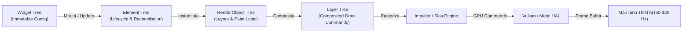

#### B. Hạn chế của Động cơ Skia: Hiện tượng Shader Compilation Jank
Trong các thế hệ Flutter trước đây, động cơ **Skia** được sử dụng làm bộ raster hóa mặc định. Mặc dù Skia là một thư viện đồ họa 2D rất mạnh mẽ, nó tồn tại một nhược điểm cố hữu trên nền tảng di động: **Cơ chế biên dịch Shader thời gian chạy (Just-In-Time Shader Compilation)**.
- Khi một hiệu ứng đồ họa mới (ví dụ: đổ bóng phức tạp, bo góc bán kính động, bộ lọc màu, làm mờ thủy tinh mờ mờ) lần đầu tiên xuất hiện trên màn hình, driver GPU chưa có sẵn mã máy shader tương ứng.
- Skia buộc phải tạm dừng luồng dựng hình (Raster Thread) để biên dịch chuỗi mã nguồn GLSL (OpenGL Shading Language) thành mã máy GPU chuyên dụng.
- Quá trình biên dịch JIT này có thể tiêu tốn từ 20ms đến hơn 100ms trên các thiết bị tầm trung. Do một khung hình chuẩn ở tốc độ 60 FPS chỉ cho phép ngân sách thời gian xử lý tối đa là **$16.67\text{ ms}$** ($1000\text{ ms} / 60\text{ frames}$), việc dừng 50ms dẫn đến hiện tượng trượt khung hình nghiêm trọng (*dropped frames*), người dùng quan sát thấy ứng dụng bị khựng hoặc giật hình ngay trong lần đầu tiên mở màn hình hoặc thực hiện thao tác vuốt hoạt họa.

#### C. Đột phá Kiến trúc với Động cơ Impeller (Pre-compiled Shaders Architecture)
Để giải quyết triệt để bài toán Shader Compilation Jank, nhóm kỹ sư Flutter đã tái kiến trúc hoàn toàn tầng đồ họa với động cơ **Impeller**:
1. **Biên dịch Shader trước AOT (Ahead-Of-Time Shader Compilation):** Toàn bộ các bộ đổ bóng (shaders) cần thiết cho việc vẽ các thành phần đồ họa của Flutter được định nghĩa và biên dịch tĩnh ngay trong quá trình xây dựng ứng dụng (Build-time) bằng bộ công cụ `impeller-cmake` và `glslang`. Mã shader nhị phân đích được nhúng sẵn vào tệp nhị phân cài đặt của ứng dụng.
2. **Khai thác trực tiếp API Đồ họa Hiện đại:** Impeller được thiết kế từ gốc để tương tác trực tiếp với các API đồ họa cấp thấp hiện đại: **Metal** trên iOS và **Vulkan** trên Android (với fallback sang OpenGL ES khi phần cứng cũ không hỗ trợ).
3. **Mô hình Bộ nhớ và Khả năng Dự đoán (Predictability):** Impeller loại bỏ việc phân bổ bộ nhớ động không kiểm soát trong luồng raster; tất cả các trạng thái ống dẫn (pipeline states) đều được khởi tạo trước và nạp sẵn trong bộ nhớ đệm GPU.

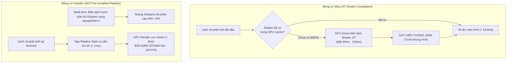

👉 **Kết luận thực tiễn:** Việc MyHCMUT ứng dụng Flutter SDK phiên bản mới với **động cơ Impeller mặc định** bảo đảm các danh mục nghiệp vụ phức tạp (như Form Wizard nộp phép 3 bước, danh sách văn bản đến/đi hàng trăm mục, biểu đồ tiến độ nhiệm vụ) luôn duy trì tốc độ khung hình lý tưởng 60 FPS cố định, triệt tiêu hiện tượng lag giật trong các trải nghiệm đầu tiên của người dùng.

---

### 2.1.3. Ngôn ngữ Dart và Cơ chế Thực thi Bất đồng bộ

Ngôn ngữ lập trình Dart (phiên bản 3.x) là trụ cột ngôn ngữ của Flutter, mang lại các đặc tính cấu trúc quan trọng phục vụ phát triển ứng dụng phân tán quy mô lớn:

#### A. Cơ chế Sound Null Safety (An toàn Kiểu Dữ liệu Tuyệt đối)
- Dart áp dụng cơ chế *Sound Null Safety* phân biệt rõ ràng ở cấp độ cú pháp giữa các kiểu dữ liệu không thể mang giá trị rỗng (`Type`) và các kiểu dữ liệu có thể mang giá trị rỗng (`Type?`).
- **Giá trị học thuật:** Nếu một biến được khai báo không thể null, trình biên dịch bảo đảm rằng biến đó **không bao giờ có thể mang giá trị null tại thời điểm thực thi (runtime)**. Điều này loại bỏ hoàn toàn lớp lỗi kinh điển nguy hiểm bậc nhất trong phát triển phần mềm: *Null Pointer Exception (NPE)*.
- **Ứng dụng trong MyHCMUT:** Khi giải mã dữ liệu JSON phản hồi từ các API backend hiện hữu (nơi nhiều trường như `ngayNghiBu`, `nguoiThayThe`, `yKienChiDao` có thể null), hệ thống DTO và Mapper tự động ép kiểu chặt chẽ, phát hiện ngay các sai lệch schema tại biên tiếp nhận dữ liệu trước khi chuyển giao vào logic ứng dụng.

#### B. Mô hình Thực thi Đơn luồng kết hợp Event Loop (The Event Loop Model)
Dart thực thi mã nguồn trên một mô hình đơn luồng (Single-threaded Execution). Để xử lý các tác vụ bất đồng bộ (I/O mạng, truy xuất cơ sở dữ liệu SQLite, sự kiện người dùng) mà không làm nghẽn giao diện, Dart sử dụng kiến trúc **Event Loop** với hai hàng đợi ưu tiên:
1. **Microtask Queue (Hàng đợi Vi tác vụ):** Chứa các tác vụ nội bộ ưu tiên cực cao cần xử lý ngay sau khi khung lệnh hiện tại kết thúc, trước khi chuyển giao quyền điều khiển lại cho hệ thống (ví dụ: các sự kiện nội bộ của framework).
2. **Event Queue (Hàng đợi Sự kiện):** Chứa các sự kiện ngoại vi như tương tác người dùng (chạm màn hình, cử chỉ vuốt), bộ đếm thời gian (Timer), phản hồi mạng I/O từ HTTP socket.

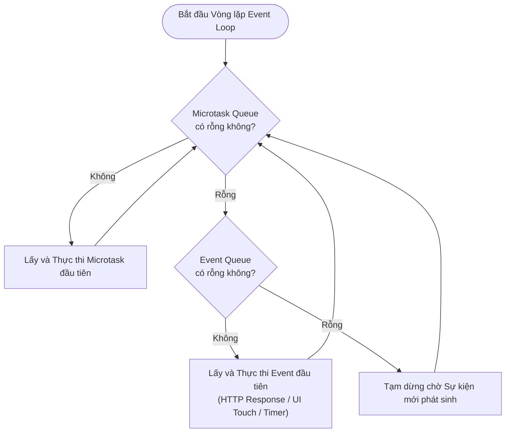

Nhờ cơ chế này kết hợp cùng các kiểu dữ liệu trừu tượng phản ứng `Future` và `Stream`, Dart cho phép viết mã bất đồng bộ theo phong cách tuần tự trực quan (`async/await`), giúp việc quản lý các luồng mạng đa máy chủ diễn ra mạch lạc và trong sáng.

#### C. Cơ chế Xử lý Song song Thực sự với Dart Isolates (Shared-Nothing Architecture)
Khi gặp các tác vụ tiêu tốn nặng năng lực CPU (CPU-intensive tasks) – như việc phân tích cú pháp (JSON Parsing) của danh bạ toàn trường gồm hàng nghìn bản ghi, hoặc tính toán giải thuật tìm kiếm văn bản cục bộ – nếu thực hiện trên luồng chính, Event Loop sẽ bị nghẽn và giao diện sẽ dừng hiển thị (gây jank).
- **Kiến trúc Isolate:** Dart giải quyết bài toán đa luồng bằng mô hình **Isolate** – các luồng thực thi hoàn toàn độc lập, sở hữu không gian heap bộ nhớ riêng biệt (Shared-Nothing Concurrency). Các Isolate không chia sẻ biến toàn cục, do đó **không bao giờ phát sinh hiện tượng xung đột tranh chấp bộ nhớ (Race Condition trên RAM) hoặc tình trạng bế tắc (Deadlock) ở cấp độ ngôn ngữ**.
- **Cơ chế Truyền Thông điệp (Message Passing):** Các Isolate giao tiếp với nhau bằng cách gửi bản sao dữ liệu (hoặc chuyển quyền sở hữu vùng nhớ) qua các cổng `SendPort` và `ReceivePort`.
- **Áp dụng trong hệ thống:** MyHCMUT tận dụng hàm `Isolate.run()` để điều hướng các tác vụ giải mã JSON danh bạ và tiền lương chạy trên các lõi CPU phụ (Background Thread), giải phóng luồng chính chuyên tâm cho việc dựng hình giao diện 60 FPS.

---

### 2.1.4. Quản trị trạng thái phản ứng (Reactive State Management) với Riverpod

Trong kiến trúc ứng dụng di động khai báo (Declarative UI), giao diện người dùng là một hàm toán học thuần túy của trạng thái ứng dụng:
$$\text{UI} = f(\text{State})$$

Khi trạng thái thay đổi, hệ thống sẽ tự động tính toán lại và dựng lại (re-render) các widget phụ thuộc. Việc lựa chọn một kiến trúc quản trị trạng thái (State Management) quyết định tính mở rộng, khả năng gỡ lỗi và mức độ thuận tiện khi thực hiện kiểm thử tự động của dự án.

#### A. Phân tích So sánh các Mô hình Quản trị Trạng thái trong Hệ sinh thái Flutter

1. **Provider:** Thư viện kinh điển dựa trên `InheritedWidget`. Điểm yếu chí mạng là phụ thuộc chặt chẽ vào cây widget (`BuildContext`), khiến việc truy xuất trạng thái từ các tầng service logic độc lập ngoài UI trở nên phức tạp, dễ phát sinh lỗi thời gian chạy (`ProviderNotFoundException`).
2. **BLoC / Cubit (Business Logic Component):** Mô hình hướng sự kiện (Event-driven) dựa trên `Stream`. Tách biệt rất tốt giữa UI và Logic; tuy nhiên, chi phí xây dựng mã nguồn (Boilerplate code) rất lớn khi phải tạo hàng loạt lớp Event, State cho từng thao tác CRUD đơn giản, làm chậm tốc độ phát triển.
3. **GetX:** Thư viện tiếp cận theo hướng "tất cả trong một" (tích hợp state, router, dependency injection). Cú pháp ngắn gọn nhưng vi phạm nguyên lý kiến trúc sạch (Clean Architecture), giấu kín ngữ cảnh toàn cục (hidden global state), gây khó khăn khi viết Unit Test cô lập và dễ dẫn đến rò rỉ bộ nhớ trong các dự án quy mô lớn.
4. **Riverpod (Thế hệ 3.x - Đảo ngược của Provider):**
   - **Hoàn toàn độc lập với `BuildContext`:** Provider của Riverpod là các biến bất biến toàn cục (Global Compile-time Constants) nhưng trạng thái bên trong lại được quản lý theo phạm vi (Scoped State) bên trong một vùng chứa gọi là `ProviderContainer`. Điều này cho phép đọc và theo dõi trạng thái từ bất kỳ tầng nào (Repository, Interceptor, Service) mà không cần ngữ cảnh widget.
   - **An toàn Tuyệt đối tại Thời điểm Biên dịch (Compile-time Safety):** Không thể phát sinh lỗi gọi provider chưa được đăng ký trong cây widget; nếu mã nguồn biên dịch thành công thì mọi phụ thuộc đều được định vị chính xác.
   - **Chuẩn hóa Xử lý Bất đồng bộ với `AsyncValue`:** Cung cấp cấu trúc dữ liệu hợp nhất đại diện cho 3 trạng thái bất biến: `AsyncLoading`, `AsyncData(value)`, và `AsyncError(error, stackTrace)`. Giao diện xử lý mạch lạc bằng cơ chế Pattern Matching qua phương thức `.when()`:
     ```dart
     leaveListAsync.when(
       data: (list) => LeaveListView(items: list),
       loading: () => const AppLoadingShimmer(),
       error: (err, stack) => AppErrorCard(message: err.toString()),
     );
     ```
   - **Tự động Giải phóng Tài nguyên (`autoDispose`):** Khi một màn hình bị đóng lại và không còn bất kỳ widget nào lắng nghe trạng thái của provider, Riverpod sẽ tự động hủy bỏ đối tượng trạng thái và dọn sạch bộ nhớ cache, ngăn chặn hiện tượng rò rỉ bộ nhớ (Memory Leak).

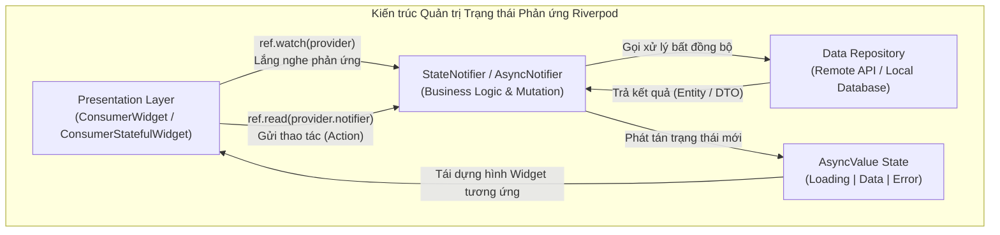

👉 **Kết luận:** MyHCMUT lựa chọn **Riverpod 3.x** kết hợp cùng bộ sinh mã tự động `riverpod_annotation` và `riverpod_generator` làm giải pháp quản trị trạng thái và tiêm phụ thuộc (Dependency Injection) thống nhất cho toàn bộ các mô-đun trong kiến trúc Monorepo.

---

## 2.2. KIẾN TRÚC HƯỚNG DỊCH VỤ VÀ XỬ LÝ PHÂN TÁN

### 2.2.1. Kiến trúc RESTful API và Giao thức Truyền thông Mạng

Hệ thống MyHCMUT tuân thủ mô hình kiến trúc Hướng dịch vụ (Service-Oriented Architecture - SOA) kết hợp giải pháp Cổng giao tiếp di động đóng vai trò Backend-For-Frontend (BFF).

#### A. Các Nguyên lý Kiến trúc REST (Representational State Transfer)
Được đề xuất bởi Roy Fielding trong luận án tiến sĩ năm 2000, kiến trúc REST quy định các ràng buộc cốt lõi bảo đảm tính mở rộng và khả năng tiến hóa của các hệ thống phân tán:
1. **Kiến trúc Client-Server:** Tách biệt triệt để mối quan tâm giữa giao diện người dùng trên thiết bị di động (Client) và logic lưu trữ dữ liệu nghiệp vụ trên máy chủ (Server).
2. **Phi trạng thái (Statelessness):** Mỗi yêu cầu HTTP gửi từ ứng dụng di động lên máy chủ phải chứa đầy đủ mọi thông tin cần thiết để máy chủ hiểu và thực thi yêu cầu đó. Máy chủ không lưu trữ ngữ cảnh phiên làm việc của Client giữa các yêu cầu API; trạng thái phiên được quản lý thông qua mã xác thực (Bearer JWT Token).
3. **Khả năng Lưu đệm (Cacheability):** Phản hồi từ máy chủ phải được định nghĩa rõ ràng về khả năng lưu đệm (`Cache-Control: public/private/no-cache`, `ETag`) giúp giảm thiểu lưu lượng mạng và độ trễ phản hồi cho ứng dụng di động.
4. **Giao diện Đồng nhất (Uniform Interface):** Khai thác chuẩn xác các phương thức của giao thức HTTP/1.1 (RFC 7231):
   - `GET`: Truy xuất tài nguyên (an toàn và bất biến - safe & idempotent).
   - `POST`: Khởi tạo tài nguyên mới (không bất biến - non-idempotent).
   - `PUT`: Cập nhật toàn bộ hoặc thay thế trạng thái tài nguyên (bất biến - idempotent).
   - `DELETE`: Xóa tài nguyên (bất biến - idempotent).

#### B. Thiết kế Bộ Chặn Giao tiếp Đa Miền (`MultiDomainAuthInterceptor`)
Do ứng dụng di động MyHCMUT phải giao tiếp đồng thời với 3 dịch vụ backend khác biệt về địa chỉ mạng và chức năng:
- **`myhcmut-be` (Port 4000):** Cổng điều phối chung và danh bạ tích hợp.
- **`hrm-be` (Port 6023):** Dịch vụ quản lý nhân sự, hồ sơ lý lịch và nghỉ phép.
- **`ioffice-be` (Port 3001):** Dịch vụ văn phòng điện tử, nhiệm vụ và lịch công tác.

Ứng dụng triển khai thư viện giao tiếp mạng `Dio` kết hợp lớp chặn đa miền `MultiDomainAuthInterceptor`. Bộ chặn này có hai nhiệm vụ tối quan trọng:
1. **Tự động gắn Token theo Miền đích:** Kiểm tra URL đích của từng yêu cầu gửi đi; nếu yêu cầu hướng tới các miền được bảo vệ, bộ chặn tự động trích xuất chuỗi JWT tương ứng từ bộ nhớ bảo mật và gắn vào tiêu đề `Authorization: Bearer <token>`.
2. **Cơ chế Hàng đợi Khóa Làm mới Token (Silent Refresh Mutex Queue):** Khi một yêu cầu API trả về mã lỗi `401 Unauthorized` (do Access Token hết hạn):
   - Thay vì để hàng chục yêu cầu đồng thời cùng kích hoạt lệnh làm mới token (gây quá tải máy chủ xác thực và lỗi vô hiệu hóa token chéo), bộ chặn sử dụng một khóa chốt đơn (Mutex Lock).
   - Tiến trình đầu tiên giữ khóa và thực hiện cuộc gọi làm mới token (`POST /api/auth/refresh`).
   - Tất cả các yêu cầu khác phát sinh trong thời gian này được đưa vào một **Hàng đợi tạm giữ (Request Queue)**.
   - Khi token mới được cấp phát thành công, bộ chặn cập nhật lại tiêu đề `Authorization` cho toàn bộ các yêu cầu đang chờ trong hàng đợi và phát lại chúng một cách trong suốt đối với người dùng (Transparent Retry).

```mermaid
sequenceDiagram
    autonumber
    actor User as Người dùng Mobile
    participant Dio as Dio Client
    participant Interceptor as MultiDomainAuthInterceptor
    participant Lock as Refresh Mutex Lock
    participant AuthAPI as Auth Server (/refresh)
    participant BizAPI as Business API Server

    User->>Dio: Gửi đồng thời Req A và Req B
    Dio->>Interceptor: Xử lý Req A
    Dio->>Interceptor: Xử lý Req B
    Interceptor->>BizAPI: Gửi Req A & Req B (Token cũ)
    BizAPI-->>Interceptor: Trả về lỗi 401 Unauthorized (Req A)
    BizAPI-->>Interceptor: Trả về lỗi 401 Unauthorized (Req B)
    
    activate Interceptor
    Note over Interceptor,Lock: Req A chiếm Mutex Lock; Req B đưa vào Hàng đợi chờ
    Interceptor->>Lock: Acquire Mutex
    Interceptor->>AuthAPI: POST /api/auth/refresh (RefreshToken)
    activate AuthAPI
    AuthAPI-->>Interceptor: Trả về Cặp Token mới (New Access & Refresh)
    deactivate AuthAPI
    Interceptor->>Interceptor: Lưu Token mới vào Secure Storage
    Interceptor->>Lock: Release Mutex
    
    Note over Interceptor: Tái kích hoạt Req A và Req B với Bearer Token mới
    Interceptor->>BizAPI: Phát lại Req A (New Token)
    Interceptor->>BizAPI: Phát lại Req B (New Token)
    BizAPI-->>Interceptor: Trả về dữ liệu thành công (200 OK)
    deactivate Interceptor
    Interceptor-->>User: Hiển thị kết quả bình thường
```

---

### 2.2.2. Hệ thống truyền thông điệp phân tán Apache Kafka (KRaft Mode)

Trong các hệ thống phân tán hiện đại, mô hình truyền thông đồng bộ trực tiếp (Synchronous HTTP) giữa các microservices bộc lộ nhiều nhược điểm chí mạng: độ trễ cộng dồn (Cascading Latency), khả năng chịu lỗi kém (Single Point of Failure - dịch vụ sau nghẽn khiến dịch vụ trước sụp đổ), và thiếu khả năng san phẳng tải khi có đột biến lưu lượng (Spike Arresting).

Hệ thống quản trị trường đại học ứng dụng **Apache Kafka** làm xương sống truyền thông điệp phân tán theo mô hình Hướng sự kiện (Event-Driven Architecture):

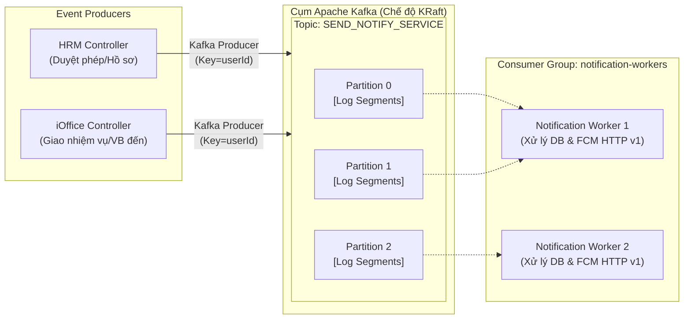

#### A. Kiến trúc Vận hành KRaft (Kafka Raft Metadata Mode)
- Cụm Kafka trong đề tài vận hành ở chế độ **KRaft (Kafka Raft Metadata mode)**, loại bỏ hoàn toàn sự phụ thuộc vào cụm điều phối bên ngoài Apache ZooKeeper.
- Trạng thái metadata của toàn bộ cụm được đồng thuận nội bộ thông qua biến thể của giải thuật đồng thuận Raft (Raft Consensus Protocol), lưu trữ trực tiếp trong một topic đặc biệt (`@metadata`).
- **Ưu thế:** Khởi động cụm cực nhanh, hỗ trợ hàng triệu phân vùng (partitions), loại trừ nguy cơ mất đồng bộ siêu dữ liệu giữa ZooKeeper và Broker, đơn giản hóa tối đa quy trình bảo trì và giám sát hệ thống.

#### B. Đặc tính Phân vùng và Thứ tự Thông điệp (Partitioning & Ordering)
- Một Topic (như `SEND_NOTIFY_SERVICE`) được phân chia thành nhiều Phân vùng (Partitions). Mỗi phân vùng là một chuỗi nhật ký ghi nối đuôi bất biến (Append-Only Immutable Commit Log).
- **Nguyên lý bảo toàn thứ tự:** Kafka **bảo đảm tính tuần tự tuyệt đối của các thông điệp bên trong cùng một phân vùng**, nhưng không bảo đảm thứ tự giữa các phân vùng khác nhau. Để bảo đảm các sự kiện liên quan đến cùng một người dùng (ví dụ: chuỗi sự kiện "Tạo đơn" $\rightarrow$ "Lãnh đạo duyệt" $\rightarrow$ "Cấp số quyết định") luôn được xử lý theo đúng trình tự thời gian, Producer sử dụng định danh người dùng (`userId` hoặc `shcc`) làm khóa phân vùng (Partition Key). Thuật toán băm MurmurHash2 sẽ ánh xạ mọi sự kiện của cùng một cá nhân vào đúng một phân vùng cố định.

---

### 2.2.3. Kiến trúc Đẩy thông báo Đa nền tảng (Push Notification Architecture)

Để thông báo nghiệp vụ tiếp cận cán bộ ngay lập tức kể cả khi ứng dụng di động đang bị tắt hoàn toàn hoặc thiết bị đang ở chế độ khóa màn hình, MyHCMUT thiết kế một đường ống thông báo đẩy đa tầng tích hợp giữa Apache Kafka, dịch vụ xử lý nền và mạng lưới máy chủ đám mây của Google và Apple:

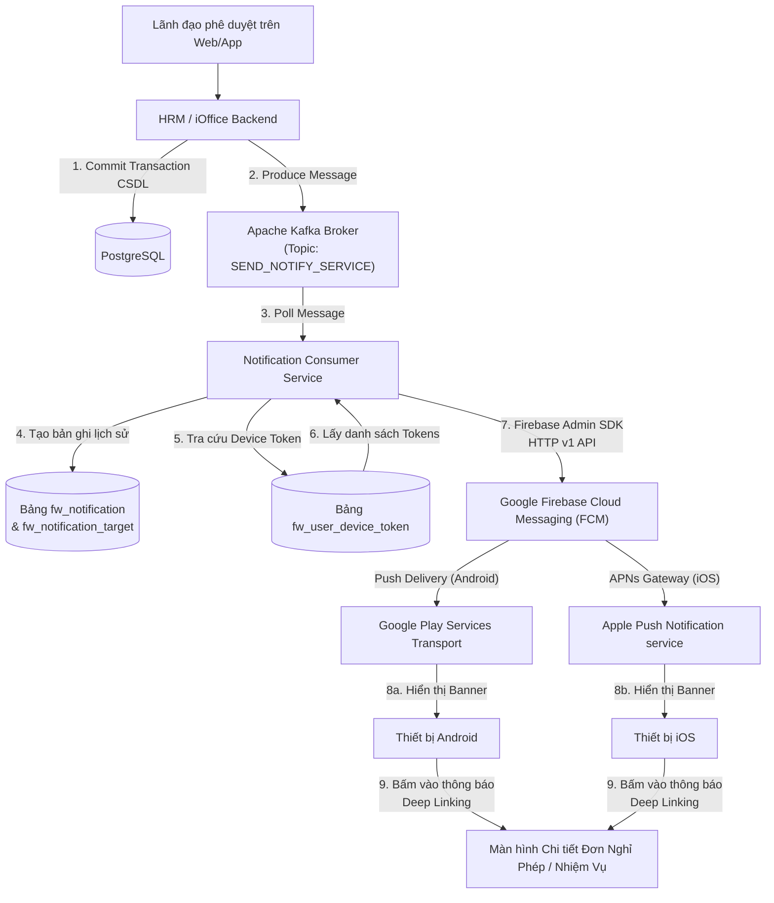

#### A. Chuẩn Giao vận Firebase Cloud Messaging (FCM) HTTP v1 API
Hệ thống sử dụng phiên bản giao thức chuẩn mới nhất **FCM HTTP v1 API** (RFC-compliant) với cơ chế xác thực an toàn thông qua thẻ bài ngắn hạn OAuth 2.0 Access Token của tài khoản dịch vụ (Google Service Account), thay thế hoàn toàn chuẩn Legacy Server Key cũ đã bị Google ngừng hỗ trợ.

#### B. Cấu trúc Thông điệp Đẩy: Notification Payload vs. Data-Only Payload
Trong giao thức FCM, thông điệp gửi tới thiết bị di động có thể thuộc hai định dạng:
1. **Notification Payload (Chỉ chứa `notification: { title, body }`):** Do hệ điều hành (Android OS hoặc iOS System) tự động bắt và hiển thị thành banner thông báo trên thanh trạng thái. Ứng dụng không thể can thiệp xử lý logic khi đang ở trạng thái chạy nền (Background) hoặc tắt (Terminated).
2. **Data-Only Payload (Chứa `data: { ... }`):** Toàn bộ dữ liệu được chuyển thẳng vào mã nguồn ứng dụng để kích hoạt hàm xử lý nền (`FirebaseMessaging.onBackgroundMessage`). Tuy nhiên, trên hệ điều hành iOS, thông điệp Data-only có thể bị hệ thống trì hoãn hoặc hạn chế tiêu thụ pin nếu không có cờ `content-available: 1`.
3. **Giải pháp Hợp nhất của MyHCMUT:** Kết hợp **Hybrid Notification + Data Payload**: Vừa chứa tiêu đề hiển thị chuẩn mực cho hệ điều hành, vừa đính kèm gói siêu dữ liệu nghiệp vụ có cấu trúc để phục vụ bộ định tuyến ứng dụng.

#### C. Thiết kế Bộ Siêu Dữ liệu Định tuyến Sâu (Deep Linking Metadata Specification)
Để bảo đảm khi cán bộ bấm vào biểu ngữ thông báo trên màn hình khóa, ứng dụng sẽ khởi động và điều hướng chính xác đến đúng giao diện nghiệp vụ cụ thể, gói `data` bắt buộc phải tuân thủ nghiêm ngặt cấu trúc 4 trường định danh:
- `source`: Nguồn phát sinh sự kiện (`"HRM"` hoặc `"IOFFICE"`).
- `entityType`: Loại đối tượng nghiệp vụ (`"LEAVE_REQUEST"`, `"MISSION"`, `"DOCUMENT_IN"`, `"SCHEDULE"`).
- `entityId`: Mã khóa chính của bản ghi trong CSDL (ví dụ: `1024`).
- `isApproval`: Cờ đánh dấu vai trò xử lý (`"true"` nếu mở giao diện duyệt của lãnh đạo, `"false"` nếu mở giao diện xem của người tạo).

Bộ phân giải `NotificationRouteParser` trên Flutter sẽ bóc tách các trường này và chuyển giao cho `GoRouter` để thực hiện lệnh điều hướng trực tiếp:
```dart
context.pushNamed(
  AppRoutes.leaveDetail, 
  pathParameters: {'id': entityId},
  queryParameters: {'isApproval': isApproval},
);
```

---

### 2.2.4. Ngữ nghĩa Chuyển phát Thông điệp Phân tán (Delivery Semantics)

Trong lý thuyết Hệ thống Phân tán, việc chuyển phát thông điệp giữa các tiến trình qua mạng vô tuyến viễn thông phải đối mặt với các nghịch lý kinh điển như **Nghịch lý Hai vị tướng (Two Generals' Problem)**. Không thể có một giao thức mạng nào bảo đảm tuyệt đối tính đồng thuận trong điều kiện kênh truyền không tin cậy.

Hệ thống phân cấp ngữ nghĩa chuyển phát thành 3 cấp độ:

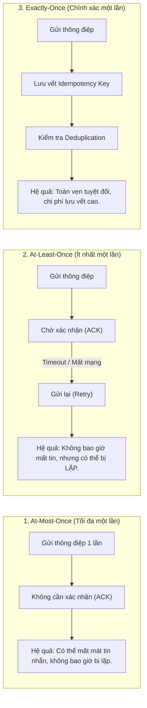

#### A. Bản chất At-Least-Once và Best-Effort của Mạng Thông báo Di động
Một nhận thức sai lầm phổ biến trong kỹ thuật phần mềm là kỳ vọng rằng Google FCM và Apple APNs bảo đảm chuyển phát tin cậy 100% "Chính xác một lần" (Exactly-Once Delivery). 
- **Thực tế kỹ thuật:** Toàn bộ hạ tầng mạng viễn thông di động hoạt động theo nguyên lý **At-Least-Once Delivery kết hợp Best-Effort Delivery**.
- Nếu thiết bị di động di chuyển qua vùng sóng yếu hoặc đang chuyển vùng giữa Wi-Fi và mạng 4G/5G, gói tin xác nhận (ACK) từ thiết bị gửi về máy chủ FCM có thể bị thất lạc. Khi đó, máy chủ FCM sẽ kích hoạt cơ chế phát lại, dẫn đến việc thiết bị di động nhận **hai thông báo đẩy giống hệt nhau (Message Duplication)**.
- Thậm chí, nếu thiết bị tắt nguồn trong thời gian dài vượt quá thời hạn sống của thông điệp (`time_to_live`), thông báo có thể bị hủy bỏ bởi gateway viễn thông.

#### B. Nguyên lý Bất biến Lũy thừa (Idempotency) tại Điểm cuối
Để ngăn ngừa tác động tiêu cực của hiện tượng lặp tin, tầng ứng dụng di động MyHCMUT bắt buộc phải áp dụng nguyên tắc **Idempotency** (Tính bất biến lũy thừa: $f(f(x)) = f(x)$):
- Mỗi thông điệp gửi từ backend được gán một mã định danh duy nhất không trùng lặp `notificationId` (hoặc UUID sự kiện).
- Khi ứng dụng di động tiếp nhận thông báo, hệ thống lưu mã định danh này vào cơ sở dữ liệu đệm cục bộ (Local Deduplication Cache).
- Nếu nhận được một thông điệp có `notificationId` đã tồn tại trong danh sách đã xử lý, ứng dụng sẽ hủy bỏ tiến trình thông báo, không phát âm thanh chuông hay tăng chỉ số huy hiệu (App Badge Counter) lần thứ hai.

#### C. Rủi ro Phân tán Kép (Dual-Write Problem) và Hướng tiếp cận Transactional Outbox
Một rủi ro kiến trúc phân tán nghiêm trọng khác là **Vấn đề Ghi kép (Dual-Write Problem)**: Một thao tác nghiệp vụ vừa phải ghi vào CSDL cục bộ, vừa phải phát sự kiện sang Message Broker (Kafka).
- Nếu phát sự kiện Kafka trước khi commit CSDL: Nếu giao dịch CSDL sau đó bị lỗi (ví dụ vi phạm ràng buộc toàn vẹn và bị Rollback), thông điệp đã lỡ phát sang Kafka sẽ kích hoạt gửi thông báo đẩy tới điện thoại của cán bộ. Cán bộ nhận được thông báo "Đơn của bạn đã được duyệt", nhưng khi mở ứng dụng thì trạng thái đơn vẫn là "Đang chờ" (Hiện tượng Thông báo Ma - Ghost Event).
- **Quy tắc Hiện thực Chuẩn hóa trong MyHCMUT:** Toàn bộ mã nguồn backend của hệ thống bắt buộc áp dụng nguyên tắc **Post-Commit Dispatch**: Lệnh `app.notification.send()` chỉ được phép triệu gọi sau khi giao dịch CSDL đã kết thúc thành công (`transaction.commit()`).
- **Giới hạn học thuật trung thực (CLM-NOT-01 & CLM-NOT-02):** Mặc dù việc phát sau commit đã triệt tiêu hoàn toàn thông báo ma, nó vẫn tồn tại một khe hở rủi ro nhỏ: Nếu máy chủ backend bị sập nguồn đột ngột ngay sau khi CSDL commit nhưng trước khi kịp kết nối tới Kafka, sự kiện thông báo sẽ bị mất vĩnh viễn. Nhóm tác giả định vị giải pháp hoàn thiện lý thuyết – **Mẫu thiết kế Hộp thư xuất Giao dịch (Transactional Outbox Pattern)** kết hợp cùng kỹ thuật Change Data Capture (Debezium/Kafka Connect) – làm hướng phát triển nâng cấp hệ thống tại Chương 7.

---

## 2.3. QUẢN LÝ TƯƠNG TRANH VÀ GIAO DỊCH CƠ SỞ DỮ LIỆU

### 2.3.1. Thuộc tính ACID và Ranh giới Giao dịch Cơ sở Dữ liệu

Trong các hệ thống cơ sở dữ liệu quan hệ (RDBMS), tính đúng đắn của dữ liệu nghiệp vụ phụ thuộc vào việc thực thi giao dịch thỏa mãn 4 thuộc tính kinh điển **ACID** (Jim Gray, 1992):
1. **Atomicity (Tính nguyên tử):** Một giao dịch là một khối công việc không thể phân chia ("Tất cả hoặc Không có gì"). Mọi thao tác ghi trong giao dịch phải cùng thành công và được lưu vết vĩnh viễn (Commit), hoặc nếu có bất kỳ một lỗi nào xảy ra thì toàn bộ các thay đổi trước đó phải được hoàn tác hoàn toàn (Rollback), đưa hệ thống trở lại trạng thái ban đầu.
2. **Consistency (Tính nhất quán):** Giao dịch phải đưa cơ sở dữ liệu từ một trạng thái hợp lệ sang một trạng thái hợp lệ khác, không được vi phạm bất kỳ ràng buộc toàn vẹn dữ liệu nào (Primary Key, Foreign Key, Check Constraints, Business Invariants).
3. **Isolation (Tính cô lập):** Các giao dịch thực thi đồng thời không được can thiệp lẫn nhau. Kết quả của việc thực thi đồng thời nhiều giao dịch phải tương đương với kết quả khi chúng được thực thi tuần tự lần lượt.
4. **Durability (Tính bền vững):** Một khi giao dịch đã commit thành công, dữ liệu cập nhật sẽ được lưu trữ vĩnh viễn trong bộ nhớ bất biến (Write-Ahead Logging - WAL trên đĩa cứng) và không bao giờ bị mất mát ngay cả khi hệ thống sập nguồn đột ngột.

```mermaid
flowchart TD
    subgraph BrokenBoundary["Ranh giới Giao dịch Phân mảnh (NGUY HIỂM)"]
        A1["Bắt đầu Request"] --> A2["Tạo bản ghi tcns_nghi_phep (Ko transaction)"]
        A2 --> A3["Tự mở Trans riêng: SELECT checkTrungLich & COMMIT ngay"]
        A3 --> A4["Tạo bản ghi tcns_lich_ca_nhan (LỖI MẠNG / CRASH)"]
        A4 --> A5["HỆ QUẢ: Dữ liệu mồ côi (Orphan Record), Lịch rác!"]
    end

    subgraph HardenedBoundary["Ranh giới Giao dịch Trọn vẹn (CHUẨN HÓA MYHCMUT)"]
        B1["BEGIN TRANSACTION (Lan truyền xuyên suốt)"]
        B1 --> B2["Xin khóa Advisory Lock theo SHCC"]
        B2 --> B3["Thực thi checkTrungLich cùng ngữ cảnh Trans"]
        B3 --> B4["INSERT / UPDATE đồng thời nhiều bảng"]
        B4 --> B5["COMMIT TRANSACTION (Nguyên tử 100%)"]
        B5 --> B6["Giải phóng Khóa & Phát thông báo Kafka"]
    end
```

#### Ranh giới Giao dịch (Transaction Boundary) và Sự cố Commit Sớm (Premature Commit Anomaly)
Trong quá trình kiểm toán mã nguồn hệ thống hiện hữu (`00B_CONCURRENCY_WRITE_PATH_AUDIT.md`), nhóm đã phát hiện một lỗ hổng ranh giới giao dịch nghiêm trọng:
- Khi kiểm tra trùng lịch, phương thức `lichFilter` tự ý mở một giao dịch riêng biệt (`const t = await BkcoretechModel.connection.transaction()`), thực hiện truy vấn hàm CSDL và lập tức gọi `await t.commit()`.
- Việc đóng kết nối giao dịch này giữa chừng khiến các câu lệnh ghi tiếp theo trong controller bị mất ngữ cảnh cô lập, biến quy trình nộp đơn thành nhiều mảnh ghi rời rạc. Nếu câu lệnh ghi lịch cá nhân sau đó thất bại, đơn đăng ký đã lưu trước đó không thể rollback, tạo ra **Bản ghi đơn mồ côi (Orphan Records)** làm sai lệch số liệu thống kê của Nhà trường.
- **Giải pháp:** Tái cấu trúc chuẩn hóa toàn bộ ranh giới giao dịch, truyền biến ngữ cảnh `transaction` xuyên suốt từ Controller xuống tận các phương thức truy vấn tầng thấp nhất.

---

### 2.3.2. Các Cấp độ Cô lập Giao dịch (Transaction Isolation Levels)

Để cân bằng giữa **tính toàn vẹn dữ liệu** và **hiệu năng xử lý đồng thời (Throughput)**, chuẩn ANSI/ISO SQL-92 định nghĩa 4 cấp độ cô lập giao dịch dựa trên khả năng ngăn ngừa 3 hiện tượng bất thường (Read Anomalies):

1. **Dirty Read (Đọc rác):** Giao dịch $T_1$ đọc một dòng dữ liệu vừa được sửa đổi bởi giao dịch $T_2$ nhưng $T_2$ chưa commit. Nếu $T_2$ sau đó rollback, dữ liệu $T_1$ đã đọc là dữ liệu không có thực.
2. **Non-repeatable Read (Đọc không lặp lại / Fuzzy Read):** Giao dịch $T_1$ đọc một dòng dữ liệu. Giao dịch $T_2$ sau đó sửa đổi hoặc xóa dòng dữ liệu đó và commit. Nếu $T_1$ đọc lại dòng dữ liệu đó lần thứ hai, $T_1$ sẽ thấy giá trị đã bị thay đổi.
3. **Phantom Read (Đọc bóng ma):** Giao dịch $T_1$ thực thi một câu truy vấn tìm kiếm danh sách các dòng thỏa mãn một điều kiện vị từ (Predicate, ví dụ: `WHERE ngay = '2026-09-10'`). Giao dịch $T_2$ sau đó chèn thêm (INSERT) một dòng mới thỏa mãn điều kiện đó và commit. Nếu $T_1$ thực hiện lại câu truy vấn, danh sách trả về sẽ xuất hiện thêm một dòng "bóng ma" mới.

---

### Bảng 2.2: Các cấp độ cô lập giao dịch theo chuẩn ANSI SQL và hiện thực trên PostgreSQL

| Cấp độ Cô lập (Isolation Level) | Hiện tượng Đọc rác (Dirty Read) | Đọc không lặp lại (Non-repeatable Read) | Đọc bóng ma (Phantom Read) | Hiện tượng Ghi lệch (Write Skew) | Hiện thực trong PostgreSQL |
| :--- | :---: | :---: | :---: | :---: | :--- |
| **Read Uncommitted** | Có thể xảy ra | Có thể xảy ra | Có thể xảy ra | Có thể xảy ra | *Trong PostgreSQL, tự động nâng cấp tương đương cấp Read Committed.* |
| **Read Committed (Mặc định)** | **Không thể** | Có thể xảy ra | Có thể xảy ra | Có thể xảy ra | **Mỗi câu lệnh SQL nhìn thấy một snapshot dữ liệu mới tại thời điểm câu lệnh bắt đầu thực thi.** |
| **Repeatable Read** | **Không thể** | **Không thể** | **Không thể** | Có thể xảy ra | Sử dụng Snapshot Isolation: Toàn bộ transaction chỉ nhìn thấy một snapshot cố định tại thời điểm câu truy vấn đầu tiên bắt đầu. |
| **Serializable** | **Không thể** | **Không thể** | **Không thể** | **Không thể** | Sử dụng SSI (Serializable Snapshot Isolation), tự động phát hiện xung đột và rollback transaction nếu vi phạm thứ tự tuần tự hóa. |

#### Cơ chế Đa phiên bản MVCC và Giới hạn của Read Committed trong PostgreSQL
Hệ quản trị cơ sở dữ liệu PostgreSQL sử dụng cơ chế **Điều khiển Tương tranh Đa phiên bản (Multi-Version Concurrency Control - MVCC)**. Khi một dòng dữ liệu được cập nhật, PostgreSQL không ghi đè trực tiếp lên vùng nhớ cũ mà tạo ra một phiên bản mới của dòng đó (Tuple Version) đi kèm hai trường siêu dữ liệu ẩn: `xmin` (mã transaction khởi tạo dòng) và `xmax` (mã transaction xóa hoặc cập nhật dòng).

Ở cấp độ cô lập mặc định **Read Committed**:
- Mỗi câu truy vấn SQL độc lập bên trong transaction sẽ nhận một ảnh chụp (Snapshot) mới nhất của cơ sở dữ liệu tại thời điểm câu lệnh đó bắt đầu chạy.
- **Khe hở tương tranh (The Concurrency Gap):** Cấp độ Read Committed chỉ bảo vệ việc đọc dữ liệu đã commit, nhưng **hoàn toàn không bảo vệ các thao tác phụ thuộc trạng thái tương lai (State-dependent Actions)**. Nếu giao dịch thực hiện chuỗi thao tác: Đọc dữ liệu kiểm tra điều kiện $\rightarrow$ Tính toán nghiệp vụ trên ứng dụng $\rightarrow$ Ghi dữ liệu mới vào CSDL (mô hình *Check-Then-Act*), cấp độ Read Committed hoàn toàn bất lực trong việc ngăn ngừa xung đột nếu có một giao dịch khác chèn dữ liệu vào giữa khoảng thời gian này.

---

### 2.3.3. Hiện tượng Xung đột Tương tranh trong Nghiệp vụ Đặt lịch / Nghỉ phép (Double-Booking Anomaly)

Để minh chứng rõ ràng sự thất bại của cấp độ Read Committed thông thường trước bài toán nộp đơn nghỉ phép và đăng ký lịch công tác, ta xét kịch bản hai yêu cầu đăng ký nghỉ phép của cùng một cán bộ viên chức (Mã số: `CB_01`) gửi lên máy chủ đồng thời tại cùng một thời điểm:

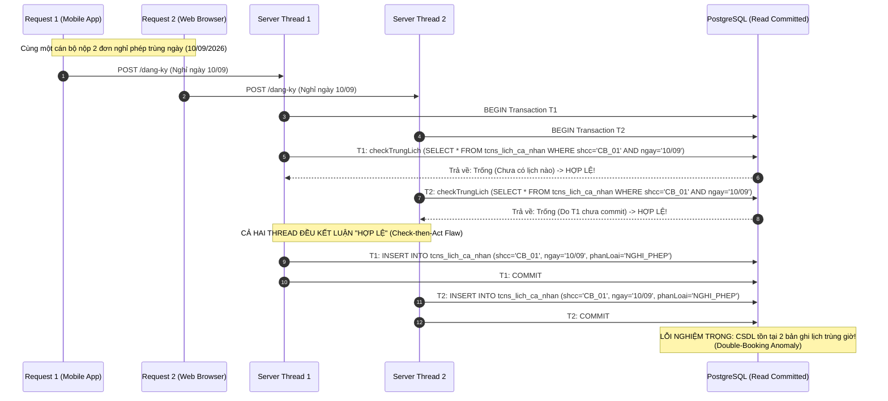

#### Phân tích Nguyên nhân Kỹ thuật:
1. **Lỗ hổng Check-Then-Act (Kiểm tra rồi mới Thực thi):** Phán quyết nghiệp vụ ở Bước 7 và Bước 8 dựa trên một tiền đề đọc dữ liệu quá khứ. Khoảng thời gian trễ giữa lúc đọc kiểm tra (`checkTrungLich`) và lúc thực thi ghi (`INSERT`) tạo ra một "Cửa sổ tương tranh" (Race Window).
2. **Hiện tượng Bóng ma do Chèn mới (Predicate Locking Failure):** Khi Thread 2 thực hiện truy vấn `SELECT`, bản ghi lịch của Thread 1 chưa hề tồn tại trên bảng. Do đó, các khóa mức dòng thông thường không thể phát huy tác dụng. Kết quả là cơ sở dữ liệu lưu trữ hai bản ghi lịch chồng chéo nhau, vi phạm nghiêm trọng tính toàn vẹn dữ liệu nhân sự của Nhà trường.

---

### 2.3.4. Đánh giá và So sánh các Kỹ thuật Khóa Tương tranh

Để khắc phục hiện tượng Double-Booking Anomaly trên, các kỹ sư phần mềm thường xem xét 3 chiến lược kiểm soát tương tranh:

```mermaid
flowchart TD
    subgraph Strat1["1. Pessimistic Row Locking (SELECT FOR UPDATE)"]
        R1["Khóa dòng vật lý hiện hữu"] --> R2["Bản ghi INSERT chưa tồn tại!"]
        R2 --> R3["THẤT BẠI trước bài toán Chèn mới (Insert Predicate)"]
    end

    subgraph Strat2["2. Optimistic Concurrency Control (CAS / Versioning)"]
        O1["Gắn trường version trên bản ghi"] --> O2["So sánh version khi UPDATE"]
        O2 --> O3["KHÔNG ÁP DỤNG ĐƯỢC cho việc kiểm tra khoảng thời gian giao nhau"]
    end

    subgraph Strat3["3. PostgreSQL Advisory Locking (pg_advisory_xact_lock)"]
        A1["Tạo khóa trừu tượng trong RAM theo SHCC"] --> A2["Tuần tự hóa mọi luồng ghi của cùng cán bộ"]
        A2 --> A3["Cán bộ khác nhau thực thi SONG SONG tuyệt đối!"]
    end
```

#### A. Khóa Bi quan Mức Dòng (Pessimistic Row Locking: `SELECT ... FOR UPDATE`)
- **Cơ chế:** Khóa trực tiếp lên dòng dữ liệu vật lý đã tồn tại trong bảng, buộc các giao dịch khác muốn đọc/ghi dòng này phải xếp hàng chờ.
- **Hạn chế đối với bài toán đặt lịch:** `SELECT FOR UPDATE` **chỉ khóa được các dòng đang tồn tại**. Trong bài toán đăng ký nghỉ phép mới, bản ghi lịch cá nhân cần tạo **chưa hề có trong cơ sở dữ liệu**. Khi câu lệnh `SELECT` trả về tập kết quả rỗng (0 dòng), PostgreSQL không có bất kỳ dòng nào để đặt khóa. Do đó, kỹ thuật khóa dòng hoàn toàn bất lực trước hiện tượng xung đột chèn mới (Insert Conflict).
- **Ứng dụng thực tế trong hệ thống:** Kỹ thuật này được áp dụng thành công tại bước phê duyệt cuối cùng (`KET_THUC`) trên bảng quỹ phép năm `tcns_so_nghi_phep_nam`: Dòng số dư phép năm đã tồn tại sẵn từ đầu năm, do đó lệnh `SELECT ... FOR UPDATE` bảo vệ số dư quỹ phép không bao giờ bị trừ vượt quá quy định khi lãnh đạo thao tác duyệt hàng loạt.

#### B. Khóa Lạc quan (Optimistic Concurrency Control - OCC / Compare-And-Swap)
- **Cơ chế:** Cho phép tất cả các giao dịch đọc và tính toán tự do. Mỗi bản ghi được gắn một trường phiên bản (`version: number`). Khi ghi cập nhật, câu lệnh SQL sẽ kiểm tra:
  ```sql
  UPDATE table SET status = 'APPROVED', version = version + 1 
  WHERE id = :id AND version = :currentVersion;
  ```
- Nếu số dòng cập nhật trả về là 0, hệ thống biết rằng dữ liệu đã bị thay đổi bởi tiến trình khác và tiến hành rollback.
- **Hạn chế:** OCC chỉ phù hợp cho việc cập nhật đơn lẻ trên một thực thể độc lập. Khi bài toán đòi hỏi kiểm tra sự giao thoa giữa các khoảng thời gian (Interval Overlap) trên một tập hợp động nhiều bản ghi lịch khác nhau, việc mô hình hóa số phiên bản trở nên bất khả thi và gây tỷ lệ hủy giao dịch (abort rate) rất cao.

#### C. Khóa Tương tranh Cấp Ứng dụng của PostgreSQL: `pg_advisory_xact_lock`
Để giải quyết tận gốc bài toán mà không làm suy giảm hiệu năng toàn hệ thống, MyHCMUT áp dụng giải pháp **PostgreSQL Transaction-level Advisory Lock**:
1. **Bản chất kỹ thuật:** Advisory Lock là các khóa trừu tượng được quản lý trực tiếp bởi hệ thống quản trị bộ nhớ của PostgreSQL (Shared Memory Lock Table), hoàn toàn không gắn liền với một bảng hay một dòng vật lý nào. Ý nghĩa nghiệp vụ của khóa do ứng dụng tự định nghĩa.
2. **Phân vùng Không gian Khóa theo Cán bộ (Partitioned Key Hashing):**
   Hệ thống khởi tạo khóa bằng cách băm chuỗi định danh cán bộ thông qua hàm băm nội bộ `hashtext`:
   ```sql
   SELECT pg_advisory_xact_lock(hashtext('tcns_lich_ca_nhan:' || :shcc));
   ```
   - Nếu cán bộ $A$ (ví dụ: SHCC `2210392`) gửi hai yêu cầu nộp đơn trùng giờ, yêu cầu thứ hai sẽ bị chặn lại ở cấp độ CSDL cho đến khi yêu cầu thứ nhất hoàn tất toàn bộ chu trình giao dịch. Khi yêu cầu thứ hai được giải phóng và bắt đầu chạy, nó sẽ thấy ngay bản ghi lịch mà yêu cầu thứ nhất vừa chèn và trả về cảnh báo `TRUNG_LICH` chính xác 100%.
   - **Tính song song không nghẽn (Non-blocking Parallelism):** Cán bộ $B$ (SHCC `2211467`) có giá trị băm khóa hoàn toàn khác với cán bộ $A$. Do đó, yêu cầu của cán bộ $B$ thực thi hoàn toàn song song mà không phải chờ đợi cán bộ $A$ dù chỉ 1 phần nghìn giây.
3. **Tự Động Giải phóng theo Vòng đời Giao dịch (Transaction-bound Lifecycle):**
   Hàm `pg_advisory_xact_lock` gắn liền với giao dịch hiện hành: Khóa sẽ **tự động được giải phóng ngay khi giao dịch Commit hoặc Rollback**. Điều này loại trừ hoàn toàn nguy cơ rò rỉ khóa (Lock Leak / Deadlock treo) – một thảm họa kỹ thuật thường gặp khi sử dụng Redis Distributed Lock (Redlock) nếu tiến trình ứng dụng bị sập trước khi kịp gọi lệnh unlock.
4. **Chiến lược Phòng chống Bế tắc (Deadlock Prevention by Canonical Ordering):**
   Trong trường hợp đăng ký đoàn công tác nhiều người (`shcc: string[]`), nếu Giao dịch 1 xin khóa Cán bộ X rồi đến Cán bộ Y, trong khi Giao dịch 2 xin khóa Cán bộ Y rồi đến Cán bộ X, bế tắc chu trình (Cyclic Deadlock) sẽ phát sinh. Để triệt tiêu rủi ro này, helper `acquireLeaveLock` của hệ thống tự động chuẩn hóa danh sách: loại bỏ trùng lặp bằng `Set` và **sắp xếp thứ tự tăng dần theo chuỗi ký tự (`sort()`)** trước khi thực thi truy vấn khóa:
   ```typescript
   const shccList = Array.isArray(shcc) ? [...new Set(shcc)].sort() : [shcc];
   for (const s of shccList) {
       await connection.query('SELECT pg_advisory_xact_lock(hashtext(:lockKey))', {
           replacements: { lockKey: `tcns_lich_ca_nhan:${s}` },
           transaction
       });
   }
   ```

---

### Bảng 2.3: Ma trận so sánh toàn diện các kỹ thuật kiểm soát tương tranh

| Đặc tính Kỹ thuật | Khóa dòng (`SELECT FOR UPDATE`) | Khóa lạc quan (OCC / CAS) | Khóa ứng dụng PostgreSQL (`pg_advisory_xact_lock`) |
| :--- | :--- | :--- | :--- |
| **Bảo vệ Điều kiện Chèn mới (Insert Predicate)** | **Không thể** (Tập kết quả rỗng không đặt được khóa). | **Không thể** (Chỉ kiểm tra phiên bản trên dòng có sẵn). | **Bảo vệ Hoàn hảo** (Khóa trừu tượng trên không gian định danh SHCC). |
| **Chi phí I/O Đĩa cứng** | Cao (Truy xuất và ghi cờ khóa trên trang dữ liệu). | Trung bình (Đọc kiểm tra và ghi nhận số phiên bản). | **Cực thấp** (Toàn bộ trạng thái khóa nằm trên RAM shared memory). |
| **Rủi ro Bế tắc (Deadlock Risk)** | Có thể xảy ra nếu thứ tự cập nhật dòng không đồng nhất. | Không gây deadlock nhưng gây lỗi giao dịch hàng loạt. | **Được triệt tiêu** nhờ cơ chế chuẩn hóa sắp xếp thứ tự SHCC (`sort()`). |
| **Khả năng Rò rỉ Khóa (Lock Leak)** | Không rò rỉ (Giải phóng khi đóng transaction). | Không có khái niệm rò rỉ khóa. | **Không bao giờ rò rỉ** (Tự động thu hồi khi Transaction kết thúc). |
| **Can thiệp Cấu trúc Bảng (Schema Change)** | Không cần sửa schema. | Bắt buộc bổ sung cột `version` trên toàn bộ bảng liên quan. | **Không cần sửa schema** (Tích hợp trong suốt ở tầng truy vấn). |
| **Vị trí Ứng dụng trong MyHCMUT** | Bảo vệ số dư quỹ phép năm tại bảng `tcns_so_nghi_phep_nam`. | Kiểm tra trạng thái đơn ở tầng ứng dụng. | **Bảo vệ toàn bộ luồng đăng ký lịch cá nhân và nghỉ phép.** |

#### Ranh giới Kỹ thuật và Tuyên bố Minh bạch (Claim Boundary CLM-CON-01 & CLM-CON-04)
Một nguyên tắc cốt lõi của chuẩn mực học thuật là **không tuyệt đối hóa năng lực kỹ thuật của giải pháp**:
- Cơ chế `pg_advisory_xact_lock` bảo đảm tuần tự hóa tuyệt đối giữa các luồng ghi **cùng tuân thủ giao thức lấy khóa này** trong mã nguồn backend của hệ thống.
- Nếu trong tương lai có một quản trị viên thực thi trực tiếp các câu lệnh SQL ngoài console, hoặc có một stored procedure legacy can thiệp thẳng vào bảng `tcns_lich_ca_nhan` mà không gọi hàm khóa advisory, xung đột tương tranh về mặt lý thuyết vẫn có thể xảy ra.
- Giải pháp bảo vệ độc lập tuyệt đối ở cấp độ lược đồ CSDL (Database Schema-level Enforcer) – bằng cách thiết lập **Ràng buộc Loại trừ PostgreSQL (Exclusion Constraint)** sử dụng chỉ mục không gian GiST (`EXCLUDE USING gist (shcc WITH =, thoi_gian WITH &&)`) – được nhóm tác giả xác định là một đề xuất nâng cấp kiến trúc có giá trị trong Chương 7.

---

### 2.3.5. Kỹ thuật Bảo vệ Trạng thái Nguyên tử (Atomic State Guard)

Bên cạnh hiện tượng trùng lịch, một lỗ hổng tương tranh nguy hiểm khác là **Hiện tượng Gửi duyệt Lặp / Ghi đè Mất dữ liệu (Lost Update / Duplicate Transition)**:
- Khi một cán bộ bấm nút "Gửi duyệt" hai lần liên tiếp do kết nối mạng chập chờn, hai yêu cầu `PUT /dang-ky` gửi đồng thời lên máy chủ.
- Nếu mã nguồn kiểm tra trạng thái trên bộ nhớ ứng dụng (`if (don.maQuyTrinh === 'NHAP')`), cả hai luồng đều đọc thấy đơn đang ở trạng thái `NHAP` và cùng tiến hành chuyển đơn sang bước tiếp theo, gây sai lệch lịch sử luân chuyển quy trình và kích hoạt hai lần thông báo tới lãnh đạo.

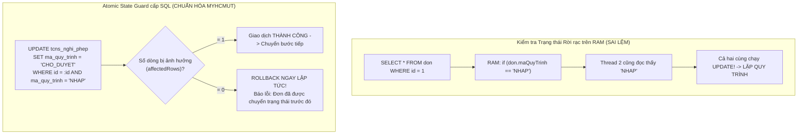

#### Nguyên lý Hiện thực Hóa Chuẩn xác trong MyHCMUT:
Hệ thống kết hợp kiểm tra trạng thái nguyên tử trực tiếp trong câu lệnh cập nhật CSDL (CLM-CON-02):
```sql
UPDATE tcns_nghi_phep 
SET ma_quy_trinh = :nextStatus, thoi_gian_gui = NOW() 
WHERE id = :id AND ma_quy_trinh = 'NHAP';
```
Hệ quản trị CSDL bảo đảm việc kiểm tra điều kiện `WHERE` và thao tác ghi `UPDATE` diễn ra nguyên tử tuyệt đối trên một dòng dữ liệu. Nếu `affectedRows === 0`, server lập tức hủy bỏ giao dịch, ngăn chặn triệt để mọi hành vi chuyển trạng thái trùng lặp.

---

## 2.4. XÁC THỰC VÀ AN TOÀN THÔNG TIN PHÂN TÁN

### 2.4.1. Hệ thống Xác thực Tập trung (CAS) và Chuẩn OAuth 2.0 / OpenID Connect (OIDC)

Hạ tầng xác thực của Trường Đại học Bách khoa – ĐHQG-HCM là một hệ sinh thái phân tán đa giao thức:

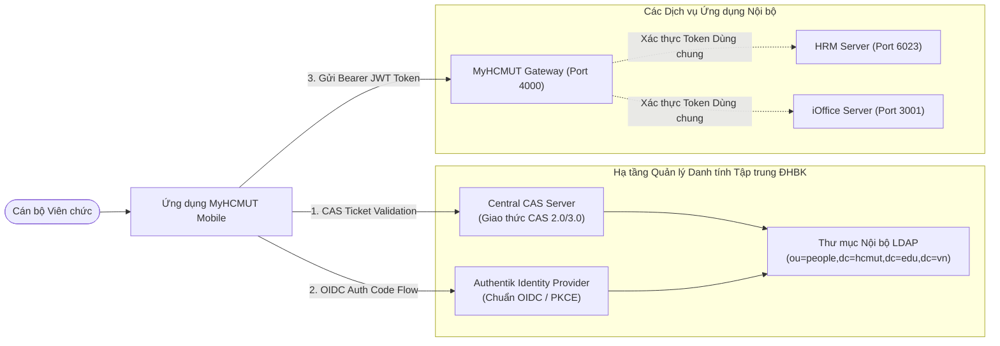

#### A. Giao thức Central Authentication Service (CAS Protocol)
- CAS là giao thức đăng nhập một lần (SSO) kinh điển của các trường đại học quốc tế (do JASIG phát triển).
- **Luồng hoạt động:** Khi người dùng chưa có phiên, ứng dụng chuyển hướng tới CAS Login URL. Người dùng nhập tài khoản/mật khẩu tại máy chủ CAS. Sau khi thành công, máy chủ CAS cấp một vé dịch vụ **Service Ticket (ST)** có thời gian sống ngắn (vài giây) trên URL chuyển hướng. Ứng dụng gửi ST này về backend để gọi tới endpoint `cas/serviceValidate` của máy chủ CAS xác thực và trích xuất mã định danh cán bộ (`cas:user`, `cas:hcmutPersonID`).

#### B. Chuẩn OpenID Connect (OIDC) và Giao thức PKCE (RFC 7636)
Đối với các ứng dụng di động bản địa (Native Mobile Apps), việc sử dụng luồng Authorization Code truyền thống tồn tại lỗ hổng bảo mật nghiêm trọng: Ứng dụng di động là một đối tượng **Khách công khai (Public Client)**, không thể lưu trữ an toàn bí mật ứng dụng (`client_secret`) trong mã nguồn cài đặt trên máy người dùng. Kẻ tấn công có thể can thiệp vào bộ định tuyến tùy chỉnh (Custom URL Scheme) để đánh cắp mã ủy quyền (Authorization Code).
- **Chuẩn RFC 7636 - Proof Key for Code Exchange (PKCE):**
  1. Ứng dụng di động tự sinh một chuỗi ngẫu nhiên bí mật có độ entropy cao gọi là `code_verifier` (43 đến 128 ký tự).
  2. Ứng dụng băm chuỗi này bằng thuật toán mật mã SHA-256 để tạo thành `code_challenge`:
     $$\text{code\_challenge} = \text{BASE64URL}(\text{SHA256}(\text{code\_verifier}))$$
  3. Ứng dụng gửi `code_challenge` cùng phương thức băm `code_challenge_method = S256` lên máy chủ xác thực Authentik trong yêu cầu ủy quyền ban đầu.
  4. Khi đổi mã lấy Token, ứng dụng gửi chuỗi `code_verifier` gốc. Máy chủ Authentik băm lại chuỗi này và đối chiếu với `code_challenge` ban đầu. Nếu trùng khớp, Token mới được cấp phát. Kẻ tấn công nếu có đánh cắp được Authorization Code trên URL cũng hoàn toàn bất lực vì không sở hữu chuỗi bí mật `code_verifier`.

#### C. Chuẩn Thẻ bài JSON Web Token (JWT - RFC 7519)
Hệ thống sử dụng JWT làm phương tiện định danh phi trạng thái (Stateless Credential) giữa Mobile và các Backend. Một chuỗi JWT gồm 3 phần phân tách bởi dấu chấm (`.`):
$$\text{JWT} = \text{Base64Url}(\text{Header}) \mathbin{\Vert} \text{"."} \mathbin{\Vert} \text{Base64Url}(\text{Payload}) \mathbin{\Vert} \text{"."} \mathbin{\Vert} \text{Base64Url}(\text{Signature})$$
- **Header:** Chứa loại thẻ (`"typ": "JWT"`) và thuật toán ký mã hóa (`"alg": "HS256"` hoặc `"RS256"`).
- **Payload:** Chứa các tuyên bố chuẩn (Registered Claims) như `sub` (chủ thể định danh), `iss` (đơn vị cấp phát), `exp` (thời điểm hết hạn), `iat` (thời điểm khởi tạo), cùng các trường định danh nhân sự nghiệp vụ (`shcc`, `roles`, `unitId`).
- **Signature:** Chữ ký số mật mã nhằm ngăn chặn mọi hành vi chỉnh sửa nội dung payload:
  $$\text{Signature} = \text{HMAC-SHA256}(\text{Header} \mathbin{\Vert} \text{"."} \mathbin{\Vert} \text{Payload}, \text{SecretKey})$$
- **Cơ chế Phân phối Dual-Token:** Hệ thống tách rời giữa **Access Token** ngắn hạn (thời hạn sống 15–60 phút, dùng cho mọi yêu cầu nghiệp vụ) và **Refresh Token** dài hạn (thời hạn sống 7–30 ngày, lưu trong bộ nhớ an toàn của thiết bị, chỉ dùng duy nhất để xin cấp lại Access Token mới khi hết hạn).

---

### 2.4.2. Cơ chế Chuyển tiếp Xác thực Một lần (One-Time Ticket SSO Bridge)

Một thách thức kiến trúc đặc thù của đề tài là việc tích hợp giữa **Ứng dụng Di động Native** và các **Biểu mẫu Quản trị Chuyên sâu** của hệ thống Web HRM hiện hữu (ví dụ: Biểu mẫu thẩm định cập nhật văn bằng chứng chỉ, giao diện so sánh sai lệch Diff Viewer phức tạp gồm hàng trăm trường nhập liệu):
- Các biểu mẫu này đã được đầu tư phát triển hoàn chỉnh trên nền tảng Web (`hrm-fe`), có logic thẩm định ràng buộc rất sâu sắc. Việc viết lại toàn bộ các biểu mẫu này dưới dạng widget Native trên di động trong thời gian ngắn là bất khả thi và gây lãng phí nguồn lực.
- Giải pháp tối ưu là tích hợp **In-App WebView** nhúng trực tiếp trang Web HRM vào trong ứng dụng di động.
- **Rào cản Kỹ thuật:** Ứng dụng di động xác thực qua Bearer JWT Token, trong khi ứng dụng Web HRM xác thực thông qua Session Cookie (`connect.sid`). Làm sao để cán bộ đang dùng Mobile có thể chuyển sang màn hình Web nhúng mà **không phải đăng nhập lại tài khoản/mật khẩu**, đồng thời **không để lộ lọt mã truy cập cá nhân**?

```mermaid
sequenceDiagram
    autonumber
    actor User as Cán bộ / Giảng viên
    participant Mobile as MyHCMUT Mobile<br/>(Bearer JWT Token)
    participant HRM_BE as Central SSO Issuer<br/>(hrm-be: fw_auth)
    participant Redis as Redis Cache<br/>(GETDEL Atomic Store)
    participant WebView as In-App WebView<br/>(flutter_inappwebview)
    participant HRM_FE as Web HRM Frontend<br/>(hrm-fe React App)

    User->>Mobile: Nhấp "Cập nhật Hồ sơ Văn bằng"
    Mobile->>HRM_BE: POST /api/auth/sso/issue-ticket (Bearer JWT)
    activate HRM_BE
    Note over HRM_BE: Kiểm tra JWT, sinh vé ngẫu nhiên 64 ký tự hex (crypto.randomBytes)
    HRM_BE->>Redis: SETEX sso_ticket:<ticket> 60 { userId, shcc } (TTL 60s)
    HRM_BE-->>Mobile: Trả về: { ticket: "a1f8...9c2b", targetUrl: "/profile/edit" }
    deactivate HRM_BE

    Mobile->>WebView: Khởi tạo WebView tải URL:<br/>https://hrm.hcmut.edu.vn/sso?ticket=a1f8...9c2b
    activate WebView
    WebView->>HRM_FE: Nạp tài nguyên giao diện Web
    HRM_FE->>HRM_BE: POST /api/auth/sso/consume-ticket (Gửi vé)
    activate HRM_BE
    
    HRM_BE->>Redis: client.getDel("sso_ticket:a1f8...9c2b")
    Note over HRM_BE,Redis: ĐỌC VÀ XÓA NGUYÊN TỬ (Tiêu thụ vé 1 lần duy nhất!)
    Redis-->>HRM_BE: Trả về thông tin phiên { userId, shcc }
    
    Note over HRM_BE: Khởi tạo Web Session & Ký Cookie connect.sid an toàn
    HRM_BE-->>HRM_FE: Set-Cookie: connect.sid=...; HttpOnly; SameSite=Lax; Secure
    deactivate HRM_BE
    
    HRM_FE->>HRM_FE: window.history.replaceState({}, '', targetUrl)
    Note over HRM_FE: BÓC TÁCH VÉ KHỎI THANH ĐỊA CHỈ TRÌNH DUYỆT
    HRM_FE-->>WebView: Hiển thị Biểu mẫu Sửa Lý Lịch hoàn tất đăng nhập!
    deactivate WebView
```

#### A. Rủi ro của các Cách tiếp cận Truyền thống
1. **Truyền trực tiếp JWT qua URL Query Parameter (`?token=...`):** Cực kỳ nguy hiểm. Chuỗi Token dài hạn sẽ bị lưu vết vĩnh viễn trong nhật ký truy cập máy chủ web (Nginx Access Log), máy chủ proxy trung gian, và lịch sử trình duyệt. Bất kỳ ai có quyền xem log đều có thể chiếm đoạt toàn bộ quyền hạn của cán bộ.
2. **Tiêm Cookie thủ công từ Mobile Client (Direct Cookie Injection):** Phức tạp, dễ phát sinh lỗi phân quyền domain giữa các nền tảng Android/iOS, và phá vỡ ranh giới bảo mật giữa môi trường Native và Web.

#### B. Thiết kế Giao thức Vé Dùng Một Lần (Opaque Bearer Ticket Protocol)
Hệ thống giải quyết bài toán bằng một giao thức cầu nối xác thực hai chặng an toàn tuyệt đối:
1. **Khởi tạo Vé ngẫu nhiên (Opaque Ticket Issuance):**
   - Ứng dụng di động gửi yêu cầu cấp vé tới máy chủ: `POST /api/auth/sso/issue-ticket`.
   - Máy chủ sinh một chuỗi ngẫu nhiên bí mật gồm 64 ký tự hex có độ entropy cao bằng hàm mật mã an toàn cấp hệ điều hành: `crypto.randomBytes(32).toString('hex')`.
   - Chuỗi vé này hoàn toàn là một định danh mờ (Opaque Identifier), không chứa bất kỳ thông tin nhân thân nào bên trong.
   - Máy chủ lưu cặp khóa-giá trị này vào bộ nhớ Redis với thời gian sống cực ngắn: **$\text{TTL} = 60\text{ giây}$** (`SETEX sso_ticket:<ticket> 60 <session_data>`).
2. **Tiêu thụ Nguyên tử qua Lệnh Redis `GETDEL` (Atomic One-Time Consumption):**
   - WebView nạp URL chuyển tiếp mang theo vé.
   - Tầng Web Frontend gọi API `POST /api/auth/sso/consume-ticket` để đổi vé lấy phiên làm việc.
   - Máy chủ Backend thực thi lệnh **`client.getDel(ticketKey)`** của Redis 7.x:
     - Thao tác đọc dữ liệu và xóa khóa diễn ra **nguyên tử tuyệt đối (Atomic Operation)** trong một chu kỳ xung nhịp Redis.
     - Ngay sau khi được đọc thành công, chiếc vé lập tức biến mất vĩnh viễn khỏi bộ nhớ Redis.
     - Nếu có một kẻ tấn công nào cố tình gửi lại chiếc vé đó lần thứ hai (Replay Attack), Redis sẽ trả về `nil` và máy chủ từ chối xác thực ngay lập tức.
3. **Thiết lập Phiên Cookie Cứng cáp (Cookie Hardening):**
   - Sau khi xác nhận vé hợp lệ, máy chủ khởi tạo một phiên làm việc chuẩn trên Web và phản hồi qua tiêu đề `Set-Cookie`:
     - Cờ **`HttpOnly`**: Ngăn chặn hoàn toàn việc mã độc JavaScript trên trang web truy cập vào chuỗi cookie thông qua lệnh `document.cookie` (Miễn nhiễm với tấn công XSS đánh cắp phiên).
     - Cờ **`SameSite=Lax`**: Bảo vệ ứng dụng khỏi các cuộc tấn công giả mạo yêu cầu từ trang web khác (Cross-Site Request Forgery - CSRF).
     - Cờ **`Secure`**: Bắt buộc chỉ truyền cookie qua kênh mã hóa HTTPS bảo mật.
4. **Làm sạch Thanh Địa chỉ (URL Stripping):**
   - Ngay sau khi đổi cookie thành công, mã nguồn Frontend thực thi lệnh:
     ```javascript
     window.history.replaceState({}, document.title, targetUrl);
     ```
   - Xóa bỏ hoàn toàn tham số `?ticket=...` khỏi URL của WebView, triệt tiêu nguy cơ lưu vết vé trong lịch sử duyệt web hoặc bị lộ khi người dùng chia sẻ liên kết.

#### Ranh giới Bảo mật Thực tế (Claim Boundary CLM-SSO-01 & CLM-SSO-03):
- Giao thức vé dùng một lần kết hợp lệnh Redis `GETDEL` bảo đảm việc chuyển đổi xác thực an toàn trong điều kiện thông thường.
- Tuy nhiên, về mặt lý thuyết, chiếc vé này vẫn là một **Chứng thư Người mang (Bearer Credential)** trong khoảng thời gian hiệu lực 60 giây. Nếu thiết bị của người dùng đã bị cài mã độc gián điệp cấp root có khả năng giám sát mạng nội bộ và gửi vé lên máy chủ trước khi WebView hợp lệ kịp nạp, kẻ đó có thể sở hữu phiên web hợp lệ.
- Hệ thống hiện tại chưa hỗ trợ cơ chế ràng buộc mật mã người sở hữu (Proof-of-Possession Nonce Binding) và chưa có kênh thu hồi phiên tức thời từ máy chủ (Backchannel Revocation) khi phát hiện dấu hiệu bất thường. Các giải pháp nâng cao này được định vị là thiết kế nghiên cứu nâng cấp tại Chương 7.

---

### 2.4.3. An toàn Cầu nối Giao tiếp JavaScript Bridge và Mô hình Đe dọa STRIDE

#### A. Kiến trúc Cầu nối JavaScript Bridge
Để ứng dụng di động nhận biết được khi nào cán bộ đã hoàn tất việc cập nhật hồ sơ trên trang Web nhúng nhằm làm mới bộ nhớ đệm (Cache Invalidation) trên giao diện Native, hệ thống thiết lập một kênh giao tiếp hai chiều **JavaScript Bridge** giữa mã JavaScript của WebView và mã Dart của Flutter:

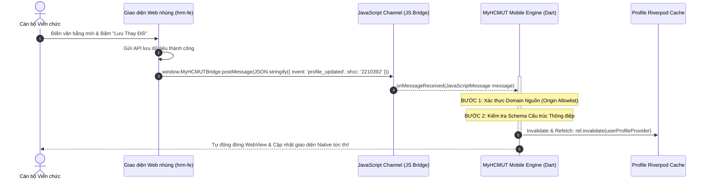

#### B. Phân tích Mô hình Đe dọa STRIDE và các Giải pháp Phòng thủ Toàn diện

Mô hình **STRIDE** (do Microsoft phát triển) là một phương pháp luận chuẩn mực trong kỹ thuật an toàn thông tin nhằm phân tích toàn diện các mối đe dọa an ninh mạng đối với một hệ thống phần mềm:

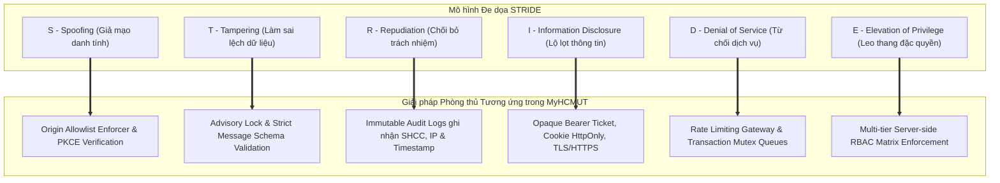

---

### Bảng 2.4: Ma trận Phân tích Mô hình Đe dọa STRIDE và Biện pháp Giảm thiểu trong Hệ thống MyHCMUT

| Nguy cơ Đe dọa (STRIDE Category) | Kịch bản Tấn công Cụ thể trong Hệ thống | Hậu quả Nghiệp vụ Tiềm tàng | Giải pháp Kỹ thuật và Biện pháp Giảm thiểu Đã Triển khai |
| :--- | :--- | :--- | :--- |
| **1. Spoofing<br/>(Giả mạo Danh tính)** | Kẻ tấn công mở một trang web độc hại bên trong WebView hoặc chuyển hướng WebView tới một tên miền lừa đảo (Phishing). | Chiếm quyền điều khiển luồng JavaScript Bridge, mạo danh cán bộ gửi các sự kiện giả mạo về Mobile. | **Thực thi Danh sách Trắng Tên miền Nghiêm ngặt (Strict Domain Allowlist Enforcer):** WebView chỉ chấp nhận nạp URL từ danh sách tên miền được phê duyệt (`hcmut.edu.vn`). Mọi tin nhắn Bridge đều kiểm tra nguồn gốc `event.origin` trước khi xử lý. |
| **2. Tampering<br/>(Làm sai lệch Dữ liệu)** | Người dùng chỉnh sửa gói tin HTTP gửi lên máy chủ để nộp đơn nghỉ phép trùng lịch hoặc cố tình gửi duyệt nhiều lần đồng thời. | Dữ liệu lịch cá nhân bị trùng lặp, quy trình duyệt bị nhảy bước sai lệch. | **Khóa Tương tranh Advisory Lock & Kiểm tra Điều kiện Nguyên tử:** Bọc toàn bộ luồng ghi trong Transaction CSDL có khóa `pg_advisory_xact_lock` theo SHCC và bảo vệ bằng mệnh đề `WHERE ma_quy_trinh = 'NHAP'`. |
| **3. Repudiation<br/>(Chối bỏ Trách nhiệm)** | Cán bộ sau khi nộp đơn nghỉ phép hoặc lãnh đạo sau khi duyệt đơn tuyên bố rằng mình không hề thực hiện thao tác đó. | Tranh chấp hành chính trong quản lý nhân sự Nhà trường, không xác định được trách nhiệm cá nhân. | **Ghi nhận Nhật ký Kiểm toán Bất biến (Immutable Audit Logging):** Mọi thao tác chuyển trạng thái quy trình đều ghi nhận dòng lịch sử trong bảng `tcns_quy_trinh_history` gồm mã SHCC người thực hiện, thời điểm chính xác (microsecond) và địa chỉ IP kết nối. |
| **4. Information Disclosure<br/>(Tiết lộ Thông tin)** | Lộ lọt mã Access Token qua URL trình duyệt hoặc lộ lọt thông tin hồ sơ lý lịch lưu trữ cục bộ khi thiết bị di động bị đánh cắp. | Kẻ xấu có thể đánh cắp danh tính cán bộ, truy cập trái phép hồ sơ lương bổng và thông tin nhân thân bảo mật. | **Vé Opaque Ngắn hạn kết hợp Cookie HttpOnly:** Không truyền JWT trên URL. Trên thiết bị di động, cơ sở dữ liệu SQLite chỉ lưu danh mục tham chiếu chung, **tuyệt đối không lưu dữ liệu hồ sơ cá nhân nhạy cảm trên bộ nhớ cố định (CLM-DAT-01)**. |
| **5. Denial of Service<br/>(Từ chối Dịch vụ)** | Các luồng yêu cầu đồng thời tạo ra hiện tượng tắc nghẽn khóa CSDL (Deadlock) hoặc gửi dồn dập hàng nghìn yêu cầu nộp đơn cùng lúc. | Máy chủ cơ sở dữ liệu bị cạn kiệt kết nối (Connection Pool Exhaustion), ứng dụng di động bị treo và không thể phản hồi người dùng. | **Giao thức Chuẩn hóa Sắp xếp Khóa (Lock Sorting):** Sắp xếp thứ tự danh sách SHCC theo chuỗi tăng dần trước khi xin khóa để triệt tiêu Deadlock. Áp dụng giới hạn tần suất gọi API (Rate Limiting) tại tầng Nginx Reverse Proxy. |
| **6. Elevation of Privilege<br/>(Leo thang Đặc quyền)** | Một giảng viên thông thường sửa đổi tham số trên yêu cầu gửi tới API để tự phê duyệt đơn nghỉ phép của chính mình hoặc xem văn bản mật. | Phá vỡ toàn bộ kỷ cương hành chính và phân cấp quản lý của Trường ĐH Bách khoa. | **Thẩm định Phân quyền Đa tầng tại Máy chủ (Server-side RBAC Enforcement):** Máy chủ độc lập kiểm tra quyền hạn (`permissions`) và quyền sở hữu phiếu (`checkPhieuOwnership`) từ cơ sở dữ liệu, **tuyệt đối không tin cậy các tham số quyền gửi từ phía Mobile Client**. |

---

## 2.5. DANH MỤC TÀI LIỆU THAM KHẢO HỌC THUẬT VÀ TIÊU CHUẨN KỸ THUẬT

Chương này được xây dựng dựa trên sự đối chiếu và viện dẫn các tiêu chuẩn kỹ thuật quốc tế (RFC), các sách chuyên khảo kinh điển về hệ thống thông tin phân tán và cơ sở dữ liệu, cùng các tài liệu kiến trúc kỹ thuật chính thống:

1. **RFC 6749:** Hardt, D., Ed., *"The OAuth 2.0 Authorization Framework"*, Internet Engineering Task Force (IETF), RFC 6749, DOI: 10.17487/RFC6749, October 2012.  
   *(Cơ sở lý thuyết cho luồng phân quyền và ủy quyền truy cập hệ thống phân tán).*
2. **RFC 7519:** Jones, M., Bradley, J., and N. Sakimura, *"JSON Web Token (JWT)"*, Internet Engineering Task Force (IETF), RFC 7519, DOI: 10.17487/RFC7519, May 2015.  
   *(Cơ sở lý thuyết cho cấu trúc thẻ bài xác thực phi trạng thái giữa Mobile và Backend).*
3. **RFC 7636:** Sakimura, N., Ed., Bradley, J., and N. Agarwal, *"Proof Key for Code Exchange by OAuth Public Clients (PKCE)"*, Internet Engineering Task Force (IETF), RFC 7636, DOI: 10.17487/RFC7636, September 2015.  
   *(Cơ sở lý thuyết bảo vệ luồng xác thực OpenID Connect trên thiết bị di động công khai).*
4. **RFC 7230 – 7235:** Fielding, R., Ed., and J. Reschke, Ed., *"Hypertext Transfer Protocol (HTTP/1.1): Message Syntax, Routing, and Semantics"*, Internet Engineering Task Force (IETF), June 2014.  
   *(Cơ sở lý thuyết cho các phương thức truyền thông mạng và giao thức RESTful API).*
5. **Kleppmann, M. (2017):** *Designing Data-Intensive Applications: The Big Ideas Behind Reliable, Scalable, and Maintainable Systems*, O'Reilly Media, Inc., ISBN: 978-1449373320.  
   *(Cơ sở lý thuyết cho các cấp độ cô lập giao dịch, hiện tượng race condition, kiến trúc hướng sự kiện Kafka và các ngữ nghĩa chuyển phát phân tán).*
6. **Gray, J., & Reuter, A. (1992):** *Transaction Processing: Concepts and Techniques*, Morgan Kaufmann Publishers Inc., San Francisco, CA, USA, ISBN: 1-55860-190-2.  
   *(Tác phẩm kinh điển nền tảng cho lý thuyết giao dịch ACID và ranh giới quản lý tương tranh).*
7. **Fielding, R. T. (2000):** *Architectural Styles and the Design of Network-based Software Architectures*, Doctoral Dissertation, University of California, Irvine.  
   *(Nguồn gốc học thuật định nghĩa phong cách kiến trúc phần mềm REST).*
8. **Date, C. J. (2003):** *An Introduction to Database Systems*, 8th Edition, Addison-Wesley, ISBN: 978-0321197849.  
   *(Cơ sở lý thuyết về mô hình dữ liệu quan hệ, tính toàn vẹn và các dị thường trong tương tranh).*
9. **PostgreSQL Global Development Group (2026):** *PostgreSQL 14/15/16 Documentation: Chapter 13. Concurrency Control (Transaction Isolation & Explicit Locking - Advisory Locks)*, Official Online Manual.  
   *(Tài liệu kỹ thuật gốc về cơ chế hoạt động của MVCC và hàm khóa `pg_advisory_xact_lock`).*
10. **Google Developers (2026):** *Flutter Architectural Overview & The Impeller Rendering Engine*, Flutter Official Documentation, docs.flutter.dev.  
    *(Tài liệu kỹ thuật gốc về đường ống dựng hình 4 cây của Flutter và cơ chế AOT Shaders của Impeller).*
11. **Apache Software Foundation (2026):** *Apache Kafka Documentation: Kafka Raft (KRaft) Consensus Protocol and Event Streaming Architecture*, kafka.apache.org.  
    *(Tài liệu kỹ thuật gốc về giao thức đồng thuận KRaft và đặc tính phân vùng lưu vết thông điệp).*
12. **Apereo Foundation (2026):** *CAS Protocol Specification (v2.0 / v3.0)*, Jasig/Apereo CAS Project Documentation.  
    *(Tài liệu đặc tả chuẩn giao thức xác thực vé dịch vụ Central Authentication Service).*
13. **OpenID Foundation (2014):** *OpenID Connect Core 1.0 incorporating errata set 1*, openid.net/specs/openid-connect-core-1_0.html.  
    *(Đặc tả giao thức danh tính OIDC).*
14. **Howard, M., & LeBlanc, D. (2003):** *Writing Secure Code*, 2nd Edition, Microsoft Press, ISBN: 978-0735617223.  
    *(Nguồn gốc học thuật xây dựng Mô hình Phân tích Đe dọa An toàn Thông tin STRIDE).*
