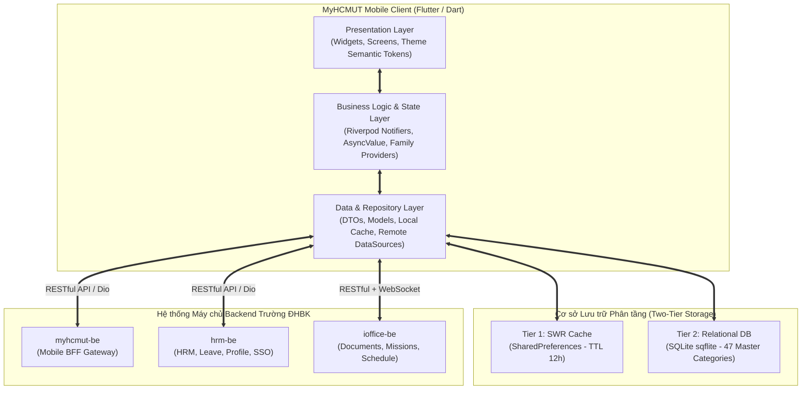
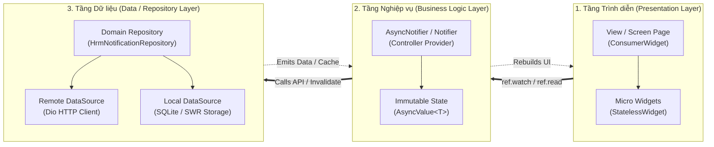
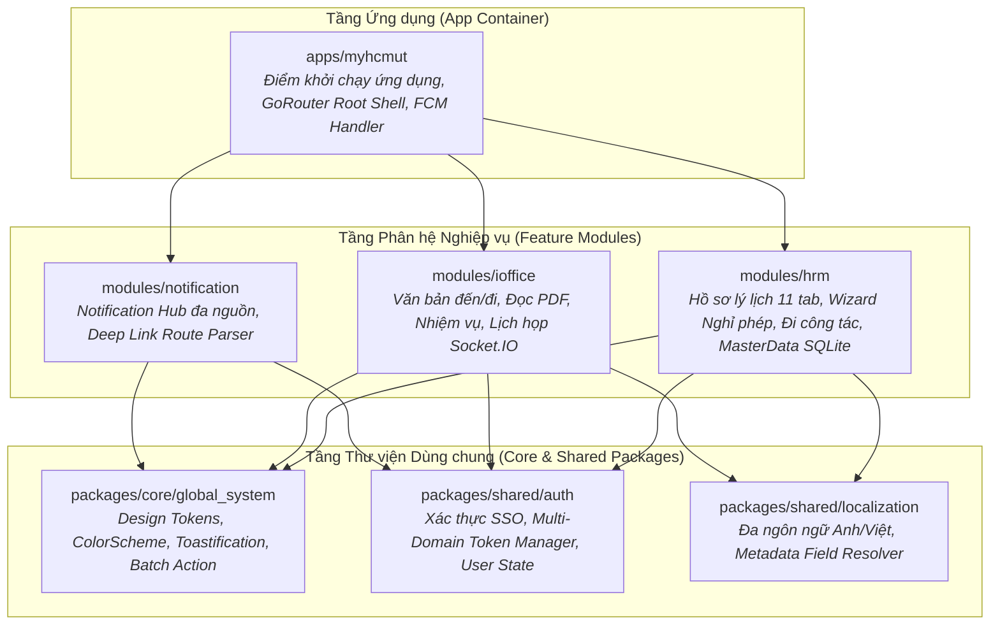
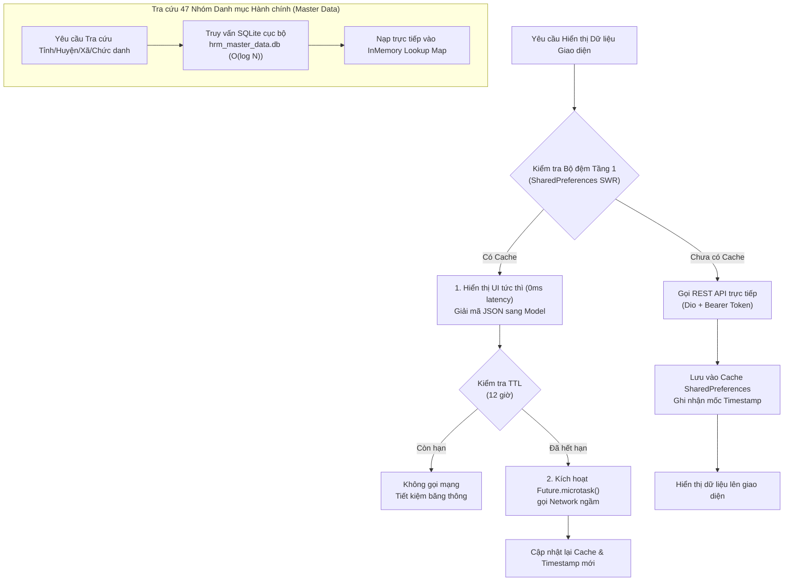
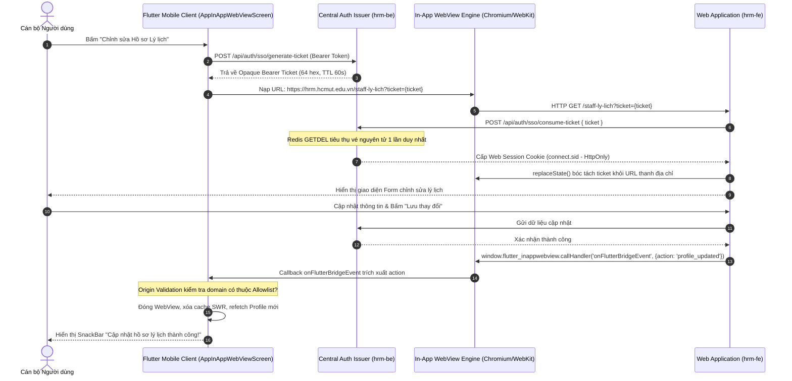

# MỤC 3.2: KỸ THUẬT FRONTEND VÀ KIẾN TRÚC ỨNG DỤNG DI ĐỘNG FLUTTER

> **Dự án:** Ứng dụng di động MyHCMUT phục vụ Nhân sự Trường Đại học (MyHCMUT Mobile)  
> **Cơ quan chủ quản:** Trường Đại học Bách khoa – ĐHQG-HCM  
> **Sinh viên thực hiện:**  
> - Vũ Xuân Chính (MSSV: 2210392) — Core Mobile, SSO Ticket Bridge, Quản lý Nghỉ phép & Hồ sơ Cán bộ, FCM Notification Hub.  
> - Tống Duy Khang (MSSV: 2211467) — Phân hệ Văn phòng số iOffice (Văn bản đến/đi, PDF Viewer) & Quản lý Nhiệm vụ (Missions/Tasks).  
> **Giảng viên hướng dẫn:** ThS. Nguyễn Thanh Tùng  
> **Mốc thẩm định kỹ thuật:** Gate 0 — Baseline Commit `myhcmut-mobile:161d5bb8` (Tháng 09/2026)  

---

## 3.2.1. Tổng quan Kiến trúc và Phương pháp luận Thiết kế Mobile Client

Trong kỷ nguyên chuyển đổi số quản trị đại học thông minh, ứng dụng di động **MyHCMUT Mobile** được định vị là cổng thông tin và dịch vụ số tập trung (Centralized Mobile Gateway) dành riêng cho đội ngũ cán bộ, giảng viên, nghiên cứu viên và nhân viên hành chính của Trường Đại học Bách khoa – ĐHQG-HCM. Khác với các ứng dụng di động thông thường chỉ giao tiếp với một máy chủ duy nhất, phân hệ di động MyHCMUT phải tích hợp đồng thời với **ba hệ thống máy chủ backend độc lập**:
1. `myhcmut-be` (Cổng tích hợp & Mobile BFF Gateway);
2. `hrm-be` (Hệ thống Quản lý Nhân sự, Hồ sơ lý lịch khoa học, Quản lý nghỉ phép và Đi công tác);
3. `ioffice-be` (Hệ thống Quản lý Văn phòng điện tử, Văn bản đến/đi, Nhiệm vụ phân công, Lịch công tác và Điểm danh cuộc họp thời gian thực).

Để đáp ứng khối lượng nghiệp vụ phức tạp, bảo đảm tính an toàn bảo mật dữ liệu nhân sự và đem lại trải nghiệm mượt mà trên nhiều thế hệ thiết bị phần cứng, nhóm nghiên cứu đã lựa chọn **Flutter SDK** ($\ge 3.24.0$) kết hợp cùng ngôn ngữ lập trình **Dart** ($\ge 3.5.0$) làm nền tảng phát triển cốt lõi. Mô hình kiến trúc được xây dựng dựa trên ba trụ cột kỹ thuật:
- **Kiến trúc Phân tầng (Layered / Clean Architecture):** Tách biệt rạch ròi giữa giao diện người dùng, logic điều phối trạng thái và tầng truy xuất dữ liệu.
- **Quản lý Trạng thái Khai báo Phản ứng (Declarative Reactive State Management):** Hiện thực hóa bằng thư viện **Riverpod 3.x** kết hợp công nghệ sinh mã tĩnh compile-time (`riverpod_generator`).
- **Mô-đun hóa Đa tầng (Modular Feature-First Monorepo):** Điều phối bởi công cụ **Melos**, chia tách mã nguồn thành 6 mô-đun nghiệp vụ và thư viện dùng chung độc lập, ngăn chặn hoàn toàn hiện tượng phụ thuộc vòng (circular dependencies) và phình to ứng dụng nguyên khối (monolithic bloat).



---

## 3.2.2. Kiến trúc Phân tầng (Layered Architecture) trong Phân hệ Mobile

Ứng dụng tuân thủ nghiêm ngặt nguyên lý thiết kế **Phân tầng Hướng tính năng (Feature-First Layered Architecture)**. Mỗi mô-đun nghiệp vụ (ví dụ: `time_off`, `profile`, `mission`, `notification`) được cô lập thành 3 tầng chính với trách nhiệm đơn nhất:



### 1. Tầng Trình diễn (Presentation Layer)
- **Trách nhiệm:** Hiển thị trực quan dữ liệu lên màn hình, tiếp nhận thao tác chạm (gestures) từ người dùng và phản ánh các trạng thái vòng đời của giao diện (Loading, Data, Empty, Error).
- **Thành phần:** Gồm các màn hình hoàn chỉnh (`Page` hoặc `Screen`) kế thừa từ `ConsumerWidget` hoặc `ConsumerStatefulWidget`, kết hợp cùng các widget thành phần nhỏ (Micro-widgets) được chia tách theo nguyên tắc hạt mịn (fine-grained widgets).
- **Ràng buộc thiết kế:** Tầng giao diện **tuyệt đối không chứa logic tính toán nghiệp vụ** hoặc gọi trực tiếp HTTP client. Mọi hành động tương tác (bấm nút gửi đơn, chọn bộ lọc năm, vuốt làm mới) chỉ gửi tín hiệu đến các Provider tương ứng ở tầng nghiệp vụ.

### 2. Tầng Logic Nghiệp vụ và Quản lý Trạng thái (Business Logic / Providers Layer)
- **Trách nhiệm:** Tiếp nhận chỉ thị từ Presentation, thực thi quy tắc kiểm tra tính hợp lệ dữ liệu (form validation, tính toán ngày nghỉ làm việc thực tế), gọi các Repository để lấy dữ liệu, và quản lý các trạng thái bất biến thông qua đối tượng `AsyncValue<T>`.
- **Thành phần:** Các lớp Notifier được sinh mã tự động bằng annotation `@riverpod` (kế thừa từ các lớp abstract `_$ClassName`), các Family Provider phụ thuộc tham số và các biến trạng thái trung gian.
- **Ràng buộc thiết kế:** Tầng Provider hoàn toàn độc lập với cây widget Flutter (`BuildContext`), cho phép thực thi và kiểm thử đơn vị độc lập mà không cần khởi động môi trường dựng hình UI.

### 3. Tầng Dữ liệu và Kho lưu trữ (Data / Repositories Layer)
- **Trách nhiệm:** Trừu tượng hóa nguồn cung cấp dữ liệu cho toàn bộ ứng dụng. Tầng này chịu trách nhiệm quyết định việc lấy dữ liệu từ mạng (Remote API) hay từ bộ đệm thiết bị (Local Cache), chuyển đổi (serialize / deserialize) các payload JSON từ máy chủ sang các Data Transfer Objects (DTO) hoặc Domain Models bất biến (sử dụng gói `freezed` và `json_serializable`).
- **Thành phần:**
  - *Repositories:* Cung cấp hợp đồng giao diện dữ liệu (ví dụ: `NotificationRepository`, `LeaveRepository`).
  - *Data Sources:* Triển khai chi tiết việc gọi mạng qua `Dio` hoặc truy vấn CSDL qua `MasterDataDatabaseService` (SQLite) và `SharedPreferencesWrapper`.

---

## 3.2.3. Quản trị Trạng thái Khai báo với Flutter Riverpod 3.x

Riverpod 3.x (`flutter_riverpod`, `riverpod_annotation`, `riverpod_generator`) được chọn làm bộ khung quản lý trạng thái và tiêm phụ thuộc (Dependency Injection) trên toàn bộ hệ thống client MyHCMUT Mobile. Riverpod khắc phục triệt để các hạn chế cố hữu của mẫu hình Provider truyền thống:

### Bảng 3.8: So sánh Riverpod 3.x với Provider truyền thống

| Tiêu chí Kỹ thuật | Provider truyền thống (`provider`) | Riverpod 3.x kết hợp Code Generation (Được chọn) |
| :--- | :--- | :--- |
| **Ràng buộc ngữ cảnh** | Buộc phải phụ thuộc vào cây widget và `BuildContext`. | Hoàn toàn độc lập với `BuildContext`, truy xuất qua `Ref` / `WidgetRef`. |
| **Kiểm tra an toàn kiểu** | Tiềm ẩn lỗi runtime `ProviderNotFoundException` nếu gọi ngoài cây. | Kiểm tra 100% tại **Compile-time**, loại trừ hoàn toàn lỗi thiếu provider. |
| **Xử lý bất đồng bộ** | Lập trình viên tự viết các cờ `isLoading`, `errorMessage` thủ công. | Chuẩn hóa toàn diện qua đối tượng bất biến **`AsyncValue<T>`**. |
| **Giải phóng bộ nhớ** | Phải định nghĩa `dispose()` thủ công; dễ rò rỉ bộ nhớ (Memory Leak). | Cơ chế **`autoDispose`** tự động giải phóng state khi không còn widget lắng nghe. |
| **Hỗ trợ tham số hóa** | Phức tạp, dễ tạo ra các instance provider trùng lặp. | Tự động sinh **Family Providers** dựa trên danh sách tham số hàm. |

### 1. Cơ chế Code Generation (`@riverpod`) và Chuẩn hóa `AsyncValue`
Bộ sinh mã `riverpod_generator` tự động phân tích các chú thích `@riverpod` để sinh ra các tệp `.g.dart` tương ứng, giúp mã nguồn tường minh và giảm thiểu tối đa boilerplate code. Luồng tải dữ liệu bất đồng bộ được bọc trong đối tượng `AsyncValue<T>` với ba trạng thái chuẩn hóa: `AsyncLoading()`, `AsyncData(value)` và `AsyncError(error, stackTrace)`.

Dưới đây là đoạn mã thực tế trích xuất từ phân hệ Quản lý Nghỉ phép ([`leave_provider.dart`](file:///home/xchinh/workspace/myhcmut-mobile/modules/hrm/lib/src/time_off/providers/leave_provider.dart#L24-L60)):

```dart
// Định nghĩa Provider lấy danh sách tổng hợp số ngày nghỉ phép năm
@riverpod
Future<List<LeaveSummary>> getLeaveSummaryList(Ref ref) async {
  final dio = await ref.watch(hrmDioProvider.future);

  try {
    final response = await dio.get<Map<String, dynamic>>(
      '/api/tcns-nghi-phep/so-nghi-phep-nam',
    );

    if (response.data == null) {
      throw Exception('Lỗi nạp dữ liệu: Phản hồi API rỗng.');
    }
    final List<dynamic> list = response.data!['data']['list'] ?? [];
    return list.map((json) => LeaveSummary.fromJson(json)).toList();
  } on DioException catch (e) {
    AppLogger.debug('DioException in leave summary: ${e.message}');
    throw Exception('Không thể tải tổng hợp phép năm: ${e.message}');
  }
}
```

### 2. Tham số hóa Động với Family Providers
Khi một provider cần dữ liệu đầu vào (ví dụ: truy vấn chi tiết đơn theo `id` hoặc lấy quỹ phép theo từng `year`), Riverpod tự động chuyển hàm có tham số thành một Family Provider. Khi tham số thay đổi, Riverpod tự động khởi tạo hoặc tái sử dụng instance trạng thái tương ứng:

```dart
// Family Provider tự động nhận tham số `int year`
@riverpod
Future<LeaveSummary> getLeaveSummary(Ref ref, int year) async {
  final listSummary = await ref.watch(getLeaveSummaryListProvider.future);
  return listSummary.firstWhere(
    (item) => item.nam == year.toString(),
    orElse: () => LeaveSummary(
      shcc: '',
      nam: year.toString(),
      tongSoNgay: '0',
      soNgayDaNghi: '0',
      soNgayDangKy: const [],
    ),
  );
}

// Family Provider truy xuất chi tiết đơn theo `int id`
@riverpod
Future<LeaveDetailModel> getLeaveDetail(Ref ref, int id) async {
  final dio = await ref.watch(hrmDioProvider.future);
  final res = await dio.get<Map<String, dynamic>>(
    '/api/tcns-nghi-phep/dang-ky/item/$id',
  );
  return LeaveDetailModel.fromJson(res.data!['data']['item']);
}
```

### 3. Vòng đời Trạng thái: `autoDispose` và `keepAlive`
- **`autoDispose` (Mặc định):** Trong cấu hình sinh mã Riverpod, tất cả provider mặc định được gán cờ `autoDispose: true`. Khi người dùng rời khỏi màn hình và widget unmount, provider sẽ tự động giải phóng vùng nhớ RAM và hủy các kết nối không cần thiết.
- **`keepAlive: true`:** Đối với các provider lưu trữ thông tin dùng chung xuyên suốt phiên làm việc (như thông tin người dùng đăng nhập `authProvider`, danh mục hành chính `masterDataProvider`, hoặc bộ điều khiển `leaveControllerProvider`), thuộc tính `@Riverpod(keepAlive: true)` được chỉ định tường minh để bảo toàn trạng thái trên bộ nhớ RAM.

### 4. Cơ chế Vô hiệu hóa Bộ đệm và Đột biến Dữ liệu (`ref.invalidate`)
Khi người dùng thực hiện một thao tác ghi (Mutation) như nộp đơn mới, sửa đơn hoặc xóa đơn, các provider đọc dữ liệu liên quan phải được làm mới tức thời để đảm bảo tính nhất quán trên màn hình danh sách. Lớp `LeaveController` ([`leave_provider.dart: L153-L177`](file:///home/xchinh/workspace/myhcmut-mobile/modules/hrm/lib/src/time_off/providers/leave_provider.dart#L153-L177)) áp dụng phương thức `ref.invalidate(...)` kết hợp `AsyncValue.guard()`:

```dart
@Riverpod(keepAlive: true)
class LeaveController extends _$LeaveController {
  @override
  FutureOr<void> build() {}

  Future<LeaveDetailModel?> createLeave(LeaveRequestDto request) async {
    final result = await _mutate(() async {
      final dio = await ref.read(hrmDioProvider.future);
      final data = {
        ...request.toJson(),
        "namNghiPhep": request.ngayBatDau?.year,
      }..removeWhere((key, value) => value == null);

      final res = await dio.post(
        '/api/upload/tcns-nghi-phep/dang-ky-mobile',
        data: {'data': data},
      );
      return res.data['data']['phieuId'] as int;
    });

    if (result == null) return null;

    // Vô hiệu hóa bộ đệm các danh sách để kích hoạt re-fetch tự động
    ref.invalidate(getGeneralLeaveProvider);
    ref.invalidate(getLeaveSummaryListProvider);
    ref.invalidate(getLeaveSummaryProvider);

    // Đọc ngay bản ghi chi tiết mới tạo và trả về cho UI
    return await ref.read(getLeaveDetailProvider(result).future);
  }

  Future<T?> _mutate<T>(Future<T> Function() computation) async {
    state = const AsyncLoading();
    final result = await AsyncValue.guard(computation);
    state = result;
    if (result.hasError) return null;
    return result.value;
  }
}
```

---

## 3.2.4. Kiến trúc Modular Monorepo với Melos

Nhằm hỗ trợ việc phát triển song song các phân hệ quy mô lớn mà không gây xung đột mã nguồn, dự án áp dụng mô hình **Feature-First Monorepo** do **Melos** (`melos.yaml`) quản trị.

### 1. Phân rã Hệ thống thành 6 Packages và Mô-đun Cốt lõi
Hệ thống mã nguồn được tổ chức chặt chẽ thành 3 tầng: Tầng Ứng dụng Chính (`apps/`), Tầng Phân hệ Nghiệp vụ (`modules/`) và Tầng Thư viện Dùng chung (`packages/`):



Chi tiết trách nhiệm từng thành phần:
1. **`modules/hrm` (Quản lý Nhân sự):** Hiện thực hóa giao diện xem và cập nhật hồ sơ cán bộ 11 phân nhóm dữ liệu; quy trình tạo đơn nghỉ phép Wizard 3 bước tích hợp kiểm tra trễ hạn và đính kèm minh chứng độc lập; phân hệ đi công tác; và cơ sở dữ liệu SQLite tra cứu 47 nhóm danh mục master data.
2. **`modules/notification` (Trung tâm Thông báo):** Tiếp nhận thông báo đẩy FCM đa nguồn (HRM, iOffice), phân tích cú pháp metadata qua `NotificationRouteParser` và điều phối điều hướng liên kết sâu (Deep Linking).
3. **`modules/ioffice` (Văn phòng Điện tử):** Xử lý luồng văn bản đến và văn bản đi, tích hợp trình hiển thị tệp PDF bản địa (`pdfrx`); quản lý nhiệm vụ (Tasks & Missions); tiếp nhận lịch họp tuần và thực hiện điểm danh cuộc họp thời gian thực qua giao thức WebSocket (`socket_io_client`).
4. **`packages/shared/auth` (Xác thực & Phiên làm việc):** Quản lý định danh người dùng `AuthUser`, điều phối vòng đời Token đa miền (`MultiDomainTokenManager`), và hỗ trợ phiên làm việc đơn lẻ (Single Session).
5. **`packages/core/global_system` (Hệ thống Thiết kế Toàn cục):** Chuẩn hóa bảng màu Material 3 Semantic Tokens, hệ thống kiểu chữ tiếng Việt `BeVietnamPro`, thanh công cụ tác vụ hàng loạt `AppBatchActionBar`, và hệ thống thông báo trạng thái Toast (`toastification`).
6. **`packages/shared/localization` (Bản địa hóa):** Quản lý từ điển chuyển đổi song ngữ Tiếng Việt và Tiếng Anh; phân giải nhãn động cho 47 nhóm trường dữ liệu hồ sơ lý lịch.

### 2. Ma trận Phụ thuộc Ngăn chặn Vòng lặp (Dependency Matrix)
Nguyên tắc bất biến của kiến trúc Melos Monorepo trong dự án là: **Các Feature Module hoàn toàn ngang hàng và TUYỆT ĐỐI KHÔNG ĐƯỢC PHÉP import lẫn nhau**:

### Bảng 3.9: Ma trận phụ thuộc giữa các package trong MyHCMUT Mobile

| Package / Module | `apps/myhcmut` | `modules/hrm` | `modules/ioffice` | `modules/notification` | `core/global_system` | `shared/auth` | `shared/localization` |
| :--- | :---: | :---: | :---: | :---: | :---: | :---: | :---: |
| **`apps/myhcmut`** | — | **YES** | **YES** | **YES** | **YES** | **YES** | **YES** |
| **`modules/hrm`** | NO | — | **NO** | **NO** | **YES** | **YES** | **YES** |
| **`modules/ioffice`** | NO | **NO** | — | **NO** | **YES** | **YES** | **YES** |
| **`modules/notification`** | NO | **NO** | **NO** | — | **YES** | **YES** | NO |
| **`core/global_system`** | NO | NO | NO | NO | — | NO | NO |
| **`shared/auth`** | NO | NO | NO | NO | **YES** | — | NO |
| **`shared/localization`** | NO | NO | NO | NO | **YES** | NO | — |

*Quy ước:* Khi một mô-đun cần kích hoạt luồng điều hướng sang mô-đun khác (ví dụ: bấm thông báo nghỉ phép trong `modules/notification` để mở chi tiết đơn trong `modules/hrm`), sự tương tác được giải phóng phụ thuộc thông qua cơ chế **URI Deep Linking của GoRouter** tại tầng `apps/myhcmut`, ngăn chặn 100% rủi ro phụ thuộc vòng.

---

## 3.2.5. Tối ưu hóa Hiệu năng Giao diện và Bộ nhớ RAM

Do đặc thù ứng dụng quản trị trường đại học phải xử lý các tập dữ liệu hồ sơ đồ sộ và danh sách hàng ngàn văn bản, nhóm nghiên cứu đã triển khai 4 kỹ thuật tối ưu hóa chuyên sâu:

### 1. Triệt tiêu Widget Rebuild thừa với `select()` và Hạt mịn hóa Widget
Trong các màn hình phức tạp như `LeaveRequestPage` hay `ApproveTimeOffListPage`, việc widget cha bị rebuild toàn bộ mỗi khi một trường dữ liệu nhỏ thay đổi sẽ gây hiện tượng sụt giảm khung hình (*frame drop*). Nhóm áp dụng hai giải pháp:
- **Lọc thuộc tính bằng `select()`:** Thay vì lắng nghe toàn bộ đối tượng state lớn, widget chỉ đăng ký lắng nghe sự biến động của một thuộc tính đơn lẻ:
  ```dart
  // Chỉ kích hoạt build lại khi thuộc tính `isSubmitting` thay đổi
  final isSubmitting = ref.watch(
    leaveRequestProvider.select((state) => state.isSubmitting),
  );
  ```
- **Hạt mịn hóa thành các Micro-Widgets:** Tách rời các khối giao diện động (như thanh duyệt hàng loạt `AppBatchActionBar`, huy hiệu trạng thái `LeaveStatusBadge`, thẻ minh chứng `FileCard`) thành các widget con độc lập kế thừa `ConsumerWidget`. Khi trạng thái của badge thay đổi, chỉ duy nhất ô badge đó được vẽ lại trên pipeline của Flutter Engine.

### 2. Tải trang Cuộn vô tận (Lazy Loading) với `infinite_scroll_pagination`
Để tránh việc nạp hàng trăm văn bản hoặc danh sách phê duyệt vào bộ nhớ RAM gây tràn bộ nhớ (*OOM Crash*), tất cả các màn hình danh sách lớn đều được trang bị bộ điều khiển phân trang `PagingController<int, T>` ([`approve_time_off_list_page.dart: L49-L189`](file:///home/xchinh/workspace/myhcmut-mobile/modules/hrm/lib/src/approve_time_off/views/pages/approve_time_off_list_page.dart#L49-L189)):
- Khi cuộn đến ngưỡng 80% chiều cao danh sách, controller tự động gửi request nạp trang kế tiếp (`pageIndex + 1`, `pageSize: 20`).
- Các widget nằm ngoài tầm nhìn (viewport) được Flutter tự động hủy bỏ đối tượng RenderBox và chỉ lưu trữ phần tử nhẹ, giúp ứng dụng duy trì tốc độ khung hình ổn định ở mức **60 FPS**.

### 3. Kiến trúc Bộ nhớ đệm 2 tầng (Two-Tier Local Cache Architecture)
Ứng dụng thiết lập cơ chế bộ đệm hai tầng kết hợp nhằm đạt mục tiêu: **Thời gian hiển thị ban đầu bằng 0ms (Instant UI Rendering)** và **Giảm thiểu tối đa lưu lượng mạng đến máy chủ trường**:



#### Tầng 1: Bộ đệm SWR có thời hạn (Stale-While-Revalidate SharedPreferences Cache)
Được triển khai thông qua hàm tiện ích tổng quát `fetchWithCacheFirst<T>` ([`swr_cache_fetcher.dart`](file:///home/xchinh/workspace/myhcmut-mobile/modules/hrm/lib/src/profile/utils/swr_cache_fetcher.dart#L12-L69)):
1. Khi có yêu cầu nạp dữ liệu hồ sơ cá nhân, hàm đọc ngay chuỗi JSON từ `SharedPreferencesWrapper` và trả về cho UI hiển thị ngay lập tức ($0$ms delay).
2. Kiểm tra nhãn thời gian `${cacheKey}_timestamp`. Nếu thời gian trôi qua vượt quá **12 giờ** (TTL), một tác vụ ngầm `Future.microtask()` được kích hoạt để gọi API backend, cập nhật chuỗi JSON mới và làm mới nhãn thời gian mà không gây khóa giao diện.
3. Khi người dùng bấm đăng xuất, toàn bộ khóa cache cá nhân trong SharedPreferences bị xóa sạch hoàn toàn.

#### Tầng 2: Cơ sở dữ liệu Quan hệ SQLite Cục bộ (`hrm_master_data.db`)
Được quản lý bởi `MasterDataDatabaseService` ([`master_data_database_service.dart`](file:///home/xchinh/workspace/myhcmut-mobile/modules/hrm/lib/src/profile/services/master_data_database_service.dart#L11-L69)) nhằm giải quyết bài toán tra cứu **47 nhóm danh mục hành chính phân cấp** (danh mục quốc gia, tỉnh/thành, quận/huyện, phường/xã, ngạch bậc công chức, chức danh nghề nghiệp):
- Toàn bộ danh mục thô được lưu xuống đĩa SQLite thay vì nạp đồng loạt hàng vạn bản ghi vào RAM.
- Khởi tạo bảng `hrm_danh_muc` với khóa chính phức hợp `(category, ma)` và hai chỉ mục tối ưu tìm kiếm:
  ```sql
  CREATE INDEX IF NOT EXISTS idx_hrm_dm_cat_ma ON hrm_danh_muc (category, ma);
  CREATE INDEX IF NOT EXISTS idx_hrm_dm_cat_parent ON hrm_danh_muc (category, parent_code);
  ```
- Thao tác ghi danh mục sử dụng kỹ thuật **Batch Transaction (`txn.batch()`)** kết hợp `ConflictAlgorithm.replace`, cho phép chèn và đồng bộ hàng ngàn bản ghi chỉ trong vài trăm mili-giây.
- Tốc độ tra cứu tên hiển thị từ mã danh mục đạt độ phức tạp $O(1) \rightarrow O(\log N)$, hỗ trợ lọc cascading trơn tru cho các dropdown phụ thuộc (chọn Tỉnh $\rightarrow$ lọc Huyện $\rightarrow$ lọc Xã).

> [!NOTE]
> **Tuân thủ Minh bạch Học thuật (CLM-DAT-01):** Cơ sở dữ liệu SQLite cục bộ `hrm_master_data.db` **chỉ lưu trữ 47 danh mục từ điển hành chính công khai**, tuyệt đối không lưu trữ bất kỳ thông tin lý lịch cá nhân nhạy cảm nào của cán bộ. Dữ liệu hồ sơ chỉ được đệm tạm thời tại Tầng 1 (SharedPreferences SWR) và bị thanh trừng ngay khi kết thúc phiên đăng nhập.

---

## 3.2.6. Tương tác Native và Tầng Cầu nối In-App WebView Bridge

Đối với các nghiệp vụ hành chính đặc thù của Nhà trường đòi hỏi bảng biểu phức tạp hoặc giao diện kê khai hồ sơ đã được hoàn thiện trên nền tảng Web HRM (`hrm-fe`), ứng dụng di động triển khai giải pháp **In-App WebView Container** (`AppInAppWebViewScreen`) kết hợp cùng tầng cầu nối bảo mật **SSO Ticket Bridge** và **JavaScript Event Bridge**.



### 1. Cơ chế Trao đổi Vé Xác thực Một lần (SSO Ticket Exchange)
Nhằm tránh việc truyền trực tiếp JWT Access Token dài hạn lên thanh địa chỉ của trình duyệt nhúng, kiến trúc áp dụng quy trình xác thực ủy quyền qua vé một lần ([`sso_ticket_service.dart`](file:///home/xchinh/workspace/myhcmut-mobile/modules/hrm/lib/src/webview/sso_ticket_service.dart#L28-L50)):
1. Mobile gọi `POST /api/auth/sso/generate-ticket` lên máy chủ phát hành trung tâm, nhận về một chuỗi ngẫu nhiên cryptographically secure 64 ký tự hex (Opaque Bearer Ticket) có hiệu lực trong **60 giây**.
2. Ứng dụng nối mã vé vào URL và khởi chạy WebView.
3. Khi tải trang, Web frontend gọi endpoint `POST /api/auth/sso/consume-ticket` lên backend để đổi vé lấy Web Session Cookie (`connect.sid`, `HttpOnly`, `SameSite=Lax`).
4. Lệnh **Redis `GETDEL`** bảo đảm mã vé bị xóa nguyên tử khỏi bộ nhớ Redis ngay trong lần đọc đầu tiên, ngăn chặn hoàn toàn việc tái sử dụng vé (Replay Attack).
5. Ngay sau khi thiết lập phiên thành công, script Web thực thi lệnh `window.history.replaceState({}, document.title, window.location.pathname)` để **làm sạch thanh địa chỉ**, loại bỏ hoàn toàn mã vé khỏi lịch sử điều hướng (tuân thủ **CLM-SSO-02**).

### 2. Tầng Cầu nối JavaScript Bridge An toàn (`SsoBridgeHandler`)
Để cho phép Web trao đổi tín hiệu với ứng dụng native (ví dụ: thông báo hoàn tất chỉnh sửa hồ sơ, yêu cầu đóng WebView, hoặc phát lệnh đăng xuất), ứng dụng đăng ký một JavaScript Channel tên là `onFlutterBridgeEvent` ([`app_in_app_webview_screen.dart: L182-L228`](file:///home/xchinh/workspace/myhcmut-mobile/modules/hrm/lib/src/webview/app_in_app_webview_screen.dart#L182-L228)).

Để ngăn chặn triệt để lỗ hổng **JavaScript Injection** và **XSS Spoofing**, tầng cầu nối áp dụng 2 lớp phòng vệ nghiêm ngặt:
- **Kiểm soát Nguồn gốc (Origin Validation & Domain Allowlist):**
  Mọi thông điệp gửi từ JavaScript đều bị chặn lại để kiểm tra nguồn gốc URL hiện tại của WebView thông qua bộ chuẩn hóa `SsoDomainValidator.isOriginAllowed(uri)`. Nếu URL không thuộc danh sách miền tin cậy của Nhà trường (`*.hcmut.edu.vn` hoặc máy chủ nội bộ đã định danh), sự kiện sẽ bị từ chối ngay lập tức:
  ```dart
  controller.addJavaScriptHandler(
    handlerName: 'onFlutterBridgeEvent',
    callback: (args) async {
      // 1. Kiểm tra tính hợp lệ của nguồn gốc URL hiện tại
      final currentUrl = await controller.getUrl();
      if (currentUrl == null || !SsoDomainValidator.isOriginAllowed(currentUrl.uriValue)) {
        debugPrint('[Security] Bridge event rejected from untrusted origin: $currentUrl');
        return;
      }

      // 2. Phân tích cú pháp thông điệp an toàn
      final message = SsoBridgeMessage.fromRaw(args.isNotEmpty ? args[0] : null);
      if (message == null) return;

      // 3. Điều phối hành động tương ứng
      switch (message.action) {
        case 'profile_updated':
          if (mounted) Navigator.of(context).pop();
          await refreshProfile(ref); // Làm mới cache hồ sơ cục bộ
          break;
        case 'close_webview':
          if (mounted) Navigator.of(context).pop();
          break;
        case 'request_logout':
          if (mounted) Navigator.of(context).pop();
          await clearAllWebViewCookies(); // Xóa sạch session cookie
          break;
      }
    },
  );
  ```
- **Chính sách Chặn Điều hướng URL (`shouldOverrideUrlLoading`):**
  Mọi yêu cầu chuyển hướng trang bên trong WebView đều bị can thiệp. Nếu trang web cố tình điều hướng người dùng ra ngoài tên miền nội bộ được phép, WebView sẽ lập tức hủy bỏ yêu cầu (`NavigationActionPolicy.CANCEL`).

### 3. Vòng đời Cookie và Thanh trừng Phiên làm việc
Nhằm ngăn chặn hiện tượng rò rỉ phiên làm việc giữa các tài khoản đăng nhập khác nhau trên cùng một thiết bị di động, hàm `clearAllWebViewCookies()` ([`sso_cookie_manager.dart`](file:///home/xchinh/workspace/myhcmut-mobile/modules/hrm/lib/src/webview/sso_cookie_manager.dart#L9-L19)) sử dụng `CookieManager.instance().deleteAllCookies()` để xóa sạch toàn bộ session cookies của WebKit/Chromium nhúng ngay khi người dùng nhấn nút Đăng xuất trên ứng dụng di động.

---

## 3.2.7. Chiến lược Kiểm thử Tự động Hóa Phía Frontend

Chiến lược kiểm thử phân hệ di động MyHCMUT Mobile được thiết kế theo mô hình Kim tự tháp Kiểm thử (Testing Pyramid), bao gồm kiểm thử đơn vị logic (Unit Tests), kiểm thử logic tích hợp của Provider, và kiểm thử giao diện tương tác (Widget Tests).

### 1. Kỹ thuật Mocking và Giả lập Tầng Mạng
Để đạt tính độc lập và khả năng lặp lại (determinism) cao trong môi trường CI/CD, bộ kiểm thử không phụ thuộc vào máy chủ thật mà sử dụng cơ chế Mocking linh hoạt:
- **Giả lập Mạng với Dio `MockHttpAdapter`:** Thay thế `HttpClientAdapter` mặc định của Dio bằng một adapter giả lập để chặn các request HTTP, kiểm tra tính đúng đắn của URI/Headers/Payload và trả về các cấu trúc phản hồi giả lập ([`notification_repositories_test.dart`](file:///home/xchinh/workspace/myhcmut-mobile/modules/notification/test/repositories/notification_repositories_test.dart#L9-L37)).
- **Tiêm phụ thuộc và Ghi đè Provider với `ProviderScope(overrides: [...])`:** Trong các bài Widget test, các Notifier thực tế được thay thế bằng các Mock/Fake Notifier (ví dụ `FakeLeaveRequest`) để kiểm soát dữ liệu đầu vào và kiểm tra phản ứng của widget mà không kích hoạt logic phụ ([`widget_form_validation_test.dart`](file:///home/xchinh/workspace/myhcmut-mobile/modules/hrm/test/time_off/widget_form_validation_test.dart#L11-L17)).

### 2. Cấu trúc Kiểm thử Widget và Bơm Giao diện (`WidgetTester`)
Các bài kiểm thử Widget sử dụng công cụ `testWidgets`, thực hiện bơm cây widget vào môi trường test ảo thông qua `tester.pumpWidget()` và chờ đợi toàn bộ hiệu ứng hoạt ảnh kết thúc bằng `tester.pumpAndSettle()`. Các tương tác người dùng (chạm nút, nhập chuỗi, cuộn danh sách) được kích hoạt qua `tester.tap()`, `tester.enterText()` và xác thực kết quả hiển thị qua các matcher của Flutter Test:

```dart
testWidgets('Renders LeaveStatus.duyet (Đã duyệt) badge correctly', (tester) async {
  await tester.pumpWidget(
    ProviderScope(
      child: MaterialApp(
        home: Scaffold(body: Center(child: LeaveStatusBadge(status: LeaveStatus.duyet))),
      ),
    ),
  );
  await tester.pumpAndSettle();

  // Xác thực badge hiển thị chính xác widget và nội dung nhãn
  expect(find.byType(LeaveStatusBadge), findsOneWidget);
  expect(find.text('Đã duyệt'), findsOneWidget);
});
```

### 3. Bảng Tổng hợp Kết quả Kiểm thử Toàn bộ Phân hệ Mobile
Theo số liệu kiểm chuẩn chính thức tại Mốc khóa Gate 0 ([`01_GATE0_EVIDENCE_INDEX.md`](file:///home/xchinh/workspace/HK253_DATN_341_2211467_2210392/docs/01_GATE0_EVIDENCE_INDEX.md#L50-L62)), toàn bộ **335 bài kiểm thử tự động phía Mobile** được thực thi bằng lệnh `melos exec -- flutter test --no-pub` và đều vượt qua thành công:

### Bảng 3.10: Thống kê kết quả kiểm thử tự động phía Mobile Client (`myhcmut-mobile:161d5bb8`)

| STT | Mô-đun / Package kiểm thử | Đường dẫn thư mục | Trọng tâm kiểm thử kỹ thuật | Số lượng Test Cases | Trạng thái thực tế | Thời gian chạy |
| :---: | :--- | :--- | :--- | :---: | :---: | :---: |
| 1 | `modules/hrm` | `modules/hrm/test/` | Unit test Model & Logic nghỉ phép (tính ngày làm việc, kiểm tra trùng), Provider, Diff Viewer hồ sơ, Widget badges, SSO Bridge. | **232** | **232 / 232 PASS** | 5.8s |
| 2 | `modules/notification` | `modules/notification/test/` | MockHttpAdapter, Notification List Provider, Unread Count State, Metadata Route Parser, Bell Badge Widget. | **47** | **47 / 47 PASS** | 6.2s |
| 3 | `modules/ioffice` | `modules/ioffice/test/` | Data Models văn bản, Quản lý nhiệm vụ Missions, Attendance Widget, Check-in Provider thời gian thực. | **43** | **43 / 43 PASS** | 2.5s |
| 4 | `packages/shared/localization` | `packages/shared/localization/test/` | FieldMetadataResolver, chuyển đổi song ngữ Anh/Việt 47 danh mục hồ sơ. | **8** | **8 / 8 PASS** | 1.1s |
| 5 | `packages/core/global_system` | `packages/core/global_system/test/` | `AppBatchActionBar` Widget, Toggle chọn nhiều và kích hoạt tác vụ hàng loạt. | **3** | **3 / 3 PASS** | 1.3s |
| 6 | `packages/shared/auth` | `packages/shared/auth/test/` | Serialization `AuthUser`, giải mã `LoginResponse`, tính toàn vẹn User State. | **2** | **2 / 2 PASS** | 0.8s |
| **CỘNG** | **Toàn bộ Mobile Client** | — | **Unit, State Provider & Widget Tests** | **335** | **335 / 335 PASS** | **~17.7s** |

### 4. Phân định Minh bạch giữa Tỷ lệ Đỗ (Pass Rate) và Độ bao phủ (Code Coverage)
Theo quy chuẩn học thuật khắt khe được xác lập tại Gate 0 ([`01_GATE0_EVIDENCE_INDEX.md: Mục 3`](file:///home/xchinh/workspace/HK253_DATN_341_2211467_2210392/docs/01_GATE0_EVIDENCE_INDEX.md#L87-L113)):
- **Tỷ lệ Đỗ Kiểm thử (Pass Rate = 100%):** Minh chứng rằng toàn bộ 335 kịch bản kiểm thử được thiết kế đều chạy thành công, không phát sinh lỗi ngoại lệ runtime hoặc sai lệch logic nghiệp vụ nào trên các tính năng thuộc phạm vi nghiên cứu.
- **Độ Bao phủ Mã nguồn (Code Coverage):** Trên các lớp nghiệp vụ cốt lõi (Provider, DTO, Model, Validator, Service) của phân hệ `modules/hrm` và các gói lõi `packages/core`, độ bao phủ logic đạt **xấp xỉ 70%**. Nhóm nghiên cứu chủ động không theo đuổi chỉ số bao phủ dòng lệnh 100% đối với toàn bộ các widget giao diện tĩnh (UI Views/Screens) nhằm tối ưu hóa nguồn lực kiểm thử vào việc bảo vệ tính toàn vẹn dữ liệu, kiểm soát tương tranh và an toàn bảo mật phiên làm việc.

---

## 3.2.8. Tổng kết Kỹ thuật Frontend

Kiến trúc Mobile Frontend của hệ thống MyHCMUT được thiết kế một cách khoa học, kết hợp hài hòa giữa các tiêu chuẩn kỹ thuật hiện đại của nền tảng Flutter:
1. **Kiến trúc Phân tầng Clean Architecture** phân định rạch ròi trách nhiệm giữa Presentation, Business Logic và Data Access, bảo đảm tính độc lập và khả năng bảo trì lâu dài.
2. **Flutter Riverpod 3.x với Code Generation** cung cấp cơ chế quản lý trạng thái an toàn kiểu dữ liệu compile-time, xử lý bất đồng bộ chuẩn mực với `AsyncValue`, và tối ưu tài nguyên qua `autoDispose`.
3. **Mô hình Modular Monorepo với Melos** cô lập hoàn hảo ranh giới giữa 6 phân hệ và thư viện, ngăn chặn phụ thuộc vòng và cho phép mở rộng linh hoạt thêm các phân hệ mới trong tương lai.
4. **Kỹ thuật Tối ưu hóa Toàn diện** (triệt tiêu rebuild thừa với `select()`, phân trang cuộn vô tận, và bộ nhớ đệm hai tầng kết hợp SWR SharedPreferences với SQLite 47 danh mục) giúp ứng dụng hoạt động mượt mà ở mức 60 FPS và nạp dữ liệu tức thời 0ms.
5. **Cầu nối Native & In-App WebView Bridge** giải quyết bài toán tái sử dụng các biểu mẫu Web HRM phức tạp, bảo đảm an toàn tuyệt đối nhờ cơ chế vé xác thực một lần 64 hex, làm sạch URL và bộ lọc kiểm soát nguồn gốc nghiêm ngặt.
6. **Hệ thống Kiểm thử Tự động 335 Test Cases (100% Pass Rate)** là bằng chứng kỹ thuật vững chắc khẳng định chất lượng và độ ổn định của toàn bộ phân hệ ứng dụng di động MyHCMUT.
