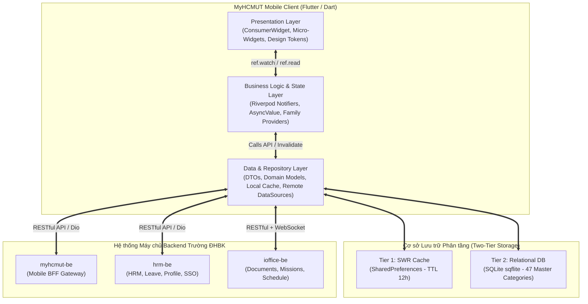
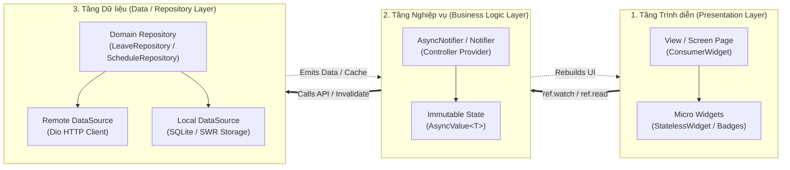
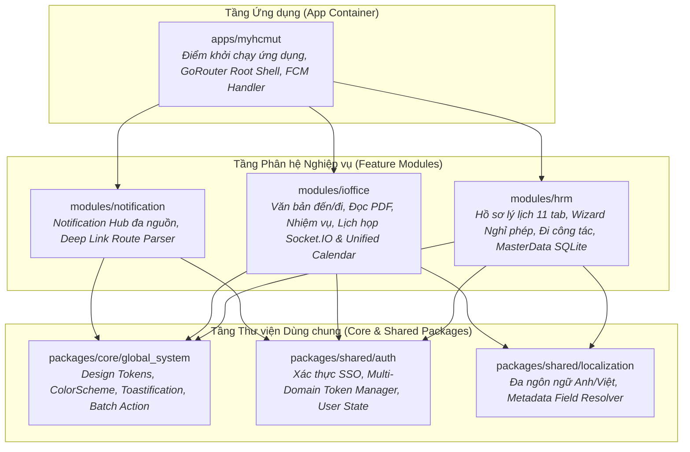
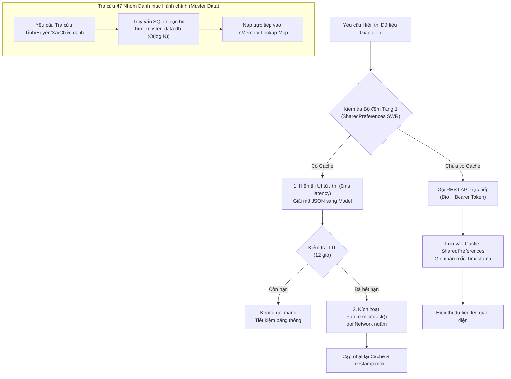
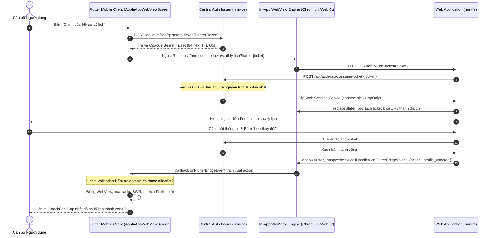
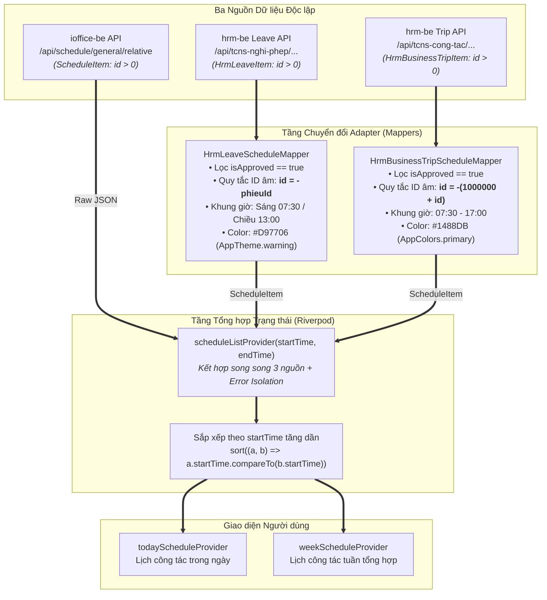

# MỤC 3.2: KỸ THUẬT FRONTEND VÀ KIẾN TRÚC ỨNG DỤNG DI ĐỘNG FLUTTER

> **Dự án:** Ứng dụng di động MyHCMUT phục vụ Nhân sự Trường Đại học (MyHCMUT Mobile)  
> **Cơ quan chủ quản:** Trường Đại học Bách khoa – ĐHQG-HCM  
> **Sinh viên thực hiện:**  
> - Vũ Xuân Chính (MSSV: 2210392) — Core Mobile, SSO Ticket Bridge, Quản lý Nghỉ phép & Hồ sơ Cán bộ, FCM Notification Hub, Tích hợp Lịch đa phân hệ.  
> - Tống Duy Khang (MSSV: 2211467) — Phân hệ Văn phòng số iOffice (Văn bản đến/đi, PDF Viewer), Quản lý Nhiệm vụ (Missions/Tasks) & Lịch họp tuần.  
> **Giảng viên hướng dẫn:** ThS. Nguyễn Thanh Tùng  
> **Mốc thẩm định kỹ thuật:** Gate 0 — Baseline Commit `myhcmut-mobile:4fe5d9c` (Tháng 09/2026)  

---

## 3.2.1. Nền tảng Phát triển Ứng dụng Di động: Flutter và Dart

### 1. Bối cảnh và Thách thức Tích hợp Hệ thống
Trong kỷ nguyên chuyển đổi số quản trị đại học thông minh, ứng dụng di động **MyHCMUT Mobile** được định vị là cổng thông tin và dịch vụ số tập trung (Centralized Mobile Gateway) dành riêng cho đội ngũ cán bộ, giảng viên, nghiên cứu viên và nhân viên hành chính của Trường Đại học Bách khoa – ĐHQG-HCM. Khác với các ứng dụng di động thông thường chỉ giao tiếp với một máy chủ duy nhất, phân hệ di động MyHCMUT phải tích hợp đồng thời với **ba hệ thống máy chủ backend độc lập**:
1. `myhcmut-be` (Cổng tích hợp & Mobile BFF Gateway);
2. `hrm-be` (Hệ thống Quản lý Nhân sự, Hồ sơ lý lịch khoa học, Quản lý nghỉ phép và Đi công tác);
3. `ioffice-be` (Hệ thống Quản lý Văn phòng điện tử, Văn bản đến/đi, Nhiệm vụ phân công, Lịch công tác và Điểm danh cuộc họp thời gian thực).

Để đáp ứng khối lượng nghiệp vụ phức tạp, bảo đảm tính an toàn bảo mật dữ liệu nhân sự và đem lại trải nghiệm mượt mà trên nhiều thế hệ thiết bị phần cứng, nhóm nghiên cứu đã lựa chọn **Flutter SDK** ($\ge 3.24.0$) kết hợp cùng ngôn ngữ lập trình **Dart** ($\ge 3.5.0$) làm nền tảng phát triển cốt lõi.

### 2. So sánh Các Nền tảng Phát triển Ứng dụng Di động
So với việc phát triển riêng biệt hai ứng dụng bản địa (Native iOS bằng Swift và Native Android bằng Kotlin), hoặc sử dụng các giải pháp đa nền tảng dựa trên cầu nối JavaScript như React Native, Flutter đem lại lợi thế vượt trội về hiệu năng dựng hình và khả năng tái sử dụng mã nguồn. Bảng 3.7 đối chiếu chi tiết ba cách tiếp cận phát triển di động phổ biến hiện nay:

### Bảng 3.7: So sánh các framework phát triển ứng dụng di động

| Tiêu chí So sánh | Native (Kotlin / Swift) | React Native | Flutter (Được lựa chọn) |
| :--- | :--- | :--- | :--- |
| **Mã nguồn đa nền tảng** | Riêng biệt cho từng nền tảng (Android / iOS) | Dùng chung phần lớn ($\approx 80\%$) | **Dùng chung phần lớn ($\ge 95\%$)** |
| **Ngôn ngữ lập trình** | Kotlin (Android) / Swift (iOS) | JavaScript / TypeScript | **Dart (Sound Null Safety, AOT Compilation)** |
| **Mô hình giao diện (UI Model)** | Native Components bản địa của OS | Native Components thông qua JS Bridge / JSI | **Cây Widget độc lập, tự dựng hình qua Impeller/Skia** |
| **Hiệu năng dựng hình** | Tối đa (Bản địa 60–120 FPS) | Phụ thuộc chi phí serialize cầu nối JS | **Mượt mà 60 FPS, không qua tầng trung gian** |
| **Tích hợp nền tảng** | Trực tiếp không qua tầng trừu tượng | Native Modules / TurboModules | **Plugin / Platform Channel / FFI** |
| **Thời gian phát triển (TTM)** | Kéo dài (Gấp đôi nhân lực và chi phí) | Trung bình | **Nhanh chóng (Single codebase, Hot Reload/Restart)** |

Nhóm nghiên cứu quyết định lựa chọn **Flutter** vì đáp ứng trọn vẹn yêu cầu phát triển ứng dụng đa nền tảng chất lượng cao cho Nhà trường, sở hữu hệ sinh thái thư viện hoàn thiện phù hợp với các nghiệp vụ chuyên sâu của MyHCMUT Mobile: giao tiếp mạng HTTP đa máy chủ, trung tâm thông báo đẩy FCM, điều hướng phân cấp GoRouter, hiển thị tệp PDF bản địa (`pdfrx`), và tích hợp trình duyệt nhúng In-App WebView kết hợp cầu nối JavaScript Bridge hai chiều.

### 3. Đặc tính Ngôn ngữ Dart: Sound Null Safety và Xử lý Bất đồng bộ Concurrency
Ngôn ngữ lập trình Dart cung cấp nền tảng vững chắc cho các ứng dụng quy mô doanh nghiệp nhờ hai đặc tính kỹ thuật quan trọng:
- **Sound Null Safety (An toàn Kiểu Tuyệt đối):** Dart phân tách rạch ròi giữa kiểu dữ liệu có thể nhận giá trị `null` (`T?`) và không thể nhận `null` (`T`). Hệ thống kiểm tra kiểu tĩnh (Static Type System) phát hiện và chặn đứng mọi lỗi tiềm ẩn tại thời điểm biên dịch (*compile-time*), triệt tiêu hoàn toàn nhóm lỗi sập ứng dụng kinh điển `NullPointerException` trong môi trường vận hành thực tế.
- **Mô hình Concurrency và Xử lý Bất đồng bộ (Event Loop & Isolates):** Dart thực thi đơn luồng theo mô hình vòng lặp sự kiện (Event Loop) bao gồm hai hàng đợi ưu tiên: *Microtask Queue* và *Event Queue*. Các cấu trúc `Future`, `Stream`, cùng cú pháp `async` / `await` cho phép xử lý mượt mà hàng trăm tác vụ mạng và truy vấn CSDL bất đồng bộ mà không bao giờ gây khóa luồng giao diện chính (UI Thread). Đối với các tác vụ giải mã JSON kích thước lớn hoặc xử lý ảnh tệp đính kèm, ứng dụng sử dụng cơ chế `Isolate` để đưa tác vụ tính toán nặng sang các luồng CPU độc lập với vùng nhớ riêng biệt.

---

## 3.2.2. Kiến trúc Phân tầng (Layered Architecture) trong Phân hệ Mobile

Ứng dụng tuân thủ nghiêm ngặt nguyên lý thiết kế **Phân tầng Hướng tính năng (Feature-First Layered Architecture)**. Mỗi mô-đun nghiệp vụ (ví dụ: `time_off`, `profile`, `mission`, `notification`, `schedule`) được cô lập thành 3 tầng chính với trách nhiệm đơn nhất:


```mermaid
flowchart TD
    subgraph ClientApp["MyHCMUT Mobile Client (Flutter / Dart)"]
        UI["Presentation Layer<br/>(ConsumerWidget, Micro-Widgets, Design Tokens)"]
        BL["Business Logic & State Layer<br/>(Riverpod Notifiers, AsyncValue, Family Providers)"]
        DL["Data & Repository Layer<br/>(DTOs, Domain Models, Local Cache, Remote DataSources)"]
        UI <==>|ref.watch / ref.read| BL
        BL <==>|Calls API / Invalidate| DL
    end

    subgraph DataStorage["Cơ sở Lưu trữ Phân tầng (Two-Tier Storage)"]
        SWR["Tier 1: SWR Cache<br/>(SharedPreferences - TTL 12h)"]
        SQLiteDB["Tier 2: Relational DB<br/>(SQLite sqflite - 47 Master Categories)"]
    end

    subgraph ExternalBackends["Hệ thống Máy chủ Backend Trường ĐHBK"]
        BFF["myhcmut-be<br/>(Mobile BFF Gateway)"]
        HRM["hrm-be<br/>(HRM, Leave, Profile, SSO)"]
        IOFFICE["ioffice-be<br/>(Documents, Missions, Schedule)"]
    end

    DL <==> SWR
    DL <==> SQLiteDB
    DL <==>|RESTful API / Dio| BFF
    DL <==>|RESTful API / Dio| HRM
    DL <==>|RESTful + WebSocket| IOFFICE
```


```mermaid
flowchart LR
    subgraph Layer1["1. Tầng Trình diễn (Presentation Layer)"]
        Page["View / Screen Page<br/>(ConsumerWidget)"]
        LocalWidget["Micro Widgets<br/>(StatelessWidget / Badges)"]
        Page --> LocalWidget
    end

    subgraph Layer2["2. Tầng Nghiệp vụ (Business Logic Layer)"]
        Notifier["AsyncNotifier / Notifier<br/>(Controller Provider)"]
        StateHolder["Immutable State<br/>(AsyncValue&lt;T&gt;)"]
        Notifier --> StateHolder
    end

    subgraph Layer3["3. Tầng Dữ liệu (Data / Repository Layer)"]
        Repo["Domain Repository<br/>(LeaveRepository / ScheduleRepository)"]
        RemoteSource["Remote DataSource<br/>(Dio HTTP Client)"]
        LocalSource["Local DataSource<br/>(SQLite / SWR Storage)"]
        Repo --> RemoteSource
        Repo --> LocalSource
    end

    Layer1 ==>|ref.watch / ref.read| Layer2
    Layer2 ==>|Calls API / Invalidate| Layer3
    Layer3 -.->|Emits Data / Cache| Layer2
    Layer2 -.->|Rebuilds UI| Layer1
```

### 1. Tầng Trình diễn (Presentation Layer)
- **Trách nhiệm:** Hiển thị trực quan dữ liệu lên màn hình, tiếp nhận thao tác chạm (gestures) từ người dùng và phản ánh các trạng thái vòng đời của giao diện (Loading, Data, Empty, Error).
- **Thành phần:** Gồm các màn hình hoàn chỉnh (`Page` hoặc `Screen`) kế thừa từ `ConsumerWidget` hoặc `ConsumerStatefulWidget`, kết hợp cùng các widget thành phần nhỏ (Micro-widgets) được chia tách theo nguyên tắc hạt mịn (fine-grained widgets).
- **Ràng buộc thiết kế:** Tầng giao diện **tuyệt đối không chứa logic tính toán nghiệp vụ** hoặc gọi trực tiếp HTTP client. Mọi hành động tương tác (bấm nút gửi đơn, chọn bộ lọc năm, vuốt làm mới) chỉ gửi tín hiệu đến các Provider tương ứng ở tầng nghiệp vụ.

### 2. Tầng Logic Nghiệp vụ và Quản lý Trạng thái (Business Logic / Providers Layer)
- **Trách nhiệm:** Tiếp nhận chỉ thị từ Presentation, thực thi quy tắc kiểm tra tính hợp lệ dữ liệu (form validation, tính toán ngày nghỉ làm việc thực tế), gọi các Repository để lấy dữ liệu, và quản lý các trạng thái bất biến thông qua đối tượng `AsyncValue<T>`.
- **Thành phần:** Các lớp Notifier được sinh mã tự động bằng annotation `@riverpod` (kế thừa từ các lớp abstract `_$ClassName`), các Family Provider phụ thuộc tham số và các biến trạng thái trung gian.
- **Ràng buộc thiết kế:** Tầng Provider hoàn toàn độc lập với cây widget Flutter (`BuildContext`), cho phép thực thi và kiểm thử đơn vị độc lập mà không cần khởi động môi trường dựng hình UI.

### 3. Tầng Dữ liệu và Kho lưu trữ (Data / Repositories Layer)
- **Trách nhiệm:** Trừu tượng hóa nguồn cung cấp dữ liệu cho toàn bộ ứng dụng. Tầng này chịu trách nhiệm quyết định việc lấy dữ liệu từ mạng (Remote API) hay từ bộ đệm thiết bị (Local Cache), chuyển đổi (serialize / deserialize) các payload JSON từ máy chủ sang các Data Transfer Objects (DTO) hoặc Domain Models bất biến (sử dụng gói `freezed` và `json_serializable`).
- **Thành phần:**
  - *Repositories:* Cung cấp hợp đồng giao diện dữ liệu (ví dụ: `NotificationRepository`, `LeaveRepository`, `ScheduleRepository`).
  - *Data Sources:* Triển khai chi tiết việc gọi mạng qua `Dio` hoặc truy vấn CSDL qua `MasterDataDatabaseService` (SQLite) và `SharedPreferencesWrapper`.

---

## 3.2.3. Quản trị Trạng thái Khai báo với Flutter Riverpod 3.x

Riverpod 3.x (`flutter_riverpod`, `riverpod_annotation`, `riverpod_generator`) được chọn làm bộ khung quản lý trạng thái và tiêm phụ thuộc (Dependency Injection) trên toàn bộ hệ thống client MyHCMUT Mobile. Riverpod khắc phục triệt để các hạn chế cố hữu của mẫu hình Provider truyền thống:

### Bảng 3.8: So sánh Riverpod 3.x với Provider truyền thống

| Tiêu chí Kỹ thuật | Provider truyền thống (`provider`) | Riverpod 3.x kết hợp Code Generation (Được chọn) |
| :--- | :--- | :--- |
| **Ràng buộc ngữ cảnh** | Buộc phải phụ thuộc vào cây widget và `BuildContext`. | Hoàn toàn độc lập với `BuildContext`, truy xuất qua `Ref` / `WidgetRef`. |
| **Kiểm tra an toàn kiểu** | Tiềm ẩn lỗi runtime `ProviderNotFoundException` nếu gọi ngoài cây. | Kiểm tra 100% tại **Compile-time**, loại trừ hoàn toàn lỗi thiếu provider. |
| **Xử lý bất đồng bộ** | Lập trình viên tự viết các cờ `isLoading`, `errorMessage` thủ công. | Chuẩn hóa toàn diện qua đối tượng bất biến **`AsyncValue<T>`**. |
| **Giải phóng bộ nhớ** | Phải định nghĩa `dispose()` thủ công; dễ rò rỉ bộ nhớ (Memory Leak). | Cơ chế **`autoDispose`** tự động giải phóng state khi không còn widget lắng nghe. |
| **Hỗ trợ tham số hóa** | Phức tạp, dễ tạo ra các instance provider trùng lặp. | Tự động sinh **Family Providers** dựa trên danh sách tham số hàm. |

### 1. Cơ chế Code Generation (`@riverpod`) và Chuẩn hóa `AsyncValue`
Bộ sinh mã `riverpod_generator` tự động phân tích các chú thích `@riverpod` để sinh ra các tệp `.g.dart` tương ứng, giúp mã nguồn tường minh và giảm thiểu tối đa boilerplate code. Luồng tải dữ liệu bất đồng bộ được bọc trong đối tượng `AsyncValue<T>` với ba trạng thái chuẩn hóa: `AsyncLoading()`, `AsyncData(value)` và `AsyncError(error, stackTrace)`.

Dưới đây là đoạn mã thực tế trích xuất từ phân hệ Quản lý Nghỉ phép ([`leave_provider.dart`](file:///home/xchinh/workspace/myhcmut-mobile/modules/hrm/lib/src/time_off/providers/leave_provider.dart#L24-L60)):

```dart
// Định nghĩa Provider lấy danh sách tổng hợp số ngày nghỉ phép năm
@riverpod
Future<List<LeaveSummary>> getLeaveSummaryList(Ref ref) async {
  final dio = await ref.watch(hrmDioProvider.future);

  try {
    final response = await dio.get<Map<String, dynamic>>(
      '/api/tcns-nghi-phep/so-nghi-phep-nam',
    );

    if (response.data == null) {
      throw Exception('Lỗi nạp dữ liệu: Phản hồi API rỗng.');
    }
    final List<dynamic> list = response.data!['data']['list'] ?? [];
    return list.map((json) => LeaveSummary.fromJson(json)).toList();
  } on DioException catch (e) {
    AppLogger.debug('DioException in leave summary: ${e.message}');
    throw Exception('Không thể tải tổng hợp phép năm: ${e.message}');
  }
}
```

### 2. Tham số hóa Động với Family Providers
Khi một provider cần dữ liệu đầu vào (ví dụ: truy vấn chi tiết đơn theo `id` hoặc lấy quỹ phép theo từng `year`), Riverpod tự động chuyển hàm có tham số thành một Family Provider. Khi tham số thay đổi, Riverpod tự động khởi tạo hoặc tái sử dụng instance trạng thái tương ứng:

```dart
// Family Provider tự động nhận tham số `int year`
@riverpod
Future<LeaveSummary> getLeaveSummary(Ref ref, int year) async {
  final listSummary = await ref.watch(getLeaveSummaryListProvider.future);
  return listSummary.firstWhere(
    (item) => item.nam == year.toString(),
    orElse: () => LeaveSummary(
      shcc: '',
      nam: year.toString(),
      tongSoNgay: '0',
      soNgayDaNghi: '0',
      soNgayDangKy: const [],
    ),
  );
}

// Family Provider truy xuất chi tiết đơn theo `int id`
@riverpod
Future<LeaveDetailModel> getLeaveDetail(Ref ref, int id) async {
  final dio = await ref.watch(hrmDioProvider.future);
  final res = await dio.get<Map<String, dynamic>>(
    '/api/tcns-nghi-phep/dang-ky/item/$id',
  );
  return LeaveDetailModel.fromJson(res.data!['data']['item']);
}
```

### 3. Vòng đời Trạng thái: `autoDispose` và `keepAlive`
- **`autoDispose` (Mặc định):** Trong cấu hình sinh mã Riverpod, tất cả provider mặc định được gán cờ `autoDispose: true`. Khi người dùng rời khỏi màn hình và widget unmount, provider sẽ tự động giải phóng vùng nhớ RAM và hủy các kết nối không cần thiết.
- **`keepAlive: true`:** Đối với các provider lưu trữ thông tin dùng chung xuyên suốt phiên làm việc (như thông tin người dùng đăng nhập `authProvider`, danh mục hành chính `masterDataProvider`, hoặc bộ điều khiển `leaveControllerProvider`), thuộc tính `@Riverpod(keepAlive: true)` được chỉ định tường minh để bảo toàn trạng thái trên bộ nhớ RAM.

### 4. Cơ chế Vô hiệu hóa Bộ đệm và Đột biến Dữ liệu (`ref.invalidate`)
Khi người dùng thực hiện một thao tác ghi (Mutation) như nộp đơn mới, sửa đơn hoặc xóa đơn, các provider đọc dữ liệu liên quan phải được làm mới tức thời để đảm bảo tính nhất quán trên màn hình danh sách. Lớp `LeaveController` ([`leave_provider.dart: L153-L177`](file:///home/xchinh/workspace/myhcmut-mobile/modules/hrm/lib/src/time_off/providers/leave_provider.dart#L153-L177)) áp dụng phương thức `ref.invalidate(...)` kết hợp `AsyncValue.guard()`:

```dart
@Riverpod(keepAlive: true)
class LeaveController extends _$LeaveController {
  @override
  FutureOr<void> build() {}

  Future<LeaveDetailModel?> createLeave(LeaveRequestDto request) async {
    final result = await _mutate(() async {
      final dio = await ref.read(hrmDioProvider.future);
      final data = {
        ...request.toJson(),
        "namNghiPhep": request.ngayBatDau?.year,
      }..removeWhere((key, value) => value == null);

      final res = await dio.post(
        '/api/upload/tcns-nghi-phep/dang-ky-mobile',
        data: {'data': data},
      );
      return res.data['data']['phieuId'] as int;
    });

    if (result == null) return null;

    // Vô hiệu hóa bộ đệm các danh sách để kích hoạt re-fetch tự động
    ref.invalidate(getGeneralLeaveProvider);
    ref.invalidate(getLeaveSummaryListProvider);
    ref.invalidate(getLeaveSummaryProvider);

    // Đọc ngay bản ghi chi tiết mới tạo và trả về cho UI
    return await ref.read(getLeaveDetailProvider(result).future);
  }

  Future<T?> _mutate<T>(Future<T> Function() computation) async {
    state = const AsyncLoading();
    final result = await AsyncValue.guard(computation);
    state = result;
    if (result.hasError) return null;
    return result.value;
  }
}
```

---

## 3.2.4. Kiến trúc Modular Monorepo với Melos

Nhằm hỗ trợ việc phát triển song song các phân hệ quy mô lớn mà không gây xung đột mã nguồn, dự án áp dụng mô hình **Feature-First Monorepo** do **Melos** (`melos.yaml`) quản trị.

### 1. Phân rã Hệ thống thành 6 Packages và Thành phần Kỹ thuật
Hệ thống mã nguồn được tổ chức chặt chẽ thành 3 tầng: Tầng Ứng dụng Chính (`apps/`), Tầng Phân hệ Nghiệp vụ (`modules/`) và Tầng Thư viện Dùng chung (`packages/`):


```mermaid
graph TD
    subgraph AppContainer["Tầng Ứng dụng (App Container)"]
        MainApp["apps/myhcmut<br/><i>Điểm khởi chạy ứng dụng, GoRouter Root Shell, FCM Handler</i>"]
    end

    subgraph FeatureModules["Tầng Phân hệ Nghiệp vụ (Feature Modules)"]
        HRM["modules/hrm<br/><i>Hồ sơ lý lịch 11 tab, Wizard Nghỉ phép, Đi công tác, MasterData SQLite</i>"]
        IOFFICE["modules/ioffice<br/><i>Văn bản đến/đi, Đọc PDF, Nhiệm vụ, Lịch họp Socket.IO & Unified Calendar</i>"]
        NOTIF["modules/notification<br/><i>Notification Hub đa nguồn, Deep Link Route Parser</i>"]
    end

    subgraph SharedPackages["Tầng Thư viện Dùng chung (Core & Shared Packages)"]
        GLOBAL["packages/core/global_system<br/><i>Design Tokens, ColorScheme, Toastification, Batch Action</i>"]
        AUTH["packages/shared/auth<br/><i>Xác thực SSO, Multi-Domain Token Manager, User State</i>"]
        LOCAL["packages/shared/localization<br/><i>Đa ngôn ngữ Anh/Việt, Metadata Field Resolver</i>"]
    end

    MainApp --> HRM
    MainApp --> IOFFICE
    MainApp --> NOTIF

    HRM --> GLOBAL
    HRM --> AUTH
    HRM --> LOCAL

    IOFFICE --> GLOBAL
    IOFFICE --> AUTH
    IOFFICE --> LOCAL

    NOTIF --> GLOBAL
    NOTIF --> AUTH
```

Chi tiết trách nhiệm từng thành phần:
1. **`modules/hrm` (Quản lý Nhân sự):** Hiện thực hóa giao diện xem và cập nhật hồ sơ cán bộ 11 phân nhóm dữ liệu; quy trình tạo đơn nghỉ phép Wizard 3 bước tích hợp kiểm tra trễ hạn và đính kèm minh chứng độc lập; phân hệ đi công tác; và cơ sở dữ liệu SQLite tra cứu 47 nhóm danh mục master data.
2. **`modules/notification` (cơ chế thông báo nghiệp vụ xuyên suốt):** Tiếp nhận thông báo đẩy FCM đa nguồn (HRM, iOffice), phân tích metadata qua `NotificationRouteParser` và điều phối Deep Linking. Đây là thành phần kỹ thuật hỗ trợ miền HRM/iOffice; backend chỉ phát sự kiện và không bảo đảm thiết bị nhận.
3. **`modules/ioffice` (Văn phòng Điện tử):** Xử lý luồng văn bản đến và văn bản đi, tích hợp trình hiển thị tệp PDF bản địa (`pdfrx`); quản lý nhiệm vụ (Tasks & Missions); tiếp nhận lịch họp tuần, thực hiện điểm danh cuộc họp thời gian thực qua giao thức WebSocket (`socket_io_client`), và tích hợp tầng tổng hợp lịch làm việc đa phân hệ (**Unified Calendar Aggregation**).
4. **`packages/shared/auth` (Xác thực & Phiên làm việc):** Quản lý định danh người dùng `AuthUser`, điều phối vòng đời Token đa miền (`MultiDomainTokenManager`), và hỗ trợ phiên làm việc đơn lẻ (Single Session).
5. **`packages/core/global_system` (Hệ thống Thiết kế Toàn cục):** Chuẩn hóa bảng màu Material 3 Semantic Tokens, hệ thống kiểu chữ tiếng Việt `BeVietnamPro`, thanh công cụ tác vụ hàng loạt `AppBatchActionBar`, và hệ thống thông báo trạng thái Toast (`toastification`).
6. **`packages/shared/localization` (Bản địa hóa):** Quản lý từ điển chuyển đổi song ngữ Tiếng Việt và Tiếng Anh; phân giải nhãn động cho 47 nhóm trường dữ liệu hồ sơ lý lịch.

### 2. Ma trận Phụ thuộc Ngăn chặn Vòng lặp (Dependency Matrix)
Nguyên tắc bất biến của kiến trúc Melos Monorepo trong dự án là: **Các Feature Module hoàn toàn ngang hàng và TUYỆT ĐỐI KHÔNG ĐƯỢC PHÉP import lẫn nhau**:

### Bảng 3.9: Ma trận phụ thuộc giữa các package trong MyHCMUT Mobile

| Package / Module | `apps/myhcmut` | `modules/hrm` | `modules/ioffice` | `modules/notification` | `core/global_system` | `shared/auth` | `shared/localization` |
| :--- | :---: | :---: | :---: | :---: | :---: | :---: | :---: |
| **`apps/myhcmut`** | — | **YES** | **YES** | **YES** | **YES** | **YES** | **YES** |
| **`modules/hrm`** | NO | — | **NO** | **NO** | **YES** | **YES** | **YES** |
| **`modules/ioffice`** | NO | **NO** | — | **NO** | **YES** | **YES** | **YES** |
| **`modules/notification`** | NO | **NO** | **NO** | — | **YES** | **YES** | NO |
| **`core/global_system`** | NO | NO | NO | NO | — | NO | NO |
| **`shared/auth`** | NO | NO | NO | NO | **YES** | — | NO |
| **`shared/localization`** | NO | NO | NO | NO | **YES** | NO | — |

*Quy ước:* Khi một mô-đun cần kích hoạt luồng điều hướng sang mô-đun khác (ví dụ: bấm thông báo nghỉ phép trong `modules/notification` để mở chi tiết đơn trong `modules/hrm`), sự tương tác được giải phóng phụ thuộc thông qua cơ chế **URI Deep Linking của GoRouter** tại tầng `apps/myhcmut`, ngăn chặn 100% rủi ro phụ thuộc vòng.

---

## 3.2.5. Điều hướng Khai báo và Liên kết Sâu với GoRouter

**GoRouter** là giải pháp điều hướng khai báo (Declarative Routing) chính thức được lựa chọn để quản lý cây tuyến đường (Routing Tree) cho toàn bộ ứng dụng MyHCMUT Mobile. Thay vì phụ thuộc vào mô hình điều hướng mệnh lệnh truyền thống (`Navigator.push` / `Navigator.pop`) dễ phát sinh lỗi trạng thái và khó kiểm soát lịch sử ngăn xếp (navigation stack), GoRouter đem lại các giá trị kỹ nghệ then chốt:

### 1. Tổ chức Tuyến đường Tập trung theo URL/Path
Tất cả các màn hình trong hệ thống được định danh bởi một đường dẫn URL tường minh dạng phân cấp:
- Phân hệ Cốt lõi: `/login`, `/home`, `/settings`.
- Phân hệ Quản lý Nhân sự (HRM): `/hrm/profile`, `/hrm/leave`, `/hrm/leave/create`, `/hrm/leave/detail/:id`, `/hrm/business-trip`.
- Phân hệ Văn phòng số (iOffice): `/ioffice/documents/incoming`, `/ioffice/documents/outgoing`, `/ioffice/missions`, `/ioffice/schedule`.
- Trung tâm Thông báo: `/notifications`.

Cấu trúc này cho phép quản trị các tuyến đường lồng nhau (Nested Routes) thông qua `StatefulShellRoute`, giúp duy trì trạng thái độc lập của các tab chính trên thanh điều hướng phía dưới (`BottomNavigationBar`) khi người dùng chuyển đổi qua lại giữa các phân hệ.

### 2. Bộ bảo vệ Tuyến đường và Tự động Chuyển hướng (Route Guards & Redirects)
GoRouter được tích hợp chặt chẽ với trạng thái xác thực người dùng từ Riverpod (`ref.watch(authStateProvider)`). Khi trạng thái phiên làm việc thay đổi, cơ chế `redirect` tự động được kích hoạt:
- Nếu người dùng chưa xác thực (`Unauthenticated`) mà cố tình truy cập vào các tuyến đường nội bộ, GoRouter sẽ tự động chuyển hướng về `/login`.
- Khi quá trình đăng nhập thành công, GoRouter tự động đưa người dùng trở lại màn hình đích ban đầu hoặc màn hình chính `/home`.
- Tách biệt luồng điều hướng của Cán bộ thông thường và Cán bộ quản lý có quyền phê duyệt (Duyệt đơn vị, Trưởng phòng TCCB, Ban Giám hiệu).

### 3. Cơ sở Ánh xạ Liên kết Sâu theo Ngữ cảnh (Contextual Deep Linking)
Cấu trúc URI của GoRouter đóng vai trò là xương sống cho tính năng **Deep Linking** từ thông báo đẩy FCM. Khi nhận được một thông báo nền hoặc thông báo hiển thị trên khay hệ thống, lớp `NotificationRouteParser` ([`modules/notification`](file:///home/xchinh/workspace/myhcmut-mobile/modules/notification/lib/src/services/notification_route_parser.dart)) phân tích payload metadata JSON:
```json
{
  "type": "HRM_LEAVE_APPROVAL",
  "referenceId": "1042",
  "action": "view_detail"
}
```
Metadata trên lập tức được bộ phân giải chuyển đổi thành URI nội bộ:
```dart
final targetUri = '/hrm/leave/detail/1042';
context.go(targetUri);
```
Nhờ đó, người dùng chạm vào thông báo sẽ được đưa thẳng đến đúng màn hình chi tiết của đối tượng nghiệp vụ cần xử lý mà không cần thực hiện lại các bước điều hướng tuần tự qua nhiều màn hình menu.

---

## 3.2.6. Giao tiếp Mạng và Tầng Dịch vụ HTTP với Dio

Để xử lý việc trao đổi dữ liệu với ba máy chủ backend độc lập với các giao thức và định dạng khác nhau, MyHCMUT Mobile sử dụng thư viện **Dio** làm HTTP client chủ đạo. Dio cung cấp sẵn các tính năng nâng cao vượt trội so với gói `http` tiêu chuẩn của Dart:

### 1. Hệ thống Interceptors Tập trung
Toàn bộ các yêu cầu HTTP gửi đi và dữ liệu phản hồi nhận về đều đi qua chuỗi bộ chặn (Interceptors) được cấu hình thống nhất tại từng phân hệ (`hrmDioProvider`, `iofficeDioProvider`):
- **Xác thực Đa miền (`AuthInterceptor`):** Tự động phối hợp cùng `MultiDomainTokenManager` tại package `packages/shared/auth` để tiêm JWT Access Token tương ứng với từng miền máy chủ (`Authorization: Bearer <token>`), phân định rạch ròi giữa token của cổng xác thực trung tâm và token của iOffice.
- **Xử lý Mã lỗi Thống nhất (`ErrorInterceptor`):** Bắt và chuẩn hóa toàn bộ các mã lỗi HTTP:
  - Mã `401 Unauthorized`: Kích hoạt cơ chế làm mới phiên làm việc hoặc điều hướng người dùng về màn hình đăng nhập nếu refresh token hết hạn.
  - Mã `403 Forbidden`: Thông báo người dùng không đủ quyền thực hiện thao tác nghiệp vụ.
  - Mã `422 Unprocessable Entity`: Trích xuất chi tiết lỗi vi phạm ràng buộc dữ liệu đầu vào (Validation Errors) từ backend và truyền về tầng giao diện để tô đỏ các ô nhập liệu tương ứng.
  - Mã `500 Server Error` hoặc lỗi mạng (`DioExceptionType.connectionTimeout`): Chuyển đổi thành thông điệp thân thiện với người dùng tiếng Việt.
- **Ghi nhật ký Gỡ lỗi (`LoggingInterceptor`):** Hiển thị chi tiết URL, Header, Request Body và Response Body trong môi trường phát triển (Debug Mode), hỗ trợ lập trình viên kiểm thử nhanh chóng.

### 2. Xử lý Dữ liệu Đa phần Multipart Form Data (`FormData`)
Nhiều nghiệp vụ của Trường đòi hỏi việc tải lên tệp tin minh chứng số lượng lớn (đơn xin nghỉ phép kèm minh chứng y tế, hồ sơ đi công tác kèm thư mời và lịch trình công tác dạng PDF/JPEG). Dio hỗ trợ tạo payload `FormData` trực tiếp từ bộ nhớ đệm thiết bị:
```dart
final formData = FormData.fromMap({
  'data': jsonEncode(requestData),
  'files': await MultipartFile.fromFile(
    proofFile.path,
    filename: path.basename(proofFile.path),
  ),
});

final response = await dio.post(
  '/api/upload/tcns-nghi-phep/dang-ky-mobile',
  data: formData,
  onSendProgress: (sent, total) {
    if (total > 0) {
      final progress = sent / total;
      ref.read(uploadProgressProvider.notifier).state = progress;
    }
  },
);
```
Khả năng lắng nghe tiến trình tải qua tham số `onSendProgress` cho phép hiển thị thanh phần trăm tiến độ tải trực quan, nâng cao trải nghiệm người dùng trong điều kiện mạng di động không ổn định.

---

## 3.2.7. Cơ chế Lưu trữ Cục bộ (Local Storage)

### 1. Phân loại và So sánh Các Giải pháp Lưu trữ Cục bộ
Nhằm đáp ứng yêu cầu vận hành ngoại tuyến một phần và tối ưu hóa thời gian khởi động, MyHCMUT Mobile sử dụng hai công nghệ lưu trữ cục bộ chính tùy theo đặc thù dữ liệu:

### Bảng 3.10: Các giải pháp lưu trữ cục bộ trong ứng dụng MyHCMUT Mobile

| Tiêu chí | Cơ sở Dữ liệu SQLite (`sqflite`) | Cặp Khóa - Giá trị SharedPreferences |
| :--- | :--- | :--- |
| **Loại dữ liệu** | Dữ liệu quan hệ có cấu trúc bảng, khóa chính, chỉ mục | Dữ liệu dạng Key-Value phẳng (String, int, bool) |
| **Mục đích sử dụng** | Lưu trữ 47 nhóm danh mục tham chiếu hành chính (Master Data) | Lưu cấu hình ứng dụng, cờ giao diện, và Cache SWR tạm thời |
| **Khả năng truy vấn** | Truy vấn phức tạp bằng SQL, hỗ trợ `WHERE`, `JOIN`, `ORDER BY` | Chỉ đọc/ghi theo khóa định danh chính xác ($O(1)$) |
| **Tốc độ thực thi** | Tối ưu hóa cao qua Index $O(1) \rightarrow O(\log N)$ | Đọc trực tiếp từ tệp XML/plist nạp vào bộ nhớ RAM |
| **Giới hạn dung lượng** | Không giới hạn (phụ thuộc dung lượng bộ nhớ trong của thiết bị) | Chỉ phù hợp với kích thước nhỏ ($< 2$MB) |
| **Tính an toàn thông tin** | Lưu trữ tệp tin SQLite cục bộ, không mã hóa mặc định | Tệp tin cấu hình không mã hóa (Plaintext) |


```mermaid
flowchart TD
    Req["Yêu cầu Hiển thị Dữ liệu Giao diện"] --> CheckT1{"Kiểm tra Bộ đệm Tầng 1<br/>(SharedPreferences SWR)"}
    
    CheckT1 -->|Có Cache| RenderInstant["1. Hiển thị UI tức thì (0ms latency)<br/>Giải mã JSON sang Model"]
    RenderInstant --> CheckTTL{"Kiểm tra TTL<br/>(12 giờ)"}
    CheckTTL -->|Còn hạn| NoFetch["Không gọi mạng<br/>Tiết kiệm băng thông"]
    CheckTTL -->|Đã hết hạn| Microtask["2. Kích hoạt Future.microtask()<br/>gọi Network ngầm"]
    Microtask --> SaveT1["Cập nhật lại Cache & Timestamp mới"]
    
    CheckT1 -->|Chưa có Cache| FetchNet["Gọi REST API trực tiếp<br/>(Dio + Bearer Token)"]
    FetchNet --> SaveNewT1["Lưu vào Cache SharedPreferences<br/>Ghi nhận mốc Timestamp"]
    SaveNewT1 --> RenderUI["Hiển thị dữ liệu lên giao diện"]

    subgraph MasterDataBranch["Tra cứu 47 Nhóm Danh mục Hành chính (Master Data)"]
        MDReq["Yêu cầu Tra cứu Tỉnh/Huyện/Xã/Chức danh"] --> ReadSQLite["Truy vấn SQLite cục bộ<br/>hrm_master_data.db (O(log N))"]
        ReadSQLite --> FastMap["Nạp trực tiếp vào InMemory Lookup Map"]
    end
```

### 2. Đánh giá An toàn và Hạn chế Bảo mật Cục bộ
Từ góc độ bảo mật hệ thống, nhóm nghiên cứu minh định rõ ràng: **SharedPreferences không phải là cơ chế lưu trữ an toàn cho các thông tin nhạy cảm**. Các tệp XML (trên Android) và Plist (trên iOS) được lưu dưới dạng văn bản thuần (plaintext), có nguy cơ bị trích xuất nếu thiết bị bị can thiệp root hoặc jailbreak. 

Do đó, trong phạm vi hiện tại của MyHCMUT Mobile:
- SharedPreferences chỉ được dùng để lưu các cờ cấu hình giao diện (ngôn ngữ, giao diện sáng/tối) và bộ đệm SWR ngắn hạn với TTL 12 giờ.
- Các token phiên làm việc nhạy cảm không được lưu vĩnh viễn không mã hóa trên đĩa.
- Việc áp dụng giải pháp lưu trữ bảo mật phần cứng chuyên dụng (**Secure Storage** thông qua Android Keystore và iOS Keychain - thư viện `flutter_secure_storage`) được nhóm xác định là một hướng phát triển và hoàn thiện tiếp theo của hệ thống, thay vì trình bày như một công nghệ đã hoàn tất triển khai.

### 3. Tầng 1: Bộ đệm SWR có thời hạn (Stale-While-Revalidate SharedPreferences Cache)
Được triển khai thông qua hàm tiện ích tổng quát `fetchWithCacheFirst<T>` ([`swr_cache_fetcher.dart`](file:///home/xchinh/workspace/myhcmut-mobile/modules/hrm/lib/src/profile/utils/swr_cache_fetcher.dart#L12-L69)):
1. Khi có yêu cầu nạp dữ liệu hồ sơ cá nhân, hàm đọc ngay chuỗi JSON từ `SharedPreferencesWrapper` và trả về cho UI hiển thị ngay lập tức ($0$ms delay).
2. Kiểm tra nhãn thời gian `${cacheKey}_timestamp`. Nếu thời gian trôi qua vượt quá **12 giờ** (TTL), một tác vụ ngầm `Future.microtask()` được kích hoạt để gọi API backend, cập nhật chuỗi JSON mới và làm mới nhãn thời gian mà không gây khóa giao diện.
3. Khi người dùng bấm đăng xuất, toàn bộ khóa cache cá nhân trong SharedPreferences bị xóa sạch hoàn toàn.

### 4. Tầng 2: Cơ sở dữ liệu Quan hệ SQLite Cục bộ (`hrm_master_data.db`)
Được quản lý bởi `MasterDataDatabaseService` ([`master_data_database_service.dart`](file:///home/xchinh/workspace/myhcmut-mobile/modules/hrm/lib/src/profile/services/master_data_database_service.dart#L11-L69)) nhằm giải quyết bài toán tra cứu **47 nhóm danh mục hành chính phân cấp** (danh mục quốc gia, tỉnh/thành, quận/huyện, phường/xã, ngạch bậc công chức, chức danh nghề nghiệp):
- Toàn bộ danh mục thô được lưu xuống đĩa SQLite thay vì nạp đồng loạt hàng vạn bản ghi vào RAM.
- Khởi tạo bảng `hrm_danh_muc` với khóa chính phức hợp `(category, ma)` và hai chỉ mục tối ưu tìm kiếm:
  ```sql
  CREATE INDEX IF NOT EXISTS idx_hrm_dm_cat_ma ON hrm_danh_muc (category, ma);
  CREATE INDEX IF NOT EXISTS idx_hrm_dm_cat_parent ON hrm_danh_muc (category, parent_code);
  ```
- Thao tác ghi danh mục sử dụng kỹ thuật **Batch Transaction (`txn.batch()`)** kết hợp `ConflictAlgorithm.replace`, cho phép chèn và đồng bộ hàng ngàn bản ghi chỉ trong vài trăm mili-giây.
- Tốc độ tra cứu tên hiển thị từ mã danh mục đạt độ phức tạp $O(1) \rightarrow O(\log N)$, hỗ trợ lọc cascading trơn tru cho các dropdown phụ thuộc (chọn Tỉnh $\rightarrow$ lọc Huyện $\rightarrow$ lọc Xã).

> [!NOTE]
> **Tuân thủ Minh bạch Học thuật (CLM-DAT-01):** Cơ sở dữ liệu SQLite cục bộ `hrm_master_data.db` **chỉ lưu trữ 47 danh mục từ điển hành chính công khai**, tuyệt đối không lưu trữ bất kỳ thông tin lý lịch cá nhân nhạy cảm nào của cán bộ. Dữ liệu hồ sơ chỉ được đệm tạm thời tại Tầng 1 (SharedPreferences SWR) và bị thanh trừng ngay khi kết thúc phiên đăng nhập.

---

## 3.2.8. Tối ưu hóa Hiệu năng Giao diện và Bộ nhớ RAM

Do đặc thù ứng dụng quản trị trường đại học phải xử lý các tập dữ liệu hồ sơ đồ sộ và danh sách hàng ngàn văn bản, nhóm nghiên cứu đã triển khai 2 kỹ thuật tối ưu hóa chuyên sâu:

### 1. Triệt tiêu Widget Rebuild thừa với `select()` và Hạt mịn hóa Widget
Trong các màn hình phức tạp như `LeaveRequestPage` hay `ApproveTimeOffListPage`, việc widget cha bị rebuild toàn bộ mỗi khi một trường dữ liệu nhỏ thay đổi sẽ gây hiện tượng sụt giảm khung hình (*frame drop*). Nhóm áp dụng hai giải pháp:
- **Lọc thuộc tính bằng `select()`:** Thay vì lắng nghe toàn bộ đối tượng state lớn, widget chỉ đăng ký lắng nghe sự biến động của một thuộc tính đơn lẻ:
  ```dart
  // Chỉ kích hoạt build lại khi thuộc tính `isSubmitting` thay đổi
  final isSubmitting = ref.watch(
    leaveRequestProvider.select((state) => state.isSubmitting),
  );
  ```
- **Hạt mịn hóa thành các Micro-Widgets:** Tách rời các khối giao diện động (như thanh duyệt hàng loạt `AppBatchActionBar`, huy hiệu trạng thái `LeaveStatusBadge`, thẻ minh chứng `FileCard`) thành các widget con độc lập kế thừa `ConsumerWidget`. Khi trạng thái của badge thay đổi, chỉ duy nhất ô badge đó được vẽ lại trên pipeline của Flutter Engine.

### 2. Tải trang Cuộn vô tận (Lazy Loading) với `infinite_scroll_pagination`
Để tránh việc nạp hàng trăm văn bản hoặc danh sách phê duyệt vào bộ nhớ RAM gây tràn bộ nhớ (*OOM Crash*), tất cả các màn hình danh sách lớn đều được trang bị bộ điều khiển phân trang `PagingController<int, T>` ([`approve_time_off_list_page.dart: L49-L189`](file:///home/xchinh/workspace/myhcmut-mobile/modules/hrm/lib/src/approve_time_off/views/pages/approve_time_off_list_page.dart#L49-L189)):
- Khi cuộn đến ngưỡng 80% chiều cao danh sách, controller tự động gửi request nạp trang kế tiếp (`pageIndex + 1`, `pageSize: 20`).
- Các widget nằm ngoài tầm nhìn (viewport) được Flutter tự động hủy bỏ đối tượng RenderBox và chỉ lưu trữ phần tử nhẹ, giúp ứng dụng duy trì tốc độ khung hình ổn định ở mức **60 FPS**.

---

## 3.2.9. Tương tác Native và Tầng Cầu nối In-App WebView Bridge

Đối với các nghiệp vụ hành chính đặc thù của Nhà trường đòi hỏi bảng biểu phức tạp hoặc giao diện kê khai hồ sơ đã được hoàn thiện trên nền tảng Web HRM (`hrm-fe`), ứng dụng di động triển khai giải pháp **In-App WebView Container** (`AppInAppWebViewScreen`) kết hợp cùng tầng cầu nối bảo mật **SSO Ticket Bridge** và **JavaScript Event Bridge** sử dụng thư viện `flutter_inappwebview`.


```mermaid
sequenceDiagram
    autonumber
    actor User as Cán bộ Người dùng
    participant App as Flutter Mobile Client (AppInAppWebViewScreen)
    participant Issuer as Central Auth Issuer (hrm-be)
    participant WebView as In-App WebView Engine (Chromium/WebKit)
    participant WebApp as Web Application (hrm-fe)

    User->>App: Bấm "Chỉnh sửa Hồ sơ Lý lịch"
    App->>Issuer: POST /api/auth/sso/generate-ticket (Bearer Token)
    Issuer-->>App: Trả về Opaque Bearer Ticket (64 hex, TTL 60s)
    
    App->>WebView: Nạp URL: https://hrm.hcmut.edu.vn/staff-ly-lich?ticket={ticket}
    WebView->>WebApp: HTTP GET /staff-ly-lich?ticket={ticket}
    
    WebApp->>Issuer: POST /api/auth/sso/consume-ticket { ticket }
    Note over Issuer: Redis GETDEL tiêu thụ vé nguyên tử 1 lần duy nhất
    Issuer-->>WebApp: Cấp Web Session Cookie (connect.sid - HttpOnly)
    
    WebApp->>WebView: replaceState() bóc tách ticket khỏi URL thanh địa chỉ
    WebApp-->>User: Hiển thị giao diện Form chỉnh sửa lý lịch
    
    User->>WebApp: Cập nhật thông tin & Bấm "Lưu thay đổi"
    WebApp->>Issuer: Gửi dữ liệu cập nhật
    Issuer-->>WebApp: Xác nhận thành công
    
    WebApp->>WebView: window.flutter_inappwebview.callHandler('onFlutterBridgeEvent', {action: 'profile_updated'})
    WebView->>App: Callback onFlutterBridgeEvent trích xuất action
    Note over App: Origin Validation kiểm tra domain có thuộc Allowlist?
    App->>App: Đóng WebView, xóa cache SWR, refetch Profile mới
    App-->>User: Hiển thị SnackBar "Cập nhật hồ sơ lý lịch thành công!"
```

### 1. Cơ chế Trao đổi Vé Xác thực Một lần (SSO Ticket Exchange)
Nhằm tránh việc truyền trực tiếp JWT Access Token dài hạn lên thanh địa chỉ của trình duyệt nhúng, kiến trúc áp dụng quy trình xác thực ủy quyền qua vé một lần ([`sso_ticket_service.dart`](file:///home/xchinh/workspace/myhcmut-mobile/modules/hrm/lib/src/webview/sso_ticket_service.dart#L28-L50)):
1. Mobile gọi `POST /api/auth/sso/generate-ticket` lên máy chủ phát hành trung tâm, nhận về một chuỗi ngẫu nhiên cryptographically secure 64 ký tự hex (Opaque Bearer Ticket) có hiệu lực trong **60 giây**.
2. Ứng dụng nối mã vé vào URL và khởi chạy WebView.
3. Khi tải trang, Web frontend gọi endpoint `POST /api/auth/sso/consume-ticket` lên backend để đổi vé lấy Web Session Cookie (`connect.sid`, `HttpOnly`, `SameSite=Lax`).
4. Lệnh **Redis `GETDEL`** bảo đảm mã vé bị xóa nguyên tử khỏi bộ nhớ Redis ngay trong lần đọc đầu tiên, ngăn chặn hoàn toàn việc tái sử dụng vé (Replay Attack).
5. Ngay sau khi thiết lập phiên thành công, script Web thực thi lệnh `window.history.replaceState({}, document.title, window.location.pathname)` để **làm sạch thanh địa chỉ**, loại bỏ hoàn toàn mã vé khỏi lịch sử điều hướng (tuân thủ **CLM-SSO-02**).

### 2. Tầng Cầu nối JavaScript Bridge An toàn (`SsoBridgeHandler`)
Để cho phép Web trao đổi tín hiệu với ứng dụng native (ví dụ: thông báo hoàn tất chỉnh sửa hồ sơ, yêu cầu đóng WebView, hoặc phát lệnh đăng xuất), ứng dụng đăng ký một JavaScript Channel tên là `onFlutterBridgeEvent` ([`app_in_app_webview_screen.dart: L182-L228`](file:///home/xchinh/workspace/myhcmut-mobile/modules/hrm/lib/src/webview/app_in_app_webview_screen.dart#L182-L228)).

Để ngăn chặn triệt để lỗ hổng **JavaScript Injection** và **XSS Spoofing**, tầng cầu nối áp dụng 2 lớp phòng vệ nghiêm ngặt:
- **Kiểm soát Nguồn gốc (Origin Validation & Domain Allowlist):**
  Mọi thông điệp gửi từ JavaScript đều bị chặn lại để kiểm tra nguồn gốc URL hiện tại của WebView thông qua bộ chuẩn hóa `SsoDomainValidator.isOriginAllowed(uri)`. Nếu URL không thuộc danh sách miền tin cậy của Nhà trường (`*.hcmut.edu.vn` hoặc máy chủ nội bộ đã định danh), sự kiện sẽ bị từ chối ngay lập tức:
  ```dart
  controller.addJavaScriptHandler(
    handlerName: 'onFlutterBridgeEvent',
    callback: (args) async {
      // 1. Kiểm tra tính hợp lệ của nguồn gốc URL hiện tại
      final currentUrl = await controller.getUrl();
      if (currentUrl == null || !SsoDomainValidator.isOriginAllowed(currentUrl.uriValue)) {
        debugPrint('[Security] Bridge event rejected from untrusted origin: $currentUrl');
        return;
      }

      // 2. Phân tích cú pháp thông điệp an toàn
      final message = SsoBridgeMessage.fromRaw(args.isNotEmpty ? args[0] : null);
      if (message == null) return;

      // 3. Điều phối hành động tương ứng
      switch (message.action) {
        case 'profile_updated':
          if (mounted) Navigator.of(context).pop();
          await refreshProfile(ref); // Làm mới cache hồ sơ cục bộ
          break;
        case 'close_webview':
          if (mounted) Navigator.of(context).pop();
          break;
        case 'request_logout':
          if (mounted) Navigator.of(context).pop();
          await clearAllWebViewCookies(); // Xóa sạch session cookie
          break;
      }
    },
  );
  ```
- **Chính sách Chặn Điều hướng URL (`shouldOverrideUrlLoading`):**
  Mọi yêu cầu chuyển hướng trang bên trong WebView đều bị can thiệp. Nếu trang web cố tình điều hướng người dùng ra ngoài tên miền nội bộ được phép, WebView sẽ lập tức hủy bỏ yêu cầu (`NavigationActionPolicy.CANCEL`).

### 3. Vòng đời Cookie và Thanh trừng Phiên làm việc
Nhằm ngăn chặn hiện tượng rò rỉ phiên làm việc giữa các tài khoản đăng nhập khác nhau trên cùng một thiết bị di động, hàm `clearAllWebViewCookies()` ([`sso_cookie_manager.dart`](file:///home/xchinh/workspace/myhcmut-mobile/modules/hrm/lib/src/webview/sso_cookie_manager.dart#L9-L19)) sử dụng `CookieManager.instance().deleteAllCookies()` để xóa sạch toàn bộ session cookies của WebKit/Chromium nhúng ngay khi người dùng nhấn nút Đăng xuất trên ứng dụng di động.

---

## 3.2.10. Kiến trúc Tổng hợp Lịch làm việc Đa phân hệ (Unified Calendar Aggregation)

### 1. Bối cảnh và Thách thức Tích hợp Lịch Đa nguồn
Trong môi trường làm việc của Trường Đại học Bách khoa – ĐHQG-HCM, lịch trình công tác của một cán bộ, giảng viên bao gồm ba nhóm sự kiện chính:
1. **Lịch họp và sự kiện cơ quan:** Được quản lý bởi hệ thống iOffice (`ioffice-be`), đại diện bởi thực thể `ScheduleItem` (API `/api/schedule/general/relative`).
2. **Lịch nghỉ phép cá nhân:** Được quản lý bởi hệ thống Quản lý Nhân sự HRM (`hrm-be`), đại diện bởi thực thể `LeaveDetailModel` / `HrmLeaveItem` (API `/api/tcns-nghi-phep/so-nghi-phep-nam`).
3. **Lịch đi công tác (trong nước và nước ngoài):** Được quản lý bởi phân hệ Công tác của HRM (`hrm-be`), đại diện bởi thực thể `BusinessTripDetailModel` / `HrmBusinessTripItem`.

Sự phân mảnh này dẫn đến việc cán bộ phải thường xuyên chuyển đổi qua lại giữa nhiều ứng dụng hoặc màn hình khác nhau để nắm bắt lịch làm việc toàn diện. Nếu hợp nhất ở tầng cơ sở dữ liệu backend, hệ thống sẽ phá vỡ tính độc lập của các phân hệ hiện hữu, vi phạm nguyên tắc bao gói và đòi hỏi sửa đổi cấu trúc CSDL quan hệ sẵn có của Nhà trường. Đồng thời, các bảng CSDL khác nhau đều sử dụng khóa chính số nguyên tự tăng ($id > 0$), tiềm ẩn nguy cơ **xung đột khóa định danh (Primary Key Collision)** nghiêm trọng khi các bản ghi này được gom chung vào một danh sách hiển thị trên ứng dụng di động.

### 2. Giải pháp Thiết kế: Adapter Pattern tại Mobile Client
Để giải quyết triệt để bài toán trên mà không làm xáo trộn kiến trúc backend, nhóm nghiên cứu đã thiết kế giải pháp **Tổng hợp Lịch làm việc Đa phân hệ (Unified Calendar Aggregation)** áp dụng mẫu hình thiết kế **Adapter Pattern** trực tiếp tại tầng Mobile Client (`modules/ioffice`):

```mermaid
classDiagram
    class ScheduleItem {
        +int id
        +String name
        +bool allDay
        +String startTime
        +String endTime
        +String? location
        +String type
        +String typeName
        +String typeColor
        +String capName
        +String? note
        +bool isOccurringOn(DateTime day)
        +String formattedTimeOnDay(DateTime day)
        +String? multiDayRangeText
    }

    class HrmLeaveItem {
        +int id
        +String shcc
        +String ngayBatDau
        +String ngayKetThuc
        +String period
        +String periodKetThuc
        +String? tenLyDo
        +String? trangThai
        +bool isApproved
    }

    class HrmBusinessTripItem {
        +int id
        +int? ngayBatDau
        +int? ngayKetThuc
        +String? tenMucTieu
        +String? diaDiem
        +String? trangThai
        +bool isApproved
    }

    class HrmLeaveScheduleMapper {
        <<Adapter>>
        +String leaveColorHex = "#D97706"
        +mapToScheduleItems(List~HrmLeaveItem~, rangeStart, rangeEnd) List~ScheduleItem~
        +isEventOnDay(ScheduleItem, DateTime) bool
    }

    class HrmBusinessTripScheduleMapper {
        <<Adapter>>
        +String tripColorHex = "#1488DB"
        +mapToScheduleItems(List~HrmBusinessTripItem~, rangeStart, rangeEnd) List~ScheduleItem~
        +isEventOnDay(ScheduleItem, DateTime) bool
    }

    class ScheduleItemHelper {
        <<Extension / Helper>>
        +formattedTimeOnDay(ScheduleItem, DateTime) String
        +multiDayRangeText(ScheduleItem) String?
    }

    HrmLeaveScheduleMapper ..> HrmLeaveItem : Adapts from
    HrmLeaveScheduleMapper ..> ScheduleItem : Transforms to (ID: -phieuId)
    HrmBusinessTripScheduleMapper ..> HrmBusinessTripItem : Adapts from
    HrmBusinessTripScheduleMapper ..> ScheduleItem : Transforms to (ID: -(1000000+id))
    ScheduleItemHelper ..> ScheduleItem : Augments UI presentation
```


```mermaid
flowchart TD
    subgraph MultiSource["Ba Nguồn Dữ liệu Độc lập"]
        IOFFICE_API["ioffice-be API<br/>/api/schedule/general/relative<br/><i>(ScheduleItem: id > 0)</i>"]
        HRM_LEAVE_API["hrm-be Leave API<br/>/api/tcns-nghi-phep/...<br/><i>(HrmLeaveItem: id > 0)</i>"]
        HRM_TRIP_API["hrm-be Trip API<br/>/api/tcns-cong-tac/...<br/><i>(HrmBusinessTripItem: id > 0)</i>"]
    end

    subgraph Adapters["Tầng Chuyển đổi Adapter (Mappers)"]
        LEAVE_MAPPER["HrmLeaveScheduleMapper<br/>• Lọc isApproved == true<br/>• Quy tắc ID âm: <b>id = -phieuId</b><br/>• Khung giờ: Sáng 07:30 / Chiều 13:00<br/>• Color: #D97706 (AppTheme.warning)"]
        TRIP_MAPPER["HrmBusinessTripScheduleMapper<br/>• Lọc isApproved == true<br/>• Quy tắc ID âm: <b>id = -(1000000 + id)</b><br/>• Khung giờ: 07:30 - 17:00<br/>• Color: #1488DB (AppColors.primary)"]
    end

    subgraph StateAggregation["Tầng Tổng hợp Trạng thái (Riverpod)"]
        UNIFIED_PROVIDER["scheduleListProvider(startTime, endTime)<br/><i>Kết hợp song song 3 nguồn + Error Isolation</i>"]
        SORT_OP["Sắp xếp theo startTime tăng dần<br/>sort((a, b) => a.startTime.compareTo(b.startTime))"]
    end

    subgraph UI_Presentation["Giao diện Người dùng"]
        TODAY_VIEW["todayScheduleProvider<br/>Lịch công tác trong ngày"]
        WEEK_VIEW["weekScheduleProvider<br/>Lịch công tác tuần tổng hợp"]
    end

    IOFFICE_API ==>|Raw JSON| UNIFIED_PROVIDER
    HRM_LEAVE_API ==> LEAVE_MAPPER ==>|ScheduleItem| UNIFIED_PROVIDER
    HRM_TRIP_API ==> TRIP_MAPPER ==>|ScheduleItem| UNIFIED_PROVIDER

    UNIFIED_PROVIDER ==> SORT_OP ==> TODAY_VIEW & WEEK_VIEW
```

### 3. Quy tắc Phân vùng Khóa Chính Âm Ngăn chặn Xung đột (Negative ID Collision-Free Partitioning)
Nhằm bảo đảm mỗi phần tử trong danh sách lịch trình đều sở hữu một khóa chính duy nhất (`id`) làm khóa nhận diện cho các widget cuộn danh sách (Flutter `Key(item.id.toString())`), hệ thống xác lập quy tắc phân vùng khóa định danh như sau:

$$\begin{cases}
\text{ID}_{\text{ioffice}} = \text{id} > 0 & \text{(Sự kiện họp iOffice bản địa)} \\
\text{ID}_{\text{leave}} = -\text{phieuId} \quad (\text{với } \text{phieuId} > 0 \implies \text{ID}_{\text{leave}} \in [-999999, -1]) & \text{(Lịch nghỉ phép cá nhân HRM)} \\
\text{ID}_{\text{trip}} = -(1\,000\,000 + \text{id}) \quad (\text{với } \text{id} > 0 \implies \text{ID}_{\text{trip}} \le -1\,000\,001) & \text{(Lịch đi công tác HRM)}
\end{cases}$$

### Bảng 3.11: Ma trận ánh xạ mô hình dữ liệu lịch đa phân hệ sang `ScheduleItem`

| Thuộc tính `ScheduleItem` | Lịch họp iOffice (`ScheduleItem`) | Lịch Nghỉ phép (`HrmLeaveItem`) | Lịch Đi công tác (`HrmBusinessTripItem`) |
| :--- | :--- | :--- | :--- |
| **Định danh `id`** | $id > 0$ (Giữ nguyên từ CSDL) | $-\text{phieuId}$ ($[-999999, -1]$) | $-(1000000 + \text{id})$ ($\le -1000001$) |
| **Tiêu đề `name`** | Tên cuộc họp / sự kiện | `Nghỉ phép: ${tenLyDo}` | `Công tác: ${tenMucTieu}` |
| **Loại sự kiện `type`** | `MEETING`, `EVENT` | `HRM_NGHI_PHEP` | `HRM_CONG_TAC` |
| **Tên loại `typeName`** | "Cuộc họp", "Sự kiện" | "Nghỉ phép" | "Công tác" |
| **Màu sắc `typeColor`** | Theo cấu hình iOffice | `#D97706` (Màu cảnh báo `AppTheme.warning`) | `#1488DB` (Màu chủ đạo `AppColors.primary`) |
| **Thời gian bắt đầu** | Timestamp cuộc họp | Buổi Sáng: 07:30, Buổi Chiều: 13:00 | Giờ bắt đầu công tác: 07:30 |
| **Thời gian kết thúc** | Timestamp kết thúc | Kết thúc Sáng: 11:30, Kết thúc Chiều: 17:00 | Giờ kết thúc công tác: 17:00 |
| **Cấp tổ chức `capName`** | Cấp Trường, Cấp Khoa/Đơn vị | `Cá nhân` | `Cá nhân` |

### 4. Chi tiết Kỹ thuật Hiện thực Các Lớp Adapter và Helper

#### A. Lớp `HrmLeaveScheduleMapper`
Hiện thực việc chuyển đổi từ danh sách `HrmLeaveItem` sang `ScheduleItem` ([`hrm_leave_mapper.dart`](file:///home/xchinh/workspace/myhcmut-mobile/modules/ioffice/lib/src/schedule/models/hrm_leave_mapper.dart#L4-L86)):
- Chỉ chuyển đổi các đơn nghỉ phép đã được phê duyệt chính thức (`leave.isApproved == true`, tương ứng trạng thái `DUYET`).
- Tự động bóc tách và tính toán mốc giờ chính xác theo ca nghỉ: Ca Sáng bắt đầu lúc 07:30, kết thúc lúc 11:30; Ca Chiều bắt đầu lúc 13:00, kết thúc lúc 17:00.
- Phương thức `isEventOnDay(ScheduleItem event, DateTime day)` kiểm tra sự kiện có diễn ra trong ngày chỉ định hay không, hỗ trợ chính xác cả các đơn nghỉ phép kéo dài nhiều ngày (multi-day leaves).

```dart
class HrmLeaveScheduleMapper {
  static const String leaveColorHex = '#D97706'; // AppTheme.warning

  static List<ScheduleItem> mapToScheduleItems(
    List<HrmLeaveItem> leaves, {
    DateTime? rangeStart,
    DateTime? rangeEnd,
  }) {
    final items = <ScheduleItem>[];
    for (final leave in leaves) {
      if (!leave.isApproved) continue;

      final startMs = int.tryParse(leave.ngayBatDau) ?? 0;
      final endMs = int.tryParse(leave.ngayKetThuc) ?? 0;
      if (startMs == 0 || endMs == 0) continue;

      final start = DateTime.fromMillisecondsSinceEpoch(startMs);
      final end = DateTime.fromMillisecondsSinceEpoch(endMs);

      if (rangeStart != null && end.isBefore(rangeStart)) continue;
      if (rangeEnd != null && start.isAfter(rangeEnd)) continue;

      final startHour = leave.period == 'CHIEU' ? 13 : 7;
      final startMinute = leave.period == 'CHIEU' ? 0 : 30;
      final endHour = leave.periodKetThuc == 'SANG' ? 11 : 17;
      final endMinute = leave.periodKetThuc == 'SANG' ? 30 : 0;

      final actualStart = DateTime(start.year, start.month, start.day, startHour, startMinute);
      final actualEnd = DateTime(end.year, end.month, end.day, endHour, endMinute);

      items.add(
        ScheduleItem(
          id: -leave.id, // ID âm chống xung đột (-phieuId)
          name: leave.tenLyDo?.isNotEmpty == true ? 'Nghỉ phép: ${leave.tenLyDo}' : 'Nghỉ phép',
          allDay: false,
          startTime: actualStart.millisecondsSinceEpoch.toString(),
          endTime: actualEnd.millisecondsSinceEpoch.toString(),
          location: leave.hinhThuc == 'NN' ? 'Nước ngoài' : 'Trong nước',
          type: 'HRM_NGHI_PHEP',
          typeName: 'Nghỉ phép',
          typeColor: leaveColorHex,
          renderAssignText: 'Cá nhân',
          capName: 'Cá nhân',
          note: leave.lyDo ?? '',
        ),
      );
    }
    return items;
  }
}
```

#### B. Lớp `HrmBusinessTripScheduleMapper`
Hiện thực việc chuyển đổi từ `HrmBusinessTripItem` sang `ScheduleItem` ([`hrm_business_trip_mapper.dart`](file:///home/xchinh/workspace/myhcmut-mobile/modules/ioffice/lib/src/schedule/models/hrm_business_trip_mapper.dart#L4-L76)):
- Chỉ chuyển đổi các chuyến đi công tác đã duyệt hoàn tất (`trip.isApproved == true`, tương ứng các trạng thái `KET_THUC`, `DUYET`, `HOAN_THANH`, `APPROVED`, hoặc `CHO_DUYET` đi kèm `maQuyTrinh == 'KET_THUC'`).
- Khung giờ công tác mặc định chuẩn hóa theo giờ làm việc hành chính: từ `07:30` của ngày bắt đầu đến `17:00` của ngày kết thúc.
- Gán màu nhận diện `#1488DB` (`AppColors.primary`) và tiền tố định danh `-(1000000 + trip.id)`.

#### C. Lớp Tiện ích `ScheduleItemHelper`
Cung cấp các hàm mở rộng trên thực thể `ScheduleItem` để hiển thị thời gian linh hoạt ([`schedule_item.dart`](file:///home/xchinh/workspace/myhcmut-mobile/modules/ioffice/lib/src/schedule/models/schedule_item.dart#L130-L195)):
- `formattedTimeOnDay(DateTime day)`: Đối với sự kiện diễn ra trong ngày, hiển thị giờ bắt đầu - kết thúc thông thường (ví dụ: `08:00 - 09:30`). Đối với sự kiện trải dài nhiều ngày (Multi-day event), hàm tính toán ngày hiện tại đang xem:
  - Nếu là ngày giữa chuyến đi: Hiển thị `"Cả ngày (07:30 - 17:00)"`.
  - Nếu là ngày đầu bắt đầu buổi chiều: Hiển thị `"13:00 - 17:00 (Buổi chiều)"`.
  - Nếu là ngày cuối kết thúc buổi sáng: Hiển thị `"07:30 - 11:30 (Buổi sáng)"`.
- `multiDayRangeText`: Hiển thị nhãn tóm tắt dải ngày (ví dụ: `"15/09 - 18/09"`).
- Cơ chế giải mã JSON an toàn: Tự động ép kiểu các trường số nguyên (`shcc`, `donVi`, `agendaId`) sang kiểu `String` nhằm tránh lỗi sập ứng dụng khi schema API backend có sự chuyển đổi giữa kiểu số và chuỗi.

### 5. Hợp nhất Dữ liệu và Cơ chế Cách ly Lỗi (Error Isolation) với Riverpod
Toàn bộ logic hợp nhất ba nguồn dữ liệu được điều phối tập trung tại Provider `scheduleListProvider` ([`schedule.dart`](file:///home/xchinh/workspace/myhcmut-mobile/modules/ioffice/lib/src/schedule/providers/schedule.dart#L15-L88)):

```dart
@riverpod
Future<List<ScheduleItem>> scheduleList(
  Ref ref, {
  required int startTime,
  required int endTime,
  List<String>? listShcc,
}) async {
  final authUser = ref.watch(authStateProvider).value;
  if (authUser == null) return [];

  final dio = await ref.watch(iofficeDioProvider.future);

  // 1. Tải lịch họp iOffice
  List<ScheduleItem> iofficeItems = [];
  try {
    final response = await dio.get(
      '/api/schedule/general/relative',
      queryParameters: {
        'startTime': startTime,
        'endTime': endTime,
        'listShcc': listShcc ?? ['mySchedule'],
      },
    );
    final List<dynamic> data = response.data['items'] ?? [];
    iofficeItems = data.map((json) => ScheduleItem.fromJson(json)).toList();
  } on DioException catch (e) {
    throw Exception('Failed to fetch schedule: ${e.message}');
  }

  // 2. Tự động gộp lịch nghỉ phép cá nhân đã duyệt từ HRM (với Error Isolation)
  List<ScheduleItem> hrmLeaveItems = [];
  try {
    final hrmLeaves = await ref.watch(hrmLeaveListProvider.future);
    final rangeStart = DateTime.fromMillisecondsSinceEpoch(startTime);
    final rangeEnd = DateTime.fromMillisecondsSinceEpoch(endTime);

    hrmLeaveItems = HrmLeaveScheduleMapper.mapToScheduleItems(
      hrmLeaves,
      rangeStart: rangeStart,
      rangeEnd: rangeEnd,
    );
  } catch (_) {
    // Error Isolation: Nếu HRM lỗi mạng hoặc chưa đăng nhập, lịch iOffice vẫn hiển thị bình thường
  }

  // 3. Tự động gộp lịch công tác cá nhân đã duyệt từ HRM (với Error Isolation)
  List<ScheduleItem> hrmBusinessTripItems = [];
  try {
    final rangeStart = DateTime.fromMillisecondsSinceEpoch(startTime);
    final rangeEnd = DateTime.fromMillisecondsSinceEpoch(endTime);
    final years = {rangeStart.year, rangeEnd.year};

    final allTrips = <HrmBusinessTripItem>[];
    for (final yr in years) {
      final trips = await ref.watch(hrmBusinessTripListProvider(yr).future);
      allTrips.addAll(trips);
    }
    final uniqueTrips = {for (final t in allTrips) t.id: t}.values.toList();
    hrmBusinessTripItems = HrmBusinessTripScheduleMapper.mapToScheduleItems(
      uniqueTrips,
      rangeStart: rangeStart,
      rangeEnd: rangeEnd,
    );
  } catch (_) {
    // Error Isolation: Nếu HRM lỗi mạng, lịch iOffice vẫn bảo đảm tính khả dụng
  }

  // 4. Hợp nhất và sắp xếp danh sách theo thời gian bắt đầu
  final combined = [...iofficeItems, ...hrmLeaveItems, ...hrmBusinessTripItems];
  combined.sort(
    (a, b) => int.parse(a.startTime).compareTo(int.parse(b.startTime)),
  );
  return combined;
}
```

> [!IMPORTANT]
> **Nguyên lý Cách ly Lỗi (Fault Isolation / Graceful Degradation):** Hai luồng nạp dữ liệu nghỉ phép và công tác từ HRM backend được bọc cẩn trọng trong các khối `try-catch` độc lập. Nếu máy chủ HRM gặp sự cố bảo trì, mất kết nối mạng hoặc người dùng chưa có phiên đăng nhập HRM hợp lệ, khối điều phối trạng thái vẫn trả về danh sách lịch họp iOffice đầy đủ thay vì ném ngoại lệ làm sập toàn bộ giao diện màn hình Lịch.

### 6. Mô hình Trạng thái Điểm danh Cuộc họp và Domain Entity `ScheduleAttendanceStatus`

Để quản lý trạng thái tham dự các cuộc họp cơ quan và sự kiện trong phân hệ iOffice, hệ thống định nghĩa Domain Entity `ScheduleAttendanceStatus` cùng các phương thức mở rộng (Extension Methods) tương ứng, phục vụ quy trình điểm danh thời gian thực và hiển thị huy hiệu trạng thái:

#### A. Cấu trúc Mô hình Enum `ScheduleAttendanceStatus`
Trạng thái điểm danh cuộc họp trên MyHCMUT Mobile được mô hình hóa thành 4 giá trị định danh:
- `none`: Mặc định khi cuộc họp chưa diễn ra hoặc người dùng chưa thực hiện thao tác điểm danh / báo vắng;
- `attended`: Đã điểm danh có mặt thành công (thực hiện qua WebSocket Socket.IO hoặc trong khung giờ mở điểm danh);
- `absent`: Đã báo vắng mặt có lý do hợp lệ (kèm thông tin lý do giải trình);
- `notAttended`: Chưa điểm danh / vắng mặt không phép sau khi phiên họp kết thúc.

```dart
/// Trạng thái điểm danh cuộc họp trong phân hệ iOffice
enum ScheduleAttendanceStatus {
  none,        // Mặc định / Chưa xác định
  attended,    // Đã điểm danh có mặt
  absent,      // Đã báo vắng có lý do
  notAttended, // Chưa điểm danh / Không tham dự
}

/// Các phương thức mở rộng hỗ trợ ánh xạ dữ liệu và giao diện
extension ScheduleAttendanceStatusX on ScheduleAttendanceStatus {
  /// Chuyển đổi an toàn từ mã chuỗi API backend
  static ScheduleAttendanceStatus fromCode(String? code) {
    switch (code?.toUpperCase()) {
      case 'ATTENDED':
      case 'CO_MAT':
        return ScheduleAttendanceStatus.attended;
      case 'ABSENT':
      case 'VANG_MAT':
        return ScheduleAttendanceStatus.absent;
      case 'NOT_ATTENDED':
      case 'CHUA_DIEM_DANH':
        return ScheduleAttendanceStatus.notAttended;
      default:
        return ScheduleAttendanceStatus.none;
    }
  }

  /// Lấy mã định danh chuẩn hóa gửi lên API
  String get code => switch (this) {
    ScheduleAttendanceStatus.attended => 'ATTENDED',
    ScheduleAttendanceStatus.absent => 'ABSENT',
    ScheduleAttendanceStatus.notAttended => 'NOT_ATTENDED',
    ScheduleAttendanceStatus.none => 'NONE',
  };

  /// Cờ kiểm tra nhanh trạng thái có mặt
  bool get isAttended => this == ScheduleAttendanceStatus.attended;

  /// Cờ kiểm tra nhanh trạng thái vắng mặt
  bool get isAbsent => this == ScheduleAttendanceStatus.absent;

  /// Màu sắc viền và nền biểu trưng theo Material 3 ColorScheme
  Color color(ColorScheme colorScheme) => switch (this) {
    ScheduleAttendanceStatus.attended => AppTheme.success,
    ScheduleAttendanceStatus.absent => colorScheme.error,
    ScheduleAttendanceStatus.notAttended => colorScheme.outline,
    ScheduleAttendanceStatus.none => colorScheme.outlineVariant,
  };

  /// Màu sắc chữ hiển thị đồng bộ ngữ nghĩa
  Color textColor(ColorScheme colorScheme) => switch (this) {
    ScheduleAttendanceStatus.attended => AppTheme.success,
    ScheduleAttendanceStatus.absent => colorScheme.error,
    ScheduleAttendanceStatus.notAttended => colorScheme.onSurfaceVariant,
    ScheduleAttendanceStatus.none => colorScheme.onSurfaceVariant,
  };

  /// Biểu tượng nhận diện trực quan tương ứng
  IconData get icon => switch (this) {
    ScheduleAttendanceStatus.attended => Icons.check_circle_rounded,
    ScheduleAttendanceStatus.absent => Icons.cancel_rounded,
    ScheduleAttendanceStatus.notAttended => Icons.radio_button_unchecked_rounded,
    ScheduleAttendanceStatus.none => Icons.help_outline_rounded,
  };
}
```

#### B. Cơ chế Hiển thị Chip Điểm danh (`AttendanceStatusChip`)
Widget `AttendanceStatusChip` được tích hợp trực tiếp trên thẻ sự kiện cuộc họp và phân mục điểm danh:
- **Slot cá nhân (`shcc != null`):** Hiển thị tên cán bộ, biểu tượng và màu sắc trạng thái điểm danh. Khi cán bộ báo vắng (`isAbsent == true`), widget kích hoạt `Tooltip` hiển thị lý do vắng (`absentPrefix + lyDo`) để quản lý cuộc họp dễ dàng nắm bắt.
- **Slot đại diện đơn vị (`shcc == null`):** Hiển thị tên đơn vị kèm tỷ lệ điểm danh (`ratio`, ví dụ `"1/3"` đại diện số lượng cán bộ đại diện đã có mặt). Thao tác chạm (tap) vào chip sẽ kích hoạt modal `UnitAttendanceDetailModal` hiển thị danh sách chi tiết các cán bộ trực thuộc đã check-in.
- **Quy tắc Kiểm soát Cửa sổ Thời gian:**
  - `canCheckin`: Cho phép điểm danh từ trước thời điểm bắt đầu cuộc họp 1 giờ (`start.subtract(const Duration(hours: 1))`) đến hết ngày kết thúc (`23:59:59` của ngày họp).
  - `canAbsence`: Cho phép gửi giải trình báo vắng trước khi hết ngày bắt đầu cuộc họp.

### 7. Tinh chỉnh Kỹ thuật trên `CustomTableCalendar` và Trực quan hóa Lịch

Nhằm khắc phục triệt để các hạn chế về hiển thị của thư viện lịch mã nguồn mở khi tích hợp đa nguồn dữ liệu, nhóm nghiên cứu đã triển khai bộ giải pháp tối ưu hóa giao diện và trải nghiệm người dùng:

#### A. Phân tích Nguyên nhân Lỗi `RenderFlex overflowed by X pixels`
Trong triển khai nguyên bản của thư viện `table_calendar`, mỗi ô ngày (day cell) trong lưới lịch được dựng bằng cấu trúc `Column` xếp chồng số ngày (`Text`) và các chấm sự kiện (`marker dots`). Khi ứng dụng tích hợp dữ liệu hợp nhất từ cả ba nguồn (họp iOffice, nghỉ phép HRM, công tác HRM):
1. **Trùng lặp sự kiện:** Một ngày làm việc có thể có từ 2 đến 4 sự kiện đồng thời (ví dụ: cuộc họp buổi sáng, lịch công tác ngoại viện buổi chiều). Số lượng marker dots tăng lên làm tăng chiều cao nội tại của cell.
2. **Mật độ hiển thị cao và Cỡ chữ Trợ năng:** Trên các thiết bị di động có mật độ điểm ảnh lớn hoặc khi người dùng bật chế độ chữ lớn (Accessibility Font Scaling), chiều cao khả dụng của hàng lịch tuần/tháng bị cố định bởi ràng buộc cha (`BoxConstraints`), khiến cấu trúc `Column` không đủ không gian chứa cả số ngày lẫn hàng marker dots, dẫn đến lỗi kinh điển `RenderFlex overflowed by X pixels`.
3. **Hiệu ứng Chọn ngày (Selection Box):** Khi chọn ngày, khung trang trí viền dày hoặc đổ bóng (box shadow) làm co hẹp thêm phần đệm bên trong ô, gia tăng tần suất xảy ra lỗi tràn giao diện.

#### B. Giải pháp Tái thiết kế: `CustomTableCalendar` Căn giữa và Dải màu Nền Mềm
Để triệt tiêu vĩnh viễn lỗi tràn khung mà vẫn duy trì khả năng nhận diện sự kiện vượt trội, `CustomTableCalendar` được tái cấu trúc:
- **Bố cục Căn giữa Ngày (`Alignment.center`):** Loại bỏ hoàn toàn cấu trúc `Column` dọc. Số ngày được bao bọc trực tiếp trong `Center(child: Text('${date.day}', ...))`, đảm bảo chữ số luôn nằm chính giữa ô lịch độc lập với kích thước màn hình.
- **Triệt tiêu Marker Dots Dưới Ô Ngày:** Loại bỏ các chấm tròn bên dưới số ngày. Toàn bộ thông tin sự kiện chi tiết được ủy quyền hiển thị cho danh sách thẻ bên dưới (`CompactSchedule` và `ScheduleEventCardWidget`), giữ cho lưới lịch luôn thanh thoát, hiện đại và không bao giờ bị tràn layout.
- **Khôi phục Hàm Ánh xạ Màu Động `eventColor: (event) => event.color`:** Cho phép truyền hàm callback xác định mã màu động theo từng loại sự kiện, giúp `CustomTableCalendar` vẽ các dải màu nền mềm mại (**Soft Range Band**) đánh dấu các sự kiện kéo dài nhiều ngày thông qua widget `Stack(alignment: Alignment.center, ...)` với bo góc thích ứng (`isStart`, `isEnd`, `isWeekStart`, `isWeekEnd`).

#### C. Bảng Chuẩn hóa Màu sắc và Biểu tượng Ngữ nghĩa (Semantic Tokens)
Nhằm đem lại tính nhất quán theo quy chuẩn thiết kế của Nhà trường, ba nhóm sự kiện lịch được định danh bằng bảng mã màu và biểu tượng đặc trưng:

### Bảng 3.12: Chuẩn hóa mã màu và biểu tượng nhận diện các loại sự kiện lịch

| Phân loại Sự kiện | Nguồn Dữ liệu | Mã Màu Chủ đạo | Token Hệ thống | Biểu tượng Nhận diện (`IconData`) | Ý nghĩa Trực quan |
| :--- | :--- | :---: | :--- | :--- | :--- |
| **Cuộc họp (Meeting)** | `ioffice-be` | `#1E88E5` / `#1488DB` | `AppTheme.primaryBlue` | `Icons.meeting_room_outlined` / `Icons.groups_rounded` | Xanh dương nhận diện sự kiện hành chính, hội nghị, họp giao ban. |
| **Nghỉ phép (Leave)** | `hrm-be` | `#FF9800` / `#D97706` | `AppColors.warning` | `Icons.event_busy_outlined` / `Icons.beach_access_rounded` | Vàng cam cảnh báo trạng thái vắng mặt, nghỉ phép cá nhân đã duyệt. |
| **Đi công tác (Business Trip)** | `hrm-be` | `#1488DB` | `AppTheme.primaryBlue` | `Icons.flight_takeoff_outlined` / `Icons.flight_takeoff_rounded` | Xanh da trời biểu trưng cho hoạt động công tác, làm việc ngoài trường. |

#### D. Hiện thực Widget `CompactSchedule` và `ScheduleEventCardWidget`
- **`CompactSchedule` (Thẻ Lịch Thu gọn trên Trang chủ):**
  - Hiển thị lịch tuần tinh gọn (`CalendarFormat.week`) đồng bộ với `CustomTableCalendar`.
  - Khôi phục biểu tượng điều hướng chuyển tiếp (Trailing chevron navigation icon `Icons.arrow_forward_ios_rounded`) đặt trong vùng chạm tròn viền mờ, tạo chỉ báo rõ ràng cho người dùng mở màn hình chi tiết.
  - Duy trì viền màu nhận diện bên trái (`Border(left: BorderSide(color: eventColor, width: 3))`) cho từng loại sự kiện. Ngay cả khi sự kiện đã kết thúc trong ngày (`isEventEnded == true`), viền trái vẫn giữ nguyên màu gốc của sự kiện (`leaveItem.color`, `tripItem.color`, `meetingItem.color`), chỉ giảm nhẹ độ tương phản của chữ và nền để phân biệt trạng thái thời gian mà không đánh mất mã nhận diện phân loại.
- **`ScheduleEventCardWidget` (Thẻ Sự kiện Đa tương tác):**
  - Tích hợp hiệu ứng chạm phản hồi động với `ScaleTransition` mượt mà khi nhấn (`0.97` scale ratio).
  - Thanh màu chỉ báo bên trái (Gradient accent bar) kết hợp hộp biểu tượng phân loại 48x48 bo tròn góc.
  - Hệ thống huy hiệu ngữ nghĩa: Tự động hiển thị huy hiệu loại lịch (`Nghỉ phép` / `Leave`, `Công tác` / `Business trip`), huy hiệu cấp tổ chức cuộc họp (`capName`), huy hiệu kiểm duyệt (`Đã duyệt` / `Approved` cho sự kiện HRM), và huy hiệu dải ngày đa nhật (`Đợt: 15/09 - 18/09`).
  - Tích hợp chip trạng thái điểm danh `AttendanceStatusChip` cho các cuộc họp cơ quan iOffice, cho phép người dùng theo dõi và thao tác điểm danh tức thì.

---

## 3.2.11. Chiến lược Kiểm thử Tự động Hóa Phía Frontend

Chiến lược kiểm thử phân hệ di động MyHCMUT Mobile được thiết kế theo mô hình Kim tự tháp Kiểm thử (Testing Pyramid), bao gồm kiểm thử đơn vị logic (Unit Tests), kiểm thử logic tích hợp của Provider, và kiểm thử giao diện tương tác (Widget Tests).

### 1. Kỹ thuật Mocking và Giả lập Tầng Mạng
Để đạt tính độc lập và khả năng lặp lại (determinism) cao trong môi trường CI/CD, bộ kiểm thử không phụ thuộc vào máy chủ thật mà sử dụng cơ chế Mocking linh hoạt:
- **Giả lập Mạng với Dio `MockHttpAdapter`:** Thay thế `HttpClientAdapter` mặc định của Dio bằng một adapter giả lập để chặn các request HTTP, kiểm tra tính đúng đắn của URI/Headers/Payload và trả về các cấu trúc phản hồi giả lập ([`notification_repositories_test.dart`](file:///home/xchinh/workspace/myhcmut-mobile/modules/notification/test/repositories/notification_repositories_test.dart#L9-L37)).
- **Tiêm phụ thuộc và Ghi đè Provider với `ProviderScope(overrides: [...])`:** Trong các bài Widget test, các Notifier thực tế được thay thế bằng các Mock/Fake Notifier (ví dụ `FakeLeaveRequest`) để kiểm soát dữ liệu đầu vào và kiểm tra phản ứng của widget mà không kích hoạt logic phụ ([`widget_form_validation_test.dart`](file:///home/xchinh/workspace/myhcmut-mobile/modules/hrm/test/time_off/widget_form_validation_test.dart#L11-L17)).

### 2. Cấu trúc Kiểm thử Widget và Bơm Giao diện (`WidgetTester`)
Các bài kiểm thử Widget sử dụng công cụ `testWidgets`, thực hiện bơm cây widget vào môi trường test ảo thông qua `tester.pumpWidget()` và chờ đợi toàn bộ hiệu ứng hoạt ảnh kết thúc bằng `tester.pumpAndSettle()`. Các tương tác người dùng (chạm nút, nhập chuỗi, cuộn danh sách) được kích hoạt qua `tester.tap()`, `tester.enterText()` và xác thực kết quả hiển thị qua các matcher của Flutter Test:

```dart
testWidgets('Renders LeaveStatus.duyet (Đã duyệt) badge correctly', (tester) async {
  await tester.pumpWidget(
    ProviderScope(
      child: MaterialApp(
        home: Scaffold(body: Center(child: LeaveStatusBadge(status: LeaveStatus.duyet))),
      ),
    ),
  );
  await tester.pumpAndSettle();

  // Xác thực badge hiển thị chính xác widget và nội dung nhãn
  expect(find.byType(LeaveStatusBadge), findsOneWidget);
  expect(find.text('Đã duyệt'), findsOneWidget);
});
```

### 3. Bảng Tổng hợp Kết quả Kiểm thử Toàn bộ Phân hệ Mobile
Theo số liệu kiểm chuẩn chính thức tại Mốc thẩm định Gate 0 ([`01_GATE0_EVIDENCE_INDEX.md`](file:///home/xchinh/workspace/HK253_DATN_341_2211467_2210392/docs/01_GATE0_EVIDENCE_INDEX.md)), toàn bộ **370 bài kiểm thử tự động phía Mobile** được thực thi bằng lệnh `melos exec -- flutter test --no-pub` và đều vượt qua thành công với tỷ lệ tuyệt đối 100%:

### Bảng 3.13: Thống kê kết quả kiểm thử tự động phía Mobile Client (`myhcmut-mobile:4fe5d9c`)

| STT | Mô-đun / Package kiểm thử | Đường dẫn thư mục | Trọng tâm kiểm thử kỹ thuật | Số lượng Test Cases | Trạng thái thực tế | Thời gian chạy |
| :---: | :--- | :--- | :--- | :---: | :---: | :---: |
| 1 | `modules/hrm` | `modules/hrm/test/` | Unit test Model & Logic nghỉ phép (tính ngày làm việc, kiểm tra trùng), Provider, Diff Viewer hồ sơ, Widget badges, SSO Bridge. | **233** | **233 / 233 PASS** | 5.8s |
| 2 | `modules/notification` | `modules/notification/test/` | MockHttpAdapter, Notification List Provider, Unread Count State, Metadata Route Parser, Bell Badge Widget. | **47** | **47 / 47 PASS** | 6.2s |
| 3 | `modules/ioffice` | `modules/ioffice/test/` | Data Models văn bản, Quản lý nhiệm vụ Missions, Attendance Widget, Check-in Provider, 14 tests cho Unified Calendar mappers/helper, và **20 widget tests Lịch tổng hợp** (5 tests `compact_schedule_test.dart`, 7 tests `custom_table_calendar_test.dart`, 8 tests `schedule_event_card_widget_test.dart`). | **77** | **77 / 77 PASS** | ~4.8s |
| 4 | `packages/shared/localization` | `packages/shared/localization/test/` | FieldMetadataResolver, chuyển đổi song ngữ Anh/Việt 47 danh mục hồ sơ. | **8** | **8 / 8 PASS** | 1.1s |
| 5 | `packages/core/global_system` | `packages/core/global_system/test/` | `AppBatchActionBar` Widget, Toggle chọn nhiều và kích hoạt tác vụ hàng loạt. | **3** | **3 / 3 PASS** | 1.3s |
| 6 | `packages/shared/auth` | `packages/shared/auth/test/` | Serialization `AuthUser`, giải mã `LoginResponse`, tính toàn vẹn User State. | **2** | **2 / 2 PASS** | 0.8s |
| **CỘNG** | **Toàn bộ Mobile Client** | — | **Unit, State Provider, Widget & Mapper Tests** | **370** | **370 / 370 PASS** | **~21s** |

### 4. Tổng Hợp Toàn Hệ Thống và Phân Định Minh Bạch Chỉ Số Kiểm Thử
Tổng hợp trên toàn bộ các thành phần của đề tài:
- **Phía Mobile Client:** **370 / 370 bài kiểm thử đạt yêu cầu (PASS)**;
- **Phía Backend Services (`hrm-be`):** **57 / 57 bài kiểm thử đạt yêu cầu (PASS)** (gồm 46 kịch bản kiểm thử tích hợp CAS SSO / SSO Ticket Bridge và 11 kịch bản kiểm soát tương tranh với PostgreSQL Advisory Locks);
- **TỔNG CỘNG TOÀN BỘ BỘ KIỂM THỬ TỰ ĐỘNG:** **427 / 427 PASS** (100% Pass Rate).

Căn cứ theo quy chuẩn học thuật khắt khe được xác lập tại Gate 0 ([`01_GATE0_EVIDENCE_INDEX.md: Mục 3`](file:///home/xchinh/workspace/HK253_DATN_341_2211467_2210392/docs/01_GATE0_EVIDENCE_INDEX.md)):
- **Tỷ lệ Đỗ Kiểm thử (Pass Rate = 100%):** Minh chứng rằng toàn bộ 427 kịch bản kiểm thử được thiết kế đều chạy thành công, không phát sinh lỗi ngoại lệ runtime hoặc sai lệch logic nghiệp vụ nào trên các tính năng thuộc phạm vi nghiên cứu.
- **Độ Bao phủ Mã nguồn (Core Logic Code Coverage $\approx 70\%$):** Trên các lớp nghiệp vụ cốt lõi (Provider, DTO, Model, Mapper, Validator, Service) của phân hệ `modules/hrm`, `modules/ioffice` và các gói lõi `packages/core`, độ bao phủ logic đạt **xấp xỉ 70%**. Nhóm nghiên cứu chủ động không theo đuổi chỉ số bao phủ dòng lệnh 100% đối với toàn bộ các widget giao diện tĩnh (UI Views/Screens) nhằm tối ưu hóa nguồn lực kiểm thử vào việc bảo vệ tính toàn vẹn dữ liệu, kiểm soát tương tranh và an toàn bảo mật phiên làm việc.
- **Khẳng định Tính Độc lập và Minh bạch Phạm vi:** Toàn bộ hệ thống kiểm thử tự động tập trung kiểm chuẩn 100% các phân hệ đã triển khai thực tế (`apps/myhcmut`, `modules/hrm`, `modules/ioffice`, `modules/notification`, `packages/shared/auth`, `packages/core/global_system`, `packages/shared/localization`). Đề tài tuyệt đối không chứa bất kỳ mã nguồn, bài kiểm thử hay tham chiếu triển khai nào đối với các hệ thống chưa thực hiện ngoài phạm vi đề tài (như `khcn` hoặc `hcmut_sign`).

---

## 3.2.12. Tổng kết Kỹ thuật Frontend

Các công nghệ và giải pháp kỹ nghệ chính được áp dụng trên phân hệ ứng dụng di động MyHCMUT Mobile được tổng hợp cô đọng trong Bảng 3.14:

### Bảng 3.14: Tổng kết lựa chọn công nghệ và kỹ thuật Frontend

| Thành phần Kỹ thuật | Công nghệ / Thư viện Lựa chọn | Vai trò Kiến trúc trong MyHCMUT Mobile |
| :--- | :--- | :--- |
| **Nền tảng Ứng dụng** | Flutter SDK ($\ge 3.24$), Dart ($\ge 3.5$) | Phát triển ứng dụng di động đa nền tảng (iOS / Android) với Single Codebase và Engine dựng hình hiệu năng cao. |
| **Tổ chức Mã nguồn** | Modular Monorepo, Melos | Quản lý 6 phân hệ và package dùng chung độc lập, ngăn chặn phụ thuộc vòng và tối ưu hóa quy trình kiểm thử CI/CD. |
| **Quản lý Trạng thái** | Flutter Riverpod 3.x, Code Generation | Tách biệt logic nghiệp vụ khỏi giao diện, bảo đảm an toàn kiểu compile-time, chuẩn hóa `AsyncValue`, và tối ưu bộ nhớ qua `autoDispose`. |
| **Điều hướng & Định tuyến** | GoRouter | Quản lý cây route theo URL/path, hỗ trợ Nested Shell Routes, Route Guards và ánh xạ liên kết sâu (Deep Linking) từ thông báo FCM. |
| **Giao tiếp Mạng** | Dio HTTP Client | Giao tiếp với 3 máy chủ backend độc lập; tích hợp Interceptors xác thực đa miền, xử lý lỗi tập trung và tải tệp đính kèm multipart. |
| **Lưu trữ Cục bộ** | SQLite (`sqflite`), SharedPreferences | Lưu trữ quan hệ 47 nhóm danh mục hành chính (Master Data) kết hợp bộ nhớ đệm SWR ngắn hạn (TTL 12h) tối ưu thời gian khởi động 0ms. |
| **Tích hợp Web Hiện hữu** | `flutter_inappwebview` | Nhúng các biểu mẫu Web HRM phức tạp; bảo mật qua cơ chế vé xác thực một lần 64 hex (SSO Ticket Bridge) và JavaScript Bridge an toàn. |
| **Tích hợp Lịch Đa phân hệ** | Adapter Pattern (`ScheduleMapper`) | Hợp nhất lịch họp iOffice, lịch nghỉ phép HRM và lịch công tác HRM trên một giao diện thống nhất, loại trừ 100% xung đột ID qua quy tắc ID âm. |
| **Bộ Kiểm thử Tự động** | Flutter Test, Mockito, Melos | Đảm bảo tính ổn định và chất lượng phần mềm với 370 bài kiểm thử tự động Mobile / 427 bài toàn hệ thống (100% Pass Rate, ~70% Core Logic Coverage). |
