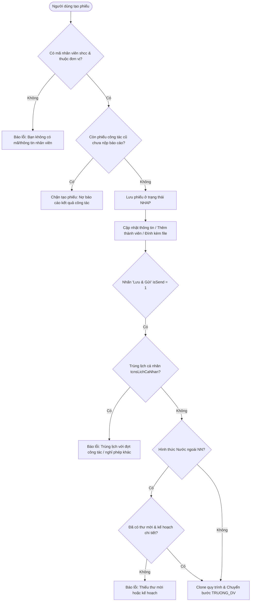
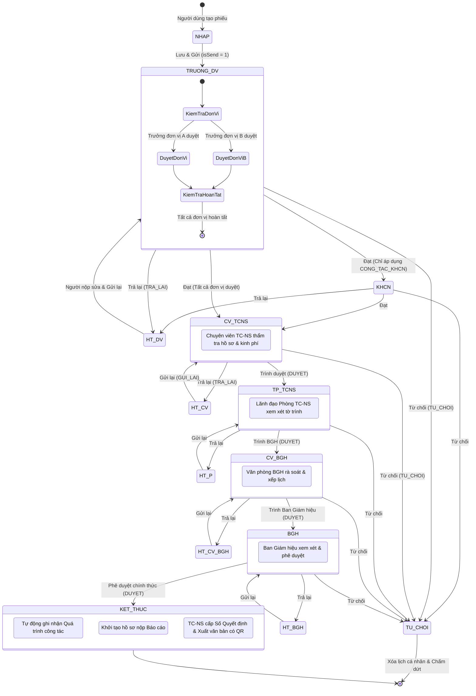
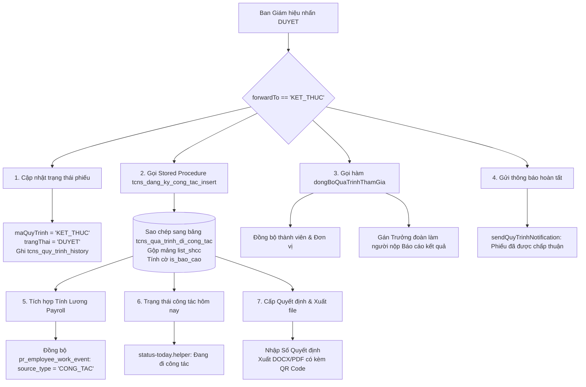

# Báo Cáo Phân Tích Toàn Diện Module Đăng Ký Đi Công Tác (`tcns_dang_ky_cong_tac`)

---

## I. Tổng Quan Kiến Trúc & Các Đối Tượng Dữ Liệu Cốt Lõi

Module `tcns_dang_ky_cong_tac` tại thư mục [`modules/md_tcns/tcns_dang_ky_cong_tac`](file:///home/datn/backend/hrm-be/modules/md_tcns/tcns_dang_ky_cong_tac) chịu trách nhiệm quản lý toàn bộ vòng đời của một chuyến công tác (trong nước, nước ngoài, Ban Giám hiệu, hoặc theo đề tài KHCN) từ khâu tạo lập hồ sơ, kiểm tra xung đột lịch trình, thẩm định đa cấp song song giữa các đơn vị, cho đến khi ban hành Số Quyết định, đồng bộ hồ sơ nhân sự, tính công/lương (Payroll) và hậu kiểm báo cáo kết quả.

```
┌──────────────────────────────────────────────────────────────────────────────────┐
│                             VÒNG ĐỜI PHIẾU CÔNG TÁC                              │
└──────────────────────────────────────────────────────────────────────────────────┘
  1. Tạo lập / Xác thực           2. Phê duyệt đa tầng            3. Hoàn tất & Lan tỏa
┌───────────────────────┐       ┌───────────────────────┐       ┌────────────────────────┐
│ • Kiểm tra nợ báo cáo │       │ • Duyệt song song ĐV  │       │ • Ghi vào quá trình    │
│ • Kiểm tra trùng lịch │ ────> │ • Thẩm định TC-NS     │ ────> │ • Cấp Số Quyết định    │
│ • Khởi tạo quy trình  │       │ • Trình VP BGH / BGH  │       │ • Đồng bộ sang Payroll │
│ • Khóa lịch cá nhân   │       │ • Luồng Trả lại / Sửa │       │ • Kích hoạt hậu kiểm   │
└───────────────────────┘       └───────────────────────┘       └────────────────────────┘
```

---

### 1. Mô hình dữ liệu & Các bảng tham gia

| Bảng Cơ Sở Dữ Liệu | Model tương ứng | Vai trò & Đặc điểm kỹ thuật |
| :--- | :--- | :--- |
| `tcns_dang_ky_cong_tac` | [`tcnsDangKyCongTac`](file:///home/datn/backend/hrm-be/modules/md_tcns/tcns_dang_ky_cong_tac/model/tcns_dang_ky_cong_tac.model.ts) | Bảng thực thể chính lưu trữ thông tin chuyến đi: `shcc` (người tạo/đại diện), `ngayBatDau`, `ngayKetThuc`, `hinhThuc` (`TN`/`NN`), `phanLoai` (`CA_NHAN`/`NHOM`), `maQuyTrinh`, `trangThai`, `donViDuyet` (mảng JSONB), `thaoTacDonVi` (JSONB lưu trạng thái duyệt song song), `soQuyetDinh`, `soQuyetDinhDuyet`. |
| `tcns_dang_ky_cong_tac_tham_gia` | [`tcnsDangKyCongTacThamGia`](file:///home/datn/backend/hrm-be/modules/md_tcns/tcns_dang_ky_cong_tac/model/tcns_dang_ky_cong_tac_tham_gia.model.ts) | Danh sách nhân sự tham gia đợt công tác: `dangKyId`, `shcc`, `donVi`, `chucVu`, `isTruongDoan`, `isDangVien`. Căn cứ để xác định quyền duyệt của các Trưởng đơn vị liên quan. |
| `tcns_dang_ky_cong_tac_ke_hoach` | [`tcnsDangKyCongTacKeHoach`](file:///home/datn/backend/hrm-be/modules/md_tcns/tcns_dang_ky_cong_tac/model/tcns_dang_ky_cong_tac_ke_hoach.model.ts) | Kế hoạch lịch trình chi tiết (bắt buộc đối với công tác nước ngoài `NN`): `stt`, `ngayBatDau`, `ngayKetThuc`, `noiDung`, `diaDiem`. |
| `tcns_lich_ca_nhan` | `tcnsLichCaNhan` | Quản lý block lịch cá nhân, ngăn chặn xung đột thời gian (trùng lịch công tác, nghỉ phép, đào tạo, bồi dưỡng). |
| `tcns_quy_trinh` | [`tcnsQuyTrinh`](file:///home/datn/backend/hrm-be/modules/md_tcns/tcns_quy_trinh/model/tcns_quy_trinh.model.ts) | Bản sao instance các bước quy trình từ `fw_quy_trinh` được clone riêng cho từng phiếu (`phieuId`). |
| `tcns_quy_trinh_user` | [`tcnsQuyTrinhUser`](file:///home/datn/backend/hrm-be/modules/md_tcns/tcns_quy_trinh/model/tcns_quy_trinh_user.model.ts) | Danh sách cán bộ được phân quyền duyệt tại từng bước của phiếu cụ thể (được sinh tự động từ hàm `tcns_quy_trinh_user_fetch_quy_trinh`). |
| `tcns_quy_trinh_history` | [`tcnsQuyTrinhHistory`](file:///home/datn/backend/hrm-be/modules/md_tcns/tcns_quy_trinh/model/tcns_quy_trinh_history.model.ts) | Nhật ký audit log: thời gian, người thao tác, bước trước, bước sau, trạng thái, ghi chú, mã parallel. |
| `tcns_qua_trinh_di_cong_tac` | [`tcnsQuaTrinhDiCongTac`](file:///home/datn/backend/hrm-be/modules/md_tcns/tcns_dang_ky_cong_tac/model/tcns_qua_trinh_di_cong_tac.model.ts) | Bảng đích ghi nhận **lịch sử công tác chính thức** của viên chức/người lao động sau khi phiếu được duyệt thành công (`KET_THUC`). |

---

### 2. Bốn loại hình quy trình công tác (`type`)

Hệ thống phân định quy trình theo 4 mã luồng chính tại [`mapperPhanLoai`](file:///home/datn/backend/hrm-be/modules/md_tcns/tcns_dang_ky_cong_tac/controller/quy_trinh.controller.ts#L13-L18):
1. **`CONG_TAC_TN`** (Công tác trong nước): Áp dụng cho viên chức/người lao động đi công tác trong phạm vi lãnh thổ Việt Nam.
2. **`CONG_TAC_NN`** (Công tác nước ngoài): Yêu cầu bắt buộc phải có thư mời đính kèm (`files`), kế hoạch lộ trình chi tiết (`keHoach`), và cam kết nộp báo cáo kết quả sau chuyến đi.
3. **`CONG_TAC_BGH`** (Công tác có Ban Giám hiệu): Chuyến đi có thành viên Ban Giám hiệu trực tiếp tham gia; luồng duyệt rút gọn trực tiếp qua BGH.
4. **`CONG_TAC_KHCN`** (Công tác từ nguồn kinh phí đề tài KHCN): Bắt buộc đi qua bước thẩm định của Phòng Khoa học & Công nghệ (`KHCN`) trước khi chuyển tới Phòng TC-NS.

---

## II. Giai Đoạn Khởi Tạo & Tiền Điều Kiện (Pre-Submission)

Trước khi một phiếu công tác được gửi vào quy trình duyệt chính thức, hệ thống thực thi một chuỗi các cơ chế ràng buộc và kiểm soát chặt chẽ tại [`dang_ky.controller.ts`](file:///home/datn/backend/hrm-be/modules/md_tcns/tcns_dang_ky_cong_tac/controller/dang_ky.controller.ts):



### 1. Cơ chế chặn tạo phiếu do nợ báo cáo kết quả (`layPhieuChuaNopBaoCao`)
Hàm [`layPhieuChuaNopBaoCao`](file:///home/datn/backend/hrm-be/modules/md_tcns/tcns_dang_ky_cong_tac/controller/dang_ky.controller.ts#L25-L51) truy vấn bảng `tcns_qua_trinh_di_cong_tac` để tìm các đợt công tác trước đây của nhân sự:
- Có tính chất bắt buộc báo cáo (`hinhThuc == 'NN'` hoặc `isBaoCao == true`).
- Chưa được cán bộ quản lý cho phép bổ sung sau (`choPhepBoSungBaoCao != true`).
- Chưa có báo cáo kết quả tương ứng trong `tcns_bao_cao_cong_tac` hoặc báo cáo vẫn đang ở trạng thái `NHAP`.
- **Đặc thù đoàn công tác**: Nếu đợt đi theo đoàn có Trưởng đoàn (`isTruongDoan`), thì chỉ Trưởng đoàn mới bị chặn nợ báo cáo (vì Trưởng đoàn chịu trách nhiệm đại diện nộp báo cáo cho cả đoàn).
- **Tác dụng**: Buộc viên chức phải hoàn thành trách nhiệm báo cáo nghiệm thu chuyến đi cũ trước khi xin phê duyệt chuyến đi mới.

### 2. Kiểm tra xung đột lịch trình (`tcnsLichCaNhan.checkTrungLich`)
- Trước khi lưu/gửi, hệ thống đối soát thời gian (`ngayBatDau`, `ngayKetThuc`, buổi `SANG`/`CHIEU`) của **toàn bộ danh sách nhân sự tham gia** với các lịch cá nhân đã được xác nhận hoặc đang chờ duyệt trên toàn hệ thống (Nghỉ phép, Công tác, Đào tạo, Bồi dưỡng).
- **Tác dụng**: Ngăn chặn tình trạng một nhân sự có mặt ở hai địa điểm hoặc tham gia hai nhiệm vụ khác nhau cùng một thời điểm.

---

## III. Phân Tích Cơ Chế Gửi Phiếu & Kích Hoạt Luồng Phê Duyệt

Khi người dùng nhấn **"Lưu & Gửi"** (`PUT /api/tcns-di-cong-tac/dang-ky` với `isSend = 1`) hoặc chuyển bước từ giao diện cá nhân (`POST /api/tcns-di-cong-tac/user-phase`), hệ thống thực hiện các tác vụ nguyên tử trong một **Database Transaction**:

### 1. Phân loại luồng & khởi tạo quy trình động (`handleQuyTrinh`)
Hàm [`handleQuyTrinh`](file:///home/datn/backend/hrm-be/modules/md_tcns/tcns_dang_ky_cong_tac/controller/quy_trinh.controller.ts#L149-L161):
- Lấy mẫu các bước chuẩn từ `fw_quy_trinh` thông qua stored procedure `fw_quy_trinh_fetch_item(type)`.
- Tạo danh sách đơn vị duyệt `donViDuyet = [...new Set(thamGia.map(i => i.donVi))]`.
- Khởi tạo ma trận `parallelGroup` cho các bước duyệt song song (ví dụ: `CV_DV_10`, `CV_DV_20`...).
- Xóa quy trình cũ của phiếu (nếu có) và ghi hàng loạt (`bulkCreate`) các bước quy trình mới vào bảng `tcns_quy_trinh`.

### 2. Khóa lịch trình và cấp quyền bổ sung
- Xóa các block lịch cá nhân cũ của phiếu và ghi mới (`bulkCreate`) vào `tcns_lich_ca_nhan` cho tất cả nhân sự tham gia.
- Nếu nhân sự tham gia là **Trưởng đơn vị hoặc Phó đơn vị** (`capDonVi == 'T' && (isTruong || isPho)`), hệ thống tạo bản ghi trong `tcns_quy_trinh_user_bo_sung` với `loai = 'R'` (Remove).
  - **Tác dụng cốt lõi**: Cơ chế này loại bỏ chính Trưởng/Phó đơn vị đó ra khỏi danh sách người duyệt của bước `TRUONG_DV`, ngăn chặn việc **tự mình duyệt phiếu công tác cho chính mình**. Phiếu của Trưởng/Phó đơn vị sẽ do cấp có thẩm quyền cao hơn (hoặc người được ủy quyền hợp lệ) phê duyệt.

### 3. Phân giải người duyệt bước tiếp theo & Gửi thông báo (`updateHistory`)
Hàm [`updateHistory`](file:///home/datn/backend/hrm-be/modules/md_tcns/tcns_dang_ky_cong_tac/controller/quy_trinh.controller.ts#L54-L85):
- Gọi stored procedure `tcns_quy_trinh_user_fetch_quy_trinh` để quét bảng nhân sự (`fw_user_position`, `fw_user_role_key`), khớp `maDonVi`, `role`, `roleKey` của target kế tiếp nhằm tìm ra chính xác danh sách `shcc` của các cán bộ có thẩm quyền duyệt.
- Lọc bỏ các cán bộ nằm trong danh sách `tcns_quy_trinh_user_bo_sung` (như đã nêu trên).
- **Xử lý ngoại lệ Văn phòng BGH**: Nếu bước duyệt là `TRUONG_DV`, người tạo không phải thành viên BGH (`BGH_MEMBERS`) nhưng đợt đi có thành viên thuộc đơn vị `01` (BGH), hệ thống tự động bổ sung cán bộ có roleKey `clerical-president` (Văn phòng BGH) vào danh sách duyệt.
- Ghi dữ liệu vào `tcns_quy_trinh_user`, cập nhật `tcns_dang_ky_cong_tac` (`maQuyTrinh = 'TRUONG_DV'`, `trangThai = 'DUYET'`).
- Ghi nhật ký vào `tcns_quy_trinh_history`.
- Đăng ký hook `sendQuyTrinhNotification`: Sau khi transaction commit thành công, hệ thống gửi Firebase/Web Notification tới hòm thư nội bộ của các cán bộ duyệt tương ứng với đường dẫn trực tiếp tới trang phê duyệt.

---

## IV. Phân Tích Chi Tiết Từng Cột Mốc Trong Quy Trình Phê Duyệt

Dưới đây là sơ đồ phối hợp tổng thể giữa các cột mốc trong quy trình duyệt phiếu công tác (tiêu biểu cho quy trình `CONG_TAC_TN` và `CONG_TAC_NN`):



---

### Cột Mốc 1: Lãnh Đạo Đơn Vị (`TRUONG_DV`)

- **Đối tượng xử lý**: Trưởng/Phó các đơn vị quản lý trực tiếp của các nhân sự trong đoàn (vai trò `roleKey: ["DV_DI_CONG_TAC:MANAGE"]`).
- **Bản chất nghiệp vụ**: Thẩm định sự cần thiết của chuyến đi, thời gian vắng mặt của nhân sự tại đơn vị, và phân công người thay thế công việc chuyên môn.

#### Cơ chế Duyệt Song Song Đơn Vị (`updateQuyTrinhParallelDonVi` & `tinhThaoTacDonVi`)
Đối với các đoàn công tác liên khoa/liên phòng ban (`phanLoai == 'NHOM'`), đoàn có thể bao gồm thành viên từ nhiều đơn vị khác nhau (`donViDuyet = ['10', '20', '94']`).
Hàm [`tinhThaoTacDonVi`](file:///home/datn/backend/hrm-be/modules/md_tcns/tcns_dang_ky_cong_tac/helper.ts#L35-L53) và [`updateQuyTrinhParallelDonVi`](file:///home/datn/backend/hrm-be/modules/md_tcns/tcns_dang_ky_cong_tac/controller/quy_trinh.controller.ts#L87-L114) vận hành như sau:
1. **Ghi nhận độc lập**: Khi Trưởng đơn vị $X$ bấm Duyệt, hệ thống cập nhật trường JSONB `thaoTacDonVi[X] = 'DUYET'` trên bảng `tcns_dang_ky_cong_tac` và tạo bản ghi lịch sử tương ứng (`maParallel = 'TRUONG_DV_X'`).
2. **Quy tắc đặc thù đơn vị phối hợp**:
   - Cán bộ thuộc Phòng Tổ chức - Nhân sự (`userDonVi == '94'`): Nếu trong đoàn có nhân sự thuộc đơn vị Thanh tra (`MA_DON_VI_THANH_TRA = '14'`) mà đơn vị 14 chưa thao tác, thao tác của đơn vị 94 sẽ tự động duyệt đồng thời cho cả đơn vị 14:
     ```typescript
     if (donViDuyet.includes(MA_DON_VI_THANH_TRA) && !(MA_DON_VI_THANH_TRA in thaoTac))
         thaoTacDonVi[MA_DON_VI_THANH_TRA] = giaTri;
     ```
   - Cán bộ có vai trò Văn phòng BGH (`roleKeys.includes('clerical-president')`): Nếu đoàn có thành viên Ban Giám hiệu (`MA_DON_VI_BGH = '01'`), thao tác sẽ được tính đại diện cho đơn vị 01.
3. **Điều kiện chuyển bước (`hoanTatTatCaDonVi`)**:
   - Hệ thống kiểm tra: `donViDuyet.every(dv => daDuyet.includes(dv))`.
   - **Tác dụng**: Nếu còn bất kỳ đơn vị nào chưa duyệt, phiếu **giữ nguyên tại bước `TRUONG_DV`**. Chỉ khi **100% các đơn vị liên quan** đã đồng ý, hệ thống mới tự động chuyển trạng thái sang bước tiếp theo (`CV_TCNS` hoặc `KHCN`).

#### Các thao tác khả dụng tại Cột mốc 1:

| Thao tác | Forward To | Trạng thái ghi nhận | Tác dụng kỹ thuật & Nghiệp vụ |
| :--- | :--- | :--- | :--- |
| **Duyệt (`DUYET`)** | `CV_TCNS` (hoặc `KHCN`) | `DUYET` / `GUI` | Ghi nhận đơn vị đồng ý. Nếu là đơn vị cuối cùng hoàn tất, chuyển toàn bộ hồ sơ lên cấp tiếp theo. |
| **Trả lại (`TRA_LAI`)** | `HT_DV` | `TRA_LAI` | Chuyển phiếu về trạng thái Hoàn trả cấp đơn vị (`HT_DV`). Ghi kèm ghi chú yêu cầu chỉnh sửa. Người nộp nhận thông báo và được mở khóa quyền sửa phiếu. |
| **Từ chối (`TU_CHOI`)** | `TU_CHOI` | `TU_CHOI` | **Đặc quyền đơn vị chủ quản**: Nếu đơn vị từ chối chính là đơn vị của người đứng đơn (`userDonVi == phieuDonVi`), phiếu bị **chấm dứt ngay lập tức**, xóa toàn bộ block lịch trong `tcns_lich_ca_nhan`. Nếu là đơn vị phối hợp từ chối, ghi vết từ chối của đơn vị đó vào nhật ký parallel. |

---

### Cột Mốc 2: Lãnh Đạo Phòng Khoa Học & Công Nghệ (`KHCN`)
*(Chỉ kích hoạt khi `type == 'CONG_TAC_KHCN'`)*

- **Đối tượng xử lý**: Cán bộ Phòng KH&CN (đơn vị `59`, vai trò `roleKey: ["clerical-khcn"]`).
- **Nghiệp vụ**: Thẩm định nội dung chuyến đi có gắn liền với đề tài nghiên cứu KH&CN, kiểm tra tính hợp lệ của mã đề tài, dự toán kinh phí và kế hoạch triển khai.
- **Thao tác & Tác dụng**:
  - **Duyệt (`DUYET`)**: Chuyển phiếu sang bước `CV_TCNS`.
  - **Trả lại (`TRA_LAI`)**: Chuyển về `HT_DV`, yêu cầu giải trình hoặc bổ sung minh chứng về đề tài KHCN.
  - **Từ chối (`TU_CHOI`)**: Hủy luồng công tác sử dụng kinh phí KHCN.

---

### Cột Mốc 3: Chuyên Viên Phòng Tổ Chức - Nhân Sự (`CV_TCNS`)

- **Đối tượng xử lý**: Chuyên viên phụ trách công tác tại Phòng TC-NS (đơn vị `94`, chức vụ chuyên viên `roles: ["999"]`).
- **Nghiệp vụ**:
  - Thẩm định hồ sơ pháp lý, thời gian công tác, điều kiện đi nước ngoài (đối với viên chức, Đảng viên).
  - Kiểm tra tính đầy đủ của thư mời, cơ quan công tác, kế hoạch chi tiết, nguồn kinh phí và các khoản chi thanh toán.
  - Soát xét tiêu chuẩn, định mức công tác phí theo quy chế chi tiêu nội bộ của Nhà trường.
- **Thao tác & Tác dụng**:
  - **Duyệt (`DUYET`)**: Chuyển tiếp lên Lãnh đạo Phòng TC-NS (`forwardTo = 'TP_TCNS'`).
  - **Trả lại (`TRA_LAI`)**: Chuyển về bước Hoàn trả chuyên viên (`forwardTo = 'HT_CV'`). Phiếu được trả về để người nộp bổ sung các giấy tờ còn thiếu (ví dụ: bản dịch thư mời, công văn cử đi).
  - **Từ chối (`TU_CHOI`)**: Không chấp thuận do vi phạm chính sách nhân sự hoặc không đủ điều kiện công tác.

---

### Cột Mốc 4: Lãnh Đạo Phòng Tổ Chức - Nhân Sự (`TP_TCNS`)

- **Đối tượng xử lý**: Trưởng phòng hoặc Phó Trưởng phòng TC-NS (đơn vị `94`, chức vụ lãnh đạo `roles: ["004", "005"]`).
- **Nghiệp vụ**:
  - Xem xét tờ trình và kết quả thẩm định của chuyên viên TC-NS.
  - Phê duyệt về mặt quản lý nhân sự cấp trường trước khi trình Ban Giám hiệu quyết định.
- **Thao tác & Tác dụng**:
  - **Duyệt (`DUYET`)**: Phê duyệt tờ trình, chuyển tiếp hồ sơ lên Văn phòng Ban Giám hiệu (`forwardTo = 'CV_BGH'`).
  - **Trả lại (`TRA_LAI`)**: Chuyển về `HT_P`, yêu cầu chuyên viên hoặc đơn vị rà soát lại phương án nhân sự.
  - **Từ chối (`TU_CHOI`)**: Bác bỏ đề xuất cử đi công tác.

---

### Cột Mốc 5: Văn Phòng Ban Giám Hiệu (`CV_BGH`)

- **Đối tượng xử lý**: Thư ký / Cán bộ Văn phòng Ban Giám hiệu (`roleKey: ["clerical-president"]`).
- **Nghiệp vụ**:
  - Tiếp nhận hồ sơ công tác từ Phòng TC-NS.
  - Rà soát lịch công tác chung của Nhà trường, sự trùng lặp với các sự kiện quan trọng cấp trường.
  - Phân loại và trình lên Hiệu trưởng hoặc Phó Hiệu trưởng phụ trách khối/lĩnh vực.
- **Thao tác & Tác dụng**:
  - **Duyệt (`DUYET`)**: Chuyển tiếp lên Ban Giám hiệu (`forwardTo = 'BGH'`).
  - **Trả lại (`TRA_LAI`)**: Chuyển về `HT_CV_BGH`.
  - **Từ chối (`TU_CHOI`)**: Từ chối tiếp nhận trình BGH.

---

### Cột Mốc 6: Ban Giám Hiệu Phê Duyệt (`BGH`)

- **Đối tượng xử lý**: Thành viên Ban Giám hiệu (Hiệu trưởng / Phó Hiệu trưởng - đơn vị `01`).
- **Nghiệp vụ**: Cấp thẩm quyền cao nhất của Trường Đại học Bách Khoa ra quyết định cho phép cán bộ, giảng viên đi công tác trong hoặc ngoài nước.
- **Thao tác & Tác dụng**:
  - **Duyệt (`DUYET`)**: Chấp thuận chuyến đi. **Đây là thao tác quyết định đưa phiếu tới cột mốc KẾT THÚC (`forwardTo = 'KET_THUC'`)**, kích hoạt toàn bộ chuỗi tác vụ hoàn tất tự động của hệ thống.
  - **Trả lại (`TRA_LAI`)**: Chuyển về `HT_BGH`, yêu cầu điều chỉnh thời gian, thành phần đoàn hoặc kinh phí.
  - **Từ chối (`TU_CHOI`)**: Ban Giám hiệu không phê duyệt chuyến công tác.

---

### Quy Trình Đặc Thù: Công Tác Dành Cho Ban Giám Hiệu (`CONG_TAC_BGH`)

Khi phiếu có thành viên Ban Giám hiệu trực tiếp đi công tác (`isBGH == true`), hệ thống tự động kích hoạt luồng riêng [`CONG_TAC_BGH`](file:///home/datn/backend/hrm-be/modules/md_tcns/tcns_dang_ky_cong_tac/controller/quy_trinh.controller.ts#L53-L56):
- Khi gửi phiếu: Tự động coi như đơn vị `01` đã duyệt (`thaoTacDonVi['01'] = 'DUYET'`).
- Bỏ qua toàn bộ các bước trung gian của đơn vị và chuyên viên TC-NS.
- Luồng duyệt: `NHAP` $\longrightarrow$ `BGH` $\longrightarrow$ `KET_THUC`.

---

## V. Phân Tích Cơ Chế Xử Lý Ngoại Lệ & Luồng Ngược (Rollback / Exception Flows)

Quy trình phê duyệt của module được thiết kế với tính toàn vẹn trạng thái cao, hỗ trợ đầy đủ các kịch bản ngoại lệ:

```
┌──────────────────────────────────────────────────────────────────────────────┐
│                        CÁC LUỒNG XỬ LÝ NGOẠI LỆ                              │
└──────────────────────────────────────────────────────────────────────────────┘

1. LUỒNG HOÀN TRẢ (TRA_LAI):
   [Bước duyệt bất kỳ] ──(TRA_LAI)──> [Bước HT tương ứng]
                                              │
                                       (Mở khóa canEdit)
                                              │
   [Bước duyệt ban đầu] <──(GUI_LAI)─── [Người nộp sửa]

2. LUỒNG TỪ CHỐI (TU_CHOI):
   [Bước duyệt bất kỳ] ──(TU_CHOI)───> [TU_CHOI (Đóng vĩnh viễn)]
                                              │
                                     (Hủy tcnsLichCaNhan)

3. LUỒNG THU HỒI (THU_HOI):
   [Phiếu đang chờ duyệt] ──(THU_HOI)──> [THU_HOI]
                                              │
                                     (Hủy tcnsLichCaNhan)
                                     (Xóa tcnsQuaTrinhDiCongTac nếu có)
```

### 1. Luồng Hoàn trả & Chỉnh sửa gửi lại (`TRA_LAI` $\rightarrow$ `HT_*` $\rightarrow$ `GUI_LAI`)
- Tại bất kỳ cột mốc nào (`TRUONG_DV`, `CV_TCNS`, `TP_TCNS`, `CV_BGH`, `BGH`), người duyệt đều có thể chọn **Trả lại** kèm theo ghi chú (`ghiChu`).
- Hệ thống chuyển `maQuyTrinh` sang bước hoàn trả tương ứng (`HT_DV`, `HT_CV`, `HT_P`, `HT_CV_BGH`, `HT_BGH`) và đặt trạng thái hiển thị là `TRA_LAI`.
- **Tác dụng tại Frontend**: Cờ `canEdit = (maQuyTrinh == 'NHAP' || quyTrinhUser.some(i => i.trangThai == 'GUI_LAI'))` trở thành `true`, cho phép người nộp cập nhật lại các trường dữ liệu, bổ sung tệp đính kèm hoặc thay đổi thành viên đoàn.
- **Hành động Gửi lại (`GUI_LAI`)**: Người nộp nhấn "Lưu & Gửi", phiếu được trả thẳng về đúng bước vừa yêu cầu chỉnh sửa trước đó mà không cần duyệt lại từ đầu các bước đã qua.

### 2. Luồng Từ chối (`TU_CHOI`)
- Khi người duyệt quyết định không phê duyệt:
  - Cập nhật trạng thái phiếu thành `TU_CHOI`.
  - **Tác dụng cốt lõi**: Tự động giải phóng lịch trình cá nhân bằng lệnh `tcnsLichCaNhan.delete({ phieuId: id, phanLoai: 'CONG_TAC' })`.
  - Khoảng thời gian đã đăng ký trước đó ngay lập tức được mở lại cho cán bộ để thực hiện các đăng ký khác.

### 3. Luồng Thu hồi (`THU_HOI`)
- **Người nộp tự thu hồi**: Thực hiện thông qua API `POST /api/tcns-di-cong-tac/user-phase` khi phiếu chưa kết thúc duyệt.
- **Thu hồi cấp quản lý**: Cán bộ Phòng TC-NS (`maDonVi == '94'`) hoặc Văn phòng BGH (`roleKey: 'clerical-president'`) có quyền thu hồi đặc biệt ngay cả khi phiếu đã duyệt xong thông qua API `POST /api/tcns-di-cong-tac/duyet` với `maQuyTrinh = 'THU_HOI'`.
- **Tác dụng**:
  - Thu hồi phiếu về trạng thái `THU_HOI`.
  - Xóa lịch trong `tcns_lich_ca_nhan`.
  - Xóa bản ghi quá trình trong `tcns_qua_trinh_di_cong_tac` để hủy bỏ trạng thái công tác đã ghi nhận trước đó.

---

## VI. Cột Mốc Đích: Phân Tích Khi Phiếu Được Xác Nhận Thành Công (`KET_THUC`)

Thời điểm Ban Giám hiệu nhấn **Duyệt** tại bước `BGH` (hoặc TC-NS duyệt hàng loạt `duyet-multiple` / tự nhập `tu-nhap`), target chuyển tiếp đạt `forwardTo = 'KET_THUC'`. Đây là cột mốc cốt lõi hoàn tất quy trình, kích hoạt đồng loạt chuỗi tác động mang tính hệ thống tại [`duyet.controller.ts`](file:///home/datn/backend/hrm-be/modules/md_tcns/tcns_dang_ky_cong_tac/controller/duyet.controller.ts#L90-L93):

```typescript
if (data.maQuyTrinh == 'KET_THUC') {
    await app.model.tcnsDangKyCongTac.insert(Number(data.phieuId), { transaction });
    await dongBoQuaTrinhThamGia(Number(data.phieuId), transaction);
}
```



### 1. Kích hoạt Stored Procedure `tcns_dang_ky_cong_tac_insert(i_phieu)`
Stored procedure thực thi mã SQL nguyên tử trực tiếp trong cơ sở dữ liệu PostgreSQL:
- **Kiểm tra tính duy nhất**: `WHERE NOT EXISTS (SELECT 1 FROM tcns_qua_trinh_di_cong_tac WHERE dang_ky_id = dky.id)` nhằm đảm bảo tính bất biến (idempotent), không bao giờ sinh trùng lặp bản ghi quá trình nếu có thao tác duyệt lại.
- **Tập hợp danh sách cán bộ**: Tự động gom toàn bộ danh sách cán bộ tham gia từ `tcns_dang_ky_cong_tac_tham_gia` thành mảng JSONB `list_shcc`:
  ```sql
  coalesce((select jsonb_agg(distinct t.shcc)
            from tcns_dang_ky_cong_tac_tham_gia t
            where t.dang_ky_id = dky.id and t.shcc is not null),
           to_jsonb(array [dky.shcc]))
  ```
- **Xác định nghĩa vụ nộp báo cáo**:
  ```sql
  coalesce(dky.is_bao_cao, false) OR dky.hinh_thuc = 'NN'
  ```
  Nếu là công tác nước ngoài (`hinhThuc == 'NN'`), cột `is_bao_cao` trong quá trình công tác **mặc định luôn luôn là `TRUE`**.

### 2. Đồng bộ phân quyền nộp Báo cáo Kết quả (`dongBoQuaTrinhThamGia`)
Hàm [`dongBoQuaTrinhThamGia`](file:///home/datn/backend/hrm-be/modules/md_tcns/tcns_dang_ky_cong_tac/controller/quy_trinh.controller.ts#L116-L147):
- Kiểm tra danh sách thành viên thực tế và đồng bộ lại `listShcc` trong `tcns_qua_trinh_di_cong_tac` nếu có sự thay đổi.
- **Gán quyền nộp báo cáo**: Tìm cán bộ được chỉ định làm Trưởng đoàn (`layShccTruongDoan`). Nếu trong module `tcns_bao_cao_cong_tac` đã tồn tại bản ghi báo cáo cho phiếu này, hệ thống sẽ tự động cập nhật lại `shcc` và `donVi` của báo cáo về đúng Trưởng đoàn.
- **Tác dụng**: Đảm bảo đúng nguyên tắc trách nhiệm hành chính — Trưởng đoàn là người duy nhất có quyền đại diện khởi tạo và nộp báo cáo kết quả công tác cho toàn đoàn.

### 3. Nghiệp vụ Cấp Số Quyết Định & Xuất Văn Bản Kèm Mã QR Xác Thực
Sau khi phiếu chuyển sang `KET_THUC`, cán bộ Phòng TC-NS tiến hành các thủ tục hành chính ban hành văn bản:
- **Cấp Số Quyết định** (`POST /api/tcns-di-cong-tac/so-quyet-dinh`):
  - Nhập `soQuyetDinh` và `ngayQuyetDinh`.
  - Cập nhật đồng bộ vào cả 2 bảng: `tcns_dang_ky_cong_tac` và `tcns_qua_trinh_di_cong_tac`.
- **Xuất Quyết định theo thể thức chuẩn** (`GET /api/tcns-di-cong-tac/so-quyet-dinh/export/:type/:phieuId`):
  - Tự động nhận diện mẫu phôi Word tương ứng tại [`assets/tcns_di_cong_tac_templates`](file:///home/datn/backend/hrm-be/assets/tcns_di_cong_tac_templates):
    + Cá nhân trong nước: `sqd_cong_tac_can_nhan_trong_nuoc_template.docx`
    + Cá nhân nước ngoài: `sqd_cong_tac_can_nhan_nuoc_ngoai_template.docx`
    + Nhóm trong nước: `sqd_cong_tac_nhom_trong_nuoc_template.docx`
    + Nhóm nước ngoài: `sqd_cong_tac_nhom_nuoc_ngoai_template.docx`
  - Đổ dữ liệu nhân sự, chức danh, ngạch viên chức, địa điểm, mục đích, danh sách các đơn vị phối hợp.
  - **Tích hợp mã QR Code chống giả mạo**: Sử dụng `bwip-js` và `jimp` để tạo mã QR Code động nhúng logo Nhà trường, trỏ tới URL xác thực:
    ```
    ${APP_ROOT_URL}/staff/di-cong-tac/preview/${phieuId}
    ```
  - Tự động chuyển đổi sang định dạng PDF hoặc giữ nguyên DOCX cho cán bộ tải về.

### 4. Các Tác Động Lan Tỏa (Downstream System Impacts)

Bản ghi tại `tcns_qua_trinh_di_cong_tac` chính là đầu mối tích hợp liên module trong toàn bộ hệ thống HRM:
1. **Module Trạng thái làm việc hôm nay (`status-today.helper.ts`)**:
   - Khi chạy nghiệp vụ xác định tình trạng nhân sự trong ngày (`computeScheduleToday`), hệ thống quét bảng `tcns_qua_trinh_di_cong_tac`.
   - Các cán bộ nằm trong danh sách `listShcc` của đợt công tác sẽ tự động được hiển thị trạng thái **"Đi công tác"** (`CONG_TAC`), chiếm ca làm việc sáng/chiều, hỗ trợ lãnh đạo đơn vị nắm bắt quân số thực tế.
2. **Module Đồng bộ Tính Lương (`md_dong_bo_payroll`)**:
   - Truy vấn view tích hợp đẩy dữ liệu sang hệ thống Payroll thông qua Kafka:
     ```sql
     WITH work_event AS (
         SELECT ct.shcc AS employee_id, 'CONG_TAC'::text AS source_type, ct.id::text AS source_row_id, ...
         FROM public.tcns_qua_trinh_di_cong_tac ct
     )
     ```
   - Ghi nhận sự kiện làm việc `pr_employee_work_event` để phục vụ tự động tính phụ cấp lưu trú, công tác phí và đối soát bảng chấm công hàng tháng.
3. **Cơ chế Giám sát Hậu Kiểm Báo Cáo**:
   - Sau khi kết thúc thời gian công tác, hệ thống bắt đầu tính hạn nộp báo cáo (`thoiGianBaoCao`, mặc định 15 ngày).
   - Nếu quá hạn mà Trưởng đoàn/Cá nhân chưa nộp báo cáo qua module `tcns_bao_cao_ket_qua`, cơ chế `layPhieuChuaNopBaoCao` sẽ tự động khóa quyền tạo phiếu công tác mới như đã phân tích tại Phần II.

---

## VII. Bảng Tổng Hợp Ma Trận Phê Duyệt Toàn Quy Trình

| Cột mốc / Bước | Tên hiển thị | Vai trò / Đơn vị thẩm quyền | Điều kiện & Thao tác đầu vào | Tác dụng & Điểm đến kế tiếp (`forwardTo`) |
| :--- | :--- | :--- | :--- | :--- |
| **`NHAP`** | Nháp | Người tạo đơn (`isCreateUser = true`) | - Có hồ sơ nhân sự<br/>- Không nợ báo cáo cũ<br/>- Nhấn `Lưu & Gửi` | Kiểm tra trùng lịch, clone quy trình, khóa lịch cá nhân $\longrightarrow$ Chuyển tới **`TRUONG_DV`** (hoặc **`BGH`**). |
| **`TRUONG_DV`** | Lãnh đạo Đơn vị | Trưởng/Phó đơn vị quản lý (`DV_DI_CONG_TAC:MANAGE`) | - Kiểm tra nhân sự thuộc quyền<br/>- Duyệt song song nhiều đơn vị | - Cập nhật `thaoTacDonVi`.<br/>- Khi 100% đơn vị duyệt $\longrightarrow$ **`CV_TCNS`** (hoặc **`KHCN`**).<br/>- Trả lại $\longrightarrow$ **`HT_DV`**.<br/>- Từ chối $\longrightarrow$ **`TU_CHOI`**. |
| **`KHCN`** | Lãnh đạo P.KHCN | Đơn vị 59 (`roleKey: clerical-khcn`) | Áp dụng cho phiếu `CONG_TAC_KHCN` | - Thẩm tra kinh phí đề tài $\longrightarrow$ **`CV_TCNS`**.<br/>- Trả lại $\longrightarrow$ **`HT_DV`**.<br/>- Từ chối $\longrightarrow$ **`TU_CHOI`**. |
| **`CV_TCNS`** | Chuyên viên P.TC-NS | Đơn vị 94 (`roles: ["999"]`) | Soát xét hồ sơ, thư mời, chế độ | - Thẩm định đạt $\longrightarrow$ **`TP_TCNS`**.<br/>- Trả lại $\longrightarrow$ **`HT_CV`**.<br/>- Từ chối $\longrightarrow$ **`TU_CHOI`**. |
| **`TP_TCNS`** | Lãnh đạo P.TC-NS | Đơn vị 94 (`roles: ["004", "005"]`) | Xem xét tờ trình của chuyên viên | - Phê duyệt tờ trình $\longrightarrow$ **`CV_BGH`**.<br/>- Trả lại $\longrightarrow$ **`HT_P`**.<br/>- Từ chối $\longrightarrow$ **`TU_CHOI`**. |
| **`CV_BGH`** | Văn phòng BGH | Thư ký BGH (`roleKey: clerical-president`) | Rà soát lịch trường, chuẩn bị trình ký | - Trình duyệt $\longrightarrow$ **`BGH`**.<br/>- Trả lại $\longrightarrow$ **`HT_CV_BGH`**.<br/>- Từ chối $\longrightarrow$ **`TU_CHOI`**. |
| **`BGH`** | Ban Giám hiệu | Thành viên Ban Giám hiệu (Đơn vị `01`) | Cấp thẩm quyền cao nhất quyết định | - **Phê duyệt chính thức $\longrightarrow$ `KET_THUC`**.<br/>- Trả lại $\longrightarrow$ **`HT_BGH`**.<br/>- Từ chối $\longrightarrow$ **`TU_CHOI`**. |
| **`HT_*`** | Hoàn trả | Người nộp phiếu (`isCreateUser = true`) | Nhận yêu cầu chỉnh sửa kèm ghi chú | Sửa thông tin $\longrightarrow$ Nhấn `Gửi lại` (`GUI_LAI`) quay về đúng bước đã trả. |
| **`TU_CHOI`** | Từ chối | Tự động cập nhật | Có quyết định từ chối | Hủy block lịch trong `tcns_lich_ca_nhan`, đóng phiếu. |
| **`THU_HOI`** | Thu hồi | Người nộp hoặc Quản trị TCNS/BGH | Yêu cầu hủy bỏ đợt công tác | Hủy lịch cá nhân, xóa quá trình công tác nếu đã ghi nhận. |
| **`KET_THUC`** | Hoàn tất | Hệ thống tự động & Quản trị TC-NS | Đã có phê duyệt của Ban Giám hiệu | - Gọi stored proc sao chép sang `tcns_qua_trinh_di_cong_tac`.<br/>- Gán Trưởng đoàn nộp báo cáo kết quả.<br/>- Cấp Số Quyết định & xuất văn bản có QR Code.<br/>- Đồng bộ sang hệ thống chấm công và tính lương Payroll. |

---

## VIII. Chuyên Đề Phân Tích: Hiện Tượng Phiếu Công Tác Không Ở Trạng Thái "Đã Duyệt" Nhưng Không Có Quy Trình Trạng Thái

Trong quá trình vận hành và kiểm tra thực tế hệ thống, xuất hiện trường hợp **các phiếu công tác không ở trạng thái "Đã duyệt" nhưng lại hoàn toàn không có bất kỳ quy trình trạng thái nào** (không có các bước phê duyệt, không có thanh tiến trình workflow stepper, hoặc bảng quy trình rỗng).

Dưới đây là kết quả điều tra và phân tích chuyên sâu từ cấp độ **Cơ sở dữ liệu (Database)**, **Mã nguồn Backend (`hrm-be`)** cho đến **Giao diện người dùng Frontend (`hrm-fe`)**.

```
┌────────────────────────────────────────────────────────────────────────────────────────────────────────┐
│               SƠ ĐỒ NGUYÊN NHÂN PHIẾU KHÔNG CÓ TRẠNG THÁI "ĐÃ DUYỆT" & THIẾU QUY TRÌNH                 │
└────────────────────────────────────────────────────────────────────────────────────────────────────────┘

    1. TẠO MỚI (POST /dang-ky)              2. CHƯA LƯU / GỬI (PUT)              3. HIỂN THỊ FRONTEND
 ┌──────────────────────────────┐        ┌─────────────────────────────┐        ┌────────────────────────────┐
 │ • Chỉ insert tcns_dang_ky    │        │ • KHÔNG gọi handleQuyTrinh  │        │ • detail-page: Ẩn Timeline │
 │ • maQuyTrinh = 'NHAP'        │ ─────> │ • tcns_quy_trinh = RỖNG     │ ─────> │ • Drawer: Ẩn tab Quy trình │
 │ • trangThai  = 'NHAP'        │        │ • tcns_quy_trinh_user = RỖNG│        │ • Card: steps = [] rỗng    │
 │ • KHÔNG khởi tạo quy trình   │        │ • tcns_history = RỖNG       │        │ • Label: 'Chờ xử lý' (xám) │
 └──────────────────────────────┘        └─────────────────────────────┘        └────────────────────────────┘
               ▲
               │ (Dữ liệu ngoại lệ / Test thủ công)
 ┌──────────────────────────────┐
 │ • Phiếu 391, 392 (Test SQL)  │
 │ • maQuyTrinh = NULL          │
 │ • trangThai  = NULL          │
 └──────────────────────────────┘
```

---

### 1. Thực Trạng Dữ Liệu Thực Tế Trong Cơ Sở Dữ Liệu (`hcmut_hrm_release`)

Quét toàn bộ bảng [`tcns_dang_ky_cong_tac`](file:///home/datn/backend/hrm-be/modules/md_tcns/tcns_dang_ky_cong_tac/model/tcns_dang_ky_cong_tac.model.ts) và đối chiếu với bảng [`tcns_quy_trinh`](file:///home/datn/backend/hrm-be/modules/md_tcns/tcns_quy_trinh/model/tcns_quy_trinh.model.ts):

- **Tổng số bản ghi**: 631 phiếu công tác.
- **Nhóm "Đã duyệt" (`maQuyTrinh = 'KET_THUC'`, `trangThai = 'DUYET'`)**: 611 phiếu.
  - *Đặc thù quan trọng*: Có tới **607/611 phiếu** "Đã duyệt" thực chất cũng **không có bản ghi trong `tcns_quy_trinh`**! Lý do là các phiếu này được nạp vào hệ thống thông qua tính năng **Import Excel** ([`export_import.controller.ts:L538`](file:///home/datn/backend/hrm-be/modules/md_tcns/tcns_dang_ky_cong_tac/controller/export_import.controller.ts#L538)) hoặc **Tự nhập** ([`dang_ky.controller.ts:L155`](file:///home/datn/backend/hrm-be/modules/md_tcns/tcns_dang_ky_cong_tac/controller/dang_ky.controller.ts#L155)). Những phiếu này được set thẳng `maQuyTrinh = 'KET_THUC'`, bỏ qua toàn bộ các bước quy trình trung gian. Tuy nhiên trên giao diện, chúng vẫn hiển thị nhãn "Đã duyệt" do câu lệnh SQL gán cứng: `WHEN dky.ma_quy_trinh = 'KET_THUC' THEN N'Đã duyệt'`.
- **Nhóm KHÔNG ở trạng thái "Đã duyệt" (`trangThai != 'DUYET'` hoặc `maQuyTrinh != 'KET_THUC'` hoặc `NULL`)**: Có 20 phiếu.
  - **12 phiếu** `trangThai = 'GUI'`, `maQuyTrinh = 'TRUONG_DV'`: Đã gửi duyệt cấp Đơn vị $\longrightarrow$ **Có đầy đủ 14 - 15 bước quy trình** trong `tcns_quy_trinh`.
  - **8 phiếu** `trangThai = 'THU_HOI'`, `maQuyTrinh = 'THU_HOI'`: Đã thu hồi $\longrightarrow$ **Có đầy đủ 14 - 15 bước quy trình** trong `tcns_quy_trinh`.
  - **1 phiếu** `trangThai = 'NHAP'`, `maQuyTrinh = 'NHAP'` (ID: `843`): Đang là bản nháp $\longrightarrow$ **Có 14 bước quy trình** (do người dùng từng bấm "Lưu" qua API `PUT`).
  - **8 phiếu HOÀN TOÀN KHÔNG CÓ BƯỚC QUY TRÌNH NÀO TRONG `tcns_quy_trinh` (`cnt_quy_trinh = 0`)**:
    + **6 phiếu ở trạng thái Nháp (`NHAP`)**: ID `1016`, `1013`, `1011`, `842`, `390`, `388`.
    + **2 phiếu ở trạng thái Rỗng (`NULL`)**: ID `391`, `392`.

---

### 2. Phân Tích Nguyên Nhân Cốt Lõi Tầng Kiến Trúc & Backend Code

#### Nguyên nhân 2.1: Sự phân tách bất đối xứng giữa Luồng Tạo Mới (`POST`) và Luồng Cập Nhật (`PUT`)
Đây là nguyên nhân chính giải thích vì sao các phiếu Nháp mới tạo lại hoàn toàn không có quy trình trong cơ sở dữ liệu:

1. **Tại API tạo mới phiếu ([`POST /api/tcns-di-cong-tac/dang-ky`](file:///home/datn/backend/hrm-be/modules/md_tcns/tcns_dang_ky_cong_tac/controller/dang_ky.controller.ts#L70-L109))**:
   - Khi cán bộ bấm "Thêm mới" trên giao diện, hệ thống gọi API `POST`:
     ```typescript
     // modules/md_tcns/tcns_dang_ky_cong_tac/controller/dang_ky.controller.ts
     const initialTrangThai = 'NHAP';
     data.trangThai = initialTrangThai;
     data.maQuyTrinh = initialTrangThai;

     const item = await app.model.tcnsDangKyCongTac.create({
         ...data, nam, shcc, donVi: maDonVi, ngayBatDau, ngayKetThuc,
         ngayTao: Date.now(), files: [], donViDuyet,
         maQuyTrinh: initialTrangThai, trangThai: initialTrangThai,
         ngayCapNhat: Date.now()
     }, { transaction });

     await app.model.tcnsDangKyCongTacThamGia.bulkCreate(
         data.thamGia.map(i => ({ ...i, dangKyId: item.id })),
         { transaction }
     );
     ```
   - **Khiếm khuyết kiến trúc**: Tại endpoint này, hệ thống **CHỈ** thêm bản ghi vào 2 bảng `tcns_dang_ky_cong_tac` và `tcns_dang_ky_cong_tac_tham_gia`. Hệ thống **HOÀN TOÀN KHÔNG gọi hàm `handleQuyTrinh`**, không clone các bước từ `fw_quy_trinh` sang `tcns_quy_trinh`, cũng không tạo bản ghi nào trong `tcns_quy_trinh_user` hay `tcns_quy_trinh_history`.

2. **Hàm `handleQuyTrinh` chỉ được kích hoạt tại ([`PUT /api/tcns-di-cong-tac/dang-ky`](file:///home/datn/backend/hrm-be/modules/md_tcns/tcns_dang_ky_cong_tac/controller/dang_ky.controller.ts#L231-L235))**:
   - Chỉ khi người dùng thực hiện cập nhật phiếu qua `PUT`:
     ```typescript
     const list = await handleQuyTrinh({ maDonVi, donViDuyet, phieuId: id, type, phanLoai: data.phanLoai });
     await app.model.tcnsQuyTrinh.delete({ phanLoai: { [Op.in]: Object.values(mapperPhanLoai) }, phieuId: id }, { transaction });
     await app.model.tcnsQuyTrinh.bulkCreate(list, { transaction });
     ```
   - **Hệ quả**: Nếu người nộp đơn tạo phiếu (đã sinh ra ID qua `POST`) nhưng **chưa từng bấm "Lưu" hoặc "Lưu & Gửi"** ở màn hình chi tiết (ví dụ: tắt trình duyệt, thoát modal, hoặc để lưu tạm làm sau), phiếu đó sẽ vĩnh viễn nằm lại bảng `tcns_dang_ky_cong_tac` với `ma_quy_trinh = 'NHAP'` nhưng trong `tcns_quy_trinh` **số lượng bước luôn bằng 0**.
   - Minh chứng: Phiếu `#843` đã được bấm Lưu (`PUT`) nên có 14 bước quy trình, trong khi các phiếu `#1016`, `#1013`, `#1011`, `#842`, `#390`, `#388` mới chỉ qua `POST` nên có **0 bước**.

#### Nguyên nhân 2.2: Stored Procedures truy vấn trả về mảng rỗng
Khi Backend đọc thông tin phiếu để trả về cho Client:

1. **Tại Stored Procedure [`tcns_dang_ky_cong_tac_get_by_id`](file:///home/datn/backend/hrm-be/modules/md_tcns/tcns_dang_ky_cong_tac/model/tcns_dang_ky_cong_tac.model.ts#L465-L482)**:
   - CTE trích xuất danh sách bước duyệt:
     ```sql
     with quyTrinh as (
         select phieu_id, jsonb_agg(...) as quyTrinh
         from tcns_quy_trinh
         where phieu_id = _id and phan_loai = ANY (v_phan_loai)
         group by phieu_id
     )
     ```
   - Trả về: `coalesce(quyTrinh.quyTrinh, '[]'::jsonb) as "quyTrinh"`, `coalesce(history.history, '[]'::jsonb) as "history"`, `coalesce(qtu.list, '[]'::jsonb) as "quyTrinhUser"`.
   - Do bảng `tcns_quy_trinh` không có bản ghi nào cho phiếu này, Client nhận về `quyTrinh = []`, `history = []`, `quyTrinhUser = []`.

2. **Tại Stored Procedure [`tcns_dang_ky_cong_tac_fetch_all`](file:///home/datn/backend/hrm-be/modules/md_tcns/tcns_dang_ky_cong_tac/model/tcns_dang_ky_cong_tac.model.ts#L445-L462) và [`tcns_dang_ky_cong_tac_search_page`](file:///home/datn/backend/hrm-be/modules/md_tcns/tcns_dang_ky_cong_tac/model/tcns_dang_ky_cong_tac.model.ts#L485-L506)**:
   - Tên quy trình được xác định bằng:
     ```sql
     CASE
         WHEN dky.ma_quy_trinh = 'NHAP' THEN N'Nháp'
         WHEN dky.ma_quy_trinh = 'KET_THUC' THEN N'Đã duyệt'
         ELSE qtb.ten_quy_trinh
     END AS "tenQuyTrinh"
     ```
     với `LEFT JOIN tcns_quy_trinh qtb ON qtb.ma = dky.ma_quy_trinh AND qtb.phieu_id = dky.id AND qtb.phan_loai = dky.type`.
   - Nếu phiếu không có trong `tcns_quy_trinh`, và `ma_quy_trinh` bị lỗi hoặc mang giá trị `NULL`, trường `tenQuyTrinh` sẽ trả về `NULL`.

---

### 3. Phân Tích Nguyên Nhân Tầng Giao Diện Người Dùng (Frontend Display Logic)

Người dùng hoặc cán bộ quản lý khi nhìn vào giao diện sẽ thấy phiếu "không có bất kỳ quy trình trạng thái nào" do các điều kiện ẩn/hiện có chủ đích sau đây trong mã nguồn Frontend:

#### Nguyên nhân 3.1: Ẩn hoàn toàn Stepper Timeline tại Trang Chi Tiết (`detail-page.tsx`)
Tại [`src/modules/md-dich-vu/md-di-cong-tac/detail-page.tsx:L42-L51`](file:///home/datn/frontend/hrm-fe/src/modules/md-dich-vu/md-di-cong-tac/detail-page.tsx#L42-L51):
```tsx
{maQuyTrinh !== 'NHAP' && (
    <Col span={24}>
        <QuyTrinhTimeLine
            maQuyTrinh={data.maQuyTrinh}
            trangThai={data.trangThai}
            steps={steps}
            dataHistory={history}
        />
    </Col>
)}
```
và tại dòng 124-148:
```tsx
{maQuyTrinh !== 'NHAP' && (
    <Col xs={24} sm={24} md={24} xl={6}>
        <QuyTrinhHistoryInfo
            steps={steps}
            dataHistory={history}
            quyTrinhTrangThai={quyTrinhTrangThai}
            selectedStep={selectedStep}
        />
    </Col>
)}
```
- **Hành vi**: Với mọi phiếu ở trạng thái `NHAP` (chưa gửi duyệt), Frontend **chủ động ẩn hoàn toàn component `<QuyTrinhTimeLine>` và `<QuyTrinhHistoryInfo>`**.
- Do đó, khi người dùng mở một phiếu chưa duyệt ở trạng thái Nháp, giao diện hoàn toàn không có thanh timeline tiến trình các bước, tạo cảm giác phiếu "không có bất kỳ quy trình trạng thái nào".

#### Nguyên nhân 3.2: Ẩn Tab "Quy trình duyệt" tại Drawer Xem Nhanh Cá Nhân (`phieu-cong-tac-drawer.tsx`)
Tại [`src/modules/md-dich-vu/md-di-cong-tac/components/phieu-cong-tac-drawer.tsx:L78-L85`](file:///home/datn/frontend/hrm-fe/src/modules/md-dich-vu/md-di-cong-tac/components/phieu-cong-tac-drawer.tsx#L78-L85):
```tsx
const coQuyTrinh = !!v.steps.length || !!v.history.length;

const tabs = [
    { key: 'thong-tin', label: 'Thông tin', icon: 'fa-regular fa-circle-info' },
    ...(v.keHoach.length ? [{ key: 'hanh-trinh', label: 'Hành trình', icon: 'fa-regular fa-route' }] : []),
    { key: 'bao-cao', label: 'Báo cáo kết quả', icon: 'fa-regular fa-file-lines' },
    ...(coQuyTrinh ? [{ key: 'quy-trinh', label: 'Quy trình duyệt', icon: 'fa-regular fa-diagram-project' }] : []),
];
```
- **Hành vi**: Nếu `steps.length === 0` và `history.length === 0` (đặc trưng của các phiếu mới tạo qua `POST` như đã phân tích ở Mục 2.1), biến `coQuyTrinh` nhận giá trị `false`.
- **Hệ quả**: Tab **"Quy trình duyệt" bị ẩn hoàn toàn** khỏi Drawer xem nhanh. Cán bộ xem phiếu chỉ thấy tab Thông tin và Báo cáo, hoàn toàn không thấy tab Quy trình duyệt.

#### Nguyên nhân 3.3: Stepper trên Card Danh Sách không render bất kỳ bước nào (`cong-tac-card.tsx`)
Tại [`src/modules/md-dich-vu/md-di-cong-tac/components/cong-tac-card.tsx:L55`](file:///home/datn/frontend/hrm-fe/src/modules/md-dich-vu/md-di-cong-tac/components/cong-tac-card.tsx#L55):
```tsx
const timelineSteps = buildTimelineSteps(phieu.quyTrinh || [], phieu.history, phieu.maQuyTrinh, phieu.trangThai);
...
<QuyTrinhStepTimeline steps={timelineSteps} />
```
- Hàm `buildTimelineSteps(steps, history, maQuyTrinh, trangThai)` lặp qua mảng `steps`. Khi `phieu.quyTrinh = []`, hàm trả về mảng rỗng `[]`.
- Component `<QuyTrinhStepTimeline steps={[]}>` không thể render bất kỳ node hay đường nối tiến trình nào. Vùng quy trình trên Card danh sách bị bỏ trống hoàn toàn.
- Đồng thời nhãn trạng thái:
  ```tsx
  const trangThaiLabel = phieu.tenQuyTrinh || 'Chờ xử lý';
  ```
  Nếu `tenQuyTrinh` rỗng hoặc null, Card chỉ hiển thị chữ "Chờ xử lý" mờ nhạt màu xám `#64748b` mà không hiển thị bước quy trình cụ thể nào.

---

### 4. Phân Tích Dữ Liệu Ngoại Lệ: Phiếu Mồ Côi & Hiện Tượng Dùng Chung Bảng Quy Trình

#### Trường hợp 4.1: Các phiếu test mồ côi (ID: `#391`, `#392`)
Qua truy vấn thực tế, hệ thống phát hiện 2 bản ghi dị biệt:
```json
{
  "id": 391,
  "shcc": "003764",
  "noiDung": "test",
  "ngayBatDau": null,
  "ngayKetThuc": null,
  "ngayTao": null,
  "maQuyTrinh": null,
  "trangThai": null
}
```
- Hai bản ghi này là **dữ liệu thử nghiệm được insert trực tiếp bằng câu lệnh SQL thô** trong giai đoạn phát triển ban đầu, không đi qua các Controller của module.
- Vì không có `maQuyTrinh` và `trangThai`, hệ thống không coi chúng là "Đã duyệt", nhưng cũng không thể định tuyến hay map vào bất kỳ bước nào trong bảng `tcns_quy_trinh`.

#### Trường hợp 4.2: Hiện tượng "ảo giác dữ liệu" do dùng chung bảng `tcns_quy_trinh_user`
- Bảng `tcns_quy_trinh_user` là bảng dùng chung cho toàn bộ phân hệ quản lý nhân sự (`phanLoai` bao gồm: `CONG_TAC_TN`, `CONG_TAC_NN`, `BOI_DUONG_TN`, `DAO_TAO`, `NGHI_PHEP`).
- Khóa ngoại `phieu_id` được đánh số tự tăng độc lập theo từng bảng thực thể. Vì vậy, một `phieu_id = 1016` có thể tồn tại bản ghi trong `tcns_quy_trinh_user` với `phan_loai = 'BOI_DUONG_TN'`, nhưng **không hề có bản ghi nào** thuộc `phan_loai = 'CONG_TAC_TN'`.
- Khi rà soát dữ liệu, nếu chỉ lọc theo `phieu_id` mà bỏ qua điều kiện `phan_loai = dky.type`, dễ gây hiểu lầm rằng phiếu công tác đã được phân quyền duyệt trong khi thực tế quy trình công tác của phiếu đó hoàn toàn chưa từng được tạo.

---

### 5. Bảng Tổng Hợp Đối Soát Hiện Tượng & Nguyên Nhân

| Nhóm Phiếu | Trạng thái kỹ thuật | Trạng thái hiển thị | Tình trạng trong `tcns_quy_trinh` | Nguyên nhân kỹ thuật cốt lõi |
| :--- | :--- | :--- | :--- | :--- |
| **Phiếu Nháp mới tạo**<br/>*(#1016, #1013, #1011, #842, #390, #388)* | `maQuyTrinh = 'NHAP'`<br/>`trangThai = 'NHAP'` | Nháp | **Không có bước nào** (`count = 0`) | `POST /dang-ky` chỉ lưu bảng chính, chưa gọi `handleQuyTrinh`. Frontend ẩn timeline khi `maQuyTrinh == 'NHAP'`. |
| **Phiếu Nháp đã bấm Lưu**<br/>*(#843)* | `maQuyTrinh = 'NHAP'`<br/>`trangThai = 'NHAP'` | Nháp | **Có 14 bước quy trình** | Đã gọi `PUT /dang-ky` nên quy trình được clone vào DB, nhưng Frontend vẫn chủ động ẩn timeline vì `maQuyTrinh == 'NHAP'`. |
| **Phiếu Test Mồ Côi**<br/>*(#391, #392)* | `maQuyTrinh = NULL`<br/>`trangThai = NULL` | "Chờ xử lý" (mặc định) | **Không có bước nào** (`count = 0`) | Dữ liệu test SQL thô không qua Controller, thiếu ngày tháng và trạng thái khởi tạo. |
| **Phiếu Import / Tự nhập**<br/>*(607 phiếu KET_THUC)* | `maQuyTrinh = 'KET_THUC'`<br/>`trangThai = 'DUYET'` | Đã duyệt | **Không có bước nào** (`count = 0`) | `import/save` và `tu-nhap` ghi thẳng `KET_THUC`, bỏ qua clone quy trình. Hiển thị "Đã duyệt" nhờ hard-code SQL trong stored procedure. |

---

### 6. Kiến Nghị & Đề Xuất Giải Pháp Chuẩn Hóa Kiến Trúc

Để khắc phục triệt để hiện tượng trên và đảm bảo tính nhất quán về dữ liệu và trải nghiệm người dùng:

1. **Chuẩn hóa quy trình khởi tạo tại Backend (`dang_ky.controller.ts`)**:
   - Chuyển việc gọi `handleQuyTrinh` từ `PUT` sang thực hiện **ngay tại `POST /api/tcns-di-cong-tac/dang-ky`**.
   - Khi một phiếu vừa được tạo nháp, hệ thống clone sẵn các bước quy trình từ `fw_quy_trinh` vào `tcns_quy_trinh`. Khi người dùng cập nhật hoặc thay đổi thành viên đoàn (`PUT`), hệ thống chỉ cần đồng bộ lại nếu danh sách đơn vị duyệt thay đổi.

2. **Khắc phục lỗi logic trong Stored Procedure `tcns_dang_ky_cong_tac_fetch_all`**:
   - Sửa dòng truy vấn tương quan:
     ```sql
     -- Hiện tại (Lỗi tham chiếu):
     and phieu_id in (select phieu_id from base)

     -- Sửa lại thành:
     and phieu_id in (select id from base)
     ```

3. **Cải tiến hiển thị trên Frontend (`hrm-fe`)**:
   - Tại `detail-page.tsx`: Cho phép hiển thị `<QuyTrinhTimeLine>` ở chế độ **"Lộ trình dự kiến" (Preview Steps)** ngay cả khi phiếu đang ở trạng thái `NHAP`, giúp người nộp đơn nắm rõ chuyến công tác của mình sẽ phải qua những cấp phê duyệt nào sau khi gửi.
   - Tại `phieu-cong-tac-drawer.tsx`: Nếu `steps` rỗng nhưng phiếu có `type`, kích hoạt fallback lấy template quy trình mặc định để hiển thị thay vì ẩn hoàn toàn tab "Quy trình duyệt".

4. **Dọn dẹp dữ liệu rác (Data Cleansing)**:
   - Viết migration script rà soát và xóa bỏ các bản ghi mồ côi như `#391`, `#392`.
   - Bổ sung migration khởi tạo bổ sung các bước quy trình cho các phiếu nháp cũ đang thiếu dữ liệu trong `tcns_quy_trinh`.

