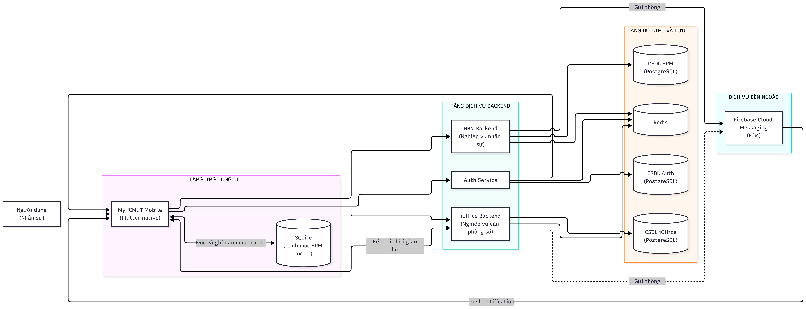
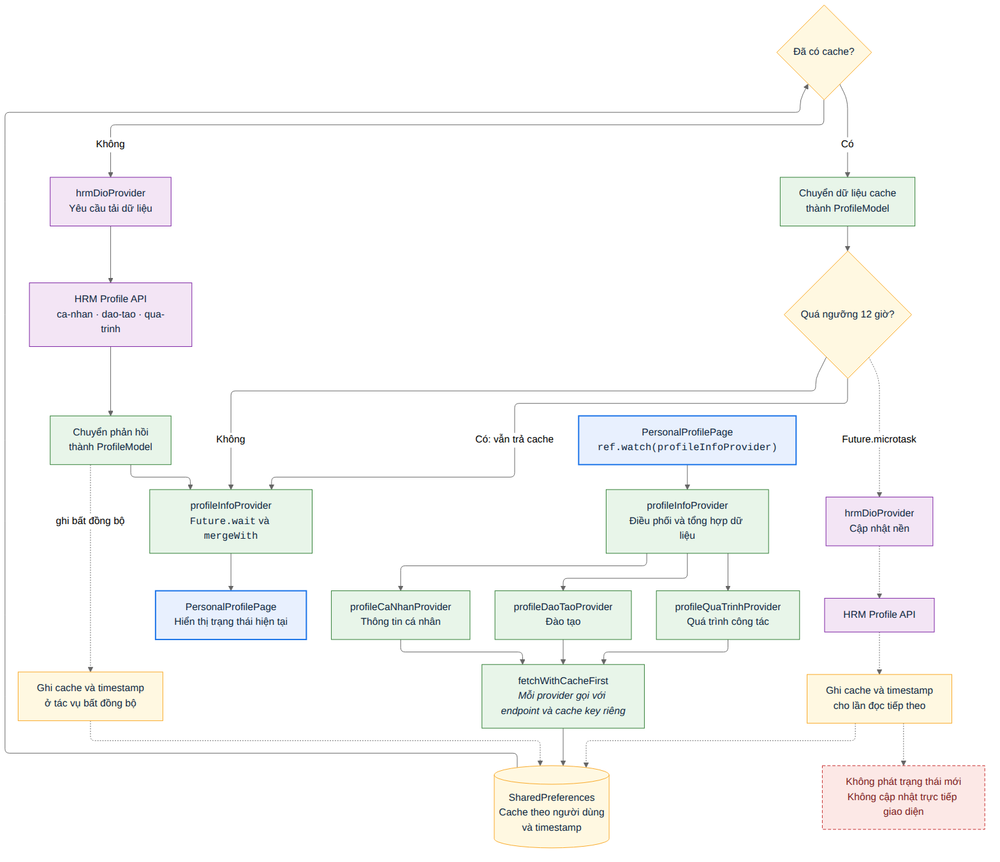
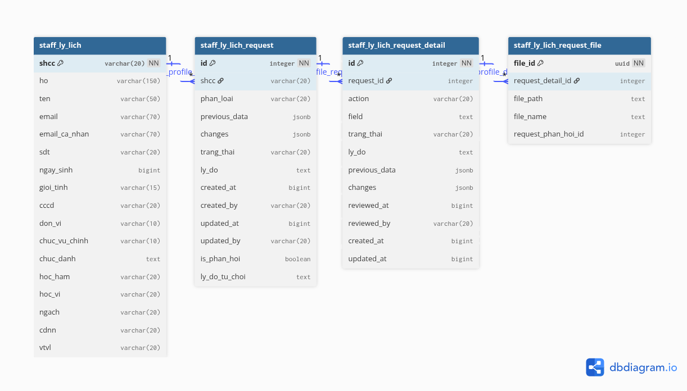
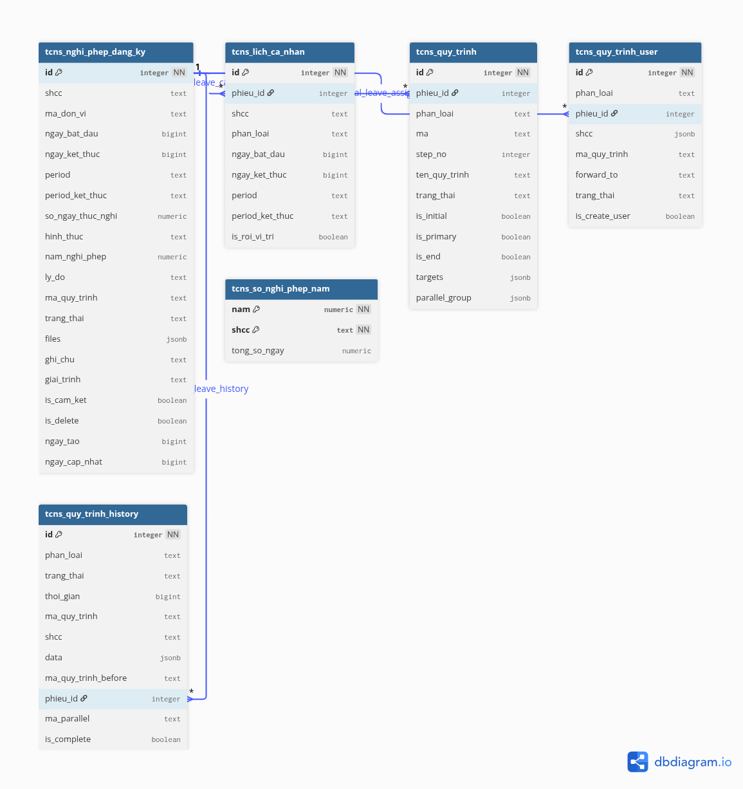
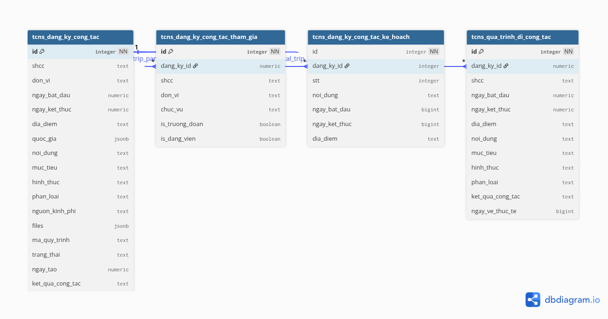
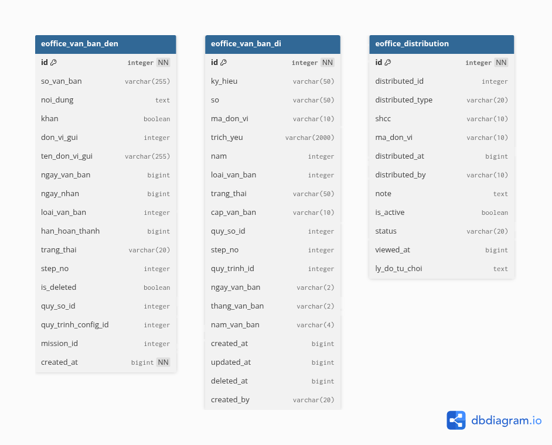
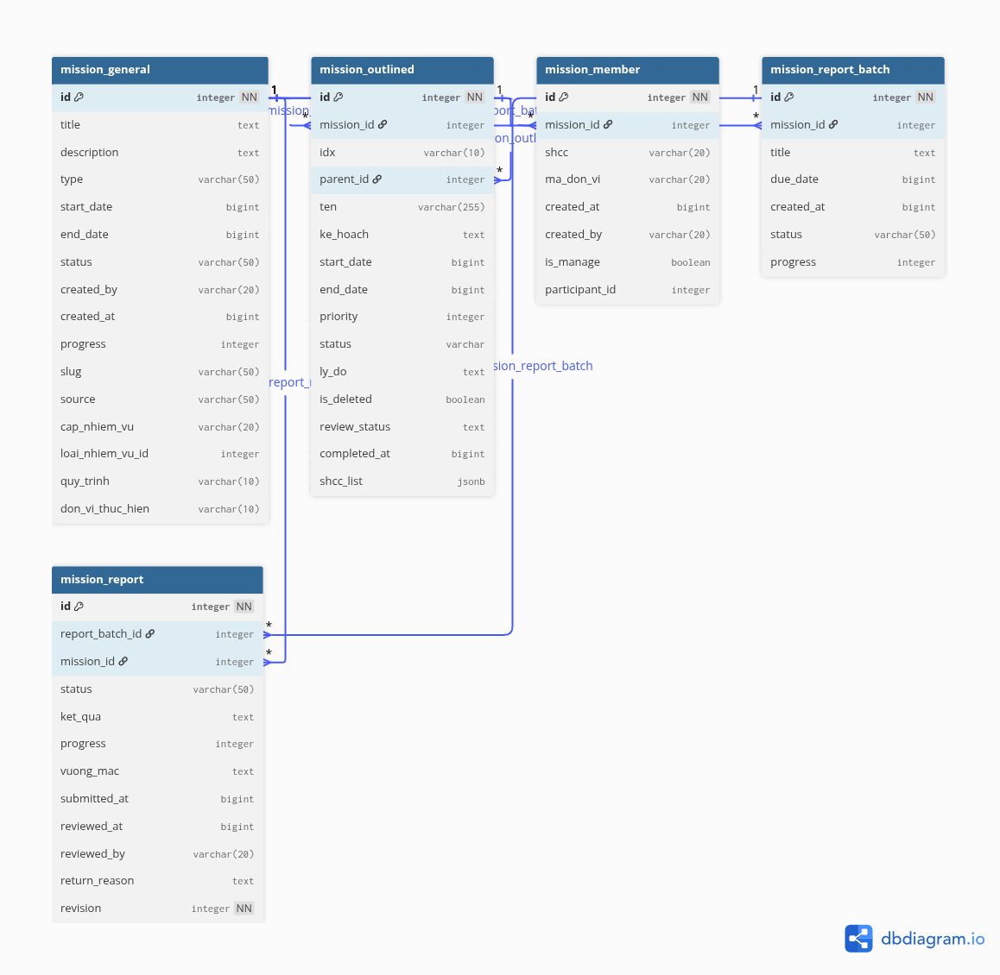
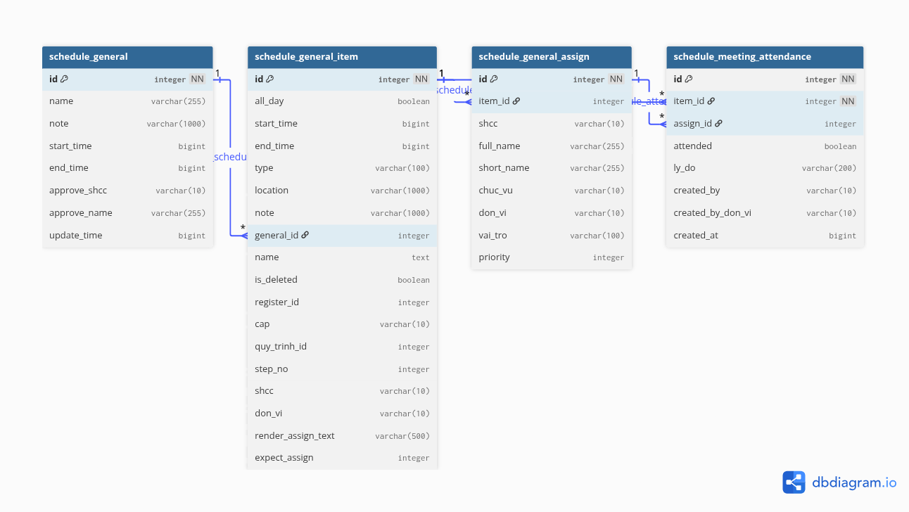
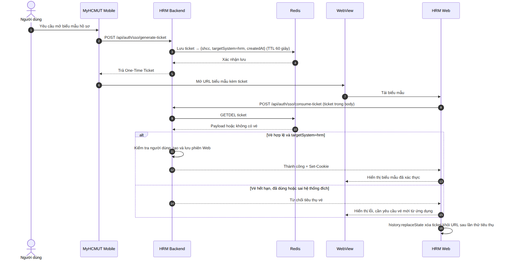

> **Trạng thái sau biên tập 01/10/2026:** bản Markdown này giữ thiết kế lịch sử. Nguồn hiện hành là các tệp LaTeX trong `Chapter5/`; hồ sơ đã chuyển native và có tích hợp tạo lịch. Không dùng mô tả WebView/SSO bên dưới làm hiện trạng. Xem `docs/14_REPORT_7_CHAPTER_AUDIT.md`, mục 10.

# CHƯƠNG 5. THIẾT KẾ HỆ THỐNG

Chương này trình bày thiết kế hệ thống MyHCMUT Mobile dựa trên các yêu cầu và quy trình nghiệp vụ đã phân tích ở Chương 4. Nội dung chương bao gồm kiến trúc tổng thể, kiến trúc các thành phần phần mềm, mô hình dữ liệu phục vụ các chức năng chính và những cơ chế tích hợp giữa ứng dụng di động với các hệ thống hiện hữu của Nhà trường.

---

## 5.1. Kiến trúc tổng thể hệ thống

Ứng dụng MyHCMUT Mobile được phát triển nhằm cung cấp một điểm truy cập trên thiết bị di động đến các chức năng nhân sự và văn phòng số của Trường Đại học Bách khoa – ĐHQG-HCM. Thay vì xây dựng lại các hệ thống nghiệp vụ hiện hữu, đề tài tập trung phát triển ứng dụng Flutter và bổ sung những điểm tích hợp cần thiết để khai thác chức năng, dữ liệu và quy trình xử lý từ HRM và iOffice.

Kiến trúc tổng thể của hệ thống được thể hiện tại Hình 5.1, gồm ứng dụng di động, các dịch vụ backend, giao diện HRM Web, tầng dữ liệu và các dịch vụ hỗ trợ. Trong đó, ứng dụng di động đảm nhiệm tương tác với người dùng và kết nối đến các hệ thống nghiệp vụ; các backend tiếp tục chịu trách nhiệm xác thực yêu cầu, kiểm tra quyền truy cập, xử lý nghiệp vụ và quản lý dữ liệu thuộc phạm vi của từng hệ thống.

*Hình 5.1: Kiến trúc tổng thể hệ thống MyHCMUT Mobile*

**Ứng dụng MyHCMUT Mobile** được xây dựng bằng Flutter, cung cấp giao diện cho các chức năng hồ sơ cán bộ, nghỉ phép, đi công tác, văn bản, nhiệm vụ, lịch công tác và điểm danh cuộc họp. Ứng dụng kết nối trực tiếp đến các backend thông qua API và sử dụng WebView để tái sử dụng biểu mẫu cập nhật hồ sơ cán bộ từ HRM Web.

**Auth Service** tiếp nhận yêu cầu đăng nhập và cấp thông tin xác thực cho ứng dụng di động. Sau khi đăng nhập thành công, ứng dụng sử dụng access token khi gửi yêu cầu đến HRM Backend và iOffice Backend. Mỗi backend tự xác thực token, thiết lập ngữ cảnh người dùng và kiểm tra quyền thực hiện nghiệp vụ tương ứng. Auth Service không đóng vai trò trung gian chuyển tiếp các yêu cầu nghiệp vụ giữa ứng dụng và hai backend này.

**HRM Backend** cung cấp các chức năng quản lý nhân sự, bao gồm hồ sơ cán bộ, nghỉ phép, đi công tác và các quy trình phê duyệt liên quan. Đề tài kế thừa các nghiệp vụ và quy trình hiện hữu, đồng thời bổ sung hoặc điều chỉnh một số API và cơ chế tích hợp để phục vụ ứng dụng di động. HRM Backend tiếp tục chịu trách nhiệm xử lý nghiệp vụ và quản lý dữ liệu nhân sự tại hệ thống nguồn.

**iOffice Backend** cung cấp các chức năng văn phòng số, bao gồm văn bản đến, văn bản đi, nhiệm vụ, lịch công tác và điểm danh cuộc họp. Ứng dụng di động chủ yếu khai thác các API hiện hữu của iOffice để hiển thị thông tin và thực hiện các thao tác được phép. Một số điều chỉnh payload thông báo phục vụ điều hướng sâu từ thiết bị di động được thực hiện tại các thành phần liên quan. Trong phạm vi hiện tại, ứng dụng sử dụng giao diện native và API của iOffice; iOffice Web không được xem là một luồng WebView đã tích hợp hoàn chỉnh.

**HRM Web** là giao diện Web hiện hữu được ứng dụng tái sử dụng để cập nhật hồ sơ cán bộ. Khi người dùng mở chức năng này, ứng dụng yêu cầu một vé xác thực dùng một lần và mở biểu mẫu trong WebView. HRM Web gửi vé đến HRM Backend để thiết lập phiên làm việc trên Web, sau đó người dùng có thể thao tác trên biểu mẫu mà không cần đăng nhập lại. Cơ chế chuyển tiếp phiên được trình bày chi tiết tại Mục 5.4.

**Tầng dữ liệu và lưu trữ hỗ trợ** gồm các cơ sở dữ liệu PostgreSQL riêng biệt của HRM và iOffice, cùng Redis phục vụ vé SSO và phiên Web. Ứng dụng di động không truy cập trực tiếp các thành phần lưu trữ này mà trao đổi dữ liệu thông qua backend tương ứng. Mỗi hệ thống nghiệp vụ tiếp tục quản lý dữ liệu và các quy tắc xử lý thuộc phạm vi của mình. Các nhóm dữ liệu liên quan trực tiếp đến ứng dụng được trình bày tại Mục 5.3.

Bên cạnh các kết nối API, ứng dụng tiếp nhận thông báo đẩy qua Firebase Cloud Messaging từ các hệ thống nghiệp vụ và sử dụng Socket.IO cho chức năng điểm danh cuộc họp theo thời gian thực. Ứng dụng cũng tổng hợp dữ liệu lịch từ HRM và iOffice để hiển thị trong một giao diện thống nhất. Các cơ chế tích hợp này được trình bày tại Mục 5.4.

Việc kết nối trực tiếp đến nhiều backend giúp đề tài tái sử dụng API hiện hữu và duy trì quyền xử lý nghiệp vụ tại từng hệ thống nguồn, nhưng đồng thời yêu cầu ứng dụng tự quản lý cấu hình kết nối, lỗi và trạng thái của từng miền dịch vụ. Việc tách các miền dịch vụ có thể giới hạn ảnh hưởng của sự cố theo từng nhóm chức năng; mức độ suy giảm cụ thể phụ thuộc vào những backend mà chức năng đang sử dụng.

Như vậy, phạm vi phát triển chính của đề tài là ứng dụng MyHCMUT Mobile và các phần mở rộng cần thiết để tích hợp với hệ thống hiện hữu. HRM Backend, iOffice Backend và các cơ sở dữ liệu nghiệp vụ tương ứng không được xây dựng mới trong phạm vi đồ án. Cấu trúc các thành phần và những điểm mở rộng phục vụ ứng dụng di động được trình bày tại mục tiếp theo.

---

## 5.2. Thiết kế các thành phần hệ thống

Mục này trình bày cách tổ chức ứng dụng MyHCMUT Mobile và các thành phần backend tham gia cung cấp chức năng cho ứng dụng. Nội dung tập trung vào cấu trúc mã nguồn, trách nhiệm của từng nhóm thành phần và phạm vi kế thừa, mở rộng các hệ thống hiện hữu nhằm phục vụ ứng dụng di động.

### 5.2.1. Thiết kế ứng dụng MyHCMUT Mobile

Ứng dụng MyHCMUT Mobile được phát triển bằng Flutter và tổ chức mã nguồn theo mô hình *monorepo*, gồm ứng dụng chính, các module nghiệp vụ và những package dùng chung. Ở cấp cao, mã nguồn được phân chia theo nhóm chức năng; bên trong từng module, các thành phần tiếp tục được tổ chức theo trách nhiệm như giao diện, quản lý trạng thái, mô hình dữ liệu và giao tiếp API.

*Hình 5.2: Cấu trúc monorepo của ứng dụng MyHCMUT Mobile*

Cấu trúc mã nguồn gồm ba nhóm chính:

- **Ứng dụng chính (`apps/myhcmut`):** Là điểm khởi chạy và kết hợp các module thành ứng dụng hoàn chỉnh. Thành phần này đảm nhiệm khởi tạo ứng dụng, cấu hình điều hướng, đăng ký các provider dùng chung và tổ chức các màn hình ở cấp ứng dụng.
- **Các module nghiệp vụ (`modules`):** Được tổ chức thành các nhóm HRM, iOffice và thông báo. Module HRM cung cấp các chức năng hồ sơ cán bộ, nghỉ phép, đi công tác và phê duyệt liên quan. Module iOffice cung cấp các chức năng văn bản, nhiệm vụ, lịch công tác và điểm danh cuộc họp. Module thông báo đảm nhiệm tiếp nhận, hiển thị thông báo và xử lý điều hướng đến chức năng tương ứng.
- **Các package dùng chung (`packages`):** Cung cấp những thành phần được nhiều module sử dụng, bao gồm giao tiếp mạng, quản lý thông tin xác thực, thành phần giao diện và các tiện ích hỗ trợ.

Cách tổ chức này giúp phân định phạm vi mã nguồn theo nhóm nghiệp vụ, đồng thời cho phép tái sử dụng các thành phần chung giữa nhiều module. Tuy nhiên, cấu trúc nội bộ không hoàn toàn giống nhau ở mọi chức năng; đề tài không áp đặt một chuỗi lớp xử lý cố định cho toàn bộ ứng dụng.

**Luồng xử lý chức năng hồ sơ cán bộ.** Chức năng hồ sơ cán bộ được lựa chọn để minh họa cách các thành phần Flutter phối hợp trong một luồng xử lý thực tế. Màn hình `PersonalProfilePage` theo dõi trạng thái từ `profileInfoProvider`; provider này tổng hợp dữ liệu từ ba provider thành phần tương ứng với thông tin cá nhân, đào tạo và quá trình công tác. Mỗi provider thành phần sử dụng `fetchWithCacheFirst` để đọc dữ liệu cục bộ hoặc gọi HRM Backend thông qua `hrmDioProvider`. Kết quả được chuyển thành `ProfileModel`, hợp nhất và cung cấp lại cho giao diện.

*Hình 5.3: Luồng tải và lưu đệm dữ liệu hồ sơ cán bộ*

Luồng trên là ví dụ minh họa, không phải cấu trúc bắt buộc của mọi module. Tùy theo yêu cầu nghiệp vụ, các chức năng khác có thể tổ chức provider và thành phần xử lý dữ liệu theo cách khác nhau. Những quy tắc ảnh hưởng đến dữ liệu chính thức vẫn được kiểm tra tại backend.

**Các thành phần dùng chung.** Ứng dụng sử dụng các Dio instance được cấu hình theo địa chỉ của Auth Service, HRM Backend và iOffice Backend. Các instance dùng chung cơ chế quản lý token và gắn thông tin xác thực vào yêu cầu. Trong phiên bản hiện tại, ba miền dịch vụ sử dụng cùng access token do Auth Service cấp. Riverpod quản lý trạng thái phục vụ giao diện, còn GoRouter tổ chức điều hướng giữa các màn hình, bao gồm điều hướng đến chức năng tương ứng từ thông báo. Cơ chế xác thực được trình bày chi tiết tại mục 5.4.

**Bộ nhớ đệm và lưu trữ cục bộ.** Dữ liệu hồ sơ được lưu theo từng người dùng trong `SharedPreferences`. Mốc 12 giờ là ngưỡng đánh giá độ mới, không phải thời hạn tự động xóa dữ liệu. Khi cache còn mới, ứng dụng sử dụng dữ liệu cục bộ mà không gọi mạng. Khi cache quá ngưỡng, ứng dụng vẫn trả dữ liệu hiện có để hiển thị và thử cập nhật cache trong nền.

Nếu cập nhật nền thất bại, dữ liệu cũ được giữ lại. Nếu thành công, dữ liệu mới được lưu để sử dụng ở lần đọc tiếp theo, nhưng tác vụ này không tự làm mới ngay giao diện đang hiển thị. Khi chưa có cache, ứng dụng cần kết nối đến HRM Backend để tải hồ sơ.

Ngoài dữ liệu hồ sơ, một số danh mục tham chiếu của HRM được lưu trong SQLite. Khả năng xem dữ liệu khi mất mạng được hỗ trợ đối với hồ sơ đã có cache; ứng dụng không hỗ trợ tạo, gửi hoặc phê duyệt phiếu ngoại tuyến rồi đồng bộ về sau. Vì vậy, cơ chế này được xác định là bộ nhớ đệm và lưu trữ cục bộ, không phải kiến trúc *offline-first*.

### 5.2.2. Các backend hiện hữu và phạm vi mở rộng

MyHCMUT Mobile tích hợp với Auth Service, HRM Backend và iOffice Backend. Đây là các hệ thống hiện hữu; đề tài không xây dựng lại toàn bộ kiến trúc backend hoặc cơ sở dữ liệu nghiệp vụ của chúng. Phần phát triển phía backend tập trung vào các API và cơ chế tích hợp cần thiết để hỗ trợ ứng dụng di động.

**Auth Service** cung cấp chức năng đăng nhập và cấp token cho ứng dụng. Sau khi nhận token, ứng dụng gửi yêu cầu trực tiếp đến HRM Backend hoặc iOffice Backend tùy theo chức năng được sử dụng. Các backend tự xác thực yêu cầu và kiểm tra quyền truy cập nghiệp vụ. Trong phạm vi đề tài, nhóm tích hợp ứng dụng với dịch vụ xác thực hiện hữu, không xây dựng mới một hệ thống xác thực độc lập.

**HRM Backend** cung cấp các module nghiệp vụ hồ sơ cán bộ, nghỉ phép, đi công tác và quy trình phê duyệt. Trong cấu trúc mã nguồn hiện hữu, middleware được gắn khi đăng ký route để xử lý các yêu cầu dùng chung như xác thực và phân quyền. Controller hoặc handler tiếp nhận yêu cầu và điều phối xử lý; tùy từng module, thành phần này có thể làm việc trực tiếp với model hoặc thông qua service/helper.

Đề tài kế thừa các nghiệp vụ, quy trình và dữ liệu HRM hiện hữu, đồng thời bổ sung hoặc điều chỉnh một số điểm tích hợp phục vụ ứng dụng di động, bao gồm API hồ sơ, kiểm tra điều kiện nghỉ phép, đăng ký token thiết bị, metadata thông báo và cơ chế cấp, tiêu thụ vé SSO. Các phần mở rộng này hỗ trợ ứng dụng khai thác hệ thống HRM mà không chuyển quyền xử lý nghiệp vụ hoặc quản lý dữ liệu chính thức sang thiết bị di động.

**iOffice Backend** cung cấp các module văn bản, nhiệm vụ, lịch công tác và điểm danh cuộc họp. Ứng dụng di động chủ yếu khai thác API hiện hữu của những module này để truy xuất dữ liệu và thực hiện các thao tác được cấp quyền.

Các điều chỉnh phục vụ mobile tại iOffice gồm bổ sung metadata điều hướng cho thông báo và thành phần tiêu thụ vé SSO. Tại mốc mã nguồn được đối chiếu, các thay đổi này còn nằm trong *working tree* và chưa có bằng chứng kiểm thử liên hệ thống cho toàn bộ luồng Mobile $\rightarrow$ iOffice Web $\rightarrow$ iOffice Backend. Vì vậy, khả năng tiêu thụ vé SSO phía iOffice được trình bày là phần tích hợp đã có trong mã nguồn, không phải một chức năng iOffice WebView đã hoàn tất.

**Bảng 5.1. Phạm vi kế thừa và phát triển các thành phần hệ thống**

| Thành phần | Phần kế thừa | Phần nhóm phát triển hoặc tích hợp |
|---|---|---|
| MyHCMUT Mobile | Không áp dụng | Phát triển ứng dụng Flutter, các module nghiệp vụ, thành phần dùng chung, giao tiếp API, lịch tổng hợp, WebView và xử lý thông báo |
| Auth Service | Chức năng đăng nhập và cấp token | Tích hợp ứng dụng di động với dịch vụ xác thực hiện hữu |
| HRM Backend | Nghiệp vụ hồ sơ, nghỉ phép, đi công tác, quy trình phê duyệt và dữ liệu nhân sự | Bổ sung hoặc điều chỉnh API phục vụ mobile, kiểm tra nghỉ phép, đăng ký token thiết bị, metadata thông báo và One-Time Ticket SSO |
| iOffice Backend | Nghiệp vụ văn bản, nhiệm vụ, lịch công tác, điểm danh và dữ liệu văn phòng số | Tích hợp API hiện hữu; bổ sung metadata thông báo và thành phần tiêu thụ vé SSO theo trạng thái hiện thực của phiên bản đồ án |

Như vậy, ứng dụng Flutter là thành phần phát triển chính của đề tài, trong khi các backend hiện hữu tiếp tục đảm nhiệm xử lý nghiệp vụ và quản lý dữ liệu. Những phần mở rộng phía backend đóng vai trò hỗ trợ tích hợp, cho phép ứng dụng di động sử dụng các chức năng sẵn có mà không phải xây dựng lại hệ thống nguồn.

---

## 5.3. Mô hình dữ liệu phục vụ ứng dụng

Mục này trình bày các nhóm dữ liệu nghiệp vụ liên quan trực tiếp đến MyHCMUT Mobile. HRM và iOffice sử dụng hai cơ sở dữ liệu PostgreSQL riêng biệt đã tồn tại trước đề tài; nhóm không thiết kế mới toàn bộ cơ sở dữ liệu của hai hệ thống. Các mô hình được rút gọn từ schema thực tế và chỉ giữ những bảng, trường dữ liệu và quan hệ cần thiết để giải thích hoạt động của ứng dụng.

Trong các ERD, đường màu xanh biểu diễn khóa ngoại vật lý đã được xác nhận từ schema, còn đường màu cam biểu diễn liên kết logic do backend duy trì. Ký hiệu khóa chính, duy nhất và không rỗng chỉ được sử dụng khi có constraint vật lý tương ứng. Các tệp DBML phục vụ trực quan hóa báo cáo, không được sử dụng để sinh migration hoặc thay thế schema đang vận hành.

### 5.3.1. Tổng quan mô hình dữ liệu

Dữ liệu nghiệp vụ được phân thành hai miền theo hệ thống sở hữu:

- **Miền dữ liệu HRM:** Bao gồm hồ sơ cán bộ và yêu cầu cập nhật hồ sơ, đăng ký nghỉ phép, hạn mức phép năm, quy trình xử lý phiếu, đăng ký đi công tác và các thông tin liên quan. HRM Backend chịu trách nhiệm kiểm tra nghiệp vụ, cập nhật trạng thái và quản lý dữ liệu chính thức của miền này.
- **Miền dữ liệu iOffice:** Bao gồm văn bản đến, văn bản đi, thông tin phân phối xử lý, nhiệm vụ, báo cáo tiến độ, lịch công tác và điểm danh cuộc họp. iOffice Backend tiếp tục quản lý quyền truy cập, quy trình xử lý và dữ liệu chính thức của miền văn phòng số.

Ứng dụng di động không truy cập trực tiếp hai cơ sở dữ liệu mà trao đổi dữ liệu thông qua API của backend tương ứng. Hình 5.4 kết hợp các bảng đại diện của hai miền để thể hiện phạm vi dữ liệu phục vụ ứng dụng; đây là ERD tổng quan rút gọn, không phải một cơ sở dữ liệu hợp nhất. Giữa HRM và iOffice không có khóa ngoại chéo. Khi cần lịch làm việc tổng hợp, ứng dụng gọi các API độc lập và hợp nhất mô hình hiển thị tại phía client.

Redis, token thiết bị và dữ liệu thông báo không thuộc các ERD nghiệp vụ của mục này. Vai trò của chúng được trình bày cùng các cơ chế SSO và thông báo tại mục 5.4; bộ nhớ đệm và SQLite cục bộ trên thiết bị đã được trình bày tại mục 5.2.1.

*Hình 5.4: ERD tổng quan các miền dữ liệu phục vụ MyHCMUT Mobile — nguồn `schema-overview.dbml`*

### 5.3.2. Dữ liệu quản lý hồ sơ cá nhân

Dữ liệu hồ sơ cán bộ thuộc phạm vi quản lý của HRM. Bảng `staff_ly_lich` lưu hồ sơ chính thức, được định danh bằng khóa chính `shcc`. Ứng dụng di động khai thác một phần thông tin từ bảng này thông qua HRM Backend để hiển thị thông tin cá nhân, liên hệ, đơn vị công tác, chức danh và trình độ.

Tùy theo chính sách cập nhật của từng trường thông tin, HRM Backend có thể ghi trực tiếp một số thay đổi vào hồ sơ chính thức hoặc tiếp nhận đề xuất cần thẩm định. Với nhánh cần thẩm định, yêu cầu được lưu tại `staff_ly_lich_request`, nội dung thay đổi theo từng trường tại `staff_ly_lich_request_detail` và tệp minh chứng tại `staff_ly_lich_request_file`; chỉ những thay đổi được chấp thuận mới được phản ánh vào hồ sơ chính thức. Không kết luận về tính nguyên tử khi một lần gửi chứa cả hai loại trường nếu chưa có bằng chứng từ implementation.

Ba liên hệ qua `shcc`, `request_id` và `request_detail_id` trong Hình 5.5 là quan hệ logic được HRM Backend sử dụng khi xử lý dữ liệu. Schema được đối chiếu chưa khai báo các trường này thành khóa ngoại vật lý.

*Hình 5.5: Lược đồ dữ liệu rút gọn của phân hệ hồ sơ cá nhân — nguồn `schema-profile.dbml`*

**Bảng 5.2. Từ điển dữ liệu rút gọn của phân hệ hồ sơ cá nhân**

Trong các bảng từ điển dưới đây, dấu “—” chỉ rằng bản rút gọn không nêu ràng buộc vật lý cho trường đó; không thể suy ra trường cho phép hay không cho phép `NULL` chỉ từ ký hiệu này.

Tùy theo chính sách cập nhật của từng trường, HRM Backend có thể ghi trực tiếp thay đổi vào hồ sơ chính thức hoặc tiếp nhận đề xuất cần thẩm định. Với nhánh cần thẩm định, đề xuất được lưu trong các bảng request, detail và file; không suy rộng rằng mọi thay đổi đều đi qua quy trình này. Tính nguyên tử khi một lần gửi chứa cả hai loại trường không được kết luận trong mục này.

| Bảng | Trường | Kiểu dữ liệu | Ràng buộc vật lý | Vai trò |
| :--- | :--- | :--- | :--- | :--- |
| `staff_ly_lich` | `shcc` | `varchar` | PK, NOT NULL | Mã định danh cán bộ. |
|  | `ho` | `varchar` | — | Họ và tên đệm. |
|  | `ten` | `varchar` | — | Tên cán bộ. |
|  | `email` | `varchar` | — | Email công vụ. |
|  | `email_ca_nhan` | `varchar` | — | Email cá nhân. |
|  | `sdt` | `varchar` | — | Số điện thoại liên hệ. |
|  | `don_vi` | `varchar` | — | Mã đơn vị công tác. |
|  | `chuc_vu_chinh` | `varchar` | — | Mã chức vụ chính. |
|  | `chuc_danh` | `text` | — | Chức danh khoa học hoặc nghề nghiệp. |
| `staff_ly_lich_request` | `id` | `integer` | PK, tự tăng, NOT NULL | Định danh yêu cầu cập nhật. |
|  | `shcc` | `varchar` | — | Liên kết logic đến hồ sơ cán bộ. |
|  | `changes` | `jsonb` | — | Nội dung thay đổi được đề xuất. |
|  | `trang_thai` | `varchar` | — | Trạng thái xử lý yêu cầu. |
| `staff_ly_lich_request_detail` | `id` | `integer` | PK, tự tăng, NOT NULL | Định danh chi tiết yêu cầu. |
|  | `request_id` | `integer` | — | Liên kết logic đến yêu cầu. |
|  | `field` | `text` | — | Tên trường được đề xuất thay đổi. |
|  | `changes` | `jsonb` | — | Giá trị thay đổi được đề xuất. |
| `staff_ly_lich_request_file` | `file_id` | `uuid` | PK, NOT NULL | Định danh tệp minh chứng. |
|  | `request_detail_id` | `integer` | — | Liên kết logic đến chi tiết yêu cầu. |

### 5.3.3. Dữ liệu quản lý nghỉ phép

Dữ liệu nghỉ phép được tổ chức quanh bảng `tcns_nghi_phep_dang_ky`. Mỗi bản ghi lưu thông tin phiếu như cán bộ đăng ký, khoảng thời gian nghỉ, hình thức nghỉ, mã quy trình và trạng thái xử lý hiện tại.

Bảng `tcns_lich_ca_nhan` ghi nhận khoảng thời gian của phiếu trên lịch cá nhân. Các bảng `tcns_quy_trinh`, `tcns_quy_trinh_user` và `tcns_quy_trinh_history` lần lượt biểu diễn bước xử lý, người tham gia và lịch sử thay đổi trạng thái. Bảng `tcns_so_nghi_phep_nam` lưu tổng số ngày phép theo từng cán bộ và năm.

Schema hiện hữu xác nhận khóa chính vật lý của các bảng chính và khóa chính phức hợp `(nam, shcc)` của `tcns_so_nghi_phep_nam`. Ngược lại, các liên hệ bằng `phieu_id` và `shcc` trong Hình 5.6 là quan hệ logic, chưa được khai báo thành khóa ngoại vật lý. Việc kiểm tra điều kiện nghỉ phép, trạng thái quy trình và cập nhật số ngày phép do HRM Backend thực hiện trong luồng nghiệp vụ; các kiểm tra này không được xem là constraint của cơ sở dữ liệu.

*Hình 5.6: Lược đồ dữ liệu rút gọn của phân hệ nghỉ phép — nguồn `schema-leave.dbml`*

**Bảng 5.3. Từ điển dữ liệu rút gọn của phân hệ nghỉ phép**

| Bảng | Trường | Kiểu dữ liệu | Ràng buộc vật lý | Vai trò |
| :--- | :--- | :--- | :--- | :--- |
| `tcns_nghi_phep_dang_ky` | `id` | `integer` | PK, tự tăng, NOT NULL | Định danh phiếu nghỉ phép. |
|  | `shcc` | `text` | — | Mã cán bộ đăng ký. |
|  | `ma_don_vi` | `text` | — | Đơn vị công tác. |
|  | `ngay_bat_dau` | `bigint` | — | Thời điểm bắt đầu nghỉ. |
|  | `ngay_ket_thuc` | `bigint` | — | Thời điểm kết thúc nghỉ. |
|  | `period` | `text` | — | Buổi bắt đầu nghỉ. |
|  | `period_ket_thuc` | `text` | — | Buổi kết thúc nghỉ. |
|  | `so_ngay_thuc_nghi` | `numeric` | — | Số ngày nghỉ thực tế. |
|  | `trang_thai` | `text` | — | Trạng thái hiện tại của phiếu. |
| `tcns_lich_ca_nhan` | `id` | `integer` | PK, tự tăng, NOT NULL | Định danh bản ghi lịch. |
|  | `phieu_id` | `integer` | — | Liên kết logic đến phiếu nghỉ phép. |
|  | `ngay_bat_dau` | `bigint` | — | Thời điểm bắt đầu hiển thị trên lịch. |
|  | `ngay_ket_thuc` | `bigint` | — | Thời điểm kết thúc hiển thị trên lịch. |
|  | `period` | `text` | — | Buổi bắt đầu nghỉ. |
|  | `period_ket_thuc` | `text` | — | Buổi kết thúc nghỉ. |
| `tcns_quy_trinh` | `id` | `integer` | PK, tự tăng, NOT NULL | Định danh bước quy trình. |
|  | `phieu_id` | `integer` | — | Liên kết logic đến phiếu. |
|  | `ma` | `text` | — | Mã bước xử lý. |
|  | `step_no` | `integer` | — | Thứ tự bước. |
|  | `trang_thai` | `text` | — | Trạng thái bước. |
|  | `is_initial` | `boolean` | — | Đánh dấu bước khởi đầu. |
|  | `is_end` | `boolean` | — | Đánh dấu bước kết thúc. |
|  | `targets` | `jsonb` | — | Cấu hình đối tượng xử lý. |
|  | `parallel_group` | `jsonb` | — | Cấu hình nhánh song song. |
| `tcns_quy_trinh_user` | `id` | `integer` | PK, tự tăng, NOT NULL | Định danh phân công xử lý. |
|  | `phieu_id` | `integer` | — | Liên kết logic đến phiếu. |
|  | `shcc` | `jsonb` | — | Danh sách cán bộ được phân công. |
|  | `ma_quy_trinh` | `text` | — | Mã bước được phân công. |
|  | `forward_to` | `text` | — | Thông tin chuyển tiếp. |
|  | `trang_thai` | `text` | — | Trạng thái xử lý. |
| `tcns_quy_trinh_history` | `id` | `integer` | PK, tự tăng, NOT NULL | Định danh lịch sử xử lý. |
|  | `phieu_id` | `integer` | — | Liên kết logic đến phiếu. |
|  | `ma_quy_trinh` | `text` | — | Mã bước xử lý. |
|  | `shcc` | `text` | — | Mã cán bộ thao tác. |
|  | `trang_thai` | `text` | — | Trạng thái được ghi nhận. |
|  | `thoi_gian` | `bigint` | — | Thời điểm thao tác. |
|  | `data` | `jsonb` | — | Dữ liệu vết xử lý. |
| `tcns_so_nghi_phep_nam` | `nam` | `numeric` | PK ghép `(nam, shcc)`, NOT NULL | Thành phần thứ nhất của khóa chính ghép, theo thứ tự schema. |
|  | `shcc` | `text` | PK ghép `(nam, shcc)`, NOT NULL | Thành phần thứ hai; liên kết logic đến hồ sơ cán bộ. |
|  | `tong_so_ngay` | `numeric` | — | Tổng số ngày phép năm. |

### 5.3.4. Dữ liệu quản lý công tác

Dữ liệu đi công tác thuộc miền HRM và được tổ chức quanh bảng `tcns_dang_ky_cong_tac`. Bảng này lưu nội dung phiếu, thời gian, địa điểm, mục tiêu, nguồn kinh phí, mã quy trình và trạng thái xử lý.

Danh sách cán bộ tham gia được lưu tại `tcns_dang_ky_cong_tac_tham_gia`; các mốc kế hoạch được lưu tại `tcns_dang_ky_cong_tac_ke_hoach`; kết quả được ghi nhận vào quá trình công tác tại `tcns_qua_trinh_di_cong_tac`. Các bảng này liên hệ với phiếu thông qua `dang_ky_id`. Đây là quan hệ logic do HRM Backend duy trì, không phải khóa ngoại vật lý trong schema được đối chiếu. Đáng chú ý, trường `id` của bảng kế hoạch được sinh tự động và không rỗng nhưng chưa được khai báo là khóa chính vật lý.

Ứng dụng di động khai thác các bảng này thông qua API để phục vụ việc đăng ký, tra cứu, theo dõi trạng thái phiếu và hiển thị lịch công tác.

*Hình 5.7: Lược đồ dữ liệu rút gọn của phân hệ công tác — nguồn `schema-business_trip.dbml`*

**Bảng 5.4. Từ điển dữ liệu rút gọn của phân hệ công tác**

| Bảng | Trường | Kiểu dữ liệu | Ràng buộc vật lý | Vai trò |
| :--- | :--- | :--- | :--- | :--- |
| `tcns_dang_ky_cong_tac` | `id` | `integer` | PK, tự tăng, NOT NULL | Định danh phiếu công tác. |
|  | `shcc` | `text` | — | Mã cán bộ đăng ký. |
|  | `don_vi` | `text` | — | Đơn vị công tác. |
|  | `ngay_bat_dau` | `numeric` | — | Ngày bắt đầu chuyến đi. |
|  | `ngay_ket_thuc` | `numeric` | — | Ngày kết thúc chuyến đi. |
|  | `dia_diem` | `text` | — | Địa điểm công tác. |
|  | `quoc_gia` | `jsonb` | — | Thông tin quốc gia của chuyến đi. |
|  | `noi_dung` | `text` | — | Nội dung chuyến công tác. |
|  | `muc_tieu` | `text` | — | Mục tiêu chuyến đi. |
|  | `trang_thai` | `text` | — | Trạng thái phiếu. |
| `tcns_dang_ky_cong_tac_tham_gia` | `id` | `integer` | PK, tự tăng, NOT NULL | Định danh thành viên. |
|  | `dang_ky_id` | `numeric` | — | Liên kết logic đến phiếu công tác. |
|  | `shcc` | `text` | — | Mã cán bộ tham gia. |
|  | `don_vi` | `text` | — | Đơn vị công tác của thành viên. |
| `tcns_dang_ky_cong_tac_ke_hoach` | `id` | `integer` | Tự tăng, NOT NULL; không khai báo PK | Định danh kỹ thuật của mốc kế hoạch. |
|  | `dang_ky_id` | `integer` | — | Liên kết logic đến phiếu công tác. |
|  | `stt` | `integer` | — | Thứ tự mốc kế hoạch. |
|  | `noi_dung` | `text` | — | Nội dung hoạt động. |
|  | `ngay_bat_dau` | `bigint` | — | Thời điểm bắt đầu hoạt động. |
|  | `ngay_ket_thuc` | `bigint` | — | Thời điểm kết thúc hoạt động. |
|  | `dia_diem` | `text` | — | Địa điểm hoạt động. |
| `tcns_qua_trinh_di_cong_tac` | `id` | `integer` | PK, tự tăng, NOT NULL | Định danh quá trình công tác. |
|  | `dang_ky_id` | `numeric` | — | Liên kết logic đến phiếu công tác. |
|  | `shcc` | `text` | — | Mã cán bộ thực hiện chuyến đi. |
|  | `ngay_bat_dau` | `numeric` | — | Thời gian bắt đầu theo kế hoạch. |
|  | `ngay_ket_thuc` | `numeric` | — | Thời gian kết thúc theo kế hoạch. |
|  | `ngay_ve_thuc_te` | `bigint` | — | Thời điểm trở về thực tế. |
|  | `ket_qua_cong_tac` | `text` | — | Kết quả chuyến công tác. |

### 5.3.5. Dữ liệu văn phòng số, nhiệm vụ và lịch công tác

Dữ liệu iOffice được chia thành ba nhóm để sơ đồ và từ điển dữ liệu có thể đọc được trong báo cáo. Trong các bảng được đối chiếu, chỉ hai quan hệ từ `mission_report_batch.mission_id` và `mission_report.mission_id` đến `mission_general.id` là khóa ngoại vật lý; các quan hệ còn lại do iOffice Backend duy trì.

#### Dữ liệu văn bản

`eoffice_van_ban_den` và `eoffice_van_ban_di` lưu văn bản đến và văn bản đi; `eoffice_distribution` lưu người hoặc đơn vị nhận xử lý. `distributed_id` là liên kết đa hình được diễn giải theo `distributed_type`, nên không thể khai báo thành một FK đơn.

*Hình 5.8: Lược đồ dữ liệu rút gọn của nhóm văn bản iOffice — nguồn `schema-ioffice-documents.dbml`*

**Bảng 5.5. Từ điển dữ liệu rút gọn của nhóm văn bản iOffice**

| Bảng | Trường | Kiểu dữ liệu | Ràng buộc vật lý | Vai trò |
| :--- | :--- | :--- | :--- | :--- |
| `eoffice_van_ban_den` | `id` | `integer` | PK, tự tăng, NOT NULL | Định danh văn bản đến. |
|  | `so_van_ban` | `varchar` | — | Số hiệu văn bản. |
|  | `noi_dung` | `text` | — | Nội dung tóm tắt văn bản. |
|  | `ngay_van_ban` | `bigint` | — | Ngày ban hành. |
|  | `ngay_nhan` | `bigint` | — | Ngày tiếp nhận. |
|  | `han_hoan_thanh` | `bigint` | — | Hạn xử lý văn bản. |
|  | `trang_thai` | `varchar` | — | Trạng thái xử lý. |
|  | `mission_id` | `integer` | — | Liên kết logic đến nhiệm vụ phát sinh. |
|  | `created_at` | `bigint` | NOT NULL | Thời điểm tạo bản ghi. |
| `eoffice_van_ban_di` | `id` | `integer` | PK, tự tăng, NOT NULL | Định danh văn bản đi. |
|  | `ky_hieu` | `varchar` | — | Ký hiệu văn bản. |
|  | `so` | `varchar` | — | Số hiệu văn bản. |
|  | `trich_yeu` | `varchar` | — | Trích yếu nội dung. |
|  | `trang_thai` | `varchar` | — | Trạng thái xử lý. |
| `eoffice_distribution` | `id` | `integer` | PK, tự tăng, NOT NULL | Định danh bản ghi phân phối. |
|  | `distributed_id` | `integer` | — | Thành phần định danh liên kết đa hình. |
|  | `distributed_type` | `varchar` | — | Loại đối tượng được phân phối. |
|  | `shcc` | `varchar` | — | Cán bộ nhận xử lý. |
|  | `ma_don_vi` | `varchar` | — | Đơn vị nhận xử lý. |
|  | `status` | `varchar` | — | Trạng thái tiếp nhận và xử lý. |

#### Dữ liệu nhiệm vụ

`mission_general` lưu nhiệm vụ tổng quát; `mission_outlined` tạo cây đầu việc bằng `parent_id`; `mission_member` lưu thành viên; hai bảng báo cáo lưu các đợt và kết quả tiến độ.

*Hình 5.9: Lược đồ dữ liệu rút gọn của nhóm nhiệm vụ iOffice — nguồn `schema-ioffice-missions.dbml`*

**Bảng 5.6. Từ điển dữ liệu rút gọn của nhóm nhiệm vụ iOffice**

| Bảng | Trường | Kiểu dữ liệu | Ràng buộc vật lý | Vai trò |
| :--- | :--- | :--- | :--- | :--- |
| `mission_general` | `id` | `integer` | PK, tự tăng, NOT NULL | Định danh nhiệm vụ tổng quát. |
|  | `title` | `text` | — | Tiêu đề nhiệm vụ. |
|  | `start_date` | `bigint` | — | Thời điểm bắt đầu. |
|  | `end_date` | `bigint` | — | Hạn hoàn thành. |
|  | `status` | `varchar` | — | Trạng thái thực hiện. |
|  | `progress` | `integer` | — | Tiến độ hoàn thành. |
| `mission_outlined` | `id` | `integer` | PK, NOT NULL | Định danh đầu việc. |
|  | `mission_id` | `integer` | — | Liên kết logic đến nhiệm vụ. |
|  | `parent_id` | `integer` | — | Liên kết logic đến đầu việc cha. |
|  | `ten` | `varchar` | — | Tên đầu việc. |
|  | `status` | `varchar` | — | Trạng thái đầu việc. |
| `mission_member` | `id` | `integer` | PK, tự tăng, NOT NULL | Định danh thành viên. |
|  | `mission_id` | `integer` | — | Liên kết logic đến nhiệm vụ. |
|  | `shcc` | `varchar` | — | Mã cán bộ tham gia. |
|  | `is_manage` | `boolean` | — | Vai trò quản lý đầu việc. |
| `mission_report_batch` | `id` | `integer` | PK, tự tăng, NOT NULL | Định danh đợt báo cáo. |
|  | `mission_id` | `integer` | FK → `mission_general.id` | Nhiệm vụ cần báo cáo. |
|  | `title` | `text` | — | Tiêu đề đợt báo cáo. |
|  | `due_date` | `bigint` | — | Hạn nộp báo cáo. |
|  | `status` | `varchar` | — | Trạng thái đợt báo cáo. |
| `mission_report` | `id` | `integer` | PK, tự tăng, NOT NULL | Định danh báo cáo. |
|  | `mission_id` | `integer` | FK → `mission_general.id` | Nhiệm vụ được báo cáo. |
|  | `report_batch_id` | `integer` | — | Liên kết logic đến đợt báo cáo. |
|  | `status` | `varchar` | — | Trạng thái báo cáo. |
|  | `progress` | `integer` | — | Tiến độ tự đánh giá. |

#### Dữ liệu lịch và điểm danh

Lịch tổng quát gồm các sự kiện và danh sách phân công tham dự. Các liên kết qua `general_id`, `item_id` và `assign_id` là liên kết logic. Schema hiện tại chưa có `UNIQUE(item_id, created_by)`, vì vậy việc ngăn bản ghi điểm danh trùng phụ thuộc vào kiểm tra của backend.

*Hình 5.10: Lược đồ dữ liệu rút gọn của nhóm lịch và điểm danh iOffice — nguồn `schema-ioffice-schedule.dbml`*

**Bảng 5.7. Từ điển dữ liệu rút gọn của nhóm lịch và điểm danh iOffice**

| Bảng | Trường | Kiểu dữ liệu | Ràng buộc vật lý | Vai trò |
| :--- | :--- | :--- | :--- | :--- |
| `schedule_general` | `id` | `integer` | PK, tự tăng, NOT NULL | Định danh lịch tổng quát. |
|  | `name` | `varchar` | — | Tên lịch. |
| `schedule_general_item` | `id` | `integer` | PK, tự tăng, NOT NULL | Định danh sự kiện. |
|  | `general_id` | `integer` | — | Liên kết logic đến lịch tổng quát. |
|  | `name` | `text` | — | Tên sự kiện hoặc cuộc họp. |
|  | `start_time` | `bigint` | — | Thời điểm bắt đầu. |
|  | `end_time` | `bigint` | — | Thời điểm kết thúc. |
| `schedule_general_assign` | `id` | `integer` | PK, tự tăng, NOT NULL | Định danh phân công tham dự. |
|  | `item_id` | `integer` | — | Liên kết logic đến sự kiện. |
|  | `shcc` | `varchar` | — | Cán bộ được phân công. |
|  | `vai_tro` | `varchar` | — | Vai trò trong sự kiện. |
| `schedule_meeting_attendance` | `id` | `integer` | PK, tự tăng, NOT NULL | Định danh kết quả điểm danh. |
|  | `item_id` | `integer` | NOT NULL | Liên kết logic đến sự kiện. |
|  | `assign_id` | `integer` | — | Liên kết logic đến phân công tham dự. |
|  | `attended` | `boolean` | — | Kết quả có mặt/vắng mặt. |
|  | `ly_do` | `varchar` | — | Lý do vắng mặt. |
|  | `created_by` | `varchar` | — | Cán bộ ghi nhận điểm danh. |
|  | `created_by_don_vi` | `varchar` | — | Đơn vị người ghi nhận. |
|  | `created_at` | `bigint` | — | Thời điểm điểm danh. |

---

## 5.4. Các cơ chế tích hợp hệ thống

MyHCMUT Mobile khai thác chức năng từ các hệ thống hiện hữu thông qua API và một số cơ chế tích hợp phục vụ thiết bị di động. Mục này trình bày cách ứng dụng phối hợp với Auth Service, HRM Backend, iOffice Backend và các thành phần liên quan trong quá trình xác thực, chuyển tiếp phiên làm việc, tiếp nhận thông báo và tổng hợp dữ liệu nghiệp vụ.

### 5.4.1. Xác thực và giao tiếp API

Ứng dụng sử dụng Auth Service hiện hữu để đăng nhập và nhận access token. Sau khi đăng nhập thành công, token được ứng dụng quản lý và sử dụng khi gửi yêu cầu đến các backend nghiệp vụ. MyHCMUT Mobile tạo các Dio instance theo địa chỉ của từng dịch vụ; mỗi instance được cấu hình sẵn khóa xác thực (`domainKey`) để xác định token cần sử dụng.

Trong phiên bản hiện tại, các Dio instance phục vụ Auth Service, HRM Backend và iOffice Backend đều sử dụng chung khóa `auth`. Vì vậy, ứng dụng tái sử dụng cùng access token do Auth Service cấp, không quản lý ba token độc lập. Khi gửi yêu cầu cần xác thực, `MultiDomainAuthInterceptor` đọc token theo khóa đã cấu hình và gắn vào HTTP header theo dạng `Authorization: Bearer <token>`.

HRM Backend và iOffice Backend tiếp nhận yêu cầu, xác thực token và kiểm tra quyền truy cập đối với chức năng nghiệp vụ tương ứng. Ứng dụng di động quản lý phiên đăng nhập và gửi thông tin xác thực; các quyết định phân quyền và xử lý dữ liệu chính thức vẫn thuộc trách nhiệm của backend.

### 5.4.2. Chuyển tiếp phiên làm việc sang HRM Web

Một số biểu mẫu hồ sơ được cung cấp thông qua HRM Web và được mở từ ứng dụng bằng WebView. Để người dùng không phải đăng nhập lại, hệ thống sử dụng vé xác thực dùng một lần (*One-Time Ticket SSO*) nhằm chuyển tiếp từ phiên đăng nhập trên mobile sang phiên làm việc trên HRM Web mà không đưa access token hoặc refresh token lên URL.

Khi người dùng yêu cầu mở biểu mẫu, ứng dụng gửi yêu cầu đến endpoint `POST /api/auth/sso/generate-ticket` của HRM Backend. Backend tạo vé xác thực dùng một lần và lưu bản ghi tương ứng trong Redis với thời hạn 60 giây. Payload gắn với vé chứa mã cán bộ, hệ thống đích và thời điểm tạo. Khi tiêu thụ vé, HRM Backend chỉ chấp nhận bản ghi có `targetSystem` tương ứng với HRM. Backend trả vé cho ứng dụng; WebView mở địa chỉ biểu mẫu HRM Web kèm vé. HRM Web gửi vé trong nội dung yêu cầu đến endpoint `POST /api/auth/sso/consume-ticket`. HRM Backend dùng thao tác `GETDEL` của Redis để lấy và xóa vé trong cùng một thao tác; nếu vé hợp lệ, backend tạo và lưu phiên Web mới. Trong quá trình xử lý chuyển tiếp phiên, HRM Web sử dụng `history.replaceState` để loại bỏ tham số `ticket` khỏi URL.

*Hình 5.11: Luồng chuyển tiếp phiên làm việc từ MyHCMUT Mobile sang HRM Web bằng One-Time Ticket SSO.*

Việc tiêu thụ vé bằng `GETDEL` ngăn một vé hợp lệ bị tiêu thụ lại sau lần sử dụng đầu tiên. Tuy nhiên, vé vẫn xuất hiện tạm thời trên URL khi WebView được mở; thao tác xóa tham số sau đó không loại bỏ mọi khả năng lộ vé trước thời điểm này. Khi vé hết hạn hoặc đã được sử dụng, người dùng cần khởi tạo lại luồng chuyển tiếp từ ứng dụng để nhận vé mới.

Trong phạm vi phiên bản hiện tại, WebView được sử dụng để mở biểu mẫu HRM Web; ứng dụng chưa hỗ trợ truy cập các chức năng iOffice thông qua WebView, dù phía iOffice đã có thành phần tiêu thụ vé trong mã nguồn.

### 5.4.3. Tích hợp thông báo

MyHCMUT Mobile sử dụng Firebase Cloud Messaging (FCM) để tiếp nhận thông báo đẩy từ các hệ thống nghiệp vụ. HRM và iOffice duy trì cơ chế tạo và xử lý thông báo riêng; thông báo đẩy từ hai hệ thống được chuyển đến thiết bị thông qua FCM. Phần này tập trung vào điểm tích hợp với ứng dụng; việc xử lý nghiệp vụ và lưu trữ thông báo tại từng hệ thống nguồn không được mô tả chi tiết.

*Hình 5.12: Sơ đồ khái quát điểm tích hợp thông báo từ HRM và iOffice đến ứng dụng di động; không mô tả các thành phần xử lý trung gian nội bộ.*

Khi người dùng mở thông báo, ứng dụng đọc thông tin điều hướng trong payload, gồm `source`, `entityType`, `entityId`, `isApproval` hoặc `targetLink`, để xác định chức năng và đối tượng nghiệp vụ. Nếu ánh xạ được đích điều hướng, ứng dụng dùng GoRouter để mở màn hình liên quan. Nếu payload không ánh xạ được đến route được hỗ trợ, ứng dụng không thực hiện điều hướng tự động.

FCM là kênh chuyển thông báo đẩy, không thay thế dữ liệu nghiệp vụ do backend quản lý. Việc gửi thông báo không đồng nghĩa với việc thiết bị chắc chắn đã nhận hoặc người dùng đã xem thông báo.

### 5.4.4. Tổng hợp lịch công tác và cập nhật điểm danh

**Tổng hợp lịch công tác.** Ứng dụng xây dựng lịch hiển thị chung từ dữ liệu của iOffice và HRM mà không tạo bảng lịch hợp nhất hoặc quan hệ trực tiếp giữa hai cơ sở dữ liệu. iOffice cung cấp danh sách lịch chính; dữ liệu nghỉ phép và đi công tác từ HRM được ánh xạ sang mô hình `ScheduleItem`. Flutter hợp nhất các danh sách và sắp xếp kết quả để hiển thị trên cùng giao diện.

Các yêu cầu lấy dữ liệu HRM được xử lý độc lập với nguồn lịch chính. Nếu API nghỉ phép hoặc đi công tác gặp lỗi, ứng dụng vẫn có thể hiển thị lịch lấy từ iOffice. Ngược lại, nếu API lịch chính của iOffice thất bại, provider hiện trả về trạng thái lỗi; ứng dụng chưa bảo đảm tiếp tục hiển thị lịch chỉ từ hai nguồn HRM trong trường hợp này. Để phân biệt các sự kiện HRM trong mô hình hiển thị, ứng dụng sử dụng quy ước định danh riêng, trong đó có ID âm. Quy ước này chỉ phục vụ xử lý tại Flutter, không làm thay đổi khóa chính hoặc cấu trúc dữ liệu của hệ thống nguồn.

**Cập nhật điểm danh cuộc họp.** Các thao tác điểm danh, báo vắng và hoàn tác được ứng dụng gửi đến iOffice Backend thông qua REST API. Sau khi trạng thái điểm danh thay đổi, iOffice Backend phát sự kiện Socket.IO để thông báo cho các thiết bị đang theo dõi lịch. Trong implementation hiện tại, sự kiện `scheduleCheckin` được sử dụng cho thao tác điểm danh và hoàn tác điểm danh, còn `scheduleAbsence` được sử dụng cho thao tác báo vắng.

Khi nhận được sự kiện, ứng dụng vô hiệu hóa trạng thái chi tiết lịch đang lưu và tải lại dữ liệu từ backend để cập nhật giao diện. REST API đảm nhiệm thực hiện thao tác nghiệp vụ, còn Socket.IO thông báo thay đổi trạng thái để các thiết bị đang theo dõi tải lại dữ liệu; trạng thái hiển thị được lấy từ phản hồi của backend.

*Hình 5.13: Tổng hợp lịch đa nguồn và cập nhật điểm danh cuộc họp.*

---

## 5.5. Tổng kết chương

Chương này đã trình bày kiến trúc tổng thể của MyHCMUT Mobile, cấu trúc các thành phần phần mềm, những nhóm dữ liệu phục vụ chức năng chính và các cơ chế tích hợp với HRM, iOffice. Thiết kế tập trung vào việc cung cấp giao diện truy cập thống nhất trên thiết bị di động, đồng thời tiếp tục khai thác dữ liệu và quy trình nghiệp vụ của các hệ thống hiện hữu.

Trên cơ sở thiết kế đã trình bày, Chương 6 mô tả quá trình hiện thực các chức năng chính và kết quả kiểm thử hệ thống.
