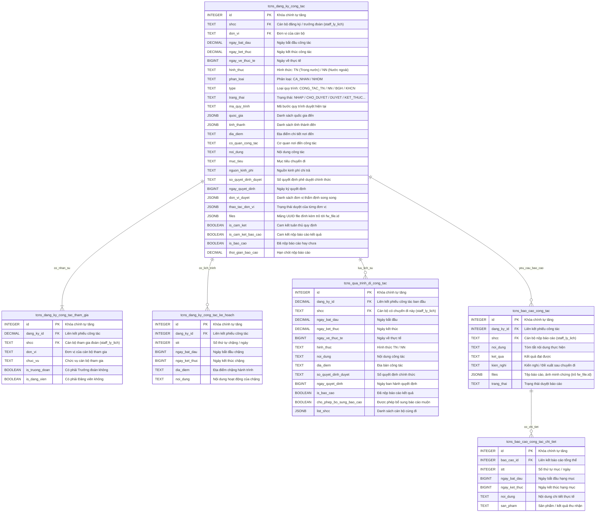
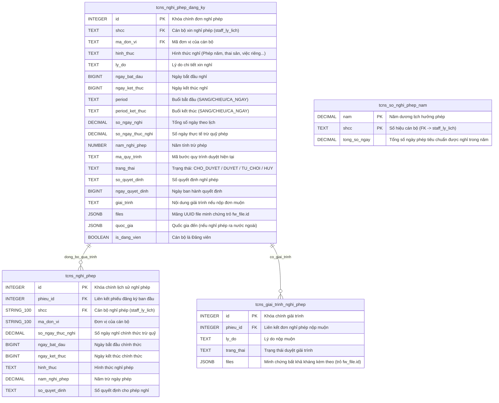
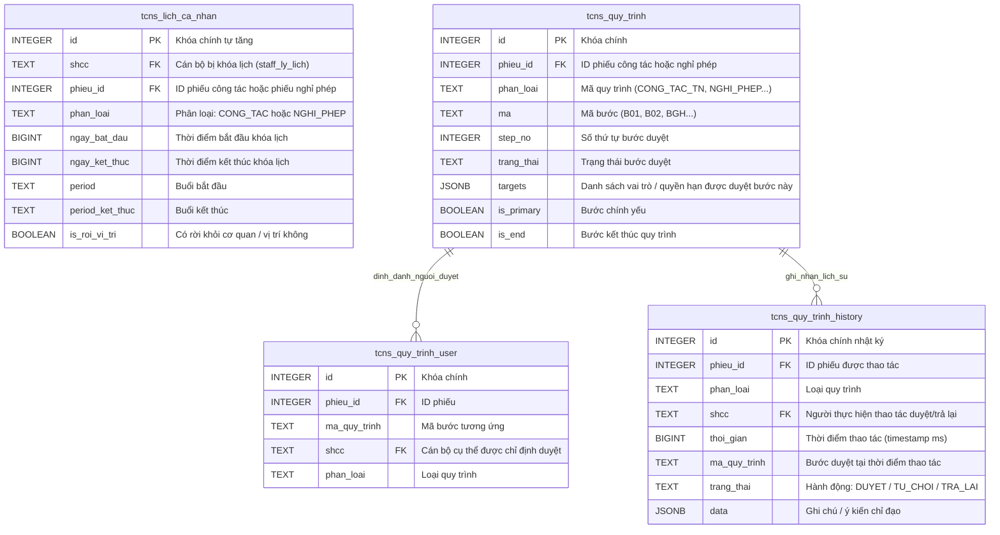

# BÁO CÁO PHÂN TÍCH TOÀN DIỆN CƠ SỞ DỮ LIỆU & SƠ ĐỒ ERD MỞ RỘNG
## 3 Module Cốt Lõi (Công Tác, Lý Lịch, Nghỉ Phép) & Tầng Hạ Tầng Nền Tảng Framework (`fw_*`)
### Hệ Thống Quản Trị Nhân Sự & Phê Duyệt Điện Tử — HCMUT HRM

---

> [!NOTE]
> **Phạm vi phân tích & tổng hợp cơ sở dữ liệu (55 Bảng CSDL):**
> 1. **Module Đăng ký Đi công tác:** [`modules/md_tcns/tcns_dang_ky_cong_tac`](file:///home/datn/backend/hrm-be/modules/md_tcns/tcns_dang_ky_cong_tac) (6 bảng)
> 2. **Module Sơ yếu Lý lịch Nhân sự:** [`modules/md_staff/staff_ly_lich`](file:///home/datn/backend/hrm-be/modules/md_staff/staff_ly_lich) (16 bảng)
> 3. **Module Đăng ký Nghỉ phép:** [`modules/md_tcns/tcns_nghi_phep`](file:///home/datn/backend/hrm-be/modules/md_tcns/tcns_nghi_phep) & [`tcns_so_nghi_phep_nam`](file:///home/datn/backend/hrm-be/modules/md_tcns/tcns_so_nghi_phep_nam) (4 bảng)
> 4. **Hạ tầng điều phối phiếu & Khóa lịch dùng chung:** [`tcns_lich_ca_nhan`](file:///home/datn/backend/hrm-be/modules/md_tcns/tcns_lich_ca_nhan), [`tcns_quy_trinh`](file:///home/datn/backend/hrm-be/modules/md_tcns/tcns_quy_trinh) (5 bảng)
> 5. **Hạ tầng Nền tảng Doanh nghiệp Framework (`fw_*`):** [`modules/_default`](file:///home/datn/backend/hrm-be/modules/_default) (24 bảng bao gồm Quy trình mẫu `fw_quy_trinh*`, Định danh & Phân quyền `fw_user*`, Quản lý tệp tin `fw_file*`, Thông báo `fw_notification*`, Email `fw_email*`, Cấu hình `fw_setting*`).
> - **Công nghệ:** PostgreSQL, Sequelize ORM, Node.js / TypeScript.

---

## I. Kiến Trúc Cơ Sở Dữ Liệu Đa Tầng (Enterprise Multi-tier Architecture)

Hệ thống HRM được xây dựng theo mô hình kiến trúc phân tầng doanh nghiệp (Enterprise Tiered Architecture). Trong đó, **3 module nghiệp vụ (`tcns_dang_ky_cong_tac`, `staff_ly_lich`, `tcns_nghi_phep`) không vận hành cô lập**, mà được nâng đỡ và điều phối chặt chẽ bởi **Hạ tầng Framework (`fw_*`)** và **Hạ tầng Quản lý Quy trình & Lịch trình (`tcns_quy_trinh_*`, `tcns_lich_ca_nhan`)**:

### 1. Mối Quan Hệ Tương Hỗ Giữa Tầng Framework (`fw_*`) Và 3 Module Nghiệp Vụ

```

+---------------------------------------------------------------------------------------------------------+
|                                    TẦNG 1: FRAMEWORK BLUEPRINT & IAM (`fw_*`)                           |
|   ┌────────────────────────┐  ┌─────────────────────────┐  ┌────────────────┐  ┌─────────────────────┐  |
|   │ fw_quy_trinh (Master)  │  │ fw_user / fw_user_role  │  │ fw_file        │  │ fw_notification    │  |
|   │ fw_quy_trinh_buoc      │  │ fw_user_role_key        │  │ fw_file_folder │  │ fw_user_device_token│  |
|   │ fw_quy_trinh_target    │  │ fw_user_position        │  │                │  │ fw_email_task       │  |
|   └───────────┬────────────┘  └────────────┬────────────┘  └────────┬───────┘  └──────────▲──────────┘  |
+---------------│----------------------------│------------------------│---------------------│-------------+
                │ Clone template             │ Phân quyền duyệt       │ Lưu trữ đính kèm    │ Bắn thông báo
                ▼                            ▼                        ▼                     │ khi đổi bước
+-------------------------------------------------------------------------------------------│-------------+
|                                    TẦNG 2: OPERATIONAL WORKFLOW & CALENDAR (Bridge)       │             |
|   ┌─────────────────────────────────────────────────────┐  ┌──────────────────────────────┴──────────┐  |
|   │ tcns_quy_trinh (Instance từng phiếu)                │  │ tcns_lich_ca_nhan                       │  |
|   │ tcns_quy_trinh_user (Danh sách người duyệt cụ thể)  │  │ (Khóa lịch chống trùng công tác & phép) │  |
|   │ tcns_quy_trinh_history (Audit log thao tác duyệt)   │  │                                         │  |
|   └───────────────────────────▲─────────────────────────┘  └───────────────▲─────────────────────────┘  |
+-------------------------------│--------------------------------------------│----------------------------+
                                │ Gắn quy trình                              │ Khóa thời gian
                ┌───────────────┴────────────────────┐                       │
                │                                    │                       │
+---------------│------------------------------------│-----------------------│----------------------------+
|               ▼                                    ▼                       ▼                            |
|    TẦNG 3: TRANSACTIONAL REQUESTS (Giao Dịch Đăng Ký)                      │                            |
|   ┌────────────────────────────────┐  ┌────────────────────────────────────┴┐                           |
|   │ tcns_dang_ky_cong_tac          │  │ tcns_nghi_phep_dang_ky              │                           |
|   │ - tcns_dang_ky_cong_tac_ke_hoach│  │ - tcns_giai_trinh_nghi_phep         │                           |
|   │ - tcns_dang_ky_cong_tac_tham_gia│  │                                    │                           |
|   └───────────────┬────────────────┘  └──────────────────┬──────────────────┘                           |
|                   │ Duyệt hoàn tất (KET_THUC)            │ Duyệt hoàn tất (KET_THUC)                    |
+-------------------│--------------------------------------│----------------------------------------------+
                    ▼                                      ▼
+---------------------------------------------------------------------------------------------------------+
|                                    TẦNG 4: OFFICIAL FACTS & QUOTAS (Lịch Sử & Quỹ Chính Thức)           |
|   ┌────────────────────────────────┐  ┌─────────────────────────────────────┐                           |
|   │ tcns_qua_trinh_di_cong_tac     │  │ tcns_nghi_phep (Lịch sử nghỉ phép)  │                           |
|   │ (Lịch sử công tác chính thức)  │  │ tcns_so_nghi_phep_nam (Quỹ trừ phép)│                           |
|   └───────────────┬────────────────┘  └──────────────────┬──────────────────┘                           |
|                   │ Hậu kiểm                             │ Quy chiếu cán bộ                             |
|                   ▼                                      ▼                                              |
|   ┌────────────────────────────────┐  ┌─────────────────────────────────────────────────────────────┐   |
|   │ tcns_bao_cao_cong_tac          │  │                   staff_ly_lich (MASTER)                    │   |
|   │ tcns_bao_cao_cong_tac_chi_tiet │  │ - 15 Bảng thành phần: địa chỉ, gia đình, tài sản, thu nhập, │   |
|   │                                │  │   chính trị, quy trình cập nhật lý lịch (request, audit)    │   |
|   └────────────────────────────────┘  └─────────────────────────────────────────────────────────────┘   |
+---------------------------------------------------------------------------------------------------------+

```

### 2. Chi Tiết Vai Trò Của Các Bảng `fw_*` Trong Hệ Thống:

1. **Động cơ Quy trình Mẫu (`fw_quy_trinh`, `fw_quy_trinh_buoc`, `fw_quy_trinh_target`, `fw_quy_trinh_permission`, `fw_quy_trinh_trang_thai`):**
   - Là **Blueprint (Bản thiết kế mẫu)** quy định các bước duyệt chuẩn cho từng loại nghiệp vụ: `CONG_TAC_TN`, `CONG_TAC_NN`, `CONG_TAC_BGH`, `CONG_TAC_KHCN`, `NGHI_PHEP`.
   - Khi một phiếu được khởi tạo (`POST /dang-ky`), hệ thống gọi hàm `app.model.fwQuyTrinh.fetchItem(phanLoai)` để lấy danh sách bước từ `fw_quy_trinh_buoc` và ma trận phân quyền từ `fw_quy_trinh_target`. Sau đó, hệ thống clone toàn bộ danh sách bước này thành một phiên bản thực thi độc lập gắn với `phieuId` trong `tcns_quy_trinh`.

2. **Định Danh, Tài Khoản & Cơ Chế Phân Giải Người Duyệt (`fw_user`, `fw_user_role_key`, `fw_user_position`, `fw_role`, `fw_user_role`):**
   - **`fw_user`** là thực thể xác thực đăng nhập (Authentication), liên kết 1-1 với `staff_ly_lich` qua `shcc` và `email`.
   - **`fw_user_role_key`** lưu các vai trò nghiệp vụ theo từng đơn vị cụ thể (ví dụ: `shcc` = '001234', `role_key` = 'clerical-president', `ma_don_vi` = '01'). Trong quy trình công tác, hệ thống truy vấn bảng này để định danh chính xác Văn thư BGH (`clerical-president`) hay Văn thư TCNS (`clerical-cong-tac`).
   - **`fw_user_position`** lưu thông tin chức vụ theo đơn vị (Trưởng phòng, Trưởng khoa, Phó hiệu trưởng...), được đồng bộ từ hồ sơ bổ nhiệm trong `staff_ly_lich` / `staff_qt_chuc_vu`. Khi một cán bộ nộp đơn công tác hay nghỉ phép, stored procedure `tcns_quy_trinh_user_fetch_quy_trinh` quét bảng này để tìm ra đích danh ai là Trưởng đơn vị của cán bộ đó để nạp vào `tcns_quy_trinh_user`.

3. **Hạ Tầng Lưu Trữ Tệp Tin Tập Trung (`fw_file`, `fw_file_folder`):**
   - Bảng `fw_file` là kho siêu dữ liệu tệp tin (File Metadata Repository) cho toàn bộ hệ thống.
   - Thay vì lưu trực tiếp binary trong bảng nghiệp vụ, các bảng `tcns_dang_ky_cong_tac.files` (JSONB), `tcns_nghi_phep_dang_ky.files` (JSONB), `tcns_giai_trinh_nghi_phep.files` (JSONB), `tcns_bao_cao_cong_tac.files` (JSONB) và `staff_ly_lich_request_file` đều lưu mảng UUID trỏ đến khóa chính `fw_file.id`.

4. **Động Cơ Thông Báo & Truyền Thông Đa Kênh (`fw_notification*`, `fw_user_device_token`, `fw_email*`):**
   - Mỗi khi trạng thái phiếu thay đổi (`DUYET`, `TRA_LAI`, `TU_CHOI`, `KET_THUC`), hàm `sendQuyTrinhNotification()` trong [`modules/md_tcns/tcns_quy_trinh/helper.ts`](file:///home/datn/backend/hrm-be/modules/md_tcns/tcns_quy_trinh/helper.ts) được kích hoạt:
     - Ghi nhận thông báo vào `fw_notification`, `fw_notification_history`, `fw_notification_target` (hiển thị chuông trên Web).
     - Quét `fw_user_device_token` để gửi Push Notification qua Firebase Cloud Messaging (FCM) đến điện thoại di động của người nộp và cấp phê duyệt.
     - Đẩy tác vụ gửi email thông báo vào hàng đợi `fw_email_task` theo mẫu cấu hình trong `fw_email_config`.

---

## II. Hệ Thống Sơ Đồ ERD Toàn Diện (Comprehensive Mermaid ERDs)

### 1. Sơ Đồ ERD Cấp Cao Toàn Hệ Thống (Master Enterprise Relational ERD)
Sơ đồ biểu diễn sự liên kết chặt chẽ giữa 5 tầng thực thể: Hồ sơ nhân sự gốc, Công tác, Nghỉ phép, Workflow điều phối và Nền tảng Framework:

```mermaid
erDiagram
    %% Master Staff Entity Links
    staff_ly_lich ||--|| fw_user : "dinh_danh_tai_khoan (shcc)"
    staff_ly_lich ||--o{ fw_user_role_key : "vai_tro_chuc_nang (shcc)"
    staff_ly_lich ||--o{ fw_user_position : "chuc_vu_don_vi (shcc)"
    staff_ly_lich ||--o{ tcns_dang_ky_cong_tac : "tao_phieu_ct (shcc)"
    staff_ly_lich ||--o{ tcns_dang_ky_cong_tac_tham_gia : "tham_gia_doan (shcc)"
    staff_ly_lich ||--o{ tcns_qua_trinh_di_cong_tac : "so_huu_lich_su_ct (shcc)"
    staff_ly_lich ||--o{ tcns_nghi_phep_dang_ky : "dang_ky_nghi (shcc)"
    staff_ly_lich ||--o{ tcns_nghi_phep : "so_huu_lich_su_phep (shcc)"
    staff_ly_lich ||--o{ tcns_so_nghi_phep_nam : "quy_phep_nam (shcc)"
    staff_ly_lich ||--o{ tcns_lich_ca_nhan : "khoa_lich (shcc)"
    staff_ly_lich ||--o{ tcns_bao_cao_cong_tac : "nop_bao_cao (shcc)"

    %% Staff Sub-entities & Audit
    staff_ly_lich ||--o{ staff_ly_lich_dia_chi : "dia_chi (shcc)"
    staff_ly_lich ||--o{ staff_ly_lich_gia_dinh : "gia_dinh (shcc)"
    staff_ly_lich ||--o{ staff_ly_lich_dt_llct : "dt_llct (shcc)"
    staff_ly_lich ||--o{ staff_ke_khai_tai_san : "ke_khai_tai_san (shcc)"
    staff_ly_lich ||--o{ staff_ke_khai_thu_nhap : "ke_khai_thu_nhap (shcc)"
    staff_ly_lich ||--o{ staff_ls_bi_bat_tu : "bi_bat_tu (shcc)"
    staff_ly_lich ||--o{ staff_ls_che_do_cu : "che_do_cu (shcc)"
    staff_ly_lich ||--o{ staff_ls_to_chuc_nuoc_ngoai : "tc_nuoc_ngoai (shcc)"
    staff_ly_lich ||--o{ staff_qt_to_chuc_ct_xh : "tc_ct_xh (shcc)"
    staff_ly_lich ||--o{ staff_ly_lich_request : "yeu_cau_sua (shcc)"
    staff_ly_lich ||--o{ staff_ly_lich_audit_log : "audit_log (shcc)"
    staff_ly_lich_request ||--|{ staff_ly_lich_request_detail : "chi_tiet (request_id)"
    staff_ly_lich_request_detail ||--o{ staff_ly_lich_request_file : "dinh_kem (request_detail_id)"

    %% Framework Workflow Template to Instance
    fw_quy_trinh ||--|{ fw_quy_trinh_buoc : "cac_buoc_mau (ma_quy_trinh)"
    fw_quy_trinh_buoc ||--o{ fw_quy_trinh_target : "thoi_gian_duyet (quy_trinh_buoc)"
    fw_quy_trinh ||--o{ tcns_quy_trinh : "clone_sang_instance (ma)"

    %% Business Trip Module
    tcns_dang_ky_cong_tac ||--|{ tcns_dang_ky_cong_tac_tham_gia : "doan_tham_gia (dang_ky_id)"
    tcns_dang_ky_cong_tac ||--o{ tcns_dang_ky_cong_tac_ke_hoach : "ke_hoach_ngay (dang_ky_id)"
    tcns_dang_ky_cong_tac ||--o{ tcns_qua_trinh_di_cong_tac : "ket_thuc_dong_bo (dang_ky_id)"
    tcns_dang_ky_cong_tac ||--o{ tcns_bao_cao_cong_tac : "bao_cao_chuyen_di (dang_ky_id)"
    tcns_bao_cao_cong_tac ||--o{ tcns_bao_cao_cong_tac_chi_tiet : "chi_tiet_ngay (bao_cao_id)"

    %% Leave Module
    tcns_nghi_phep_dang_ky ||--o{ tcns_nghi_phep : "ket_thuc_dong_bo (phieu_id)"
    tcns_nghi_phep_dang_ky ||--o{ tcns_giai_trinh_nghi_phep : "giai_trinh_muon (phieu_id)"

    %% Operational Bridge (Schedule Locking & Approval Execution)
    tcns_dang_ky_cong_tac ||--o{ tcns_lich_ca_nhan : "khoa_lich_ct (phieu_id)"
    tcns_nghi_phep_dang_ky ||--o{ tcns_lich_ca_nhan : "khoa_lich_phep (phieu_id)"
    tcns_dang_ky_cong_tac ||--o{ tcns_quy_trinh : "instance_quy_trinh (phieu_id)"
    tcns_nghi_phep_dang_ky ||--o{ tcns_quy_trinh : "instance_quy_trinh (phieu_id)"
    tcns_quy_trinh ||--o{ tcns_quy_trinh_user : "nguoi_duyet_cu_the (phieu_id)"
    tcns_quy_trinh ||--o{ tcns_quy_trinh_history : "audit_duyet (phieu_id)"

    %% IAM to Workflow Resolution
    fw_user_role_key ||--o{ tcns_quy_trinh_user : "resolve_role_key (shcc)"
    fw_user_position ||--o{ tcns_quy_trinh_user : "resolve_chuc_vu (shcc)"

    %% File Storage & Notification Integration
    fw_file_folder ||--o{ fw_file : "chua_trong_folder"
    fw_file ||--o{ tcns_dang_ky_cong_tac : "tep_dinh_kem (JSONB)"
    fw_file ||--o{ tcns_nghi_phep_dang_ky : "tep_dinh_kem (JSONB)"
    fw_file ||--o{ staff_ly_lich_request_file : "minh_chung (file_id)"
    fw_user ||--o{ fw_notification_history : "nhan_thong_bao (user_id)"
    fw_user ||--o{ fw_user_device_token : "thiet_bi_push (user_id)"
```



---

### 2. Sơ Đồ ERD Tầng Hạ Tầng Framework Doanh Nghiệp (`modules/_default/fw_*`)
Thể hiện chi tiết kiến trúc của 24 bảng thuộc 5 hệ thống dịch vụ nền tảng:

```mermaid
erDiagram
    %% 1. Workflow Blueprint Engine
    fw_quy_trinh {
        TEXT ma PK "Mã quy trình (CONG_TAC_TN, CONG_TAC_NN, NGHI_PHEP...)"
        TEXT ten "Tên mô tả quy trình"
        BOOLEAN kich_hoat "Cờ kích hoạt áp dụng"
    }
    fw_quy_trinh_buoc {
        TEXT ma PK "Mã bước (B01, TRUONG_DV, CV_TCNS, TP_TCNS, BGH...)"
        TEXT ma_quy_trinh PK "FK trỏ tới fw_quy_trinh.ma"
        TEXT ten "Tên hiển thị của bước duyệt"
        TEXT trang_thai "Trạng thái tương ứng của phiếu tại bước này"
        INTEGER step_no "Thứ tự bước trong quy trình"
        BOOLEAN is_initial "Là bước khởi đầu"
        BOOLEAN is_primary "Là bước chính yếu"
        BOOLEAN is_end "Là bước kết thúc quy trình"
        JSONB graph_position "Tọa độ hiển thị trên sơ đồ quy trình"
    }
    fw_quy_trinh_target {
        INTEGER id PK "Khóa chính"
        TEXT ma_quy_trinh "Mã quy trình áp dụng"
        TEXT quy_trinh_buoc "Mã bước áp dụng (FK -> fw_quy_trinh_buoc.ma)"
        JSONB ma_don_vi "Điều kiện đơn vị của người duyệt"
        JSONB role "Điều kiện nhóm vai trò duyệt"
        JSONB role_key "Điều kiện role_key chức năng (clerical-president, truong-khoa...)"
        JSONB permissions "Danh sách quyền thao tác tại bước"
        TEXT forward_to "Mã bước tiếp theo sau khi duyệt"
        TEXT trang_thai "Trạng thái sau hành động"
        BOOLEAN is_create_user "Cán bộ tạo phiếu tự xử lý bước này"
    }
    fw_quy_trinh_trang_thai {
        TEXT ma PK "Mã trạng thái chuẩn (DUYET, TU_CHOI, TRA_LAI, HUY...)"
        TEXT ten "Tên trạng thái hiển thị"
        TEXT color "Mã màu đại diện Hex code"
        TEXT icon "Icon đại diện"
    }
    fw_quy_trinh_permission {
        TEXT ma PK "Mã quyền hạn quy trình"
        TEXT ten "Tên mô tả quyền hạn"
    }
    fw_quy_trinh ||--|{ fw_quy_trinh_buoc : "chua_buoc"
    fw_quy_trinh_buoc ||--o{ fw_quy_trinh_target : "cau_hinh_target"

    %% 2. Identity & Access Management (IAM)
    fw_user {
        INTEGER id PK "Khóa chính tài khoản"
        STRING_100 username "Tên đăng nhập hệ thống"
        STRING_100 email "Email trường (@hcmut.edu.vn)"
        STRING_64 password "Mật khẩu băm mã hóa bcrypt"
        STRING_200 ho "Họ và tên đệm"
        STRING_100 ten "Tên người dùng"
        TEXT shcc "Mã cán bộ (FK liên kết staff_ly_lich.shcc)"
        BOOLEAN active "Trạng thái hoạt động"
        BIGINT created_at "Thời điểm tạo tài khoản"
    }
    fw_role {
        INTEGER id PK "Khóa chính nhóm vai trò"
        STRING_50 name "Tên định danh nhóm vai trò"
        TEXT description "Mô tả chức trách vai trò"
    }
    fw_user_role {
        TEXT shcc PK "Mã cán bộ"
        INTEGER role_id PK "FK trỏ tới fw_role.id"
    }
    fw_user_role_key {
        TEXT shcc PK "Mã cán bộ (FK -> staff_ly_lich.shcc)"
        TEXT role_key PK "Mã vai trò nghiệp vụ (clerical-president, truong-don-vi...)"
        TEXT ma_don_vi PK "Mã đơn vị áp dụng vai trò này"
        BOOLEAN is_assign "Cờ gán quyền trực tiếp"
    }
    fw_user_position {
        INTEGER id PK "Khóa chính tự tăng"
        TEXT shcc "Mã cán bộ (FK -> staff_ly_lich.shcc)"
        STRING_5 ma_don_vi "Mã đơn vị bổ nhiệm chức vụ"
        TEXT position "Mã chức vụ (FK -> fw_position.ma / dm_chuc_vu.ma)"
    }
    fw_position {
        STRING_5 ma PK "Mã chức vụ khung"
        STRING_200 ten "Tên chức vụ khung (Trưởng phòng, Trưởng khoa, Hiệu trưởng...)"
    }
    fw_user_device_token {
        INTEGER id PK "Khóa chính"
        INTEGER user_id "FK trỏ tới fw_user.id"
        TEXT device_token "Token thiết bị FCM để bắn Push Notification"
        TEXT platform "Nền tảng: iOS / Android / Web"
    }
    fw_user ||--o{ fw_user_role : "co_nhom_vai_tro"
    fw_role ||--o{ fw_user_role : "duoc_gan"
    fw_user ||--o{ fw_user_device_token : "so_huu_thiet_bi"
    fw_position ||--o{ fw_user_position : "chuc_vu_khung"

    %% 3. File & Asset Storage Engine
    fw_file {
        STRING id PK "Khóa định danh file (UUID / Hash String)"
        TEXT file_name "Tên tệp đã chuẩn hóa lưu trên đĩa"
        TEXT file_original_name "Tên tệp gốc do người dùng tải lên"
        TEXT file_path "Đường dẫn lưu trữ vật lý trên server / cloud storage"
        STRING_50 file_extension "Định dạng đuôi file (.pdf, .docx, .png...)"
        TEXT file_mime_type "MIME Type chuẩn (application/pdf...)"
        INTEGER size "Dung lượng file (bytes)"
        TEXT created_by "Người tải lên (shcc/username)"
        BIGINT created_at "Thời điểm tải lên"
        BOOLEAN is_deleted "Cờ xóa mềm"
        STRING file_folder_id "FK trỏ tới fw_file_folder.id"
    }
    fw_file_folder {
        STRING id PK "Khóa chính thư mục"
        TEXT folder_name "Tên thư mục hiển thị"
        TEXT folder_code "Mã thư mục logic"
        STRING parent_id "Thư mục cha (hỗ trợ phân cấp cây thư mục)"
    }
    fw_file_folder ||--o{ fw_file : "chua_tep"

    %% 4. Omnichannel Notification & Email
    fw_notification {
        INTEGER id PK "Khóa chính thông báo"
        TEXT title "Tiêu đề thông báo"
        TEXT sub_title "Trích yếu nội dung thông báo ngắn gọn"
        TEXT target_link "Đường dẫn URL điều hướng khi nhấp vào thông báo"
        BIGINT send_time "Thời điểm phát thông báo"
    }
    fw_notification_history {
        INTEGER id PK "Khóa chính lịch sử nhận"
        INTEGER id_notification "FK trỏ tới fw_notification.id"
        INTEGER user_id "FK trỏ tới fw_user.id"
        BOOLEAN is_read "Trạng thái đã đọc thông báo"
        BIGINT read_time "Thời điểm đọc thông báo"
    }
    fw_notification_target {
        INTEGER id PK "Khóa chính target"
        INTEGER id_notification "FK trỏ tới fw_notification.id"
        TEXT target "Đối tượng nhận (USER, ROLE, DON_VI)"
    }
    fw_email_config {
        STRING_100 email PK "Địa chỉ email hệ thống cấu hình gửi"
        TEXT password "Mật khẩu ứng dụng SMTP"
    }
    fw_email_task {
        INTEGER id PK "Khóa chính tác vụ email"
        TEXT mail_to "Địa chỉ email người nhận"
        TEXT mail_subject "Tiêu đề email"
        TEXT mail_html "Nội dung email định dạng HTML"
        JSONB mail_attachment "Danh sách tệp đính kèm gửi kèm email"
        TEXT status "Trạng thái gửi: PENDING / SENT / FAILED"
    }
    fw_notification ||--o{ fw_notification_history : "lich_su_gui"
    fw_notification ||--o{ fw_notification_target : "nhom_doi_tuong"
```



---

### 3. Sơ Đồ ERD Phân Hệ Đăng Ký Đi Công Tác (`tcns_dang_ky_cong_tac`)


---

### 4. Sơ Đồ ERD Phân Hệ Hồ Sơ Lý Lịch Viên Chức (`staff_ly_lich`)

```mermaid
erDiagram
    staff_ly_lich {
        STRING_20 shcc PK "Mã định danh cán bộ toàn hệ thống"
        STRING_150 ho "Họ và tên đệm"
        STRING_50 ten "Tên cán bộ"
        STRING_15 gioi_tinh "Giới tính (NAM/NU)"
        BIGINT ngay_sinh "Ngày sinh (timestamp ms)"
        STRING_20 cccd "Số CCCD / Hộ chiếu"
        STRING_70 email "Email trường (@hcmut.edu.vn)"
        STRING_20 sdt "Số điện thoại liên lạc"
        STRING_10 don_vi FK "Đơn vị quản lý (Khoa/Phòng)"
        STRING_10 chuc_vu_chinh FK "Chức vụ quản lý chính"
        STRING_20 hoc_ham "Học hàm (GS, PGS)"
        STRING_20 hoc_vi "Học vị (TS, ThS, CN, KS)"
        STRING_20 ngach "Mã ngạch viên chức"
        STRING_20 cdnn "Chức danh nghề nghiệp"
        STRING_20 vtvl "Vị trí việc làm"
        BOOLEAN is_dang_vien "Có phải là Đảng viên"
        BOOLEAN is_vien_chuc "Là viên chức hay HĐLĐ"
    }
    staff_ly_lich_dia_chi {
        INTEGER id PK "Khóa chính"
        STRING_20 shcc FK "Số hiệu cán bộ (staff_ly_lich)"
        STRING_20 loai_dia_chi "Loại: NOI_SINH / NGUYEN_QUAN / THUONG_TRU / HIEN_NAY"
        STRING_5 quoc_gia "Mã quốc gia"
        STRING_5 tinh_thanh "Mã tỉnh thành"
        STRING_10 quan_huyen "Mã quận huyện"
        STRING_10 xa_phuong "Mã xã phường"
        STRING_200 so_nha "Số nhà, tên đường chi tiết"
    }
    staff_ly_lich_gia_dinh {
        INTEGER id PK "Khóa chính"
        STRING_20 shcc FK "Số hiệu cán bộ (staff_ly_lich)"
        STRING_5 moi_quan_he "Mối quan hệ (CHA, ME, VO, CHONG, CON...)"
        STRING_50 nhom_quan_he "Nhóm: BAN_THAN / BEN_VO_CHONG"
        STRING_200 ho_ten "Họ và tên thân nhân"
        BIGINT ngay_sinh "Ngày sinh thân nhân"
        STRING_20 cccd "CCCD thân nhân"
        STRING_1000 nghe_nghiep "Nghề nghiệp thân nhân"
        STRING_1000 don_vi_cong_tac "Cơ quan nơi làm việc"
        BOOLEAN is_nguoi_phu_thuoc "Là người phụ thuộc giảm trừ gia cảnh"
        BOOLEAN is_deceased "Đã mất hay còn sống"
    }
    staff_ke_khai_tai_san {
        INTEGER id PK "Khóa chính"
        STRING_20 shcc FK "Số hiệu cán bộ kê khai"
        INTEGER nam_ke_khai "Năm kê khai tài sản"
        TEXT loai_ke_khai "Loại: Hàng năm / Bổ sung / Lần đầu"
        TEXT nhom_tai_san "Nhóm tài sản: Nhà đất, Kim loại quý, Tiền gửi..."
        TEXT mo_ta_tai_san "Mô tả đặc điểm tài sản"
        DECIMAL dien_tich "Diện tích (m2)"
        BIGINT gia_tri_uoc_tinh "Giá trị ước tính (VNĐ)"
    }
    staff_ke_khai_thu_nhap {
        INTEGER id PK "Khóa chính"
        STRING_20 shcc FK "Số hiệu cán bộ"
        INTEGER nam_ke_khai "Năm kê khai thu nhập"
        BIGINT tong_thu_nhap "Tổng thu nhập trong năm (VNĐ)"
        BIGINT thu_nhap_luong "Thu nhập từ tiền lương/công"
        BIGINT thu_nhap_khac "Thu nhập khác ngoài lương"
    }
    staff_ly_lich_dt_llct {
        INTEGER id PK "Khóa chính"
        TEXT shcc FK "Số hiệu cán bộ"
        TEXT trinh_do "Trình độ: Sơ cấp / Trung cấp / Cao cấp LLCT"
        TEXT co_so_dao_tao "Cơ sở đào tạo (Học viện CTQG...)"
        TEXT so_van_bang "Số văn bằng / chứng chỉ LLCT"
    }
    staff_ly_lich_request {
        INTEGER id PK "Mã phiếu yêu cầu sửa hồ sơ"
        STRING_20 shcc FK "Cán bộ gửi yêu cầu (staff_ly_lich)"
        STRING_20 phan_loai "Phần sửa: THONG_TIN_CA_NHAN / GIA_DINH / DIA_CHI..."
        JSONB previous_data "Dữ liệu snapshot trước khi sửa"
        JSONB changes "Dữ liệu đề xuất thay đổi mới"
        STRING_20 trang_thai "Trạng thái: PENDING / APPROVED / REJECTED / DONE"
        TEXT ly_do "Lý do cán bộ đề nghị chỉnh sửa"
        TEXT ly_do_tu_choi "Lý do TCNS từ chối nếu có"
    }
    staff_ly_lich_request_detail {
        INTEGER id PK "Mã chi tiết thay đổi"
        INTEGER request_id FK "Liên kết phiếu yêu cầu (staff_ly_lich_request)"
        TEXT field "Tên trường dữ liệu cụ thể (ví dụ: cccd, danToc)"
        STRING_20 action "Hành động: CREATE / UPDATE / DELETE"
        STRING_20 trang_thai "Trạng thái duyệt từng mục"
    }
    staff_ly_lich_request_file {
        UUID file_id PK "Khóa định danh file (trỏ fw_file.id)"
        INTEGER request_detail_id FK "Liên kết chi tiết thay đổi"
        TEXT file_path "Đường dẫn lưu trữ minh chứng"
        TEXT file_name "Tên tệp gốc đính kèm"
    }
    staff_ly_lich_audit_log {
        INTEGER id PK "Khóa chính nhật ký"
        STRING_20 shcc FK "Cán bộ được thay đổi lý lịch"
        INTEGER request_id FK "Liên kết phiếu yêu cầu đã duyệt"
        STRING_20 phan_loai "Mục lý lịch được tác động"
        JSONB previous_data "Dữ liệu cũ trước tác động"
        JSONB new_data "Dữ liệu mới sau tác động"
        BIGINT updated_at "Thời điểm ghi vết nhật ký"
        STRING_20 updated_by "Người thực hiện cập nhật (Admin TCNS)"
    }
    staff_ly_lich ||--o{ staff_ly_lich_dia_chi : "dia_chi"
    staff_ly_lich ||--o{ staff_ly_lich_gia_dinh : "gia_dinh"
    staff_ly_lich ||--o{ staff_ke_khai_tai_san : "tai_san"
    staff_ly_lich ||--o{ staff_ke_khai_thu_nhap : "thu_nhap"
    staff_ly_lich ||--o{ staff_ly_lich_dt_llct : "dt_llct"
    staff_ly_lich ||--o{ staff_ly_lich_request : "gui_yeu_cau"
    staff_ly_lich ||--o{ staff_ly_lich_audit_log : "ghi_nhat_ky"
    staff_ly_lich_request ||--|{ staff_ly_lich_request_detail : "co_chi_tiet"
    staff_ly_lich_request_detail ||--o{ staff_ly_lich_request_file : "co_minh_chung"
```


---

### 5. Sơ Đồ ERD Phân Hệ Đăng Ký Nghỉ Phép (`tcns_nghi_phep`)


---

### 6. Sơ Đồ ERD Hạ Tầng Điều Phối Phiếu Dùng Chung (`tcns_lich_ca_nhan` & `tcns_quy_trinh_*`)


---

## III. Từ Điển Dữ Liệu Toàn Diện (Full Data Dictionary — 55 Bảng)

Dưới đây là đặc tả chi tiết toàn bộ các bảng, các cột, kiểu dữ liệu PostgreSQL, ràng buộc khóa và diễn giải nghiệp vụ đầy đủ cho 55 bảng cơ sở dữ liệu:

### 1. Phân Hệ Đăng Ký Đi Công Tác (modules/md_tcns/tcns_dang_ky_cong_tac)

#### 1.1. Bảng `tcns_dang_ky_cong_tac`
- **Tập tin Model:** [`modules/md_tcns/tcns_dang_ky_cong_tac/model/tcns_dang_ky_cong_tac.model.ts`](file:///home/datn/backend/hrm-be/modules/md_tcns/tcns_dang_ky_cong_tac/model/tcns_dang_ky_cong_tac.model.ts)
- **Khóa chính (PK):** `[id]`
- **Số lượng cột:** `42`

| STT | Tên Cột | Kiểu Dữ Liệu | Ràng Buộc | Cho Phép NULL | Giá Trị Mặc Định | Ý Nghĩa Nghiệp Vụ & Diễn Giải Chi Tiết |
| :---: | :--- | :--- | :---: | :---: | :---: | :--- |
| 1 | `so_quyet_dinh_duyet` | `TEXT` | - | NULL | - | Số quyết định chính thức sau khi phê duyệt hoàn tất |
| 2 | `ngay_ve_thuc_te` | `BIGINT` | - | NULL | - | Ngày về thực tế sau chuyến công tác (timestamp ms) |
| 3 | `muc_tieu_khac` | `TEXT` | - | NULL | - | Mục tiêu khác bổ sung |
| 4 | `nguon_kinh_phi_khac` | `TEXT` | - | NULL | - | Chi tiết nguồn kinh phí khác |
| 5 | `so_quyet_dinh` | `TEXT` | - | NULL | - | Số quyết định hành chính |
| 6 | `ket_qua_cong_tac` | `TEXT` | - | NULL | - | Tóm tắt kết quả công tác sau chuyến đi |
| 7 | `co_quan_cong_tac` | `TEXT` | - | NULL | - | Cơ quan / Đơn vị nơi đến công tác |
| 8 | `can_cu_cong_tac` | `TEXT` | - | NULL | - | Mã căn cứ công tác (FK -> dm_can_cu_cong_tac) |
| 9 | `giay_moi` | `TEXT` | - | NULL | - | Thông tin thư mời / công văn triệu tập |
| 10 | `khoan_chi_thanh_toan` | `TEXT` | - | NULL | - | Các khoản chi đề nghị thanh toán |
| 11 | `shcc` | `TEXT` | FK | NULL | - | Số hiệu cán bộ / công chức (Mã định danh nhân sự duy nhất toàn hệ thống) |
| 12 | `ngay_bat_dau` | `DECIMAL` | - | NULL | - | Ngày / Giờ bắt đầu (timestamp ms) |
| 13 | `ngay_ket_thuc` | `DECIMAL` | - | NULL | - | Ngày / Giờ kết thúc (timestamp ms) |
| 14 | `id` | `INTEGER` | **PK** Auto-Inc | **NOT NULL** | - | Khóa chính tự tăng (Primary Key) |
| 15 | `lich_trinh` | `TEXT` | - | NULL | - | Tóm tắt lịch trình di chuyển |
| 16 | `nguon_kinh_phi` | `TEXT` | - | NULL | - | Nguồn kinh phí chi trả (Trường, Đề tài, Đối tác, Tự túc) |
| 17 | `dia_diem` | `TEXT` | - | NULL | - | Địa điểm diễn ra |
| 18 | `quoc_gia` | `JSONB` | - | NULL | `[]` | Danh sách quốc gia liên quan (JSONB) |
| 19 | `noi_dung` | `TEXT` | - | NULL | - | Nội dung chi tiết chuyến công tác |
| 20 | `muc_tieu` | `TEXT` | - | NULL | - | Mục tiêu chuyến công tác |
| 21 | `hinh_thuc` | `TEXT` | - | NULL | - | Hình thức công tác: TN (Trong nước) / NN (Nước ngoài) |
| 22 | `phan_loai` | `TEXT` | - | NULL | - | Phân loại mục hồ sơ hoặc loại luồng nghiệp vụ |
| 23 | `is_bao_cao` | `BOOLEAN` | - | NULL | - | Trạng thái đã hoàn tất nộp báo cáo kết quả hay chưa |
| 24 | `thoi_gian_bao_cao` | `DECIMAL` | - | NULL | - | Thời hạn / Thời gian nộp báo cáo kết quả |
| 25 | `is_cam_ket` | `BOOLEAN` | - | NULL | `true` | Xác nhận cam kết tuân thủ quy định |
| 26 | `files` | `JSONB` | - | NULL | - | Danh sách tệp đính kèm (JSON mảng file) |
| 27 | `don_vi` | `TEXT` | FK | NULL | - | Mã đơn vị / Khoa / Phòng ban quản lý (FK -> dm_don_vi) |
| 28 | `ngay_tao` | `DECIMAL` | - | NULL | - | Thời điểm tạo (timestamp ms) |
| 29 | `don_vi_duyet` | `JSONB` | - | NULL | - | Danh sách các đơn vị cần thẩm định song song (JSONB) |
| 30 | `ma_quy_trinh` | `TEXT` | - | NULL | - | Mã bước quy trình phê duyệt hiện tại |
| 31 | `trang_thai` | `TEXT` | - | NULL | - | Trạng thái xử lý / phê duyệt |
| 32 | `ngay_cap_nhat` | `DECIMAL` | - | NULL | - | Thời điểm cập nhật cuối (timestamp ms) |
| 33 | `nam` | `TEXT` | - | NULL | - | Năm công tác |
| 34 | `khoan_chi_thanh_toan_khac` | `TEXT` | - | NULL | - | Các khoản chi khác đề nghị thanh toán |
| 35 | `type` | `TEXT` | - | NULL | - | Loại luồng quy trình: CONG_TAC_TN, CONG_TAC_NN, CONG_TAC_BGH, CONG_TAC_KHCN |
| 36 | `thao_tac_don_vi` | `JSONB` | - | NULL | `{}` | Trạng thái thẩm định chi tiết của từng đơn vị (JSONB) |
| 37 | `xa_phuong` | `TEXT` | - | NULL | - | Phường / Xã |
| 38 | `tinh_thanh` | `JSONB` | - | NULL | `[]` | Danh sách tỉnh / thành phố (JSONB) |
| 39 | `so_ngay_cong_tac` | `INTEGER` | - | NULL | - | Tổng số ngày đi công tác |
| 40 | `ngay_quyet_dinh` | `BIGINT` | - | NULL | - | Ngày ban hành quyết định (timestamp ms) |
| 41 | `is_cam_ket_bao_cao` | `BOOLEAN` | - | NULL | - | Cam kết nộp báo cáo kết quả sau chuyến đi |
| 42 | `is_dang_vien` | `BOOLEAN` | - | NULL | - | Đánh dấu có phải là Đảng viên ĐCSVN |

#### 1.2. Bảng `tcns_dang_ky_cong_tac_ke_hoach`
- **Tập tin Model:** [`modules/md_tcns/tcns_dang_ky_cong_tac/model/tcns_dang_ky_cong_tac_ke_hoach.model.ts`](file:///home/datn/backend/hrm-be/modules/md_tcns/tcns_dang_ky_cong_tac/model/tcns_dang_ky_cong_tac_ke_hoach.model.ts)
- **Khóa chính (PK):** `[id]`
- **Số lượng cột:** `7`

| STT | Tên Cột | Kiểu Dữ Liệu | Ràng Buộc | Cho Phép NULL | Giá Trị Mặc Định | Ý Nghĩa Nghiệp Vụ & Diễn Giải Chi Tiết |
| :---: | :--- | :--- | :---: | :---: | :---: | :--- |
| 1 | `id` | `INTEGER` | **PK** Auto-Inc | **NOT NULL** | - | Khóa chính tự tăng (Primary Key) |
| 2 | `dang_ky_id` | `INTEGER` | FK | NULL | - | Mã phiếu đăng ký công tác liên kết (FK -> tcns_dang_ky_cong_tac.id) |
| 3 | `stt` | `INTEGER` | - | NULL | - | Số thứ tự ngày / chặng hành trình |
| 4 | `noi_dung` | `TEXT` | - | NULL | - | Nội dung chi tiết chuyến công tác |
| 5 | `ngay_bat_dau` | `BIGINT` | - | NULL | - | Ngày / Giờ bắt đầu (timestamp ms) |
| 6 | `ngay_ket_thuc` | `BIGINT` | - | NULL | - | Ngày / Giờ kết thúc (timestamp ms) |
| 7 | `dia_diem` | `TEXT` | - | NULL | - | Địa điểm diễn ra |

#### 1.3. Bảng `tcns_dang_ky_cong_tac_tham_gia`
- **Tập tin Model:** [`modules/md_tcns/tcns_dang_ky_cong_tac/model/tcns_dang_ky_cong_tac_tham_gia.model.ts`](file:///home/datn/backend/hrm-be/modules/md_tcns/tcns_dang_ky_cong_tac/model/tcns_dang_ky_cong_tac_tham_gia.model.ts)
- **Khóa chính (PK):** `[id]`
- **Số lượng cột:** `7`

| STT | Tên Cột | Kiểu Dữ Liệu | Ràng Buộc | Cho Phép NULL | Giá Trị Mặc Định | Ý Nghĩa Nghiệp Vụ & Diễn Giải Chi Tiết |
| :---: | :--- | :--- | :---: | :---: | :---: | :--- |
| 1 | `id` | `INTEGER` | **PK** Auto-Inc | **NOT NULL** | - | Khóa chính tự tăng (Primary Key) |
| 2 | `dang_ky_id` | `DECIMAL` | FK | NULL | - | Mã phiếu đăng ký công tác liên kết (FK -> tcns_dang_ky_cong_tac.id) |
| 3 | `shcc` | `TEXT` | FK | NULL | - | Số hiệu cán bộ / công chức (Mã định danh nhân sự duy nhất toàn hệ thống) |
| 4 | `don_vi` | `TEXT` | FK | NULL | - | Mã đơn vị / Khoa / Phòng ban quản lý (FK -> dm_don_vi) |
| 5 | `chuc_vu` | `TEXT` | - | NULL | - | Chức vụ đảm nhiệm của cán bộ |
| 6 | `is_truong_doan` | `BOOLEAN` | - | NULL | `false` | Cán bộ là Trưởng đoàn công tác (true/false) |
| 7 | `is_dang_vien` | `BOOLEAN` | - | NULL | - | Đánh dấu có phải là Đảng viên ĐCSVN |

#### 1.4. Bảng `tcns_qua_trinh_di_cong_tac`
- **Tập tin Model:** [`modules/md_tcns/tcns_dang_ky_cong_tac/model/tcns_qua_trinh_di_cong_tac.model.ts`](file:///home/datn/backend/hrm-be/modules/md_tcns/tcns_dang_ky_cong_tac/model/tcns_qua_trinh_di_cong_tac.model.ts)
- **Khóa chính (PK):** `[id]`
- **Số lượng cột:** `37`

| STT | Tên Cột | Kiểu Dữ Liệu | Ràng Buộc | Cho Phép NULL | Giá Trị Mặc Định | Ý Nghĩa Nghiệp Vụ & Diễn Giải Chi Tiết |
| :---: | :--- | :--- | :---: | :---: | :---: | :--- |
| 1 | `dang_ky_id` | `DECIMAL` | FK | NULL | - | Mã phiếu đăng ký công tác liên kết (FK -> tcns_dang_ky_cong_tac.id) |
| 2 | `shcc` | `TEXT` | FK | NULL | - | Số hiệu cán bộ / công chức (Mã định danh nhân sự duy nhất toàn hệ thống) |
| 3 | `ngay_bat_dau` | `DECIMAL` | - | NULL | - | Ngày / Giờ bắt đầu (timestamp ms) |
| 4 | `ngay_ket_thuc` | `DECIMAL` | - | NULL | - | Ngày / Giờ kết thúc (timestamp ms) |
| 5 | `nguon_kinh_phi` | `TEXT` | - | NULL | - | Nguồn kinh phí chi trả (Trường, Đề tài, Đối tác, Tự túc) |
| 6 | `dia_diem` | `TEXT` | - | NULL | - | Địa điểm diễn ra |
| 7 | `id` | `INTEGER` | **PK** Auto-Inc | **NOT NULL** | - | Khóa chính tự tăng (Primary Key) |
| 8 | `quoc_gia` | `JSONB` | - | NULL | `[]` | Danh sách quốc gia liên quan (JSONB) |
| 9 | `noi_dung` | `TEXT` | - | NULL | - | Nội dung chi tiết chuyến công tác |
| 10 | `muc_tieu` | `TEXT` | - | NULL | - | Mục tiêu chuyến công tác |
| 11 | `hinh_thuc` | `TEXT` | - | NULL | - | Hình thức công tác: TN (Trong nước) / NN (Nước ngoài) |
| 12 | `phan_loai` | `TEXT` | - | NULL | - | Phân loại mục hồ sơ hoặc loại luồng nghiệp vụ |
| 13 | `is_bao_cao` | `BOOLEAN` | - | NULL | - | Trạng thái đã hoàn tất nộp báo cáo kết quả hay chưa |
| 14 | `thoi_gian_bao_cao` | `DECIMAL` | - | NULL | - | Thời hạn / Thời gian nộp báo cáo kết quả |
| 15 | `don_vi` | `TEXT` | FK | NULL | - | Mã đơn vị / Khoa / Phòng ban quản lý (FK -> dm_don_vi) |
| 16 | `nam` | `TEXT` | - | NULL | - | Năm công tác |
| 17 | `muc_tieu_khac` | `TEXT` | - | NULL | - | Mục tiêu khác bổ sung |
| 18 | `nguon_kinh_phi_khac` | `TEXT` | - | NULL | - | Chi tiết nguồn kinh phí khác |
| 19 | `so_quyet_dinh` | `TEXT` | - | NULL | - | Số quyết định hành chính |
| 20 | `ket_qua_cong_tac` | `TEXT` | - | NULL | - | Tóm tắt kết quả công tác sau chuyến đi |
| 21 | `co_quan_cong_tac` | `TEXT` | - | NULL | - | Cơ quan / Đơn vị nơi đến công tác |
| 22 | `can_cu_cong_tac` | `TEXT` | - | NULL | - | Mã căn cứ công tác (FK -> dm_can_cu_cong_tac) |
| 23 | `giay_moi` | `TEXT` | - | NULL | - | Thông tin thư mời / công văn triệu tập |
| 24 | `khoan_chi_thanh_toan` | `TEXT` | - | NULL | - | Các khoản chi đề nghị thanh toán |
| 25 | `lich_trinh` | `TEXT` | - | NULL | - | Tóm tắt lịch trình di chuyển |
| 26 | `khoan_chi_thanh_toan_khac` | `TEXT` | - | NULL | - | Các khoản chi khác đề nghị thanh toán |
| 27 | `type` | `TEXT` | - | NULL | - | Loại luồng quy trình: CONG_TAC_TN, CONG_TAC_NN, CONG_TAC_BGH, CONG_TAC_KHCN |
| 28 | `xa_phuong` | `TEXT` | - | NULL | - | Phường / Xã |
| 29 | `tinh_thanh` | `JSONB` | - | NULL | `[]` | Danh sách tỉnh / thành phố (JSONB) |
| 30 | `so_quyet_dinh_duyet` | `TEXT` | - | NULL | - | Số quyết định chính thức sau khi phê duyệt hoàn tất |
| 31 | `is_cam_ket` | `BOOLEAN` | - | NULL | `true` | Xác nhận cam kết tuân thủ quy định |
| 32 | `ngay_quyet_dinh` | `BIGINT` | - | NULL | - | Ngày ban hành quyết định (timestamp ms) |
| 33 | `ngay_ve_thuc_te` | `BIGINT` | - | NULL | - | Ngày về thực tế sau chuyến công tác (timestamp ms) |
| 34 | `cho_phep_bo_sung_bao_cao` | `BOOLEAN` | - | NULL | - | Cho phép bổ sung báo cáo muộn |
| 35 | `nguoi_cho_phep_bo_sung` | `TEXT` | - | NULL | - | Người cấp quyền bổ sung báo cáo muộn |
| 36 | `ngay_cho_phep_bo_sung` | `BIGINT` | - | NULL | - | Ngày cấp quyền bổ sung báo cáo muộn |
| 37 | `list_shcc` | `JSONB` | - | NULL | `[]` | Danh sách SHCC cùng tham gia chuyến đi (JSONB) |

#### 1.5. Bảng `tcns_bao_cao_cong_tac`
- **Tập tin Model:** [`modules/md_tcns/tcns_bao_cao_ket_qua/model/tcns_bao_cao_cong_tac.model.ts`](file:///home/datn/backend/hrm-be/modules/md_tcns/tcns_bao_cao_ket_qua/model/tcns_bao_cao_cong_tac.model.ts)
- **Khóa chính (PK):** `[id]`
- **Số lượng cột:** `10`

| STT | Tên Cột | Kiểu Dữ Liệu | Ràng Buộc | Cho Phép NULL | Giá Trị Mặc Định | Ý Nghĩa Nghiệp Vụ & Diễn Giải Chi Tiết |
| :---: | :--- | :--- | :---: | :---: | :---: | :--- |
| 1 | `id` | `INTEGER` | **PK** Auto-Inc | **NOT NULL** | - | Khóa chính tự tăng (Primary Key) |
| 2 | `phieu_id` | `INTEGER` | FK | NULL | - | Mã phiếu giao dịch gốc (FK -> tcns_nghi_phep_dang_ky.id hoặc tcns_dang_ky_cong_tac.id) |
| 3 | `shcc` | `TEXT` | FK | NULL | - | Số hiệu cán bộ / công chức (Mã định danh nhân sự duy nhất toàn hệ thống) |
| 4 | `ket_qua` | `TEXT` | - | NULL | - | Kết quả thực tế đạt được sau chuyến công tác |
| 5 | `files` | `JSONB` | - | NULL | `[]` | Danh sách tệp đính kèm (JSON mảng file) |
| 6 | `ngay_tao` | `BIGINT` | - | NULL | - | Thời điểm tạo (timestamp ms) |
| 7 | `trang_thai` | `TEXT` | - | NULL | - | Trạng thái xử lý / phê duyệt |
| 8 | `don_vi` | `TEXT` | FK | NULL | - | Mã đơn vị / Khoa / Phòng ban quản lý (FK -> dm_don_vi) |
| 9 | `ke_hoach` | `TEXT` | - | NULL | - | Kế hoạch triển khai công việc chi tiết sau chuyến đi |
| 10 | `kien_nghi` | `TEXT` | - | NULL | - | Kiến nghị, đề xuất với lãnh đạo nhà trường sau chuyến đi |

#### 1.6. Bảng `tcns_bao_cao_cong_tac_chi_tiet`
- **Tập tin Model:** [`modules/md_tcns/tcns_bao_cao_ket_qua/model/tcns_bao_cao_cong_tac_chi_tiet.model.ts`](file:///home/datn/backend/hrm-be/modules/md_tcns/tcns_bao_cao_ket_qua/model/tcns_bao_cao_cong_tac_chi_tiet.model.ts)
- **Khóa chính (PK):** `[id]`
- **Số lượng cột:** `11`

| STT | Tên Cột | Kiểu Dữ Liệu | Ràng Buộc | Cho Phép NULL | Giá Trị Mặc Định | Ý Nghĩa Nghiệp Vụ & Diễn Giải Chi Tiết |
| :---: | :--- | :--- | :---: | :---: | :---: | :--- |
| 1 | `id` | `INTEGER` | **PK** Auto-Inc | **NOT NULL** | - | Khóa chính tự tăng (Primary Key) |
| 2 | `bao_cao_id` | `INTEGER` | FK | NULL | - | Mã liên kết báo cáo kết quả công tác (FK -> tcns_bao_cao_cong_tac.id) |
| 3 | `phan_loai` | `TEXT` | - | NULL | - | Phân loại mục hồ sơ hoặc loại luồng nghiệp vụ |
| 4 | `stt` | `INTEGER` | - | NULL | - | Số thứ tự ngày / chặng hành trình |
| 5 | `noi_dung` | `TEXT` | - | NULL | - | Nội dung chi tiết chuyến công tác |
| 6 | `ngay_bat_dau` | `BIGINT` | - | NULL | - | Ngày / Giờ bắt đầu (timestamp ms) |
| 7 | `ngay_ket_thuc` | `BIGINT` | - | NULL | - | Ngày / Giờ kết thúc (timestamp ms) |
| 8 | `dia_diem` | `TEXT` | - | NULL | - | Địa điểm diễn ra |
| 9 | `ket_qua` | `TEXT` | - | NULL | - | Kết quả thực tế đạt được sau chuyến công tác |
| 10 | `chua_lam_duoc` | `TEXT` | - | NULL | - | Các nội dung mục tiêu chưa hoàn thành theo kế hoạch |
| 11 | `huong_giai_quyet` | `TEXT` | - | NULL | - | Biện pháp và hướng khắc phục cho các nội dung chưa hoàn tất |

---

### 2. Phân Hệ Sơ Yếu Lý Lịch Viên Chức (modules/md_staff/staff_ly_lich)

#### 2.1. Bảng `staff_ly_lich`
- **Tập tin Model:** [`modules/md_staff/staff_ly_lich/model/staff_ly_lich.model.ts`](file:///home/datn/backend/hrm-be/modules/md_staff/staff_ly_lich/model/staff_ly_lich.model.ts)
- **Khóa chính (PK):** `[shcc]`
- **Số lượng cột:** `75`

| STT | Tên Cột | Kiểu Dữ Liệu | Ràng Buộc | Cho Phép NULL | Giá Trị Mặc Định | Ý Nghĩa Nghiệp Vụ & Diễn Giải Chi Tiết |
| :---: | :--- | :--- | :---: | :---: | :---: | :--- |
| 1 | `bo_mon_goc` | `STRING(10)` | - | NULL | - | Bộ môn sinh hoạt chuyên môn gốc |
| 2 | `chuyen_nganh_dao_tao` | `TEXT` | - | NULL | - | Chuyên ngành đào tạo cao nhất |
| 3 | `shcc` | `STRING(20)` | **PK** FK | **NOT NULL** | - | Số hiệu cán bộ / công chức (Mã định danh nhân sự duy nhất toàn hệ thống) |
| 4 | `email` | `STRING(70)` | - | NULL | - | Email trường cấp (@hcmut.edu.vn) |
| 5 | `ho` | `STRING(150)` | - | NULL | - | Họ và tên đệm của cán bộ |
| 6 | `ten` | `STRING(50)` | - | NULL | - | Tên của cán bộ |
| 7 | `ten_goi_khac` | `STRING(150)` | - | NULL | - | Bí danh / Tên gọi khác |
| 8 | `ngay_sinh` | `BIGINT` | - | NULL | - | Ngày tháng năm sinh (timestamp ms) |
| 9 | `noi_sinh` | `STRING(15)` | - | NULL | - | Nơi sinh (mã địa bàn tỉnh/thành) |
| 10 | `dan_toc` | `STRING(15)` | - | NULL | - | Mã dân tộc (FK -> dm_dan_toc) |
| 11 | `ton_giao` | `STRING(15)` | - | NULL | - | Mã tôn giáo (FK -> dm_ton_giao) |
| 12 | `gioi_tinh` | `STRING(15)` | - | NULL | - | Giới tính (NAM, NU) |
| 13 | `thanh_phan_gia_dinh` | `STRING(15)` | - | NULL | - | Thành phần gia đình xuất thân |
| 14 | `ma_so_thue` | `STRING(20)` | - | NULL | - | Mã số thuế thu nhập cá nhân |
| 15 | `cccd` | `STRING(20)` | - | NULL | - | Số Căn cước công dân / Hộ chiếu |
| 16 | `email_ca_nhan` | `STRING(70)` | - | NULL | - | Email cá nhân dự phòng |
| 17 | `noi_cap_cccd` | `STRING(5)` | - | NULL | - | Nơi cấp CCCD |
| 18 | `ngay_cap_cccd` | `BIGINT` | - | NULL | - | Ngày cấp CCCD (timestamp ms) |
| 19 | `quoc_tich` | `STRING(5)` | - | NULL | - | Mã quốc tịch |
| 20 | `sdt` | `STRING(20)` | - | NULL | - | Số điện thoại liên lạc |
| 21 | `avatar` | `TEXT` | - | NULL | - | Đường dẫn ảnh thẻ chân dung |
| 22 | `cccd_back` | `TEXT` | - | NULL | - | Ảnh mặt sau CCCD |
| 23 | `cccd_front` | `TEXT` | - | NULL | - | Ảnh mặt trước CCCD |
| 24 | `ngan_hang` | `STRING(100)` | - | NULL | - | Tên / Mã ngân hàng nhận lương |
| 25 | `chi_nhanh` | `STRING(200)` | - | NULL | - | Chi nhánh ngân hàng |
| 26 | `stk` | `STRING(20)` | - | NULL | - | Số tài khoản ngân hàng |
| 27 | `bhxh` | `STRING(20)` | - | NULL | - | Mã số Bảo hiểm xã hội |
| 28 | `bhyt` | `STRING(20)` | - | NULL | - | Mã số Bảo hiểm y tế |
| 29 | `doi_tuong_chinh_sach` | `STRING(100)` | - | NULL | - | Diện đối tượng chính sách (thương binh, con liệt sĩ...) |
| 30 | `ma_nhan_vien` | `STRING(20)` | - | NULL | - | Mã nhân viên nội bộ (nếu khác shcc) |
| 31 | `suc_khoe` | `STRING(500)` | - | NULL | - | Tình trạng sức khỏe hiện tại |
| 32 | `chieu_cao` | `INTEGER` | - | NULL | - | Chiều cao (cm) |
| 33 | `can_nang` | `INTEGER` | - | NULL | - | Cân nặng (kg) |
| 34 | `nhom_mau` | `STRING(5)` | - | NULL | - | Nhóm máu (A, B, AB, O) |
| 35 | `ngay_nhap_ngu` | `BIGINT` | - | NULL | - | Ngày nhập ngũ (timestamp ms) |
| 36 | `ngay_xuat_ngu` | `BIGINT` | - | NULL | - | Ngày xuất ngũ (timestamp ms) |
| 37 | `quan_ham` | `STRING(5)` | - | NULL | - | Quân hàm cao nhất đạt được |
| 38 | `loai_nghi` | `STRING(10)` | - | NULL | - | Loại nghỉ / chế độ |
| 39 | `ngay_vao_doan` | `BIGINT` | - | NULL | - | Ngày kết nạp Đoàn TNCS Hồ Chí Minh |
| 40 | `ngay_vao_cong_doan` | `BIGINT` | - | NULL | - | Ngày gia nhập Công đoàn |
| 41 | `ngay_vao_dang` | `BIGINT` | - | NULL | - | Ngày kết nạp Đảng (dự bị) |
| 42 | `ngay_vao_dang_ct` | `BIGINT` | - | NULL | - | Ngày chuyển Đảng chính thức |
| 43 | `is_dang_vien` | `BOOLEAN` | - | NULL | - | Đánh dấu có phải là Đảng viên ĐCSVN |
| 44 | `che_do_cu` | `TEXT` | - | NULL | - | Thông tin tham gia chế độ cũ (tóm tắt) |
| 45 | `bi_bat_di_tu` | `TEXT` | - | NULL | - | Thông tin bị bắt, tù đày (tóm tắt) |
| 46 | `nhan_than_nuoc_ngoai` | `TEXT` | - | NULL | - | Thông tin quan hệ nhân thân ở nước ngoài |
| 47 | `to_chuc_nuoc_ngoai` | `TEXT` | - | NULL | - | Thông tin tham gia các tổ chức nước ngoài |
| 48 | `so_truong_cong_tac` | `TEXT` | - | NULL | - | Sở trường công tác |
| 49 | `cong_viec_lam_lau_nhat` | `TEXT` | - | NULL | - | Công việc đã đảm nhận lâu nhất |
| 50 | `trinh_do_van_hoa` | `STRING(20)` | - | NULL | - | Trình độ giáo dục phổ thông (ví dụ: 12/12) |
| 51 | `hoc_ham` | `STRING(20)` | - | NULL | - | Học hàm (GS, PGS) |
| 52 | `hoc_vi` | `STRING(20)` | - | NULL | - | Học vị (Tiến sĩ, Thạc sĩ, Cử nhân, Kỹ sư) |
| 53 | `ngach` | `STRING(20)` | - | NULL | - | Mã ngạch công chức / viên chức |
| 54 | `cdnn` | `STRING(20)` | - | NULL | - | Chức danh nghề nghiệp |
| 55 | `vtvl` | `STRING(20)` | - | NULL | - | Vị trí việc làm |
| 56 | `is_vien_chuc` | `BOOLEAN` | - | NULL | - | Cờ xác định là Viên chức hay Hợp đồng lao động |
| 57 | `don_vi` | `STRING(10)` | FK | NULL | - | Mã đơn vị / Khoa / Phòng ban quản lý (FK -> dm_don_vi) |
| 58 | `chuc_vu_chinh` | `STRING(10)` | - | NULL | - | Mã chức vụ quản lý chính (FK -> dm_chuc_vu) |
| 59 | `don_vi_chuyen_mon` | `STRING(10)` | - | NULL | - | Đơn vị chuyên môn / Bộ môn |
| 60 | `loai_can_bo` | `STRING(10)` | - | NULL | - | Phân loại cán bộ (Giảng dạy, Nghiên cứu, Hành chính...) |
| 61 | `nghe_nghiep_truoc_tuyen_dung` | `STRING(100)` | - | NULL | - | Nghề nghiệp trước khi được tuyển dụng |
| 62 | `don_vi_tuyen_dung` | `STRING(200)` | - | NULL | - | Cơ quan / Đơn vị ra quyết định tuyển dụng |
| 63 | `ngay_bat_dau_cong_tac` | `BIGINT` | - | NULL | - | Ngày bắt đầu đi làm / công tác |
| 64 | `ngay_vao_bien_che` | `BIGINT` | - | NULL | - | Ngày chính thức vào biên chế |
| 65 | `ngay_vao_truong` | `BIGINT` | - | NULL | - | Ngày về công tác tại Trường |
| 66 | `sqd_tuyen_dung` | `STRING(50)` | - | NULL | - | Số quyết định tuyển dụng |
| 67 | `noi_dang_db` | `TEXT` | - | NULL | - | Nơi kết nạp Đảng dự bị |
| 68 | `noi_dang_ct` | `TEXT` | - | NULL | - | Nơi công nhận Đảng chính thức |
| 69 | `noi_doan` | `TEXT` | - | NULL | - | Nơi kết nạp Đoàn TNCS |
| 70 | `tinh_trang_hon_nhan` | `STRING(20)` | - | NULL | - | Tình trạng hôn nhân (Độc thân, Kết hôn...) |
| 71 | `chuc_danh` | `TEXT` | - | NULL | - | Chức danh công việc / chức vụ khác |
| 72 | `so_the_dang_vien` | `TEXT` | - | NULL | - | Số thẻ Đảng viên |
| 73 | `nam_tot_nghiep_hoc_vi_cao_nhat` | `INTEGER` | - | NULL | - | Năm tốt nghiệp học vị cao nhất |
| 74 | `sqd_vao_bien_che` | `TEXT` | - | NULL | - | Số quyết định vào biên chế |
| 75 | `ten_ngan_hang` | `TEXT` | - | NULL | - | Tên đầy đủ của ngân hàng |

#### 2.2. Bảng `staff_ly_lich_dia_chi`
- **Tập tin Model:** [`modules/md_staff/staff_ly_lich/model/staff_ly_lich_dia_chi.model.ts`](file:///home/datn/backend/hrm-be/modules/md_staff/staff_ly_lich/model/staff_ly_lich_dia_chi.model.ts)
- **Khóa chính (PK):** `[id]`
- **Số lượng cột:** `8`

| STT | Tên Cột | Kiểu Dữ Liệu | Ràng Buộc | Cho Phép NULL | Giá Trị Mặc Định | Ý Nghĩa Nghiệp Vụ & Diễn Giải Chi Tiết |
| :---: | :--- | :--- | :---: | :---: | :---: | :--- |
| 1 | `xa_phuong` | `STRING(10)` | - | NULL | - | Phường / Xã |
| 2 | `shcc` | `STRING(20)` | FK | NULL | - | Số hiệu cán bộ / công chức (Mã định danh nhân sự duy nhất toàn hệ thống) |
| 3 | `so_nha` | `STRING(200)` | - | NULL | - | Số nhà, tên đường, thôn xóm |
| 4 | `id` | `INTEGER` | **PK** Auto-Inc | **NOT NULL** | - | Khóa chính tự tăng (Primary Key) |
| 5 | `loai_dia_chi` | `STRING(20)` | - | NULL | - | Phân loại địa chỉ (NOI_SINH, NGUYEN_QUAN, THUONG_TRU, HIEN_NAY) |
| 6 | `tinh_thanh` | `STRING(5)` | - | NULL | - | Danh sách tỉnh / thành phố (JSONB) |
| 7 | `quoc_gia` | `STRING(5)` | - | NULL | - | Danh sách quốc gia liên quan (JSONB) |
| 8 | `quan_huyen` | `STRING(10)` | - | NULL | - | Quận / Huyện |

#### 2.3. Bảng `staff_ly_lich_gia_dinh`
- **Tập tin Model:** [`modules/md_staff/staff_ly_lich/model/staff_ly_lich_gia_dinh.model.ts`](file:///home/datn/backend/hrm-be/modules/md_staff/staff_ly_lich/model/staff_ly_lich_gia_dinh.model.ts)
- **Khóa chính (PK):** `[id]`
- **Số lượng cột:** `28`

| STT | Tên Cột | Kiểu Dữ Liệu | Ràng Buộc | Cho Phép NULL | Giá Trị Mặc Định | Ý Nghĩa Nghiệp Vụ & Diễn Giải Chi Tiết |
| :---: | :--- | :--- | :---: | :---: | :---: | :--- |
| 1 | `moi_quan_he` | `STRING(5)` | - | NULL | - | Quan hệ nhân thân (CHA, ME, VO, CHONG, CON, ANH, CHI, EM...) |
| 2 | `don_vi_cong_tac` | `STRING(1000)` | - | NULL | - | Cơ quan, đơn vị nơi thân nhân làm việc |
| 3 | `nghe_nghiep` | `STRING(1000)` | - | NULL | - | Nghề nghiệp của thân nhân |
| 4 | `ho_ten` | `STRING(200)` | - | NULL | - | Họ và tên đầy đủ |
| 5 | `que_quan` | `STRING(1000)` | - | NULL | - | Quê quán của thân nhân (dạng text) |
| 6 | `chuc_danh` | `STRING(100)` | - | NULL | - | Chức danh công việc / chức vụ khác |
| 7 | `ngay_sinh` | `BIGINT` | - | NULL | - | Ngày tháng năm sinh (timestamp ms) |
| 8 | `thong_tin_khac` | `TEXT` | - | NULL | - | Ghi chú hoặc thông tin bổ sung khác |
| 9 | `noi_o_hien_tai` | `STRING(1000)` | - | NULL | - | Nơi ở hiện tại của thân nhân (dạng text) |
| 10 | `nhom_quan_he` | `STRING(50)` | - | NULL | - | Nhóm quan hệ gia đình (BAN_THAN hoặc BEN_VO_CHONG) |
| 11 | `shcc` | `STRING(20)` | FK | NULL | - | Số hiệu cán bộ / công chức (Mã định danh nhân sự duy nhất toàn hệ thống) |
| 12 | `que_quan_moi` | `JSONB` | - | NULL | - | Quê quán thân nhân theo cấu trúc địa chính mới (JSONB) |
| 13 | `noi_o_hien_tai_moi` | `JSONB` | - | NULL | - | Nơi ở hiện nay theo cấu trúc địa chính mới (JSONB) |
| 14 | `id` | `INTEGER` | **PK** Auto-Inc | **NOT NULL** | - | Khóa chính tự tăng (Primary Key) |
| 15 | `cccd` | `STRING(20)` | - | NULL | - | Số Căn cước công dân / Hộ chiếu |
| 16 | `gioi_tinh` | `STRING(10)` | - | NULL | - | Giới tính (NAM, NU) |
| 17 | `quoc_tich` | `STRING(50)` | - | NULL | - | Mã quốc tịch |
| 18 | `dia_chi_co_quan` | `STRING(500)` | - | NULL | - | Địa chỉ cơ quan làm việc của thân nhân |
| 19 | `is_dang_vien` | `BOOLEAN` | - | NULL | - | Đánh dấu có phải là Đảng viên ĐCSVN |
| 20 | `so_hieu_dang_vien` | `STRING(50)` | - | NULL | - | Số hiệu thẻ Đảng viên của thân nhân |
| 21 | `tham_gia_to_chuc_nuoc_ngoai` | `BOOLEAN` | - | NULL | - | Đánh dấu thân nhân có tham gia tổ chức nước ngoài |
| 22 | `ten_to_chuc_nuoc_ngoai` | `STRING(500)` | - | NULL | - | Tên tổ chức nước ngoài mà thân nhân tham gia |
| 23 | `tien_an_tien_su` | `TEXT` | - | NULL | - | Tiền án, tiền sự của thân nhân |
| 24 | `lam_cho_che_do_cu` | `TEXT` | - | NULL | - | Thông tin làm việc cho chế độ cũ của thân nhân |
| 25 | `data_que_quan` | `JSONB` | - | NULL | - | Dữ liệu địa chỉ quê quán chi tiết (JSONB) |
| 26 | `data_noi_o_hien_tai` | `JSONB` | - | NULL | - | Dữ liệu địa chỉ nơi ở hiện nay chi tiết (JSONB) |
| 27 | `is_nguoi_phu_thuoc` | `BOOLEAN` | - | NULL | `false` | Đánh dấu là người phụ thuộc để tính giảm trừ gia cảnh thuế TNCN |
| 28 | `is_deceased` | `BOOLEAN` | - | NULL | `false` | Đánh dấu thân nhân đã mất hay còn sống |

#### 2.4. Bảng `staff_ly_lich_file`
- **Tập tin Model:** [`modules/md_staff/staff_ly_lich/model/staff_ly_lich_file.model.ts`](file:///home/datn/backend/hrm-be/modules/md_staff/staff_ly_lich/model/staff_ly_lich_file.model.ts)
- **Khóa chính (PK):** `[file_id]`
- **Số lượng cột:** `7`

| STT | Tên Cột | Kiểu Dữ Liệu | Ràng Buộc | Cho Phép NULL | Giá Trị Mặc Định | Ý Nghĩa Nghiệp Vụ & Diễn Giải Chi Tiết |
| :---: | :--- | :--- | :---: | :---: | :---: | :--- |
| 1 | `file_path` | `TEXT` | - | NULL | - | Đường dẫn lưu trữ tệp tin trên hệ thống / cloud storage |
| 2 | `file_name` | `TEXT` | - | NULL | - | Tên tệp tin gốc |
| 3 | `phan_loai` | `STRING(50)` | - | NULL | - | Phân loại mục hồ sơ hoặc loại luồng nghiệp vụ |
| 4 | `phan_loai_id` | `INTEGER` | - | NULL | - | Mã định danh bản ghi chi tiết tương ứng với phân loại |
| 5 | `nguoi_tao` | `STRING(10)` | - | NULL | - | Người tạo bản ghi (shcc/username) |
| 6 | `ngay_tao` | `BIGINT` | - | NULL | `Sequelize.Sequelize.fn('current_millis')` | Thời điểm tạo (timestamp ms) |
| 7 | `file_id` | `UUID` | **PK** | **NOT NULL** | - | Khóa chính định danh tệp đính kèm (UUID) |

#### 2.5. Bảng `staff_ly_lich_dt_llct`
- **Tập tin Model:** [`modules/md_staff/staff_ly_lich/model/staff_ly_lich_dt_llct.model.ts`](file:///home/datn/backend/hrm-be/modules/md_staff/staff_ly_lich/model/staff_ly_lich_dt_llct.model.ts)
- **Khóa chính (PK):** `[id]`
- **Số lượng cột:** `9`

| STT | Tên Cột | Kiểu Dữ Liệu | Ràng Buộc | Cho Phép NULL | Giá Trị Mặc Định | Ý Nghĩa Nghiệp Vụ & Diễn Giải Chi Tiết |
| :---: | :--- | :--- | :---: | :---: | :---: | :--- |
| 1 | `id` | `INTEGER` | **PK** Auto-Inc | **NOT NULL** | - | Khóa chính tự tăng (Primary Key) |
| 2 | `shcc` | `TEXT` | FK | NULL | - | Số hiệu cán bộ / công chức (Mã định danh nhân sự duy nhất toàn hệ thống) |
| 3 | `trinh_do` | `TEXT` | - | NULL | - | Trình độ đào tạo lý luận chính trị (Sơ cấp, Trung cấp, Cao cấp, Cử nhân LLCT) |
| 4 | `hinh_thuc` | `TEXT` | - | NULL | - | Hình thức công tác: TN (Trong nước) / NN (Nước ngoài) |
| 5 | `co_so_dao_tao` | `TEXT` | - | NULL | - | Cơ sở đào tạo (Học viện CTQG Hồ Chí Minh, Trường Chính trị tỉnh...) |
| 6 | `ngay_bat_dau` | `BIGINT` | - | NULL | - | Ngày / Giờ bắt đầu (timestamp ms) |
| 7 | `ngay_ket_thuc` | `BIGINT` | - | NULL | - | Ngày / Giờ kết thúc (timestamp ms) |
| 8 | `ngay_hieu_luc` | `BIGINT` | - | NULL | - | Ngày văn bằng/chứng chỉ có hiệu lực (timestamp ms) |
| 9 | `so_van_bang` | `TEXT` | - | NULL | - | Số hiệu văn bằng, chứng chỉ tốt nghiệp LLCT |

#### 2.6. Bảng `staff_ke_khai_tai_san`
- **Tập tin Model:** [`modules/md_staff/staff_ly_lich/model/staff_ke_khai_tai_san.model.ts`](file:///home/datn/backend/hrm-be/modules/md_staff/staff_ly_lich/model/staff_ke_khai_tai_san.model.ts)
- **Khóa chính (PK):** `[id]`
- **Số lượng cột:** `19`

| STT | Tên Cột | Kiểu Dữ Liệu | Ràng Buộc | Cho Phép NULL | Giá Trị Mặc Định | Ý Nghĩa Nghiệp Vụ & Diễn Giải Chi Tiết |
| :---: | :--- | :--- | :---: | :---: | :---: | :--- |
| 1 | `id` | `INTEGER` | **PK** Auto-Inc | **NOT NULL** | - | Khóa chính tự tăng (Primary Key) |
| 2 | `shcc` | `STRING(20)` | FK | **NOT NULL** | - | Số hiệu cán bộ / công chức (Mã định danh nhân sự duy nhất toàn hệ thống) |
| 3 | `nam_ke_khai` | `INTEGER` | - | NULL | - | Năm tiến hành kê khai tài sản / thu nhập |
| 4 | `loai_ke_khai` | `TEXT` | - | NULL | - | Loại hình kê khai (Hàng năm, Bổ sung, Lần đầu, Phục vụ bầu cử/bổ nhiệm) |
| 5 | `ngay_nop` | `BIGINT` | - | NULL | - | Ngày / mốc thời gian (ngay_nop) |
| 6 | `so_quyet_dinh` | `TEXT` | - | NULL | - | Số quyết định hành chính |
| 7 | `ngay_quyet_dinh` | `BIGINT` | - | NULL | - | Ngày ban hành quyết định (timestamp ms) |
| 8 | `nhom_tai_san` | `TEXT` | - | NULL | - | Phân loại nhóm tài sản (Nhà ở, Đất ở, Công trình, Tiền gửi, Cổ phiếu, Kim khí quý...) |
| 9 | `mo_ta_tai_san` | `TEXT` | - | NULL | - | Mô tả chi tiết đặc điểm, hiện trạng của tài sản |
| 10 | `dia_chi` | `TEXT` | - | NULL | - | Địa chỉ chi tiết nơi cư trú hoặc địa chỉ tài sản |
| 11 | `dien_tich` | `DECIMAL` | - | NULL | - | Diện tích (m2) đối với nhà đất, công trình |
| 12 | `nguon_goc` | `TEXT` | - | NULL | - | Nguồn gốc hình thành tài sản (Thừa kế, Tự mua, Tặng cho...) |
| 13 | `so_gcn_so_huu` | `TEXT` | - | NULL | - | Số giấy chứng nhận quyền sở hữu / quyền sử dụng (Sổ đỏ, Sổ hồng) |
| 14 | `ngay_cap_gcn` | `BIGINT` | - | NULL | - | Ngày cấp Giấy chứng nhận quyền sở hữu (timestamp ms) |
| 15 | `created_by` | `STRING(20)` | - | NULL | - | Người tạo bản ghi (shcc/username) |
| 16 | `created_at` | `BIGINT` | - | NULL | - | Thời gian tạo bản ghi (timestamp ms) |
| 17 | `updated_by` | `STRING(20)` | - | NULL | - | Người cập nhật bản ghi (shcc/username) |
| 18 | `updated_at` | `BIGINT` | - | NULL | - | Thời gian cập nhật bản ghi (timestamp ms) |
| 19 | `gia_tri_uoc_tinh` | `BIGINT` | - | NULL | - | Giá trị ước tính của tài sản kê khai (VNĐ) |

#### 2.7. Bảng `staff_ke_khai_thu_nhap`
- **Tập tin Model:** [`modules/md_staff/staff_ly_lich/model/staff_ke_khai_thu_nhap.model.ts`](file:///home/datn/backend/hrm-be/modules/md_staff/staff_ly_lich/model/staff_ke_khai_thu_nhap.model.ts)
- **Khóa chính (PK):** `[id]`
- **Số lượng cột:** `8`

| STT | Tên Cột | Kiểu Dữ Liệu | Ràng Buộc | Cho Phép NULL | Giá Trị Mặc Định | Ý Nghĩa Nghiệp Vụ & Diễn Giải Chi Tiết |
| :---: | :--- | :--- | :---: | :---: | :---: | :--- |
| 1 | `id` | `INTEGER` | **PK** Auto-Inc | **NOT NULL** | - | Khóa chính tự tăng (Primary Key) |
| 2 | `shcc` | `STRING(20)` | FK | **NOT NULL** | - | Số hiệu cán bộ / công chức (Mã định danh nhân sự duy nhất toàn hệ thống) |
| 3 | `nam_ke_khai` | `INTEGER` | - | NULL | - | Năm tiến hành kê khai tài sản / thu nhập |
| 4 | `loai_ke_khai` | `TEXT` | - | NULL | - | Loại hình kê khai (Hàng năm, Bổ sung, Lần đầu, Phục vụ bầu cử/bổ nhiệm) |
| 5 | `tong_thu_nhap` | `BIGINT` | - | NULL | - | Tổng thu nhập trong năm kê khai (VNĐ) |
| 6 | `thu_nhap_luong` | `BIGINT` | - | NULL | - | Thu nhập từ tiền lương, phụ cấp và các khoản thu nhập mang tính chất lương (VNĐ) |
| 7 | `thu_nhap_khac` | `BIGINT` | - | NULL | - | Thu nhập khác ngoài lương (đầu tư, kinh doanh, dịch vụ...) (VNĐ) |
| 8 | `mo_ta_thu_nhap_khac` | `TEXT` | - | NULL | - | Diễn giải chi tiết nguồn gốc các khoản thu nhập khác |

#### 2.8. Bảng `staff_ls_bi_bat_tu`
- **Tập tin Model:** [`modules/md_staff/staff_ly_lich/model/staff_ls_bi_bat_tu.model.ts`](file:///home/datn/backend/hrm-be/modules/md_staff/staff_ly_lich/model/staff_ls_bi_bat_tu.model.ts)
- **Khóa chính (PK):** `[id]`
- **Số lượng cột:** `8`

| STT | Tên Cột | Kiểu Dữ Liệu | Ràng Buộc | Cho Phép NULL | Giá Trị Mặc Định | Ý Nghĩa Nghiệp Vụ & Diễn Giải Chi Tiết |
| :---: | :--- | :--- | :---: | :---: | :---: | :--- |
| 1 | `id` | `INTEGER` | **PK** Auto-Inc | **NOT NULL** | - | Khóa chính tự tăng (Primary Key) |
| 2 | `shcc` | `STRING(50)` | FK | **NOT NULL** | - | Số hiệu cán bộ / công chức (Mã định danh nhân sự duy nhất toàn hệ thống) |
| 3 | `vi_pham_bi_bat` | `TEXT` | - | NULL | - | Hành vi / lý do bị bắt giữ, tạm giam, phạt tù |
| 4 | `ngay_bat_dau` | `BIGINT` | - | NULL | - | Ngày / Giờ bắt đầu (timestamp ms) |
| 5 | `ngay_ket_thuc` | `BIGINT` | - | NULL | - | Ngày / Giờ kết thúc (timestamp ms) |
| 6 | `noi_bi_bat` | `STRING(200)` | - | NULL | - | Nơi diễn ra việc bắt giữ / trại giam |
| 7 | `created_by` | `STRING(50)` | - | NULL | - | Người tạo bản ghi (shcc/username) |
| 8 | `created_at` | `BIGINT` | - | NULL | - | Thời gian tạo bản ghi (timestamp ms) |

#### 2.9. Bảng `staff_ls_che_do_cu`
- **Tập tin Model:** [`modules/md_staff/staff_ly_lich/model/staff_ls_che_do_cu.model.ts`](file:///home/datn/backend/hrm-be/modules/md_staff/staff_ly_lich/model/staff_ls_che_do_cu.model.ts)
- **Khóa chính (PK):** `[id]`
- **Số lượng cột:** `10`

| STT | Tên Cột | Kiểu Dữ Liệu | Ràng Buộc | Cho Phép NULL | Giá Trị Mặc Định | Ý Nghĩa Nghiệp Vụ & Diễn Giải Chi Tiết |
| :---: | :--- | :--- | :---: | :---: | :---: | :--- |
| 1 | `id` | `INTEGER` | **PK** Auto-Inc | **NOT NULL** | - | Khóa chính tự tăng (Primary Key) |
| 2 | `shcc` | `STRING(50)` | FK | **NOT NULL** | - | Số hiệu cán bộ / công chức (Mã định danh nhân sự duy nhất toàn hệ thống) |
| 3 | `ten_to_chuc` | `STRING(200)` | - | NULL | - | Tên tổ chức, cơ quan, đoàn thể |
| 4 | `linh_vuc_hoat_dong` | `STRING(200)` | - | NULL | - | Lĩnh vực hoạt động của tổ chức |
| 5 | `dia_diem_tru_so` | `STRING(200)` | - | NULL | - | Địa điểm đặt trụ sở của tổ chức |
| 6 | `ngay_tham_gia` | `BIGINT` | - | NULL | - | Ngày bắt đầu tham gia tổ chức (timestamp ms) |
| 7 | `chuc_danh_trong_to_chuc` | `STRING(200)` | - | NULL | - | Chức danh, vai trò đảm nhiệm trong tổ chức |
| 8 | `cong_viec_thuc_hien` | `TEXT` | - | NULL | - | Nội dung công việc, trách nhiệm đã thực hiện |
| 9 | `created_by` | `STRING(50)` | - | NULL | - | Người tạo bản ghi (shcc/username) |
| 10 | `created_at` | `BIGINT` | - | NULL | - | Thời gian tạo bản ghi (timestamp ms) |

#### 2.10. Bảng `staff_ls_to_chuc_nuoc_ngoai`
- **Tập tin Model:** [`modules/md_staff/staff_ly_lich/model/staff_ls_to_chuc_nuoc_ngoai.model.ts`](file:///home/datn/backend/hrm-be/modules/md_staff/staff_ly_lich/model/staff_ls_to_chuc_nuoc_ngoai.model.ts)
- **Khóa chính (PK):** `[id]`
- **Số lượng cột:** `9`

| STT | Tên Cột | Kiểu Dữ Liệu | Ràng Buộc | Cho Phép NULL | Giá Trị Mặc Định | Ý Nghĩa Nghiệp Vụ & Diễn Giải Chi Tiết |
| :---: | :--- | :--- | :---: | :---: | :---: | :--- |
| 1 | `id` | `INTEGER` | **PK** Auto-Inc | **NOT NULL** | - | Khóa chính tự tăng (Primary Key) |
| 2 | `shcc` | `STRING(50)` | FK | **NOT NULL** | - | Số hiệu cán bộ / công chức (Mã định danh nhân sự duy nhất toàn hệ thống) |
| 3 | `ten_to_chuc_nuoc_ngoai` | `STRING(200)` | - | NULL | - | Tên tổ chức nước ngoài mà thân nhân tham gia |
| 4 | `ngay_bat_dau` | `BIGINT` | - | NULL | - | Ngày / Giờ bắt đầu (timestamp ms) |
| 5 | `ngay_ket_thuc` | `BIGINT` | - | NULL | - | Ngày / Giờ kết thúc (timestamp ms) |
| 6 | `dia_chi_to_chuc` | `STRING(200)` | - | NULL | - | Địa chỉ trụ sở tổ chức nước ngoài |
| 7 | `cong_viec_da_lam` | `TEXT` | - | NULL | - | Công việc đã thực hiện cho tổ chức nước ngoài |
| 8 | `created_by` | `STRING(50)` | - | NULL | - | Người tạo bản ghi (shcc/username) |
| 9 | `created_at` | `BIGINT` | - | NULL | - | Thời gian tạo bản ghi (timestamp ms) |

#### 2.11. Bảng `staff_qt_to_chuc_ct_xh`
- **Tập tin Model:** [`modules/md_staff/staff_ly_lich/model/staff_qt_to_chuc_ct_xh.model.ts`](file:///home/datn/backend/hrm-be/modules/md_staff/staff_ly_lich/model/staff_qt_to_chuc_ct_xh.model.ts)
- **Khóa chính (PK):** `[id]`
- **Số lượng cột:** `12`

| STT | Tên Cột | Kiểu Dữ Liệu | Ràng Buộc | Cho Phép NULL | Giá Trị Mặc Định | Ý Nghĩa Nghiệp Vụ & Diễn Giải Chi Tiết |
| :---: | :--- | :--- | :---: | :---: | :---: | :--- |
| 1 | `id` | `INTEGER` | **PK** Auto-Inc | **NOT NULL** | - | Khóa chính tự tăng (Primary Key) |
| 2 | `shcc` | `STRING(50)` | FK | **NOT NULL** | - | Số hiệu cán bộ / công chức (Mã định danh nhân sự duy nhất toàn hệ thống) |
| 3 | `ten_to_chuc` | `STRING(200)` | - | NULL | - | Tên tổ chức, cơ quan, đoàn thể |
| 4 | `ngay_tham_gia` | `BIGINT` | - | NULL | - | Ngày bắt đầu tham gia tổ chức (timestamp ms) |
| 5 | `chuc_vu_hien_tai` | `STRING(200)` | - | NULL | - | Chức vụ hiện tại trong tổ chức chính trị - xã hội |
| 6 | `chuc_vu_quy_hoach` | `STRING(200)` | - | NULL | - | Chức vụ được đưa vào diện quy hoạch |
| 7 | `ngay_bau_chuc_vu` | `BIGINT` | - | NULL | - | Ngày được bầu giữ chức vụ (timestamp ms) |
| 8 | `ngay_phe_chuan_chuc_vu` | `BIGINT` | - | NULL | - | Ngày được cấp thẩm quyền phê chuẩn chức vụ (timestamp ms) |
| 9 | `so_quyet_dinh_phe_chuan_chuc_vu` | `STRING(200)` | - | NULL | - | Số quyết định phê chuẩn chức vụ |
| 10 | `ngay_thoi_tham_gia` | `BIGINT` | - | NULL | - | Ngày thôi tham gia tổ chức (timestamp ms) |
| 11 | `created_by` | `STRING(50)` | - | NULL | - | Người tạo bản ghi (shcc/username) |
| 12 | `created_at` | `BIGINT` | - | NULL | - | Thời gian tạo bản ghi (timestamp ms) |

#### 2.12. Bảng `staff_ly_lich_request`
- **Tập tin Model:** [`modules/md_staff/staff_ly_lich/model/staff_ly_lich_request.model.ts`](file:///home/datn/backend/hrm-be/modules/md_staff/staff_ly_lich/model/staff_ly_lich_request.model.ts)
- **Khóa chính (PK):** `[id]`
- **Số lượng cột:** `13`

| STT | Tên Cột | Kiểu Dữ Liệu | Ràng Buộc | Cho Phép NULL | Giá Trị Mặc Định | Ý Nghĩa Nghiệp Vụ & Diễn Giải Chi Tiết |
| :---: | :--- | :--- | :---: | :---: | :---: | :--- |
| 1 | `shcc` | `STRING(20)` | FK | NULL | - | Số hiệu cán bộ / công chức (Mã định danh nhân sự duy nhất toàn hệ thống) |
| 2 | `phan_loai` | `STRING(20)` | - | NULL | - | Phân loại mục hồ sơ hoặc loại luồng nghiệp vụ |
| 3 | `previous_data` | `JSONB` | - | NULL | - | Dữ liệu cũ trước khi chỉnh sửa (JSONB snapshot phục vụ rollback và audit) |
| 4 | `changes` | `JSONB` | - | NULL | - | Dữ liệu mới đề xuất thay đổi (JSONB) |
| 5 | `trang_thai` | `STRING(20)` | - | NULL | - | Trạng thái xử lý / phê duyệt |
| 6 | `ly_do` | `TEXT` | - | NULL | - | Lý do / Căn cứ |
| 7 | `created_at` | `BIGINT` | - | NULL | - | Thời gian tạo bản ghi (timestamp ms) |
| 8 | `created_by` | `STRING(20)` | - | NULL | - | Người tạo bản ghi (shcc/username) |
| 9 | `updated_at` | `BIGINT` | - | NULL | - | Thời gian cập nhật bản ghi (timestamp ms) |
| 10 | `updated_by` | `STRING(20)` | - | NULL | - | Người cập nhật bản ghi (shcc/username) |
| 11 | `id` | `INTEGER` | **PK** Auto-Inc | **NOT NULL** | - | Khóa chính tự tăng (Primary Key) |
| 12 | `is_phan_hoi` | `BOOLEAN` | - | NULL | `false` | Đánh dấu yêu cầu có phản hồi / trao đổi giữa cán bộ và TCNS |
| 13 | `ly_do_tu_choi` | `TEXT` | - | NULL | - | Lý do từ chối yêu cầu từ phía chuyên viên TCNS |

#### 2.13. Bảng `staff_ly_lich_request_detail`
- **Tập tin Model:** [`modules/md_staff/staff_ly_lich/model/staff_ly_lich_request_detail.model.ts`](file:///home/datn/backend/hrm-be/modules/md_staff/staff_ly_lich/model/staff_ly_lich_request_detail.model.ts)
- **Khóa chính (PK):** `[id]`
- **Số lượng cột:** `15`

| STT | Tên Cột | Kiểu Dữ Liệu | Ràng Buộc | Cho Phép NULL | Giá Trị Mặc Định | Ý Nghĩa Nghiệp Vụ & Diễn Giải Chi Tiết |
| :---: | :--- | :--- | :---: | :---: | :---: | :--- |
| 1 | `request_id` | `INTEGER` | FK | NULL | - | Khóa ngoại liên kết phiếu yêu cầu sửa đổi hồ sơ (FK -> staff_ly_lich_request.id) |
| 2 | `trang_thai` | `STRING(20)` | - | NULL | - | Trạng thái xử lý / phê duyệt |
| 3 | `ly_do` | `TEXT` | - | NULL | - | Lý do / Căn cứ |
| 4 | `previous_data` | `JSONB` | - | NULL | - | Dữ liệu cũ trước khi chỉnh sửa (JSONB snapshot phục vụ rollback và audit) |
| 5 | `changes` | `JSONB` | - | NULL | - | Dữ liệu mới đề xuất thay đổi (JSONB) |
| 6 | `reviewed_at` | `BIGINT` | - | NULL | - | Thời điểm phê duyệt yêu cầu (timestamp ms) |
| 7 | `reviewed_by` | `STRING(20)` | - | NULL | - | Chuyên viên TCNS thẩm định và phê duyệt (shcc) |
| 8 | `id` | `INTEGER` | **PK** Auto-Inc | **NOT NULL** | - | Khóa chính tự tăng (Primary Key) |
| 9 | `action` | `STRING(20)` | - | NULL | - | Loại hành động tác động dữ liệu (CREATE / UPDATE / DELETE) |
| 10 | `field` | `TEXT` | - | NULL | - | Tên thuộc tính / trường dữ liệu cụ thể được đề nghị sửa đổi |
| 11 | `created_at` | `BIGINT` | - | NULL | - | Thời gian tạo bản ghi (timestamp ms) |
| 12 | `created_by` | `STRING(20)` | - | NULL | - | Người tạo bản ghi (shcc/username) |
| 13 | `updated_at` | `BIGINT` | - | NULL | - | Thời gian cập nhật bản ghi (timestamp ms) |
| 14 | `updated_by` | `STRING(20)` | - | NULL | - | Người cập nhật bản ghi (shcc/username) |
| 15 | `ly_do_tu_choi` | `TEXT` | - | NULL | - | Lý do từ chối yêu cầu từ phía chuyên viên TCNS |

#### 2.14. Bảng `staff_ly_lich_request_file`
- **Tập tin Model:** [`modules/md_staff/staff_ly_lich/model/staff_ly_lich_request_file.model.ts`](file:///home/datn/backend/hrm-be/modules/md_staff/staff_ly_lich/model/staff_ly_lich_request_file.model.ts)
- **Khóa chính (PK):** `[file_id]`
- **Số lượng cột:** `5`

| STT | Tên Cột | Kiểu Dữ Liệu | Ràng Buộc | Cho Phép NULL | Giá Trị Mặc Định | Ý Nghĩa Nghiệp Vụ & Diễn Giải Chi Tiết |
| :---: | :--- | :--- | :---: | :---: | :---: | :--- |
| 1 | `file_id` | `UUID` | **PK** | **NOT NULL** | - | Khóa chính định danh tệp đính kèm (UUID) |
| 2 | `file_path` | `TEXT` | - | NULL | - | Đường dẫn lưu trữ tệp tin trên hệ thống / cloud storage |
| 3 | `file_name` | `TEXT` | - | NULL | - | Tên tệp tin gốc |
| 4 | `request_detail_id` | `INTEGER` | FK | NULL | - | Khóa ngoại liên kết chi tiết trường thông tin cần sửa (FK -> staff_ly_lich_request_detail.id) |
| 5 | `request_phan_hoi_id` | `INTEGER` | - | NULL | - | Khóa ngoại liên kết phản hồi trao đổi |

#### 2.15. Bảng `staff_ly_lich_audit_log`
- **Tập tin Model:** [`modules/md_staff/staff_ly_lich/model/staff_ly_lich_audit_log.model.ts`](file:///home/datn/backend/hrm-be/modules/md_staff/staff_ly_lich/model/staff_ly_lich_audit_log.model.ts)
- **Khóa chính (PK):** `[id]`
- **Số lượng cột:** `9`

| STT | Tên Cột | Kiểu Dữ Liệu | Ràng Buộc | Cho Phép NULL | Giá Trị Mặc Định | Ý Nghĩa Nghiệp Vụ & Diễn Giải Chi Tiết |
| :---: | :--- | :--- | :---: | :---: | :---: | :--- |
| 1 | `shcc` | `STRING(20)` | FK | NULL | - | Số hiệu cán bộ / công chức (Mã định danh nhân sự duy nhất toàn hệ thống) |
| 2 | `phan_loai` | `STRING(20)` | - | NULL | - | Phân loại mục hồ sơ hoặc loại luồng nghiệp vụ |
| 3 | `previous_data` | `JSONB` | - | NULL | - | Dữ liệu cũ trước khi chỉnh sửa (JSONB snapshot phục vụ rollback và audit) |
| 4 | `new_data` | `JSONB` | - | NULL | - | Dữ liệu mới đã được áp dụng sau khi duyệt (JSONB) |
| 5 | `request_id` | `INTEGER` | FK | NULL | - | Khóa ngoại liên kết phiếu yêu cầu sửa đổi hồ sơ (FK -> staff_ly_lich_request.id) |
| 6 | `ghi_chu` | `TEXT` | - | NULL | - | Ghi chú bổ sung |
| 7 | `updated_at` | `BIGINT` | - | NULL | - | Thời gian cập nhật bản ghi (timestamp ms) |
| 8 | `updated_by` | `STRING(20)` | - | NULL | - | Người cập nhật bản ghi (shcc/username) |
| 9 | `id` | `INTEGER` | **PK** Auto-Inc | **NOT NULL** | - | Khóa chính tự tăng (Primary Key) |

#### 2.16. Bảng `staff_ly_lich_export_progress`
- **Tập tin Model:** [`modules/md_staff/staff_ly_lich/model/staff_ly_lich_export_progress.model.ts`](file:///home/datn/backend/hrm-be/modules/md_staff/staff_ly_lich/model/staff_ly_lich_export_progress.model.ts)
- **Khóa chính (PK):** `[id]`
- **Số lượng cột:** `6`

| STT | Tên Cột | Kiểu Dữ Liệu | Ràng Buộc | Cho Phép NULL | Giá Trị Mặc Định | Ý Nghĩa Nghiệp Vụ & Diễn Giải Chi Tiết |
| :---: | :--- | :--- | :---: | :---: | :---: | :--- |
| 1 | `file_name` | `STRING(255)` | - | **NOT NULL** | - | Tên tệp tin gốc |
| 2 | `status` | `STRING(50)` | - | **NOT NULL** | - | Trạng thái tiến trình xử lý (PENDING, PROCESSING, SUCCESS, FAILED) |
| 3 | `created_at` | `BIGINT` | - | **NOT NULL** | - | Thời gian tạo bản ghi (timestamp ms) |
| 4 | `created_by` | `STRING(50)` | - | **NOT NULL** | - | Người tạo bản ghi (shcc/username) |
| 5 | `id` | `BIGINT` | **PK** Auto-Inc | **NOT NULL** | - | Khóa chính tự tăng (Primary Key) |
| 6 | `is_downloaded` | `BOOLEAN` | - | NULL | `false` | Đánh dấu tệp hồ sơ 2C đã được người dùng tải về hay chưa |

---

### 3. Phân Hệ Đăng Ký Nghỉ Phép (modules/md_tcns/tcns_nghi_phep)

#### 3.1. Bảng `tcns_nghi_phep_dang_ky`
- **Tập tin Model:** [`modules/md_tcns/tcns_nghi_phep/model/tcns_nghi_phep_dang_ky.model.ts`](file:///home/datn/backend/hrm-be/modules/md_tcns/tcns_nghi_phep/model/tcns_nghi_phep_dang_ky.model.ts)
- **Khóa chính (PK):** `[id]`
- **Số lượng cột:** `29`

| STT | Tên Cột | Kiểu Dữ Liệu | Ràng Buộc | Cho Phép NULL | Giá Trị Mặc Định | Ý Nghĩa Nghiệp Vụ & Diễn Giải Chi Tiết |
| :---: | :--- | :--- | :---: | :---: | :---: | :--- |
| 1 | `so_quyet_dinh` | `TEXT` | - | NULL | - | Số quyết định hành chính |
| 2 | `ngay_bat_dau` | `BIGINT` | - | NULL | - | Ngày / Giờ bắt đầu (timestamp ms) |
| 3 | `so_ngay_thuc_nghi` | `DECIMAL` | - | NULL | - | Số ngày thực nghỉ trừ vào quỹ phép năm (không tính T7, CN, Lễ) |
| 4 | `ngay_ket_thuc` | `BIGINT` | - | NULL | - | Ngày / Giờ kết thúc (timestamp ms) |
| 5 | `ma_don_vi` | `TEXT` | - | NULL | - | Mã đơn vị của cán bộ (FK -> dm_don_vi) |
| 6 | `ngay_cap_nhat` | `BIGINT` | - | NULL | - | Thời điểm cập nhật cuối (timestamp ms) |
| 7 | `period` | `TEXT` | - | NULL | - | Buổi bắt đầu nghỉ (SANG, CHIEU, CA_NGAY) |
| 8 | `ma_chuc_vu` | `TEXT` | - | NULL | - | Mã chức vụ cán bộ |
| 9 | `ly_do` | `TEXT` | - | NULL | - | Lý do / Căn cứ |
| 10 | `hinh_thuc` | `TEXT` | - | NULL | - | Hình thức công tác: TN (Trong nước) / NN (Nước ngoài) |
| 11 | `period_ket_thuc` | `TEXT` | - | NULL | - | Buổi kết thúc nghỉ (SANG, CHIEU, CA_NGAY) |
| 12 | `shcc` | `TEXT` | FK | NULL | - | Số hiệu cán bộ / công chức (Mã định danh nhân sự duy nhất toàn hệ thống) |
| 13 | `nam_nghi_phep` | `DECIMAL` | - | NULL | - | Năm tính ngày nghỉ phép |
| 14 | `ngay_tao` | `BIGINT` | - | NULL | - | Thời điểm tạo (timestamp ms) |
| 15 | `ma_chuc_danh` | `TEXT` | - | NULL | - | Mã chức danh nghề nghiệp |
| 16 | `id` | `INTEGER` | **PK** Auto-Inc | **NOT NULL** | - | Khóa chính tự tăng (Primary Key) |
| 17 | `files` | `JSONB` | - | NULL | `[]` | Danh sách tệp đính kèm (JSON mảng file) |
| 18 | `ghi_chu` | `TEXT` | - | NULL | - | Ghi chú bổ sung |
| 19 | `quoc_gia` | `JSONB` | - | NULL | - | Danh sách quốc gia liên quan (JSONB) |
| 20 | `so_ngay_nghi` | `DECIMAL` | - | NULL | - | Tổng số ngày nghỉ tính theo lịch |
| 21 | `ma_quy_trinh` | `TEXT` | - | NULL | - | Mã bước quy trình phê duyệt hiện tại |
| 22 | `trang_thai` | `TEXT` | - | NULL | - | Trạng thái xử lý / phê duyệt |
| 23 | `dia_diem` | `JSONB` | - | NULL | - | Địa điểm diễn ra |
| 24 | `is_dang_vien` | `BOOLEAN` | - | NULL | `false` | Đánh dấu có phải là Đảng viên ĐCSVN |
| 25 | `ngay_quyet_dinh` | `BIGINT` | - | NULL | - | Ngày ban hành quyết định (timestamp ms) |
| 26 | `is_cam_ket` | `BOOLEAN` | - | NULL | - | Xác nhận cam kết tuân thủ quy định |
| 27 | `is_delete` | `BOOLEAN` | - | NULL | `false` | Cờ đánh dấu xóa mềm |
| 28 | `giai_trinh` | `TEXT` | - | NULL | - | Nội dung giải trình khi nộp phép muộn |
| 29 | `is_y_kien` | `BOOLEAN` | - | NULL | - | Có ý kiến đóng góp / lưu ý |

#### 3.2. Bảng `tcns_nghi_phep`
- **Tập tin Model:** [`modules/md_tcns/tcns_nghi_phep/model/tcns_nghi_phep.model.ts`](file:///home/datn/backend/hrm-be/modules/md_tcns/tcns_nghi_phep/model/tcns_nghi_phep.model.ts)
- **Khóa chính (PK):** `[id]`
- **Số lượng cột:** `20`

| STT | Tên Cột | Kiểu Dữ Liệu | Ràng Buộc | Cho Phép NULL | Giá Trị Mặc Định | Ý Nghĩa Nghiệp Vụ & Diễn Giải Chi Tiết |
| :---: | :--- | :--- | :---: | :---: | :---: | :--- |
| 1 | `ma_don_vi` | `STRING(100)` | - | **NOT NULL** | - | Mã đơn vị của cán bộ (FK -> dm_don_vi) |
| 2 | `id` | `INTEGER` | **PK** Auto-Inc | **NOT NULL** | - | Khóa chính tự tăng (Primary Key) |
| 3 | `shcc` | `STRING(100)` | FK | **NOT NULL** | - | Số hiệu cán bộ / công chức (Mã định danh nhân sự duy nhất toàn hệ thống) |
| 4 | `period` | `TEXT` | - | NULL | - | Buổi bắt đầu nghỉ (SANG, CHIEU, CA_NGAY) |
| 5 | `so_ngay_thuc_nghi` | `DECIMAL` | - | **NOT NULL** | - | Số ngày thực nghỉ trừ vào quỹ phép năm (không tính T7, CN, Lễ) |
| 6 | `ngay_bat_dau` | `BIGINT` | - | NULL | - | Ngày / Giờ bắt đầu (timestamp ms) |
| 7 | `ngay_ket_thuc` | `BIGINT` | - | NULL | - | Ngày / Giờ kết thúc (timestamp ms) |
| 8 | `ma_chuc_danh` | `STRING(100)` | - | NULL | - | Mã chức danh nghề nghiệp |
| 9 | `period_ket_thuc` | `TEXT` | - | NULL | - | Buổi kết thúc nghỉ (SANG, CHIEU, CA_NGAY) |
| 10 | `ly_do` | `TEXT` | - | NULL | - | Lý do / Căn cứ |
| 11 | `ma_chuc_vu` | `STRING(100)` | - | NULL | - | Mã chức vụ cán bộ |
| 12 | `nam_nghi_phep` | `DECIMAL` | - | NULL | - | Năm tính ngày nghỉ phép |
| 13 | `hinh_thuc` | `TEXT` | - | NULL | - | Hình thức công tác: TN (Trong nước) / NN (Nước ngoài) |
| 14 | `phieu_id` | `INTEGER` | FK | NULL | - | Mã phiếu giao dịch gốc (FK -> tcns_nghi_phep_dang_ky.id hoặc tcns_dang_ky_cong_tac.id) |
| 15 | `ghi_chu` | `TEXT` | - | NULL | - | Ghi chú bổ sung |
| 16 | `so_ngay_nghi` | `DECIMAL` | - | NULL | - | Tổng số ngày nghỉ tính theo lịch |
| 17 | `quoc_gia` | `JSONB` | - | NULL | - | Danh sách quốc gia liên quan (JSONB) |
| 18 | `so_quyet_dinh` | `TEXT` | - | NULL | - | Số quyết định hành chính |
| 19 | `dia_diem` | `JSONB` | - | NULL | - | Địa điểm diễn ra |
| 20 | `ngay_quyet_dinh` | `BIGINT` | - | NULL | - | Ngày ban hành quyết định (timestamp ms) |

#### 3.3. Bảng `tcns_so_nghi_phep_nam`
- **Tập tin Model:** [`modules/md_tcns/tcns_so_nghi_phep_nam/model/tcns_so_nghi_phep_nam.model.ts`](file:///home/datn/backend/hrm-be/modules/md_tcns/tcns_so_nghi_phep_nam/model/tcns_so_nghi_phep_nam.model.ts)
- **Khóa chính (PK):** `[nam, shcc]`
- **Số lượng cột:** `3`

| STT | Tên Cột | Kiểu Dữ Liệu | Ràng Buộc | Cho Phép NULL | Giá Trị Mặc Định | Ý Nghĩa Nghiệp Vụ & Diễn Giải Chi Tiết |
| :---: | :--- | :--- | :---: | :---: | :---: | :--- |
| 1 | `nam` | `DECIMAL` | **PK** | **NOT NULL** | - | Năm công tác |
| 2 | `shcc` | `TEXT` | **PK** FK | **NOT NULL** | - | Số hiệu cán bộ / công chức (Mã định danh nhân sự duy nhất toàn hệ thống) |
| 3 | `tong_so_ngay` | `DECIMAL` | - | NULL | - | Tổng số ngày phép tiêu chuẩn được hưởng trong năm |

#### 3.4. Bảng `tcns_giai_trinh_nghi_phep`
- **Tập tin Model:** [`modules/md_tcns/tcns_giai_trinh/model/tcns_giai_trinh_nghi_phep.model.ts`](file:///home/datn/backend/hrm-be/modules/md_tcns/tcns_giai_trinh/model/tcns_giai_trinh_nghi_phep.model.ts)
- **Khóa chính (PK):** `[id]`
- **Số lượng cột:** `12`

| STT | Tên Cột | Kiểu Dữ Liệu | Ràng Buộc | Cho Phép NULL | Giá Trị Mặc Định | Ý Nghĩa Nghiệp Vụ & Diễn Giải Chi Tiết |
| :---: | :--- | :--- | :---: | :---: | :---: | :--- |
| 1 | `giai_trinh_id` | `INTEGER` | - | **NOT NULL** | - | Khóa ngoại liên kết (giai_trinh_id) |
| 2 | `hinh_thuc` | `TEXT` | - | NULL | - | Hình thức công tác: TN (Trong nước) / NN (Nước ngoài) |
| 3 | `ly_do` | `TEXT` | - | NULL | - | Lý do / Căn cứ |
| 4 | `nam_nghi_phep` | `INTEGER` | - | NULL | - | Năm tính ngày nghỉ phép |
| 5 | `so_ngay_nghi` | `DECIMAL` | - | NULL | - | Tổng số ngày nghỉ tính theo lịch |
| 6 | `quoc_gia` | `JSONB` | - | NULL | - | Danh sách quốc gia liên quan (JSONB) |
| 7 | `dia_diem` | `JSONB` | - | NULL | - | Địa điểm diễn ra |
| 8 | `id` | `INTEGER` | **PK** Auto-Inc | **NOT NULL** | - | Khóa chính tự tăng (Primary Key) |
| 9 | `ghi_chu` | `TEXT` | - | NULL | - | Ghi chú bổ sung |
| 10 | `is_dang_vien` | `BOOLEAN` | - | NULL | - | Đánh dấu có phải là Đảng viên ĐCSVN |
| 11 | `so_quyet_dinh` | `TEXT` | - | NULL | - | Số quyết định hành chính |
| 12 | `ngay_quyet_dinh` | `BIGINT` | - | NULL | - | Ngày ban hành quyết định (timestamp ms) |

---

### 4. Hạ Tầng Điều Phối Phiếu & Khóa Lịch Dùng Chung (modules/md_tcns/tcns_quy_trinh & tcns_lich_ca_nhan)

#### 4.1. Bảng `tcns_lich_ca_nhan`
- **Tập tin Model:** [`modules/md_tcns/tcns_lich_ca_nhan/model/tcns_lich_ca_nhan.model.ts`](file:///home/datn/backend/hrm-be/modules/md_tcns/tcns_lich_ca_nhan/model/tcns_lich_ca_nhan.model.ts)
- **Khóa chính (PK):** `[id]`
- **Số lượng cột:** `9`

| STT | Tên Cột | Kiểu Dữ Liệu | Ràng Buộc | Cho Phép NULL | Giá Trị Mặc Định | Ý Nghĩa Nghiệp Vụ & Diễn Giải Chi Tiết |
| :---: | :--- | :--- | :---: | :---: | :---: | :--- |
| 1 | `period` | `TEXT` | - | NULL | - | Buổi bắt đầu nghỉ (SANG, CHIEU, CA_NGAY) |
| 2 | `ngay_bat_dau` | `BIGINT` | - | NULL | - | Ngày / Giờ bắt đầu (timestamp ms) |
| 3 | `ngay_ket_thuc` | `BIGINT` | - | NULL | - | Ngày / Giờ kết thúc (timestamp ms) |
| 4 | `phan_loai` | `TEXT` | - | NULL | - | Phân loại mục hồ sơ hoặc loại luồng nghiệp vụ |
| 5 | `period_ket_thuc` | `TEXT` | - | NULL | - | Buổi kết thúc nghỉ (SANG, CHIEU, CA_NGAY) |
| 6 | `phieu_id` | `INTEGER` | FK | NULL | - | Mã phiếu giao dịch gốc (FK -> tcns_nghi_phep_dang_ky.id hoặc tcns_dang_ky_cong_tac.id) |
| 7 | `shcc` | `TEXT` | FK | NULL | - | Số hiệu cán bộ / công chức (Mã định danh nhân sự duy nhất toàn hệ thống) |
| 8 | `id` | `INTEGER` | **PK** Auto-Inc | **NOT NULL** | - | Khóa chính tự tăng (Primary Key) |
| 9 | `is_roi_vi_tri` | `BOOLEAN` | - | NULL | `true` | Cán bộ có rời khỏi địa bàn / vị trí làm việc không |

#### 4.2. Bảng `tcns_quy_trinh`
- **Tập tin Model:** [`modules/md_tcns/tcns_quy_trinh/model/tcns_quy_trinh.model.ts`](file:///home/datn/backend/hrm-be/modules/md_tcns/tcns_quy_trinh/model/tcns_quy_trinh.model.ts)
- **Khóa chính (PK):** `[id]`
- **Số lượng cột:** `12`

| STT | Tên Cột | Kiểu Dữ Liệu | Ràng Buộc | Cho Phép NULL | Giá Trị Mặc Định | Ý Nghĩa Nghiệp Vụ & Diễn Giải Chi Tiết |
| :---: | :--- | :--- | :---: | :---: | :---: | :--- |
| 1 | `targets` | `JSONB` | - | NULL | - | Đối tượng thẩm quyền duyệt tại bước (JSONB) |
| 2 | `ma` | `TEXT` | - | NULL | - | Mã định danh chuẩn của thực thể (quy trình, bước, chức vụ, vai trò...) |
| 3 | `step_no` | `INTEGER` | - | NULL | - | Thứ tự bước trong quy trình phê duyệt |
| 4 | `ten_quy_trinh` | `TEXT` | - | NULL | - | Tên mô tả của bước duyệt quy trình |
| 5 | `is_primary` | `BOOLEAN` | - | NULL | - | Là bước chính yếu |
| 6 | `is_initial` | `BOOLEAN` | - | NULL | - | Là bước khởi tạo ban đầu |
| 7 | `id` | `INTEGER` | **PK** Auto-Inc | **NOT NULL** | - | Khóa chính tự tăng (Primary Key) |
| 8 | `phan_loai` | `TEXT` | - | NULL | - | Phân loại mục hồ sơ hoặc loại luồng nghiệp vụ |
| 9 | `trang_thai` | `TEXT` | - | NULL | - | Trạng thái xử lý / phê duyệt |
| 10 | `is_end` | `BOOLEAN` | - | NULL | - | Là bước kết thúc quy trình |
| 11 | `phieu_id` | `INTEGER` | FK | NULL | - | Mã phiếu giao dịch gốc (FK -> tcns_nghi_phep_dang_ky.id hoặc tcns_dang_ky_cong_tac.id) |
| 12 | `parallel_group` | `JSONB` | - | NULL | - | Nhóm định danh các bước duyệt song song |

#### 4.3. Bảng `tcns_quy_trinh_user`
- **Tập tin Model:** [`modules/md_tcns/tcns_quy_trinh/model/tcns_quy_trinh_user.model.ts`](file:///home/datn/backend/hrm-be/modules/md_tcns/tcns_quy_trinh/model/tcns_quy_trinh_user.model.ts)
- **Khóa chính (PK):** `[id]`
- **Số lượng cột:** `8`

| STT | Tên Cột | Kiểu Dữ Liệu | Ràng Buộc | Cho Phép NULL | Giá Trị Mặc Định | Ý Nghĩa Nghiệp Vụ & Diễn Giải Chi Tiết |
| :---: | :--- | :--- | :---: | :---: | :---: | :--- |
| 1 | `id` | `INTEGER` | **PK** Auto-Inc | **NOT NULL** | - | Khóa chính tự tăng (Primary Key) |
| 2 | `phan_loai` | `TEXT` | - | NULL | - | Phân loại mục hồ sơ hoặc loại luồng nghiệp vụ |
| 3 | `phieu_id` | `INTEGER` | FK | NULL | - | Mã phiếu giao dịch gốc (FK -> tcns_nghi_phep_dang_ky.id hoặc tcns_dang_ky_cong_tac.id) |
| 4 | `shcc` | `JSONB` | FK | NULL | - | Số hiệu cán bộ / công chức (Mã định danh nhân sự duy nhất toàn hệ thống) |
| 5 | `ma_quy_trinh` | `TEXT` | - | NULL | - | Mã bước quy trình phê duyệt hiện tại |
| 6 | `forward_to` | `TEXT` | - | NULL | - | Mã bước quy trình tiếp theo được chuyển tiếp xử lý |
| 7 | `trang_thai` | `TEXT` | - | NULL | - | Trạng thái xử lý / phê duyệt |
| 8 | `is_create_user` | `BOOLEAN` | - | NULL | `false` | Cờ logic boolean (is_create_user) |

#### 4.4. Bảng `tcns_quy_trinh_history`
- **Tập tin Model:** [`modules/md_tcns/tcns_quy_trinh/model/tcns_quy_trinh_history.model.ts`](file:///home/datn/backend/hrm-be/modules/md_tcns/tcns_quy_trinh/model/tcns_quy_trinh_history.model.ts)
- **Khóa chính (PK):** `[id]`
- **Số lượng cột:** `11`

| STT | Tên Cột | Kiểu Dữ Liệu | Ràng Buộc | Cho Phép NULL | Giá Trị Mặc Định | Ý Nghĩa Nghiệp Vụ & Diễn Giải Chi Tiết |
| :---: | :--- | :--- | :---: | :---: | :---: | :--- |
| 1 | `phan_loai` | `TEXT` | - | NULL | - | Phân loại mục hồ sơ hoặc loại luồng nghiệp vụ |
| 2 | `trang_thai` | `TEXT` | - | NULL | - | Trạng thái xử lý / phê duyệt |
| 3 | `thoi_gian` | `BIGINT` | - | NULL | - | Thời điểm diễn ra thao tác (timestamp ms) |
| 4 | `ma_quy_trinh` | `TEXT` | - | NULL | - | Mã bước quy trình phê duyệt hiện tại |
| 5 | `id` | `INTEGER` | **PK** Auto-Inc | **NOT NULL** | - | Khóa chính tự tăng (Primary Key) |
| 6 | `shcc` | `TEXT` | FK | NULL | - | Số hiệu cán bộ / công chức (Mã định danh nhân sự duy nhất toàn hệ thống) |
| 7 | `data` | `JSONB` | - | NULL | - | Dữ liệu payload / ghi chú ý kiến duyệt (JSONB) |
| 8 | `ma_quy_trinh_before` | `TEXT` | - | NULL | - | Mã bước quy trình liền trước |
| 9 | `phieu_id` | `INTEGER` | FK | NULL | - | Mã phiếu giao dịch gốc (FK -> tcns_nghi_phep_dang_ky.id hoặc tcns_dang_ky_cong_tac.id) |
| 10 | `ma_parallel` | `TEXT` | - | NULL | - | Mã định danh (ma_parallel) |
| 11 | `is_complete` | `BOOLEAN` | - | NULL | - | Cờ logic boolean (is_complete) |

#### 4.5. Bảng `tcns_quy_trinh_user_bo_sung`
- **Tập tin Model:** [`modules/md_tcns/tcns_quy_trinh/model/tcns_quy_trinh_user_bo_sung.model.ts`](file:///home/datn/backend/hrm-be/modules/md_tcns/tcns_quy_trinh/model/tcns_quy_trinh_user_bo_sung.model.ts)
- **Khóa chính (PK):** `[id]`
- **Số lượng cột:** `6`

| STT | Tên Cột | Kiểu Dữ Liệu | Ràng Buộc | Cho Phép NULL | Giá Trị Mặc Định | Ý Nghĩa Nghiệp Vụ & Diễn Giải Chi Tiết |
| :---: | :--- | :--- | :---: | :---: | :---: | :--- |
| 1 | `id` | `INTEGER` | **PK** Auto-Inc | **NOT NULL** | - | Khóa chính tự tăng (Primary Key) |
| 2 | `shcc` | `TEXT` | FK | NULL | - | Số hiệu cán bộ / công chức (Mã định danh nhân sự duy nhất toàn hệ thống) |
| 3 | `phieu_id` | `INTEGER` | FK | NULL | - | Mã phiếu giao dịch gốc (FK -> tcns_nghi_phep_dang_ky.id hoặc tcns_dang_ky_cong_tac.id) |
| 4 | `phan_loai` | `TEXT` | - | NULL | - | Phân loại mục hồ sơ hoặc loại luồng nghiệp vụ |
| 5 | `ma_quy_trinh` | `TEXT` | - | NULL | - | Mã bước quy trình phê duyệt hiện tại |
| 6 | `loai` | `TEXT` | - | NULL | - | Loại vai trò phân quyền (ví dụ: R - Reader, W - Writer) |

---

### 5.1. Hạ Tầng Framework: Định Nghĩa Quy Trình Mẫu (modules/_default/fw_quy_trinh)

#### 5.1. Bảng `fw_quy_trinh`
- **Tập tin Model:** [`modules/_default/fw_quy_trinh/model/fw_quy_trinh.model.ts`](file:///home/datn/backend/hrm-be/modules/_default/fw_quy_trinh/model/fw_quy_trinh.model.ts)
- **Khóa chính (PK):** `[ma]`
- **Số lượng cột:** `3`

| STT | Tên Cột | Kiểu Dữ Liệu | Ràng Buộc | Cho Phép NULL | Giá Trị Mặc Định | Ý Nghĩa Nghiệp Vụ & Diễn Giải Chi Tiết |
| :---: | :--- | :--- | :---: | :---: | :---: | :--- |
| 1 | `ma` | `TEXT` | **PK** | **NOT NULL** | - | Mã định danh chuẩn của thực thể (quy trình, bước, chức vụ, vai trò...) |
| 2 | `ten` | `TEXT` | - | NULL | - | Tên của cán bộ |
| 3 | `kich_hoat` | `BOOLEAN` | - | NULL | `true` | Cờ kích hoạt áp dụng quy trình / chức năng |

#### 5.2. Bảng `fw_quy_trinh_buoc`
- **Tập tin Model:** [`modules/_default/fw_quy_trinh/model/fw_quy_trinh_buoc.model.ts`](file:///home/datn/backend/hrm-be/modules/_default/fw_quy_trinh/model/fw_quy_trinh_buoc.model.ts)
- **Khóa chính (PK):** `[ma, ma_quy_trinh]`
- **Số lượng cột:** `9`

| STT | Tên Cột | Kiểu Dữ Liệu | Ràng Buộc | Cho Phép NULL | Giá Trị Mặc Định | Ý Nghĩa Nghiệp Vụ & Diễn Giải Chi Tiết |
| :---: | :--- | :--- | :---: | :---: | :---: | :--- |
| 1 | `is_primary` | `BOOLEAN` | - | NULL | `false` | Là bước chính yếu |
| 2 | `graph_position` | `JSONB` | - | NULL | - | Tọa độ vị trí hiển thị bước trên sơ đồ trực quan (JSONB: x, y) |
| 3 | `is_initial` | `BOOLEAN` | - | NULL | `false` | Là bước khởi tạo ban đầu |
| 4 | `ma` | `TEXT` | **PK** | **NOT NULL** | - | Mã định danh chuẩn của thực thể (quy trình, bước, chức vụ, vai trò...) |
| 5 | `ten` | `TEXT` | - | NULL | - | Tên của cán bộ |
| 6 | `trang_thai` | `TEXT` | - | NULL | - | Trạng thái xử lý / phê duyệt |
| 7 | `step_no` | `INTEGER` | - | NULL | - | Thứ tự bước trong quy trình phê duyệt |
| 8 | `ma_quy_trinh` | `TEXT` | **PK** | **NOT NULL** | - | Mã bước quy trình phê duyệt hiện tại |
| 9 | `is_end` | `BOOLEAN` | - | NULL | `false` | Là bước kết thúc quy trình |

#### 5.3. Bảng `fw_quy_trinh_target`
- **Tập tin Model:** [`modules/_default/fw_quy_trinh/model/fw_quy_trinh_target.model.ts`](file:///home/datn/backend/hrm-be/modules/_default/fw_quy_trinh/model/fw_quy_trinh_target.model.ts)
- **Khóa chính (PK):** `[id]`
- **Số lượng cột:** `10`

| STT | Tên Cột | Kiểu Dữ Liệu | Ràng Buộc | Cho Phép NULL | Giá Trị Mặc Định | Ý Nghĩa Nghiệp Vụ & Diễn Giải Chi Tiết |
| :---: | :--- | :--- | :---: | :---: | :---: | :--- |
| 1 | `permissions` | `JSONB` | - | **NOT NULL** | `[]` | Danh sách mã quyền hạn được phân bổ (JSONB mảng quyền) |
| 2 | `quy_trinh_buoc` | `TEXT` | - | NULL | - | Mã bước quy trình được cấu hình target (FK -> fw_quy_trinh_buoc.ma) |
| 3 | `role` | `JSONB` | - | NULL | `[]` | Danh sách nhóm vai trò được gán quyền duyệt (JSONB) |
| 4 | `id` | `INTEGER` | **PK** Auto-Inc | **NOT NULL** | - | Khóa chính tự tăng (Primary Key) |
| 5 | `ma_don_vi` | `JSONB` | - | NULL | `[]` | Mã đơn vị của cán bộ (FK -> dm_don_vi) |
| 6 | `ma_quy_trinh` | `TEXT` | - | NULL | - | Mã bước quy trình phê duyệt hiện tại |
| 7 | `trang_thai` | `TEXT` | - | NULL | - | Trạng thái xử lý / phê duyệt |
| 8 | `forward_to` | `TEXT` | - | NULL | - | Mã bước quy trình tiếp theo được chuyển tiếp xử lý |
| 9 | `is_create_user` | `BOOLEAN` | - | NULL | - | Cờ logic boolean (is_create_user) |
| 10 | `role_key` | `JSONB` | - | NULL | `[]` | Mã định danh vai trò nghiệp vụ (ví dụ: clerical-president, clerical-cong-tac) |

#### 5.4. Bảng `fw_quy_trinh_trang_thai`
- **Tập tin Model:** [`modules/_default/fw_quy_trinh/model/fw_quy_trinh_trang_thai.model.ts`](file:///home/datn/backend/hrm-be/modules/_default/fw_quy_trinh/model/fw_quy_trinh_trang_thai.model.ts)
- **Khóa chính (PK):** `[ma]`
- **Số lượng cột:** `7`

| STT | Tên Cột | Kiểu Dữ Liệu | Ràng Buộc | Cho Phép NULL | Giá Trị Mặc Định | Ý Nghĩa Nghiệp Vụ & Diễn Giải Chi Tiết |
| :---: | :--- | :--- | :---: | :---: | :---: | :--- |
| 1 | `mobile_icon` | `TEXT` | - | NULL | - | Tên icon hiển thị trên ứng dụng di động |
| 2 | `color` | `TEXT` | - | NULL | - | Mã màu nhận diện hiển thị trên giao diện (Hex color code) |
| 3 | `ma` | `TEXT` | **PK** | **NOT NULL** | - | Mã định danh chuẩn của thực thể (quy trình, bước, chức vụ, vai trò...) |
| 4 | `kich_hoat` | `BOOLEAN` | - | NULL | `true` | Cờ kích hoạt áp dụng quy trình / chức năng |
| 5 | `ten` | `TEXT` | - | NULL | - | Tên của cán bộ |
| 6 | `icon` | `TEXT` | - | NULL | - | Tên icon hiển thị đại diện trên giao diện Web / Mobile |
| 7 | `priority` | `INTEGER` | - | **NOT NULL** | `1` | Mức độ ưu tiên xử lý của tác vụ (LOW, NORMAL, HIGH) |

#### 5.5. Bảng `fw_quy_trinh_permission`
- **Tập tin Model:** [`modules/_default/fw_quy_trinh/model/fw_quy_trinh_permission.model.ts`](file:///home/datn/backend/hrm-be/modules/_default/fw_quy_trinh/model/fw_quy_trinh_permission.model.ts)
- **Khóa chính (PK):** `[ma]`
- **Số lượng cột:** `3`

| STT | Tên Cột | Kiểu Dữ Liệu | Ràng Buộc | Cho Phép NULL | Giá Trị Mặc Định | Ý Nghĩa Nghiệp Vụ & Diễn Giải Chi Tiết |
| :---: | :--- | :--- | :---: | :---: | :---: | :--- |
| 1 | `ma` | `STRING(100)` | **PK** | **NOT NULL** | - | Mã định danh chuẩn của thực thể (quy trình, bước, chức vụ, vai trò...) |
| 2 | `ten` | `STRING(500)` | - | NULL | - | Tên của cán bộ |
| 3 | `active` | `BOOLEAN` | - | NULL | - | Trạng thái hoạt động của tài khoản người dùng (true: kích hoạt, false: tạm khóa) |

---

### 5.2. Hạ Tầng Framework: Định Danh, Tài Khoản & Phân Quyền (modules/_default/fw_user, fw_position, fw_role)

#### 6.1. Bảng `fw_user`
- **Tập tin Model:** [`modules/_default/fw_user/model/fw_user.model.ts`](file:///home/datn/backend/hrm-be/modules/_default/fw_user/model/fw_user.model.ts)
- **Khóa chính (PK):** `[id]`
- **Số lượng cột:** `10`

| STT | Tên Cột | Kiểu Dữ Liệu | Ràng Buộc | Cho Phép NULL | Giá Trị Mặc Định | Ý Nghĩa Nghiệp Vụ & Diễn Giải Chi Tiết |
| :---: | :--- | :--- | :---: | :---: | :---: | :--- |
| 1 | `id` | `INTEGER` | **PK** Auto-Inc | **NOT NULL** | - | Khóa chính tự tăng (Primary Key) |
| 2 | `username` | `STRING(100)` | - | NULL | - | Tên đăng nhập tài khoản hệ thống |
| 3 | `password` | `STRING(64)` | - | NULL | - | Mật khẩu tài khoản đã được băm mã hóa bảo mật (bcrypt) |
| 4 | `ho` | `STRING(200)` | - | NULL | - | Họ và tên đệm của cán bộ |
| 5 | `ten` | `STRING(100)` | - | NULL | - | Tên của cán bộ |
| 6 | `active` | `BOOLEAN` | - | NULL | `true` | Trạng thái hoạt động của tài khoản người dùng (true: kích hoạt, false: tạm khóa) |
| 7 | `email` | `STRING(100)` | - | NULL | - | Email trường cấp (@hcmut.edu.vn) |
| 8 | `created_at` | `BIGINT` | - | NULL | - | Thời gian tạo bản ghi (timestamp ms) |
| 9 | `updated_at` | `BIGINT` | - | NULL | - | Thời gian cập nhật bản ghi (timestamp ms) |
| 10 | `shcc` | `STRING(20)` | FK | NULL | - | Số hiệu cán bộ / công chức (Mã định danh nhân sự duy nhất toàn hệ thống) |

#### 6.2. Bảng `fw_user_role_key`
- **Tập tin Model:** [`modules/_default/fw_user/model/fw_user_role_key.model.ts`](file:///home/datn/backend/hrm-be/modules/_default/fw_user/model/fw_user_role_key.model.ts)
- **Khóa chính (PK):** `[shcc, role_key, ma_don_vi]`
- **Số lượng cột:** `4`

| STT | Tên Cột | Kiểu Dữ Liệu | Ràng Buộc | Cho Phép NULL | Giá Trị Mặc Định | Ý Nghĩa Nghiệp Vụ & Diễn Giải Chi Tiết |
| :---: | :--- | :--- | :---: | :---: | :---: | :--- |
| 1 | `shcc` | `TEXT` | **PK** FK | **NOT NULL** | - | Số hiệu cán bộ / công chức (Mã định danh nhân sự duy nhất toàn hệ thống) |
| 2 | `role_key` | `TEXT` | **PK** | **NOT NULL** | - | Mã định danh vai trò nghiệp vụ (ví dụ: clerical-president, clerical-cong-tac) |
| 3 | `ma_don_vi` | `TEXT` | **PK** | **NOT NULL** | - | Mã đơn vị của cán bộ (FK -> dm_don_vi) |
| 4 | `is_assign` | `BOOLEAN` | - | NULL | `false` | Cờ logic boolean (is_assign) |

#### 6.3. Bảng `fw_user_position`
- **Tập tin Model:** [`modules/_default/fw_user_position/model/fw_user_position.model.ts`](file:///home/datn/backend/hrm-be/modules/_default/fw_user_position/model/fw_user_position.model.ts)
- **Khóa chính (PK):** `[id]`
- **Số lượng cột:** `4`

| STT | Tên Cột | Kiểu Dữ Liệu | Ràng Buộc | Cho Phép NULL | Giá Trị Mặc Định | Ý Nghĩa Nghiệp Vụ & Diễn Giải Chi Tiết |
| :---: | :--- | :--- | :---: | :---: | :---: | :--- |
| 1 | `id` | `INTEGER` | **PK** Auto-Inc | **NOT NULL** | - | Khóa chính tự tăng (Primary Key) |
| 2 | `ma_don_vi` | `STRING(5)` | - | NULL | - | Mã đơn vị của cán bộ (FK -> dm_don_vi) |
| 3 | `position` | `STRING(100)` | - | NULL | - | Mã chức vụ được phân công (FK -> fw_position.ma / dm_chuc_vu.ma) |
| 4 | `shcc` | `STRING(20)` | FK | NULL | - | Số hiệu cán bộ / công chức (Mã định danh nhân sự duy nhất toàn hệ thống) |

#### 6.4. Bảng `fw_position`
- **Tập tin Model:** [`modules/_default/fw_position/model/fw_position.model.ts`](file:///home/datn/backend/hrm-be/modules/_default/fw_position/model/fw_position.model.ts)
- **Khóa chính (PK):** `[ma]`
- **Số lượng cột:** `5`

| STT | Tên Cột | Kiểu Dữ Liệu | Ràng Buộc | Cho Phép NULL | Giá Trị Mặc Định | Ý Nghĩa Nghiệp Vụ & Diễn Giải Chi Tiết |
| :---: | :--- | :--- | :---: | :---: | :---: | :--- |
| 1 | `ma` | `STRING(100)` | **PK** | **NOT NULL** | - | Mã định danh chuẩn của thực thể (quy trình, bước, chức vụ, vai trò...) |
| 2 | `ten` | `STRING(500)` | - | NULL | - | Tên của cán bộ |
| 3 | `active` | `BOOLEAN` | - | NULL | - | Trạng thái hoạt động của tài khoản người dùng (true: kích hoạt, false: tạm khóa) |
| 4 | `permissions` | `STRING(1000)` | - | NULL | - | Danh sách mã quyền hạn được phân bổ (JSONB mảng quyền) |
| 5 | `priority` | `INTEGER` | - | NULL | - | Mức độ ưu tiên xử lý của tác vụ (LOW, NORMAL, HIGH) |

#### 6.5. Bảng `fw_role`
- **Tập tin Model:** [`modules/_default/fw_user/model/fw_role.model.ts`](file:///home/datn/backend/hrm-be/modules/_default/fw_user/model/fw_role.model.ts)
- **Khóa chính (PK):** `[id]`
- **Số lượng cột:** `6`

| STT | Tên Cột | Kiểu Dữ Liệu | Ràng Buộc | Cho Phép NULL | Giá Trị Mặc Định | Ý Nghĩa Nghiệp Vụ & Diễn Giải Chi Tiết |
| :---: | :--- | :--- | :---: | :---: | :---: | :--- |
| 1 | `permissions` | `JSONB` | - | NULL | `[]` | Danh sách mã quyền hạn được phân bổ (JSONB mảng quyền) |
| 2 | `id` | `INTEGER` | **PK** Auto-Inc | **NOT NULL** | - | Khóa chính tự tăng (Primary Key) |
| 3 | `role_key` | `TEXT` | - | NULL | - | Mã định danh vai trò nghiệp vụ (ví dụ: clerical-president, clerical-cong-tac) |
| 4 | `description` | `TEXT` | - | NULL | - | Mô tả chi tiết chức năng / vai trò / danh mục |
| 5 | `is_ca_nhan` | `BOOLEAN` | - | NULL | `false` | Cờ logic boolean (is_ca_nhan) |
| 6 | `is_tcns` | `BOOLEAN` | - | NULL | `false` | Cờ logic boolean (is_tcns) |

#### 6.6. Bảng `fw_user_role`
- **Tập tin Model:** [`modules/_default/fw_user/model/fw_user_role.model.ts`](file:///home/datn/backend/hrm-be/modules/_default/fw_user/model/fw_user_role.model.ts)
- **Khóa chính (PK):** `[shcc, role_id]`
- **Số lượng cột:** `2`

| STT | Tên Cột | Kiểu Dữ Liệu | Ràng Buộc | Cho Phép NULL | Giá Trị Mặc Định | Ý Nghĩa Nghiệp Vụ & Diễn Giải Chi Tiết |
| :---: | :--- | :--- | :---: | :---: | :---: | :--- |
| 1 | `shcc` | `TEXT` | **PK** FK | **NOT NULL** | - | Số hiệu cán bộ / công chức (Mã định danh nhân sự duy nhất toàn hệ thống) |
| 2 | `role_id` | `INTEGER` | **PK** FK | **NOT NULL** | - | Khóa ngoại liên kết (role_id) |

#### 6.7. Bảng `fw_user_device_token`
- **Tập tin Model:** [`modules/_default/fw_user/model/fw_user_device_token.model.ts`](file:///home/datn/backend/hrm-be/modules/_default/fw_user/model/fw_user_device_token.model.ts)
- **Khóa chính (PK):** `[id]`
- **Số lượng cột:** `6`

| STT | Tên Cột | Kiểu Dữ Liệu | Ràng Buộc | Cho Phép NULL | Giá Trị Mặc Định | Ý Nghĩa Nghiệp Vụ & Diễn Giải Chi Tiết |
| :---: | :--- | :--- | :---: | :---: | :---: | :--- |
| 1 | `user_id` | `INTEGER` | FK | NULL | - | Khóa ngoại liên kết (user_id) |
| 2 | `device_token` | `TEXT` | - | NULL | - | Mã định danh thiết bị di động (FCM token) phục vụ Push Notification |
| 3 | `create_time` | `BIGINT` | - | NULL | - | Thời điểm tạo bản ghi (timestamp ms) |
| 4 | `id` | `INTEGER` | **PK** Auto-Inc | **NOT NULL** | - | Khóa chính tự tăng (Primary Key) |
| 5 | `session_ref` | `TEXT` | - | NULL | - | Mã tham chiếu phiên làm việc (Session ID) |
| 6 | `last_seen` | `BIGINT` | - | NULL | - | Thời điểm truy cập hoặc hoạt động cuối cùng (timestamp ms) |

---

### 5.3. Hạ Tầng Framework: Quản Lý Tệp Tin Tập Trung (modules/_default/fw_file)

#### 7.1. Bảng `fw_file`
- **Tập tin Model:** [`modules/_default/fw_file/model/fw_file.model.ts`](file:///home/datn/backend/hrm-be/modules/_default/fw_file/model/fw_file.model.ts)
- **Khóa chính (PK):** `[id]`
- **Số lượng cột:** `13`

| STT | Tên Cột | Kiểu Dữ Liệu | Ràng Buộc | Cho Phép NULL | Giá Trị Mặc Định | Ý Nghĩa Nghiệp Vụ & Diễn Giải Chi Tiết |
| :---: | :--- | :--- | :---: | :---: | :---: | :--- |
| 1 | `file_name` | `TEXT` | - | NULL | - | Tên tệp tin gốc |
| 2 | `file_original_name` | `TEXT` | - | NULL | - | Tên gốc ban đầu của tệp tin khi người dùng tải lên |
| 3 | `size` | `INTEGER` | - | NULL | - | Dung lượng tệp tin tính bằng byte |
| 4 | `file_extension` | `STRING(50)` | - | NULL | - | Định dạng phần mở rộng của tệp tin (.pdf, .docx, .png, .jpg...) |
| 5 | `file_path` | `TEXT` | - | NULL | - | Đường dẫn lưu trữ tệp tin trên hệ thống / cloud storage |
| 6 | `file_mime_type` | `TEXT` | - | NULL | - | Kiểu MIME chuẩn của tệp tin (application/pdf, image/png...) |
| 7 | `is_deleted` | `BOOLEAN` | - | NULL | - | Cờ logic boolean (is_deleted) |
| 8 | `created_at` | `BIGINT` | - | NULL | - | Thời gian tạo bản ghi (timestamp ms) |
| 9 | `updated_at` | `BIGINT` | - | NULL | - | Thời gian cập nhật bản ghi (timestamp ms) |
| 10 | `created_by` | `TEXT` | - | NULL | - | Người tạo bản ghi (shcc/username) |
| 11 | `updated_by` | `TEXT` | - | NULL | - | Người cập nhật bản ghi (shcc/username) |
| 12 | `id` | `UUID` | **PK** | **NOT NULL** | `DataTypes.UUIDV4` | Khóa chính tự tăng (Primary Key) |
| 13 | `file_folder_id` | `UUID` | FK | NULL | - | Khóa ngoại liên kết (file_folder_id) |

#### 7.2. Bảng `fw_file_folder`
- **Tập tin Model:** [`modules/_default/fw_file/model/fw_file_folder.model.ts`](file:///home/datn/backend/hrm-be/modules/_default/fw_file/model/fw_file_folder.model.ts)
- **Khóa chính (PK):** `[id]`
- **Số lượng cột:** `12`

| STT | Tên Cột | Kiểu Dữ Liệu | Ràng Buộc | Cho Phép NULL | Giá Trị Mặc Định | Ý Nghĩa Nghiệp Vụ & Diễn Giải Chi Tiết |
| :---: | :--- | :--- | :---: | :---: | :---: | :--- |
| 1 | `folder_name` | `TEXT` | - | NULL | - | Tên hiển thị của thư mục lưu trữ |
| 2 | `folder_code` | `TEXT` | - | NULL | - | Mã thư mục lưu trữ logic |
| 3 | `module` | `TEXT` | - | NULL | - | Tên phân hệ chức năng tương ứng |
| 4 | `file_extension` | `TEXT` | - | NULL | - | Định dạng phần mở rộng của tệp tin (.pdf, .docx, .png, .jpg...) |
| 5 | `parent_folder_id` | `INTEGER` | - | NULL | - | Khóa ngoại liên kết (parent_folder_id) |
| 6 | `type` | `STRING(50)` | - | NULL | - | Loại luồng quy trình: CONG_TAC_TN, CONG_TAC_NN, CONG_TAC_BGH, CONG_TAC_KHCN |
| 7 | `is_active` | `BOOLEAN` | - | NULL | - | Cờ logic boolean (is_active) |
| 8 | `updated_at` | `BIGINT` | - | NULL | - | Thời gian cập nhật bản ghi (timestamp ms) |
| 9 | `created_at` | `BIGINT` | - | NULL | - | Thời gian tạo bản ghi (timestamp ms) |
| 10 | `updated_by` | `TEXT` | - | NULL | - | Người cập nhật bản ghi (shcc/username) |
| 11 | `created_by` | `TEXT` | - | NULL | - | Người tạo bản ghi (shcc/username) |
| 12 | `id` | `UUID` | **PK** | NULL | `DataTypes.UUIDV4` | Khóa chính tự tăng (Primary Key) |

---

### 5.4. Hạ Tầng Framework: Thông Báo & Truyền Thông Đa Kênh (modules/_default/fw_notification, fw_email)

#### 8.1. Bảng `fw_notification`
- **Tập tin Model:** [`modules/_default/fw_notification/model/fw_notification.model.ts`](file:///home/datn/backend/hrm-be/modules/_default/fw_notification/model/fw_notification.model.ts)
- **Khóa chính (PK):** `[id]`
- **Số lượng cột:** `7`

| STT | Tên Cột | Kiểu Dữ Liệu | Ràng Buộc | Cho Phép NULL | Giá Trị Mặc Định | Ý Nghĩa Nghiệp Vụ & Diễn Giải Chi Tiết |
| :---: | :--- | :--- | :---: | :---: | :---: | :--- |
| 1 | `sub_title` | `TEXT` | - | NULL | - | Nội dung phụ / trích yếu ngắn gọn của thông báo |
| 2 | `send_time` | `BIGINT` | - | NULL | - | Thời điểm phát lệnh gửi thông báo hoặc email (timestamp ms) |
| 3 | `icon` | `STRING(100)` | - | NULL | - | Tên icon hiển thị đại diện trên giao diện Web / Mobile |
| 4 | `id` | `INTEGER` | **PK** Auto-Inc | **NOT NULL** | - | Khóa chính tự tăng (Primary Key) |
| 5 | `target_link` | `TEXT` | - | NULL | - | Đường dẫn URL điều hướng khi người dùng nhấp vào thông báo |
| 6 | `icon_color` | `STRING(100)` | - | NULL | - | Mã màu của icon hiển thị |
| 7 | `title` | `TEXT` | - | NULL | - | Tiêu đề hiển thị của thông báo |

#### 8.2. Bảng `fw_notification_history`
- **Tập tin Model:** [`modules/_default/fw_notification/model/fw_notification_history.model.ts`](file:///home/datn/backend/hrm-be/modules/_default/fw_notification/model/fw_notification_history.model.ts)
- **Khóa chính (PK):** `[id]`
- **Số lượng cột:** `8`

| STT | Tên Cột | Kiểu Dữ Liệu | Ràng Buộc | Cho Phép NULL | Giá Trị Mặc Định | Ý Nghĩa Nghiệp Vụ & Diễn Giải Chi Tiết |
| :---: | :--- | :--- | :---: | :---: | :---: | :--- |
| 1 | `id` | `INTEGER` | **PK** Auto-Inc | **NOT NULL** | - | Khóa chính tự tăng (Primary Key) |
| 2 | `id_notification` | `INTEGER` | FK | NULL | - | Mã định danh thông báo liên kết (FK -> fw_notification.id) |
| 3 | `title` | `TEXT` | - | NULL | - | Tiêu đề hiển thị của thông báo |
| 4 | `sub_title` | `TEXT` | - | NULL | - | Nội dung phụ / trích yếu ngắn gọn của thông báo |
| 5 | `icon` | `STRING(100)` | - | NULL | - | Tên icon hiển thị đại diện trên giao diện Web / Mobile |
| 6 | `icon_color` | `STRING(100)` | - | NULL | - | Mã màu của icon hiển thị |
| 7 | `target_link` | `TEXT` | - | NULL | - | Đường dẫn URL điều hướng khi người dùng nhấp vào thông báo |
| 8 | `sendtime` | `INTEGER` | - | NULL | - | Thời điểm gửi thông báo (timestamp ms) |

#### 8.3. Bảng `fw_notification_target`
- **Tập tin Model:** [`modules/_default/fw_notification/model/fw_notification_target.model.ts`](file:///home/datn/backend/hrm-be/modules/_default/fw_notification/model/fw_notification_target.model.ts)
- **Khóa chính (PK):** `[id]`
- **Số lượng cột:** `3`

| STT | Tên Cột | Kiểu Dữ Liệu | Ràng Buộc | Cho Phép NULL | Giá Trị Mặc Định | Ý Nghĩa Nghiệp Vụ & Diễn Giải Chi Tiết |
| :---: | :--- | :--- | :---: | :---: | :---: | :--- |
| 1 | `id` | `INTEGER` | **PK** Auto-Inc | **NOT NULL** | - | Khóa chính tự tăng (Primary Key) |
| 2 | `id_notification` | `INTEGER` | FK | NULL | - | Mã định danh thông báo liên kết (FK -> fw_notification.id) |
| 3 | `target` | `INTEGER` | - | NULL | - | Đối tượng nhận thông báo hoặc phạm vi áp dụng chính sách |

#### 8.4. Bảng `fw_notification_logs`
- **Tập tin Model:** [`modules/_default/fw_notification/model/fw_notification_logs.model.ts`](file:///home/datn/backend/hrm-be/modules/_default/fw_notification/model/fw_notification_logs.model.ts)
- **Khóa chính (PK):** `[id]`
- **Số lượng cột:** `5`

| STT | Tên Cột | Kiểu Dữ Liệu | Ràng Buộc | Cho Phép NULL | Giá Trị Mặc Định | Ý Nghĩa Nghiệp Vụ & Diễn Giải Chi Tiết |
| :---: | :--- | :--- | :---: | :---: | :---: | :--- |
| 1 | `id` | `INTEGER` | **PK** Auto-Inc | **NOT NULL** | - | Khóa chính tự tăng (Primary Key) |
| 2 | `id_notification` | `INTEGER` | FK | NULL | - | Mã định danh thông báo liên kết (FK -> fw_notification.id) |
| 3 | `target` | `INTEGER` | - | NULL | - | Đối tượng nhận thông báo hoặc phạm vi áp dụng chính sách |
| 4 | `is_read` | `BOOLEAN` | - | NULL | `false` | Cờ logic boolean (is_read) |
| 5 | `is_delete` | `BOOLEAN` | - | NULL | `false` | Cờ đánh dấu xóa mềm |

#### 8.5. Bảng `fw_email_config`
- **Tập tin Model:** [`modules/_default/fw_email/model/fw_email_config.model.ts`](file:///home/datn/backend/hrm-be/modules/_default/fw_email/model/fw_email_config.model.ts)
- **Khóa chính (PK):** `[email]`
- **Số lượng cột:** `2`

| STT | Tên Cột | Kiểu Dữ Liệu | Ràng Buộc | Cho Phép NULL | Giá Trị Mặc Định | Ý Nghĩa Nghiệp Vụ & Diễn Giải Chi Tiết |
| :---: | :--- | :--- | :---: | :---: | :---: | :--- |
| 1 | `email` | `TEXT` | **PK** | **NOT NULL** | - | Email trường cấp (@hcmut.edu.vn) |
| 2 | `email_token` | `JSONB` | - | NULL | - | Mã token xác thực bảo mật gửi qua email |

#### 8.6. Bảng `fw_email_task`
- **Tập tin Model:** [`modules/_default/fw_email/model/fw_email_task.model.ts`](file:///home/datn/backend/hrm-be/modules/_default/fw_email/model/fw_email_task.model.ts)
- **Khóa chính (PK):** `[id]`
- **Số lượng cột:** `11`

| STT | Tên Cột | Kiểu Dữ Liệu | Ràng Buộc | Cho Phép NULL | Giá Trị Mặc Định | Ý Nghĩa Nghiệp Vụ & Diễn Giải Chi Tiết |
| :---: | :--- | :--- | :---: | :---: | :---: | :--- |
| 1 | `id` | `INTEGER` | **PK** Auto-Inc | **NOT NULL** | - | Khóa chính tự tăng (Primary Key) |
| 2 | `mail_from` | `TEXT` | - | NULL | - | Địa chỉ email người gửi đại diện hệ thống HRM |
| 3 | `mail_to` | `TEXT` | - | NULL | - | Danh sách địa chỉ email người nhận thông báo |
| 4 | `mail_subject` | `TEXT` | - | NULL | - | Tiêu đề thư điện tử thông báo (Subject) |
| 5 | `mail_text` | `TEXT` | - | NULL | - | Nội dung thư điện tử định dạng văn bản thuần (Plain text) |
| 6 | `mail_html` | `TEXT` | - | NULL | - | Nội dung thư điện tử định dạng HTML phong phú |
| 7 | `status` | `TEXT` | - | NULL | - | Trạng thái tiến trình xử lý (PENDING, PROCESSING, SUCCESS, FAILED) |
| 8 | `created_at` | `BIGINT` | - | NULL | - | Thời gian tạo bản ghi (timestamp ms) |
| 9 | `created_by` | `TEXT` | - | NULL | - | Người tạo bản ghi (shcc/username) |
| 10 | `res_body` | `TEXT` | - | NULL | - | Dữ liệu phản hồi (Response body) ghi nhận trong nhật ký truy vết |
| 11 | `mail_attachment` | `JSONB` | - | NULL | - | Danh sách tệp tin đính kèm gửi qua email (JSONB mảng file) |

---

### 5.5. Hạ Tầng Framework: Cấu Hình, Giám Sát & Hướng Dẫn (modules/_default/fw_setting, fw_tracking_log, fw_huong_dan)

#### 9.1. Bảng `fw_setting`
- **Tập tin Model:** [`modules/_default/fw_setting/model/fw_setting.model.ts`](file:///home/datn/backend/hrm-be/modules/_default/fw_setting/model/fw_setting.model.ts)
- **Khóa chính (PK):** `[key]`
- **Số lượng cột:** `2`

| STT | Tên Cột | Kiểu Dữ Liệu | Ràng Buộc | Cho Phép NULL | Giá Trị Mặc Định | Ý Nghĩa Nghiệp Vụ & Diễn Giải Chi Tiết |
| :---: | :--- | :--- | :---: | :---: | :---: | :--- |
| 1 | `key` | `TEXT` | **PK** | **NOT NULL** | - | Khóa cấu hình tham số hệ thống |
| 2 | `value` | `TEXT` | - | NULL | - | Giá trị thiết lập cấu hình của tham số hệ thống |

#### 9.2. Bảng `fw_tracking_log`
- **Tập tin Model:** [`modules/_default/fw_tracking_log/model/fw_tracking_log.model.ts`](file:///home/datn/backend/hrm-be/modules/_default/fw_tracking_log/model/fw_tracking_log.model.ts)
- **Khóa chính (PK):** `[id]`
- **Số lượng cột:** `11`

| STT | Tên Cột | Kiểu Dữ Liệu | Ràng Buộc | Cho Phép NULL | Giá Trị Mặc Định | Ý Nghĩa Nghiệp Vụ & Diễn Giải Chi Tiết |
| :---: | :--- | :--- | :---: | :---: | :---: | :--- |
| 1 | `shcc` | `STRING(50)` | FK | NULL | - | Số hiệu cán bộ / công chức (Mã định danh nhân sự duy nhất toàn hệ thống) |
| 2 | `method` | `STRING(10)` | - | **NOT NULL** | - | Phương thức HTTP của API request (GET, POST, PUT, DELETE) |
| 3 | `url` | `TEXT` | - | **NOT NULL** | - | Đường dẫn API endpoint được người dùng gọi |
| 4 | `body` | `JSONB` | - | NULL | - | Nội dung chi tiết của bài hướng dẫn hoặc payload dữ liệu |
| 5 | `params` | `JSONB` | - | NULL | - | Tham số truyền vào request (Query/Body parameters dạng JSONB) |
| 6 | `status` | `INTEGER` | - | NULL | - | Trạng thái tiến trình xử lý (PENDING, PROCESSING, SUCCESS, FAILED) |
| 7 | `duration_ms` | `INTEGER` | - | NULL | - | Thời gian thực thi xử lý request (mili-giây) |
| 8 | `ip` | `STRING(64)` | - | NULL | - | Địa chỉ IP của client thực hiện request |
| 9 | `user_agent` | `TEXT` | - | NULL | - | Thông tin trình duyệt và thiết bị của người dùng (User Agent) |
| 10 | `id` | `BIGINT` | **PK** Auto-Inc | **NOT NULL** | - | Khóa chính tự tăng (Primary Key) |
| 11 | `created_at` | `DATE` | - | **NOT NULL** | `Sequelize.Sequelize.fn('now')` | Thời gian tạo bản ghi (timestamp ms) |

#### 9.3. Bảng `fw_huong_dan`
- **Tập tin Model:** [`modules/_default/fw_huong_dan/model/fw_huong_dan.model.ts`](file:///home/datn/backend/hrm-be/modules/_default/fw_huong_dan/model/fw_huong_dan.model.ts)
- **Khóa chính (PK):** `[id]`
- **Số lượng cột:** `10`

| STT | Tên Cột | Kiểu Dữ Liệu | Ràng Buộc | Cho Phép NULL | Giá Trị Mặc Định | Ý Nghĩa Nghiệp Vụ & Diễn Giải Chi Tiết |
| :---: | :--- | :--- | :---: | :---: | :---: | :--- |
| 1 | `id` | `INTEGER` | **PK** Auto-Inc | **NOT NULL** | - | Khóa chính tự tăng (Primary Key) |
| 2 | `danh_muc_id` | `INTEGER` | - | NULL | - | Khóa ngoại liên kết (danh_muc_id) |
| 3 | `tieu_de` | `STRING(1000)` | - | **NOT NULL** | - | Tiêu đề bài viết hướng dẫn hoặc thông báo |
| 4 | `noi_dung` | `JSONB` | - | NULL | - | Nội dung chi tiết chuyến công tác |
| 5 | `thu_tu` | `INTEGER` | - | NULL | `0` | Thứ tự hiển thị sắp xếp trên giao diện |
| 6 | `active` | `BOOLEAN` | - | NULL | `true` | Trạng thái hoạt động của tài khoản người dùng (true: kích hoạt, false: tạm khóa) |
| 7 | `ngay_tao` | `BIGINT` | - | NULL | - | Thời điểm tạo (timestamp ms) |
| 8 | `nguoi_tao` | `STRING(20)` | - | NULL | - | Người tạo bản ghi (shcc/username) |
| 9 | `ngay_cap_nhat` | `BIGINT` | - | NULL | - | Thời điểm cập nhật cuối (timestamp ms) |
| 10 | `nguoi_cap_nhat` | `STRING(20)` | - | NULL | - | Người thực hiện cập nhật cuối cùng (shcc/username) |

#### 9.4. Bảng `fw_huong_dan_danh_muc`
- **Tập tin Model:** [`modules/_default/fw_huong_dan/model/fw_huong_dan_danh_muc.model.ts`](file:///home/datn/backend/hrm-be/modules/_default/fw_huong_dan/model/fw_huong_dan_danh_muc.model.ts)
- **Khóa chính (PK):** `[id]`
- **Số lượng cột:** `6`

| STT | Tên Cột | Kiểu Dữ Liệu | Ràng Buộc | Cho Phép NULL | Giá Trị Mặc Định | Ý Nghĩa Nghiệp Vụ & Diễn Giải Chi Tiết |
| :---: | :--- | :--- | :---: | :---: | :---: | :--- |
| 1 | `id` | `INTEGER` | **PK** Auto-Inc | **NOT NULL** | - | Khóa chính tự tăng (Primary Key) |
| 2 | `ten` | `STRING(500)` | - | **NOT NULL** | - | Tên của cán bộ |
| 3 | `thu_tu` | `INTEGER` | - | NULL | `0` | Thứ tự hiển thị sắp xếp trên giao diện |
| 4 | `active` | `BOOLEAN` | - | NULL | `true` | Trạng thái hoạt động của tài khoản người dùng (true: kích hoạt, false: tạm khóa) |
| 5 | `ngay_tao` | `BIGINT` | - | NULL | - | Thời điểm tạo (timestamp ms) |
| 6 | `nguoi_tao` | `STRING(20)` | - | NULL | - | Người tạo bản ghi (shcc/username) |

---

## IV. Ma Trận Quan Hệ Liên Module & Cơ Chế Toàn Vẹn Dữ Liệu

Bảng dưới đây thống kê toàn bộ các quan hệ khóa ngoại (Foreign Keys) và liên kết nghiệp vụ giữa 3 module và Tầng Framework:

| Bảng Nguồn (Child) | Khóa Ngoại (FK) | Bảng Đích (Parent) | Khóa Chính (PK) | Loại Quan Hệ | Ý Nghĩa Nghiệp Vụ & Cơ Chế Đảm Bảo Toàn Vẹn |
| :--- | :--- | :--- | :--- | :---: | :--- |
| `staff_ly_lich` | `shcc` | `fw_user` | `shcc` | 1 - 1 | Định danh tài khoản đăng nhập gắn liền với hồ sơ cán bộ gốc. |
| `fw_user_role` | `shcc` | `staff_ly_lich` | `shcc` | N - 1 | Gán nhóm vai trò hệ thống cho cán bộ. |
| `fw_user_role` | `role_id` | `fw_role` | `id` | N - 1 | Nhóm vai trò được gán. |
| `fw_user_role_key` | `shcc` | `staff_ly_lich` | `shcc` | N - 1 | Cán bộ được phân quyền vai trò chức năng theo đơn vị cụ thể. |
| `fw_user_position` | `shcc` | `staff_ly_lich` | `shcc` | N - 1 | Cán bộ được bổ nhiệm chức vụ quản lý tại đơn vị (Trưởng/Phó đơn vị). |
| `fw_user_position` | `position` | `fw_position` / `dm_chuc_vu` | `ma` | N - 1 | Chức vụ bổ nhiệm khung. |
| `fw_user_device_token` | `user_id` | `fw_user` | `id` | N - 1 | Thiết bị di động nhận Push Notification của người dùng. |
| `fw_quy_trinh_buoc` | `ma_quy_trinh` | `fw_quy_trinh` | `ma` | N - 1 | Các bước trong quy trình mẫu. Xóa quy trình thì xóa các bước (Cascade). |
| `fw_quy_trinh_target` | `quy_trinh_buoc` | `fw_quy_trinh_buoc` | `ma` | N - 1 | Cấu hình thẩm quyền duyệt tại từng bước của quy trình mẫu. |
| `tcns_quy_trinh` | `ma` | `fw_quy_trinh_buoc` | `ma` | N - 1 | Instance bước duyệt được clone từ bước mẫu của `fw_quy_trinh_buoc`. |
| `tcns_quy_trinh_user` | `shcc` | `staff_ly_lich` | `shcc` | N - 1 | Đích danh cán bộ có thẩm quyền duyệt phiếu (được resolve từ `fw_user_position` và `fw_user_role_key`). |
| `tcns_dang_ky_cong_tac` | `shcc` | `staff_ly_lich` | `shcc` | N - 1 | Cán bộ khởi tạo đơn / đại diện đoàn công tác. |
| `tcns_dang_ky_cong_tac_tham_gia` | `dang_ky_id` | `tcns_dang_ky_cong_tac` | `id` | N - 1 | Danh sách đoàn công tác gắn liền với phiếu. Xóa phiếu xóa đoàn (Cascade). |
| `tcns_dang_ky_cong_tac_tham_gia` | `shcc` | `staff_ly_lich` | `shcc` | N - 1 | Cán bộ tham gia đoàn công tác. |
| `tcns_dang_ky_cong_tac_ke_hoach` | `dang_ky_id` | `tcns_dang_ky_cong_tac` | `id` | N - 1 | Kế hoạch chi tiết từng ngày/chặng hành trình của chuyến đi. |
| `tcns_qua_trinh_di_cong_tac` | `dang_ky_id` | `tcns_dang_ky_cong_tac` | `id` | N - 1 | Lưu vết phiếu đăng ký ban đầu đã sinh ra bản ghi quá trình này. |
| `tcns_qua_trinh_di_cong_tac` | `shcc` | `staff_ly_lich` | `shcc` | N - 1 | Ghi nhận vào hồ sơ lịch sử công tác của từng cán bộ trong đoàn. |
| `tcns_bao_cao_cong_tac` | `dang_ky_id` | `tcns_dang_ky_cong_tac` | `id` | 1 - 1 | Báo cáo kết quả chuyến đi công tác bắt buộc gắn với phiếu đã kết thúc. |
| `tcns_bao_cao_cong_tac_chi_tiet` | `bao_cao_id` | `tcns_bao_cao_cong_tac` | `id` | N - 1 | Chi tiết từng hạng mục công việc trong báo cáo chuyến đi. |
| `tcns_nghi_phep_dang_ky` | `shcc` | `staff_ly_lich` | `shcc` | N - 1 | Cán bộ làm đơn xin nghỉ phép. |
| `tcns_nghi_phep` | `phieu_id` | `tcns_nghi_phep_dang_ky` | `id` | 1 - 1 | Lưu vết phiếu duyệt đã sinh ra bản ghi nghỉ phép chính thức. |
| `tcns_nghi_phep` | `shcc` | `staff_ly_lich` | `shcc` | N - 1 | Ghi nhận kỳ nghỉ phép chính thức vào hồ sơ cán bộ. |
| `tcns_so_nghi_phep_nam` | `shcc` | `staff_ly_lich` | `shcc` | N - 1 | Quỹ phép năm của cán bộ (PK hỗn hợp: `nam` + `shcc`). |
| `tcns_giai_trinh_nghi_phep` | `phieu_id` | `tcns_nghi_phep_dang_ky` | `id` | 1 - 1 | Bản giải trình gắn với phiếu nghỉ phép nộp trễ hạn. |
| `staff_ly_lich_dia_chi` | `shcc` | `staff_ly_lich` | `shcc` | N - 1 | Địa chỉ nơi sinh, quê quán, thường trú, nơi ở hiện nay của cán bộ. |
| `staff_ly_lich_gia_dinh` | `shcc` | `staff_ly_lich` | `shcc` | N - 1 | Thân nhân ruột thịt và bên vợ/chồng của cán bộ. |
| `staff_ke_khai_tai_san` | `shcc` | `staff_ly_lich` | `shcc` | N - 1 | Bản kê khai tài sản nhà đất, tài sản giá trị theo năm của cán bộ. |
| `staff_ke_khai_thu_nhap` | `shcc` | `staff_ly_lich` | `shcc` | N - 1 | Bản kê khai tổng thu nhập theo năm của cán bộ. |
| `staff_ly_lich_dt_llct` | `shcc` | `staff_ly_lich` | `shcc` | N - 1 | Quá trình học tập Lý luận chính trị của cán bộ. |
| `staff_ly_lich_request` | `shcc` | `staff_ly_lich` | `shcc` | N - 1 | Yêu cầu cập nhật hồ sơ cá nhân do cán bộ khởi tạo. |
| `staff_ly_lich_request_detail` | `request_id` | `staff_ly_lich_request` | `id` | N - 1 | Chi tiết từng trường thông tin thay đổi trong một yêu cầu. |
| `staff_ly_lich_request_file` | `request_detail_id` | `staff_ly_lich_request_detail` | `id` | N - 1 | Minh chứng bắt buộc đính kèm với trường thông tin xin sửa. |
| `staff_ly_lich_audit_log` | `shcc` | `staff_ly_lich` | `shcc` | N - 1 | Nhật ký kiểm toán lịch sử thay đổi thông tin cán bộ (Append-only). |
| `tcns_lich_ca_nhan` | `shcc` | `staff_ly_lich` | `shcc` | N - 1 | Khóa thời gian của cán bộ để chống trùng lịch công tác/phép. |
| `tcns_lich_ca_nhan` | `phieu_id` | `tcns_dang_ky_cong_tac` / `tcns_nghi_phep_dang_ky` | `id` | N - 1 | Khóa liên kết động đa hình (Polymorphic FK) dựa theo trường `phan_loai`. |
| `tcns_quy_trinh` | `phieu_id` | `tcns_dang_ky_cong_tac` / `tcns_nghi_phep_dang_ky` | `id` | N - 1 | Bộ bước quy trình nhân bản riêng cho từng phiếu giao dịch. |
| `tcns_quy_trinh_history` | `phieu_id` | `tcns_quy_trinh` | `phieu_id` | N - 1 | Nhật ký thao tác duyệt đa cấp của phiếu. |
| `fw_file` | `file_folder_id` | `fw_file_folder` | `id` | N - 1 | Thư mục phân loại lưu trữ tệp tin. |
| `fw_file` | `id` | `tcns_dang_ky_cong_tac.files` (JSONB) | `id` | N - N | Tập tin đính kèm hồ sơ công tác (thư mời, vé, quyết định). |
| `fw_file` | `id` | `tcns_nghi_phep_dang_ky.files` (JSONB) | `id` | N - N | Tập tin đính kèm hồ sơ nghỉ phép (giấy khám bệnh, đơn phép). |
| `fw_file` | `id` | `staff_ly_lich_request_file.file_id` | `id` | 1 - 1 | Tập tin minh chứng xin cập nhật sơ yếu lý lịch. |
| `fw_notification_history` | `id_notification` | `fw_notification` | `id` | N - 1 | Bản ghi thông báo gửi đến từng người dùng. |
| `fw_notification_history` | `user_id` | `fw_user` | `id` | N - 1 | Người dùng nhận thông báo. |

---

## V. Luồng Dữ Liệu Nghiệp Vụ End-To-End & Tương Tác Giữa Các Tầng

### 1. Luồng Đăng Ký & Phê Duyệt Đi Công Tác (Tích hợp Blueprint `fw_quy_trinh` & Phân quyền `fw_user_*`)
```

1. KHỞI TẠO & KIỂM TRA ĐIỀU KIỆN
   Viên chức đăng nhập (fw_user -> staff_ly_lich.shcc)
   ├── Check nợ báo cáo kết quả: Quét tcns_dang_ky_cong_tac (is_bao_cao = false & thoi_gian_bao_cao < now)
   ├── Check trùng lịch: Gọi tcnsLichCaNhan.checkTrungLich() để quét tcns_lich_ca_nhan
   └── Tạo phiếu tcns_dang_ky_cong_tac (trang_thai = 'NHAP')
       ├── Tạo đoàn tham gia: tcns_dang_ky_cong_tac_tham_gia
       ├── Tạo lộ trình chi tiết: tcns_dang_ky_cong_tac_ke_hoach
       ├── Lưu các file đính kèm (giấy mời, công văn) vào fw_file, lưu mảng ID vào cột files (JSONB)
       └── Khóa lịch các thành viên đoàn trong tcns_lich_ca_nhan (phan_loai = 'CONG_TAC')

2. NHÂN BẢN WORKFLOW TỪ FRAMEWORK (CLONE FROM fw_quy_trinh)
   Khi gửi duyệt:
   ├── Đọc mẫu quy trình chuẩn từ fw_quy_trinh_buoc & fw_quy_trinh_target theo loại (CONG_TAC_TN / NN / BGH / KHCN)
   ├── Clone danh sách các bước vào tcns_quy_trinh gắn với phieuId
   └── PHÂN GIẢI NGƯỜI DUYỆT (APPROVER RESOLUTION):
       ├── Quét fw_quy_trinh_target để lấy điều kiện role, roleKey, maDonVi tại bước tiếp theo
       ├── Đối chiếu fw_user_position (Trưởng đơn vị, Phó đơn vị của các thành viên đoàn)
       ├── Đối chiếu fw_user_role_key (Văn thư BGH: clerical-president, Văn thư TCNS: clerical-cong-tac)
       └── Gán danh sách SHCC người duyệt vào tcns_quy_trinh_user

3. THỰC THI PHÊ DUYỆT ĐA CẤP & BẮN THÔNG BÁO OMNICHANNEL
   Người duyệt thao tác (Duyệt / Trả lại / Từ chối):
   ├── Ghi vết kiểm toán vào tcns_quy_trinh_history (thời gian, người duyệt, ý kiến)
   ├── Nếu có duyệt song song (đoàn nhiều đơn vị): Cập nhật trạng thái từng đơn vị trong thao_tac_don_vi
   └── KÍCH HOẠT sendQuyTrinhNotification:
       ├── Ghi bản ghi vào fw_notification & fw_notification_history
       ├── Lấy FCM token từ fw_user_device_token ──> Bắn Push Notification đến mobile người nộp / duyệt
       └── Đẩy tác vụ gửi email thông báo vào fw_email_task

4. BAN HÀNH QUYẾT ĐỊNH & ĐỒNG BỘ DỮ LIỆU CHÍNH THỨC
   Ban Giám hiệu duyệt bước cuối (BGH):
   ├── Cấp số quyết định chính thức (so_quyet_dinh_duyet) và ngày quyết định
   ├── Chuyển trạng thái phiếu sang KET_THUC
   ├── TỰ ĐỘNG NHÂN BẢN VÀO: tcns_qua_trinh_di_cong_tac cho từng cán bộ trong đoàn
   └── Kích hoạt đồng hồ đếm ngược nộp báo cáo kết quả (is_bao_cao = false, hạn 15 ngày)

5. HẬU KIỂM & NỘP BÁO CÁO KẾT QUẢ
   Sau chuyến đi, cán bộ cập nhật ngay_ve_thuc_te:
   ├── Nộp báo cáo qua tcns_bao_cao_cong_tac & tcns_bao_cao_cong_tac_chi_tiet (đính kèm tệp fw_file)
   └── Khi báo cáo được Trưởng khoa & TCNS duyệt: Đánh dấu is_bao_cao = true (giải tỏa nợ báo cáo)

```

### 2. Luồng Đăng Ký Nghỉ Phép (Tích hợp Quỹ Phép `tcns_so_nghi_phep_nam` & Notification)
```

1. ĐỐI SOÁT QUỸ PHÉP & KIỂM TRA NỘP TRỄ
   Cán bộ chọn kỳ nghỉ (Từ ngày ... đến ngày ...):
   ├── Kiểm tra hạn mức phép năm: tcns_so_nghi_phep_nam (tong_so_ngay - số ngày đã nghỉ)
   ├── Tính số ngày thực nghỉ so_ngay_thuc_nghi (loại trừ thứ 7, Chủ nhật, ngày lễ)
   ├── Kiểm tra thời hạn nộp đơn trước (Threshold):
   │   └── Nếu nộp trễ hạn: Bắt buộc đính kèm đơn giải trình vào tcns_giai_trinh_nghi_phep (lưu tệp fw_file)
   └── Check trùng lịch: Gọi tcnsLichCaNhan.checkTrungLich() để đảm bảo không trùng với chuyến công tác nào

2. TẠO PHIẾU & KHỞI TẠO QUY TRÌNH
   ├── Tạo bản ghi tcns_nghi_phep_dang_ky
   ├── Clone các bước từ fw_quy_trinh ('NGHI_PHEP') sang tcns_quy_trinh
   ├── Quét fw_user_position để lấy Trưởng đơn vị gán vào tcns_quy_trinh_user
   └── Khóa thời gian nghỉ trong tcns_lich_ca_nhan (phan_loai = 'NGHI_PHEP')

3. PHÊ DUYỆT & BẮN THÔNG BÁO
   Trưởng đơn vị & Phòng TC-NS duyệt:
   ├── Ghi log vào tcns_quy_trinh_history
   └── Bắn thông báo qua fw_notification & Push Mobile fw_user_device_token

4. KẾT THÚC & KHẤU TRỪ QUỸ PHÉP
   Khi duyệt hoàn tất (KET_THUC):
   ├── Đồng bộ sang bảng lịch sử nghỉ phép chính thức tcns_nghi_phep
   └── Khấu trừ trực tiếp số ngày nghỉ vào quỹ phép năm tcns_so_nghi_phep_nam

```

### 3. Luồng Cập Nhật Hồ Sơ Lý Lịch (Tích hợp `fw_file`, `fw_user_position`, `fw_user_role_key`)
```

1. ĐỀ XUẤT TỰ PHỤC VỤ (SELF-SERVICE PROFILE REQUEST)
   Cán bộ chỉnh sửa hồ sơ cá nhân trên giao diện:
   ├── Các trường đơn giản (SĐT, email phụ, chiều cao, cân nặng...): Cho phép cập nhật trực tiếp vào staff_ly_lich
   └── Các trường pháp lý quan trọng (CCCD, Dân tộc, Bằng cấp, Đơn vị, Chức vụ...):
       ├── Tạo phiếu yêu cầu: staff_ly_lich_request (trang_thai = 'PENDING')
       ├── Tạo chi tiết từng trường xin sửa: staff_ly_lich_request_detail
       └── Tải tệp minh chứng lên fw_file, lưu liên kết vào staff_ly_lich_request_file

2. THẨM ĐỊNH TỪ CHUYÊN VIÊN PHÒNG TC-NS
   Chuyên viên kiểm tra hồ sơ và đối soát tệp minh chứng từ fw_file:
   ├── Chấp thuận (APPROVED) hoặc Từ chối (REJECTED có lý do từ chối ly_do_tu_choi)
   └── Bắn thông báo kết quả duyệt về cho cán bộ qua fw_notification

3. CẬP NHẬT MASTER DATA & ĐỒNG BỘ SANG IAM
   Khi duyệt APPROVED:
   ├── Cập nhật giá trị mới vào bảng gốc staff_ly_lich (hoặc các bảng con gia đình, địa chỉ, tài sản)
   ├── BẮT BUỘC GHI VẾT KIỂM TOÁN VÀO staff_ly_lich_audit_log (previous_data, new_data, updated_by)
   └── NẾU THAY ĐỔI VỀ ĐƠN VỊ HOẶC CHỨC VỤ:
       └── Tự động đồng bộ quyền sang fw_user_position và fw_user_role_key để cập nhật thẩm quyền duyệt!

```

---

## VI. Đánh Giá Kiến Trúc Cơ Sở Dữ Liệu & Khuyến Nghị Kỹ Thuật

### 1. Cơ Chế Khóa Ngoại: Logic Tầng Ứng Dụng vs Khóa Ngoại Vật Lý
- **Hiện trạng:** Hệ thống đang áp dụng mô hình phân quyền và toàn vẹn dữ liệu chủ yếu ở tầng ứng dụng (Application Level) thông qua Sequelize Model Hooks và Service Logic. Nhiều quan hệ cốt lõi giữa `staff_ly_lich`, `fw_user`, `tcns_dang_ky_cong_tac`, `tcns_nghi_phep` chưa có ràng buộc `FOREIGN KEY ... REFERENCES ... ON DELETE RESTRICT/CASCADE` ở tầng DDL PostgreSQL.
- **Khuyến nghị:**
  - Cần thiết lập Foreign Key vật lý cho các quan hệ cha - con bắt buộc như: `tcns_dang_ky_cong_tac_tham_gia.dang_ky_id -> tcns_dang_ky_cong_tac.id` (CASCADE), `tcns_dang_ky_cong_tac_ke_hoach.dang_ky_id -> tcns_dang_ky_cong_tac.id` (CASCADE), `staff_ly_lich_request_detail.request_id -> staff_ly_lich_request.id` (CASCADE).
  - Đối với khóa `shcc`, áp dụng `ON UPDATE CASCADE ON DELETE RESTRICT` để bảo vệ dữ liệu hồ sơ cán bộ không bị xóa nhầm khi đang có các phiếu giao dịch liên kết.

### 2. Chiến Lược Đánh Chỉ Mục Tối Ưu (Indexing Strategies)
- **Chống nghẽn tại hàm kiểm tra trùng lịch `checkTrungLich()`:**
  ```sql
  -- Chỉ mục quan trọng nhất để ngăn Table Scan khi kiểm tra xung đột thời gian:
  CREATE INDEX idx_lich_ca_nhan_shcc_range ON tcns_lich_ca_nhan (shcc, ngay_bat_dau, ngay_ket_thuc);
  ```
- **Tối ưu hóa tra cứu người duyệt theo chức vụ và vai trò:**
  ```sql
  CREATE INDEX idx_fw_user_role_key_lookup ON fw_user_role_key (role_key, ma_don_vi, shcc);
  CREATE INDEX idx_fw_user_position_lookup ON fw_user_position (position, ma_don_vi, shcc);
  ```
- **Tối ưu hóa truy vấn danh sách phiếu theo người tạo và trạng thái:**
  ```sql
  CREATE INDEX idx_cong_tac_filter ON tcns_dang_ky_cong_tac (shcc, trang_thai, ngay_bat_dau);
  CREATE INDEX idx_nghi_phep_filter ON tcns_nghi_phep_dang_ky (shcc, trang_thai, nam_nghi_phep);
  ```

### 3. Tối Ưu Hóa Lưu Trữ Tệp Tin (`fw_file`) & Xử Lý Orphan Files
- Hiện tại trường `files` trong các bảng `tcns_dang_ky_cong_tac`, `tcns_nghi_phep_dang_ky`, `tcns_bao_cao_cong_tac` lưu trữ mảng ID tệp dưới dạng `JSONB`. Khi người dùng chỉnh sửa xóa bớt file đính kèm hoặc hủy phiếu, các file trong `fw_file` có nguy cơ trở thành tệp rác mồ côi (Orphan files).
- **Khuyến nghị:** Cần thiết lập một Cronjob định kỳ (ví dụ chạy hàng tuần) quét đối soát các `file_id` trong `fw_file` với các bảng nghiệp vụ, đánh dấu `is_deleted = true` và dọn dẹp dung lượng đĩa lưu trữ.

### 4. Chiến Lược Phân Vùng Dữ Liệu Lịch Sử (Table Partitioning)
- Các bảng có số lượng bản ghi phát sinh lớn theo thời gian như `tcns_quy_trinh_history`, `fw_notification_history`, `fw_tracking_log`, `staff_ly_lich_audit_log` nên được cấu hình Range Partitioning theo năm (`thoi_gian` / `created_at`). Việc phân vùng này sẽ giúp việc sao lưu, phục hồi và truy vấn báo cáo theo năm tài chính đạt hiệu năng tối ưu.

---

## VII. Kết Luận

Toàn bộ 55 bảng cơ sở dữ liệu thuộc 3 module nghiệp vụ (`tcns_dang_ky_cong_tac`, `staff_ly_lich`, `tcns_nghi_phep`) cùng Hạ tầng điều phối (`tcns_quy_trinh_*`, `tcns_lich_ca_nhan`) và Nền tảng Framework (`fw_*`) tạo nên một hệ thống phần mềm quản trị đại học đồng bộ và chặt chẽ:
- **Khung quy trình thống nhất:** `fw_quy_trinh*` cung cấp mẫu thiết kế, `tcns_quy_trinh*` thực thi quy trình theo từng phiếu.
- **Phân quyền ngữ cảnh chính xác:** Kết hợp linh hoạt giữa chức danh quản lý (`fw_user_position`), vai trò chức năng (`fw_user_role_key`) và nhóm quyền hệ thống (`fw_user_role`).
- **Dữ liệu minh bạch và an toàn:** Toàn bộ lịch sử thay đổi thông tin nhân sự và quá trình phê duyệt công tác/phép đều được ghi vết bất biến (Audit logs), đảm bảo tuân thủ nghiêm ngặt các quy định quản lý cán bộ viên chức khối đại học công lập.