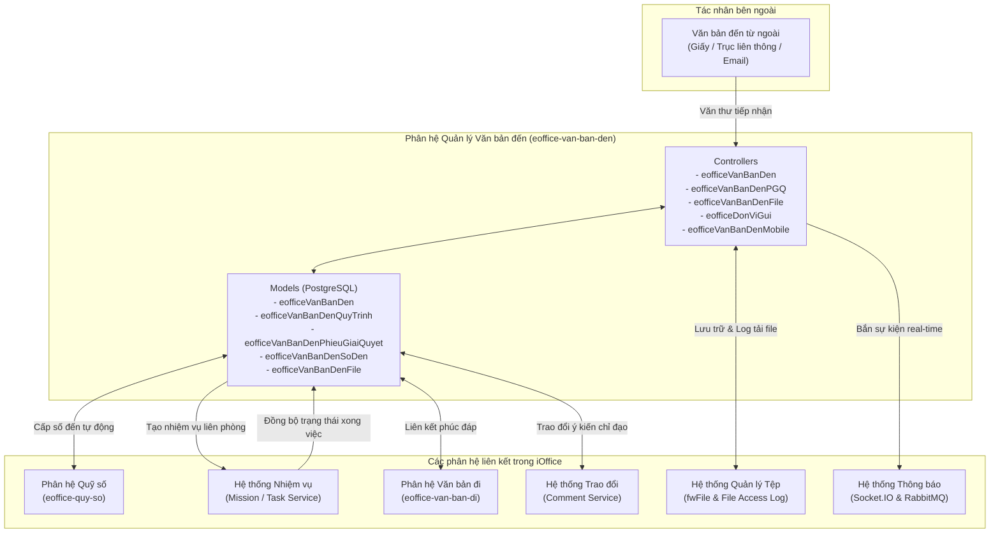
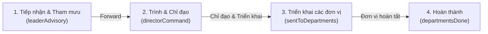
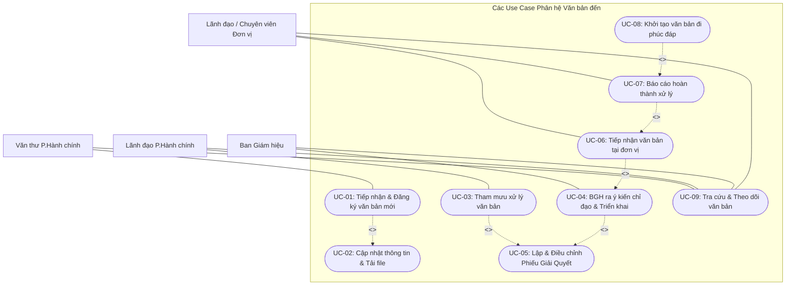

# Tài Liệu Phân Tích Nghiệp Vụ: Phân Hệ Quản Lý Văn Bản Đến (eoffice-van-ban-den)

> **Dự án**: Hệ thống Văn phòng điện tử (e-Office) - Trường Đại học Bách Khoa, ĐHQG-HCM (HCMUT)
> **Phân hệ**: Quản lý Văn bản đến (`modules/md-eoffice/eoffice-van-ban-den`)
> **Phiên bản tài liệu**: 2.0
> **Ngày cập nhật**: 15/09/2026

---

## 1. Bối cảnh, mục đích

### 1.1. Bối cảnh nghiệp vụ
Trong hoạt động quản trị đại học tại Trường Đại học Bách Khoa - ĐHQG-HCM (HCMUT), công tác tiếp nhận, xử lý và lưu trữ văn bản đến (công văn, chỉ thị, tờ trình, thông báo, quyết định từ ĐHQG-HCM, Bộ GD&ĐT, các cơ quan ban ngành và các đối tác bên ngoài) là một trong những mạch lưu chuyển thông tin trọng yếu nhất.

Trước khi ứng dụng hệ thống số hóa, quy trình xử lý văn bản đến gặp nhiều rào cản:
- **Thời gian luân chuyển chậm trễ**: Hồ sơ giấy phải luân chuyển vật lý qua nhiều cấp (Văn thư trường $\rightarrow$ Lãnh đạo Phòng Hành chính $\rightarrow$ Ban Giám hiệu $\rightarrow$ Lãnh đạo các Khoa/Phòng/Trung tâm $\rightarrow$ Cán bộ xử lý).
- **Khó khăn trong giám sát tiến độ**: Khó theo dõi văn bản đang dừng ở bước nào, ai đang thụ lý, thời hạn hoàn thành còn bao lâu; tình trạng tồn đọng hoặc trễ hạn không được cảnh báo kịp thời.
- **Rủi ro thất lạc và sai lệch thông tin**: Việc nhân bản, sao chụp giấy tờ làm tăng chi phí in ấn, lưu trữ và nguy cơ thất lạc tài liệu mật hoặc tài liệu quan trọng.
- **Thiếu tính liên kết**: Không gắn kết trực tiếp văn bản chỉ đạo với các đầu việc (nhiệm vụ) phát sinh và văn bản phúc đáp (văn bản đi).

Phân hệ **Quản lý Văn bản đến** (`eoffice-van-ban-den`) ra đời nhằm số hóa toàn diện quy trình tiếp nhận, luân chuyển, phê duyệt, phân công và giám sát văn bản trong toàn trường trên môi trường mạng.

---

### 1.2. Mục đích & Mục tiêu
- **Chuẩn hóa quy trình xử lý văn bản**: Thiết lập quy trình điện tử xuyên suốt gồm 4 bước nghiệp vụ: Tiếp nhận $\rightarrow$ Tham mưu $\rightarrow$ Chỉ đạo $\rightarrow$ Triển khai & Hoàn thành.
- **Tự động hóa đăng ký và cấp số**: Tích hợp với phân hệ Quỹ số để tự động cấp số đến tuần tự, bảo đảm không trùng lặp và tuân thủ thể thức hành chính nhà nước.
- **Phân công và điều hành minh bạch**: Ứng dụng Phiếu Giải Quyết (PGQ) cho phép Ban Giám hiệu và Phòng Hành chính - Tổng hợp phân công chi tiết đến từng đơn vị, cá nhân với vai trò xác định (Chỉ đạo, Đồng chỉ đạo, Chủ trì, Phối hợp, Theo dõi, Trả lời).
- **Liên thông tác nghiệp đa phân hệ**: Tự động chuyển đổi nội dung chỉ đạo từ văn bản đến thành các Nhiệm vụ liên phòng ban (Missions/Tasks) và hỗ trợ tạo lập Văn bản đi để trả lời/phúc đáp.
- **Giám sát thời gian thực (Real-time)**: Cập nhật tức thời trạng thái văn bản, nhắc nhở hạn xử lý, thông báo tức thì qua Socket.IO và Message Queue (RabbitMQ).
- **An toàn, bảo mật & Truy vết**: Phân quyền truy cập đa cấp (RBAC), kiểm soát tải/xem tài liệu mật qua nhật ký truy cập tệp (`fileAccessLog`), khóa giao dịch đồng thời (`pg_advisory_xact_lock`) để bảo vệ dữ liệu khi nhiều lãnh đạo thao tác.

---

### 1.3. Phạm vi áp dụng & Đối tượng người dùng
Phân hệ áp dụng cho toàn thể cán bộ, giảng viên và các đơn vị trực thuộc HCMUT với các nhóm đối tượng người dùng chính:
1. **Văn thư trường (Phòng Hành chính - Tổng hợp, Mã đơn vị `93`)**: Tiếp nhận văn bản bên ngoài, số hóa (scan), nhập thông tin, cấp số đến, theo dõi sổ văn bản.
2. **Lãnh đạo Phòng Hành chính - Tổng hợp (`head-office`, `deputy-office`)**: Rà soát, xử lý sơ bộ, ghi ý kiến tham mưu đề xuất xử lý và trình Ban Giám hiệu.
3. **Ban Giám hiệu (`president`, `vice-president`, Đơn vị `01`, `14`)**: Xem xét, ra ý kiến chỉ đạo điều hành, phê duyệt phân công trên Phiếu Giải Quyết, chỉ định đơn vị chủ trì/phối hợp.
4. **Lãnh đạo các Đơn vị (Trưởng/Phó Khoa, Phòng, Ban, Trung tâm - `head`, `deputy`)**: Tiếp nhận văn bản được triển khai, phân công chuyên viên xử lý hoặc tổ chức phối hợp thực hiện.
5. **Chuyên viên / Giảng viên thụ lý (`clerical`, cán bộ được phân công)**: Tiếp nhận văn bản, nghiên cứu xử lý công việc, báo cáo hoàn thành hoặc tham gia soạn thảo văn bản phúc đáp.

---

### 1.4. Kiến trúc Tích hợp & Mối liên hệ Hệ thống



---

## 2. Các yêu cầu chức năng

### 2.1. Quản lý Tiếp nhận & Đăng ký Văn bản đến
Yêu cầu quản lý toàn diện giai đoạn đầu tiếp nhận và số hóa văn bản đến từ các nguồn bên ngoài:
- **Tiếp nhận & Áp dụng quy trình mẫu**: Tiếp nhận hồ sơ văn bản bên ngoài, lựa chọn Loại văn bản để hệ thống tự động tải và kích hoạt cấu hình quy trình tương ứng (`eofficeVanBanDenConfigQuyTrinhLoaiVanBan`).
- **Cấp số đến tự động**: Tự động sinh số đến duy nhất, tăng dần theo năm hành chính từ Quỹ số tập trung (`eofficeQuySo`), có cơ chế kiểm tra tính trùng lặp trước khi lưu.
- **Ghi nhận thông tin hành chính**: Quản lý đầy đủ các thuộc tính của văn bản gồm: số/ký hiệu văn bản gửi, trích yếu nội dung, đơn vị gửi (tra cứu gợi ý từ danh mục chuẩn hóa `eofficeDmDonViGui`), ngày văn bản, ngày tiếp nhận, thời hạn xử lý (tự động thiết lập mặc định $+7$ ngày nếu để trống), mức độ khẩn và phân loại văn bản (thuần thông tin hay giao nhiệm vụ).
- **Khởi tạo quy trình & người xử lý**: Tự động sinh các bước quy trình (`eofficeVanBanDenQuyTrinh`) và gán người dùng tham gia bước đầu vào bảng phân quyền xem (`eofficeVanBanDenUser`).
- **Chỉnh sửa & Xóa hồ sơ**: Cho phép cập nhật thông tin hành chính văn bản theo quyền hạn; hỗ trợ xóa mềm và thu hồi số đến khi văn bản chưa chuyển sang các bước xử lý tiếp theo (`stepNo <= 1`).

---

### 2.2. Quản lý Tệp đính kèm (Attachment Management)
Yêu cầu lưu trữ, xử lý và kiểm soát an toàn tài liệu số hóa kèm theo văn bản:
- **Tải lên đa tệp**: Cho phép đính kèm một hoặc nhiều tệp dữ liệu (PDF, Word, hình ảnh: `.pdf`, `.docx`, `.png`, `.jpg`...), tự động đổi tên sang định danh ngẫu nhiên và lưu trữ tập trung tại phân vùng an toàn của hệ thống.
- **Đa dạng phương thức xem & tải**: Hỗ trợ xem trực tuyến (`inline`), tải về máy (`attachment`), tạo liên kết Office Viewer URL hoặc mã hóa `base64`.
- **Kiểm soát truy cập & Nhật ký kiểm toán**: Bắt buộc ghi vết kiểm toán mọi lượt xem/tải tệp vào `app.fileAccessLog` (ghi nhận thời điểm, định danh người dùng, IP, mã văn bản) phục vụ bảo mật thông tin hành chính.
- **Xóa tệp đính kèm**: Cho phép xóa mềm tệp theo phân quyền quản trị/chỉnh sửa văn bản.

---

### 2.3. Quản lý Luồng quy trình Xử lý (Workflow Management)
Yêu cầu điều phối và giám sát luân chuyển văn bản qua 4 bước trạng thái chuẩn:



- **Tham mưu xử lý (`leaderAdvisory`)**: Phòng Hành chính - Tổng hợp nghiên cứu nội dung, ghi nhận ý kiến tham mưu đề xuất và thực hiện chuyển tiếp (`forwardStep`) trình Ban Giám hiệu.
- **Chỉ đạo điều hành (`directorCommand`)**: Ban Giám hiệu xem xét ý kiến tham mưu, đưa ra ý kiến chỉ đạo và chốt phương án phân công trên Phiếu Giải Quyết (PGQ).
- **Cơ chế kiểm soát đa chỉ đạo & Khóa đồng thời**: Áp dụng khóa bi quan CSDL `pg_advisory_xact_lock` ngăn ngừa xung đột dữ liệu khi nhiều lãnh đạo thao tác cùng lúc; văn bản chỉ chuyển sang trạng thái triển khai khi cả Người chỉ đạo chính và tất cả Người đồng chỉ đạo đều đã hoàn tất ý kiến.
- **Chuyển tiếp quy trình & Thông báo thời gian thực**: Cập nhật số thứ tự bước, chuyển đổi trạng thái, cấp quyền xem tự động cho nhân sự bước tiếp theo và phát thông báo real-time qua Socket.IO.

---

### 2.4. Phân công Xử lý qua Phiếu Giải Quyết (PGQ)
Yêu cầu quản lý phân công trách nhiệm và theo dõi tiến độ xử lý chi tiết:
- **Phân công đa vai trò linh hoạt**: Thiết lập các dòng phân công gắn với đơn vị hoặc đích danh cá nhân theo 6 vai trò: *Chỉ đạo thực hiện, Đồng chỉ đạo (chỉ dành riêng cho BGH), Thực hiện chính, Phối hợp thực hiện, Trả lời (dự thảo văn bản đi) và Nhận để biết*.
- **Phân định cấp Đơn vị và Cá nhân**: Tự động phân bổ quyền xử lý cho toàn bộ Ban chủ nhiệm và Văn thư đơn vị khi giao cấp đơn vị, hoặc giới hạn đúng cá nhân khi giao cấp chuyên viên.
- **Tiếp nhận tại đơn vị (`tiepNhan`)**: Các đơn vị/cá nhân nhận văn bản thực hiện bấm xác nhận tiếp nhận; đối với văn bản thuần thông tin hoặc vai trò chỉ để biết, hệ thống tự động hoàn thành ngay tại thời điểm tiếp nhận.
- **Báo cáo hoàn thành & Tự động kết thúc văn bản**: Từng đơn vị báo cáo kết thúc phần việc; khi toàn bộ các đơn vị thực hiện chính và phối hợp đều đã hoàn thành, hệ thống tự động nâng trạng thái văn bản lên `departmentsDone`.

---

### 2.5. Tích hợp Hệ thống Nhiệm vụ (Mission/Task) & Văn bản đi
Yêu cầu liên thông dữ liệu và đồng bộ trạng thái công việc đa phân hệ:
- **Tự động sinh nhiệm vụ liên phòng ban**: Ngay khi văn bản chuyển sang trạng thái triển khai (`sentToDepartments`), tự động tạo một Nhiệm vụ mẹ liên phòng ban kèm các Subtasks tương ứng với từng đơn vị thụ lý trên PGQ.
- **Đồng bộ hai chiều qua Message Queue**: Lắng nghe và phát các sự kiện MQ (`create-task-done`, `done-task`, `receive-task`, `done-pgq`) để đồng bộ trạng thái xử lý giữa phân hệ Văn bản đến và phân hệ Nhiệm vụ; đồng bộ thời hạn hoàn thành khi văn bản có sự điều chỉnh.
- **Liên kết khởi tạo Văn bản đi phúc đáp**: Cho phép đơn vị có vai trò trả lời khởi tạo dự thảo Văn bản đi kế thừa trích yếu từ văn bản đến và tự động lưu trữ quan hệ liên kết (`eofficeVanBanDenVanBanDiRelation`).
- **Giám sát bất đồng bộ (Error Scanner)**: Cronjob chạy ngầm mỗi 30 phút rà soát các văn bản và nhiệm vụ lệch trạng thái để tự động tạo vé hỗ trợ kỹ thuật (`itTicket`).

---

### 2.6. Tra cứu, Thống kê & Hỗ trợ Đa nền tảng
Yêu cầu cung cấp giao diện tra cứu, phân loại và giám sát hiệu quả:
- **Phân loại theo Tab nghiệp vụ**: Hỗ trợ lọc danh sách theo các tab chuyên biệt: *Chờ xử lý, Chờ tham mưu, Chờ chỉ đạo, Quá hạn, Tất cả*.
- **Bộ đếm số lượng Badge Count thời gian thực**: Cung cấp số lượng văn bản cần xử lý tức thì theo vai trò thực tế của người dùng đang đăng nhập.
- **Dashboard Widget**: Cung cấp số liệu thống kê tổng hợp trực quan phục vụ hiển thị trên trang chủ e-Office.
- **API chuyên dụng cho Mobile**: Cung cấp endpoint tối ưu hóa dữ liệu phục vụ ứng dụng iOffice trên thiết bị di động.
- **Quản lý danh mục Đơn vị gửi ngoài**: Tìm kiếm gợi ý nhanh và cho phép tạo mới nhanh đơn vị gửi văn bản bên ngoài.

---

### 2.7. Ma trận Phân quyền & Vai trò (Role-Permission Matrix)

| Quyền / Hành động | Văn thư trường (`clerical-office`) | Lãnh đạo P.Hành chính (`head-office`, `deputy-office`) | Ban Giám hiệu (`president`, `vice-president`) | Lãnh đạo Đơn vị (`head`, `deputy`) | Chuyên viên thụ lý (`clerical`) |
|---|:---:|:---:|:---:|:---:|:---:|
| **Tạo mới văn bản đến** (`eofficeVanBanDen:add`) | ✅ | ✅ | ❌ | ❌ | ❌ |
| **Cấp số đến / Hủy số đến** | ✅ | ✅ | ❌ | ❌ | ❌ |
| **Chỉnh sửa thông tin văn bản** (`canModifyDocument`) | ✅ (bước 1, 2) | ✅ (bước 1, 2) | ❌ | ❌ | ❌ |
| **Tải lên / Xóa tệp đính kèm** (`canUpload`) | ✅ | ✅ | ❌ | ❌ | ❌ |
| **Ghi ý kiến tham mưu** (`canThamMuu`) | ✅ | ✅ | ❌ | ❌ | ❌ |
| **Chuyển tiếp trình Ban Giám hiệu** | ✅ | ✅ | ❌ | ❌ | ❌ |
| **Ghi ý kiến chỉ đạo** (`canChiDao`) | ❌ | ❌ | ✅ | ❌ | ❌ |
| **Lập / Sửa Phiếu Giải Quyết (PGQ)** | ✅ (dự thảo) | ✅ (dự thảo) | ✅ (chốt phân công) | ❌ | ❌ |
| **Bấm Tiếp nhận văn bản** (`canTiepNhan`) | ❌ | ❌ | ❌ | ✅ | ✅ |
| **Báo cáo Hoàn thành PGQ** (`canHoanThanh`) | ❌ | ❌ | ❌ | ✅ | ✅ |
| **Tạo Văn bản đi phúc đáp** | ❌ | ❌ | ❌ | ✅ (nếu có `traLoi`) | ✅ (nếu có `traLoi`) |
| **Xóa văn bản đến** (`canDelete`) | ✅ (chưa vào quy trình) | ✅ (chưa vào quy trình) | ❌ | ❌ | ❌ |

---

## 3. Đặc tả Usecase (Use Case Specifications)

### 3.1. Sơ đồ Tổng quan Usecase



> **Chú thích quan hệ giữa các Use Case:**
> - `<<include>>` (Bao hàm bắt buộc):
>   - `UC-01` $\xrightarrow{\text{<<include>>}}$ `UC-02`: Tiếp nhận & Đăng ký mới văn bản bắt buộc phải bao hàm việc cập nhật thông tin chi tiết và tải tệp đính kèm.
>   - `UC-03` $\xrightarrow{\text{<<include>>}}$ `UC-05`: Tham mưu xử lý văn bản bao hàm việc dự thảo lập danh sách phân công trên Phiếu Giải Quyết (PGQ).
>   - `UC-04` $\xrightarrow{\text{<<include>>}}$ `UC-05`: Lãnh đạo BGH chỉ đạo bao hàm việc phê duyệt hoặc điều chỉnh phân công trên Phiếu Giải Quyết (PGQ).
> - `<<extend>>` (Mở rộng tùy chọn / có điều kiện):
>   - `UC-08` $\xrightarrow{\text{<<extend>>}}$ `UC-07`: Khởi tạo văn bản đi phúc đáp là nhánh mở rộng khi Báo cáo hoàn thành xử lý văn bản đến (chỉ kích hoạt khi đơn vị được phân công vai trò `traLoi = true`).
>   - `UC-06` $\xrightarrow{\text{<<extend>>}}$ `UC-04`: Tiếp nhận văn bản tại đơn vị là bước mở rộng diễn ra sau khi văn bản đã được BGH chỉ đạo và triển khai (`sentToDepartments`).
>   - `UC-07` $\xrightarrow{\text{<<extend>>}}$ `UC-06`: Báo cáo hoàn thành xử lý là bước mở rộng tiếp theo sau khi đơn vị đã thực hiện tiếp nhận văn bản.

---

### 3.2. Chi tiết từng Usecase

#### UC-01: Tiếp nhận và Đăng ký Văn bản đến
- **Mã Usecase**: `UC-01`
- **Tên Usecase**: Tiếp nhận và Đăng ký Văn bản đến mới
- **Actor chính**: Văn thư trường (`clerical-office`, `head-office`)
- **Mô tả tóm tắt**: Văn thư tiếp nhận văn bản bên ngoài, tạo hồ sơ văn bản điện tử, hệ thống cấp số đến tự động và khởi tạo quy trình.
- **Tiền điều kiện**:
  - Người dùng đăng nhập hệ thống với vai trò Văn thư hoặc Lãnh đạo Phòng Hành chính.
  - Quỹ số văn bản đến của năm hiện tại đang ở trạng thái kích hoạt (`apDung = 1`).
- **Hậu điều kiện**:
  - Hồ sơ văn bản được tạo lập thành công trong CSDL (`eoffice_van_ban_den`).
  - Số đến được cấp duy nhất và liên kết với văn bản (`eoffice_van_ban_den_so_den`).
  - Toàn bộ danh sách các bước quy trình được sinh ra (`eoffice_van_ban_den_quy_trinh`).
- **Luồng sự kiện chính (Basic Flow)**:
  1. Văn thư truy cập trang Quản lý Văn bản đến, nhấn nút **"Tạo mới"**.
  2. Hệ thống hiển thị danh mục Loại văn bản (`/api/e-office/cau-hinh/loai-van-ban/all`).
  3. Văn thư chọn loại văn bản và gửi yêu cầu tạo lập (`POST /api/e-office/van-ban-den`).
  4. Hệ thống mở transaction cơ sở dữ liệu:
     - Kiểm tra quỹ số áp dụng cho năm hiện tại (`eofficeQuySo`).
     - Tự động sinh số đến tiếp theo (`app.constant.eofficeQuySo.getSoMoi`).
     - Tạo bản ghi văn bản đến với trạng thái ban đầu, hạn hoàn thành mặc định là 7 ngày sau ngày nhận.
     - Tạo bản ghi số đến trong `eofficeVanBanDenSoDen`.
     - Đọc cấu hình quy trình mẫu (`eofficeVanBanDenConfigQuyTrinh`) và sinh các bước quy trình tương ứng trong `eofficeVanBanDenQuyTrinh`.
     - Cập nhật trạng thái văn bản sang bước đầu tiên (`trangThai = quyTrinh[0].stepKey`).
     - Thêm quyền xem văn bản cho người tạo và nhân sự bước 1 trong `eofficeVanBanDenUser`.
     - Commit transaction.
  5. Hệ thống trả về đối tượng văn bản vừa tạo và chuyển sang giao diện chi tiết để tiếp tục hoàn thiện thông tin.
- **Luồng rẽ nhánh / Ngoại lệ (Alternative / Exception Flows)**:
  - *Quỹ số không tồn tại hoặc hết hạn*: Hệ thống rollback transaction và thông báo lỗi: *"Quỹ số không tồn tại hoặc chưa được kích hoạt!"*.
  - *Không tìm thấy quy trình tương ứng với loại văn bản*: Hệ thống hủy bỏ giao dịch và báo lỗi: *"Không tồn tại quy trình cho loại văn bản này!"*.

---

#### UC-02: Cập nhật Thông tin và Quản lý Tệp đính kèm
- **Mã Usecase**: `UC-02`
- **Tên Usecase**: Cập nhật Thông tin văn bản và Quản lý Tệp đính kèm
- **Actor chính**: Người dùng có quyền `canModifyDocument` / `eofficeVanBanDen:write`
- **Mô tả tóm tắt**: Cập nhật các trường dữ liệu hành chính của văn bản và tải lên các tệp scan, tệp phụ lục liên quan.
- **Tiền điều kiện**: Văn bản đã tồn tại và người dùng có quyền chỉnh sửa.
- **Hậu điều kiện**: Thông tin văn bản và danh sách tệp đính kèm được cập nhật trên hệ thống.
- **Luồng sự kiện chính**:
  1. Người dùng mở trang chi tiết văn bản đến.
  2. Người dùng chỉnh sửa các trường: Trích yếu, Số văn bản, Đơn vị gửi, Ngày văn bản, Hạn hoàn thành, Ghi chú, Tính chất khẩn, Phân loại thông tin.
  3. Người dùng chọn tải lên một hoặc nhiều tệp đính kèm:
     - Gửi yêu cầu `POST /api/e-office/van-ban-den/upload-file?vanBanDenId={id}`.
     - Hệ thống kiểm tra tệp, đổi tên sang định dạng an toàn, lưu trữ vật lý trong thư mục tài nguyên.
     - Lưu thông tin tệp vào `fwFile` và `eofficeVanBanDenFile`.
  4. Người dùng bấm lưu thông tin văn bản (`PUT /api/e-office/van-ban-den/:id`).
  5. Hệ thống cập nhật bản ghi văn bản. Nếu văn bản đã liên kết nhiệm vụ (`missionExternalLink`), hệ thống tự động cập nhật lại thời hạn kết thúc của nhiệm vụ (`endDate`).
  6. Hệ thống phản hồi thành công.
- **Luồng rẽ nhánh / Ngoại lệ**:
  - *Văn bản đã hoàn thành (`departmentsDone`)*: Hệ thống chỉ cho phép sửa các trường: đơn vị gửi, ngày văn bản, hạn hoàn thành, nội dung trích yếu, ghi chú, phân loại thông tin; không cho phép đổi số văn bản hay tính chất khẩn.
  - *Tệp tải lên không hợp lệ*: Hệ thống hủy bỏ transaction, dọn dẹp các tệp tạm trên đĩa và trả về mã lỗi 500 kèm thông báo.

---

#### UC-03: Tham mưu Xử lý Văn bản đến
- **Mã Usecase**: `UC-03`
- **Tên Usecase**: Tham mưu Xử lý Văn bản đến (`leaderAdvisory`)
- **Actor chính**: Lãnh đạo / Văn thư Phòng Hành chính - Tổng hợp (`head-office`, `deputy-office`, `clerical-office`)
- **Mô tả tóm tắt**: Nghiên cứu nội dung văn bản, nhập ý kiến tham mưu, dự thảo phương án phân công trên PGQ và trình văn bản lên Ban Giám hiệu.
- **Tiền điều kiện**:
  - Văn bản đang ở trạng thái `received` hoặc `leaderAdvisory`.
  - Người dùng có cờ `canThamMuu = true` trong bước quy trình hiện tại.
- **Hậu điều kiện**:
  - Ý kiến tham mưu được ghi nhận vào lịch sử quy trình.
  - Trạng thái văn bản chuyển sang `directorCommand` (Chờ chỉ đạo).
  - Ban Giám hiệu nhận được thông báo văn bản mới cần chỉ đạo.
- **Luồng sự kiện chính**:
  1. Người dùng mở chi tiết văn bản ở tab "Chờ tham mưu" hoặc "Chờ xử lý".
  2. Người dùng nhập ý kiến tham mưu vào ô ghi chú/nội dung trình.
  3. (Tùy chọn) Người dùng lập dự thảo danh sách đơn vị/cá nhân xử lý trên Phiếu Giải Quyết (xem `UC-05`).
  4. Người dùng nhấn nút hành động động (ví dụ: **"Trình chỉ đạo"** hoặc **"Chuyển tiếp"**).
  5. Hệ thống gửi yêu cầu `PUT /api/e-office/van-ban-den/:id/forward`:
     - Kiểm tra nếu văn bản chưa có hạn xử lý, tự động bổ sung hạn là 7 ngày sau ngày nhận.
     - Gọi `app.model.eofficeVanBanDen.forwardStep`.
     - Cập nhật hoặc ghi mới bản ghi lịch sử `eofficeVanBanDenQuyTrinhHistory` với ý kiến tham mưu, thời gian và thông tin người thực hiện.
     - Cập nhật trạng thái văn bản lên bước kế tiếp (`directorCommand`).
     - Cấp quyền xem cho các nhân sự ở bước chỉ đạo (`eofficeVanBanDenUser`).
     - Phát sự kiện real-time qua Socket.IO: `eoffice-van-ban-den:page` và `eoffice-van-ban-den:{id}`.
  6. Hệ thống hiển thị thông báo chuyển tiếp thành công.

---

#### UC-04: Ban Giám hiệu Chỉ đạo và Phê duyệt Phân công
- **Mã Usecase**: `UC-04`
- **Tên Usecase**: Ban Giám hiệu Chỉ đạo và Phê duyệt Phân công (`directorCommand`)
- **Actor chính**: Hiệu trưởng, Phó Hiệu trưởng (`president`, `vice-president`)
- **Mô tả tóm tắt**: Lãnh đạo BGH xem xét ý kiến tham mưu, ghi ý kiến chỉ đạo điều hành, điều chỉnh danh sách phân công PGQ và phê duyệt triển khai xuống các đơn vị.
- **Tiền điều kiện**:
  - Văn bản đang ở trạng thái `directorCommand`.
  - Người dùng có quyền `canChiDao = true` và tài khoản thuộc BGH.
- **Hậu điều kiện**:
  - Ý kiến chỉ đạo được lưu vào lịch sử quy trình và đồng bộ sang hộp bình luận trao đổi (`commentBox`).
  - Nếu toàn bộ các đồng chỉ đạo đã hoàn tất: trạng thái văn bản chuyển sang `sentToDepartments` (Đã triển khai); hệ thống tự động sinh cây nhiệm vụ (Task/Mission) liên phòng ban.
- **Luồng sự kiện chính**:
  1. Lãnh đạo BGH truy cập tab "Chờ chỉ đạo", mở chi tiết văn bản.
  2. Lãnh đạo xem tệp đính kèm, trích yếu và ý kiến tham mưu của Phòng Hành chính.
  3. Lãnh đạo nhập nội dung chỉ đạo (ví dụ: *"Giao P.KH-TC chủ trì thẩm định, P.CSVC phối hợp thực hiện trước ngày 25/10"*).
  4. Lãnh đạo điều chỉnh hoặc xác nhận phân công trên Phiếu Giải Quyết (chỉ định đơn vị chủ trì, phối hợp, để biết...).
  5. Lãnh đạo nhấn **"Lưu chỉ đạo"** / **"Chỉ đạo & Triển khai"** (`PUT /api/e-office/van-ban-den/chi-dao/:id`).
  6. Hệ thống thực thi xử lý nghiệp vụ với cơ chế khóa đồng thời (`chiDaoV2`):
     - Xác lập khóa bi quan `SELECT pg_advisory_xact_lock(1001, :id)`.
     - Lưu ý kiến chỉ đạo vào `eofficeVanBanDenQuyTrinhHistory`.
     - Đồng bộ ý kiến vào `commentGeneral` (nếu có hộp thảo luận).
     - Kiểm tra điều kiện triển khai: Kiểm tra trong PGQ xem người chỉ đạo chính (`chiDaoThucHien`) và TẤT CẢ các đồng chỉ đạo (`dongChiDao`) đã ghi nhận ý kiến chỉ đạo hay chưa.
     - **Nếu đủ điều kiện triển khai**:
       - Cập nhật văn bản sang trạng thái `sentToDepartments`, lưu thời điểm triển khai `deploymentAt`.
       - Nếu văn bản không phải là loại phổ biến thông tin (`!isThongTin`): Tự động gọi `app.missionService.createFromVanBanDen` khởi tạo cây nhiệm vụ liên phòng ban.
       - Tự động cấp quyền truy cập văn bản cho Ban chủ nhiệm/Văn thư các đơn vị được phân công thực hiện (`eofficeVanBanDenUser`).
  7. Commit transaction, giải phóng khóa và phản hồi kết quả thành công.
- **Luồng rẽ nhánh / Ngoại lệ**:
  - *Chưa đủ ý kiến của các Đồng chỉ đạo*: Hệ thống lưu lại ý kiến của lãnh đạo hiện tại nhưng giữ nguyên trạng thái văn bản ở `directorCommand` để chờ các lãnh đạo còn lại cho ý kiến.

---

#### UC-05: Lập và Điều chỉnh Phiếu Giải Quyết (PGQ)
- **Mã Usecase**: `UC-05`
- **Tên Usecase**: Lập và Điều chỉnh Phiếu Giải Quyết
- **Actor chính**: Lãnh đạo/Văn thư P.Hành chính (dự thảo), Ban Giám hiệu (phê duyệt)
- **Mô tả tóm tắt**: Thêm, sửa hoặc xóa các dòng phân công trách nhiệm trong Phiếu Giải Quyết gắn liền với văn bản đến.
- **Tiền điều kiện**: Người dùng có quyền `canEditPhieuGiaiQuyet = true`.
- **Hậu điều kiện**: Dữ liệu PGQ được cập nhật, đồng bộ vào danh sách nhân sự quy trình và danh sách người được xem văn bản.
- **Luồng sự kiện chính**:
  1. Người dùng mở panel Phiếu Giải Quyết trên trang chi tiết văn bản.
  2. Người dùng thêm mới một dòng phân công (`POST /api/e-office/van-ban-den/phieu-giai-quyet`):
     - Chọn danh sách đơn vị (`listMaDonVi`) hoặc danh sách cán bộ (`listShcc`).
     - Tích chọn vai trò: Chỉ đạo thực hiện (`chiDaoThucHien`), Đồng chỉ đạo (`dongChiDao`), Thực hiện chính (`thucHien`), Phối hợp (`phoiHopThucHien`), Trả lời (`traLoi`), Để biết (`biet`).
  3. Hệ thống kiểm tra tính hợp lệ:
     - Nếu vai trò là `chiDaoThucHien` hoặc `dongChiDao`, đơn vị bắt buộc phải là BGH (`01` hoặc `14`).
     - Bổ sung nhân sự vào quy trình (`addToQuyTrinh`) và gán quyền xem (`eofficeVanBanDenUser`).
     - Nếu văn bản đang ở trạng thái `sentToDepartments`, tự động bắn message `create-task` sang hệ thống nhiệm vụ.
  4. Người dùng có thể chỉnh sửa (`PUT`) hoặc xóa (`DELETE`) một dòng PGQ khi cần thiết. Khi xóa một dòng chỉ đạo, hệ thống tự động gỡ bỏ nhân sự đó khỏi quy trình.
  5. Hệ thống lưu nhật ký thao tác PGQ vào `eofficeVanBanDenLog`.

---

#### UC-06: Tiếp nhận Văn bản tại Đơn vị / Cá nhân
- **Mã Usecase**: `UC-06`
- **Tên Usecase**: Tiếp nhận Văn bản tại Đơn vị / Cá nhân
- **Actor chính**: Lãnh đạo Đơn vị, Văn thư Đơn vị hoặc Chuyên viên được phân công trong PGQ
- **Mô tả tóm tắt**: Cán bộ nhận được thông báo văn bản được chuyển đến đơn vị, thực hiện thao tác xác nhận tiếp nhận văn bản.
- **Tiền điều kiện**:
  - Văn bản đang ở trạng thái `sentToDepartments`.
  - Người dùng thuộc đơn vị hoặc là cá nhân có dòng phân công trong PGQ (`canTiepNhan = true`) và dòng này chưa có `receivedAt`.
- **Hậu điều kiện**:
  - Dòng PGQ được ghi nhận `receivedAt` và `receivedBy`.
  - Tự động tham gia nhiệm vụ liên kết (`missionParticipant.joinMission`).
  - Nếu là văn bản thuần thông tin hoặc nhận để biết, tự động đánh dấu hoàn thành.
- **Luồng sự kiện chính**:
  1. Cán bộ mở văn bản trong tab "Chờ xử lý".
  2. Cán bộ bấm nút **"Tiếp nhận"** (`PUT /api/e-office/van-ban-den/phieu-giai-quyet/tiep-nhan/:id`).
  3. Hệ thống mở transaction:
     - Ghi nhận thời gian `receivedAt` và mã nhân sự `receivedBy`.
     - Ghi nhận lịch sử xử lý vào `eofficeVanBanDenQuyTrinhHistory`.
     - Kiểm tra nếu văn bản là `isThongTin = true` hoặc dòng PGQ có `biet = true`: Tự động cập nhật luôn `doneAt = receivedAt` và `doneBy = receivedBy`.
     - Nếu văn bản có liên kết nhiệm vụ (`missionExternalLink`): Tự động cập nhật người dùng vào danh sách đã tham gia nhiệm vụ (`joinMission`).
     - Kiểm tra nếu tất cả các dòng PGQ thực hiện đều đã hoàn tất: Tự động chuyển trạng thái văn bản sang `departmentsDone`.
  4. Commit transaction, ghi log hệ thống và phản hồi thành công.

---

#### UC-07: Báo cáo Hoàn thành Xử lý Văn bản đến
- **Mã Usecase**: `UC-07`
- **Tên Usecase**: Báo cáo Hoàn thành Xử lý Văn bản đến
- **Actor chính**: Cán bộ / Đơn vị thực hiện chính, phối hợp hoặc trả lời (`canHoanThanh = true`)
- **Mô tả tóm tắt**: Sau khi hoàn thành phần việc được giao theo văn bản, cán bộ báo cáo kết thúc xử lý trên hệ thống.
- **Tiền điều kiện**:
  - Văn bản đang ở trạng thái `sentToDepartments`.
  - Dòng PGQ đã được tiếp nhận (`receivedAt != null`) và chưa hoàn thành (`doneAt == null`).
- **Hậu điều kiện**:
  - Dòng PGQ ghi nhận `doneAt` và `doneBy`.
  - Đồng bộ trạng thái hoàn thành sang hệ thống nhiệm vụ (`done-pgq`).
  - Nếu tất cả các đơn vị trong PGQ đều xong việc, văn bản chuyển sang trạng thái `departmentsDone`.
- **Luồng sự kiện chính**:
  1. Cán bộ thụ lý mở chi tiết văn bản, kiểm tra kết quả công việc.
  2. Cán bộ nhấn nút **"Hoàn thành"**, nhập nội dung ghi chú kết quả (nếu có).
  3. Gửi yêu cầu `PUT /api/e-office/van-ban-den/phieu-giai-quyet/hoan-thanh/:id`.
  4. Hệ thống cập nhật:
     - Cập nhật `doneAt` và `doneBy` cho dòng PGQ.
     - Tạo bản ghi trong `eofficeVanBanDenQuyTrinhHistory`.
     - Bắn message `done-pgq:eoffice_van_ban_den` sang hàng đợi để cập nhật tiến độ công việc bên hệ thống nhiệm vụ.
     - Kiểm tra lại toàn bộ các dòng PGQ của văn bản: nếu không còn dòng nào chưa hoàn tất (loại trừ nhóm chỉ đạo), hệ thống tự động cập nhật văn bản sang `trangThai = 'departmentsDone'`.
     - Phát sự kiện Socket `eoffice-van-ban-den:dashboard` để cập nhật lại số liệu.
  5. Hệ thống hiển thị thông báo xử lý thành công.

---

#### UC-08: Khởi tạo Văn bản đi Phúc đáp / Trả lời
- **Mã Usecase**: `UC-08`
- **Tên Usecase**: Khởi tạo Văn bản đi Phúc đáp / Trả lời từ Văn bản đến
- **Actor chính**: Cán bộ thuộc đơn vị có vai trò `traLoi = true` trên PGQ
- **Mô tả tóm tắt**: Khi văn bản đến yêu cầu phải có phản hồi bằng văn bản chính thức, cán bộ bấm tạo Văn bản đi liên kết trực tiếp từ hồ sơ văn bản đến.
- **Tiền điều kiện**:
  - Văn bản đến đã hoàn thành xử lý (`trangThai = 'departmentsDone'`).
  - Đơn vị của người dùng được phân công vai trò `traLoi = true`.
  - Chưa tồn tại văn bản đi liên kết hoặc cần lập văn bản đi mới.
- **Hậu điều kiện**: Một dự thảo Văn bản đi mới được tạo lập, tự động kế thừa trích yếu và thiết lập liên kết trong `eofficeVanBanDenVanBanDiRelation`.
- **Luồng sự kiện chính**:
  1. Cán bộ thụ lý mở chi tiết văn bản đến đã hoàn thành.
  2. Hệ thống hiển thị nút chức năng **"Tạo văn bản đi"** (`canCreateVanBanDi = true`).
  3. Cán bộ nhấn nút, hệ thống điều hướng sang form tạo Văn bản đi (`eoffice-van-ban-di`), tự động điền:
     - Trích yếu: Trả lời/Phúc đáp cho văn bản đến số...
     - Đơn vị nhận: Kế thừa từ đơn vị gửi của văn bản đến.
     - Liên kết nguồn: Lưu ID văn bản đến vào trường quan hệ.
  4. Sau khi Văn bản đi được khởi tạo, hệ thống ghi nhận mối quan hệ vào bảng `eoffice_van_ban_den_van_ban_di_relation`.

---

#### UC-09: Tra cứu, Lọc và Giám sát Tiến độ Văn bản đến
- **Mã Usecase**: `UC-09`
- **Tên Usecase**: Tra cứu, Lọc và Giám sát Tiến độ Văn bản đến
- **Actor chính**: Toàn thể cán bộ nhân viên có quyền truy cập module (`eofficeVanBanDen:read`)
- **Mô tả tóm tắt**: Tra cứu danh sách văn bản theo các tab nghiệp vụ, tìm kiếm theo số/trích yếu, lọc theo ngày tháng, xem dòng thời gian (timeline) và trạng thái thụ lý của các đơn vị.
- **Tiền điều kiện**: Người dùng đã đăng nhập hệ thống iOffice.
- **Luồng sự kiện chính**:
  1. Người dùng chọn tab mong muốn: "Chờ xử lý", "Chờ tham mưu", "Chờ chỉ đạo", "Quá hạn", hoặc "Tất cả".
  2. Người dùng nhập tiêu chí tìm kiếm: từ khóa trích yếu, số văn bản, khoảng thời gian nhận, đơn vị gửi.
  3. Hệ thống gọi API `/api/e-office/van-ban-den/page/:pageNumber/:pageSize` kèm bộ lọc và thông tin vai trò của người dùng (`roleKey`, `maDonVi`, `shcc`).
  4. Hệ thống truy vấn CSDL, kiểm tra quyền hạn và trả về danh sách văn bản kèm thông tin tóm tắt.
  5. Người dùng chọn một văn bản cụ thể: hệ thống hiển thị chi tiết văn bản, bao gồm:
     - Thông tin hành chính (Số, ngày, đơn vị gửi, hạn xử lý).
     - Danh sách tệp đính kèm.
     - Dòng thời gian tiến trình (Timeline các bước).
     - Bảng phân công Phiếu Giải Quyết (tiến độ từng đơn vị: đã nhận, đã xong).
     - Lịch sử ý kiến chỉ đạo và thảo luận liên quan.

---

## 4. Các quy tắc nghiệp vụ (Business Rules)

### 4.1. BR-01: Quy tắc Cấp số đến & Quản lý Quỹ số
- **BR-01.1 (Tính duy nhất của Số đến)**: Số đến (`soDen`) là một số nguyên dương tăng dần, bắt buộc phải là duy nhất trong phạm vi một Quỹ số (`quySoId`) và một Năm hành chính (`nam`). Hệ thống kiểm soát ràng buộc này ở tầng ứng dụng và bảng `eoffice_van_ban_den_so_den`.
- **BR-01.2 (Tự động hóa lấy số)**: Văn thư không tự gõ số đến bằng tay. Số đến được sinh tự động thông qua hàm quản lý quỹ số tập trung `app.constant.eofficeQuySo.getSoMoi(quySoItem)` tại thời điểm tạo văn bản.
- **BR-01.3 (Thu hồi số khi xóa văn bản)**: Khi một văn bản đến bị xóa ở bước khởi tạo (`stepNo <= 1`), bản ghi số đến tương ứng trong bảng `eoffice_van_ban_den_so_den` sẽ bị xóa để giải phóng số hoặc phục vụ mục đích kiểm toán sổ văn thư.
- **BR-01.4 (Khóa sổ theo năm)**: Quỹ số văn bản đến được quản lý độc lập theo từng năm dương lịch. Sang năm mới, hệ thống tự động áp dụng quỹ số của năm mới với số đến bắt đầu lại từ 1.

---

### 4.2. BR-02: Quy tắc Vòng đời Trạng thái & Chuyển bước Quy trình
- **BR-02.1 (Tính đơn dòng tuần tự của trạng thái chính)**: Một văn bản đến chỉ tồn tại ở một trạng thái chính tại một thời điểm, chuyển tiếp tuần tự theo 4 bước:
  $$\text{received} \xrightarrow{} \text{leaderAdvisory} \xrightarrow{} \text{directorCommand} \xrightarrow{} \text{sentToDepartments} \xrightarrow{} \text{departmentsDone}$$
- **BR-02.2 (Điều kiện tiên quyết để chuyển bước - Forward Conditions)**:
  - *Chuyển từ bước 1 sang bước 2*: Văn bản bắt buộc phải có Số văn bản (`soVanBan`), Trích yếu nội dung (`noiDung`) và ít nhất một tệp đính kèm hợp lệ (`canUpload`).
  - *Chuyển từ bước 2 sang bước 3*: Phải có ít nhất một ý kiến chỉ đạo của lãnh đạo BGH và Phiếu Giải Quyết (PGQ) phải được thiết lập hợp lệ (tối thiểu 1 đơn vị thực hiện).
- **BR-02.3 (Quy tắc tự động thiết lập hạn xử lý)**: Nếu tại thời điểm chuyển bước (`forwardStep`), trường Hạn hoàn thành (`hanHoanThanh`) của văn bản vẫn để trống, hệ thống tự động gán hạn xử lý mặc định là:
  $$\text{hanHoanThanh} = \text{ngayNhan} + 7 \text{ ngày}$$
- **BR-02.4 (Không cho phép quay lui trạng thái tự do)**: Sau khi văn bản đã được chỉ đạo và triển khai xuống các đơn vị (`sentToDepartments`), không được phép tùy tiện chuyển ngược về trạng thái trước nhằm bảo đảm tính toàn vẹn của dữ liệu và các nhiệm vụ đã phân công.

---

### 4.3. BR-03: Quy tắc Kiểm soát Đồng thời & Đa chỉ đạo (Concurrency & Multi-director Command)
- **BR-03.1 (Khóa giao dịch cơ sở dữ liệu - Advisory Lock)**: Để ngăn chặn xung đột dữ liệu (Race Condition) khi nhiều thành viên Ban Giám hiệu cùng truy cập và phê duyệt chỉ đạo đồng thời trên cùng một văn bản, hệ thống bắt buộc sử dụng khóa transaction-level của PostgreSQL:
  ```sql
  SELECT pg_advisory_xact_lock(1001, :id);
  ```
  Mọi giao dịch cùng can thiệp vào văn bản `:id` phải chờ giao dịch trước giải phóng khóa.
- **BR-03.2 (Quy tắc Đồng thuận Triển khai của Ban Giám hiệu)**:
  - Khi Phiếu Giải Quyết phân công 1 Lãnh đạo chỉ đạo chính (`chiDaoThucHien`) và $N$ Lãnh đạo đồng chỉ đạo (`dongChiDao`), văn bản **chỉ được phép chuyển trạng thái** sang `sentToDepartments` khi:
    $$\text{canTrienKhai} = (\text{Lãnh đạo chính đã chỉ đạo}) \land (\forall \text{ Lãnh đạo đồng chỉ đạo đã chỉ đạo})$$
  - Nếu một trong các lãnh đạo đồng chỉ đạo chưa cho ý kiến, hệ thống chỉ lưu ý kiến của người đã ký và giữ nguyên trạng thái văn bản ở `directorCommand`.
- **BR-03.3 (Cập nhật ý kiến chỉ đạo)**: Một lãnh đạo được phép cập nhật/bổ sung ý kiến chỉ đạo của mình nhiều lần. Mỗi lần cập nhật sẽ ghi nhận bản ghi mới vào lịch sử quy trình và lưu vết thay đổi trong `eofficeVanBanDenLog`.

---

### 4.4. BR-04: Quy tắc Phân công & Vai trò trên Phiếu Giải Quyết (PGQ)
- **BR-04.1 (Ràng buộc nhân sự Chỉ đạo)**: Vai trò `chiDaoThucHien` và `dongChiDao` chỉ được phép áp dụng cho nhân sự thuộc Ban Giám hiệu (Mã đơn vị `01` hoặc `14`).
- **BR-04.2 (Phân biệt cấp Đơn vị và cấp Cá nhân)**:
  - Nếu chỉ định phân công cho Đơn vị (`maDonVi` có giá trị, `shcc = null`): Toàn bộ Ban chủ nhiệm đơn vị và Văn thư đơn vị đó đều có quyền tiếp nhận và xử lý.
  - Nếu chỉ định đích danh Cá nhân (`shcc` có giá trị): Chỉ chính xác cá nhân đó (hoặc người được ủy quyền hợp lệ) mới có quyền tiếp nhận và báo cáo hoàn thành trên dòng PGQ đó.
- **BR-04.3 (Tự động đồng bộ quyền truy cập theo PGQ)**: Khi một nhân sự hoặc đơn vị được thêm vào PGQ, hệ thống tự động ghi nhận vào bảng `eofficeVanBanDenUser` để cấp quyền đọc văn bản cho người đó. Ngược lại, nếu xóa khỏi PGQ, quyền xem văn bản sẽ được thu hồi (nếu người đó không thuộc các bước quy trình khác).
- **BR-04.4 (Tính toàn vẹn của PGQ khi xóa)**: Không được phép xóa một dòng PGQ đã có ghi nhận thời điểm tiếp nhận (`receivedAt != null`) hoặc đã hoàn thành (`doneAt != null`).

---

### 4.5. BR-05: Quy tắc Tiếp nhận, Xử lý Văn bản Thông tin & Điều kiện Hoàn thành
- **BR-05.1 (Điều kiện tiếp nhận)**: Thao tác "Tiếp nhận" chỉ hợp lệ khi:
  - Văn bản đang ở trạng thái `sentToDepartments`.
  - Dòng PGQ chưa được tiếp nhận (`receivedAt == null`).
  - Người dùng đăng nhập có `shcc` trùng với `shcc` trên PGQ, hoặc có vai trò quản lý trong `maDonVi` của dòng PGQ đó.
- **BR-05.2 (Xử lý Văn bản Thông tin & Vai trò Để biết)**:
  - Nếu văn bản có cờ `isThongTin = true` (Văn bản thuần thông tin, không giao nhiệm vụ) HOẶC dòng PGQ có vai trò `biet = true` (Chỉ gửi để biết):
  - Ngay khi người dùng nhấn **"Tiếp nhận"**, hệ thống tự động thực hiện:
    $$\text{doneAt} = \text{receivedAt} = \text{Thời điểm bấm tiếp nhận}$$
    $$\text{doneBy} = \text{receivedBy} = \text{Cán bộ bấm tiếp nhận}$$
  - Đơn vị/cá nhân không cần thực hiện thêm bước báo cáo hoàn thành nào khác.
- **BR-05.3 (Quy tắc Tự động Hoàn thành Toàn bộ Văn bản)**:
  - Một văn bản đến được coi là hoàn tất và tự động nâng trạng thái lên `departmentsDone` khi và chỉ khi:
    $$\forall \text{ pgq} \in \text{PGQ}_{\text{Thực hiện}} \implies \text{pgq.doneAt} \neq \text{null}$$
  - Trong đó, $\text{PGQ}_{\text{Thực hiện}}$ là tập hợp các dòng PGQ ngoại trừ các dòng của Ban Giám hiệu (`!chiDaoThucHien \land !dongChiDao`).

---

### 4.6. BR-06: Quy tắc Phân quyền Truy cập Dữ liệu & Bảo lưu Lịch sử
- **BR-06.1 (Bảo vệ dữ liệu theo phạm vi vai trò - RBAC)**:
  - Lãnh đạo BGH được xem tất cả văn bản có bước chỉ đạo hoặc được phân công chỉ đạo.
  - Phòng Hành chính - Tổng hợp (Đơn vị `93`) đóng vai trò quản trị phân hệ, được xem toàn bộ văn bản đến của trường để phục vụ công tác văn thư.
  - Các đơn vị khác chỉ được xem những văn bản mà đơn vị/cá nhân mình có mặt trong quy trình xử lý hoặc trong Phiếu Giải Quyết.
- **BR-06.2 (Bất biến của Lịch sử Luân chuyển - Immutability of History)**:
  - Mọi bản ghi trong bảng `eoffice_van_ban_den_quy_trinh_history` sau khi được tạo ra **tuyệt đối không bị xóa hoặc ghi đè vật lý**.
  - Mọi thông tin đều gắn chặt với định danh người thực hiện (`doneBy`), thời điểm (`doneAt`), đơn vị (`maDonVi`), chức vụ (`maChucVu`) và nội dung ghi chú (`note`) nhằm phục vụ công tác thanh tra, kiểm toán hành chính.
- **BR-06.3 (Ghi nhận Nhật ký Hoạt động - Audit Logging)**: Mọi thao tác trọng yếu (tạo mới văn bản, sửa thông tin, chỉ đạo, lập/xóa PGQ, tiếp nhận, hoàn thành) đều được ghi nhận vào bảng `eoffice_van_ban_den_log` kèm dữ liệu trước (`prevData`) và dữ liệu sau (`currData`).

---

### 4.7. BR-07: Quy tắc Tích hợp Hệ thống Nhiệm vụ (Mission/Task)
- **BR-07.1 (Khởi tạo Nhiệm vụ Tự động)**:
  - Chỉ kích hoạt tạo nhiệm vụ khi văn bản chuyển sang `sentToDepartments` và văn bản KHÔNG PHẢI là loại thuần thông tin (`isThongTin == false`).
  - Hệ thống tạo 1 Nhiệm vụ liên phòng ban (Parent Task): tiêu đề là trích yếu văn bản, thời hạn kết thúc là `hanHoanThanh` của văn bản.
  - Mỗi đơn vị thực hiện chính và phối hợp được sinh một Subtask tương ứng gán trực tiếp với `phieuGiaiQuyetId`.
- **BR-07.2 (Đồng bộ hai chiều qua Message Queue)**:
  - Khi hoàn thành việc bên phân hệ Task: Message `done-task:eoffice_van_ban_den` được gửi về $\rightarrow$ tự động cập nhật `doneAt` cho PGQ tương ứng.
  - Khi hoàn thành việc bên phân hệ Văn bản đến: Message `done-pgq:eoffice_van_ban_den` được gửi sang phân hệ Task $\rightarrow$ tự động đóng Subtask tương ứng.
- **BR-07.3 (Đồng bộ thời hạn xử lý)**: Khi hạn hoàn thành của văn bản đến (`hanHoanThanh`) được điều chỉnh, hạn kết thúc (`endDate`) của tất cả các nhiệm vụ liên kết phải được cập nhật đồng thời trong cùng một giao dịch.

---

### 4.8. BR-08: Quy tắc An toàn Tệp đính kèm & Giám sát Truy cập
- **BR-08.1 (Lưu trữ an toàn)**: Tệp đính kèm không lưu tên gốc trực tiếp trên hệ thống tệp mà được đổi tên bằng chuỗi mã hóa ngẫu nhiên trong thư mục tài sản của hệ thống. Tên gốc và định dạng được lưu trữ trong bảng `fwFile`.
- **BR-08.2 (Kiểm soát quyền truy cập tệp)**: Người dùng chỉ được phép tải hoặc xem tệp đính kèm khi có quyền `eofficeVanBanDen:read` và thuộc danh sách được phân quyền xem văn bản đó (`eofficeVanBanDenUser`).
- **BR-08.3 (Ghi vết kiểm toán tải tệp - File Access Log)**: Mọi thao tác xem trực tuyến (`action = 'view'`) hoặc tải về máy (`action = 'download'`) đối với bất kỳ tệp đính kèm nào của văn bản đến đều bắt buộc phải ghi nhận vào hệ thống nhật ký `fileAccessLog` gồm: mã tệp, tên tệp, mã văn bản, số văn bản, mã nhân sự, họ tên người truy cập và địa chỉ IP.

---

## 5. Danh mục Tham chiếu Kỹ thuật (Technical References)

### 5.1. Bảng ánh xạ API Endpoints chính

| STT | Phương thức | Endpoint | Mô tả nghiệp vụ | Phân quyền yêu cầu |
|:---:|:---:|---|---|---|
| 1 | `GET` | `/api/e-office/van-ban-den/page/:pageNumber/:pageSize` | Danh sách văn bản phân trang theo tab | `eofficeVanBanDen:read` |
| 2 | `GET` | `/api/e-office/van-ban-den/count` | Lấy số lượng văn bản tồn đọng theo tab | `eofficeVanBanDen:read` |
| 3 | `GET` | `/api/e-office/van-ban-den/:id` | Xem chi tiết thông tin và quy trình văn bản | `user:login` |
| 4 | `POST` | `/api/e-office/van-ban-den` | Tạo mới hồ sơ văn bản và cấp số đến | `eofficeVanBanDen:add` |
| 5 | `PUT` | `/api/e-office/van-ban-den/:id` | Cập nhật thông tin hành chính văn bản | `eofficeVanBanDen:write` |
| 6 | `DELETE`| `/api/e-office/van-ban-den/:id` | Xóa văn bản (khi chưa vào quy trình sâu) | `eofficeVanBanDen:add` |
| 7 | `PUT` | `/api/e-office/van-ban-den/:id/forward` | Chuyển tiếp quy trình (Tham mưu $\rightarrow$ Trình) | `eofficeVanBanDen:write` |
| 8 | `PUT` | `/api/e-office/van-ban-den/chi-dao/:id` | Ban Giám hiệu ghi chỉ đạo và triển khai | `eofficeVanBanDen:chiDao` |
| 9 | `POST` | `/api/e-office/van-ban-den/upload-file` | Tải lên tệp đính kèm văn bản | `user:login` |
| 10 | `GET` | `/api/e-office/van-ban-den/files/:fileId` | Xem online hoặc tải tệp đính kèm | `eofficeVanBanDen:read` |
| 11 | `DELETE`| `/api/e-office/van-ban-den/files/:fileId` | Xóa tệp đính kèm | `eofficeVanBanDen:write` |
| 12 | `GET` | `/api/e-office/van-ban-den/phieu-giai-quyet/:vanBanDenId` | Lấy danh sách phân công trên PGQ | `user:login` |
| 13 | `POST` | `/api/e-office/van-ban-den/phieu-giai-quyet` | Tạo mới dòng phân công trên PGQ | `eofficeVanBanDen:read` |
| 14 | `PUT` | `/api/e-office/van-ban-den/phieu-giai-quyet/:id` | Cập nhật vai trò / thông tin trên PGQ | `eofficeVanBanDen:read` |
| 15 | `DELETE`| `/api/e-office/van-ban-den/phieu-giai-quyet/:id` | Xóa dòng phân công trên PGQ | `eofficeVanBanDen:read` |
| 16 | `PUT` | `/api/e-office/van-ban-den/phieu-giai-quyet/tiep-nhan/:id` | Đơn vị / cá nhân xác nhận tiếp nhận | `eofficeVanBanDen:read` |
| 17 | `PUT` | `/api/e-office/van-ban-den/phieu-giai-quyet/hoan-thanh/:id` | Đơn vị / cá nhân báo cáo hoàn thành | `eofficeVanBanDen:read` |
| 18 | `GET` | `/api/e-office/van-ban-den/validate-so-den` | Kiểm tra tính duy nhất của số đến | `eofficeVanBanDen:read` |
| 19 | `GET` | `/api/e-office/don-vi-gui/all` | Danh mục đơn vị gửi bên ngoài | `user:login` |
| 20 | `POST` | `/api/e-office/don-vi-gui` | Tạo nhanh đơn vị gửi bên ngoài mới | `eofficeVanBanDen:write` |
| 21 | `GET` | `/api/e-office/van-ban-den-mobile/page/:pageNumber/:pageSize` | API phân trang tối ưu cho Mobile | `eofficeVanBanDen:read` |

---

### 5.2. Danh mục Bảng Dữ liệu Cơ sở dữ liệu (PostgreSQL)

| Tên bảng CSDL | Model tương ứng | Ý nghĩa nghiệp vụ |
|---|---|---|
| `eoffice_van_ban_den` | `EofficeVanBanDen` | Thông tin chính của hồ sơ văn bản đến |
| `eoffice_van_ban_den_so_den` | `EofficeVanBanDenSoDen` | Cấp phát và quản lý tính duy nhất của số đến |
| `eoffice_van_ban_den_quy_trinh` | `EofficeVanBanDenQuyTrinh` | Các bước quy trình và người tham gia từng bước |
| `eoffice_van_ban_den_quy_trinh_history` | `EofficeVanBanDenQuyTrinhHistory` | Lịch sử luân chuyển, ý kiến tham mưu, ý kiến chỉ đạo |
| `eoffice_van_ban_den_phieu_giai_quyet` | `EofficeVanBanDenPhieuGiaiQuyet` | Chi tiết phân công trách nhiệm và tiến độ thụ lý |
| `eoffice_van_ban_den_file` | `EofficeVanBanDenFile` | Danh sách tệp đính kèm liên kết với văn bản |
| `eoffice_van_ban_den_user` | `EofficeVanBanDenUser` | Bảng phân quyền xem văn bản theo người dùng/đơn vị |
| `eoffice_van_ban_den_task` | `EofficeVanBanDenTask` | Quan hệ liên kết giữa văn bản/PGQ với nhiệm vụ |
| `eoffice_van_ban_den_van_ban_di_relation` | `EofficeVanBanDenVanBanDiRelation` | Mối quan hệ liên kết giữa văn bản đến và văn bản đi phúc đáp |
| `eoffice_van_ban_den_log` | `EofficeVanBanDenLog` | Nhật ký ghi vết kiểm toán các thao tác trên văn bản |
| `eoffice_dm_don_vi_gui` | `EofficeDmDonViGui` | Danh mục quản lý các cơ quan/đơn vị gửi văn bản |
| `eoffice_van_ban_den_config_quy_trinh` | `EofficeVanBanDenConfigQuyTrinh` | Cấu hình quy trình mẫu theo loại văn bản |
| `eoffice_van_ban_den_config_quy_trinh_step` | `EofficeVanBanDenConfigQuyTrinhStep` | Cấu hình các bước trong quy trình mẫu |
| `eoffice_van_ban_den_config_quy_trinh_step_detail`| `EofficeVanBanDenConfigQuyTrinhStepDetail` | Cấu hình vai trò và quyền hạn chi tiết trong từng bước |
