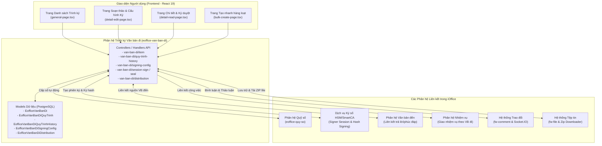
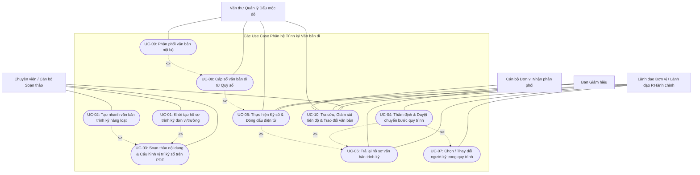

# Tài Liệu Phân Tích Nghiệp Vụ: Tính Năng & Quy Trình Trình Ký Văn Bản Đi (eoffice-van-ban-di)

> **Dự án**: Hệ thống Văn phòng điện tử (e-Office) - Trường Đại học Bách Khoa, ĐHQG-HCM (HCMUT)
> **Phân hệ**: Quản lý Văn bản đi & Trình ký điện tử (`modules/md-eoffice/eoffice-van-ban-di`)
> **Trang nghiệp vụ chính**: `views/general-page.tsx` (Trình ký - `/user/e-office/van-ban-di/all`)
> **Phiên bản tài liệu**: 2.0
> **Ngày cập nhật**: 19/09/2026

---

## 1. Bối cảnh, mục đích & Kiến trúc tổng thể

### 1.1. Bối cảnh nghiệp vụ
Trong hoạt động quản trị hành chính tại Trường Đại học Bách Khoa - ĐHQG-HCM (HCMUT), công tác soạn thảo, trình duyệt, ký số và phát hành các loại văn bản đi (Quyết định, Công văn, Tờ trình, Thông báo, Giấy xác nhận, Hợp đồng, v.v.) đóng vai trò xương sống trong toàn bộ các quy trình điều hành và phối hợp công tác giữa các đơn vị.

Trước khi ứng dụng phân hệ Trình ký điện tử (`eoffice-van-ban-di`), quy trình xử lý văn bản đi truyền thống gặp phải nhiều bất cập:
- **Luân chuyển hồ sơ giấy thủ công & tốn kém**: Tờ trình và dự thảo văn bản phải in ấn nhiều bản, cán bộ phải di chuyển trực tiếp giữa các phòng ban, khoa, trung tâm và Ban Giám hiệu để xin ý kiến và chữ ký duyệt sơ bộ (ký nháy).
- **Rủi ro chậm trễ và ách tắc quy trình**: Hồ sơ dễ bị tồn đọng tại bàn lãnh đạo khi đi công tác xa; không có công cụ nhắc nhở và theo dõi trực quan văn bản đang dừng ở bước nào, do ai thụ lý.
- **Khó khăn trong kiểm soát phiên bản & vị trí ký**: Việc sửa đổi dự thảo văn bản qua nhiều cấp dễ dẫn đến sai lệch phiên bản cuối; lãnh đạo khó xác định vị trí ký chính xác trên các tài liệu dài hàng chục trang.
- **Thách thức trong quản lý Quỹ số và Đóng dấu pháp lý**: Văn thư trường phải ghi sổ số đi thủ công, kiểm soát số văn bản dễ trùng lặp hoặc nhảy số; việc đóng dấu mộc đỏ giấy đòi hỏi sự hiện diện trực tiếp.
- **Hạn chế trong phân phối nội bộ**: Sau khi phát hành, việc gửi công văn đến hàng chục đơn vị trong trường phải qua photo giấy hoặc gửi email phân tán, không thể theo dõi đơn vị nào đã tiếp nhận hay đã tải tài liệu.

Phân hệ **Trình ký Văn bản đi** ra đời nhằm số hóa toàn trình từ khâu soạn thảo, trình duyệt đa cấp, ký nháy, ký số điện tử (HSM/SmartCA), đóng dấu mộc đỏ điện tử, cấp số tự động từ Quỹ số tập trung cho đến phân phối liên thông nội bộ tức thì.

---

### 1.2. Mục đích & Mục tiêu
- **Chuẩn hóa quy trình trình ký đa cấp**: Hỗ trợ thiết lập linh hoạt quy trình luân chuyển văn bản theo 2 cấp thẩm quyền (*Cấp Trường* và *Cấp Đơn vị*), phân định rõ các bước thẩm định, duyệt sơ bộ, ký duyệt, kiểm duyệt, đóng dấu và cấp số.
- **Tích hợp Ký số & Đóng dấu điện tử an toàn**: Tích hợp giải pháp ký số số hóa tập trung (HSM / SmartCA) với cơ chế quản lý phiên ký bảo mật (`ISignerSession`), hỗ trợ ký duyệt cá nhân, ký thừa lệnh, ký nháy và đóng dấu mộc tròn đỏ điện tử.
- **Số hóa trực quan việc định vị chữ ký trên PDF**: Cho phép kéo thả trực quan vị trí chữ ký, dấu mộc và các trường thông tin văn bản (Số, Ngày, Tháng, Năm); trang bị thuật toán tự động nhận diện mỏ neo chữ (`findTextAnchorTargets`) để tự điền số và ngày ban hành vào văn bản.
- **Tối ưu hóa năng suất với Ký hàng loạt (Batch Sign) & Duyệt hàng loạt (Batch Approve)**: Cho phép lãnh đạo và văn thư phê duyệt hoặc ký số cùng lúc nhiều văn bản chỉ với một thao tác xác thực an toàn.
- **Cung cấp công cụ Tạo nhanh hàng loạt (Bulk Create)**: Hỗ trợ nạp dữ liệu từ tệp bảng tính Excel kết hợp nhiều tệp PDF để tự động tạo hàng loạt văn bản trình ký theo quy trình chuẩn.
- **Tự động hóa cấp số văn bản**: Liên kết với Phân hệ Quỹ số (`eoffice-quy-so`) để tự động sinh số đi duy nhất, liên tục theo từng năm hành chính và loại văn bản.
- **Phân phối nội bộ minh bạch (Distribution Tracking)**: Tự động gửi văn bản đến các đơn vị, cá nhân nhận; giám sát thời gian thực trạng thái tiếp nhận (*chờ xử lý, đã xem, đã tải tệp*).

---

### 1.3. Phạm vi áp dụng & Đối tượng người dùng
Phân hệ phục vụ toàn bộ cán bộ, giảng viên, nhân viên hành chính và Ban Giám hiệu trường HCMUT:
1. **Chuyên viên / Giảng viên soạn thảo (`clerical`, cán bộ tạo lập)**: Soạn thảo nội dung trích yếu, tải lên tệp PDF cần ký số và các phụ lục đính kèm, cấu hình luồng quy trình duyệt và vị trí chữ ký trên PDF, gửi trình ký.
2. **Lãnh đạo Đơn vị (Trưởng/Phó Khoa, Phòng, Ban, Trung tâm - `head`, `deputy`)**: Thẩm định nội dung, ghi nhận ý kiến chỉ đạo/chỉnh sửa, ký nháy, chọn người ký duyệt hoặc duyệt chuyển tiếp lên cấp trên.
3. **Lãnh đạo Phòng Hành chính - Tổng hợp (`head-office`, `deputy-office`)**: Kiểm duyệt văn bản cấp Trường trước khi trình Ban Giám hiệu; thực hiện duyệt hàng loạt hồ sơ đủ điều kiện.
4. **Ban Giám hiệu (`president`, `vice-president`)**: Xem xét phê duyệt, ký duyệt chính thức hoặc ký thừa lệnh trên văn bản bằng chữ ký số cá nhân/tổ chức.
5. **Văn thư Quản lý Dấu mộc đỏ (`clerical-redstamp`)**: Kiểm tra văn bản đã đủ chữ ký, thực hiện đóng dấu mộc đỏ điện tử (Seal) và thao tác cấp số từ Quỹ số.
6. **Cán bộ tiếp nhận tại các Đơn vị liên quan**: Nhận văn bản phân phối nội bộ, tra cứu, xem trực tuyến và tải tệp đã ký số hợp lệ về lưu trữ.

---

### 1.4. Kiến trúc Tích hợp & Mối liên hệ Hệ thống

---

## 2. Các yêu cầu chức năng (Functional Requirements)

### 2.1. Quản lý Danh sách & Lọc Trạng thái Văn bản Trình ký (`general-page.tsx`)
- **Phân loại qua hệ thống Tab chuyên biệt**:
  - **Cần tôi xử lý (`my`)**: Chứa toàn bộ văn bản đang dừng ở bước quy trình mà người dùng hiện tại có vai trò xử lý (`canOperate`, `canSign`, `canApprove`, `canSeal`, `canAssignNumber`).
  - **Đang thực hiện (`doing`)**: Các văn bản do người dùng tạo hoặc tham gia xử lý đang trong quá trình luân chuyển, chưa kết thúc.
  - **Trả lại (`reject`)**: Văn bản bị từ chối/trả lại ở một bước bất kỳ cần chỉnh sửa, bổ sung.
  - **Hoàn thành (`done`)**: Văn bản đã hoàn tất mọi bước ký số, đóng dấu, cấp số và ban hành.
  - **Tất cả (`all`)**: Toàn bộ văn bản người dùng có quyền truy cập theo phân quyền RBAC.
  - **Đơn vị (`all-dv`)**: Tab dành riêng cho Trưởng/Phó đơn vị (`eoffice:head`) theo dõi toàn bộ văn bản đi phát sinh trong đơn vị mình.
- **Huy hiệu đếm số lượng Real-time (Badge Counts)**: Tự động tải và hiển thị số lượng văn bản tồn đọng của từng tab qua API `/api/e-office/van-ban-di/count-by-status`.
- **Tìm kiếm & Phân trang đa tiêu chí**: Hỗ trợ tìm kiếm nhanh theo trích yếu, số ký hiệu; phân trang linh hoạt (25, 50, 100 bản ghi) với cơ chế nổi trên di động (`FloatingPagination`).
- **Xem trước tệp tin tức thì**: Hỗ trợ xem nhanh các tệp PDF ký số hoặc tệp phụ lục trực tiếp từ danh sách qua modal `FilePanel` mà không cần rời trang.

---

### 2.2. Khởi tạo & Cấu hình Hồ sơ Trình ký
- **Tạo mới văn bản đơn lẻ (`CreateForm`)**:
  - Nhập trích yếu (tối thiểu 10 ký tự, tối đa 500 ký tự).
  - Chọn Cấp văn bản: **Cấp Trường (`TRUONG`)** hoặc **Cấp Đơn vị (`DON_VI`)**.
  - Chọn Loại văn bản từ danh mục chuẩn hóa.
  - Thiết lập Quỹ số: Bắt buộc chọn Quỹ số áp dụng đối với văn bản cấp Trường; cho phép nhập số/ký hiệu dự kiến đối với văn bản cấp Đơn vị.
  - Chọn Quy trình mẫu: Tải các mẫu quy trình tương ứng theo cấp văn bản, tự động tải nhân sự tham gia.
  - Điều chỉnh quy trình linh hoạt: Cho phép đổi người xử lý tại từng bước, thêm bước thẩm định trung gian, chỉ định đơn vị và nhân sự phối hợp.
- **Tạo nhanh văn bản hàng loạt (`BulkCreatePage` - 4 bước)**:
  - *Bước 1 (Cấu hình chung)*: Chọn cấp văn bản, loại văn bản, quỹ số và quy trình mẫu áp dụng chung cho cả lô văn bản.
  - *Bước 2 (Upload dữ liệu)*: Tải lên tệp Excel chứa danh sách (STT, Trích yếu, Loại văn bản) và kéo thả cùng lúc nhiều tệp PDF; hệ thống tự động trích xuất STT từ tên file để ghép cặp tệp tin tương ứng.
  - *Bước 3 (Cấu hình ký mẫu)*: Thiết lập vị trí chữ ký trên một file đại diện; hệ thống tự động sao chép cấu hình tọa độ chữ ký này sang toàn bộ các tệp PDF trong lô.
  - *Bước 4 (Xem lại & Khởi tạo)*: Rà soát danh sách ghép cặp và gửi lệnh tạo hàng loạt thông qua `POST /api/e-office/van-ban-di/bulk-create`.

---

### 2.3. Quản lý Tệp tin & Cấu hình Vị trí Ký số trên PDF
- **Phân định rõ ràng 2 nhóm tệp tin**:
  - **Tệp văn bản ký số (`fileType: 'sign'`)**: Chỉ chấp nhận định dạng `.pdf`; là tài liệu pháp lý chính thức sẽ được chèn chữ ký điện tử, dấu mộc và số đi. Cảnh báo trực quan khi tệp chưa được thiết lập cấu hình ký.
  - **Tệp đính kèm phụ lục (`fileType: 'attach'`)**: Chấp nhận đa định dạng (`.pdf`, `.docx`, `.xlsx`, `.png`, `.jpg`...); phục vụ cung cấp tài liệu tham khảo, số liệu chứng minh.
- **Trình cấu hình ký số trực quan (`SignPlacement` & `SigningConfigDrawer`)**:
  - Hiển thị từng trang tài liệu PDF bằng công nghệ HTML5 Canvas (`react-pdf`).
  - Palette các đối tượng ký: Chữ ký cá nhân, Chữ ký thừa lệnh, Chữ ký nháy, Dấu tròn mộc đỏ cơ quan, Thông tin văn bản (Số văn bản, Ngày, Tháng, Năm).
  - Kéo và thả (Drag & Drop) trực tiếp các đối tượng ký vào vị trí mong muốn trên trang văn bản; hỗ trợ điều chỉnh kích thước, di chuyển, xóa.
  - Kiểm soát hướng trang: Tự động phát hiện và cảnh báo nếu trang PDF bị xoay ngược (`isPageRotated`) nhằm ngăn chặn sai lệch tọa độ khi ký số thực tế.
- **Công nghệ tự động nhận diện mỏ neo chữ (`findTextAnchorTargets`)**:
  - Tự động phân tích lớp chữ (Text Layer) của tài liệu PDF để dò tìm các mẫu văn bản hành chính như `Số: ...`, `Ngày ... tháng ... năm ...`.
  - Tự động tính toán tọa độ và chèn tức thì các trường Số, Ngày, Tháng, Năm vào đúng khoảng trống tương ứng chỉ với một nút bấm "Chèn tự động".

---

### 2.4. Điều phối Luồng Phê duyệt, Ký số & Đóng dấu điện tử
- **Duyệt chuyển bước quy trình (`handleDuyet`)**:
  - Dành cho các bước có hành động `button` hoặc `select_approve`.
  - Cán bộ nhập ý kiến thẩm định và bấm "Duyệt" để chuyển tiếp hồ sơ sang bước tiếp theo trong quy trình.
- **Ký số cá nhân & Ký nháy (`SigningButton` - `sign`, `initial_sign`)**:
  - Tự động khởi tạo phiên ký an toàn (`/api/e-office/van-ban-di/session-sign`).
  - Mở giao diện xem trước tài liệu kèm chữ ký mô phỏng (`SignPreview`).
  - Gửi mã băm hash tài liệu đến dịch vụ chứng thư số HSM/SmartCA để thực hiện ký số điện tử đạt chuẩn pháp lý.
- **Đóng dấu mộc đỏ điện tử (`seal_sign`)**:
  - Dành riêng cho Văn thư quản lý dấu (`clerical-redstamp`).
  - Tạo phiên đóng dấu (`/api/e-office/van-ban-di/session-seal`) để đóng dấu mộc tròn đỏ của Nhà trường lên vị trí đã thiết lập.
- **Ký hàng loạt (Batch Sign) & Duyệt hàng loạt (Batch Approve)**:
  - Cho phép chọn nhiều văn bản đồng thời tại tab "Cần tôi xử lý".
  - Thực hiện một phiên ký duy nhất cho cả danh sách văn bản (`createBatchSession` & `signBatchHash`) hoặc duyệt chuyển bước hàng loạt (`handleApproveBatchFiles`).
- **Trả lại hồ sơ (`handleTraLai`)**:
  - Khi văn bản có sai sót về thể thức hoặc nội dung, người thụ lý bắt buộc nhập lý do vào ô ý kiến và bấm "Trả lại".
  - Hệ thống ghi nhận trạng thái lỗi (`error`), chuyển văn bản về tab "Trả lại" và thông báo tức thì cho người soạn thảo/bước trước.
- **Chọn & Thay đổi Người ký (`SelectSign`)**:
  - Cho phép người duyệt bước trước lựa chọn đích danh lãnh đạo sẽ ký duyệt ở bước kế tiếp (khi bước đó có hành động `select_approve`).
  - Cho phép thay đổi người ký trong danh sách nhân sự được ủy quyền kèm cảnh báo xác nhận.

---

### 2.5. Cấp số & Ban hành Văn bản
- **Cấp số đi chính thức (`CapSoModal`)**:
  - Kích hoạt tại bước quy trình có hành động `assign` (thường do Văn thư thực hiện sau khi văn bản đã được ký duyệt và đóng dấu).
  - Tự động gợi ý số tiếp theo từ Quỹ số tương ứng (`/api/e-office/van-ban-di/next-number/:quySoId`).
  - Cho phép văn thư chọn ngày cấp số chính thức và lưu lại vào hồ sơ qua `POST /api/e-office/van-ban-di/cap-so`.
  - Hệ thống tự động điền số và ngày ban hành vào các vị trí text placement đã cấu hình trên tệp PDF.
- **Tự động hoàn thành**: Sau khi hoàn tất bước cấp số và các bước kiểm tra cuối cùng, văn bản tự động chuyển sang trạng thái "Hoàn thành" (`done`).

---

### 2.6. Phân phối Nội bộ (Internal Distribution)
- **Phân phối đa cấp**:
  - Phân phối theo cấp Đơn vị (`donViList`): Gửi đến toàn bộ Ban chủ nhiệm và Văn thư của các Phòng, Khoa, Trung tâm được chọn.
  - Phân phối đích danh Cá nhân (`deptManagerShccs`): Gửi trực tiếp đến từng cán bộ cụ thể.
- **Giám sát tiếp nhận thời gian thực**:
  - Theo dõi tỉ lệ tiếp nhận qua huy hiệu trực quan: `Số đơn vị đã xem / Tổng số đơn vị phân phối`.
  - Ghi nhận chi tiết lịch sử: Thời điểm xem (`viewedAt`), người xem (`viewedBy`), thời điểm tải tệp (`downloadedAt`).
- **Hoàn tác & Phân phối lại**: Hỗ trợ thu hồi văn bản phân phối nhầm (`handleDistributionRevert`) hoặc kích hoạt phân phối bổ sung (`handleRedistribute`).

---

### 2.7. Trao đổi, Thảo luận & Tiện ích Mở rộng
- **Hộp thảo luận thời gian thực (`CommentBox`)**: Tích hợp luồng trao đổi ý kiến kèm đính kèm tệp tin đa phương tiện giữa các bên liên quan, đồng bộ hóa tức thì qua kênh Socket.IO (`eoffice-vbdi`).
- **Tải trọn gói tệp tin ký số (Zip Downloader)**: Cho phép tải toàn bộ các tệp PDF đã ký số của văn bản dưới dạng một tệp nén `.zip` chỉ bằng một thao tác bấm nút.

---

### 2.8. Ma trận Phân quyền & Vai trò (Role-Permission Matrix)

| Chức năng / Quyền hạn | Chuyên viên soạn thảo (`clerical`) | Lãnh đạo Đơn vị (`head`, `deputy`) | Lãnh đạo P.Hành chính (`head-office`) | Ban Giám hiệu (`president`) | Văn thư mộc đỏ (`clerical-redstamp`) | Đơn vị nhận phân phối |
|---|:---:|:---:|:---:|:---:|:---:|:---:|
| **Khởi tạo hồ sơ văn bản đi** (`van-ban-di:create`) | ✅ | ✅ | ✅ | ❌ | ❌ | ❌ |
| **Tạo nhanh hàng loạt (Bulk Create)** | ✅ | ✅ | ✅ | ❌ | ❌ | ❌ |
| **Sửa trích yếu, ghi chú (khi là Creator)** | ✅ (bước 0) | ✅ (bước 0) | ✅ (bước 0) | ❌ | ❌ | ❌ |
| **Tải lên & cấu hình vị trí ký số trên PDF** | ✅ (bước 0) | ✅ (bước 0) | ✅ (bước 0) | ❌ | ❌ | ❌ |
| **Gửi trình văn bản vào quy trình** | ✅ | ✅ | ✅ | ❌ | ❌ | ❌ |
| **Duyệt sơ bộ / Ký nháy** (`canApprove`, `initial_sign`) | ❌ | ✅ | ✅ | ❌ | ❌ | ❌ |
| **Duyệt hàng loạt (Batch Approve)** | ❌ | ❌ | ✅ | ❌ | ❌ | ❌ |
| **Ký duyệt / Ký thừa lệnh** (`canSign`) | ❌ | ✅ (nếu cấp ĐV) | ❌ | ✅ (cấp Trường) | ❌ | ❌ |
| **Ký số hàng loạt (Batch Sign)** | ❌ | ✅ | ❌ | ✅ | ❌ | ❌ |
| **Đóng dấu mộc đỏ điện tử** (`canSeal`) | ❌ | ❌ | ❌ | ❌ | ✅ | ❌ |
| **Cấp số văn bản đi** (`canAssignNumber`) | ❌ | ❌ | ❌ | ❌ | ✅ | ❌ |
| **Trả lại văn bản (kèm ý kiến)** (`canReject`) | ❌ | ✅ | ✅ | ✅ | ✅ | ❌ |
| **Chọn / Chuyển người ký bước tiếp theo** | ❌ | ✅ | ✅ | ❌ | ❌ | ❌ |
| **Phân phối nội bộ văn bản** (`canDistribute`) | ❌ | ❌ | ✅ | ❌ | ✅ | ❌ |
| **Tiếp nhận & Tải tệp văn bản phân phối** | ❌ | ❌ | ❌ | ❌ | ❌ | ✅ |
| **Xóa văn bản đi** (`canDelete`) | ✅ (chưa vào quy trình) | ❌ | ❌ | ❌ | ❌ | ❌ |

---

## 3. Đặc tả Usecase (Use Case Specifications)

### 3.1. Sơ đồ Tổng quan Usecase

---

### 3.2. Chi tiết từng Usecase

#### UC-01: Khởi tạo hồ sơ trình ký đơn lẻ
- **Mã Usecase**: `UC-01`
- **Tên Usecase**: Khởi tạo hồ sơ văn bản trình ký đơn lẻ
- **Actor chính**: Chuyên viên / Cán bộ soạn thảo (`clerical`, `staff`)
- **Mô tả tóm tắt**: Cán bộ mở drawer tạo mới, chọn cấp văn bản, loại văn bản, quỹ số, nhập trích yếu và lựa chọn quy trình luân chuyển mẫu.
- **Tiền điều kiện**: Người dùng đăng nhập hệ thống và có quyền `eofficeVanBanDi:read` / `eofficeVanBanDi:write`.
- **Hậu điều kiện**: Bản ghi văn bản được tạo lập ở trạng thái khởi tạo ban đầu (`stepNo = 0`), sẵn sàng để bổ sung tệp và cấu hình vị trí ký.
- **Luồng sự kiện chính (Basic Flow)**:
  1. Người dùng tại trang Trình ký (`/user/e-office/van-ban-di/all`) bấm nút **"Tạo mới"**.
  2. Hệ thống hiển thị Drawer tạo văn bản trình ký (`CreateForm`).
  3. Người dùng chọn Loại văn bản và Cấp văn bản (*Trường* hoặc *Đơn vị*).
  4. Nếu là Cấp Trường: Người dùng chọn Quỹ số áp dụng từ danh sách quỹ số đang kích hoạt. Nếu là Cấp Đơn vị: Người dùng có thể nhập số/ký hiệu dự kiến.
  5. Người dùng nhập nội dung Trích yếu văn bản (tối thiểu 10 ký tự).
  6. Sau khi điền đủ thông tin hợp lệ, hệ thống tự động mở khóa panel "Quy trình văn bản".
  7. Người dùng chọn một mẫu quy trình; hệ thống tự động tải các bước và người xử lý. Người dùng có thể chọn lại đích danh cán bộ trong từng bước hoặc thêm/bớt bước thẩm định.
  8. Người dùng bấm **"Tạo mới"**.
  9. Hệ thống gửi yêu cầu `POST /api/e-office/van-ban-di/item`.
  10. Hệ thống tạo bản ghi trong `eoffice_van_ban_di`, lưu danh sách các bước vào `eoffice_van_ban_di_quy_trinh`, tạo bản ghi lịch sử bước 0 trong `eoffice_van_ban_di_quy_trinh_history`, cấp quyền xem cho người tạo trong `eoffice_van_ban_di_user`.
  11. Hệ thống điều hướng người dùng tới trang chi tiết soạn thảo (`/user/e-office/van-ban-di/item/:id`).
- **Luồng rẽ nhánh / Ngoại lệ**:
  - *Thông tin trích yếu quá ngắn hoặc thiếu quỹ số*: Nút "Tạo mới" bị vô hiệu hóa; hệ thống hiển thị thông báo lỗi ngay dưới các trường bắt buộc.

---

#### UC-02: Tạo nhanh văn bản trình ký hàng loạt (Bulk Create)
- **Mã Usecase**: `UC-02`
- **Tên Usecase**: Tạo nhanh văn bản trình ký hàng loạt từ Excel và PDF
- **Actor chính**: Chuyên viên / Lãnh đạo đơn vị được cấp quyền (Developer / Văn thư trường)
- **Mô tả tóm tắt**: Nhập hàng loạt hồ sơ văn bản trình ký cùng lúc bằng cách tải lên danh sách từ file Excel và các tệp PDF tương ứng, áp dụng chung một cấu hình quy trình và mẫu vị trí ký số.
- **Tiền điều kiện**: Người dùng có quyền truy cập trang `/user/e-office/van-ban-di/bulk-create`.
- **Hậu điều kiện**: Hàng loạt văn bản đi được khởi tạo tự động trong CSDL kèm đầy đủ tệp PDF và cấu hình vị trí ký.
- **Luồng sự kiện chính**:
  1. Người dùng bấm nút **"Tạo nhanh"** trên thanh công cụ trang Trình ký.
  2. *Bước 1 (Cấu hình chung)*: Chọn Cấp văn bản, Loại văn bản, Quỹ số và Quy trình phê duyệt mẫu. Bấm "Tiếp theo".
  3. *Bước 2 (Upload dữ liệu)*:
     - Tải tệp mẫu Excel về máy, nhập danh sách gồm các cột: `STT`, `Trích yếu`, `Loại văn bản`.
     - Tải tệp Excel đã điền lên hệ thống; hệ thống phân tích các dòng dữ liệu.
     - Kéo thả các tệp PDF vào khu vực tải tệp; hệ thống tự động trích xuất số thứ tự ở đầu tên tệp (`extractStt`) để ghép cặp tự động với dòng tương ứng trong Excel.
     - Người dùng kiểm tra tất cả các dòng đã có trạng thái ghép cặp thành công (`matched == true`). Bấm "Tiếp theo".
  4. *Bước 3 (Cấu hình ký)*:
     - Hệ thống hiển thị tệp PDF đầu tiên làm mẫu.
     - Người dùng kéo thả vị trí chữ ký duyệt, dấu mộc hoặc số/ngày lên trang tài liệu và lưu lại mẫu vị trí ký. Bấm "Tiếp theo".
  5. *Bước 4 (Xem lại & Khởi tạo)*:
     - Hệ thống tổng hợp số lượng văn bản sẽ tạo, quy trình áp dụng và cấu hình chữ ký.
     - Người dùng nhấn **"Tạo hàng loạt"**.
  6. Hệ thống đóng gói `FormData` gồm cấu hình, danh sách items và mảng tệp tin `files[]`, gửi tới `POST /api/e-office/van-ban-di/bulk-create`.
  7. Hệ thống tạo đồng loạt các bản ghi văn bản, gắn tệp tin, sao chép cấu hình ký và phản hồi số lượng tạo thành công.

---

#### UC-03: Soạn thảo nội dung & Cấu hình vị trí ký số trên PDF
- **Mã Usecase**: `UC-03`
- **Tên Usecase**: Soạn thảo nội dung & Cấu hình vị trí ký số trên tài liệu PDF
- **Actor chính**: Người tạo văn bản (`conditions.isCreator && stepNo == 0`)
- **Mô tả tóm tắt**: Cập nhật trích yếu, ghi chú; tải lên tệp PDF cần ký số và tệp phụ lục; kéo thả vị trí chữ ký/dấu mộc trên PDF; gửi hồ sơ vào quy trình.
- **Tiền điều kiện**: Văn bản đang ở bước khởi tạo (`stepNo == 0`).
- **Hậu điều kiện**: Tệp PDF được lưu kèm tọa độ ký trong CSDL; văn bản được chuyển sang bước 1 để bắt đầu luân chuyển.
- **Luồng sự kiện chính**:
  1. Người dùng mở trang chi tiết văn bản (`DetailEditPage`).
  2. Người dùng điều chỉnh trích yếu, ghi chú. Tính năng Auto-Save tự động lưu sau khi ngừng gõ (`PUT /api/e-office/van-ban-di/item/:id`).
  3. Tại mục "Văn bản ký số", người dùng tải lên tệp văn bản chính định dạng `.pdf`.
  4. Tại mục "Đính kèm", người dùng tải lên các tài liệu phụ lục (nếu có).
  5. Người dùng bấm biểu tượng cấu hình ký trên tệp PDF:
     - Hệ thống mở Drawer cấu hình ký (`SigningConfigDrawer`).
     - Người dùng chọn các loại chữ ký từ Palette (Chữ ký cá nhân, Dấu mộc, Số/ngày) và kéo thả vào vị trí mong muốn trên trang PDF.
     - (Tùy chọn) Người dùng bấm **"Tự động đặt Số/Ngày"**; thuật toán `findTextAnchorTargets` quét nội dung văn bản và tự chèn các trường số, ngày vào đúng chỗ trống.
     - Người dùng kiểm tra trang văn bản không bị xoay ngược, sau đó bấm **"Lưu cấu hình"** (`POST /api/e-office/van-ban-di/signing-config`).
  6. Người dùng chuyển sang tab "Phân phối" để chọn trước danh sách các đơn vị/cá nhân sẽ nhận văn bản khi ban hành.
  7. Người dùng kiểm tra tổng thể hồ sơ và nhấn nút **"Gửi trình"**.
  8. Hệ thống kiểm tra điều kiện hợp lệ: tệp PDF bắt buộc phải có cấu hình ký. Nếu hợp lệ, hệ thống chuyển văn bản sang bước 1 (`stepNo = 1`) và phát thông báo tới người duyệt bước tiếp theo.

---

#### UC-04: Thẩm định & Duyệt chuyển bước quy trình
- **Mã Usecase**: `UC-04`
- **Tên Usecase**: Thẩm định & Duyệt chuyển bước quy trình (`approve`)
- **Actor chính**: Lãnh đạo Đơn vị, Lãnh đạo P.Hành chính (`canApprove = true`)
- **Mô tả tóm tắt**: Xem xét nội dung văn bản, nhập ý kiến thẩm định và bấm duyệt để chuyển tiếp văn bản sang bước kế tiếp.
- **Tiền điều kiện**: Văn bản đang ở bước quy trình mà người dùng có quyền xử lý (`canOperate = true`), hành động của bước là `button` hoặc `select_approve`.
- **Hậu điều kiện**: Bước hiện tại được đánh dấu hoàn thành (`finish`), hồ sơ chuyển sang bước tiếp theo.
- **Luồng sự kiện chính**:
  1. Cán bộ mở văn bản trong tab "Cần tôi xử lý" (`DetailReadPage`).
  2. Cán bộ xem xét nội dung trích yếu, mở xem trực tiếp tệp PDF ký số và tệp phụ lục.
  3. Cán bộ nhập ý kiến vào ô "Nhập ý kiến..." (mặc định là *"Đã duyệt"* nếu không nhập thêm).
  4. Cán bộ nhấn nút **"Duyệt"** (màu xanh lá).
  5. Hệ thống hiển thị hộp thoại xác nhận duyệt văn bản.
  6. Cán bộ bấm đồng ý; hệ thống gửi yêu cầu `PUT /api/e-office/van-ban-di/quy-trinh-history/item/:id` với `{ type: 'next', stepNote }`.
  7. Hệ thống cập nhật bản ghi lịch sử hiện tại (`status = 'finish'`, ghi nhận `doneAt`, `actor`, `shcc`), nâng số thứ tự bước `stepNo` lên 1, kích hoạt quyền xử lý cho nhân sự bước tiếp theo.
  8. Hệ thống hiển thị thông báo thành công và cập nhật lại dòng thời gian tiến trình.

---

#### UC-05: Thực hiện Ký số & Đóng dấu điện tử
- **Mã Usecase**: `UC-05`
- **Tên Usecase**: Thực hiện Ký số cá nhân, Ký nháy & Đóng dấu mộc đỏ
- **Actor chính**: Ban Giám hiệu, Lãnh đạo Đơn vị, Văn thư quản lý dấu (`canSign = true` hoặc `canSeal = true`)
- **Mô tả tóm tắt**: Xác thực danh tính và áp chữ ký điện tử / dấu mộc đỏ chính thức lên tài liệu PDF tại các tọa độ đã cấu hình.
- **Tiền điều kiện**: Văn bản dừng ở bước có `actionKey` chứa `_sign` (ký số) hoặc `seal_sign` (đóng dấu); người dùng có chứng thư số hợp lệ.
- **Hậu điều kiện**: Tệp PDF được ký số bảo mật, tem chữ ký/dấu mộc được gắn vĩnh viễn vào tài liệu; bước quy trình được hoàn tất.
- **Luồng sự kiện chính**:
  1. Người ký truy cập văn bản cần xử lý, bấm nút **"Ký số"** (hoặc **"Đóng dấu"**).
  2. Hệ thống hiển thị modal xác nhận *"Tiến hành duyệt và ký văn bản này?"*. Người dùng bấm "Bắt đầu".
  3. Hệ thống gọi API tạo phiên ký:
     - Ký số cá nhân: `POST /api/e-office/van-ban-di/session-sign`
     - Đóng dấu mộc: `POST /api/e-office/van-ban-di/session-seal`
  4. Hệ thống trả về đối tượng `ISignerSession` và mở drawer `SignPreview` hiển thị trang PDF có gắn chữ ký mô phỏng tại đúng tọa độ.
  5. Người ký kiểm tra chữ ký/con dấu trên tài liệu, sau đó bấm nút **"Xác nhận ký"**.
  6. Hệ thống gửi yêu cầu `POST /api/e-office/van-ban-di/session/sign` với `sessionId`.
  7. Dịch vụ ký số tính toán mã băm hash của tài liệu, gửi qua hệ thống HSM/SmartCA để thực thi ký mật mã học và chèn chữ ký vào file PDF.
  8. Sau khi ký thành công, hệ thống tự động cập nhật bước quy trình sang hoàn thành, đóng drawer phiên ký và cập nhật lại giao diện.

---

#### UC-06: Trả lại hồ sơ văn bản trình ký
- **Mã Usecase**: `UC-06`
- **Tên Usecase**: Trả lại hồ sơ văn bản trình ký (`reject` / `return`)
- **Actor chính**: Người có quyền xử lý bước hiện tại (`canOperate = true`)
- **Mô tả tóm tắt**: Từ chối thông qua văn bản và chuyển ngược lại cho người soạn thảo/bước trước kèm theo lý do chi tiết.
- **Tiền điều kiện**: Văn bản đang chờ người dùng xử lý và có sai sót cần chỉnh sửa.
- **Hậu điều kiện**: Trạng thái văn bản chuyển thành "Trả lại", ghi nhận lý do vào lịch sử luân chuyển.
- **Luồng sự kiện chính**:
  1. Người thụ lý phát hiện sai sót trên hồ sơ văn bản.
  2. Người thụ lý nhập lý do trả lại cụ thể vào ô "Nhập ý kiến..." (bắt buộc).
  3. Người thụ lý nhấn nút **"Trả lại"** (màu đỏ).
  4. Hệ thống hiển thị hộp thoại cảnh báo: *"Bạn có chắc chắn muốn trả lại văn bản này không?"*.
  5. Người dùng xác nhận; hệ thống gửi yêu cầu `PUT /api/e-office/van-ban-di/quy-trinh-history/item/:id` với `{ type: 'back', stepNote: yKien }`.
  6. Hệ thống cập nhật bản ghi lịch sử hiện tại với `status = 'error'`, ghi nhận ý kiến từ chối, chuyển trạng thái văn bản sang "Trả lại" và gửi thông báo cho người tạo văn bản.

---

#### UC-07: Chọn / Thay đổi người ký trong quy trình
- **Mã Usecase**: `UC-07`
- **Tên Usecase**: Chọn hoặc Thay đổi người ký duyệt (`Select Signer`)
- **Actor chính**: Cán bộ duyệt bước trước (`select_approve`) hoặc người được ủy quyền
- **Mô tả tóm tắt**: Chỉ định đích danh lãnh đạo sẽ ký duyệt hồ sơ ở bước tiếp theo hoặc đổi người ký khác khi người được phân công vắng mặt.
- **Tiền điều kiện**: Bước hiện tại có cờ `select_approve` hoặc bước ký có danh sách nhiều người có thẩm quyền ký.
- **Hậu điều kiện**: Nhân sự bước ký được cập nhật trong CSDL và cấp quyền xem/ký văn bản.
- **Luồng sự kiện chính**:
  1. Tại bước duyệt, hệ thống hiển thị panel "Chọn người ký" (`SelectSign`).
  2. Người duyệt xem danh sách các nhân sự đủ thẩm quyền ký (kèm chức vụ và đơn vị).
  3. Người duyệt tích chọn cán bộ sẽ chịu trách nhiệm ký chính thức.
  4. Hệ thống gửi yêu cầu cập nhật bước quy trình `PUT /api/e-office/van-ban-di/quy-trinh/:id` với `{ stepNo, shcc }`.
  5. Cán bộ được chọn sẽ nhận được văn bản trong tab "Cần tôi xử lý" khi văn bản chuyển sang bước ký.

---

#### UC-08: Cấp số văn bản đi từ Quỹ số
- **Mã Usecase**: `UC-08`
- **Tên Usecase**: Cấp số văn bản đi chính thức
- **Actor chính**: Văn thư trường (`clerical-redstamp` tại bước `actionKey == 'assign'`)
- **Mô tả tóm tắt**: Lấy số thứ tự tiếp theo từ Quỹ số tập trung của nhà trường, gán số và ngày ban hành chính thức cho văn bản.
- **Tiền điều kiện**: Văn bản đã hoàn tất các bước ký duyệt và đóng dấu mộc đỏ; người dùng có quyền cấp số.
- **Hậu điều kiện**: Văn bản có số đi chính thức, tự động áp số và ngày vào tệp PDF đã ký.
- **Luồng sự kiện chính**:
  1. Văn thư mở chi tiết văn bản tại tab "Cần tôi xử lý", nhấn nút **"Cấp số"**.
  2. Hệ thống hiển thị modal Cấp số văn bản (`CapSoModal`).
  3. Hệ thống tự động gọi API `GET /api/e-office/van-ban-di/next-number/:quySoId` để tải số đi dự kiến tiếp theo từ quỹ số.
  4. Văn thư xác nhận Quỹ số, số dự kiến cấp và ngày cấp chính thức (mặc định là ngày hiện tại).
  5. Văn thư bấm **"Cấp số"**.
  6. Hệ thống gửi `POST /api/e-office/van-ban-di/cap-so` với `{ vanBanId, quySoId, so, ngayCap }`.
  7. Hệ thống mở transaction CSDL:
     - Tăng biến đếm trong Quỹ số (`eoffice_quy_so`).
     - Cập nhật số, ký hiệu, ngày tháng năm vào bản ghi `eoffice_van_ban_di`.
     - Cập nhật nội dung các trường text placement tương ứng trên tệp PDF.
     - Commit transaction.
  8. Hệ thống hiển thị thông báo cấp số thành công và tự động làm mới giao diện.

---

#### UC-09: Phân phối văn bản nội bộ (Document Distribution)
- **Mã Usecase**: `UC-09`
- **Tên Usecase**: Phân phối văn bản nội bộ đến các đơn vị và cá nhân
- **Actor chính**: Văn thư trường hoặc Cán bộ được cấp quyền `canDistribute`
- **Mô tả tóm tắt**: Chọn danh sách đơn vị hoặc cá nhân trong toàn trường để phát hành và gửi văn bản nội bộ đến hộp thư đến của họ.
- **Tiền điều kiện**: Văn bản đã được ký ban hành hoặc có quyền phân phối.
- **Hậu điều kiện**: Bản ghi phân phối được tạo lập; đơn vị/cá nhân nhận xuất hiện văn bản trong danh sách "Nội bộ đến".
- **Luồng sự kiện chính**:
  1. Người dùng mở tab "Phân phối" trên trang chi tiết văn bản.
  2. Người dùng bấm chọn các Đơn vị thụ lý từ cây danh mục đơn vị hoặc chọn đích danh các Cá nhân/Lãnh đạo đơn vị.
  3. Người dùng nhập ghi chú phân phối (nếu cần) và bấm **"Phân phối"**.
  4. Hệ thống gửi yêu cầu `POST /api/e-office/van-ban-di/:id/distribution`.
  5. Hệ thống tạo các bản ghi trong `eoffice_van_ban_di_distribution` với trạng thái ban đầu là `pending`.
  6. Đơn vị nhận khi đăng nhập sẽ nhìn thấy văn bản trong danh sách "Nội bộ đến" (`/user/e-office/distributed`). Khi cán bộ bên đơn vị nhận mở xem hoặc tải tệp, hệ thống tự động ghi nhận thời điểm và chuyển trạng thái sang `viewed` hoặc `downloaded`.
  7. Người phân phối có thể theo dõi tiến độ tiếp nhận hoặc bấm "Hoàn tác" / "Phân phối lại" khi cần.

---

#### UC-10: Tra cứu, Giám sát tiến độ & Trao đổi văn bản
- **Mã Usecase**: `UC-10`
- **Tên Usecase**: Tra cứu, Giám sát tiến độ & Trao đổi văn bản trình ký
- **Actor chính**: Toàn bộ cán bộ nhân viên có quyền truy cập module
- **Mô tả tóm tắt**: Lọc danh sách theo tab, tìm kiếm văn bản, xem dòng thời gian (timeline), tải file ZIP và thảo luận real-time qua hộp bình luận.
- **Tiền điều kiện**: Đã đăng nhập vào hệ thống iOffice.
- **Luồng sự kiện chính**:
  1. Người dùng chọn tab nghiệp vụ mong muốn trên trang Trình ký: "Cần tôi xử lý", "Đang thực hiện", "Trả lại", "Hoàn thành", hoặc "Tất cả".
  2. Người dùng nhập từ khóa tìm kiếm (trích yếu, số ký hiệu). Hệ thống phân trang và tải danh sách tương ứng.
  3. Người dùng nhấn vào một văn bản để mở trang chi tiết:
     - Xem thông tin hành chính, trích yếu, người tạo, ngày tạo.
     - Xem tiến trình các bước trên dòng thời gian `WorkflowSteps`.
     - Tải tệp riêng lẻ hoặc bấm nút tải toàn bộ file ký số dưới dạng file `.zip`.
     - Gửi ý kiến trao đổi, tải lên tệp đính kèm phụ tại hộp thảo luận `CommentBox`. Tin nhắn được phát tức thời đến các thành viên đang mở văn bản qua Socket.IO.

---

## 4. Các quy tắc nghiệp vụ (Business Rules)

### 4.1. BR-01: Quy tắc Phân định Cấp văn bản & Quỹ số
- **BR-01.1 (Phân loại Cấp thẩm quyền)**: Mỗi văn bản trình ký bắt buộc phải thuộc một trong 2 cấp quản lý:
  - **Cấp Trường (`TRUONG`)**: Do Ban Giám hiệu hoặc Lãnh đạo Trường ký duyệt; bắt buộc phải liên kết với một Quỹ số cấp Trường (`quySoId`) đang kích hoạt. Số văn bản được sinh tự động từ quỹ số tập trung tại bước Cấp số.
  - **Cấp Đơn vị (`DON_VI`)**: Do Lãnh đạo Khoa/Phòng ban ký duyệt lưu hành nội bộ đơn vị; cho phép người tạo nhập số và ký hiệu dự kiến thủ công hoặc lấy theo quỹ số đơn vị.
- **BR-01.2 (Ràng buộc Trích yếu)**: Trích yếu văn bản là trường thông tin bắt buộc, không được để trống, độ dài tối thiểu là 10 ký tự và tối đa 500 ký tự.
- **BR-01.3 (Tính toàn vẹn của Quỹ số)**: Số văn bản đi cấp Trường là số nguyên dương tăng dần liên tục, tuyệt đối không được trùng lặp trong cùng một năm hành chính và cùng một loại văn bản.

---

### 4.2. BR-02: Quy tắc Vòng đời Trạng thái & Luân chuyển Quy trình (Workflow State Machine)
- **BR-02.1 (Các giai đoạn trạng thái chính)**:
  $$\text{Nháp (bước 0)} \xrightarrow{\text{Gửi trình}} \text{Trình ký} \xrightarrow{\text{Ký nháy}} \text{Ký duyệt} \xrightarrow{\text{Đóng dấu}} \text{Cấp số} \xrightarrow{} \text{Hoàn thành}$$
  Tại bất kỳ bước nào trong quy trình, nếu người thụ lý từ chối, văn bản sẽ chuyển sang trạng thái **Trả lại (`reject`)**.
- **BR-02.2 (Điều kiện tiên quyết để Gửi trình - Step 0 to Step 1)**:
  - Bắt buộc phải có ít nhất một tệp văn bản chính định dạng PDF thuộc nhóm ký số (`fileType === 'sign'`).
  - Tệp văn bản ký số bắt buộc phải được thiết lập cấu hình tọa độ chữ ký (`signingConfig.length > 0`). Nếu chưa cấu hình, hệ thống cảnh báo và chặn thao tác gửi trình.
  - Quy trình phê duyệt phải được cấu hình đầy đủ nhân sự cho các bước bắt buộc (`isComplete === true`).
- **BR-02.3 (Bảo vệ dữ liệu khi đã vào quy trình)**: Sau khi văn bản đã chuyển sang `stepNo >= 1`, người tạo văn bản **không còn quyền chỉnh sửa** trích yếu, không được xóa tệp PDF ký số hay tự ý thay đổi toàn bộ cấu trúc quy trình, trừ khi văn bản bị trả lại về bước nháp.

---

### 4.3. BR-03: Quy tắc Cấu hình Quy trình & Điều chỉnh Nhân sự
- **BR-03.1 (Lựa chọn Quy trình mẫu)**: Quy trình phê duyệt phải được khởi tạo từ một mẫu cấu hình chuẩn (`QuyTrinhConfig`) phù hợp với cấp văn bản (`phamVi = TRUONG` hoặc `DON_VI`).
- **BR-03.2 (Thêm/Bớt bước linh hoạt)**: Cho phép người tạo thêm các bước thẩm định bổ sung (`handleAddStep`) trước khi gửi trình. Khi thêm một bước mới sau bước $K$, hệ thống tự động tăng số thứ tự của các bước từ $K+1$ lên 1 đơn vị.
- **BR-03.3 (Cơ chế Loại bỏ bước Duyệt thừa đối với Văn thư)**: Nếu người khởi tạo văn bản là nhân sự thuộc nhóm Văn thư (`clerical`), hệ thống tự động loại bỏ bước `select_approve` đầu tiên nhằm giản lược thủ tục hành chính nội bộ.
- **BR-03.4 (Chọn người ký tại bước `select_approve`)**: Tại bước có hành động `select_approve`, người duyệt bước hiện tại bắt buộc phải chỉ định một cán bộ cụ thể trong danh sách nhân sự đủ điều kiện trước khi bấm duyệt chuyển bước.

---

### 4.4. BR-04: Quy tắc Tệp ký số & Tọa độ Ký trên PDF (Signing Placement)
- **BR-04.1 (Định dạng tệp ký)**: Tệp văn bản trình ký bắt buộc phải là định dạng chuẩn `.pdf`. Các định dạng khác (`.doc`, `.docx`, `.xls`...) chỉ được phép tải lên ở mục Tệp đính kèm phụ lục.
- **BR-04.2 (Hệ tọa độ chuẩn hóa PDF Points)**: Tọa độ chữ ký được lưu trữ theo đơn vị chuẩn PDF point (1/72 inch), tính toán độc lập với tỉ lệ hiển thị (scale) trên trình duyệt client:
  $$x_{\text{pdf}} = \frac{x_{\text{client}} - \text{rect.left}}{\text{scale}}, \quad y_{\text{pdf}} = \frac{y_{\text{client}} - \text{rect.top}}{\text{scale}}$$
- **BR-04.3 (Phân loại đối tượng ký)**: Mỗi vị trí ký trên tài liệu thuộc một trong 3 nhóm (`category`):
  - `signature`: Chữ ký cá nhân, chữ ký thừa lệnh, chữ ký nháy (định dạng ảnh).
  - `seal`: Con dấu mộc tròn đỏ của cơ quan/đơn vị (định dạng ảnh).
  - `doc_info`: Các trường thông tin động của văn bản (Số, Ngày, Tháng, Năm - định dạng text, hỗ trợ in đậm/nghiêng).
- **BR-04.4 (Chống sai lệch do xoay trang)**: Tuyệt đối không cho phép đặt chữ ký hoặc chạy nhận diện mỏ neo tự động trên các trang PDF bị xoay (`isPageRotated == true`). Người dùng phải xoay tệp PDF về chiều chuẩn (portrait 0 độ) trước khi cấu hình.
- **BR-04.5 (Tự động hóa Mỏ neo Text - Anchor Token)**: Khi kích hoạt tự động nhận diện, hệ thống tìm các token chuỗi `Số:`, `ngày`, `tháng`, `năm` và tự động gắn các trường tương ứng mà không chèn trùng nếu vị trí đó đã có chữ ký đặt trước đó (ngưỡng sai số $\Delta < 15\text{px}$).

---

### 4.5. BR-05: Quy tắc Phiên ký số & Ký mật mã học (Signer Session & Hash Signing)
- **BR-05.1 (Tính toàn vẹn qua Phiên ký - Signer Session)**: Mọi thao tác ký số hoặc đóng dấu không gọi trực tiếp dịch vụ ký trên tệp thô mà bắt buộc phải thông qua một Phiên ký (`ISignerSession`) có định danh duy nhất và thời gian hết hạn (`expiredAt`).
- **BR-05.2 (Ký băm Hash an toàn)**: Quá trình ký số thực hiện theo tiêu chuẩn ký mã băm hash (`POST /session/sign`). Server tính toán hash SHA-256 của tài liệu tại các vị trí ký, client gửi yêu cầu xác thực SmartCA/HSM để ký trên hash đó, đảm bảo hiệu năng cao và an toàn bảo mật dữ liệu trên đường truyền.
- **BR-05.3 (Tính bất khả thu hồi sau khi ký)**: Sau khi chữ ký số hoặc dấu mộc đã được chèn thành công vào tệp PDF, tệp tin được cập nhật phiên bản mới với chữ ký số được niêm phong mật mã; không thể gỡ bỏ chữ ký nếu không tạo phiên bản tài liệu mới.
- **BR-05.4 (Đồng thuận Ký hàng loạt - Batch Sign)**: Thao tác ký hàng loạt chỉ hợp lệ đối với các văn bản có cùng tính chất hành động (hoặc tất cả cùng là ký số `sign`, hoặc tất cả cùng là đóng dấu `seal`).

---

### 4.6. BR-06: Quy tắc Cấp số & Ban hành Văn bản
- **BR-06.1 (Thời điểm cấp số)**: Việc cấp số văn bản đi chính thức chỉ được phép thực hiện sau khi văn bản đã được Lãnh đạo có thẩm quyền ký duyệt và Văn thư đã đóng dấu mộc đỏ điện tử.
- **BR-06.2 (Tự động áp thông tin vào PDF)**: Ngay khi văn bản được cấp số, hệ thống tự động tìm tất cả các vị trí text placement thuộc loại `doc_info` trên tệp PDF (chứa token số và ngày tháng) để ghi đè giá trị thực tế vào tệp tài liệu chính thức.
- **BR-06.3 (Khóa hồ sơ khi Hoàn thành)**: Khi văn bản đã hoàn tất cấp số và chuyển trạng thái sang "Hoàn thành" (`done`), văn bản chính thức có hiệu lực thi hành; toàn bộ thông tin hành chính và tệp ký số bị khóa vĩnh viễn, không thể chỉnh sửa hay xóa bỏ.

---

### 4.7. BR-07: Quy tắc Trả lại & Xử lý Khiếu nại (Rejection & Return)
- **BR-07.1 (Bắt buộc nêu rõ lý do)**: Thao tác "Trả lại" bắt buộc phải đi kèm nội dung giải trình trong trường ý kiến (`yKien.trim().length > 0`). Hệ thống sẽ chặn thao tác nếu người dùng để trống lý do.
- **BR-07.2 (Ghi vết lịch sử trả lại)**: Bản ghi lịch sử bị trả lại được lưu trữ vĩnh viễn trong `eoffice_van_ban_di_quy_trinh_history` với trạng thái `error` và hiển thị bằng thẻ màu đỏ trên dòng thời gian tiến trình, đảm bảo tính minh bạch và truy vết kiểm toán.
- **BR-07.3 (Quyền xử lý sau khi bị trả lại)**: Khi bị trả lại, văn bản chuyển về trạng thái `reject` và quyền điều chỉnh hồ sơ được trao lại cho người khởi tạo (`stepNo = 0` hoặc bước trước đó) để khắc phục sai sót.

---

### 4.8. BR-08: Quy tắc Phân phối Nội bộ & Theo dõi Tiếp nhận
- **BR-08.1 (Đối tượng nhận phân phối)**:
  - Phân phối cấp Đơn vị: Tự động mở quyền truy cập văn bản cho Ban chủ nhiệm đơn vị (Trưởng/Phó) và nhân viên Văn thư của đơn vị đó.
  - Phân phối cấp Cá nhân: Giới hạn quyền xem cho đúng cán bộ được chỉ định.
- **BR-08.2 (Cơ chế ghi nhận tự động - Auto Mark as Read)**: Khi cán bộ thuộc đơn vị nhận mở trang chi tiết văn bản, hệ thống tự động gọi hàm `useAutoMarkAsRead` cập nhật trạng thái phân phối sang `viewed` kèm mốc thời gian `viewedAt` và định danh `viewedBy`.
- **BR-08.3 (Hoàn tác phân phối)**: Người phân phối chỉ được phép thu hồi (hoàn tác) lệnh phân phối đối với các đơn vị/cá nhân đang ở trạng thái `pending` (chưa bấm xem văn bản).

---

## 5. Danh mục Tham chiếu Kỹ thuật (Technical References)

### 5.1. Bảng ánh xạ API Endpoints chính

| STT | Phương thức | Endpoint | Mô tả nghiệp vụ | Phân quyền yêu cầu |
|:---:|:---:|---|---|---|
| 1 | `GET` | `/api/e-office/van-ban-di/page` | Lấy danh sách văn bản phân trang theo tab (`filter.status`) | `eofficeVanBanDi:read` |
| 2 | `GET` | `/api/e-office/van-ban-di/count-by-status` | Đếm số lượng văn bản theo từng tab trạng thái | `eofficeVanBanDi:read` |
| 3 | `GET` | `/api/e-office/van-ban-di/item/:id` | Xem chi tiết thông tin, quyền thao tác (`conditions`) và các bước | `user:login` |
| 4 | `POST` | `/api/e-office/van-ban-di/item` | Tạo mới hồ sơ văn bản trình ký đơn lẻ | `eofficeVanBanDi:write` |
| 5 | `PUT` | `/api/e-office/van-ban-di/item/:id` | Cập nhật thông tin hành chính (trích yếu, ghi chú - auto save) | `eofficeVanBanDi:write` |
| 6 | `DELETE`| `/api/e-office/van-ban-di/item/:id` | Xóa văn bản đi (khi ở bước khởi tạo `canDelete`) | `eofficeVanBanDi:write` |
| 7 | `POST` | `/api/e-office/van-ban-di/bulk-create` | Khởi tạo hàng loạt văn bản từ Excel và PDF | `developer:switch` / `eoffice:manage` |
| 8 | `POST` | `/api/e-office/van-ban-di/upload-file` | Tải lên tệp văn bản ký số (`type=sign`) hoặc đính kèm (`type=attach`) | `user:login` |
| 9 | `DELETE`| `/api/e-office/van-ban-di/file/:fileId` | Xóa tệp tin đã tải lên | `eofficeVanBanDi:write` |
| 10 | `GET` | `/api/e-office/van-ban-di/sign-type/init` | Tải danh sách loại chữ ký khả dụng và cấu hình ký hiện tại | `eofficeVanBanDi:read` |
| 11 | `POST` | `/api/e-office/van-ban-di/signing-config` | Lưu cấu hình vị trí ký số trên tệp PDF (`listSubmit`) | `eofficeVanBanDi:write` |
| 12 | `PUT` | `/api/e-office/van-ban-di/quy-trinh/:id` | Cập nhật cấu hình quy trình (thay đổi người ký `shcc` ở bước K) | `eofficeVanBanDi:write` |
| 13 | `PUT` | `/api/e-office/van-ban-di/quy-trinh-history/item/:id` | Chuyển bước quy trình (Duyệt: `next` / Trả lại: `back` / `reject`) | `user:login` (`canOperate`) |
| 14 | `PUT` | `/api/-eoffice/van-ban-di/quy-trinh-history/batch-approve` | Duyệt hàng loạt nhiều văn bản | `head-office`, `deputy-office` |
| 15 | `POST` | `/api/e-office/van-ban-di/session-sign` | Khởi tạo phiên ký số cá nhân (đơn lẻ hoặc hàng loạt) | `user:login` (`canSign`) |
| 16 | `POST` | `/api/e-office/van-ban-di/session-seal` | Khởi tạo phiên đóng dấu mộc đỏ | `clerical-redstamp` |
| 17 | `POST` | `/api/e-office/van-ban-di/session/sign` | Thực thi ký mật mã hash của tài liệu qua HSM/SmartCA | `user:login` |
| 18 | `GET` | `/api/e-office/van-ban-di/next-number/:quySoId` | Lấy số đi dự kiến tiếp theo từ Quỹ số | `user:login` |
| 19 | `POST` | `/api/e-office/van-ban-di/cap-so` | Cấp số chính thức cho văn bản đi và hoàn tất văn bản | `clerical-redstamp` |
| 20 | `GET` | `/api/e-office/van-ban-di/:id/distribution` | Lấy danh sách các đơn vị/cá nhân đã phân phối nội bộ | `user:login` |
| 21 | `POST` | `/api/e-office/van-ban-di/:id/distribution` | Gửi phân phối văn bản nội bộ đến các đơn vị | `eofficeVanBanNoiBo:write` |
| 22 | `DELETE`| `/api/e-office/van-ban-di/distribution/:distId` | Hoàn tác / Thu hồi lượt phân phối văn bản | `eofficeVanBanNoiBo:write` |
| 23 | `PUT` | `/api/e-office/van-ban-di/distribution/:distId/redistribute` | Phân phối lại cho đơn vị | `eofficeVanBanNoiBo:write` |
| 24 | `POST` | `/api/fw-file/zip-download` | Tạo gói nén ZIP tải về toàn bộ các tệp ký số | `user:login` |
| 25 | `GET` | `/api/e-office/van-ban-di/item/comment/:id` | Tải danh sách trao đổi, thảo luận của văn bản | `user:login` |
| 26 | `PUT` | `/api/e-office/van-ban-di/item/comment/:id` | Gửi nội dung bình luận mới kèm tệp đính kèm | `user:login` |

---

### 5.2. Danh mục Bảng Dữ liệu Cơ sở dữ liệu (PostgreSQL)

| STT | Tên bảng CSDL | Model đối ứng | Ý nghĩa nghiệp vụ & Ràng buộc chính |
|:---:|---|---|---|
| 1 | `eoffice_van_ban_di` | `EofficeVanBanDi` | **Bảng chính lưu hồ sơ văn bản trình ký**: Lưu thông tin số ký hiệu, trích yếu, cấp văn bản (`TRUONG`/`DON_VI`), loại văn bản, quỹ số, bước hiện tại (`stepNo`), trạng thái tổng thể, người tạo (`createdBy`), đơn vị chủ quản (`maDonVi`). |
| 2 | `eoffice_van_ban_di_quy_trinh` | `EofficeVanBanDiQuyTrinh` | **Danh sách các bước quy trình được gán cho văn bản**: Lưu các bước theo thứ tự `stepNo`, tên bước (`stepName`), hành động (`actionKey`: `button`, `sign`, `initial_sign`, `seal_sign`, `assign`), đơn vị thụ lý và cán bộ được chỉ định (`shcc`). |
| 3 | `eoffice_van_ban_di_quy_trinh_history` | `EofficeVanBanDiQuyTrinhHistory` | **Nhật ký luân chuyển quy trình**: Lưu vết từng lần thao tác duyệt/trả lại của người dùng (`shcc`, `actor`), thời gian xử lý (`doneAt`), trạng thái bước (`wait`, `process`, `finish`, `error`) và nội dung ý kiến phản hồi (`stepNote`). Bất biến, không bị xóa. |
| 4 | `eoffice_van_ban_di_quy_trinh_user` | `EofficeVanBanDiQuyTrinhUser` | **Danh sách nhân sự tham gia quy trình**: Lưu thông tin cán bộ được phân bổ trong từng bước, vai trò (`roleKey`), quyền chỉnh sửa (`canEdit`), phục vụ việc kiểm tra quyền thao tác trên giao diện. |
| 5 | `eoffice_van_ban_di_user` | `EofficeVanBanDiUser` | **Bảng phân quyền truy cập văn bản đi**: Ghi nhận quan hệ giữa văn bản với các cán bộ/đơn vị có quyền xem và tra cứu tài liệu theo nguyên tắc RBAC. |
| 6 | `eoffice_van_ban_di_file` | `EofficeVanBanDiFile` | **Danh sách tệp tin liên kết với văn bản**: Lưu quan hệ giữa văn bản với tệp tin trong hệ thống tệp tập trung (`fwFile`), phân loại theo `fileType` (`sign`: tệp ký số PDF, `attach`: tệp phụ lục đính kèm). |
| 7 | `eoffice_van_ban_di_signing_config` | `EofficeVanBanDiSigningConfig` | **Cấu hình tọa độ chữ ký trên tài liệu PDF**: Lưu tọa độ vị trí ký trên từng trang PDF (`pageNumber`, `xCoordinate`, `yCoordinate`, `width`, `height`), loại chữ ký (`signatureId`, `category`: `seal`/`signature`/`doc_info`, `type`: `image`/`text`), định danh người ký (`shcc`) và thời điểm ký số thực tế (`signAt`). |
| 8 | `eoffice_van_ban_di_signer_session` | `EofficeVanBanDiSignerSession` | **Quản lý phiên ký số an toàn**: Lưu thông tin phiên ký bảo mật (`sessionId`), danh sách các văn bản ký trong phiên (`listVanBanId`), loại phiên ký (`sign`/`seal`), mã băm hash tài liệu và trạng thái xác thực chữ ký số HSM/SmartCA. |
| 9 | `eoffice_van_ban_di_distribution` | `EofficeVanBanDiDistribution` | **Theo dõi phân phối văn bản nội bộ đến các Đơn vị**: Lưu mã đơn vị nhận (`maDonVi`), người thực hiện phân phối (`distributedBy`), thời điểm phân phối (`distributedAt`), trạng thái tiếp nhận (`pending`, `viewed`, `downloaded`), thời điểm xem và người bấm xem (`viewedAt`, `viewedBy`). |
| 10 | `eoffice_van_ban_di_user_distribution`| `EofficeVanBanDiUserDistribution` | **Theo dõi phân phối văn bản nội bộ đến đích danh Cá nhân**: Lưu thông tin cán bộ nhận (`shcc`), thời điểm tiếp nhận và trạng thái đọc văn bản. |
| 11 | `eoffice_van_ban_di_config_quy_trinh` | `EofficeVanBanDiConfigQuyTrinh` | **Danh mục cấu hình quy trình mẫu**: Lưu các mẫu quy trình chuẩn của nhà trường theo phạm vi áp dụng (`TRUONG` hoặc `DON_VI`), tên quy trình, mô tả và trạng thái kích hoạt. |
| 12 | `eoffice_van_ban_di_config_quy_trinh_step` | `EofficeVanBanDiConfigQuyTrinhStep` | **Chi tiết các bước trong quy trình mẫu**: Lưu cấu hình mặc định của từng bước (tên bước, vai trò, hành động `actionKey`, đơn vị phụ trách) trong quy trình mẫu. |
| 13 | `eoffice_quy_so` | `EofficeQuySo` | **Quản lý Quỹ số tập trung**: Lưu trữ thông tin quỹ số văn bản đi/đến theo năm dương lịch, phạm vi (`TRUONG`/`DON_VI`), loại văn bản áp dụng và giá trị số hiện tại phục vụ sinh số tự động liên tục. |
| 14 | `fw_comment` & `fw_comment_file` | `FwComment`, `FwCommentFile` | **Hệ thống bình luận & thảo luận**: Lưu trữ các mẩu trao đổi, thảo luận kèm tệp tin giữa các cán bộ tham gia xử lý văn bản đi (`sourceType = 'eoffice-vbdi'`, `sourceId = vanBanId`). |
| 15 | `fw_file` | `FwFile` | **Kho lưu trữ tệp tin vật lý tập trung**: Lưu trữ thông tin tệp gốc, tên tệp mã hóa ngẫu nhiên, kích thước, định dạng MIME và đường dẫn vật lý trên máy chủ lưu trữ an toàn. |

---

> **Kết luận**: Tính năng Trình ký Văn bản đi (`views/general-page.tsx` và các view chi tiết liên quan) là một phân hệ lõi của hệ sinh thái e-Office HCMUT. Hệ thống kết hợp chặt chẽ giữa quản lý quy trình hành chính nhà nước, công nghệ xử lý đồ họa tài liệu PDF trực quan và giải pháp ký số bảo mật cao cấp (HSM/SmartCA), giúp nâng cao hiệu quả điều hành, rút ngắn thời gian ban hành văn bản từ nhiều ngày xuống chỉ còn vài phút trên môi trường mạng an toàn.
