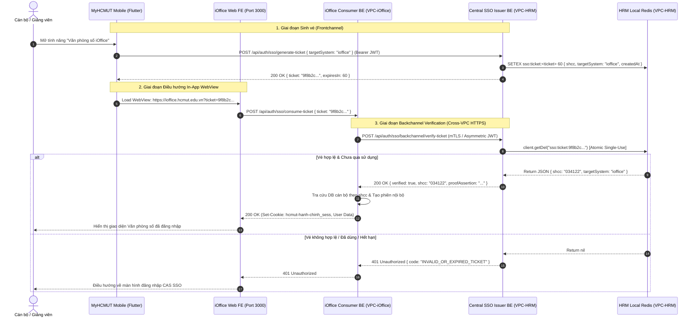

# ĐẶC TẢ KIẾN TRÚC MỞ RỘNG: GIAO THỨC BACKCHANNEL VERIFICATION CHO HẠ TẦNG MULTI-DATACENTER & ISOLATED REDIS (SSO BACKCHANNEL EXTENSION SPEC)

> **Tài liệu thuộc:** Hồ sơ Thiết kế Kỹ thuật & Đồ án Tốt nghiệp (`HK253_DATN_341_2211467_2210392/docs`)  
> **Phân hệ áp dụng:** `hrm-be` (Central SSO Issuer) ⟷ `ioffice-be` (Consumer Subsystem) ⟷ Ecosystem Backends  
> **Cấp độ kiến trúc:** Enterprise Multi-VPC / Hybrid-Cloud SSO Federation  
> **Mã quy chuẩn:** `SPEC-SSO-BC-07` (Phase 7 Production Readiness)  
> **Trạng thái:** 🔒 **BẢN THIẾT KẾ ĐÃ ĐƯỢC PHÊ DUYỆT (PRODUCTION-READY BLUEPRINT)**

---

## 1. TỔNG QUAN & BỐI CẢNH NGHIỆP VỤ

### 1.1. Bối cảnh hạ tầng cơ sở (Baseline Architecture)
Trong giai đoạn phát triển và triển khai tập trung (Phases 0–6), kiến trúc **One-Time Ticket SSO** hoạt động dựa trên giả định mô hình **Shared In-Memory Storage**:
* Phân hệ Quản trị Nhân sự (`hrm-be`, Port 6023) đóng vai trò **Central SSO Issuer**.
* Phân hệ Văn phòng điện tử (`ioffice-be`, Port 3001) đóng vai trò **SSO Consumer**.
* Cả hai phân hệ cùng kết nối tới một Redis Cluster dùng chung (`localhost:6379`), cho phép Consumer gọi trực tiếp lệnh nguyên tử `client.getDel('sso:ticket:<token>')` để xác thực và hủy vé trong một thao tác duy nhất.

### 1.2. Bài toán kỹ thuật khi mở rộng Multi-Datacenter / Isolated VPC
Khi đưa hệ sinh thái vào môi trường vận hành thực tế quy mô lớn của Đại học Quốc gia / Trường ĐH Bách khoa:
1. **Phân mảnh VPC (VPC Network Isolation):** Phân hệ `hrm-be` đặt tại On-Premise Data Center (Campus Core Network), trong khi `ioffice-be` đặt tại Private Cloud (VPC riêng biệt) vì lý do bảo mật dữ liệu văn bản hành chính và phân cấp quản trị.
2. **Không chia sẻ Redis qua mạng diện rộng (WAN Anti-Pattern):**
   * Việc mở cổng Redis qua Internet/WAN hoặc thiết lập Cross-VPC Peering cho Redis vi phạm chính sách Zero-Trust Security.
   * Redis không hỗ trợ phân quyền chi tiết theo từng namespace bảo mật cao, tiềm ẩn nguy cơ lộ lọt toàn bộ phiên làm việc của phân hệ khác.
   * Độ trễ mạng WAN và rủi ro Network Partition (chia cắt mạng) có thể gây ra hiện tượng Redis connection timeout, gián đoạn phiên người dùng.
3. **Mục tiêu kiến trúc mở rộng:** Thiết lập cơ chế **Backchannel Ticket Verification Protocol** qua HTTPS an toàn cao giữa các Data Center độc lập, đảm bảo:
   * Issuer giữ toàn quyền sở hữu vòng đời của SSO Ticket trên Redis nội bộ của mình.
   * Consumer không cần bất kỳ kết nối mạng trực tiếp nào tới Redis của Issuer.
   * Tính chất nguyên tử (Single-Use, TTL 60s) tiếp tục được bảo toàn 100%.

---

## 2. KIẾN TRÚC TỔNG THỂ BACKCHANNEL SSO FEDERATION



---

## 3. ĐẶC TẢ GIAO THỨC BACKCHANNEL VERIFICATION API

### 3.1. Thông số Kỹ thuật Endpoint
* **Tên giao thức:** Backchannel Ticket Verification Protocol (BTVP)
* **Phương thức:** `POST`
* **Đường dẫn nội bộ:** `https://sso-issuer.internal.hcmut.edu.vn/api/auth/sso/backchannel/verify-ticket`
* **Mạng truyền tải:** Dedicated Site-to-Site VPN hoặc Private Subnet Peering qua HTTPS (TLS 1.3).
* **Mã hóa & Xác thực:** Bắt buộc sử dụng Mutual TLS (mTLS) hoặc Ký số Asymmetric JWT (RS256 / ES256).

### 3.2. Cấu trúc Request Headers & Body

#### Request Headers:
```http
POST /api/auth/sso/backchannel/verify-ticket HTTP/1.1
Host: sso-issuer.internal.hcmut.edu.vn
Content-Type: application/json
Accept: application/json
X-Consumer-System-Id: ioffice
X-Request-Timestamp: 1725800000120
X-Request-Nonce: 7c9e6679-7425-40de-944b-e07fc1f90ae7
X-Signature-Algorithm: RS256
X-Backchannel-Signature: eyJhbGciOiJSUzI1NiIsInR5cCI6IkpXVCJ9...
```

#### Request Body (JSON Schema):
```json
{
  "ticket": "8f3b2a1c0e9d8f7a6b5c4d3e2f1a0b9c8d7e6f5a4b3c2d1e0f9a8b7c6d5e4f3a",
  "consumerSystem": "ioffice",
  "clientIp": "10.20.5.14",
  "timestamp": 1725800000120
}
```

#### Thuộc tính trường dữ liệu Request:
| Trường | Kiểu dữ liệu | Bắt buộc | Mô tả chi tiết |
| :--- | :---: | :---: | :--- |
| `ticket` | `string` (Hex 64) | **Có** | Chuỗi mã ngẫu nhiên cryptographically secure 32 bytes hex được cấp bởi Issuer. |
| `consumerSystem` | `string` | **Có** | Định danh hệ thống tiêu thụ (bắt buộc khớp với `SSO_SYSTEM_REGISTRY` tại Issuer). |
| `clientIp` | `string` | Không | Địa chỉ IP của Client truy cập Web FE (dùng cho Audit Log). |
| `timestamp` | `number` | **Có** | Thời điểm gửi request tính bằng mili-giây (chống Replay Attack). |

---

### 3.3. Cấu trúc Response Payloads

#### Trường hợp 1: Xác thực Vé thành công (200 OK)
```json
{
  "status": 200,
  "message": "Vé SSO hợp lệ và đã được tiêu thụ thành công",
  "data": {
    "verified": true,
    "shcc": "034122",
    "targetSystem": "ioffice",
    "ticketCreatedAt": 1725799985000,
    "consumedAt": 1725800000150,
    "issuer": "hrm.hcmut.edu.vn",
    "proofAssertion": "eyJhbGciOiJSUzI1NiIsImtpZCI6ImhybS1zc28tMjAyNiJ9.eyJzdWIiOiIwMzQxMjIiLCJhdWQiOiJpb2ZmaWNlIiwiaXNzIjoiaHJtIiwiaWF0IjoxNzI1ODAwMDAwLCJleHAiOjE3MjU4MDAwNjB9.d9X2..."
  }
}
```

#### Trường hợp 2: Vé không tồn tại, hết hạn hoặc đã tiêu thụ (401 Unauthorized)
```json
{
  "status": 401,
  "message": "Vé SSO không hợp lệ hoặc đã hết hạn",
  "data": {
    "verified": false,
    "errorCode": "TICKET_INVALID_OR_EXPIRED"
  }
}
```

#### Trường hợp 3: Hệ thống tiêu thụ không khớp với phạm vi cấp vé (403 Forbidden)
```json
{
  "status": 403,
  "message": "Vé SSO được cấp cho hệ thống khác, từ chối tiêu thụ",
  "data": {
    "verified": false,
    "errorCode": "TARGET_SYSTEM_MISMATCH",
    "expected": "hrm",
    "received": "ioffice"
  }
}
```

#### Trường hợp 4: Lỗi Chữ ký hoặc Lệch thời gian (400 Bad Request)
```json
{
  "status": 400,
  "message": "Chữ ký số backchannel không hợp lệ hoặc độ lệch thời gian vượt quá ±30s",
  "data": {
    "verified": false,
    "errorCode": "SECURITY_HANDSHAKE_FAILED"
  }
}
```

---

## 4. CƠ CHẾ XÁC THỰC HAI CHIỀU & BẢO MẬT MÃ HÓA (ZERO-TRUST)

Hệ thống cung cấp hai phương án bảo mật bổ trợ có thể triển khai đồng thời (Defense-in-Depth):

### 4.1. Lớp 1: Mutual TLS (mTLS) - Xác thực Tầng Giao vận (Transport Layer)
1. **Kiến trúc chứng chỉ (PKI):**
   * Trung tâm Dữ liệu HCMUT duy trì một Internal Private Certificate Authority (HCMUT-SSO-Internal-CA).
   * Cả Issuer (`hrm-be`) và Consumer (`ioffice-be`) được cấp cặp chứng chỉ X.509 riêng biệt với Common Name định danh:
     * Issuer: `CN=sso-issuer.internal.hcmut.edu.vn`
     * Consumer: `CN=ioffice-consumer.internal.hcmut.edu.vn`
2. **Quy trình Handshake:**
   * Nginx Reverse Proxy / API Gateway tại VPC-HRM kích hoạt `ssl_verify_client on;`.
   * Mọi request tới `/api/auth/sso/backchannel/*` thiếu chứng chỉ hợp lệ do CA ký sẽ bị chặn ngay lập tức tại tầng Gateway (HTTP 495/496) trước khi chạm tới ứng dụng Express.

### 4.2. Lớp 2: Asymmetric JWT Signature - Xác thực Tầng Ứng dụng (Application Layer)
Để chống lại nguy cơ Man-in-the-Middle ngay cả khi lưu lượng đi qua các Proxy trung gian nội bộ:
1. **Ký số Request:** Phân hệ Consumer dùng Khóa bí mật riêng (RSA Private Key 2048-bit hoặc ECDSA P-256) để ký Payload của Request gồm `{ ticket, consumerSystem, timestamp, nonce }`.
2. **Xác thực tại Issuer:**
   * Issuer duy trì bảng Registry Public Keys của tất cả Consumer hợp lệ.
   * Kiểm tra `Math.abs(Date.now() - timestamp) <= 30000` (giới hạn sai lệch đồng hồ tối đa $\pm 30$ giây).
   * Kiểm tra `nonce` trên bộ nhớ Redis Cache với TTL 60s để triệt tiêu hoàn toàn Replay Attacks.
3. **Ký số Proof Assertion:**
   * Khi `client.getDel()` thành công, Issuer sinh một Proof JWT ký bằng Private Key của Issuer (`hrm`), gắn kèm Claims:
     `{ sub: shcc, aud: targetSystem, iat: now, exp: now + 60 }`.
   * Consumer lưu Proof này vào Audit Trail để đối soát kiểm toán tuân thủ.

---

## 5. ĐỘ TRỄ, NĂNG LỰC TẢI & KHẢ NĂNG DỰ PHÒNG (FAILOVER & LATENCY)

### 5.1. Ngân sách Độ trễ (Latency Budget)
Trải nghiệm người dùng trên Mobile WebView đòi hỏi quá trình xác thực không tạo ra độ trễ nhận biết được (Jank/Freezing). Bảng phân bổ ngân sách độ trễ tối đa:

| Giai đoạn Thao tác | Thời gian Mục tiêu (P50) | Giới hạn Cảnh báo (P95) | Giới hạn Tối đa (P99) |
| :--- | :---: | :---: | :---: |
| 1. Mobile gọi `generate-ticket` tại Issuer | 12 ms | 35 ms | 60 ms |
| 2. Mobile mở WebView & tải HTML Shell | 120 ms | 250 ms | 450 ms |
| 3. FE gửi `consume-ticket` lên Consumer BE | 15 ms | 40 ms | 70 ms |
| 4. Backchannel HTTPS Round-trip (mTLS + getDel) | 25 ms | 55 ms | 90 ms |
| 5. Tra cứu User DB & Tạo Session nội bộ | 8 ms | 20 ms | 45 ms |
| **TỔNG THỜI GIAN ĐĂNG NHẬP HOÀN TẤT** | **180 ms** | **400 ms** | **< 700 ms** |

*Đánh giá:* Tổng thời gian hoàn tất trung bình 180 ms hoàn toàn mượt mà và không gây gián đoạn tải trang của người dùng.

### 5.2. Quản lý Kết nối HTTP/2 Connection Pooling
* Consumer BE duy trì một `https.Agent` tối ưu hóa:
  * `keepAlive: true`
  * `keepAliveMsecs: 30000`
  * `maxSockets: 64` (đủ phục vụ 500 CCU đồng thời)
  * `timeout: 3000` (3.0s Timeout ngưỡng cứng)
* Loại bỏ chi phí TLS Handshake ở các request tiếp theo nhờ tái sử dụng TLS Session Ticket và persistent sockets.

### 5.3. Mẫu Thiết kế Circuit Breaker & Graceful Degradation
Để bảo vệ hệ thống Consumer khi mạng WAN giữa hai Data Center gặp sự cố:
```
[State: CLOSED] ──(Tỷ lệ lỗi > 50% trong 10 req)──> [State: OPEN]
       ▲                                                  │
       │                                            (Sau 15 giây)
       │                                                  ▼
[State: HALF-OPEN] ◄──(Thử nghiệm 3 req thành công)─── [Thử nghiệm]
```

* **Xử lý khi Circuit Breaker OPEN hoặc Backchannel Timeout:**
  1. Consumer BE không làm treo request của người dùng, lập tức trả về mã lỗi có cấu trúc:
     `{ status: 503, message: "Hệ thống liên kết SSO tạm thời gián đoạn", fallbackUrl: "/login" }`.
  2. Frontend phát hiện `fallbackUrl` và lập tức chuyển hướng người dùng sang giao diện đăng nhập CAS SSO tập trung chuẩn của Nhà trường.
  3. Người dùng vẫn có thể đăng nhập bình thường bằng tài khoản và mật khẩu, **không bao giờ bị chặn hoàn toàn nghiệp vụ**.

### 5.4. Tính sẵn sàng cao (High Availability Cluster)
* **Issuer Phía HRM:** Triển khai cụm tối thiểu 2 nodes `hrm-be` đặt sau Nginx Load Balancer hỗ trợ thuật toán `least_conn` và Active Health Check.
* **Redis Cluster Phía HRM:** Cấu hình Redis Master-Replica với Redis Sentinel hoặc AWS ElastiCache Multi-AZ tự động failover trong $< 5$ giây.

---

## 6. MA TRẬN PHÂN QUYỀN & KIỂM TOÁN (AUDIT & COMPLIANCE)

1. **Bộ lọc Dữ liệu Nhạy cảm:**
   * Toàn bộ tham số `ticket`, `proofAssertion`, `X-Backchannel-Signature` bắt buộc phải được khai báo trong `SENSITIVE_KEYS` của `fw_tracking_log/tracking_filter.ts`.
   * Nội dung log chỉ ghi nhận tiền tố: `ticket: "8f3b2a1c...***"` để phục vụ đối soát mà không làm lộ vé trên log tập trung.
2. **Lưu trữ Nhật ký Giao dịch:**
   * Mỗi giao dịch backchannel ghi nhận: `{ timestamp, consumerId, clientIp, ticketHash, status, latencyMs }`.
   * Lưu trữ tối thiểu 90 ngày phục vụ kiểm tra an toàn thông tin ISO/IEC 27001 của Nhà trường.

---

## 7. LỘ TRÌNH CHUYỂN ĐỔI (MIGRATION PATHWAY)

* **Giai đoạn Hiện tại (Môi trường Dev/Staging):** Tiếp tục duy trì mô hình Local Shared Redis (`localhost:6379`) theo đúng thiết kế Phases 1–6 để tối ưu hiệu năng và đơn giản hóa môi trường phát triển.
* **Giai đoạn Chuyển đổi (Production Multi-VPC):** Kích hoạt Backchannel Handler tại `hrm-be` và trỏ cấu hình Consumer `SSO_ISSUER_BACKCHANNEL_URL` mà không cần sửa đổi bất kỳ logic nào phía Mobile App và Web Frontend (đảm bảo tính trừu tượng hóa tuyệt đối của tầng Client).
