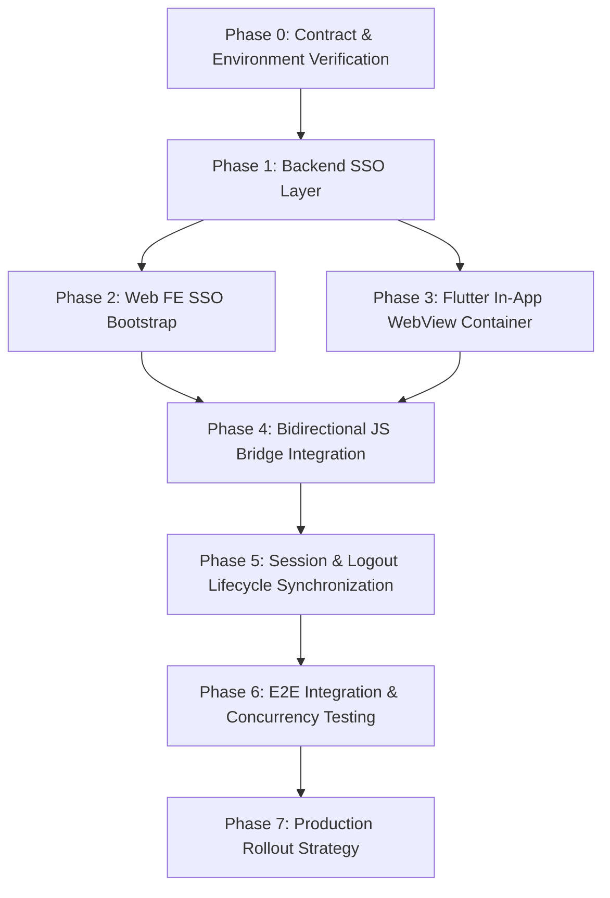

# ĐẶC TẢ KIẾN TRÚC & KẾ HOẠCH TRIỂN KHAI: TÍCH HỢP ONE-TIME TICKET SSO & IN-APP WEBVIEW

> **Dự án:** Ứng dụng di động MyHCMUT kết hợp Hệ sinh thái Web nội bộ (HRM, iOffice)  
> **Tài liệu thuộc:** Đồ án Tốt nghiệp & Hồ sơ Kỹ thuật Hệ thống (`HK253_DATN_341_2211467_2210392/docs`)  
> **Mô hình Kiến trúc:** Central SSO Ticket Issuer with Multi-System Consumers  
> **Phạm vi Toàn diện:** `myhcmut-mobile` (Flutter) ⟷ `hrm-be` (SSO Issuer & HRM Consumer) ⟷ `hrm-fe` ⟷ `ioffice-be` (iOffice Consumer) ⟷ `ioffice-fe`  
> **Trạng thái:** 🔒 **BẢN CHUẨN HÓA HOÀN THIỆN ĐÃ PHÊ DUYỆT (v2.0)**

---

## 1. TỔNG QUAN VÀ MỤC TIÊU KIẾN TRÚC

### 1.1. Bối cảnh & Bài toán nghiệp vụ
Ứng dụng di động `myhcmut-mobile` phục vụ cán bộ, giảng viên Trường Đại học Bách khoa - ĐHQG-HCM. Để giải quyết các nghiệp vụ biểu mẫu đồ sộ mà không phải viết lại native (Chỉnh sửa Lý lịch 11 phân mục, điều hành văn bản iOffice), giải pháp tối ưu là tích hợp **In-App WebView** nhúng các phân hệ Web Frontend hiện hữu (`hrm-fe`, `ioffice-fe`).

Thách thức cốt lõi: **Người dùng đã đăng nhập trên Mobile (bằng JWT Bearer Token) không phải đăng nhập lại khi vào Web (Single Sign-On), đồng thời không được truyền token dài hạn qua URL query string vì nguy cơ bảo mật.**

### 1.2. Mô hình kiến trúc: Central SSO Ticket Issuer with Multi-System Consumers
Hệ thống sử dụng cơ chế **One-Time Ticket SSO (Vé dùng một lần, TTL 60s, Single-Use via Redis Atomic GETDEL)** do `hrm-be` đóng vai trò **Issuer trung tâm**, và các Backend (`hrm-be`, `ioffice-be`) đóng vai trò **Consumer độc lập**:

```
                    ┌──────────────────────────┐
                    │   Flutter Mobile Client  │
                    │    (Bearer JWT Token)    │
                    └────────────┬─────────────┘
                                 │
                 1. POST /api/auth/sso/generate-ticket
                    { targetSystem: "hrm" | "ioffice" }
                                 │
                                 ▼
                    ┌──────────────────────────┐
                    │     CENTRAL SSO ISSUER   │
                    │        (hrm-be:6023)     │
                    └────────────┬─────────────┘
                                 │ 2. SETEX sso:ticket:<hex32> 60s
                                 │    { shcc, targetSystem, createdAt }
                                 ▼
                           ┌───────────┐
                           │   REDIS   │
                           │(localhost)│
                           └─────▲─────┘
                                 │ 4. client.getDel(key) (Atomic Single-Use)
        ┌────────────────────────┴────────────────────────┐
        │                                                 │
┌───────┴───────────────┐                         ┌───────┴───────────────┐
│  HRM CONSUMER BE      │                         │ iOffice CONSUMER BE   │
│     (hrm-be:6023)     │                         │   (ioffice-be:3001)   │
└───────▲───────────────┘                         └───────▲───────────────┘
        │ 3. POST /api/auth/sso/consume-ticket            │ 3. POST /api/auth/sso/consume-ticket
        │    { ticket }                                   │    { ticket }
┌───────┴───────────────┐                         ┌───────┴───────────────┐
│    hrm-fe (Port 6022) │                         │  ioffice-fe (Port 3000│
│  (Session: hcmut-hrm) │                         │ (Sess: hcmut-hanhchinh│
└───────────────────────┘                         └───────────────────────┘
```

---

## 2. MA TRẬN ĐỊA CHỈ MẠNG MÔI TRƯỜNG DEV (LOCAL RUNTIME TOPOLOGY)

Để giải quyết vấn đề phân giải mạng khi chạy trên Android Emulator (vốn coi `localhost` là chính emulator chứ không phải máy host):

| Phân hệ / Dịch vụ | Port | Host (Web Browser / iOS Simulator) | Android Emulator | Ghi chú |
| :--- | :---: | :--- | :--- | :--- |
| **`hrm-fe`** | 6022 | `http://localhost:6022` | `http://10.0.2.2:6022` | Web Quản trị Nhân sự (React/Vite) |
| **`hrm-be`** | 6023 | `http://localhost:6023` | `http://10.0.2.2:6023` | SSO Issuer & HRM Consumer BE |
| **`ioffice-fe`** | 3000 | `http://localhost:3000` | `http://10.0.2.2:3000` | Web Văn phòng số (React/Vite) |
| **`ioffice-be`** | 3001 | `http://localhost:3001` | `http://10.0.2.2:3001` | iOffice Consumer BE |
| **`Redis`** | 6379 | `localhost:6379` | *Chỉ truy cập nội bộ phía BE* | DB lưu trữ vé SSO & Session Store |

---

## 3. BẢNG QUYẾT ĐỊNH KỸ THUẬT (TECHNICAL DECISION LEDGER)

* 🔒 **LOCKED:** Đã chốt cứng cho Implementation.
* 🔍 **VERIFIED:** Đã đối chiếu chính xác từ codebase thực tế.
* 🚀 **FUTURE:** Quy chuẩn cho Production rollout.

| # | Hạng mục | Quyết định kỹ thuật | Trạng thái |
| :-: | :--- | :--- | :-: |
| **1** | **Issuer** | `hrm-be` là Central SSO Ticket Issuer duy nhất. | 🔒 LOCKED |
| **2** | **Consumer** | Consumer BE (`hrm-be`, `ioffice-be`) tự consume vé và tự tạo session cho Web của mình. | 🔒 LOCKED |
| **3** | **Identity** | `shcc` là định danh người dùng được sử dụng thống nhất giữa Mobile, HRM và iOffice. | 🔒 LOCKED |
| **4** | **Identity Source** | `shcc` bắt buộc trích xuất từ authenticated JWT context (`req.session.user.shcc`), không nhận từ client body. | 🔒 LOCKED |
| **5** | **Ticket Storage** | Key Redis: `sso:ticket:<ticket>`, TTL 60s, Single-use qua `client.getDel()`. | 🔒 LOCKED |
| **6** | **Ticket Payload** | JSON `{ shcc: string, targetSystem: string, createdAt: number }`. Không chứa token dài hạn. | 🔒 LOCKED |
| **7** | **Target Scope** | Sử dụng `targetSystem` (hrm / ioffice) có Server-Side Registry tại Issuer. | 🔒 LOCKED |
| **8** | **System Binding** | Consumer BE bắt buộc đối chiếu `ticketData.targetSystem === CURRENT_SYSTEM_ID`. | 🔒 LOCKED |
| **9** | **Session Lifecycle**| Gọi `req.session.regenerate()` TRƯỚC rồi gọi `app.session.update()` SAU để bảo toàn dữ liệu phiên và chống Session Fixation. | 🔍 VERIFIED |
| **10**| **Cookie Contract** | Cookie name lấy động từ `process.env.APP_NAME \|\| 'connect.sid'`. | 🔍 VERIFIED |
| **11**| **Local Redis** | Cả `hrm-be` và `ioffice-be` dùng chung `localhost:6379` ở môi trường Dev. | 🔍 VERIFIED |
| **12**| **CORS Local** | Khai báo tường minh: `['http://localhost:6022', 'http://localhost:3000']`. | 🔒 LOCKED |
| **13**| **Bridge Protocol** | JSON chuẩn: `{ version: 1, type, action, timestamp, data }`. | 🔒 LOCKED |
| **14**| **Bridge Actions** | Thống nhất Business Events: `profile_updated`, `leave_submitted`, `leave_approved`, `leave_rejected`, `business_trip_submitted`. | 🔒 LOCKED |
| **15**| **Bridge Identity** | Bridge Payload **không truyền `shcc`** (Mobile tự biết user hiện tại, chỉ nhận event để trigger refresh). | 🔒 LOCKED |
| **16**| **Bridge Security**| Parse `Uri` (scheme, host, port) để validate trusted origin, không dùng contains. | 🔒 LOCKED |
| **17**| **External Fallback**| Nút "Mở trình duyệt ngoài" luôn sinh **TICKET MỚI**, không tái sử dụng ticket cũ. | 🔒 LOCKED |
| **18**| **Web Logout** | Consumer BE là owner chịu trách nhiệm invalidate session trên Redis khi nhận logout từ Web. | 🔒 LOCKED |
| **19**| **Mobile Logout** | Mobile Logout = **Device-Level Client-side Cookie Cleanup** (`CookieManager.deleteAllCookies()`). | 🔒 LOCKED |
| **20**| **FE Deduplication**| Web FE bọc cờ chống chạy đúp `consume-ticket` khi React 18 StrictMode mount 2 lần. | 🔒 LOCKED |
| **21**| **App Routing** | Phân hệ HRM: `/staff/user/my/staff-ly-lich`. Phân hệ iOffice: `/user/incoming-doc`. | 🔍 VERIFIED |
| **22**| **Cookie Persistence**| Cookie duy trì trong OS CookieJar của WebView; reload trang không mất phiên. | 🔍 VERIFIED |
| **23**| **Tracking Audit** | Bổ sung `'ticket'` vào `SENSITIVE_KEYS` của `fw_tracking_log/tracking_filter.ts`. | 🔒 LOCKED |
| **24**| **WebView Sandbox**| Đặt `AppInAppWebViewScreen` trong module `hrm`, không đưa vào `packages/shared/auth`. | 🔒 LOCKED |
| **25**| **Prod Redis Bridge**| Backchannel Verification API (`/api/auth/sso/verify-internal`) nếu tách Redis. | 🚀 FUTURE |
| **26**| **Prod Reverse Proxy**| Nginx định tuyến chung domain `https://hrm.hcmut.edu.vn` (/staff/* và /api/*). | 🚀 FUTURE |
| **27**| **Prod Cookie Tuning**| Bật `secure: true`, `sameSite: 'lax'` khi chạy toàn bộ trên HTTPS. | 🚀 FUTURE |
| **28**| **Multi-FE Scale** | Mở rộng Registry cho `payroll`, `portal` khi có kế hoạch rollout. | 🚀 FUTURE |

---

## 4. CHI TIẾT HỢP ĐỒNG KỸ THUẬT (DETAILED CONTRACTS)

### 4.1. Server-Side Target Registry (`hrm-be`)
```typescript
// modules/_default/fw_auth/sso_registry.ts
export interface SsoSystemConfig {
    name: string;
    allowedOrigins: string[];
}

export const SSO_SYSTEM_REGISTRY: Record<string, SsoSystemConfig> = {
    hrm: {
        name: 'Hệ thống Quản trị Nhân sự',
        allowedOrigins: [
            'http://localhost:6022',
            'http://127.0.0.1:6022',
            'http://10.0.2.2:6022',
            'https://hrm.hcmut.edu.vn'
        ],
    },
    ioffice: {
        name: 'Hệ thống Quản lý Hành chính & Văn bản',
        allowedOrigins: [
            'http://localhost:3000',
            'http://127.0.0.1:3000',
            'http://10.0.2.2:3000',
            'https://ioffice.hcmut.edu.vn'
        ],
    },
};
```

### 4.2. API Sinh vé SSO (Issuer - `hrm-be`)
* **Endpoint:** `POST /api/auth/sso/generate-ticket`
* **Xác thực:** Bắt buộc có `Authorization: Bearer <jwtToken>` (`app.permissions.check('user:login')`).
* **Request Body:** `{ "targetSystem": "hrm" | "ioffice" }` (Tuyệt đối không gửi `shcc`).
* **Thao tác:**
  * Lấy `shcc = req.session.user?.shcc`.
  * Validate `targetSystem` tồn tại trong `SSO_SYSTEM_REGISTRY`.
  * Sinh ticket: `crypto.randomBytes(32).toString('hex')`.
  * Lưu Redis: `SETEX sso:ticket:<ticket> 60 '{"shcc":"...","targetSystem":"...","createdAt":...}'`.
* **Response (200 OK):** `{ "status": 200, "data": { "ticket": "...", "expiresIn": 60, "targetSystem": "..." } }`.

### 4.3. API Tiêu thụ vé SSO (Consumer - `hrm-be` & `ioffice-be`)
* **Endpoint:** `POST /api/auth/sso/consume-ticket`
* **Xác thực:** Yêu cầu vé SSO hợp lệ, còn hạn (không cần Bearer JWT).
* **Request Body:** `{ "ticket": "..." }`
* **Thao tác:**
  1. `const raw = await app.database.redis.getDel(`sso:ticket:${ticket}`);`
  2. Parse JSON, kiểm tra `ticketData.targetSystem === CURRENT_SYSTEM_ID` (HRM là `'hrm'`, iOffice là `'ioffice'`).
  3. Tra cứu user DB theo `ticketData.shcc`.
  4. `await req.session.regenerate();`
  5. `const session = await app.session.update(req, sessionUser);`
* **Response (200 OK):** Header `Set-Cookie` chứa session cookie của hệ thống đó (`connect.sid` hoặc `hcmut-hanh-chinh_sess`) và body trả về User Profile.

### 4.4. Giao thức JS Bridge (Web $\longleftrightarrow$ Flutter)
* **Tên Handler:** `onFlutterBridgeEvent`
* **Interface Protocol:**
  ```typescript
  export interface FlutterBridgeMessage<T = Record<string, unknown>> {
      version: 1;
      type: 'action_completed' | 'close_webview' | 'request_logout';
      action?: 'profile_updated' | 'leave_submitted' | 'leave_approved' | 'leave_rejected' | 'business_trip_submitted';
      timestamp: number;
      data?: T;
  }
  ```
* **Nguyên tắc Payload:** Không truyền `shcc` qua Bridge (tránh lộ định danh thừa; Mobile tự xác định user hiện hành và gọi hàm refresh tương ứng).
* **Kiểm tra Bảo mật phía Flutter:**
  ```dart
  void handleBridgeEvent(String? rawPayload, String currentUrl) {
    final uri = Uri.tryParse(currentUrl);
    if (uri == null) return;

    final isLocal = (uri.scheme == 'http' && 
                     (uri.host == 'localhost' || uri.host == '127.0.0.1' || uri.host == '10.0.2.2') &&
                     (uri.port == 6022 || uri.port == 3000));
    final isProd = (uri.scheme == 'https' && 
                    (uri.host == 'hrm.hcmut.edu.vn' || uri.host == 'ioffice.hcmut.edu.vn'));

    if (!isLocal && !isProd) {
      debugPrint('[Security] Bỏ qua Bridge Event từ Origin không tin cậy: ${uri.origin}');
      return;
    }
    // Parse JSON và xử lý action_completed
  }
  ```

---

## 5. KẾ HOẠCH TRIỂN KHAI 8 GIAI ĐOẠN (CHẶT CHẼ & TOÀN DIỆN)



### Phase 0: Contract & Environment Verification
* [ ] **Phase 0A (Verify Existing Infra):**
  * Kiểm tra Redis Server local hỗ trợ `client.getDel()` (Redis $\ge 6.2$).
  * Kiểm tra middleware JWT `extractSessionId` trong `hrm-be` và `ioffice-be`.
  * Xác nhận local runtime matrix (`localhost` vs `10.0.2.2`).
* [ ] **Phase 0B (Security & Config Prep):**
  * Cập nhật `CORS_ALLOW_ORIGIN` trên cả 2 backend bao gồm đầy đủ origin của FE.
  * Bổ sung `'ticket'` vào danh sách `SENSITIVE_KEYS` trong `hrm-be/modules/_default/fw_tracking_log/tracking_filter.ts`.

### Phase 1: Backend SSO Layer (Issuer & Multi-Consumer)
* [ ] **Phase 1A (`hrm-be` - Issuer & HRM Consumer):**
  * Tạo tệp `modules/_default/fw_auth/sso_registry.ts` định nghĩa `SSO_SYSTEM_REGISTRY`.
  * Viết API `POST /api/auth/sso/generate-ticket` trong `controller.ts` (kiểm tra `user:login`, trích xuất `shcc` từ context, sinh vé 32 hex bytes, lưu Redis TTL 60s).
  * Viết API `POST /api/auth/sso/consume-ticket` trong `controller.ts` (dùng `getDel`, validate `targetSystem === 'hrm'`, `regenerate()` $\rightarrow$ `session.update()`).
* [ ] **Phase 1B (`ioffice-be` - iOffice Consumer):**
  * Viết API `POST /api/auth/sso/consume-ticket` trong `modules/init.js` (dùng `getDel`, validate `targetSystem === 'ioffice'`, tra cứu user theo `shcc`, `regenerate()` $\rightarrow$ `session.update()`).

### Phase 2: Web FE SSO Bootstrap
* [ ] **Phase 2A (`hrm-fe`):**
  * Cập nhật `src/hooks/use-auth.tsx`: Bắt query `?ticket=`, bọc cờ chống StrictMode đúp, gọi `consume-ticket`, xóa param khỏi URL qua `replaceState`.
* [ ] **Phase 2B (`ioffice-fe`):**
  * Cập nhật `src/hooks/use-auth.tsx`: Bắt query `?ticket=`, tiêu thụ vé tại `ioffice-be`, đồng bộ Zustand store.

### Phase 3: Flutter In-App WebView Container (`myhcmut-mobile`)
* [ ] Tạo `modules/hrm/lib/src/webview/sso_ticket_service.dart`: Gọi API `generate-ticket` lấy vé cho hệ thống tương ứng.
* [ ] Tạo `modules/hrm/lib/src/webview/app_in_app_webview_screen.dart`:
  * AppBar nhận diện HCMUT, tiến trình tải trang `LinearProgressIndicator`.
  * Nút "Mở bằng trình duyệt ngoài": Gọi sinh vé mới $\rightarrow$ ghép vào URL $\rightarrow$ mở qua `url_launcher`.
  * Cấu hình `shouldOverrideUrlLoading` với Domain Allowlist.
* [ ] Gắn điểm mở WebView tại màn hình Lý lịch cán bộ (`personal_profile_page.dart` / `edit_section_menu_sheet.dart`).

### Phase 4: Bidirectional JS Bridge Integration
* [ ] **Web (`hrm-fe`):** Tạo helper `notifyFlutterAction` trong `src/utils/flutter-bridge.ts`.
* [ ] **Web (`hrm-fe`):** Gắn `notifyFlutterAction('profile_updated')` vào `onSuccess` của `submitEditMutation` trong `use-ly-lich-edit.tsx`.
* [ ] **Mobile (`myhcmut-mobile`):** Đăng ký `addJavaScriptHandler('onFlutterBridgeEvent')`:
  * Validate Origin chuẩn xác (`Uri`).
  * Khi nhận `profile_updated`: đóng WebView (`Navigator.pop`), gọi `refreshProfile(ref)` cập nhật dữ liệu Native và hiển thị Toast thành công.

### Phase 5: Session & Logout Lifecycle Synchronization
* [ ] **Web Logout:** User bấm logout trên Web $\rightarrow$ Consumer BE hủy session $\rightarrow$ Web gửi bridge `request_logout` $\rightarrow$ Mobile đóng WebView.
* [ ] **Mobile Logout:** User bấm logout trên Mobile $\rightarrow$ Gọi `POST /api/auth/logout` lên BE $\rightarrow$ Root app (`apps/myhcmut/lib/main.dart`) gọi `CookieManager.instance().deleteAllCookies()` để dọn sạch cookie thiết bị.

### Phase 6: E2E Integration & Concurrency Testing
* [ ] **Ticket & Concurrency Test:**
  * Test đồng thời 2 request (A và B) với cùng 1 ticket $\rightarrow$ Khẳng định request A trả về 200 OK, request B trả về 401 Unauthorized (`client.getDel` thành công).
  * Test vé hết hạn sau 60s $\rightarrow$ 401.
  * Test vé sai targetSystem (ticket sinh cho `ioffice` gửi lên `hrm`) $\rightarrow$ 403.
* [ ] **Navigation & Persistence Test:**
  * Reload WebView không mất phiên đăng nhập.
  * Thử nghiệm upload file minh chứng lý lịch trên WebView.
* [ ] **Bridge & Logout Test:**
  * Chỉnh sửa lý lịch trên Web $\rightarrow$ WebView tự đóng $\rightarrow$ Native cập nhật thông tin mới.
  * Đăng xuất Mobile $\rightarrow$ Mở lại WebView xác nhận sạch cookie.

### Phase 7: Production Rollout Strategy (🔒 COMPLETED)
* [x] Cấu hình Nginx Reverse Proxy gom domain: `https://hrm.hcmut.edu.vn` và `https://ioffice.hcmut.edu.vn`.
* [x] Bật cờ Cookie `secure: true, sameSite: 'lax'`.
* [x] Kế hoạch mở rộng Backchannel API nếu production tách rời Redis (`docs/SSO_BACKCHANNEL_EXTENSION_SPEC.md`).
* [x] Xây dựng Sổ tay Triển khai & Hoàn nguyên Sản xuất (`docs/SSO_ROLLOUT_AND_ROLLBACK_RUNBOOK.md`).

---

## 6. KẾ HOẠCH HOÀN NGUYÊN (ROLLBACK PLAN)

1. **Phía Mobile:** Ẩn nút "Chỉnh sửa đầy đủ qua Web" hoặc chuyển hướng mở thẳng trình duyệt ngoài bằng `url_launcher`.
2. **Phía Backend:** Tắt các route `/api/auth/sso/*`; toàn bộ các luồng đăng nhập truyền thống (CAS, SAML, mật khẩu) tiếp tục hoạt động 100% không bị ảnh hưởng.
3. **Phía Web:** Bỏ điều kiện kiểm tra `?ticket=` trong `use-auth.tsx`; Web tự động quay về form đăng nhập nội bộ tiêu chuẩn.
