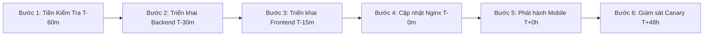
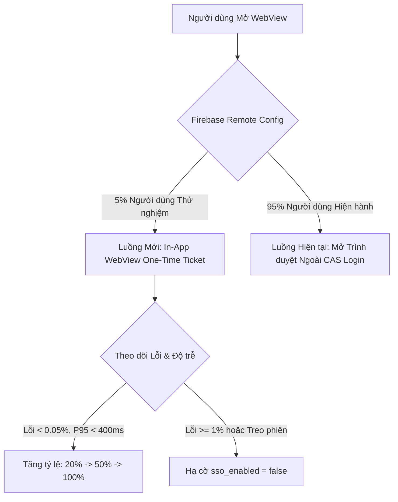
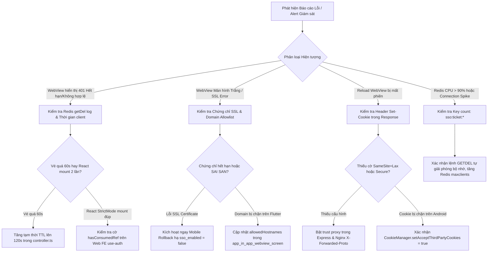

# SỔ TAY VẬN HÀNH: QUY TRÌNH TRIỂN KHAI & HOÀN NGUYÊN HỆ THỐNG SSO (SSO PRODUCTION ROLLOUT & ROLLBACK RUNBOOK)

> **Dự án:** Ứng dụng di động MyHCMUT & Hệ sinh thái Web nội bộ (HRM, iOffice)  
> **Tài liệu thuộc:** Hồ sơ Kỹ thuật Vận hành Hệ thống (`HK253_DATN_341_2211467_2210392/docs`)  
> **Phạm vi Phân hệ:** `myhcmut-mobile` (Flutter), `hrm-be`, `hrm-fe`, `ioffice-be`, `ioffice-fe`, `nginx`, `redis`  
> **Mã quy chuẩn:** `RUNBOOK-SSO-OPS-07`  
> **Trạng thái:** 🔒 **BẢN QUY CHUẨN VẬN HÀNH CHÍNH THỨC (APPROVED RUNBOOK)**

---

## 1. TỔNG QUAN & CAM KẾT CHẤT LƯỢNG DỊCH VỤ (SLA)

### 1.1. Mục tiêu Runbook
Tài liệu này cung cấp hướng dẫn tác nghiệp chuẩn cho đội ngũ Kỹ sư Vận hành (SRE/DevOps) và Quản trị Hệ thống trong quá trình:
1. Triển khai cấu hình sản xuất (Production Release) hệ thống One-Time Ticket SSO.
2. Áp dụng chiến lược triển khai từng phần không gián đoạn dịch vụ (Zero-Downtime Canary Rollout).
3. Kích hoạt quy trình hoàn nguyên khẩn cấp (Emergency Rollback) theo từng phân hệ độc lập.
4. Xử lý sự cố vận hành theo cây quyết định chuẩn hóa (Incident Response Decision Tree).

### 1.2. Cam kết Vận hành & SLA
* **Thời gian gián đoạn mục tiêu:** $0\text{s}$ (Zero Downtime). Quá trình cập nhật Backend và Nginx sử dụng cơ chế Graceful Reload.
* **Bảo vệ luồng Đăng nhập Truyền thống (Zero Blast Radius):** Mọi sự cố phát sinh tại phân hệ SSO Ticket **tuyệt đối không được ảnh hưởng** tới các phương thức xác thực hiện hữu: Cổng CAS SSO tập trung (`cas.hcmut.edu.vn`), Xác thực LDAP Nhà trường, và Đăng nhập Mật khẩu nội bộ.
* **Thời gian Hoàn nguyên Tối đa (MTTR Rollback):** $< 3$ phút cho Backend/Nginx; $< 30$ giây qua Remote Config cho Mobile.

---

## 2. QUY TRÌNH TRIỂN KHAI SẢN XUẤT TỪNG BƯỚC (STEP-BY-STEP DEPLOYMENT)



### Bước 1: Kiểm tra Tiền Triển khai (Pre-Deployment Checklist - T-60 phút)
1. **Kiểm tra Redis Server:**
   ```bash
   redis-cli -h localhost -p 6379 ping
   # Phải trả về: PONG
   redis-cli -h localhost -p 6379 info server | grep redis_version
   # Xác nhận Redis version >= 6.2 (hỗ trợ lệnh nguyên tử GETDEL)
   ```
2. **Kiểm tra Chứng chỉ SSL:**
   ```bash
   openssl x509 -in /etc/ssl/certs/hrm.hcmut.edu.vn.crt -text -noout | grep -E "(Not After|Subject:)"
   openssl x509 -in /etc/ssl/certs/ioffice.hcmut.edu.vn.crt -text -noout | grep -E "(Not After|Subject:)"
   # Xác nhận chứng chỉ còn hạn tối thiểu 30 ngày
   ```
3. **Sao lưu Cấu hình & Dữ liệu:**
   ```bash
   # Sao lưu cấu hình Nginx hiện hành
   cp -r /etc/nginx /etc/nginx/backup_pre_sso_$(date +%Y%m%d_%H%M%S)
   # Sao lưu file cấu hình môi trường .env
   cp /home/xchinh/workspace/hrm-be/.env /home/xchinh/workspace/hrm-be/.env.bak
   cp /home/xchinh/workspace/ioffice-be/.env /home/xchinh/workspace/ioffice-be/.env.bak
   ```

---

### Bước 2: Triển khai & Cập nhật Backend (T-30 phút)
1. **Cập nhật Biến Môi trường Sản xuất:**
   Đảm bảo các file `.env` trên máy chủ chứa đầy đủ:
   ```ini
   NODE_ENV=production
   APP_NAME=hcmut-hrm          # Trên hrm-be
   # APP_NAME=hcmut-hanhchinh  # Trên ioffice-be
   SESSION_COOKIE_DOMAIN=.hcmut.edu.vn
   CORS_ALLOW_ORIGIN=https://hrm.hcmut.edu.vn,https://ioffice.hcmut.edu.vn
   ```
2. **Khởi động lại Backend không gián đoạn (PM2 Cluster Reload):**
   ```bash
   # HRM Backend
   cd /home/xchinh/workspace/hrm-be
   npm run build
   pm2 reload hrm-be --update-env
   
   # iOffice Backend
   cd /home/xchinh/workspace/ioffice-be
   pm2 reload ioffice-be --update-env
   ```
3. **Smoke Test Xác thực Backend:**
   ```bash
   # Kiểm tra endpoint sinh vé trả về 401 khi không có JWT
   curl -i -X POST http://127.0.0.1:6023/api/auth/sso/generate-ticket \
     -H "Content-Type: application/json" -d '{"targetSystem":"hrm"}'
   # Kỳ vọng: HTTP/1.1 302 Found (Redirect to /login) hoặc 401 Unauthorized
   
   # Kiểm tra endpoint tiêu thụ vé trả về 401 khi vé không tồn tại
   curl -i -X POST http://127.0.0.1:3001/api/auth/sso/consume-ticket \
     -H "Content-Type: application/json" -d '{"ticket":"00000000000000000000000000000000"}'
   # Kỳ vọng: HTTP/1.1 401 Unauthorized
   ```

---

### Bước 3: Triển khai Giao diện Web Frontend (T-15 phút)
1. **Build mã nguồn Single Page App:**
   ```bash
   # Build HRM FE
   cd /home/xchinh/workspace/hrm-fe && npm run build
   # Build iOffice FE
   cd /home/xchinh/workspace/ioffice-fe && npm run build
   ```
2. **Triển khai tệp tĩnh lên Web Root:**
   ```bash
   rsync -avz --delete /home/xchinh/workspace/hrm-fe/dist/ /var/www/hrm-fe/
   rsync -avz --delete /home/xchinh/workspace/ioffice-fe/dist/ /var/www/ioffice-fe/
   ```

---

### Bước 4: Áp dụng Nginx Reverse Proxy & Cutover (T-0 phút)
1. **Kiểm tra Cú pháp Cấu hình Nginx Sản xuất:**
   ```bash
   cp /home/xchinh/workspace/docker-config/nginx/sso_production_nginx.conf /etc/nginx/nginx.conf
   nginx -t
   # Kết quả bắt buộc:
   # nginx: the configuration file /etc/nginx/nginx.conf syntax is ok
   # nginx: configuration file /etc/nginx/nginx.conf test is successful
   ```
2. **Tải lại Nginx (Zero Downtime Reload):**
   ```bash
   systemctl reload nginx
   # hoặc: nginx -s reload
   ```
3. **Kiểm tra Header Bảo mật & HTTPS Redirect:**
   ```bash
   # 1. Kiểm tra Redirect Port 80 sang HTTPS
   curl -I http://hrm.hcmut.edu.vn/
   # Kỳ vọng: HTTP/1.1 301 Moved Permanently, Location: https://hrm.hcmut.edu.vn/
   
   # 2. Kiểm tra Security Headers trên HTTPS
   curl -I https://hrm.hcmut.edu.vn/
   # Kỳ vọng:
   # Strict-Transport-Security: max-age=31536000; includeSubDomains
   # X-Content-Type-Options: nosniff
   # X-Frame-Options: SAMEORIGIN
   ```

---

### Bước 5: Phát hành Ứng dụng Di động MyHCMUT (T+0 đến T+48h)
1. Kích hoạt Remote Feature Flag trên Firebase Remote Config:
   `sso_inapp_webview_enabled: true` (áp dụng theo tỷ lệ Canary).
2. Phát hành bản cập nhật trên Google Play Console (Staged Rollout: 10% -> 25% -> 50% -> 100%).
3. Phát hành bản cập nhật trên Apple App Store (Phased Release qua TestFlight và App Store).

---

## 3. CHIẾN LƯỢC CANARY ROLLOUT KHÔNG GIÁN ĐOẠN (CANARY TRAFFIC SHIFTING)

Nhằm phát hiện sớm mọi vấn đề về độ trễ hoặc xung đột phiên, hệ thống sử dụng cơ chế **Phân luồng Canary (Split Traffic)**:



### 3.1. Lộ trình Tăng Tỷ trọng Người dùng (Rollout Schedule)
1. **Pha 1 (Canary 5% - 2 giờ đầu):** Giới hạn trong nhóm Cán bộ Phòng Tổ chức Cán bộ và Ban Quản trị Kỹ thuật.
2. **Pha 2 (Canary 20% - 4 giờ tiếp theo):** Mở rộng cho khối Khoa/Bộ môn thử nghiệm chỉnh sửa Lý lịch 11 phân mục.
3. **Pha 3 (Canary 50% - Sau 12 giờ ổn định):** Kiểm tra khả năng chịu tải của Redis và API Server dưới 50% lưu lượng giờ cao điểm.
4. **Pha 4 (General Availability 100% - Sau 24 giờ):** Triển khai toàn diện cho toàn thể Giảng viên và Cán bộ Nhà trường.

### 3.2. Chỉ số Giám sát Trọng yếu (Telemetry & Alert Thresholds)
* **Tỷ lệ lỗi SSO Ticket Consumption (HTTP 4xx/5xx):** Ngưỡng cảnh báo $> 0.5\%$, ngưỡng khẩn cấp $> 1.5\%$.
* **Độ trễ tiêu thụ vé tại Consumer (P95 Latency):** Ngưỡng cảnh báo $> 200\text{ms}$, ngưỡng khẩn cấp $> 500\text{ms}$.
* **Số lượng Redis Connection Pools:** Không vượt quá 80% `maxclients`.

---

## 4. QUY TRÌNH HOÀN NGUYÊN TỪNG PHÂN HỆ ĐỘC LẬP (GRANULAR ROLLBACK PROCEDURES)

Nguyên tắc bất biến: **Tách biệt hoàn toàn luồng SSO Ticket và luồng Đăng nhập CAS/LDAP**. Mọi thao tác hoàn nguyên chỉ vô hiệu hóa tính năng In-App WebView mà không gây gián đoạn bất kỳ người dùng Web nào đang làm việc.

### 4.1. Hoàn nguyên Phân hệ Ứng dụng Di động (Mobile Rollback)
* **Thời gian thực hiện:** $< 30$ giây.
* **Thao tác:**
  1. Truy cập Firebase Console $\rightarrow$ Remote Config.
  2. Đặt `sso_inapp_webview_enabled = false`.
  3. Bấm **Publish changes**.
* **Hiệu lực tức thì:**
  * Ứng dụng MyHCMUT tự động nhận cờ mới. Nút "Chỉnh sửa đầy đủ qua Web" sẽ lập tức chuyển sang chế độ gọi `url_launcher` mở trình duyệt hệ thống dẫn thẳng tới cổng đăng nhập CAS SSO chuẩn.
  * Người dùng không bao giờ gặp màn hình trắng hay lỗi giao diện.

---

### 4.2. Hoàn nguyên Phân hệ Web Frontend (`hrm-fe`, `ioffice-fe`)
* **Thời gian thực hiện:** $< 1$ phút.
* **Thao tác:**
  1. Nếu Web FE phát sinh lỗi vòng lặp reload hoặc lỗi parse ticket:
  2. Bật cờ `VITE_SSO_ENABLED=false` trong file `.env.production` của FE.
  3. Triển khai bản build fallback tĩnh (đã được build sẵn và lưu trữ tại `/var/www/backup_fe/`):
     ```bash
     rsync -avz --delete /var/www/backup_fe/hrm-fe/ /var/www/hrm-fe/
     rsync -avz --delete /var/www/backup_fe/ioffice-fe/ /var/www/ioffice-fe/
     ```
* **Kết quả:** Web Frontend tự động bỏ qua param `?ticket=` trên URL và hiển thị form đăng nhập CAS/Internal tiêu chuẩn.

---

### 4.3. Hoàn nguyên Phân hệ Backend (`hrm-be`, `ioffice-be`)
* **Thời gian thực hiện:** $< 2$ phút.
* **Thao tác:**
  1. Đặt biến môi trường vô hiệu hóa endpoint SSO:
     ```ini
     SSO_FEATURE_ENABLED=false
     ```
  2. Tải lại tiến trình qua PM2:
     ```bash
     pm2 reload hrm-be --update-env
     pm2 reload ioffice-be --update-env
     ```
* **Kiểm tra An toàn:**
  * Endpoint `/api/auth/sso/*` lập tức trả về `503 Service Unavailable`.
  * Luồng đăng nhập CAS SSO (`/api/auth/cas/callback`) và LDAP (`/api/auth/login`) tiếp tục hoạt động 100% bình thường.

---

### 4.4. Hoàn nguyên Phân hệ Nginx Reverse Proxy
* **Thời gian thực hiện:** $< 30$ giây.
* **Thao tác:**
  ```bash
  # Khôi phục file cấu hình Nginx bản lưu trước khi triển khai
  LATEST_BACKUP=$(ls -td /etc/nginx/backup_pre_sso_* | head -1)
  cp $LATEST_BACKUP/nginx.conf /etc/nginx/nginx.conf
  nginx -t && systemctl reload nginx
  ```

---

## 5. CÂY QUYẾT ĐỊNH XỬ LÝ SỰ CỐ VẬN HÀNH (INCIDENT RESPONSE DECISION TREE)



---

## 6. DANH MỤC KIỂM TRA ĐỐI SOÁT HẬU TRIỂN KHAI (POST-ROLLOUT VERIFICATION)

Sau khi hoàn tất triển khai, kỹ sư vận hành bắt buộc thực hiện kiểm tra 10 bước độc lập:

| STT | Hạng mục Kiểm thử | Phương thức Thực hiện | Kết quả Kỳ vọng | Đạt |
| :-: | :--- | :--- | :--- | :-: |
| **1** | Chuyển hướng HTTPS | `curl -I http://hrm.hcmut.edu.vn/` | Mã 301, trỏ về `https://...` | [ ] |
| **2** | HTTP/2 Protocol | `curl -I --http2 https://hrm.hcmut.edu.vn/` | `HTTP/2 200` | [ ] |
| **3** | HSTS Security Header | `curl -sI https://hrm.hcmut.edu.vn/ \| grep -i strict` | `Strict-Transport-Security` có mặt | [ ] |
| **4** | Nginx Config Syntax | `nginx -t` | `syntax is ok / test is successful` | [ ] |
| **5** | Khởi tạo Vé HRM | Gọi `POST /api/auth/sso/generate-ticket` từ Mobile | Nhận vé 64 ký tự hex, TTL 60s | [ ] |
| **6** | Tiêu thụ Vé HRM FE | Mở WebView Lý lịch cán bộ trên Android/iOS | Đăng nhập tự động, hiển thị đúng họ tên | [ ] |
| **7** | Tính chất Single-Use | Dùng lại vé đã tiêu thụ | Trả về HTTP 401 Unauthorized | [ ] |
| **8** | Tính Bền vững Phiên | Bấm nút Refresh trên WebView | Duy trì trạng thái đã đăng nhập (không mất phiên) | [ ] |
| **9** | JS Bridge 2 Chiều | Bấm Lưu thông tin Lý lịch trên Web | WebView tự đóng, Native cập nhật dữ liệu mới | [ ] |
| **10**| Đăng nhập CAS Truyền thống | Mở trình duyệt ngoài truy cập Web | Đăng nhập CAS SSO thành công 100% | [ ] |

---

## 7. BIỂU MẪU ĐỐI SOÁT SỰ CỐ SAU TRIỂN KHAI (PIR TEMPLATE)

Nếu xảy ra sự cố cần kích hoạt Rollback, Kỹ sư trưởng ca trực hoàn thành báo cáo PIR theo mẫu:
* **Mã sự cố:** `INC-SSO-YYYYMMDD-XX`
* **Mức độ nghiêm trọng:** P1 (Toàn hệ thống) / P2 (Phân hệ lẻ) / P3 (Cục bộ)
* **Thời điểm phát hiện:** `YYYY-MM-DD HH:mm:ss`
* **Thời điểm kích hoạt Rollback:** `YYYY-MM-DD HH:mm:ss`
* **Thời gian khôi phục dịch vụ (MTTR):** `... phút`
* **Nguyên nhân cốt lõi (Root Cause):** Mô tả chi tiết kỹ thuật
* **Biện pháp khắc phục vĩnh viễn (CAPA):** Đề xuất giải pháp và thời hạn hoàn thành
