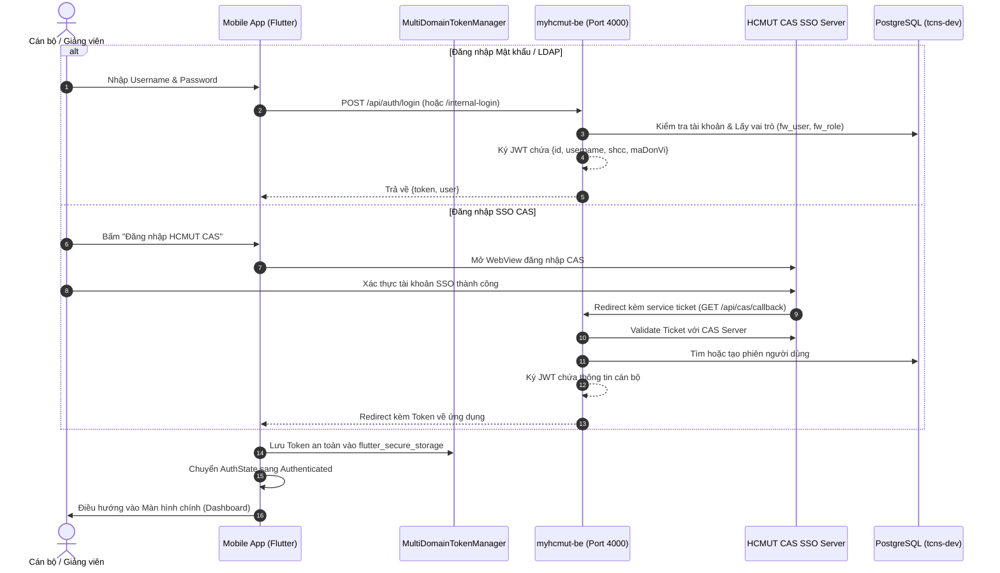
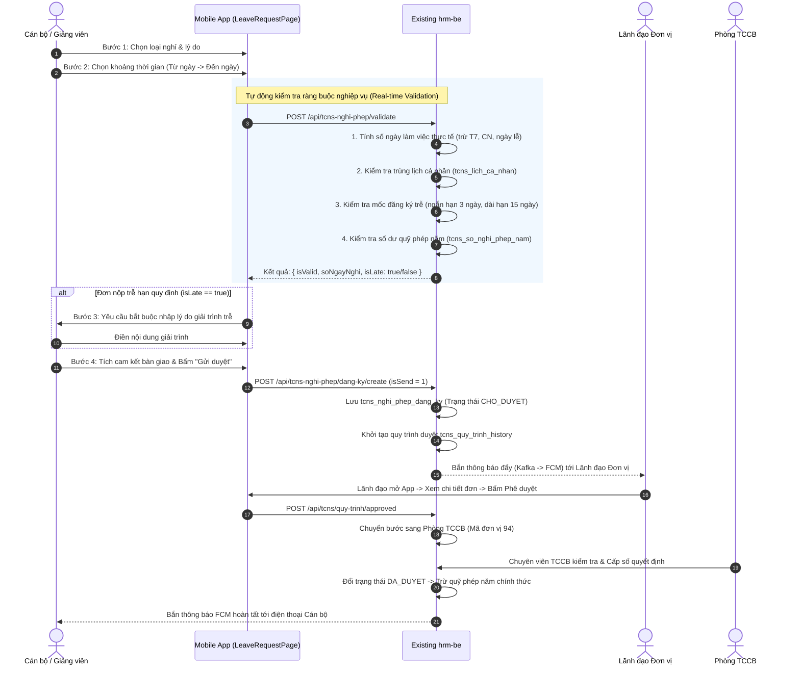
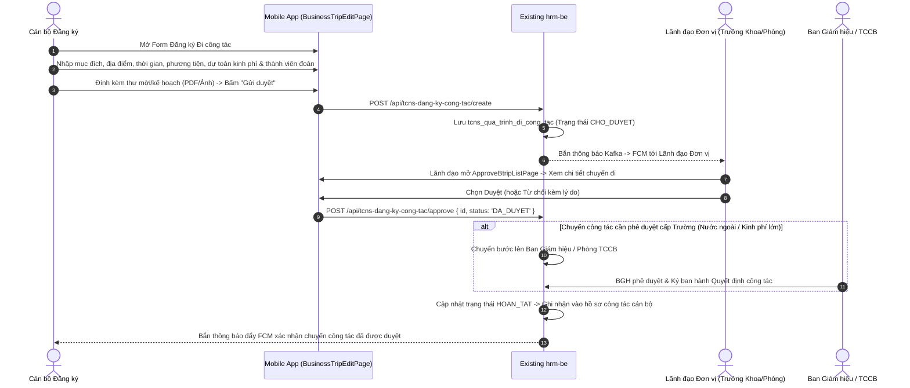
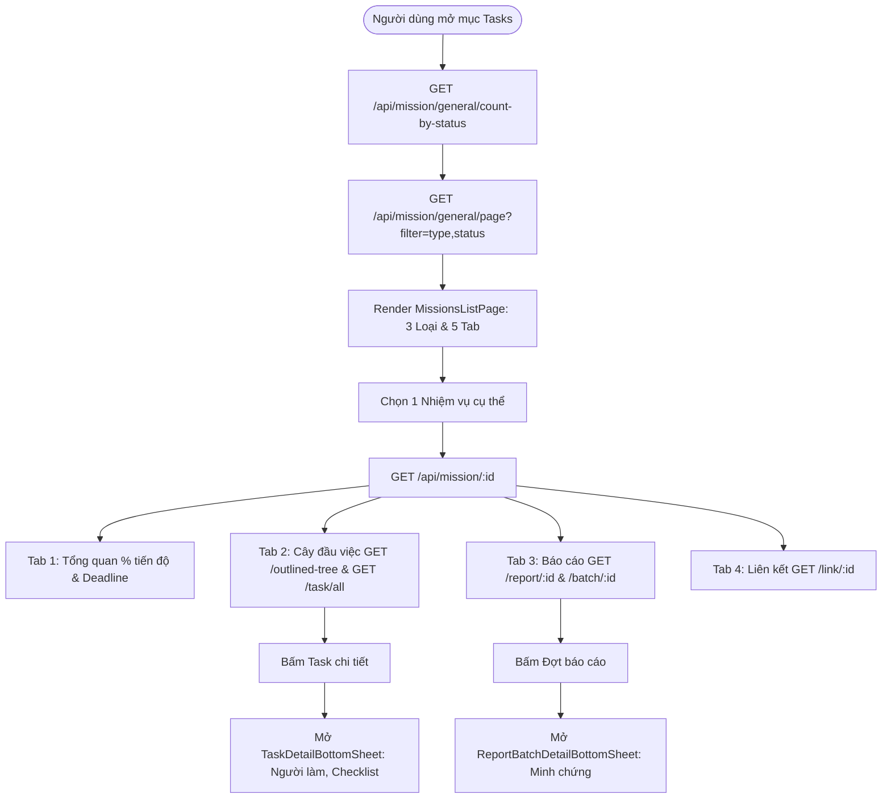
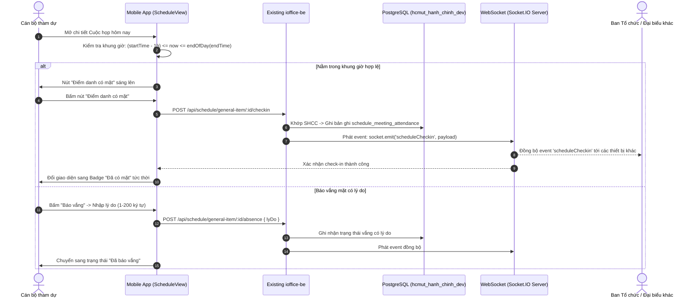

# ĐẶC TẢ VẬN HÀNH VÀ CÁC LUỒNG HOẠT ĐỘNG HỆ THỐNG (SYSTEM OPERATION)

> **Mục tiêu tài liệu:** Giải thích chi tiết và trực quan cách thức vận hành thực tế từ thao tác của Người dùng trên Mobile App, truyền tải qua tầng Mạng (Network & API), xử lý nghiệp vụ tại Hệ thống Backend Hiện hữu của Nhà trường, truy xuất Cơ sở Dữ liệu, và phản hồi kết quả về ứng dụng di động.

---

## 1. Overall System Operation (Vận hành Tổng thể Hệ thống)

```text
[NGƯỜI DÙNG]
    │ 1. Thao tác trên giao diện Mobile (Bấm nút, điền form, chọn tab)
    ▼
[MOBILE UI LAYER (Flutter)]
    │ 2. Widget lắng nghe tương tác, trigger State Notifier
    ▼
[STATE MANAGEMENT (Riverpod 3)]
    │ 3. AsyncNotifier gọi phương thức trong Repository
    ▼
[REPOSITORY & NETWORK LAYER]
    │ 4. Dio Client gắn Token qua MultiDomainAuthInterceptor
    ▼ (HTTPS REST API / WebSocket WSS)
[EXISTING BACKEND SERVICES (Node.js / Express)]
    │ 5. Middleware giải mã JWT (Shared Secret) & Phân quyền RBAC
    │ 6. Controller & Business Services thực thi logic nghiệp vụ
    ▼ (SQL Query / Sequelize ORM)
[EXISTING DATABASE (PostgreSQL)]
    │ 7. Truy vấn, kiểm tra ràng buộc, lưu trữ bản ghi vào DB
    ▼
[BACKEND RESPONSE (JSON)]
    │ 8. Trả về mã HTTP Status (200, 201, 400, 401...) kèm JSON Payload
    ▼
[MOBILE MODEL & STATE UPDATE]
    │ 9. Deserialization từ JSON sang Freezed Immutable Models
    │ 10. Provider cập nhật State mới (AsyncData / AsyncError)
    ▼
[MOBILE UI RE-RENDER]
    │ 11. Giao diện tự động render lại dữ liệu mới cho Người dùng
    ▼
[NGƯỜI DÙNG NHẬN KẾT QUẢ]
```

---

## 2. Authentication Flow (Luồng Xác thực & Phân phối Token)

Hệ thống hỗ trợ 2 hình thức: Đăng nhập nội bộ (Mật khẩu/LDAP) và Đăng nhập tập trung qua cổng Single Sign-On (CAS SSO) của Trường ĐHBK.



---

## 3. Standard API Request Flow (Luồng Gửi & Xử lý Yêu cầu API Chuẩn)

Mỗi tương tác dữ liệu trên ứng dụng di động đều tuân thủ chặt chẽ kiến trúc phân lớp hướng luồng (Data Flow Pipeline):

```text
┌──────────────┐
│  Flutter UI  │ (1. Người dùng kích hoạt hành động, vd: Xem danh sách văn bản)
└──────┬───────┘
       │ ref.watch(incomingDocsListProvider)
       ▼
┌──────────────┐
│ Riverpod     │ (2. AsyncNotifier quản lý trạng thái: loading -> data / error)
│ Provider     │
└──────┬───────┘
       │ incomingDocRepository.getPage(page, size)
       ▼
┌──────────────┐
│ Repository   │ (3. Điều phối nguồn dữ liệu: Local Cache vs Remote API)
└──────┬───────┘
       │ iofficeDioClient.get('/api/e-office/van-ban-den-mobile/page/1/20')
       ▼
┌──────────────┐
│ Interceptor  │ (4. MultiDomainAuthInterceptor: Tự động trích xuất token_auth
│ Chain        │     gắn Header: 'Authorization: Bearer <token>')
└──────┬───────┘
       │ HTTPS REST Request
       ▼
┌──────────────┐
│ Existing     │ (5. ioffice-be nhận request:
│ Backend      │     • config/lib/session.ts giải mã JWT bằng AUTH_JWT_SECRET
│ Service      │     • eofficeVanBanDenMobile.controller.js kiểm tra quyền
│              │     • Sequelize ORM sinh câu lệnh SQL truy vấn DB)
└──────┬───────┘
       │ SQL Query
       ▼
┌──────────────┐
│ PostgreSQL   │ (6. hcmut_hanh_chinh_dev: SELECT * FROM van_ban_den_general ...)
└──────┬───────┘
       │ Database Records
       ▼
┌──────────────┐
│ Backend JSON │ (7. Backend đóng gói JSON: { page: { totalItems: 45, list: [...] } })
└──────┬───────┘
       │ HTTPS 200 OK Response
       ▼
┌──────────────┐
│ Model Parser │ (8. IncomingDocResponse.fromJson(...) chuyển thành Freezed DTO)
└──────┬───────┘
       │ List<IncomingDocModel>
       ▼
┌──────────────┐
│ UI Re-render │ (9. ListView.builder render danh sách thẻ văn bản mượt mà)
└──────────────┘
```

---

## 4. HRM Business Flows (Các Luồng Nghiệp vụ Nhân sự)

### 4.1. Luồng 1: Tra cứu & Đề xuất Thẩm định Chỉnh sửa Lý lịch Cán bộ
1. **Tra cứu hồ sơ**: Mobile gọi `GET /api/staff/ly-lich/mobile` $\rightarrow$ `hrm-be` truy vấn 11 bảng danh mục của `staff_ly_lich` $\rightarrow$ Trả về JSON $\rightarrow$ Mobile hiển thị 11 tab chi tiết (Thông tin cá nhân, Lương, Bằng cấp, Quá trình công tác...).
2. **Gửi đề xuất sửa**: Cán bộ sửa thông tin $\rightarrow$ đính kèm ảnh chụp minh chứng $\rightarrow$ Mobile gọi `POST /api/staff/ly-lich/request/mobile` $\rightarrow$ Backend lưu vào `staff_ly_lich_request` ở trạng thái `PENDING`.
3. **Thẩm định Diff**: Chuyên viên TCCB mở mục *Duyệt lý lịch* (`/hrm/profile-review`) $\rightarrow$ Mobile render màn hình `ApproveProfileDetailPage` hiển thị giao diện so sánh đối chiếu (Diff Card: Giá trị cũ màu đỏ, Giá trị mới màu xanh) $\rightarrow$ Chuyên viên bấm Duyệt (`PUT /api/staff/ly-lich/request/approved/:id`) $\rightarrow$ Backend cập nhật trực tiếp DB và bắn thông báo phản hồi.

### 4.2. Luồng 2: Đăng ký & Validate Nghỉ phép (4 bước Wizard)



### 4.3. Luồng 3: Đăng ký & Phê duyệt Chuyến Đi công tác (Business Trip Workflow)



---

## 5. iOffice Business Flows (Các Luồng Nghiệp vụ Văn phòng số)

1. **Tra cứu Văn bản đến**:
   - Mobile gọi `GET /api/e-office/van-ban-den-mobile/page/:page/:size` $\rightarrow$ `ioffice-be` lọc danh sách văn bản theo quyền cán bộ hoặc đơn vị.
   - Khi bấm vào văn bản $\rightarrow$ Mobile tải tệp đính kèm và render trực tiếp qua trình xem PDF tích hợp.
2. **Phân phối & Giao việc Chỉ đạo (Lãnh đạo Đơn vị)**:
   - Lãnh đạo mở văn bản đến $\rightarrow$ chọn cán bộ xử lý $\rightarrow$ nhập nội dung chỉ đạo và thời hạn hoàn thành $\rightarrow$ bấm *Phân phối*.
   - Mobile gọi `POST /api/e-office/van-ban-den/distribute` $\rightarrow$ `ioffice-be` lưu vào `van_ban_den_distribution` và gửi thông báo cho chuyên viên được phân công.
3. **Theo dõi Văn bản đi**:
   - Cán bộ tra cứu danh mục văn bản đi qua `GET /api/e-office/van-ban-di-mobile/page/:page/:size` để theo dõi tiến độ thẩm định, ký duyệt và phát hành.

---

## 6. Tasks & Missions Flow (Luồng Quản lý Nhiệm vụ & Công việc)



---

## 7. Schedule & Meeting Attendance Flow (Lịch họp & Điểm danh Thời gian thực)



---

## 8. Notification Flow (Luồng Xử lý Thông báo Đẩy Bất đồng bộ)

Cơ chế thông báo đẩy được thiết kế để **hoàn toàn không làm chậm (non-blocking)** các luồng xử lý nghiệp vụ chính:

```text
[1. NGHIỆP VỤ PHÁT SINH SỰ KIỆN]
   (Ví dụ: Lãnh đạo duyệt đơn nghỉ phép trên hrm-be)
   │
   ▼
[2. EVENT PRODUCER]
   hrm-be gọi Notification.send(data) -> Đẩy tin nhắn vào Kafka Topic: SEND_NOTIFY_SERVICE
   │ (Backend phản hồi HTTP 200 ngay cho Lãnh đạo trong vòng < 100ms)
   ▼
[3. APACHE KAFKA MESSAGE BROKER]
   Lưu trữ sự kiện bền vững trong Event Log phân tán
   │
   ▼
[4. NOTIFICATION CONSUMER (hrm-be)]
   SendNotificationServiceConsumer tiêu thụ thông điệp:
   • Ghi bản ghi vào bảng fw_notification và fw_notification_target
   • Truy vấn danh sách Device Tokens của người nhận từ fw_user_device_token
   │
   ▼
[5. FIREBASE ADMIN SDK]
   hrm-be gọi Firebase Admin Messaging API -> Gửi Push Notification tới máy chủ Google FCM
   │ (Tự động xóa token không hợp lệ nếu FCM trả về lỗi 'registration-token-not-registered')
   ▼
[6. GOOGLE FIREBASE CLOUD MESSAGING (FCM)]
   Đẩy gói tin thông báo qua Internet tới thiết bị di động
   │
   ▼
[7. MYHCMUT MOBILE APP]
   • FCM Service (fcm_service.dart) bắt sự kiện Background / Foreground
   • Cập nhật số huy hiệu Badge trên icon ứng dụng (app_badge_plus)
   • Người dùng nhấn vào thông báo -> NotificationRouteParser giải mã các trường metadata có cấu trúc
     (source, entityType, entityId, isApproval) hoặc fallback qua targetLink URL
   • GoRouter điều hướng thẳng tới màn hình chi tiết tương ứng (Deep Linking: /hrm/leave/:id, /ioffice/incoming-docs/:id, v.v.)
```

---

## 9. Error Handling & System Resilience (Xử lý Lỗi & Khả năng Chịu lỗi)

| Tình huống Lỗi | Cơ chế Xử lý của Ứng dụng Di động | Trải nghiệm Người dùng |
| :--- | :--- | :--- |
| **Mất kết nối mạng / Server Timeout** | `DioFactory` thiết lập `connectTimeout: 15s`, `receiveTimeout: 30s`. Bắt ngoại lệ `DioExceptionType.connectionTimeout`. | Hiển thị Banner/Snackbar thông báo *"Không thể kết nối máy chủ, vui lòng kiểm tra đường truyền"*, cung cấp nút Thử lại (Retry). |
| **Token hết hạn (HTTP 401 Unauthorized)** | `MultiDomainAuthInterceptor` bắt mã 401 $\rightarrow$ Gọi API refresh token ngầm $\rightarrow$ Phát lại request gốc tự động (Silent Refresh). | Người dùng tiếp tục thao tác bình thường mà không bị gián đoạn hay văng ra ngoài. |
| **Phiên làm việc bị thu hồi / Hết hạn hoàn toàn** | Nếu Refresh Token thất bại $\rightarrow$ Hủy sạch Secure Storage $\rightarrow$ Reset toàn bộ Riverpod Providers. | Điều hướng an toàn về màn hình Đăng nhập kèm thông báo *"Phiên làm việc đã hết hạn"*. |
| **Lỗi Vi phạm Ràng buộc (HTTP 400 Bad Request)** | Trích xuất thông báo lỗi từ JSON trả về (`error.response.data.message`). | Hiển thị hộp thoại cảnh báo chính xác (ví dụ: *"Trùng lịch với chuyến công tác số 123"*). |
| **Không có quyền truy cập (HTTP 403 Forbidden)** | `GoRouter` Dynamic Route Guards chặn ngay từ lúc điều hướng hoặc Interceptor hiển thị cảnh báo. | Thông báo *"Bạn không có quyền thực hiện chức năng này"*. |
