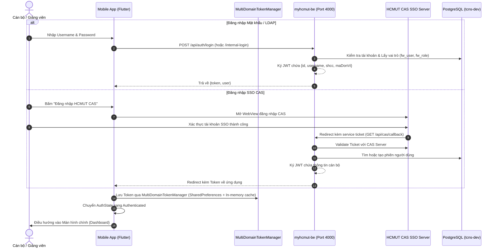
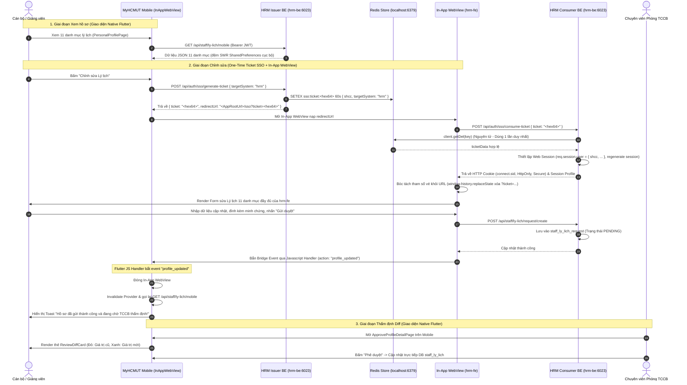
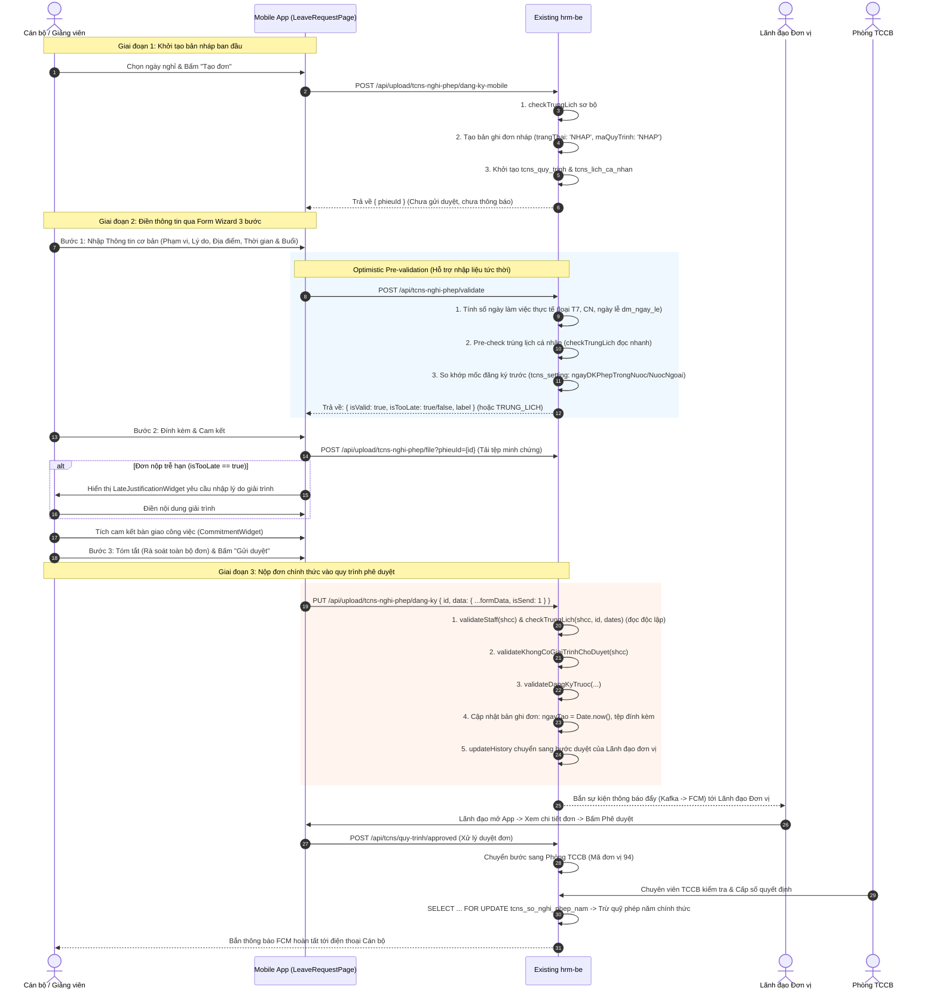
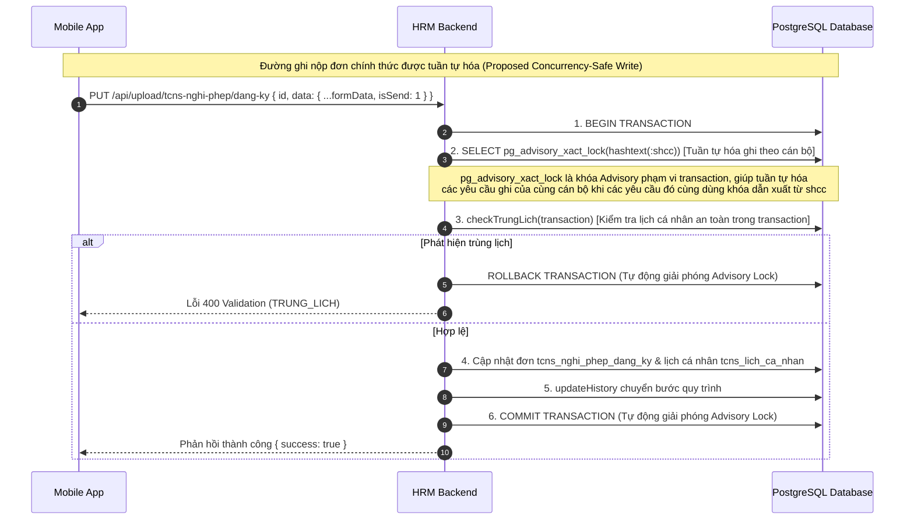
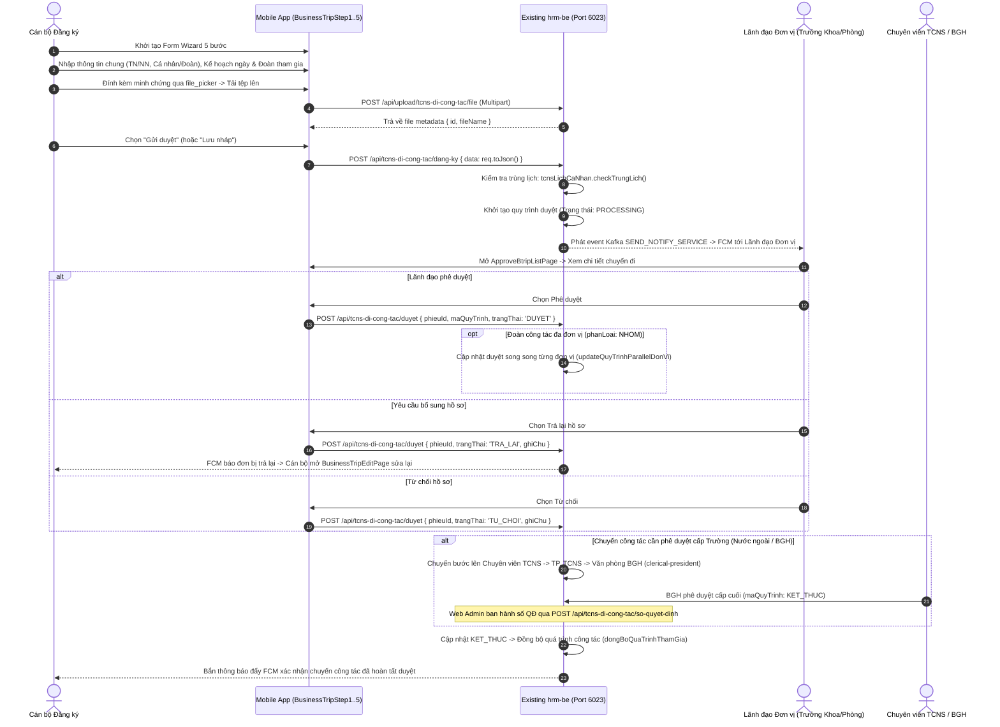
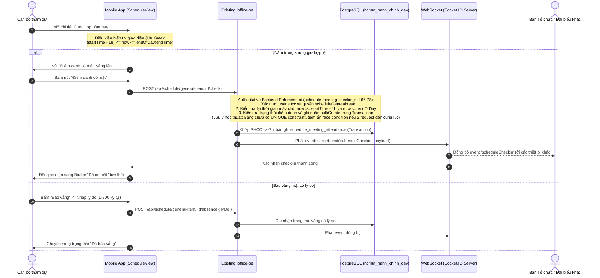

# ĐẶC TẢ VẬN HÀNH VÀ CÁC LUỒNG HOẠT ĐỘNG HỆ THỐNG (SYSTEM OPERATION)

> **Mục tiêu tài liệu:** Giải thích chi tiết và trực quan cách thức vận hành thực tế từ thao tác của Người dùng trên Mobile App, truyền tải qua tầng Mạng (Network & API), xử lý nghiệp vụ tại Hệ thống Backend Hiện hữu của Nhà trường, truy xuất Cơ sở Dữ liệu, và phản hồi kết quả về ứng dụng di động.

---

## 1. Cross-Project Interaction Topology (Bản đồ Tương tác Đa Dự án Tổng thể)

Hệ sinh thái đề tài bao gồm nhiều thành phần phối hợp chặt chẽ giữa ứng dụng di động (`myhcmut-mobile`), các dịch vụ backend chuyên biệt (`myhcmut-be`, `hrm-be`, `ioffice-be`), các giao diện web mở rộng (`hrm-fe`, `ioffice-fe`), cùng cụm cơ sở dữ liệu và hạ tầng thông điệp:

```text
                                  ┌───────────────────────────┐
                                  │   HCMUT CAS / LDAP SSO    │
                                  └─────────────┬─────────────┘
                                                │ (1. Xác thực CAS)
                                                ▼
                                  ┌───────────────────────────┐
                                  │  myhcmut-be (Port 4000)   │
                                  │      (Auth Gateway)       │
                                  └─────────────┬─────────────┘
                                                │ (2. Cấp Shared JWT Token)
                                                ▼
 ┌────────────────────────────────────────────────────────────────────────────────────────────────────────┐
 │                                      FLUTTER MOBILE CLIENT (myhcmut-mobile)                            │
 │  • Dio Client + MultiDomainAuthInterceptor (Gắn Token tự động)                                         │
 │  • Riverpod 3 State Management + Freezed Immutable Models                                              │
 │  • In-App WebView (flutter_inappwebview) + JS Bridge                                                  │
 │  • WebSocket Socket.IO Client + Firebase Cloud Messaging (FCM Handler)                                 │
 └───────┬───────────────────────────────┬───────────────────────────────┬────────────────────────┬───────┘
         │                               │                               │                        │
         │ (3. HTTPS REST:               │ (4. One-Time SSO Ticket:      │ (5. In-App WebView:    │ (6. HTTPS REST & WSS:
         │     Tra cứu 11 mục lý lịch,   │     POST /generate-ticket,    │     GET /sso?ticket    │     Văn bản đến/đi,
         │     Validate nghỉ phép đa     │     TTL 60s trên Redis)       │     Nhúng hrm-fe       │     Nhiệm vụ outlined-tree,
         │     giai đoạn, duyệt đơn)     │                               │     JS Bridge: update) │     Điểm danh WebSocket)
         │                               │                               │                        │
         ▼                               ▼                               ▼                        ▼
 ┌───────────────────────────────────────────────┐               ┌───────────────┐        ┌───────────────┐
 │             hrm-be (Port 6023)                │               │    hrm-fe     │        │  ioffice-be   │
 │   • Phát hành vé SSO HRM (Ticket Issuer)      │◄──────────────┤  (Port 6022)  │        │  (Port 3001)  │
 │   • HRM Core API & Sổ phép năm                │ (Consume      │ (React/Vite)  │        │ • Docs/Tasks  │
 │   • Push Notification Service Consumer        │  Ticket SSO)  │ Form 11 mục   │        │ • Socket.IO   │
 └───────┬───────────────────────┬───────────────┘               └───────────────┘        └───────┬───────┘
         │                       │                                                                │
         │ (SETEX / getDel)      │ (Publish Event: SEND_NOTIFY_SERVICE)                           │ (Publish Event)
         ▼                       ▼                                                                ▼
 ┌───────────────┐       ┌────────────────────────────────────────────────────────────────────────────────┐
 │     REDIS     │       │                          APACHE KAFKA MESSAGE BROKER                           │
 │  (Port 6379)  │       └───────────────────────────────────────┬────────────────────────────────────────┘
 │ • SSO Tickets │                                               │
 │ • Web Sessions│                                               │ (Consume thông điệp thông báo)
 └───────────────┘                                               ▼
                                                 ┌───────────────────────────────┐
 ┌───────────────────────────────┐               │     FIREBASE CLOUD MESSAGING  │
 │     POSTGRESQL DATABASES      │               │         (Google FCM)          │
 │ • tcns-dev (Nhân sự)          │               └───────────────┬───────────────┘
 │ • hcmut_hanh_chinh (Văn phòng)│                               │ (Push Notification & Deep Linking)
 └───────────────────────────────┘                               ▼
                                                 ┌───────────────────────────────┐
                                                 │   MYHCMUT MOBILE (Device)     │
                                                 └───────────────────────────────┘
```

### Bảng Ma trận Giao thức và Kênh Tương tác Giữa các Dự án

| Cặp Thành phần Tương tác | Giao thức / Kênh | Dữ liệu / Thao tác Chính | Mục đích Nghiệp vụ |
| :--- | :--- | :--- | :--- |
| `Mobile` $\rightarrow$ `myhcmut-be` | HTTPS REST | `POST /api/auth/login` | Xác thực đăng nhập CAS/LDAP, nhận Shared JWT Token. |
| `Mobile` $\rightarrow$ `hrm-be` | HTTPS REST (Bearer JWT) | `GET /api/staff/ly-lich/mobile`<br>`POST /api/tcns-nghi-phep/validate`<br>`POST /api/upload/tcns-nghi-phep/dang-ky-mobile` | Tra cứu hồ sơ lý lịch native; kiểm tra ràng buộc nghỉ phép đa giai đoạn; nộp đơn nghỉ phép mobile; phê duyệt đơn. |
| `Mobile` $\rightarrow$ `hrm-be` (SSO) | HTTPS REST (Bearer JWT) | `POST /api/auth/sso/generate-ticket`<br>Payload: `{ targetSystem: 'hrm' }` | Yêu cầu sinh vé One-Time Ticket SSO (TTL 60s, hex 64 ký tự) lưu trữ nguyên tử trên Redis. |
| `Mobile` $\leftrightarrow$ `hrm-fe` | In-App WebView + JS Bridge | URL: `https://.../sso?ticket=<hex64>`<br>Bridge Event: `{ action: 'profile_updated' }` | Mở giao diện Web chỉnh sửa 11 danh mục lý lịch; nhận sự kiện lưu thành công để đóng WebView và refresh Mobile State. |
| `hrm-fe` $\rightarrow$ `hrm-be` | HTTPS REST | `POST /api/auth/sso/consume-ticket`<br>Payload: `{ ticket }` | Web FE gửi vé để BE xác thực qua Redis `getDel` và thiết lập Web Session Cookie (`connect.sid`, HttpOnly, Secure). |
| `Mobile` $\rightarrow$ `ioffice-be` | HTTPS REST (Bearer JWT) | `GET /api/e-office/van-ban-den-mobile/...`<br>`GET /api/mission/general/...` | Tra cứu văn bản đến/đi, tải tệp PDF; truy vấn tiến độ nhiệm vụ và cây đầu việc `outlined-tree`. |
| `Mobile` $\leftrightarrow$ `ioffice-be` | WebSocket (WSS / Socket.IO) | Event: `scheduleCheckin`, `absence` | Điểm danh cuộc họp thời gian thực trong khung giờ mở trước 1h; backend kiểm tra authoritative quyền và giờ; đồng bộ trạng thái. |
| `hrm-be` / `ioffice-be` $\rightarrow$ `Kafka` | TCP (Kafka Protocol) | Topic: `SEND_NOTIFY_SERVICE` | Đẩy sự kiện thông báo bất đồng bộ khi có đơn mới, duyệt đơn, hoặc giao nhiệm vụ (non-blocking). |
| `hrm-be (Consumer)` $\rightarrow$ `FCM` $\rightarrow$ `Mobile` | HTTPS REST (FCM v1) $\rightarrow$ APNs/FCM Push | Payload: 4 trường Metadata (`source`, `entityType`, `entityId`, `isApproval`) | Chuyển phát thông báo đẩy tới thiết bị di động, kích hoạt Deep Linking mở đúng màn hình chi tiết. |

---

## 2. Overall Layered Operation (Vận hành Phân lớp Từng Request Chuẩn)

```text
[NGƯỜI DÙNG]
    │ 1. Thao tác trên giao diện Mobile (Bấm nút, điền form, chọn tab)
    ▼
[MOBILE UI LAYER (Flutter)]
    │ 2. Widget lắng nghe tương tác, trigger State Notifier
    ▼
[STATE MANAGEMENT (Riverpod 3)]
    │ 3. AsyncNotifier gọi phương thức trong Repository
    ▼
[REPOSITORY & NETWORK LAYER]
    │ 4. Dio Client gắn Token qua MultiDomainAuthInterceptor
    ▼ (HTTPS REST API / WebSocket WSS)
[EXISTING BACKEND SERVICES (Node.js / Express)]
    │ 5. Middleware giải mã JWT (Shared Secret) & Phân quyền RBAC
    │ 6. Controller & Business Services thực thi logic nghiệp vụ
    ▼ (SQL Query / Sequelize ORM)
[EXISTING DATABASE (PostgreSQL)]
    │ 7. Truy vấn, kiểm tra ràng buộc, lưu trữ bản ghi vào DB
    ▼
[BACKEND RESPONSE (JSON)]
    │ 8. Trả về mã HTTP Status (200, 201, 400, 401...) kèm JSON Payload
    ▼
[MOBILE MODEL & STATE UPDATE]
    │ 9. Deserialization từ JSON sang Freezed Immutable Models
    │ 10. Provider cập nhật State mới (AsyncData / AsyncError)
    ▼
[MOBILE UI RE-RENDER]
    │ 11. Giao diện tự động render lại dữ liệu mới cho Người dùng
    ▼
[NGƯỜI DÙNG NHẬN KẾT QUẢ]
```

---

## 3. Authentication Flow (Luồng Xác thực & Phân phối Token)

Hệ thống hỗ trợ 2 hình thức: Đăng nhập nội bộ (Mật khẩu/LDAP) và Đăng nhập tập trung qua cổng Single Sign-On (CAS SSO) của Trường ĐHBK.



---

## 4. Standard API Request Flow (Luồng Gửi & Xử lý Yêu cầu API Chuẩn)

Mỗi tương tác dữ liệu trên ứng dụng di động đều tuân thủ chặt chẽ kiến trúc phân lớp hướng luồng (Data Flow Pipeline):

```text
┌──────────────┐
│  Flutter UI  │ (1. Người dùng kích hoạt hành động, vd: Xem danh sách văn bản)
└──────┬───────┘
       │ ref.watch(incomingDocsListProvider)
       ▼
┌──────────────┐
│ Riverpod     │ (2. AsyncNotifier quản lý trạng thái: loading -> data / error)
│ Provider     │
└──────┬───────┘
       │ incomingDocRepository.getPage(page, size)
       ▼
┌──────────────┐
│ Repository   │ (3. Điều phối nguồn dữ liệu: Local Cache vs Remote API)
└──────┬───────┘
       │ iofficeDioClient.get('/api/e-office/van-ban-den-mobile/page/1/20')
       ▼
┌──────────────┐
│ Interceptor  │ (4. MultiDomainAuthInterceptor: Tự động trích xuất token_auth
│ Chain        │     gắn Header: 'Authorization: Bearer <token>')
└──────┬───────┘
       │ HTTPS REST Request
       ▼
┌──────────────┐
│ Existing     │ (5. ioffice-be nhận request:
│ Backend      │     • config/lib/session.ts giải mã JWT bằng AUTH_JWT_SECRET
│ Service      │     • eofficeVanBanDenMobile.controller.js kiểm tra quyền
│              │     • Sequelize ORM sinh câu lệnh SQL truy vấn DB)
└──────┬───────┘
       │ SQL Query
       ▼
┌──────────────┐
│ PostgreSQL   │ (6. hcmut_hanh_chinh_dev: SELECT * FROM van_ban_den_general ...)
└──────┬───────┘
       │ Database Records
       ▼
┌──────────────┐
│ Backend JSON │ (7. Backend đóng gói JSON: { page: { totalItems: 45, list: [...] } })
└──────┬───────┘
       │ HTTPS 200 OK Response
       ▼
┌──────────────┐
│ Model Parser │ (8. IncomingDocResponse.fromJson(...) chuyển thành Freezed DTO)
└──────┬───────┘
       │ List<IncomingDocModel>
       ▼
┌──────────────┐
│ UI Re-render │ (9. ListView.builder render danh sách thẻ văn bản mượt mà)
└──────────────┘
```
1. **Giao diện (View/Screen)**: Lắng nghe trạng thái từ Riverpod Provider (`ref.watch`).
2. **Quản trị trạng thái (StateNotifier/AsyncNotifier)**: Kích hoạt Repository để lấy hoặc cập nhật dữ liệu.
3. **Kho dữ liệu (Repository)**: Kiểm tra bộ nhớ đệm cục bộ (Cache-First qua SharedPreferences đối với Hồ sơ cán bộ SWR, hoặc SQLite đối với 47 danh mục dùng chung Master Data), nếu cần sẽ gọi tầng Remote Data Source.
4. **Tầng mạng (Network/Dio)**: Gửi HTTP Request qua `MultiDomainAuthInterceptor`, tự động gắn Bearer Token và giải mã JSON phản hồi.

---

## 5. WebApp Hybrid Flow (Luồng Tích hợp Biểu mẫu WebApp SSO)

Nhằm tối ưu hóa nguồn lực và tránh việc phải xây dựng lại các biểu mẫu nhập liệu 11 danh mục lý lịch phức tạp, hệ thống ứng dụng giải pháp **WebApp Hybrid với Cơ chế Chuyển tiếp Xác thực bằng Vé dùng một lần (One-Time Ticket SSO)**:



---

## 6. Business Workflows & Concurrency Control (Các Luồng Nghiệp vụ Trọng tâm & Thiết kế Kiểm soát Tương tranh)

### 6.1. Luồng 1: Đăng ký & Kiểm tra Điều kiện Nghỉ phép (Form Wizard 3 bước)

#### 6.1.1. Luồng Vận hành Hiện tại tại Commit Bảo vệ (`hrm-be:15a6e321`, `myhcmut-mobile:161d5bb8`)



#### 6.1.2. Thiết kế Cải tiến Kiểm soát Tương tranh Đề xuất (Proposed Two-Tier Concurrency Control Design - Chương 5)

> [!IMPORTANT]
> **Định vị Học thuật:** Sơ đồ dưới đây là **thiết kế kiến trúc đề xuất** (trình bày trong Chương 5) nhằm kiểm soát điểm nghẽn *Check-then-Act Race Condition* trên các đường ghi cùng tuân thủ giao thức khóa đối với hàm `checkTrungLich`. Giải pháp này chưa kích hoạt tại commit bảo vệ và được đưa vào lộ trình triển khai ở Chương 7.



### 6.2. Luồng 2: Đăng ký & Phê duyệt Chuyến Đi công tác (Business Trip Workflow)
*Ghi chú: Phân hệ thuộc phạm vi đề tài nhóm (`TEAM_SCOPE`) do sinh viên Tống Duy Khang phụ trách chính (`OUT_OF_CHINH_SCOPE`), kế thừa hạ tầng mạng và Design System chung. Chi tiết kiểm toán tại `docs/06A_CONTEXT_PACK_BUSINESS_TRIP.md`.*



> [!NOTE]
> **Đặc tính kỹ thuật Duyệt hàng loạt (`POST /api/tcns/quy-trinh/approved`) & Tác động phía Mobile:**
> - Backend hiện hữu duyệt qua từng mã phiếu bằng vòng lặp `for (const id of ids)` không có transaction chung cho toàn bộ batch, hoạt động theo cơ chế **Per-Item Commit (Fail-Stop)**: Các đơn duyệt thành công trước đó đã được commit độc lập vào CSDL. Nếu gặp lỗi ở đơn nào thì tiến trình ném ngoại lệ dừng lại.
> - **Cách ứng dụng Mobile xử lý:** Khi gặp mã lỗi từ API duyệt hàng loạt, Mobile không được xem toàn bộ batch là thành công; giao diện hiển thị thông báo lỗi và tự động kích hoạt làm mới (invalidate / refetch) danh sách để đồng bộ trạng thái thực tế của từng đơn từ CSDL, ngăn người dùng bấm gửi duyệt lại các đơn đã thành công trước đó.

---

## 7. iOffice Business Flows (Các Luồng Nghiệp vụ Văn phòng số)

1. **Tra cứu Văn bản đến**:
   - Mobile gọi `GET /api/e-office/van-ban-den-mobile/page/:page/:size` $\rightarrow$ `ioffice-be` lọc danh sách văn bản theo quyền cán bộ hoặc đơn vị.
   - Khi bấm vào văn bản $\rightarrow$ Mobile tải tệp đính kèm và render trực tiếp qua trình xem PDF tích hợp.
2. **Phân phối & Giao việc Chỉ đạo (Lãnh đạo Đơn vị)**:
   - Lãnh đạo mở văn bản đến $\rightarrow$ chọn cán bộ xử lý $\rightarrow$ nhập nội dung chỉ đạo và thời hạn hoàn thành $\rightarrow$ bấm *Phân phối*.
   - Mobile gọi `POST /api/e-office/van-ban-den/distribute` $\rightarrow$ `ioffice-be` lưu vào `van_ban_den_distribution` và gửi thông báo cho chuyên viên được phân công.
3. **Theo dõi Văn bản đi**:
   - Cán bộ tra cứu danh mục văn bản đi qua `GET /api/e-office/van-ban-di-mobile/page/:page/:size` để theo dõi tiến độ thẩm định, ký duyệt và phát hành.

---

## 8. Tasks & Missions Flow (Luồng Quản lý Nhiệm vụ & Công việc)
*Ghi chú: Phân hệ do sinh viên Tống Duy Khang phụ trách chính (`OUT_OF_CHINH_SCOPE` / `TEAM_SCOPE`); sinh viên Vũ Xuân Chính đóng vai trò tái cấu trúc giao diện theo Design Tokens và tối ưu hóa cuộn mượt mà.*


---

## 9. Schedule & Meeting Attendance Flow (Lịch họp & Điểm danh Thời gian thực)



---

## 10. Notification Flow (Luồng Xử lý Thông báo Đẩy Bất đồng bộ)

Cơ chế thông báo đẩy được thiết kế theo mô hình **phân tách bất đồng bộ (decoupled asynchronous publishing)** để không làm nghẽn tiến trình xử lý nghiệp vụ chính:

```text
[1. NGHIỆP VỤ PHÁT SINH SỰ KIỆN]
   (Ví dụ: Lãnh đạo duyệt đơn nghỉ phép trên hrm-be)
   │
   ▼
[2. EVENT PRODUCER]
   hrm-be gọi Notification.send(data) -> Đẩy tin nhắn vào Kafka Topic: SEND_NOTIFY_SERVICE
   │ (Tiến trình ghi DB nghiệp vụ hoàn tất độc lập; Producer gửi bất đồng bộ qua kafkajs)
   ▼
[3. APACHE KAFKA MESSAGE BROKER]
   Lưu trữ sự kiện trong Event Log phân tán
   │
   ▼
[4. NOTIFICATION CONSUMER (hrm-be)]
   SendNotificationServiceConsumer tiêu thụ thông điệp:
   • Ghi bản ghi vào bảng fw_notification và fw_notification_target
   • Truy vấn danh sách Device Tokens của người nhận từ fw_user_device_token
   │
   ▼
[5. FIREBASE ADMIN SDK]
   hrm-be gọi Firebase Admin Messaging API -> Gửi Push Notification tới máy chủ Google FCM
   │ (Tự động xóa token không hợp lệ nếu FCM trả về lỗi 'registration-token-not-registered')
   ▼
[6. GOOGLE FIREBASE CLOUD MESSAGING (FCM)]
   Đẩy gói tin thông báo qua Internet tới thiết bị di động
   │
   ▼
[7. MYHCMUT MOBILE APP]
   • FCM Service (fcm_service.dart) bắt sự kiện Background / Foreground
   • Cập nhật số huy hiệu Badge trên icon ứng dụng (app_badge_plus; phụ thuộc vào launcher OEM trên Android)
   • Người dùng nhấn vào thông báo -> NotificationRouteParser giải mã các trường metadata có cấu trúc
     (source, entityType, entityId, isApproval) hoặc fallback qua targetLink URL
   • GoRouter điều hướng thẳng tới màn hình chi tiết tương ứng (Deep Linking: /hrm/leave/:id, /ioffice/incoming-docs/:id, v.v.)
```

> [!NOTE]
> **Đặc tính kỹ thuật và đánh đổi (Trade-offs):**
> 1. **Mô hình gửi Producer:** Nghiệp vụ PostgreSQL commit trước, sau đó Producer mới bắn Kafka qua `kafkajs` (cấu hình retry 5 lần, exponential backoff, in-memory queue). Đây là mô hình bất đồng bộ tách rời nhằm bảo đảm thời gian phản hồi API nghiệp vụ, chấp nhận đánh đổi rằng nếu Broker/Node crash ngay giữa lúc commit DB và gửi message thì thông báo có thể bị thất lạc (chưa cài đặt Transactional Outbox pattern).
> 2. **Xử lý trùng lặp Consumer:** Thông điệp chưa gắn `eventId` mang tính duy nhất toàn cục; khi Kafka consumer rebalance hoặc reprocess partition có thể dẫn tới thông báo lặp lại (at-least-once delivery).
> 3. **Dọn dẹp Dead Token:** Consumer tự động bắt lỗi `registration-token-not-registered` từ Google FCM để xóa token vô hiệu khỏi bảng `fw_user_device_token`.

---

## 11. Error Handling & System Resilience (Xử lý Lỗi & Khả năng Chịu lỗi)

| Tình huống Lỗi | Cơ chế Xử lý của Ứng dụng Di động | Trải nghiệm Người dùng |
| :--- | :--- | :--- |
| **Mất kết nối mạng / Server Timeout** | `DioFactory` thiết lập `connectTimeout: 15s`, `receiveTimeout: 30s`. Bắt ngoại lệ `DioExceptionType.connectionTimeout`. | Hiển thị Banner/Snackbar thông báo *"Không thể kết nối máy chủ, vui lòng kiểm tra đường truyền"*, cung cấp nút Thử lại (Retry). |
| **Token hết hạn (HTTP 401 Unauthorized)** | `MultiDomainAuthInterceptor` bắt mã 401 $\rightarrow$ Gọi API refresh token ngầm $\rightarrow$ Phát lại request gốc tự động (Silent Refresh). | Người dùng tiếp tục thao tác bình thường mà không bị gián đoạn hay văng ra ngoài. |
| **Phiên làm việc bị thu hồi / Hết hạn hoàn toàn** | Nếu Refresh Token thất bại $\rightarrow$ Hủy sạch bộ nhớ `SharedPreferences` và in-memory cache $\rightarrow$ Reset toàn bộ Riverpod Providers. | Điều hướng an toàn về màn hình Đăng nhập kèm thông báo *"Phiên làm việc đã hết hạn"*. |
| **Lỗi Vi phạm Ràng buộc (HTTP 400 Bad Request)** | Trích xuất thông báo lỗi từ JSON trả về (`error.response.data.message`). | Hiển thị hộp thoại cảnh báo chính xác (ví dụ: *"Trùng lịch với chuyến công tác số 123"*). |
| **Không có quyền truy cập (HTTP 403 Forbidden)** | `GoRouter` Dynamic Route Guards chặn ngay từ lúc điều hướng hoặc Interceptor hiển thị cảnh báo. | Thông báo *"Bạn không có quyền thực hiện chức năng này"*. |
