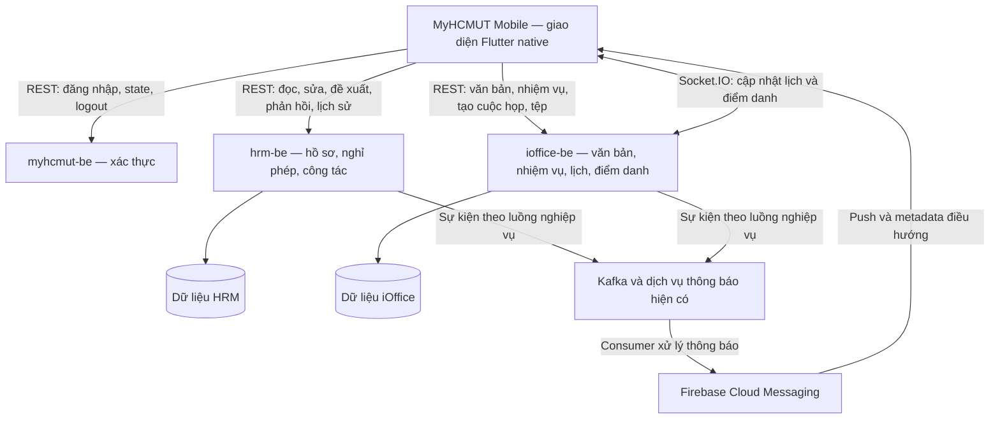
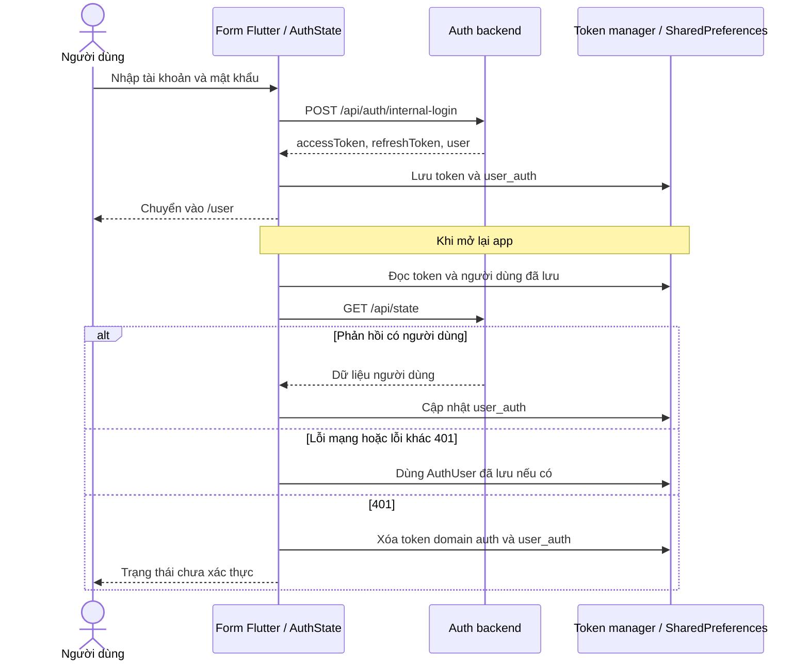
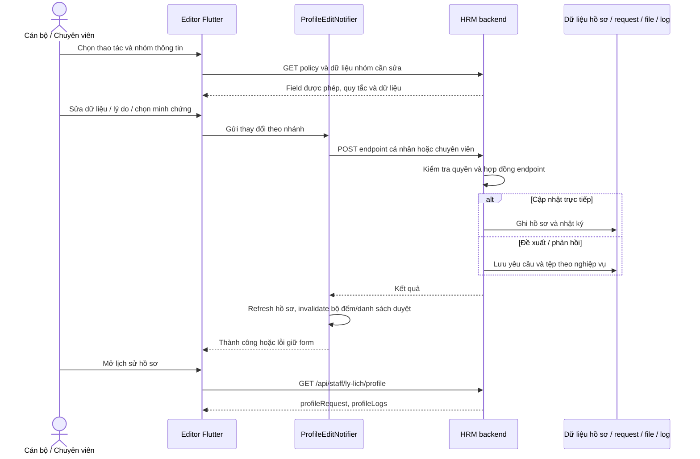
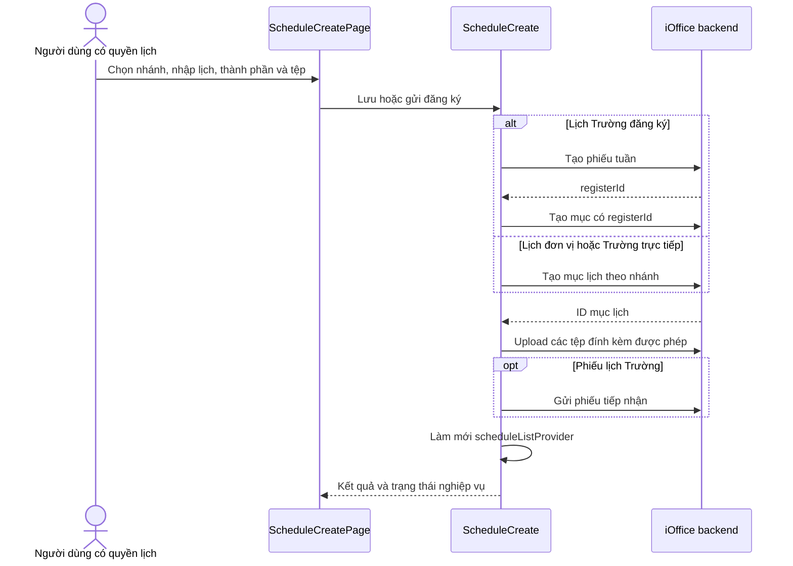
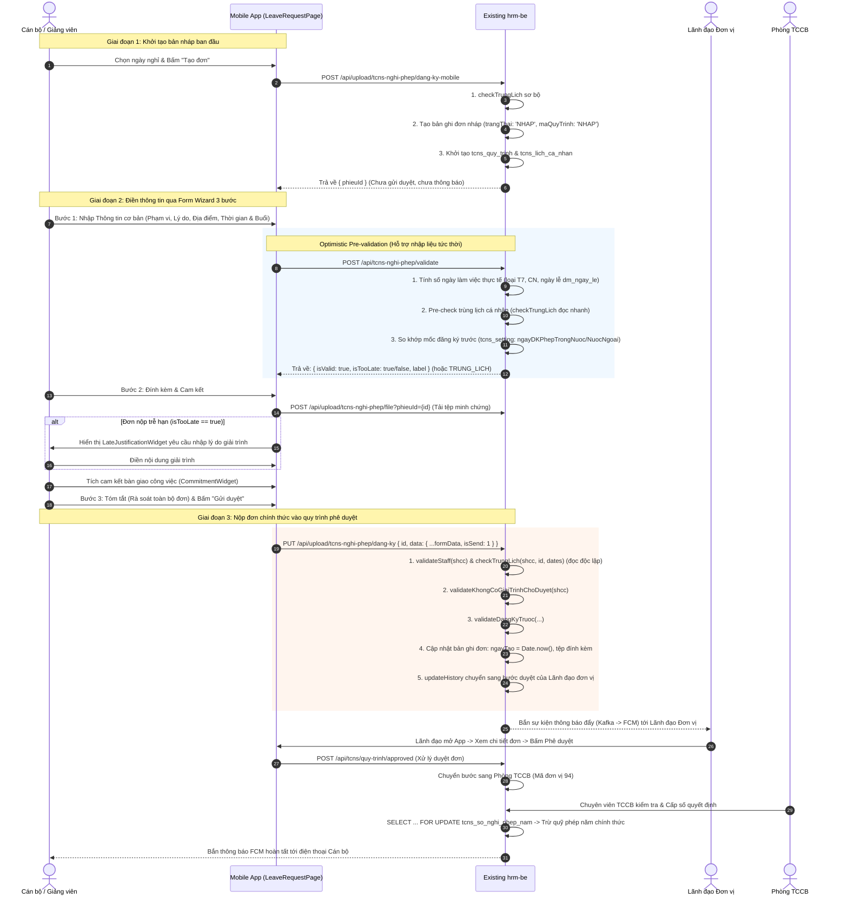
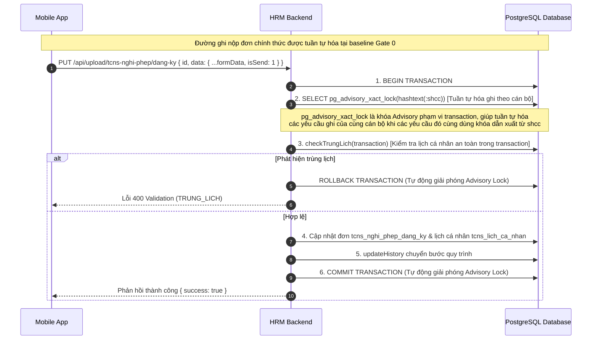
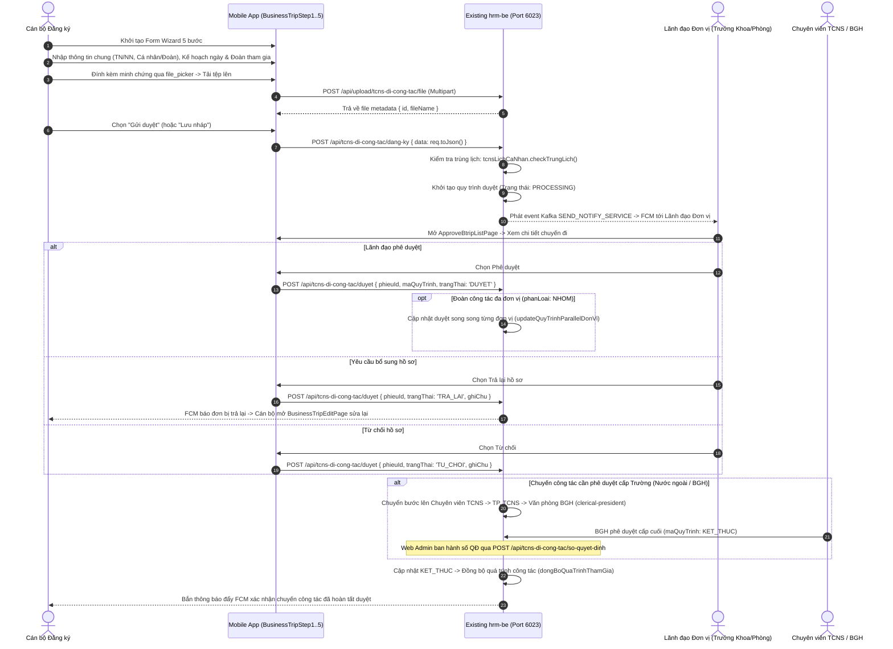
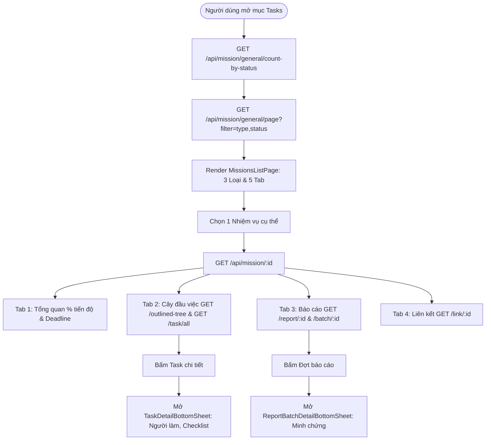
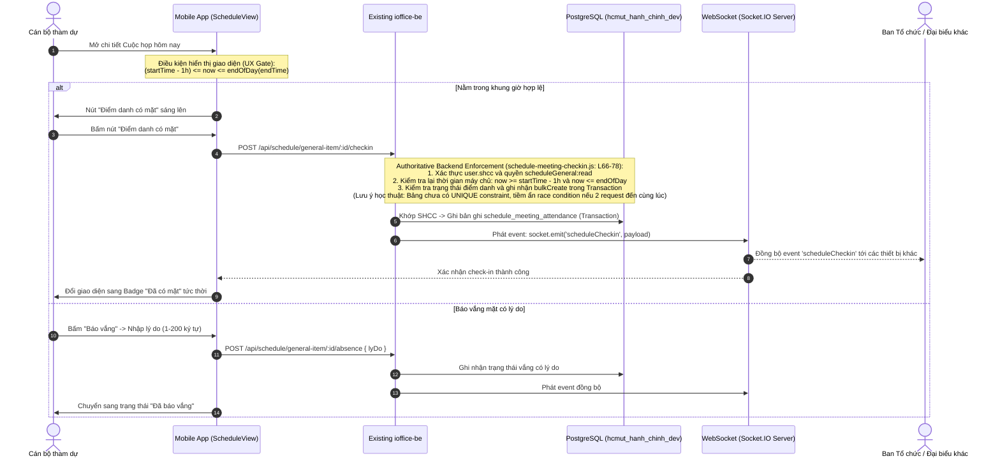

# ĐẶC TẢ VẬN HÀNH VÀ CÁC LUỒNG HOẠT ĐỘNG HỆ THỐNG (SYSTEM OPERATION)

> **Mục tiêu tài liệu:** Giải thích chi tiết và trực quan cách thức vận hành thực tế từ thao tác của Người dùng trên Mobile App, truyền tải qua tầng Mạng (Network & API), xử lý nghiệp vụ tại Hệ thống Backend Hiện hữu của Nhà trường, truy xuất Cơ sở Dữ liệu, và phản hồi kết quả về ứng dụng di động.
>
> **Ranh giới bằng chứng:** Nội dung vận hành được đối chiếu với source snapshot hiện hành trong `13_CURRENT_SOURCE_SNAPSHOT.md`; Gate 0 chỉ là mốc lịch sử. Kết quả kiểm thử chỉ là số liệu Gate 0 đã ghi nhận cho đến khi có log tái lập sạch, theo `12_BASELINE_REPRODUCIBILITY_AUDIT.md`.

> **Đối chiếu 01/10/2026:** Hồ sơ được nhập/sửa/gửi phản hồi bằng Flutter native; lịch tổng hợp hỗ trợ tạo cuộc họp native. Đây là luồng chức năng dùng để viết lại báo cáo, thay cho Mobile → WebView → HRM Web. Nguồn và giới hạn: [13_CURRENT_SOURCE_SNAPSHOT.md](13_CURRENT_SOURCE_SNAPSHOT.md). Mã SSO/WebView cũ còn trong repository được ghi riêng như trạng thái mã cũ, không phải luồng hồ sơ hiện hành.

---

## 1. Tương tác đa dự án theo phạm vi native hiện hành


```mermaid
flowchart TB
    Mobile[MyHCMUT Mobile — giao diện Flutter native]
    Auth[myhcmut-be — xác thực]
    HRM[hrm-be — hồ sơ, nghỉ phép, công tác]
    Office[ioffice-be — văn bản, nhiệm vụ, lịch, điểm danh]
    HRMDB[(Dữ liệu HRM)]
    OfficeDB[(Dữ liệu iOffice)]
    Kafka[Kafka và dịch vụ thông báo hiện có]
    FCM[Firebase Cloud Messaging]
    Mobile -->|REST: đăng nhập, state, logout| Auth
    Mobile -->|REST: đọc, sửa, đề xuất, phản hồi, lịch sử| HRM
    Mobile -->|REST: văn bản, nhiệm vụ, tạo cuộc họp, tệp| Office
    Mobile <-->|Socket.IO: cập nhật lịch và điểm danh| Office
    HRM --> HRMDB
    Office --> OfficeDB
    HRM -->|Sự kiện theo luồng nghiệp vụ| Kafka
    Office -->|Sự kiện theo luồng nghiệp vụ| Kafka
    Kafka -->|Consumer xử lý thông báo| FCM
    FCM -->|Push và metadata điều hướng| Mobile
```

Web HRM/iOffice là hệ thống hiện hữu để tham chiếu quy tắc hoặc xử lý quản trị tại hệ thống nguồn. App trong phạm vi này không nhúng biểu mẫu web. Sơ đồ kênh thông báo không khẳng định mỗi lời mời đều dùng outbox: lời mời lịch mới gọi dịch vụ thông báo hiện có sau commit; phạm vi outbox/retry phải xét riêng theo từng luồng.

| Kênh | Giao thức / API tiêu biểu | Mục đích |
| --- | --- | --- |
| Mobile → Auth | REST; `POST /api/auth/internal-login`, `GET /api/state`, `POST /api/auth/logout` | Đăng nhập bằng form native, quản lý token và trạng thái người dùng |
| Mobile → HRM | REST Bearer; đọc hồ sơ `/api/staff/ly-lich/mobile/profile/*`; ghi `/api/staff/user/my/staff-ly-lich/*` hoặc nhánh chuyên viên tương ứng | Tra cứu và chỉnh sửa hồ sơ native, đề xuất/phản hồi và các nghiệp vụ HRM |
| Mobile → HRM | `GET /api/staff/ly-lich/profile` | Lịch sử yêu cầu và nhật ký hồ sơ |
| Mobile → iOffice | REST Bearer; `/api/schedule/general/relative?includePending=true`, `/api/schedule/general-item/*/create`, `/api/schedule/register/*`, `/api/schedule/general-files/*/upload` | Tổng hợp lịch, tạo/đăng ký cuộc họp, xem lịch chờ theo quyền, tệp đính kèm |
| Mobile ↔ iOffice | REST và Socket.IO theo handler điểm danh hiện hành | Có mặt, hoàn tác, báo vắng và cập nhật trạng thái; backend kiểm tra quyền/thời gian |
| Backend → dịch vụ thông báo → FCM → Mobile | Sự kiện và metadata `source`, `entityType`, `entityId`, `isApproval` | Lưu/hiển thị thông báo và mở màn hình nghiệp vụ khi nhận; không bảo đảm thiết bị luôn nhận push |

## 2. Overall Layered Operation (Vận hành Phân lớp Từng Request Chuẩn)

```text
[NGƯỜI DÙNG]
    │ 1. Thao tác trên giao diện Mobile (Bấm nút, điền form, chọn tab)
    ▼
[MOBILE UI LAYER (Flutter)]
    │ 2. Widget lắng nghe tương tác, trigger State Notifier
    ▼
[STATE MANAGEMENT (Riverpod 3)]
    │ 3. AsyncNotifier gọi phương thức trong Repository
    ▼
[REPOSITORY & NETWORK LAYER]
    │ 4. Dio Client gắn Token qua MultiDomainAuthInterceptor
    ▼ (HTTPS REST API / WebSocket WSS)
[EXISTING BACKEND SERVICES (Node.js / Express)]
    │ 5. Middleware giải mã JWT (Shared Secret) & Phân quyền RBAC
    │ 6. Controller & Business Services thực thi logic nghiệp vụ
    ▼ (SQL Query / Sequelize ORM)
[EXISTING DATABASE (PostgreSQL)]
    │ 7. Truy vấn, kiểm tra ràng buộc, lưu trữ bản ghi vào DB
    ▼
[BACKEND RESPONSE (JSON)]
    │ 8. Trả về mã HTTP Status (200, 201, 400, 401...) kèm JSON Payload
    ▼
[MOBILE MODEL & STATE UPDATE]
    │ 9. Deserialization từ JSON sang Freezed Immutable Models
    │ 10. Provider cập nhật State mới (AsyncData / AsyncError)
    ▼
[MOBILE UI RE-RENDER]
    │ 11. Giao diện tự động render lại dữ liệu mới cho Người dùng
    ▼
[NGƯỜI DÙNG NHẬN KẾT QUẢ]
```

---

## 3. Xác thực và phục hồi trạng thái người dùng native

Luồng hiện thực mobile được đối chiếu ở `packages/shared/auth/lib/src/provider/auth_state_provider.dart`. Người dùng nhập tài khoản/mật khẩu trên form Flutter; app gọi `/api/auth/internal-login`, lưu TokenPair qua `MultiDomainTokenManager` và JSON `AuthUser` trong SharedPreferences. Không đưa luồng CAS/OIDC hoặc đăng nhập WebView chưa được chứng minh vào sơ đồ thực thi này.


```mermaid
sequenceDiagram
    actor User as Người dùng
    participant Mobile as Form Flutter / AuthState
    participant Auth as Auth backend
    participant Cache as Token manager / SharedPreferences
    User->>Mobile: Nhập tài khoản và mật khẩu
    Mobile->>Auth: POST /api/auth/internal-login
    Auth-->>Mobile: accessToken, refreshToken, user
    Mobile->>Cache: Lưu token và user_auth
    Mobile-->>User: Chuyển vào /user
    Note over Mobile,Cache: Khi mở lại app
    Mobile->>Cache: Đọc token và người dùng đã lưu
    Mobile->>Auth: GET /api/state
    alt Phản hồi có người dùng
        Auth-->>Mobile: Dữ liệu người dùng
        Mobile->>Cache: Cập nhật user_auth
    else Lỗi mạng hoặc lỗi khác 401
        Mobile->>Cache: Dùng AuthUser đã lưu nếu có
    else 401
        Mobile->>Cache: Xóa token domain auth và user_auth
        Mobile-->>User: Trạng thái chưa xác thực
    end
```

Thiếu access token thì xóa cache người dùng và trả trạng thái chưa xác thực. Logout cố gọi backend rồi dọn token/cache domain liên quan kể cả khi request lỗi. Cache không cấp quyền server và không bảo đảm thao tác ghi khi offline. Interceptor hiện tại gắn Bearer Token, xóa token domain khi gặp 401 và chuyển tiếp lỗi; chưa tự refresh/replay request. Splash mới điều hướng người đã xác thực tới `/user`, người chưa xác thực tới `/`.

---

## 4. Standard API Request Flow (Luồng Gửi & Xử lý Yêu cầu API Chuẩn)

Mỗi tương tác dữ liệu trên ứng dụng di động đều tuân thủ chặt chẽ kiến trúc phân lớp hướng luồng (Data Flow Pipeline):

```text
┌──────────────┐
│  Flutter UI  │ (1. Người dùng kích hoạt hành động, vd: Xem danh sách văn bản)
└──────┬───────┘
       │ ref.watch(incomingDocsListProvider)
       ▼
┌──────────────┐
│ Riverpod     │ (2. AsyncNotifier quản lý trạng thái: loading -> data / error)
│ Provider     │
└──────┬───────┘
       │ incomingDocRepository.getPage(page, size)
       ▼
┌──────────────┐
│ Repository   │ (3. Điều phối nguồn dữ liệu: Local Cache vs Remote API)
└──────┬───────┘
       │ iofficeDioClient.get('/api/e-office/van-ban-den-mobile/page/1/20')
       ▼
┌──────────────┐
│ Interceptor  │ (4. MultiDomainAuthInterceptor: Tự động trích xuất token_auth
│ Chain        │     gắn Header: 'Authorization: Bearer <token>')
└──────┬───────┘
       │ HTTPS REST Request
       ▼
┌──────────────┐
│ Existing     │ (5. ioffice-be nhận request:
│ Backend      │     • config/lib/session.ts giải mã JWT bằng AUTH_JWT_SECRET
│ Service      │     • eofficeVanBanDenMobile.controller.js kiểm tra quyền
│              │     • Sequelize ORM sinh câu lệnh SQL truy vấn DB)
└──────┬───────┘
       │ SQL Query
       ▼
┌──────────────┐
│ PostgreSQL   │ (6. hcmut_hanh_chinh_dev: SELECT * FROM eoffice_van_ban_den ...)
└──────┬───────┘
       │ Database Records
       ▼
┌──────────────┐
│ Backend JSON │ (7. Backend đóng gói JSON: { page: { totalItems: 45, list: [...] } })
└──────┬───────┘
       │ HTTPS 200 OK Response
       ▼
┌──────────────┐
│ Model Parser │ (8. IncomingDocResponse.fromJson(...) chuyển thành Freezed DTO)
└──────┬───────┘
       │ List<IncomingDocModel>
       ▼
┌──────────────┐
│ UI Re-render │ (9. ListView.builder render danh sách thẻ văn bản mượt mà)
└──────────────┘
```
1. **Giao diện (View/Screen)**: Lắng nghe trạng thái từ Riverpod Provider (`ref.watch`).
2. **Quản trị trạng thái (StateNotifier/AsyncNotifier)**: Kích hoạt Repository để lấy hoặc cập nhật dữ liệu.
3. **Kho dữ liệu (Repository)**: Kiểm tra bộ nhớ đệm cục bộ (Cache-First qua SharedPreferences đối với Hồ sơ cán bộ SWR, hoặc SQLite đối với 47 danh mục dùng chung Master Data), nếu cần sẽ gọi tầng Remote Data Source.
4. **Tầng mạng (Network/Dio)**: Gửi HTTP Request qua `MultiDomainAuthInterceptor`, tự động gắn Bearer Token và giải mã JSON phản hồi.

---

## 5. Cập nhật, phản hồi và lịch sử hồ sơ bằng giao diện native

`PersonalProfilePage` mở `EditSectionMenuSheet` và các editor Flutter trong `profile/views/pages/edit/`. Người dùng chọn nhánh trực tiếp, gửi yêu cầu hoặc phản hồi theo quyền; HRM kiểm tra lại policy và quy tắc của từng endpoint. Chuyên viên có ngữ cảnh/endpoint riêng khi sửa hồ sơ người khác.


```mermaid
sequenceDiagram
    actor User as Cán bộ / Chuyên viên
    participant UI as Editor Flutter
    participant State as ProfileEditNotifier
    participant HRM as HRM backend
    participant Store as Dữ liệu hồ sơ / request / file / log
    User->>UI: Chọn thao tác và nhóm thông tin
    UI->>HRM: GET policy và dữ liệu nhóm cần sửa
    HRM-->>UI: Field được phép, quy tắc và dữ liệu
    User->>UI: Sửa dữ liệu / lý do / chọn minh chứng
    UI->>State: Gửi thay đổi theo nhánh
    State->>HRM: POST endpoint cá nhân hoặc chuyên viên
    HRM->>HRM: Kiểm tra quyền và hợp đồng endpoint
    alt Cập nhật trực tiếp
        HRM->>Store: Ghi hồ sơ và nhật ký
    else Đề xuất / phản hồi
        HRM->>Store: Lưu yêu cầu và tệp theo nghiệp vụ
    end
    HRM-->>State: Kết quả
    State->>State: Refresh hồ sơ, invalidate bộ đếm/danh sách duyệt
    State-->>UI: Thành công hoặc lỗi giữ form
    User->>UI: Mở lịch sử hồ sơ
    UI->>HRM: GET /api/staff/ly-lich/profile
    HRM-->>UI: profileRequest, profileLogs
```

Policy thường lấy ở `/api/staff/user/my/staff-ly-lich/request/policy`; API ghi chung dùng suffix `request`, còn các editor chuyên biệt dùng `dao-tao/submit`, `cong-tac/submit`, `gia-dinh/submit`, `ke-khai-tai-san/submit`, `ke-khai-thu-nhap/submit`. Nhánh chuyên viên ghi dưới `/api/staff/user/tcns/staff-ly-lich/:shcc/`. Xem [đặc tả hồ sơ](03_REQUIREMENT_PACK_PROFILE.md) để phân biệt quyền và payload.

Phản hồi yêu cầu nội dung và tệp, không tự cập nhật dữ liệu hồ sơ. Minh chứng của thay đổi chung xét theo field thực sự đổi; không áp một quy tắc tệp cho mọi editor. Lịch sử là giao diện native đọc yêu cầu/nhật ký, không dùng bridge WebView để làm mới. Bộ editor chưa bao phủ mọi field của web; kết quả kiểm thử cũ phải gắn phiên bản.

### 5.1. Tạo cuộc họp native từ lịch tổng hợp


```mermaid
sequenceDiagram
    actor User as Người dùng có quyền lịch
    participant UI as ScheduleCreatePage
    participant State as ScheduleCreate
    participant Office as iOffice backend
    User->>UI: Chọn nhánh, nhập lịch, thành phần và tệp
    UI->>State: Lưu hoặc gửi đăng ký
    alt Lịch Trường đăng ký
        State->>Office: Tạo phiếu tuần
        Office-->>State: registerId
        State->>Office: Tạo mục có registerId
    else Lịch đơn vị hoặc Trường trực tiếp
        State->>Office: Tạo mục lịch theo nhánh
    end
    Office-->>State: ID mục lịch
    State->>Office: Upload các tệp đính kèm được phép
    opt Phiếu lịch Trường
        State->>Office: Gửi phiếu tiếp nhận
    end
    State->>State: Làm mới scheduleListProvider
    State-->>UI: Kết quả và trạng thái nghiệp vụ
```

Lịch Trường trực tiếp được lưu ở `TONG_HOP`; mobile không tự phát hành. Endpoint lịch cá nhân bổ sung các mục `TRUONG/TONG_HOP` khi `includePending=true` và người đang đăng nhập có liên quan. Quyền xem này không cấp quyền sửa; không mở `NHAP`/`TIEP_NHAN` hoặc tiết lộ nội dung lịch riêng qua cảnh báo.

Khi upload/gửi phiếu lỗi sau khi đã nhận ID, notifier giữ bản ghi/tệp đã biết để thử lại trong phiên form. Nếu POST đã commit nhưng mất phản hồi, chưa có bảo đảm idempotency. Với bản demo, lịch Trường tạo trực tiếp gửi lời mời ngay sau lưu ở `TONG_HOP` và commit thành công, trước bước upload tệp riêng của mobile. API này dùng chung cho mobile/web; gửi phiếu/tiếp nhận không gửi lời mời sớm. Phát hành `HOAN_THANH` vẫn gửi thông báo theo luồng hiện có nên có thể phát sinh lần thông báo tiếp theo. Thay đổi demo đã commit và push tại iOffice `96b21cf`. Với đơn vị, gửi ngay sau lưu chỉ khi bước đầu là `HOAN_THANH`. Xem [đặc tả lịch](06B_REQUIREMENT_PACK_SCHEDULE.md).

Mobile `61722ad` đồng bộ token FCM tới HRM và iOffice qua `POST /api/notification/register-token` riêng của từng backend; iOffice `4ca9249` đăng ký theo UUID phiên đăng nhập và chuyển token khi đổi tài khoản. Lỗi đăng ký một backend không chặn backend còn lại. Sender iOffice giữ token khi lỗi khóa/dịch vụ Firebase; chỉ xóa token bị xác nhận không hợp lệ. Push thật tại tổng hợp đã đến một điện thoại Android khi app mở/chạy nền; bấm mở Lịch biểu, chưa mở thẳng chi tiết cuộc họp. [Biên bản thiết bị](chapter6-7-evidence/12_school_schedule_push_device_verification.md) ghi cấu hình và giới hạn kiểm chứng.

---

## 6. Business Workflows & Concurrency Control (Các Luồng Nghiệp vụ Trọng tâm & Thiết kế Kiểm soát Tương tranh)

### 6.1. Luồng 1: Đăng ký & Kiểm tra Điều kiện Nghỉ phép (Form Wizard 3 bước)

> **Mốc đối chuẩn:** Báo cáo sử dụng baseline Gate 0 `hrm-be:38745a26` và `myhcmut-mobile:4fe5d9c`. Tại `hrm-be:38745a26`, `acquireLeaveLock` đã được gọi trong các đường ghi nghỉ phép và sử dụng `pg_advisory_xact_lock` trong transaction. Các sơ đồ ở commit cũ bên dưới chỉ được giữ để giải thích hiện trạng trước hardening; không được đọc là hiện trạng baseline.

#### 6.1.1. Luồng lịch sử trước Concurrency Hardening (`hrm-be:15a6e321`, `myhcmut-mobile:161d5bb8`)


```mermaid
sequenceDiagram
    autonumber
    actor CB as Cán bộ / Giảng viên
    participant Mobile as Mobile App (LeaveRequestPage)
    participant HRM as Existing hrm-be
    actor QL as Lãnh đạo Đơn vị
    actor TCCB as Phòng TCCB

    Note over CB,Mobile: Giai đoạn 1: Khởi tạo bản nháp ban đầu
    CB->>Mobile: Chọn ngày nghỉ & Bấm "Tạo đơn"
    Mobile->>HRM: POST /api/upload/tcns-nghi-phep/dang-ky-mobile
    HRM->>HRM: 1. checkTrungLich sơ bộ
    HRM->>HRM: 2. Tạo bản ghi đơn nháp (trangThai: 'NHAP', maQuyTrinh: 'NHAP')
    HRM->>HRM: 3. Khởi tạo tcns_quy_trinh & tcns_lich_ca_nhan
    HRM-->>Mobile: Trả về { phieuId } (Chưa gửi duyệt, chưa thông báo)

    Note over CB,Mobile: Giai đoạn 2: Điền thông tin qua Form Wizard 3 bước
    CB->>Mobile: Bước 1: Nhập Thông tin cơ bản (Phạm vi, Lý do, Địa điểm, Thời gian & Buổi)
    
    rect rgb(240, 248, 255)
        Note over Mobile,HRM: Optimistic Pre-validation (Hỗ trợ nhập liệu tức thời)
        Mobile->>HRM: POST /api/tcns-nghi-phep/validate
        HRM->>HRM: 1. Tính số ngày làm việc thực tế (loại T7, CN, ngày lễ dm_ngay_le)
        HRM->>HRM: 2. Pre-check trùng lịch cá nhân (checkTrungLich đọc nhanh)
        HRM->>HRM: 3. So khớp mốc đăng ký trước (tcns_setting: ngayDKPhepTrongNuoc/NuocNgoai)
        HRM-->>Mobile: Trả về: { isValid: true, isTooLate: true/false, label } (hoặc TRUNG_LICH)
    end

    CB->>Mobile: Bước 2: Đính kèm & Cam kết
    Mobile->>HRM: POST /api/upload/tcns-nghi-phep/file?phieuId={id} (Tải tệp minh chứng)
    alt Đơn nộp trễ hạn (isTooLate == true)
        Mobile->>CB: Hiển thị LateJustificationWidget yêu cầu nhập lý do giải trình
        CB->>Mobile: Điền nội dung giải trình
    end
    CB->>Mobile: Tích cam kết bàn giao công việc (CommitmentWidget)

    CB->>Mobile: Bước 3: Tóm tắt (Rà soát toàn bộ đơn) & Bấm "Gửi duyệt"
    
    Note over CB,HRM: Giai đoạn 3: Nộp đơn chính thức vào quy trình phê duyệt
    rect rgb(255, 245, 238)
        Mobile->>HRM: PUT /api/upload/tcns-nghi-phep/dang-ky { id, data: { ...formData, isSend: 1 } }
        HRM->>HRM: 1. validateStaff(shcc) & checkTrungLich(shcc, id, dates) (đọc độc lập)
        HRM->>HRM: 2. validateKhongCoGiaiTrinhChoDuyet(shcc)
        HRM->>HRM: 3. validateDangKyTruoc(...)
        HRM->>HRM: 4. Cập nhật bản ghi đơn: ngayTao = Date.now(), tệp đính kèm
        HRM->>HRM: 5. updateHistory chuyển sang bước duyệt của Lãnh đạo đơn vị
    end
    
    HRM-->>QL: Bắn sự kiện thông báo đẩy (Kafka -> FCM) tới Lãnh đạo Đơn vị
    
    QL->>Mobile: Lãnh đạo mở App -> Xem chi tiết đơn -> Bấm Phê duyệt
    Mobile->>HRM: POST /api/tcns/quy-trinh/approved (Xử lý duyệt đơn)
    HRM->>HRM: Chuyển bước sang Phòng TCCB (Mã đơn vị 94)
    
    TCCB->>HRM: Chuyên viên TCCB kiểm tra & Cấp số quyết định
    HRM->>HRM: SELECT ... FOR UPDATE tcns_so_nghi_phep_nam -> Trừ quỹ phép năm chính thức
    HRM-->>CB: Bắn thông báo FCM hoàn tất tới điện thoại Cán bộ
```

#### 6.1.2. Kiểm soát tương tranh đã hiện thực tại Gate 0

> [!IMPORTANT]
> **Định vị học thuật:** Sơ đồ dưới đây mô tả cơ chế đã có tại `hrm-be:38745a26`, kiểm soát điểm nghẽn *Check-then-Act Race Condition* trên các đường ghi cùng tuân thủ giao thức khóa. Cơ chế không bảo vệ các tiến trình ghi ngoài giao thức; Exclusion Constraint cấp CSDL vẫn là hướng phát triển.


```mermaid
sequenceDiagram
    autonumber
    participant Mobile as Mobile App
    participant HRM as HRM Backend
    participant DB as PostgreSQL Database

    Note over Mobile,DB: Đường ghi nộp đơn chính thức được tuần tự hóa tại baseline Gate 0
    Mobile->>HRM: PUT /api/upload/tcns-nghi-phep/dang-ky { id, data: { ...formData, isSend: 1 } }
    HRM->>DB: 1. BEGIN TRANSACTION
    HRM->>DB: 2. SELECT pg_advisory_xact_lock(hashtext(:shcc)) [Tuần tự hóa ghi theo cán bộ]
    Note over HRM,DB: pg_advisory_xact_lock là khóa Advisory phạm vi transaction, giúp tuần tự hóa<br>các yêu cầu ghi của cùng cán bộ khi các yêu cầu đó cùng dùng khóa dẫn xuất từ shcc
    HRM->>DB: 3. checkTrungLich(transaction) [Kiểm tra lịch cá nhân an toàn trong transaction]
    alt Phát hiện trùng lịch
        HRM->>DB: ROLLBACK TRANSACTION (Tự động giải phóng Advisory Lock)
        HRM-->>Mobile: Lỗi 400 Validation (TRUNG_LICH)
    else Hợp lệ
        HRM->>DB: 4. Cập nhật đơn tcns_nghi_phep_dang_ky & lịch cá nhân tcns_lich_ca_nhan
        HRM->>DB: 5. updateHistory chuyển bước quy trình
        HRM->>DB: 6. COMMIT TRANSACTION (Tự động giải phóng Advisory Lock)
        HRM-->>Mobile: Phản hồi thành công { success: true }
    end
```

### 6.2. Luồng 2: Đăng ký & Phê duyệt Chuyến Đi công tác (Business Trip Workflow)
*Ghi chú: Phân hệ thuộc phạm vi đề tài nhóm (`TEAM_SCOPE`) do sinh viên Tống Duy Khang phụ trách chính (`OUT_OF_CHINH_SCOPE`), kế thừa hạ tầng mạng và Design System chung. Chi tiết kiểm toán tại `docs/06A_CONTEXT_PACK_BUSINESS_TRIP.md`.*


```mermaid
sequenceDiagram
    autonumber
    actor CB as Cán bộ Đăng ký
    participant Mobile as Mobile App (BusinessTripStep1..5)
    participant HRM as Existing hrm-be (Port 6023)
    actor QL as Lãnh đạo Đơn vị (Trưởng Khoa/Phòng)
    actor TCNS as Chuyên viên TCNS / BGH

    CB->>Mobile: Khởi tạo Form Wizard 5 bước
    CB->>Mobile: Nhập thông tin chung (TN/NN, Cá nhân/Đoàn), Kế hoạch ngày & Đoàn tham gia
    CB->>Mobile: Đính kèm minh chứng qua file_picker -> Tải tệp lên
    Mobile->>HRM: POST /api/upload/tcns-di-cong-tac/file (Multipart)
    HRM-->>Mobile: Trả về file metadata { id, fileName }
    
    CB->>Mobile: Chọn "Gửi duyệt" (hoặc "Lưu nháp")
    Mobile->>HRM: POST /api/tcns-di-cong-tac/dang-ky { data: req.toJson() }
    HRM->>HRM: Kiểm tra trùng lịch: tcnsLichCaNhan.checkTrungLich()
    HRM->>HRM: Khởi tạo quy trình duyệt (Trạng thái: PROCESSING)
    HRM-->>QL: Phát event Kafka SEND_NOTIFY_SERVICE -> FCM tới Lãnh đạo Đơn vị
    
    QL->>Mobile: Mở ApproveBtripListPage -> Xem chi tiết chuyến đi
    alt Lãnh đạo phê duyệt
        QL->>Mobile: Chọn Phê duyệt
        Mobile->>HRM: POST /api/tcns-di-cong-tac/duyet { phieuId, maQuyTrinh, trangThai: 'DUYET' }
        opt Đoàn công tác đa đơn vị (phanLoai: NHOM)
            HRM->>HRM: Cập nhật duyệt song song từng đơn vị (updateQuyTrinhParallelDonVi)
        end
    else Yêu cầu bổ sung hồ sơ
        QL->>Mobile: Chọn Trả lại hồ sơ
        Mobile->>HRM: POST /api/tcns-di-cong-tac/duyet { phieuId, trangThai: 'TRA_LAI', ghiChu }
        HRM-->>CB: FCM báo đơn bị trả lại -> Cán bộ mở BusinessTripEditPage sửa lại
    else Từ chối hồ sơ
        QL->>Mobile: Chọn Từ chối
        Mobile->>HRM: POST /api/tcns-di-cong-tac/duyet { phieuId, trangThai: 'TU_CHOI', ghiChu }
    end
    
    alt Chuyến công tác cần phê duyệt cấp Trường (Nước ngoài / BGH)
        HRM->>HRM: Chuyển bước lên Chuyên viên TCNS -> TP. TCNS -> Văn phòng BGH (clerical-president)
        TCNS->>HRM: BGH phê duyệt cấp cuối (maQuyTrinh: KET_THUC)
        Note over HRM: Web Admin ban hành số QĐ qua POST /api/tcns-di-cong-tac/so-quyet-dinh
    end
    
    HRM->>HRM: Cập nhật KET_THUC -> Đồng bộ quá trình công tác (dongBoQuaTrinhThamGia)
    HRM-->>CB: Bắn thông báo đẩy FCM xác nhận chuyến công tác đã hoàn tất duyệt
```

> [!NOTE]
> **Đặc tính kỹ thuật Duyệt hàng loạt (`POST /api/tcns/quy-trinh/approved`) & Tác động phía Mobile:**
> - Backend hiện hữu duyệt qua từng mã phiếu bằng vòng lặp `for (const id of ids)` không có transaction chung cho toàn bộ batch, hoạt động theo cơ chế **Per-Item Commit (Fail-Stop)**: Các đơn duyệt thành công trước đó đã được commit độc lập vào CSDL. Nếu gặp lỗi ở đơn nào thì tiến trình ném ngoại lệ dừng lại.
> - **Cách ứng dụng Mobile xử lý:** Khi gặp mã lỗi từ API duyệt hàng loạt, Mobile không được xem toàn bộ batch là thành công; giao diện hiển thị thông báo lỗi và tự động kích hoạt làm mới (invalidate / refetch) danh sách để đồng bộ trạng thái thực tế của từng đơn từ CSDL, ngăn người dùng bấm gửi duyệt lại các đơn đã thành công trước đó.

---

## 7. iOffice Business Flows (Các Luồng Nghiệp vụ Văn phòng số)

1. **Tra cứu Văn bản đến**:
   - Mobile gọi `GET /api/e-office/van-ban-den-mobile/page/:page/:size` $\rightarrow$ `ioffice-be` lọc danh sách văn bản theo quyền cán bộ hoặc đơn vị.
   - Khi bấm vào văn bản $\rightarrow$ Mobile tải tệp đính kèm và render trực tiếp qua trình xem PDF tích hợp.
2. **Phân phối & Giao việc Chỉ đạo (Lãnh đạo Đơn vị)**:
   - Lãnh đạo mở văn bản đến $\rightarrow$ chọn cán bộ xử lý $\rightarrow$ nhập nội dung chỉ đạo và thời hạn hoàn thành $\rightarrow$ bấm *Phân phối*.
   - Mobile gọi `POST /api/e-office/van-ban-den/distribute` $\rightarrow$ `ioffice-be` lưu vào `eoffice_distribution` và phát sinh sự kiện thông báo cho cơ chế thông báo nghiệp vụ xuyên suốt.
3. **Theo dõi Văn bản đi**:
   - Cán bộ tra cứu danh mục văn bản đi qua `GET /api/e-office/van-ban-di-mobile/page/:page/:size` để theo dõi tiến độ thẩm định, ký duyệt và phát hành.

---

## 8. Tasks & Missions Flow (Luồng Quản lý Nhiệm vụ & Công việc)
*Ghi chú: Phân hệ do sinh viên Tống Duy Khang phụ trách chính (`OUT_OF_CHINH_SCOPE` / `TEAM_SCOPE`); sinh viên Vũ Xuân Chính đóng vai trò tái cấu trúc giao diện theo Design Tokens và tối ưu hóa cuộn mượt mà.*


```mermaid
flowchart TD
    User([Người dùng mở mục Tasks]) --> LoadCounts[GET /api/mission/general/count-by-status]
    LoadCounts --> LoadPage[GET /api/mission/general/page?filter=type,status]
    LoadPage --> RenderList[Render MissionsListPage: 3 Loại & 5 Tab]
    
    RenderList --> SelectMission[Chọn 1 Nhiệm vụ cụ thể]
    SelectMission --> LoadDetail[GET /api/mission/:id]
    
    LoadDetail --> Tab1[Tab 1: Tổng quan % tiến độ & Deadline]
    LoadDetail --> Tab2[Tab 2: Cây đầu việc GET /outlined-tree & GET /task/all]
    LoadDetail --> Tab3[Tab 3: Báo cáo GET /report/:id & /batch/:id]
    LoadDetail --> Tab4[Tab 4: Liên kết GET /link/:id]
    
    Tab2 --> ClickTask[Bấm Task chi tiết] --> TaskModal[Mở TaskDetailBottomSheet: Người làm, Checklist]
    Tab3 --> ClickReport[Bấm Đợt báo cáo] --> ReportModal[Mở ReportBatchDetailBottomSheet: Minh chứng]
```

---

## 9. Schedule & Meeting Attendance Flow (Lịch họp & Điểm danh Thời gian thực)


```mermaid
sequenceDiagram
    autonumber
    actor CB as Cán bộ tham dự
    participant Mobile as Mobile App (ScheduleView)
    participant iOffice as Existing ioffice-be
    participant DB as PostgreSQL (hcmut_hanh_chinh_dev)
    participant Socket as WebSocket (Socket.IO Server)
    actor BTC as Ban Tổ chức / Đại biểu khác

    CB->>Mobile: Mở chi tiết Cuộc họp hôm nay
    Note over Mobile: Điều kiện hiển thị giao diện (UX Gate):<br>(startTime - 1h) <= now <= endOfDay(endTime)
    
    alt Nằm trong khung giờ hợp lệ
        Mobile->>CB: Nút "Điểm danh có mặt" sáng lên
        CB->>Mobile: Bấm nút "Điểm danh có mặt"
        Mobile->>iOffice: POST /api/schedule/general-item/:id/checkin
        Note over iOffice,DB: Authoritative Backend Enforcement (schedule-meeting-checkin.js: L66-78):<br>1. Xác thực user.shcc và quyền scheduleGeneral:read<br>2. Kiểm tra lại thời gian máy chủ: now >= startTime - 1h và now <= endOfDay<br>3. Kiểm tra trạng thái điểm danh và ghi nhận bulkCreate trong Transaction<br>(Lưu ý học thuật: Bảng chưa có UNIQUE constraint, tiềm ẩn race condition nếu 2 request đến cùng lúc)
        iOffice->>DB: Khớp SHCC -> Ghi bản ghi schedule_meeting_attendance (Transaction)
        iOffice->>Socket: Phát event: socket.emit('scheduleCheckin', payload)
        Socket-->>BTC: Đồng bộ event 'scheduleCheckin' tới các thiết bị khác
        Socket-->>Mobile: Xác nhận check-in thành công
        Mobile->>CB: Đổi giao diện sang Badge "Đã có mặt" tức thời
    else Báo vắng mặt có lý do
        CB->>Mobile: Bấm "Báo vắng" -> Nhập lý do (1-200 ký tự)
        Mobile->>iOffice: POST /api/schedule/general-item/:id/absence { lyDo }
        iOffice->>DB: Ghi nhận trạng thái vắng có lý do
        iOffice->>Socket: Phát event đồng bộ
        Mobile->>CB: Chuyển sang trạng thái "Đã báo vắng"
    end
```

---

## 10. Notification Flow (Luồng Xử lý Thông báo Đẩy Bất đồng bộ)

Cơ chế thông báo đẩy được thiết kế theo mô hình **phân tách bất đồng bộ (decoupled asynchronous publishing)** để không làm nghẽn tiến trình xử lý nghiệp vụ chính:

```text
[1. NGHIỆP VỤ PHÁT SINH SỰ KIỆN]
   (Ví dụ: Lãnh đạo duyệt đơn nghỉ phép trên hrm-be)
   │
   ▼
[2. EVENT PRODUCER]
   hrm-be gọi Notification.send(data) -> Phát sự kiện thông báo vào Kafka Topic: SEND_NOTIFY_SERVICE
   │ (Tiến trình ghi DB nghiệp vụ hoàn tất độc lập; Producer gửi bất đồng bộ qua kafkajs)
   ▼
[3. APACHE KAFKA MESSAGE BROKER]
   Lưu trữ sự kiện trong Event Log phân tán
   │
   ▼
[4. NOTIFICATION CONSUMER (hrm-be)]
   SendNotificationServiceConsumer tiêu thụ thông điệp:
   • Ghi bản ghi vào bảng fw_notification và fw_notification_target
   • Truy vấn danh sách Device Tokens của người nhận từ fw_user_device_token
   │
   ▼
[5. FIREBASE ADMIN SDK]
   hrm-be gọi Firebase Admin Messaging API -> Gửi Push Notification tới máy chủ Google FCM
   │ (Tự động xóa token không hợp lệ nếu FCM trả về lỗi 'registration-token-not-registered')
   ▼
[6. GOOGLE FIREBASE CLOUD MESSAGING (FCM)]
   Đẩy gói tin thông báo qua Internet tới thiết bị di động
   │
   ▼
[7. MYHCMUT MOBILE APP]
   • FCM Service (fcm_service.dart) bắt sự kiện Background / Foreground
   • Cập nhật số huy hiệu Badge trên icon ứng dụng (app_badge_plus; phụ thuộc vào launcher OEM trên Android)
   • Người dùng nhấn vào thông báo -> NotificationRouteParser giải mã các trường metadata có cấu trúc
     (source, entityType, entityId, isApproval) hoặc fallback qua targetLink URL
   • GoRouter điều hướng thẳng tới màn hình chi tiết tương ứng (Deep Linking: /hrm/leave/:id, /ioffice/incoming-docs/:id, v.v.)
```

> [!NOTE]
> **Đặc tính kỹ thuật và đánh đổi (Trade-offs):**
> 0. **Ranh giới trách nhiệm:** Đây là cơ chế thông báo nghiệp vụ xuyên suốt hỗ trợ HRM/iOffice, không phải miền nghiệp vụ độc lập. Backend chỉ phát sự kiện, không bảo đảm thiết bị nhận push.
> 1. **Mô hình phát sự kiện phụ thuộc từng backend:** Không được khái quát một cơ chế cho toàn hệ thống. Source snapshot hiện hành xác nhận `ioffice-be` có Transactional Outbox (ghi `outbox_events`, relay Kafka, retry và cleanup). Các luồng chỉ phát Kafka sau commit ở backend khác vẫn phải được mô tả theo đúng mã nguồn của luồng đó; chưa có kiểm thử runtime trong phiên này để kết luận phạm vi vận hành thực tế của outbox.
> 2. **Xử lý trùng lặp Consumer:** Thông điệp chưa gắn `eventId` mang tính duy nhất toàn cục; khi Kafka consumer rebalance hoặc reprocess partition có thể dẫn tới thông báo lặp lại (at-least-once delivery).
> 3. **Dọn dẹp Dead Token:** Consumer tự động bắt lỗi `registration-token-not-registered` từ Google FCM để xóa token vô hiệu khỏi bảng `fw_user_device_token`.

---

## 11. Error Handling & System Resilience (Xử lý Lỗi & Khả năng Chịu lỗi)

| Tình huống Lỗi | Cơ chế Xử lý của Ứng dụng Di động | Trải nghiệm Người dùng |
| :--- | :--- | :--- |
| **Mất kết nối mạng / Server Timeout** | `DioFactory` thiết lập `connectTimeout: 15s`, `receiveTimeout: 30s`. Bắt ngoại lệ `DioExceptionType.connectionTimeout`. | Hiển thị Banner/Snackbar thông báo *"Không thể kết nối máy chủ, vui lòng kiểm tra đường truyền"*, cung cấp nút Thử lại (Retry). |
| **HTTP 401** | Interceptor xóa token của domain và chuyển lỗi tới caller. Khi `/api/state` trả 401, AuthState xóa token/cache người dùng và trả trạng thái chưa xác thực. | Không có silent refresh/replay tự động trong interceptor hiện hành. |
| **Thiếu token hoặc logout** | Xóa token/cache người dùng theo domain; cập nhật trạng thái xác thực. Không gọi xóa toàn bộ SharedPreferences trong AuthState. | App xử lý theo trạng thái và router hiện hành. |
| **Lỗi tải `/api/state` khác 401** | Dùng AuthUser cache nếu có; không tự coi lỗi mạng là logout. | Có thể giữ trạng thái hiển thị; quyền và thao tác ghi vẫn cần backend. |
| **Lưu lịch thành công, upload/gửi phiếu lỗi** | Giữ ID và tệp đã tải trong phiên notifier, cho thử lại; lịch đã lưu có thể vẫn ở backend. | Không thông báo hoàn tất toàn luồng trước khi upload/gửi thành công; không bảo đảm chống trùng nếu mất phản hồi tạo mới. |
| **Lỗi Vi phạm Ràng buộc (HTTP 400 Bad Request)** | Trích xuất thông báo lỗi từ JSON trả về (`error.response.data.message`). | Hiển thị hộp thoại cảnh báo chính xác (ví dụ: *"Trùng lịch với chuyến công tác số 123"*). |
| **Không có quyền truy cập (HTTP 403 Forbidden)** | `GoRouter` Dynamic Route Guards chặn ngay từ lúc điều hướng hoặc Interceptor hiển thị cảnh báo. | Thông báo *"Bạn không có quyền thực hiện chức năng này"*. |
