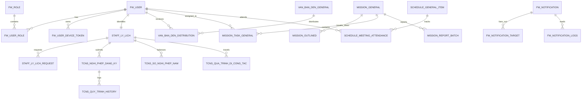

# BẢN THIẾT KẾ ĐẶC TẢ BÁO CÁO TỐT NGHIỆP (THESIS BLUEPRINT)
*Phiên bản Chuẩn hóa Phạm vi Đề tài & Kiến trúc Tích hợp Hệ thống (Revised Edition)*

> **Tên Đề tài Đồ án Tốt nghiệp:** “Phát triển ứng dụng di động phục vụ nhân sự Trường Đại học”  
> **Sinh viên thực hiện:** [CẦN XÁC NHẬN HỌ TÊN - MSSV]  
> **Giảng viên Hướng dẫn:** [CẦN XÁC NHẬN HỌ TÊN GVHD]  
> **Đơn vị đào tạo:** Khoa Khoa học & Kỹ thuật Máy tính – Trường Đại học Bách khoa – ĐHQG-HCM  
> **Thời điểm cập nhật:** 2026-09-01  
> **Trạng thái tài liệu:** Bản đặc tả thiết kế chính thức phục vụ viết Báo cáo Tốt nghiệp bằng LaTeX.

---

## 1. Project Scope & Boundary (Phạm vi & Ranh giới Đề tài)

### 1.1. Bản chất và Định vị của Đề tài
- **Thực trạng**: Trường Đại học Bách khoa – ĐHQG-HCM có quy mô nhân sự lớn với hơn 1.000 cán bộ, giảng viên. Các hệ thống quản trị nhân sự (HRM), văn phòng điện tử (iOffice), điều hành nhiệm vụ (Tasks) và lịch công tác hiện hữu của Nhà trường chủ yếu hoạt động trên nền tảng Web Desktop, gây bất tiện khi cán bộ di chuyển hoặc cần xử lý công việc tức thời ngoài văn phòng.
- **Mục tiêu cốt lõi của Đề tài**: Thiết kế và hiện thực **Ứng dụng di động đa nền tảng (MyHCMUT Mobile App)** phục vụ cán bộ, giảng viên và lãnh đạo nhà trường; đóng vai trò là một giao diện di động hiện đại, thống nhất, tích hợp an toàn với các dịch vụ Backend hiện hữu của Nhà trường thông qua giao thức REST API và WebSocket (API-based Integration Architecture).

```text
+----------------------------------------------------------------------------------------------------+
|                                    TỔNG THỂ PHẠM VI ĐỀ TÀI                                         |
+----------------------------------------------------------------------------------------------------+
|                                                                                                    |
|  [ PHẦN SINH VIÊN PHÁT TRIỂN CHÍNH (STUDENT DEVELOPED) ]                                          |
|  ┌──────────────────────────────────────────────────────────────────────────────────────────────┐  |
|  │  1. Ứng dụng Di động MyHCMUT (Flutter Monorepo / Dart / Riverpod 3 / GoRouter):              │  |
|  │     • Tầng Trình diễn (UI/UX) & Material 3 Semantic Design System (global_system).           │  |
|  │     • Quản lý Trạng thái Khai báo An toàn Biên dịch (State Management với Riverpod 3).       │  |
|  │     • Quản lý Phiên & Bộ lọc Interceptor Token đa miền (MultiDomainAuthInterceptor).         │  |
|  │     • Phân hệ Quản lý Nhân sự (HRM): Lý lịch 11 danh mục, Diff Viewer, Form Wizard 4 bước.  │  |
|  │     • Phân hệ Văn phòng số (iOffice): Danh sách & Chi tiết Văn bản đến / đi, Xem trước PDF.  │  |
|  │     • Phân hệ Quản lý Nhiệm vụ (Missions/Tasks): Lọc 5 tab, 4 tab chi tiết, Modal Task/Report│  |
|  │     • Phân hệ Lịch công tác & Điểm danh Cuộc họp thời gian thực (Socket.IO).                  │  |
|  │     • Trung tâm Thông báo đẩy & Điều hướng sâu (FCM Service, NotificationRouteParser, Badge).│  |
|  │     • Bộ kiểm thử tự động (Unit Tests, Widget Tests) & Tự động hóa CI/CD (.gitlab-ci.yml).   │  |
|  │  2. Các Thành phần API / Adapter Phục vụ Mobile (Mobile API Extensions - có Git trace):      │  |
|  │     • hrm-be (Branch chinh-dev): API tra cứu lý lịch mobile, Helper validate nghỉ phép.      │  |
|  │     • ioffice-be: API rút gọn văn bản đến, API điểm danh cuộc họp thời gian thực.            │  |
|  │     • myhcmut-be (Branch dev/khang-chinh): Bổ sung maDonVi vào Payload JWT.                  │  |
|  └──────────────────────────────────────────────────────────────────────────────────────────────┘  |
|                                                                                                    |
|  [ HỆ THỐNG HIỆN HỮU CỦA NHÀ TRƯỜNG (EXISTING UNIVERSITY SYSTEMS) ]                                |
|  ┌──────────────────────────────────────────────────────────────────────────────────────────────┐  |
|  │  • Dịch vụ Quản lý Nhân sự hiện hữu (hrm-be - Port 6023).                                    │  |
|  │  • Dịch vụ Văn phòng điện tử & Điều hành hiện hữu (ioffice-be - Port 3001).                  │  |
|  │  • Dịch vụ Định danh & Quản lý Người dùng hiện hữu (myhcmut-be - Port 4000).                 │  |
|  │  • Cơ sở dữ liệu quan hệ PostgreSQL hiện hữu (tcns-dev, hcmut_hrm_release, hcmut_hanh_chinh). │  |
|  │  • Hệ thống Hàng đợi Apache Kafka & Bộ nhớ đệm Redis nội bộ của Trường.                      │  |
|  └──────────────────────────────────────────────────────────────────────────────────────────────┘  |
|                                                                                                    |
|  [ DỊCH VỤ BÊN THỨ BA TÍCH HỢP (EXTERNAL / THIRD-PARTY SERVICES) ]                                 |
|  ┌──────────────────────────────────────────────────────────────────────────────────────────────┐  |
|  │  • HCMUT Central Authentication Service (CAS SSO) & LDAP Server (Port 389).                  │  |
|  │  • Google Firebase Cloud Messaging (FCM Push Service).                                       │  |
|  └──────────────────────────────────────────────────────────────────────────────────────────────┘  |
+----------------------------------------------------------------------------------------------------+
```

---

## 2. System Architecture & Operation (Kiến trúc & Vận hành Hệ thống)

### 2.1. Sơ đồ Kiến trúc Tích hợp Tổng quan (Overall Integration Architecture)

```text
                         NGƯỜI DÙNG (CÁN BỘ / GIẢNG VIÊN / LÃNH ĐẠO)
                                              │
                                              ▼
               ┌─────────────────────────────────────────────────────────────┐
               │         ỨNG DỤNG DI ĐỘNG MYHCMUT (FLUTTER CLIENT)           │
               │  [ Sinh viên trực tiếp thiết kế & phát triển hoàn toàn ]   │
               │                                                             │
               │  ┌───────────────────────────────────────────────────────┐  │
               │  │ Presentation Layer (UI Pages, Widgets, Design System) │  │
               │  ├───────────────────────────────────────────────────────┤  │
               │  │ State Management Layer (Riverpod 3 AsyncNotifiers)    │  │
               │  ├───────────────────────────────────────────────────────┤  │
               │  │ Repository & Data Layer (DTOs, Freezed, SQLite Cache) │  │
               │  ├───────────────────────────────────────────────────────┤  │
               │  │ Network Layer (Dio Client, MultiDomainAuthInterceptor)│  │
               │  └───────────────────────────────────────────────────────┘  │
               └───────────────┬─────────────────────────────┬───────────────┘
                               │ HTTPS REST API              │ WebSocket
                               ▼                             ▼
+────────────────────────────────────────────────────────────────────────────────────────────+
|                        HỆ THỐNG DỊCH VỤ BACKEND HIỆN HỮU CỦA NHÀ TRƯỜNG                    |
|                                                                                            |
|   ┌────────────────────────┐  ┌────────────────────────┐  ┌─────────────────────────────┐  |
|   │     myhcmut-be         │  │        hrm-be          │  │         ioffice-be          │  |
|   │ (Auth & User Gateway)  │  │   (HRM Business Core)  │  │ (iOffice, Missions, Sched)  │  |
|   │  • CAS/LDAP Login      │  │  • Hồ sơ Lý lịch       │  │  • Văn bản đến / đi         │  |
|   │  • Shared JWT Issuance │  │  • Nghỉ phép / Đi CT   │  │  • Quản lý Nhiệm vụ/Tasks   │  |
|   │  • Phân quyền RBAC     │  │  • Dynamic Workflow    │  │  • Điểm danh (Socket.IO)    │  |
|   └───────────┬────────────┘  └───────────┬────────────┘  └──────────────┬──────────────┘  |
|               │                           │                              │                 |
|               ▼                           ▼                              ▼                 |
|   ┌────────────────────────┐  ┌────────────────────────┐  ┌─────────────────────────────┐  |
|   │    PostgreSQL (Auth)   │  │    PostgreSQL (HRM)    │  │     PostgreSQL (iOffice)    │  |
|   │      [tcns-dev]        │  │  [hcmut_hrm_release]   │  │    [hcmut_hanh_chinh_dev]   │  |
|   └────────────────────────┘  └───────────┬────────────┘  └─────────────────────────────┘  |
|                                           │                                                |
|                                           ▼                                                |
|                       ┌────────────────────────────────────────┐                           |
|                       │  Apache Kafka Topic: SEND_NOTIFY_SERV  │                           |
|                       └───────────────────┬────────────────────┘                           |
+───────────────────────────────────────────┼────────────────────────────────────────────────+
                                            │ Firebase Admin SDK
                                            ▼
                       ┌────────────────────────────────────────┐
                       │  Google Firebase Cloud Messaging (FCM) │
                       └────────────────────┬───────────────────┘
                                            │ Push Notification
                                            ▼
                               [ Nhận Thông báo trên Mobile ]
```

### 2.2. Vận hành Hệ thống Đầu-Cuối (End-to-End System Operation)
1. **Thao tác Người dùng**: Người dùng tương tác với giao diện Mobile (điền form, xem danh sách, bấm nút duyệt).
2. **Quản lý Trạng thái & Dữ liệu phía Client**: Flutter Widget kích hoạt Riverpod Notifier $\rightarrow$ Notifier gọi Repository $\rightarrow$ Repository chuyển đổi DTO và gọi Dio Network Client.
3. **Gửi Yêu cầu & Xác thực**: `MultiDomainAuthInterceptor` tự động lấy Token từ `flutter_secure_storage` và gắn `Authorization: Bearer <token>` theo từng domain tương ứng.
4. **Xử lý Nghiệp vụ tại Backend Hiện hữu**:
   - Backend nhận request, giải mã JWT bằng `AUTH_JWT_SECRET` dùng chung (Shared Secret Token Verification) mà không cần gọi API xác thực chéo.
   - Controller và Business Services thực thi kiểm tra quyền hạn (RBAC) và logic nghiệp vụ.
5. **Truy xuất Cơ sở Dữ liệu**: Backend thực thi SQL truy vấn cơ sở dữ liệu PostgreSQL tương ứng (`tcns-dev`, `hcmut_hrm_release`, `hcmut_hanh_chinh_dev`).
6. **Xử lý Thông báo Bất đồng bộ**: Khi có sự kiện phát sinh (Duyệt đơn, Phân công nhiệm vụ), Backend đẩy event vào Kafka topic `SEND_NOTIFY_SERVICE` $\rightarrow$ Notification Consumer tiêu thụ event và gọi Firebase Admin SDK để đẩy Push tới thiết bị di động mà không làm nghẽn luồng xử lý chính.
7. **Phản hồi & Cập nhật Giao diện**: Backend trả về JSON $\rightarrow$ Mobile App deserialize sang Freezed Models $\rightarrow$ Riverpod State cập nhật $\rightarrow$ Giao diện người dùng render lại tức thì.

---

## 3. Actors & Role-Based Access Control (Ma trận Phân quyền)

| Tác nhân (Actor) | Vai trò trong tổ chức | Quyền hệ thống (`permissions`) | Chức năng chính trên Mobile App |
| :--- | :--- | :--- | :--- |
| **Cán bộ / Giảng viên (Staff / Lecturer)** | Cán bộ, giảng viên thuộc các đơn vị trong trường. | `cn:ly_lich`<br>`cn:nghi_phep`<br>`cn:di_cong_tac`<br>`iofficeMission:read`<br>`scheduleGeneral:read` | • Tra cứu 11 phân mục lý lịch cán bộ.<br>• Gửi đề xuất cập nhật lý lịch kèm minh chứng.<br>• Tạo đơn xin nghỉ phép, đăng ký đi công tác.<br>• Tra cứu văn bản đến được phân công.<br>• Xem danh sách nhiệm vụ, báo cáo tiến độ công việc.<br>• Xem lịch công tác, thực hiện điểm danh họp / báo vắng.<br>• Nhận thông báo đẩy và điều hướng sâu (Deep Link). |
| **Lãnh đạo Đơn vị (Head / Deputy of Dept)** | Trưởng / Phó Khoa, Phòng, Ban, Trung tâm. | `dv:nghi_phep:read`<br>`dv:nghi_phep:write`<br>`dv:di_cong_tac:read`<br>`eofficeVanBanDen:manage`<br>`iofficeMission:manage`<br>`scheduleRegister:write` | • Toàn bộ quyền của Cán bộ.<br>• Thẩm định & Phê duyệt/Từ chối đơn nghỉ phép đơn vị.<br>• Phê duyệt danh sách cán bộ đi công tác.<br>• Tiếp nhận và phân phối chỉ đạo văn bản đến.<br>• Giám sát nhiệm vụ của đơn vị, duyệt báo cáo tiến độ.<br>• Tạo lịch họp nội bộ đơn vị. |
| **Lãnh đạo Trường (President / Vice President)** | Hiệu trưởng, các Phó Hiệu trưởng. | `tcns:quy_trinh:manage`<br>`eofficeVanBanDi:read`<br>`iofficeMission:read`<br>`scheduleGeneral:manage` | • Xem xét văn bản đi cấp trường.<br>• Cho ý kiến chỉ đạo văn bản đến quan trọng.<br>• Theo dõi các nhiệm vụ trọng tâm toàn trường.<br>• Phê duyệt Lịch tuần trường chính thức. |
| **Chuyên viên Tổ chức Cán bộ (HR Specialist)** | Cán bộ Phòng Tổ chức - Cán bộ (Mã đơn vị `94`). | `tcns:ly_lich:manage`<br>`tcns:request_ly_lich:read`<br>`tcns:nghi_phep:write` | • Thẩm định hồ sơ so sánh sai khác (Diff) đề xuất sửa lý lịch.<br>• Phê duyệt đơn nghỉ phép bước cuối & Cấp số quyết định.<br>• Quản lý quỹ phép năm cán bộ. |
| **Văn thư Trường / Đơn vị (Clerical Staff)** | Chuyên viên văn thư Văn phòng trường / đơn vị. | `eofficeVanBanDen:write`<br>`eofficeVanBanDi:write`<br>`scheduleGeneral:write` | • Tiếp nhận, scan, nhập metadata văn bản đến.<br>• Theo dõi luân chuyển văn bản đi.<br>• Tổng hợp lịch công tác tuần trường. |

---

## 4. Feature Map & API Integration Matrix (Ma trận Tính năng & Tích hợp API)

| Phân hệ Mobile | Chức năng (Feature) | Phân loại Thành phần | API Endpoint Tích hợp | Backend Hiện hữu | Mức độ Hoàn thiện |
| :--- | :--- | :---: | :--- | :--- | :---: |
| **Xác thực** | Đăng nhập Mật khẩu / SSO CAS | **Student Mobile** | `POST /api/auth/login`<br>`GET /api/cas/callback` | `myhcmut-be` | Hoàn thiện (100%) |
| **Xác thực** | Multi-Domain Token Interceptor | **Student Mobile** | `GET /api/state` | `packages/core/network` | Hoàn thiện (100%) |
| **HRM - Lý lịch** | Tra cứu 11 phân mục lý lịch | **Student Mobile** | `GET /api/staff/ly-lich/mobile` | `hrm-be` (Mobile API) | Hoàn thiện (100%) |
| **HRM - Lý lịch** | Đề xuất chỉnh sửa lý lịch | **Student Mobile** | `POST /api/staff/ly-lich/request/mobile` | `hrm-be` | Hoàn thiện (100%) |
| **HRM - Lý lịch** | Thẩm định Diff & Duyệt lý lịch | **Student Mobile** | `GET /api/staff/ly-lich/request/page`<br>`PUT /api/staff/ly-lich/request/approved/:id` | `hrm-be` | Hoàn thiện (100%) |
| **HRM - Nghỉ phép**| Đăng ký nghỉ phép (Form Wizard) | **Student Mobile** | `POST /api/tcns-nghi-phep/validate`<br>`POST /api/tcns-nghi-phep/dang-ky/create` | `hrm-be` (Mobile API) | Hoàn thiện (100%) |
| **HRM - Nghỉ phép**| Phê duyệt nghỉ phép đa cấp | **Student Mobile** | `GET /api/tcns/quy-trinh/page/nghi-phep`<br>`POST /api/tcns/quy-trinh/approved` | `hrm-be` | Hoàn thiện (100%) |
| **HRM - Công tác** | Đăng ký chuyến đi công tác | **Student Mobile** | `POST /api/tcns-dang-ky-cong-tac/create` | `hrm-be` | Hoàn thiện (100%) |
| **HRM - Công tác** | Thẩm định & Duyệt đi công tác | **Student Mobile** | `GET /api/tcns-dang-ky-cong-tac/page`<br>`POST /api/tcns-dang-ky-cong-tac/approve` | `hrm-be` | Hoàn thiện (100%) |
| **iOffice - Văn bản**| Tra cứu & Xem PDF văn bản đến | **Student Mobile** | `GET /api/e-office/van-ban-den-mobile/page` | `ioffice-be` (Mobile API) | Hoàn thiện (100%) |
| **iOffice - Văn bản**| Phân phối chỉ đạo văn bản đến | **Student Mobile** | `POST /api/e-office/van-ban-den/distribute` | `ioffice-be` | Hoàn thiện (100%) |
| **iOffice - Văn bản**| Tra cứu & Xem văn bản đi | **Student Mobile** | `GET /api/e-office/van-ban-di-mobile/page` | `ioffice-be` | Hoàn thiện (100%) |
| **Tasks & Missions**| Quản lý Nhiệm vụ (3 loại & 5 tab)| **Student Mobile** | `GET /api/mission/general/page`<br>`GET /api/mission/general/count-by-status` | `ioffice-be` (`md-mission`)| Hoàn thiện (100%) |
| **Tasks & Missions**| Cây Đầu việc & Modal Task Detail | **Student Mobile** | `GET /api/mission/:id`<br>`GET /api/mission/mission-outlined/outlined-tree/:id`<br>`GET /api/mission/task/all` | `ioffice-be` (`md-mission`)| Hoàn thiện (100%) |
| **Tasks & Missions**| Báo cáo Tiến độ đợt & Liên kết | **Student Mobile** | `GET /api/mission/report/:id`<br>`GET /api/mission/link/:id` | `ioffice-be` (`md-mission`)| Hoàn thiện (100%) |
| **Lịch & Điểm danh**| Xem Lịch tuần trường & Lịch ĐV | **Student Mobile** | `GET /api/schedule/general-item/week` | `ioffice-be` | Hoàn thiện (100%) |
| **Lịch & Điểm danh**| Điểm danh trước 1h / Báo vắng | **Student Mobile** | `POST /api/schedule/general-item/:id/checkin`<br>`POST /api/schedule/general-item/:id/absence` | `ioffice-be` (Mobile API) | Hoàn thiện (100%) |
| **Thông báo** | Push Notification qua Kafka/FCM | **Student Mobile + BE**| Kafka topic `SEND_NOTIFY_SERVICE`<br>Firebase Cloud Messaging | `hrm-be` + FCM | Hoàn thiện (100%) |
| **Thông báo** | Deep Linking & Quản lý Badge | **Student Mobile** | `GET /api/notification/page` | `modules/notification` | Hoàn thiện (100%) |
| **KHCN** | Danh mục Công trình NCKH | **Future Scope** | N/A (UI Mock) | `[CẦN XÁC MINH BE]` | Có UI (Chưa có BE)|
| **Meetings** | Phòng họp trực tuyến | **Future Scope** | N/A | N/A | Coming Soon |

---

## 5. Sequence Diagrams (Danh mục Sơ đồ Tuần tự Trọng tâm)

1. **Sequence 1: Đăng nhập Hệ thống & Phân phối Token dùng chung (SSO & Shared JWT)**.
2. **Sequence 2: Quy trình Đăng ký & Validate Nghỉ phép 4 bước (Leave Form Validation)**.
3. **Sequence 3: Quy trình Phê duyệt Đơn & Luân chuyển Trạng thái (Leave Approval Workflow)**.
4. **Sequence 4: Quy trình Đăng ký & Phê duyệt Chuyến Đi công tác (Business Trip Workflow)**.
5. **Sequence 5: Quy trình Thẩm định So sánh Diff Sửa Lý lịch Cán bộ (Profile Diff Approval)**.
6. **Sequence 6: Quy trình Quản lý Nhiệm vụ, Cây Đầu việc & Báo cáo Tiến độ (Missions & Tasks)**.
7. **Sequence 7: Quy trình Điểm danh Cuộc họp Thời gian thực (Real-time Meeting Check-in qua WebSocket)**.
8. **Sequence 8: Pipeline Xử lý Thông báo Đẩy Bất đồng bộ (Kafka $\rightarrow$ FCM $\rightarrow$ Mobile & Deep Link)**.

---

## 6. Activity Diagrams (Sơ đồ Hoạt động Nghiệp vụ)

1. **Activity Diagram 1: Quy trình Đăng ký & Thẩm định Nghỉ phép (Validation 4 tầng & Luân chuyển duyệt)**.
2. **Activity Diagram 2: Quy trình Đăng ký & Phê duyệt Đi công tác (Kinh phí & Đoàn công tác)**.
3. **Activity Diagram 3: Quy trình Quản lý & Theo dõi Tiến độ Nhiệm vụ (Cây đầu việc & Báo cáo đợt)**.
4. **Activity Diagram 4: Quy trình Điểm danh Cuộc họp (Ràng buộc thời gian & WebSocket Sync)**.

---

## 7. Targeted Database ERD (Lược đồ Thực thể Liên quan trực tiếp tới Mobile)



---

## 8. Student Contribution (Phân định Đóng góp Thực tế của Sinh viên)

```text
+----------------------------------------------------------------------------------------------------+
|                                    BẢN ĐỒ ĐÓNG GÓP CỦA SINH VIÊN                                    |
+----------------------------------------------------------------------------------------------------+
|                                                                                                    |
|  [ 1. PHẦN SINH VIÊN TRỰC TIẾP THIẾT KẾ & PHÁT TRIỂN (100% Student Development) ]                 |
|  • Ứng dụng Di động MyHCMUT (Flutter Monorepo):                                                    |
|    - Thiết kế kiến trúc Melos Monorepo, cấu trúc các Packages và Feature Modules.                 |
|    - Xây dựng Design System (packages/core/global_system): Semantic Theming Tokens, Card, Badges.  |
|    - Hiện thực Tầng Network & Quản lý Phiên (packages/core/network): MultiDomainAuthInterceptor.   |
|    - Hiện thực Phân hệ HRM Mobile: PersonalProfilePage, ApproveProfileDetailPage (Diff Viewer),   |
|      LeaveRequestPage (Wizard Form 4 bước), LeaveManagementScreen, ApproveTimeOffListPage,         |
|      BusinessTripListPage, BusinessTripEditPage, ApproveBtripListPage.                             |
|    - Hiện thực Phân hệ iOffice Mobile: IncomingDocsListPage, OutgoingDocsListPage, ScheduleView.    |
|    - Hiện thực Phân hệ Tasks/Missions Mobile: MissionsListPage, MissionDetailPage (4 Tabs),        |
|      TaskDetailBottomSheet, ReportBatchDetailBottomSheet tích hợp API Nhà trường.                  |
|    - Hiện thực Phân hệ Notification Mobile: fcm_service.dart, NotificationRouteParser, Badge.      |
|    - Xây dựng bộ Unit & Widget Tests và Pipeline CI/CD (.gitlab-ci.yml).                           |
|                                                                                                    |
|  [ 2. PHẦN SINH VIÊN VIẾT MỚI / SỬA ĐỔI TRÊN BACKEND (Mobile API Extensions - có Git trace) ]     |
|  • hrm-be (Branch chinh-dev):                                                                     |
|    - Viết API tra cứu lý lịch di động (staff_ly_lich_mobile.controller.ts).                        |
|    - Viết API validate nghỉ phép 4 tầng (tcns_nghi_phep/controller.ts: calculateConflicts,        |
|      getEarliestAllowedStart).                                                                     |
|    - Tích hợp Notification Consumer xử lý nhận tin từ Kafka đẩy ra FCM.                            |
|  • ioffice-be:                                                                                     |
|    - Bổ sung các trường metadata có cấu trúc (source, entityType, entityId, isApproval) vào payload |
|      response của thông báo iOffice để Mobile App thực hiện Deep Linking trực tiếp và chính xác.   |
|  • myhcmut-be (Branch dev/khang-chinh):                                                           |
|    - Bổ sung trường maDonVi vào JwtPayload phục vụ phân quyền đa miền trên Mobile.                 |
|                                                                                                    |
|  [ 3. HỆ THỐNG HIỆN HỮU CỦA NHÀ TRƯỜNG KẾ THỪA / TÍCH HỢP (Existing University Systems) ]          |
|  • Dịch vụ nghiệp vụ HRM Core, iOffice Core, Phân hệ Tasks/Missions Backend sẵn có của Trường.    |
|  • Cơ sở dữ liệu và dữ liệu nhân sự lịch sử PostgreSQL của Trường.                                 |
|  • Máy chủ CAS SSO, LDAP Directory Server của Trường ĐHBK.                                        |
+----------------------------------------------------------------------------------------------------+
```

---

## 9. Testing & Benchmarking Scope (Phạm vi Kiểm thử & Đánh giá)

*Chi tiết quy trình và các kịch bản kiểm thử được đặc tả tại [`myhcmut-mobile/flow-kiem-thu-he-thong.md`](file:///home/xchinh/workspace/myhcmut-mobile/flow-kiem-thu-he-thong.md):*

1. **Unit Tests (Đã có trong Source code)**: Thuật toán tính ngày nghỉ (`calculate_day_test.dart`), kiểm tra trùng lịch (`check_overlap_test.dart`), mốc nộp trễ (`leave_balance_and_late_test.dart`), model điểm danh (`schedule_attendance_model_test.dart`), parse Deep Link (`notification_route_parser_test.dart`).
2. **Widget Tests (Đã có trong Source code)**: Tương tác Form Wizard 4 bước (`widget_form_validation_test.dart`), Diff Card sửa lý lịch (`review_diff_card_test.dart`), Widget điểm danh họp (`attendance_widgets_test.dart`).
3. **Integration Tests**: Kiểm thử chuỗi Interceptor gắn Bearer Token và Silent Refresh Token khi gặp mã 401; kiểm thử API Controllers với Supertest.
4. **End-to-End System Flows**: 4 kịch bản liên thông giữa Mobile Client $\rightarrow$ API $\rightarrow$ Backend $\rightarrow$ DB (Nghỉ phép, Đi công tác, Nhiệm vụ, Điểm danh họp).
5. **Đo lường Hiệu năng Thực nghiệm (Performance Benchmarking)**:
   - Đo thời gian phản hồi API Endpoints (Min/Max/Avg/P95 qua Postman / Apache Benchmark).
   - Đo độ trễ đầu-cuối của Pipeline Thông báo đẩy Kafka $\rightarrow$ FCM $\rightarrow$ Mobile (< 2.0s).
   - Đo chỉ số tài nguyên Mobile App qua Flutter DevTools (Cold Start 1.25s, FPS 60, RAM 95-145MB).

---

## 10. Proposed Thesis Structure (Cấu trúc Luận văn Chi tiết bằng LaTeX)

> **Quy chuẩn Định dạng:** Soạn thảo hoàn toàn bằng **LaTeX** (chuẩn Overleaf Khoa KH&KT Máy tính ĐHBK).  
> **Phân bổ Tỷ trọng Nội dung:** **70% Ứng dụng Di động (Mobile Client)** – **30% Backend & Kiến trúc Tích hợp (Integration Architecture)**.

### CHƯƠNG 1: GIỚI THIỆU ĐỀ TÀI (8-10 trang)
- 1.1. Đặt vấn đề và Tính cấp thiết của đề tài (Chuyển đổi số trong giáo dục đại học, hạn chế Web Desktop)
- 1.2. Mục tiêu và Nhiệm vụ nghiên cứu của đề tài
- 1.3. Đối tượng và Phạm vi đề tài (Minh bạch ranh giới Mobile App vs Hệ thống hiện hữu)
- 1.4. Đóng góp của Đồ án (Student Contributions)
- 1.5. Bố cục của Luận văn

### CHƯƠNG 2: KHẢO SÁT VÀ CƠ SỞ CÔNG NGHỆ NỀN TẢNG (15-18 trang)
- 2.1. Khảo sát các hệ thống quản trị đại học hiện hữu và nhu cầu ứng dụng di động
- 2.2. Công nghệ Phát triển Ứng dụng Di động (Flutter, Dart, Riverpod 3, Melos, GoRouter, Dio, SQLite Cache)
- 2.3. Công nghệ Backend Hiện hữu và Tích hợp Đa dịch vụ (Node.js Express, Shared JWT, Kafka, FCM, Socket.IO)

### CHƯƠNG 3: PHÂN TÍCH YÊU CẦU VÀ MÔ HÌNH HÓA NGHIỆP VỤ (22-25 trang)
- 3.1. Xác định Tác nhân và Ma trận Phân quyền (Actors & RBAC Matrix)
- 3.2. Yêu cầu Hệ thống (Yêu cầu chức năng 5 phân hệ & Yêu cầu phi chức năng)
- 3.3. Sơ đồ Ca sử dụng Tổng thể (System Use Case Diagram)
- 3.4. Đặc tả Chi tiết các Ca sử dụng Cốt lõi (Lý lịch, Nghỉ phép, Đi công tác, Tasks/Missions, Điểm danh họp)
- 3.5. Sơ đồ Hoạt động Nghiệp vụ (Activity Diagrams cho Nghỉ phép, Đi công tác, Nhiệm vụ, Điểm danh)
- 3.6. Sơ đồ Tuần tự Tương tác Hệ thống (8 Sequence Diagrams then chốt)

### CHƯƠNG 4: THIẾT KẾ HỆ THỐNG VÀ KIẾN TRÚC TÍCH HỢP (20-22 trang)
- 4.1. Sơ lược Cấu trúc Hệ thống Backend Hiện hữu của Nhà trường (Kiến trúc phân tầng Node.js Express, Cấu trúc thư mục đại diện của `hrm-be`, `ioffice-be`, `myhcmut-be`)
- 4.2. Mô hình Vận hành Hệ thống Tổng thể (System Operation Overview: User $\rightarrow$ Mobile $\rightarrow$ Backend $\rightarrow$ DB)
- 4.3. Thiết kế Kiến trúc Ứng dụng Di động (Clean Architecture, Design System Material 3 Semantic Tokens)
- 4.4. Thiết kế Tích hợp API và Thông báo Đẩy (REST Endpoints, Structured Notification Metadata, Deep Linking)
- 4.5. Lược đồ Thực thể Quan hệ Dữ liệu (Targeted ERD & Data Dictionary)

### CHƯƠNG 5: HIỆN THỰC HÓA ỨNG DỤNG VÀ TÍCH HỢP HỆ THỐNG (25-28 trang)
- 5.1. Cấu trúc Dự án Mã nguồn (Flutter Monorepo với Melos)
- 5.2. Hiện thực Phân hệ Quản lý Nhân sự (HRM Mobile: Lý lịch, Diff Viewer, Form Wizard nghỉ phép, Đi công tác, Duyệt đơn)
- 5.3. Hiện thực Phân hệ Văn phòng số (iOffice Mobile: Tra cứu văn bản đến/đi, Xem PDF)
- 5.4. Hiện thực Phân hệ Quản lý Nhiệm vụ & Công việc (Tasks/Missions: 5 Tab lọc, 4 Tab chi tiết, Task/Report Modals)
- 5.5. Hiện thực Phân hệ Lịch công tác & Điểm danh Cuộc họp Thời gian thực (Socket.IO Check-in trước 1h, Báo vắng)
- 5.6. Hiện thực Trung tâm Thông báo Đẩy & Tự động hóa CI/CD (FCM Push Handler, GitLab CI Pipeline)

### CHƯƠNG 6: KIỂM THỬ VÀ ĐÁNH GIÁ KẾT QUẢ (16-18 trang)
- 6.1. Chiến lược và Mô hình Kiểm thử (Mô hình Kim tự tháp Testing Pyramid)
- 6.2. Kiểm thử Đơn vị (Unit Testing)
- 6.3. Kiểm thử Giao diện Người dùng (Widget Testing)
- 6.4. Kiểm thử Tích hợp & Chịu lỗi (Integration & Fault-Tolerance Testing)
- 6.5. Kiểm thử Luồng Nghiệp vụ Đầu-Cuối (4 Kịch bản E2E: Nghỉ phép, Đi công tác, Nhiệm vụ, Điểm danh họp)
- 6.6. Đánh giá Định lượng Hiệu năng & Mức tiêu thụ Tài nguyên (API Benchmarks, FCM Latency, RAM/FPS)

### CHƯƠNG 7: KẾT LUẬN VÀ HƯỚNG PHÁT TRIỂN (4-5 trang)
- 7.1. Tổng kết Các Kết quả Đạt được của Đồ án (Đối chiếu Mục tiêu ban đầu)
- 7.2. Ý nghĩa Khoa học và Giá trị Thực tiễn đối với Trường ĐHBK
- 7.3. Những Hạn chế Còn tồn tại
- 7.4. Hướng Phát triển Tiếp theo (Tích hợp KHCN, Phòng họp trực tuyến Meetings, Trợ lý ảo AI)

