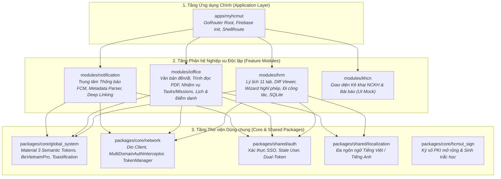

# TỔNG HỢP CÔNG NGHỆ FRONTEND VÀ KIẾN TRÚC CLIENT (MYHCMUT MOBILE)
**Dự án:** Ứng dụng Di động Phục vụ Nhân sự Trường Đại học (MyHCMUT)  
**Tài liệu kỹ thuật phục vụ:** Viết Mục 3.2 (Công nghệ Frontend) & Chương 6, Chương 7 Báo cáo ĐATN

---

## 1. TỔNG QUAN KIẾN TRÚC MÃ NGUỒN VÀ PHÂN RÃ HỆ THỐNG

Ứng dụng **MyHCMUT Mobile** được xây dựng theo mô hình **Modular Feature-First Monorepo** do công cụ **Melos** điều phối. Dự án được phân rã thành các gói thư viện dùng chung (Core Packages) và các phân hệ nghiệp vụ độc lập (Feature Modules), loại bỏ hoàn toàn module tin tức (`news`) để tập trung tối đa vào các nghiệp vụ quản trị trọng tâm:



---

## 2. BẢNG TỔNG HỢP TOÀN BỘ CÔNG NGHỆ FRONTEND SỬ DỤNG

| Nhóm Chức năng | Công nghệ & Thư viện sử dụng | Phiên bản | Bài toán kỹ thuật cần giải quyết | Cơ chế & Cách thức hoạt động trong Code |
| :--- | :--- | :---: | :--- | :--- |
| **Nền tảng Cốt lõi** | **Flutter SDK & Dart 3** | `^3.24.0`<br/>(Dart 3.x) | Tránh giật lag qua JavaScript Bridge của React Native; đồng nhất 100% giao diện giữa Android và iOS; tối ưu chi phí phát triển. | Biên dịch **Ahead-Of-Time (AOT)** trực tiếp sang mã máy C/C++; tự vẽ UI qua Impeller/Skia Engine đạt **60 FPS** mượt mà; **Sound Null Safety** loại bỏ lỗi crash runtime. |
| **Kiến trúc Codebase** | **Melos Monorepo** | Workspace | Tránh ứng dụng nguyên khối cồng kềnh (Monolith bloat); ngăn chặn import chéo gây phụ thuộc vòng; phân tách rõ ràng ranh giới module. | Tệp `melos.yaml` liên kết tự động các package nội bộ bằng path dependencies; cung cấp lệnh `melos bootstrap`, chạy phân tích tĩnh, format và unit test độc lập cho từng module. |
| **Quản lý Trạng thái & DI** | **Riverpod 3.0** (`flutter_riverpod`, `riverpod_annotation`, `riverpod_generator`) | `^3.0.1` | Khắc phục 3 nhược điểm lớn của Provider: lỗi runtime `ProviderNotFoundException`, phụ thuộc `BuildContext`, và rò rỉ bộ nhớ (Memory Leak). | Bộ sinh mã tĩnh `riverpod_generator` kiểm tra kiểu dữ liệu tại **Compile-time**; Notifier hoạt động độc lập ngoài cây widget; chuẩn hóa luồng API qua **`AsyncValue`**; tự động giải phóng RAM khi rời màn hình với **`autoDispose`**. |
| **Điều hướng & Deep Link** | **GoRouter** | `^16.2.4` | Cấu trúc cây điều hướng lồng nhau (ShellRoute cho BottomBar), phân quyền tuyến đường (Route Guards) và phân giải Deep Link từ thông báo đẩy. | Quản lý Declarative URL Routing; hỗ trợ Sub-routing theo từng module; tích hợp `NotificationRouteParser` chuyển đổi 4 trường metadata thông báo thành route chi tiết tức thì. |
| **Tầng Mạng & Interceptor** | **Dio** kèm `pretty_dio_logger` | `^5.9.0` | Quản lý kết nối RESTful API đồng thời tới 3 Backend độc lập (`myhcmut-be`, `hrm-be`, `ioffice-be`); xử lý truyền nhận tệp PDF dung lượng lớn. | `MultiDomainAuthInterceptor` tự động gắn Bearer Token; tự động bắt mã **401 Unauthorized** để xóa token và kích hoạt làm mới phiên ngầm; hỗ trợ `CancelToken` và theo dõi tiến trình upload/download tệp. |
| **Lưu trữ Cục bộ: Key-Value & SWR** | **`shared_preferences`** (Tier 1 Storage) | `^2.3.3` | Nạp dữ liệu màn hình tức thì (**0ms delay**), giảm tải cho máy chủ trường, hỗ trợ xem thông tin khi ngoại tuyến. | Triển khai mô hình **Stale-While-Revalidate (SWR)** trong `swr_cache_fetcher.dart`: Trả dữ liệu cache tức thì; nếu cache quá hạn (TTL), kích hoạt `Future.microtask()` chạy ngầm gọi API cập nhật cache. |
| **Lưu trữ Cục bộ: Database SQLite** | **`sqflite` & `path`** (Tier 2 Storage) | `^2.3.3+1` | Quản lý **47 nhóm danh mục HRM phân cấp lớn** (Tỉnh/Huyện/Xã, Ngạch bậc, Vị trí việc làm...) mà không làm tràn bộ nhớ RAM thiết bị. | `MasterDataDatabaseService`: Lưu toàn bộ danh mục xuống đĩa SQLite; sử dụng **Batch Transaction (`txn.batch()`)** nạp hàng ngàn bản ghi siêu tốc; đánh chỉ mục phức hợp (`idx_hrm_dm_cat_ma`, `idx_hrm_dm_cat_parent`) giúp tìm kiếm đạt $O(1) \rightarrow O(\log N)$. |
| **Quản lý Token Phiên làm việc** | **`MultiDomainTokenManager`** | Tự xây dựng | Quản lý độc lập Token của nhiều phân hệ Backend khác nhau; tối ưu hóa tốc độ đọc Token trên mỗi HTTP request. | Lưu chuỗi định dạng `${accessToken}|||${refreshToken}` trong `SharedPreferences` theo key `token_$domainKey`; kết hợp lớp **In-memory Cache** (`Map<String, TokenPair?>`) truy xuất cực nhanh. |
| **Mô hình Hóa Dữ liệu** | **Freezed & `json_serializable`** | `^3.2.3`<br/>(`^6.8.0`) | Tránh lỗi sai kiểu dữ liệu khi parse JSON từ API; đảm bảo tính bất biến (Immutable Data) trong luồng State Management. | Tự động sinh mã `fromJson`/`toJson`, hỗ trợ hàm sao chép có biến đổi `copyWith`, so sánh bằng theo giá trị (Value Equality) và Pattern Matching. |
| **Thời gian thực (Real-time)** | **`socket_io_client`** | `^3.1.0` | Đồng bộ danh sách đại biểu có mặt tức thời trong các cuộc họp tập trung của Nhà trường mà không cần tải lại trang. | Mở kết nối WebSocket 2 chiều liên tục; lắng nghe và phát tán sự kiện `scheduleCheckin`, cập nhật trạng thái có mặt/báo vắng với độ trễ $< 50$ms. |
| **Thông báo Đẩy & Badge** | **Firebase Messaging (`firebase_messaging`), `flutter_local_notifications`, `app_badge_plus`** | `^15.0.3`<br/>`^17.0.0`<br/>`^1.2.9` | Tiếp nhận thông báo công việc khẩn cấp (đơn được duyệt, văn bản đến, đổi phòng họp) khi ứng dụng đang chạy ngầm hoặc đã tắt hoàn toàn. | Tích hợp Google FCM HTTP v1 API; hiển thị Heads-up notification nổi trên màn hình; cập nhật số lượng thông báo chưa đọc trực tiếp trên icon ứng dụng ở màn hình chính. |
| **Hệ thống Giao diện (Design System)** | **`global_system`**, `google_fonts` (`BeVietnamPro`), `toastification`, `table_calendar`, `pdfrx` | `^6.3.2`<br/>`^3.0.3`<br/>`^3.2.0`<br/>`^2.2.4` | Đảm bảo tính nhận diện thương hiệu của Trường ĐHBK; nhất quán trải nghiệm người dùng; tương thích hoàn hảo Light/Dark Mode. | Chuẩn hóa bảng màu theo **Material 3 Semantic Tokens**; phông chữ chuẩn tiếng Việt `BeVietnamPro`; hiển thị thông báo Toast nổi; lịch tuần công tác; trình đọc tệp PDF trực tiếp. |
| **Tải trang & Xử lý Danh sách lớn** | **`infinite_scroll_pagination`** | `^5.1.1` | Tránh giật lag khi tải danh sách hàng trăm văn bản đến/đi, danh sách nhiệm vụ hoặc lịch sử nghỉ phép. | Tải dữ liệu phân trang cuộn vô tận (Infinite Scrolling / Lazy Loading), giải phóng bộ nhớ cho các phần tử ngoài tầm nhìn. |
| **Ký số & Sinh trắc học (Mở rộng)** | **`hcmut_sign` & `local_auth`** | `^2.3.0`<br/>`^6.5.0` (XML) | Chuẩn bị nền tảng ký duyệt số nội bộ và xác thực mở khóa nhanh bằng vân tay / FaceID. | Giao tiếp phần cứng sinh trắc học thiết bị di động và cấu trúc định dạng chữ ký XML-DSig. |
| **Đa ngôn ngữ & Tiện ích** | **`shared_localization`**, `intl`, `file_picker`, `permission_handler` | `^0.20.2`<br/>`^10.3.10`<br/>`^12.0.1` | Hỗ trợ chuyển đổi ngôn ngữ Anh/Việt; định dạng thời gian/tiền tệ; chọn tệp ảnh/PDF minh chứng; quản lý cấp quyền thiết bị. | Đọc chuỗi bản địa hóa theo cấu trúc khóa động; bắt và xin quyền Runtime Permissions (Camera, Storage, Notification) linh hoạt. |

---

## 3. PHÂN TÍCH CHI TIẾT TẦNG LƯU TRỮ VÀ QUẢN LÝ ACCESS / REFRESH TOKEN

### 3.1. Thực tế Triển khai trong Mã nguồn:
Trong mã nguồn hiện tại, lớp `MultiDomainTokenManager` (`packages/core/network/lib/src/token_manager.dart`) và `SharedPreferencesWrapper` (`packages/core/global_system/lib/src/storage/shared_preferences_wrapper.dart`) **sử dụng `SharedPreferences` làm tầng lưu trữ nền tảng kết hợp bộ đệm In-Memory Cache**:

1. **Cấu trúc Khóa Lưu trữ (Storage Key):**
   * Khóa được tiền tố theo domain: `_getKey(domainKey) => 'token_$domainKey'` (ví dụ: `token_hrm`, `token_ioffice`, `token_myhcmut`).
2. **Cấu trúc Giá trị Lưu trữ (Storage Value):**
   * Nối hai chuỗi token bằng ký tự phân tách đặc biệt:
     ```dart
     final tokenString = '${token.accessToken}|||${token.refreshToken ?? ''}';
     await _prefs.setString(key, tokenString);
     ```
3. **Cơ chế Đọc và Khôi phục (Token Retrieval & In-Memory Caching):**
   * Khi gọi `getToken(domainKey)`:
     - Kiểm tra trước trong `_tokenCache[domainKey]` (truy xuất tức thì $O(1)$ trên RAM).
     - Nếu chưa có, đọc chuỗi từ `_prefs.getString('token_$domainKey')`, bóc tách theo dấu `'|||'` để tái tạo đối tượng `TokenPair(accessToken, refreshToken)`.
4. **Cơ chế Xóa và Đăng xuất (Token Removal):**
   * Khi nhận mã 401 hoặc đăng xuất, gọi `removeToken(domainKey)` hoặc `clearAllTokens()` để xóa sạch toàn bộ các key bắt đầu bằng `'token_'`.

### 3.2. Đánh giá Học thuật cho Báo cáo Luận văn:
* **Ưu điểm giải pháp hiện tại:**
  - Tốc độ truy xuất token cực nhanh ($0$ms) nhờ sự kết hợp giữa In-memory Cache và SharedPreferences.
  - Xử lý mượt mà và độc lập cho nhiều Backend domains mà không gặp phải các lỗi đồng bộ bất đối xứng của Android Keystore trên một số hệ điều hành tùy biến cũ.
* **Định hướng Nâng cấp An toàn Cấp cao (Future Security Hardening):**
  - Trong Chương 6 (Thiết kế hệ thống) và Chương 8 (Hướng phát triển), chúng ta trình bày kiến trúc mở: Tầng `TokenManager` được thiết kế trừu tượng hóa, sẵn sàng chuyển đổi backend lưu trữ sang **`flutter_secure_storage`** (sử dụng **iOS Keychain** và **Android EncryptedSharedPreferences / Hardware Keystore**) để chống lại các cuộc tấn công trích xuất dữ liệu trên các thiết bị đã bị can thiệp hệ điều hành (Rooted / Jailbroken devices).
