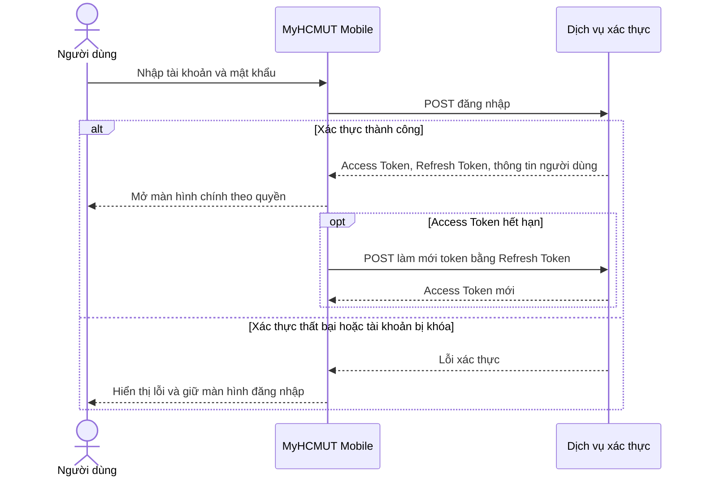
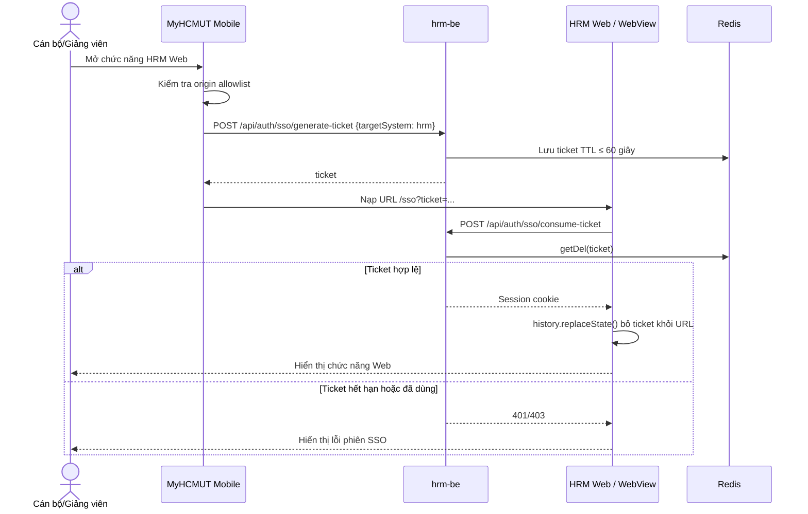
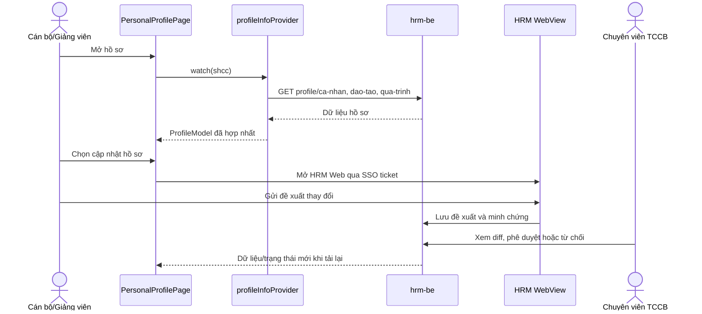
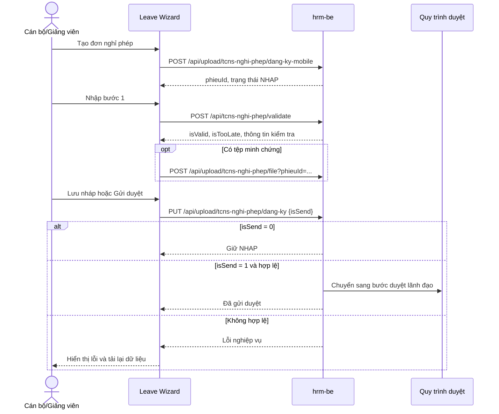
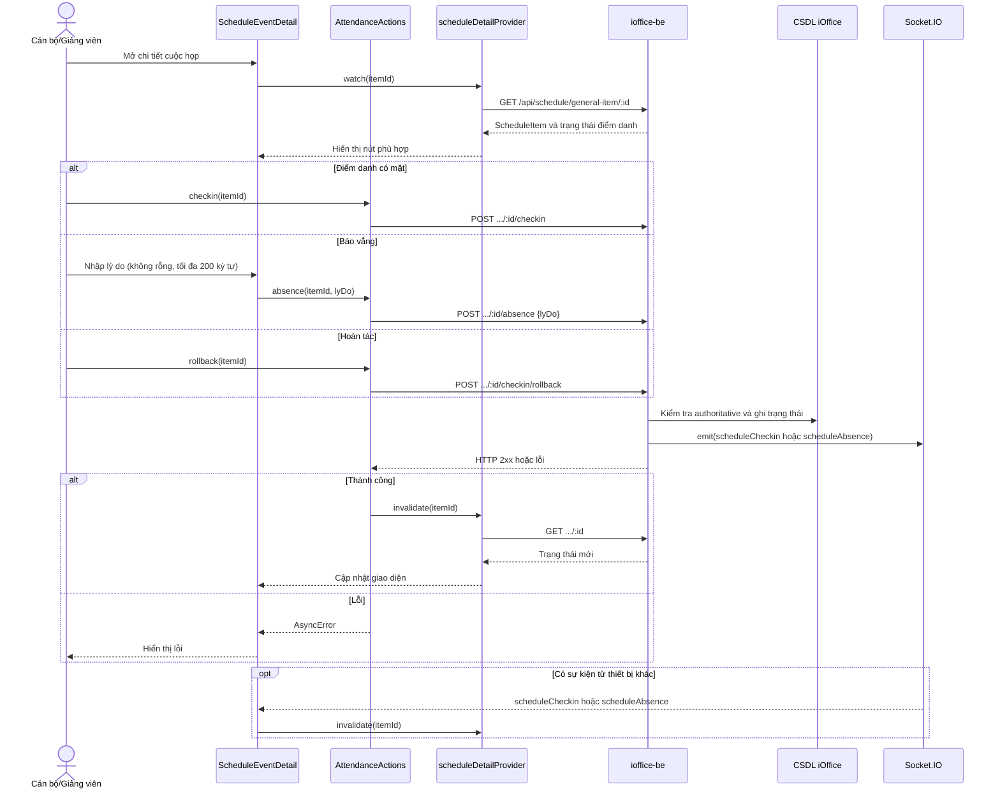
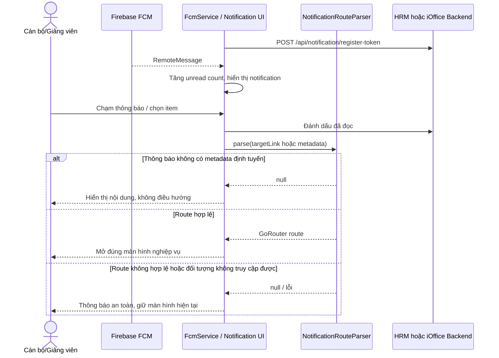

# Blueprint UML — Phạm vi Vũ Xuân Chính

Tài liệu này là nguồn duy nhất để vẽ lại Use Case Diagram, Activity Diagram và Sequence Diagram cho các phần do Vũ Xuân Chính thực hiện. Phạm vi nghiệp vụ gồm: SSO Ticket Bridge, Hồ sơ cán bộ, Nghỉ phép, Lịch/Điểm danh cuộc họp và Trung tâm thông báo.

**Mốc đối chiếu:** Báo cáo `Report-DATN` ở nhánh local `main`, commit `c788f17` (2026-09-14); `myhcmut-mobile` commit `4fe5d9c` (2026-09-14), `hrm-be` commit `9e39ccc` (2026-09-11), `ioffice-be` commit `e70b44c` (2026-09-09). Không dùng `origin/main`, worktree `draw-diagram` hay các thay đổi chưa commit trong `ioffice-be` làm bằng chứng UML.

**Bất nhất đã phát hiện:** `Chapter4/section3.tex` ghi “Wizard 4 bước”, nhưng đặc tả chi tiết `Chapter4/section2/hrm/index.tex`, tài liệu đối chiếu và mã Mobile đều xác định Wizard **3 bước**. Blueprint này dùng 3 bước; cần sửa câu tổng kết Chương 4 về “Wizard 3 bước” trước khi nộp báo cáo.

## 1. Quy ước chung

- **Use Case** chỉ mô tả mục tiêu của tác nhân. Không đưa Riverpod, Flutter, REST, Socket.IO, cache, database hay “đồng bộ trạng thái” thành Use Case.
- **Activity** mô tả quyết định nghiệp vụ và các nhánh lỗi. Dùng lane `Người dùng | Mobile | Backend`; chỉ thêm FCM/Socket.IO khi luồng bất đồng bộ là trọng tâm.
- **Sequence** mô tả mã nguồn hiện thực. REST, provider invalidation, FCM và Socket.IO được phép xuất hiện; dùng Mermaid cho toàn bộ Sequence.
- Các backend HRM/iOffice và CAS/FCM là **supporting actors** trong Use Case tổng quan; không gán chúng là người dùng chính.
- Không đưa Đi công tác, Văn bản, Nhiệm vụ hoặc luồng duyệt nghiệp vụ do Tống Duy Khang phụ trách vào các sơ đồ chi tiết của Chính.

## 2. Use Case tổng quan MyHCMUT Mobile

**System boundary:** `MyHCMUT Mobile`.

| Nhóm | Actors chính | Use Case cần đặt trong boundary |
|---|---|---|
| Xác thực & SSO | Cán bộ/Giảng viên, CAS/LDAP, HRM Backend | Đăng nhập, đăng xuất, mở HRM Web bằng SSO ticket |
| Hồ sơ cán bộ | Cán bộ/Giảng viên, Chuyên viên TCCB, HRM Backend | Xem hồ sơ, yêu cầu cập nhật, thẩm định thay đổi hồ sơ |
| Nghỉ phép | Cán bộ/Giảng viên, Lãnh đạo đơn vị, HRM Backend | Xem quỹ phép/đơn, tạo nháp, cập nhật đơn, gửi duyệt, theo dõi trạng thái |
| Lịch & điểm danh | Cán bộ/Giảng viên, iOffice Backend, HRM Backend | Xem lịch tuần/lịch hợp nhất, xem cuộc họp, điểm danh, báo vắng, hoàn tác điểm danh |
| Thông báo | Cán bộ/Giảng viên, Firebase FCM, HRM/iOffice Backend | Nhận thông báo, xem danh sách, đánh dấu đã đọc, mở nội dung theo ngữ cảnh, quản lý token thiết bị |

`Mobile Core`, `MultiDomainTokenManager`, Riverpod, Dio và GoRouter là hạ tầng xuyên suốt. Chúng chỉ nên xuất hiện trong sơ đồ kiến trúc Chương 5/6, không phải Use Case nghiệp vụ.

## 3. SSO Ticket Bridge

### Use Case

**Actors:** Cán bộ/Giảng viên (chính), CAS/LDAP, HRM Backend và HRM Web (hỗ trợ).

```text
Cán bộ/Giảng viên ── Đăng nhập hệ thống
Cán bộ/Giảng viên ── Đăng xuất
Cán bộ/Giảng viên ── Mở chức năng HRM Web
Mở chức năng HRM Web ── <<include>> ── Cấp SSO ticket một lần
Mở chức năng HRM Web ── <<include>> ── Thiết lập Web session
CAS/LDAP ── Đăng nhập hệ thống
HRM Backend ── Cấp SSO ticket một lần
HRM Web ── Thiết lập Web session
```

Không vẽ JWT dài hạn truyền qua URL. Ticket là bearer credential ngắn hạn, single-use; Web Frontend tiêu thụ ticket và loại ticket khỏi URL.

### Activity

```text
Đăng nhập: người dùng chọn CAS SSO hoặc mật khẩu → dịch vụ xác thực kiểm tra danh tính
→ Mobile nhận token và tải quyền → vào màn hình chính. Đăng xuất: xoá trạng thái phiên/cache theo người dùng và thu hồi liên kết token thiết bị.

Mở chức năng Web → Mobile kiểm tra allowlist origin → yêu cầu ticket
→ Backend cấp ticket → Mobile ghép ticket vào URL → WebView nạp trang
→ Web Frontend consume ticket → Backend getDel ticket và tạo session cookie
→ Web Frontend replaceState để bỏ ticket khỏi URL → hiển thị trang Web.

Nhánh lỗi: origin không thuộc allowlist | ticket không được cấp | ticket hết hạn/đã dùng
→ Mobile/WebView hiển thị lỗi, không mở phiên Web.
```

### Mermaid Sequence

Nếu cần vẽ Sequence cho UC-AUTH-01 riêng với tên `Đăng nhập và làm mới token`, dùng mẫu sau; không trộn luồng này với ticket SSO.



Sequence dưới đây dành riêng cho UC-AUTH-02 — chuyển tiếp WebView bằng ticket:



**Mã nguồn đối chiếu:** `modules/hrm/lib/src/webview/sso_ticket_service.dart`, `sso_url_helper.dart`, `app_in_app_webview_screen.dart`; yêu cầu đăng nhập/đăng xuất và SSO tại `Chapter4/section2/auth/index.tex`. Commit `hrm-be:9e39ccc` bổ sung tái xác thực quyền theo phiên bản/TTL cho session; đây là kiểm soát backend, không phải Use Case mới.

## 4. Hồ sơ cán bộ và thẩm định thay đổi

### Use Case

**Actors:** Cán bộ/Giảng viên, Chuyên viên TCCB, HRM Backend.

```text
Cán bộ ── Xem hồ sơ cá nhân
Cán bộ ── Mở biểu mẫu cập nhật hồ sơ
Cán bộ ── Gửi yêu cầu cập nhật
Chuyên viên TCCB ── Xem thay đổi hồ sơ
Chuyên viên TCCB ── Phê duyệt / từ chối thay đổi

Gửi yêu cầu cập nhật ── <<include>> ── Kiểm tra dữ liệu và tệp minh chứng
Phê duyệt / từ chối thay đổi ── <<include>> ── So sánh dữ liệu cũ–mới
```

### Activity

```text
Mở hồ sơ → Mobile tải dữ liệu 3 nhóm (cá nhân, đào tạo, quá trình)
→ Hiển thị 11 danh mục qua các tab → Người dùng chọn cập nhật
→ Mobile mở HRM Web qua SSO ticket → Người dùng nhập/sửa và gửi yêu cầu
→ Backend lưu đề xuất → Chuyên viên xem diff
→ Quyết định phê duyệt?
   Có: cập nhật hồ sơ chính thức và phản hồi kết quả.
   Không: giữ dữ liệu cũ, trả lý do từ chối.
→ Mobile làm mới cache/provider và hiển thị trạng thái mới.
```

### Mermaid Sequence



**Mã nguồn đối chiếu:** `modules/hrm/lib/src/profile/providers/profile.dart`, `profile/views/pages/personal_profile_page.dart`, `approve_profile/providers/approve_profile_provider.dart`. Từ commit Mobile mới nhất, các màn hình chỉnh sửa lý lịch native cũ đã bị loại bỏ; Activity/Sequence phải thể hiện đúng điểm chuyển sang HRM WebView qua SSO, không vẽ form chỉnh sửa Flutter native.

## 5. Nghỉ phép — Wizard ba bước

### Use Case

**Actors:** Cán bộ/Giảng viên (chính), HRM Backend (hỗ trợ). Chỉ đưa Lãnh đạo đơn vị vào sơ đồ nếu vẽ riêng phần duyệt đơn.

```text
Cán bộ ── Xem quỹ phép và danh sách đơn
Cán bộ ── Tạo đơn nháp
Cán bộ ── Nhập thông tin nghỉ
Cán bộ ── Kiểm tra điều kiện đăng ký
Cán bộ ── Đính kèm minh chứng
Cán bộ ── Lưu nháp
Cán bộ ── Gửi duyệt
Cán bộ ── Xóa đơn nháp

Gửi duyệt ── <<include>> ── Kiểm tra điều kiện cuối cùng
Gửi duyệt ── <<include>> ── Cập nhật quy trình duyệt
```

### Activity

```text
Mở quản lý nghỉ phép → xem quỹ phép/danh sách → chọn tạo đơn
→ Backend tạo NHAP, trả phieuId → Bước 1: nhập thời gian/lý do
→ validate điều kiện, trùng lịch và hạn đăng ký
→ Bước 2: đính kèm tệp, cam kết; nếu isTooLate thì bắt buộc giải trình
→ Bước 3: rà soát
→ Quyết định Lưu nháp hay Gửi duyệt?
   Lưu nháp: PUT isSend=0, giữ trạng thái NHAP.
   Gửi duyệt: PUT isSend=1, backend kiểm tra lại toàn bộ; hợp lệ thì chuyển luồng duyệt.
→ Nhánh lỗi: hiển thị lỗi, không tự coi đơn là đã gửi; tải lại trạng thái backend.
```

### Mermaid Sequence



**Mã nguồn đối chiếu:** `modules/hrm/lib/src/time_off/providers/leave_provider.dart`, `leave_request_provider.dart`, `views/widgets/step/leave_request_step1.dart` đến `leave_request_step3.dart`; đặc tả endpoint tại `docs/DAP_AN_DOI_CHIEU_THUC_TE.md`.

## 6. Lịch công tác và điểm danh cuộc họp

### Use Case

**Actors:** Cán bộ/Giảng viên (chính), iOffice Backend và HRM Backend (hỗ trợ).

```text
Cán bộ ── Tra cứu lịch tuần / lịch làm việc hợp nhất
Cán bộ ── Xem chi tiết cuộc họp
Cán bộ ── Xem danh sách/trạng thái điểm danh
Cán bộ ── Điểm danh có mặt
Cán bộ ── Báo vắng kèm lý do
Cán bộ ── Hoàn tác điểm danh

Điểm danh / Báo vắng / Hoàn tác ── <<include>> ── Kiểm tra quyền và thời gian
Báo vắng ── <<include>> ── Nhập lý do vắng
```

### Activity

```text
Mở lịch → Mobile tổng hợp dữ liệu lịch iOffice với các mục lịch HRM đã tích hợp → người dùng chọn cuộc họp
→ GET dữ liệu và trạng thái điểm danh → Mobile hiển thị nút theo trạng thái.

Trạng thái = attend: còn canCheckin thì cho Hoàn tác, hết cửa sổ thì chỉ hiện badge.
Trạng thái = absent: còn canCheckin thì cho Điểm danh để đổi trạng thái.
Trạng thái = undetermined: canCheckin thì cho Điểm danh; canAbsence thì cho Báo vắng.

Điểm danh/Báo vắng/Hoàn tác → Backend kiểm tra danh tính, quyền, giờ máy chủ và trạng thái
→ thành công: ghi dữ liệu, phát Socket.IO event, Mobile invalidate và GET lại chi tiết
→ thất bại: AsyncError/Notify, không thay đổi trạng thái cục bộ.

**Ràng buộc hiện thực cần vẽ đúng:** Báo vắng chỉ tạo mới khi chưa có bản ghi điểm danh/báo vắng; không được đổi từ `attend` sang `absent`. Điểm danh có mặt có thể cập nhật bản ghi vắng hiện hữu sang có mặt. Hoàn tác chỉ xoá bản ghi `attended = true`. Backend cho phép tạo slot điểm danh ngoài danh sách phân công khi không tìm thấy assignee phù hợp, vì vậy không ghi “bắt buộc có tên trong danh sách mời” như một bất biến tuyệt đối.
```

### Mermaid Sequence



**Mã nguồn đối chiếu:** `modules/ioffice/lib/src/schedule/providers/attendance_actions_provider.dart`, `schedule_detail_provider.dart`, `models/schedule_item.dart`, `widgets/attendance/attendance_action_bar.dart`, `widgets/attendance/absence_reason_sheet.dart`; backend committed tại `ioffice-be/modules/md-schedule/schedule-general/controller/schedule-meeting-checkin.js`. Lưu ý: Mobile có listener dự phòng `scheduleCheckinRollback`, nhưng backend ở commit đối chiếu phát `scheduleCheckin` khi hoàn tác; Sequence phải dùng hành vi backend thực tế.

## 7. Trung tâm thông báo và Deep Linking

### Use Case

**Actors:** Cán bộ/Giảng viên (chính), Firebase FCM, HRM Backend, iOffice Backend.

```text
Cán bộ ── Xem danh sách thông báo
Cán bộ ── Đánh dấu đã đọc
Cán bộ ── Đánh dấu nhiều/tất cả đã đọc
Cán bộ ── Mở nội dung theo ngữ cảnh
FCM ── Gửi thông báo đẩy
Mobile ── Đăng ký/cập nhật token thiết bị
Mobile ── Thu hồi token khi đăng xuất

Mở nội dung theo ngữ cảnh ── <<include>> ── Phân tích metadata thành route nội bộ
```

### Activity

```text
Đăng nhập hoặc FCM refresh token → Mobile đăng ký token với backend.
FCM gửi message → Mobile tăng badge/hiển thị local notification → người dùng chạm thông báo
→ Mobile đánh dấu đọc → phân tích source, entityType, entityId, isApproval
→ có metadata định tuyến? Không: chỉ hiển thị nội dung thông báo. Có: route hợp lệ? Có: mở GoRouter route; Không: hiển thị thông báo an toàn, không điều hướng sai.

Khi mở Notification Center: tải và gộp thông báo HRM/iOffice; các thao tác đã đọc cập nhật optimistic,
nhưng rollback lại số đếm nếu backend trả lỗi.
```

### Mermaid Sequence



**Mã nguồn đối chiếu:** `modules/notification/lib/src/notification/utils/fcm_service.dart`, `notification_route_parser.dart`, `providers/notification_provider.dart`, `repositories/hrm_notification_repository.dart`, `repositories/ioffice_notification_repository.dart`.

## 8. Danh sách bàn giao sơ đồ

1. Một Use Case tổng quan cho toàn bộ dự án theo Mục 2.
2. Năm Use Case chi tiết: Xác thực/SSO, Hồ sơ, Nghỉ phép, Lịch/Điểm danh, Thông báo. UC duyệt nghỉ phép có thể xuất hiện trong Use Case tổng quan theo Chương 4, nhưng phải gắn nhãn `TEAM_SCOPE / UI refactor` vì phần khởi tạo nghiệp vụ thuộc Tống Duy Khang.
3. Năm Activity Diagram tương ứng theo Mục 3–7.
4. Năm Sequence Diagram Mermaid tương ứng theo Mục 3–7.

Nếu giới hạn số hình ở Chương 4, ưu tiên: Use Case tổng quan, Activity Nghỉ phép, Activity Lịch/Điểm danh, Activity Thông báo; các Mermaid Sequence có thể để tại Chương 5 hoặc phụ lục.
