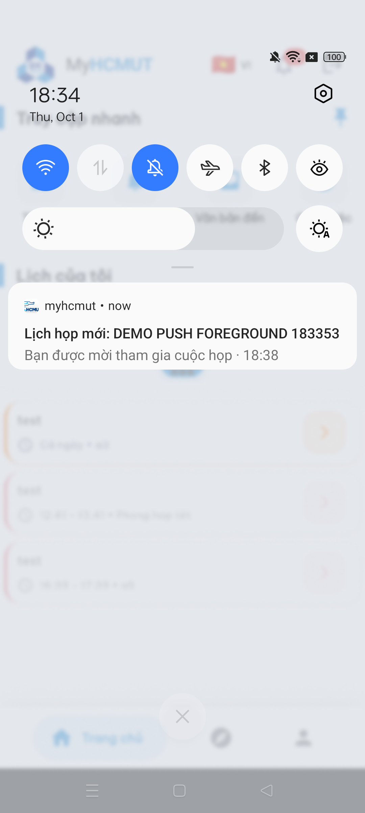
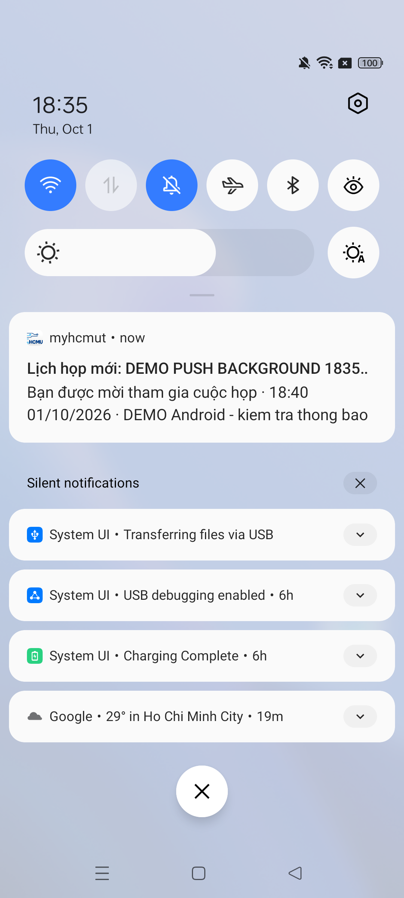

# Kiểm chứng push lời mời lịch Trường trên thiết bị thật

## 1. Mốc và điều kiện

- Thời gian: 01/10/2026, khoảng 18:21–18:36, Asia/Ho_Chi_Minh.
- iOffice: `4ca9249c2ab4a478ee62ea3d53d961ca5de8e2fb`, nhánh `chinh-khang`; thay đổi gửi sớm nằm ở commit nền `96b21cf`.
- Mobile: `61722adcb66d0fb50deb6e529dd7a5a10103147d`, nhánh `feat/leaveRequest`; APK debug được build/cài bằng `make run-dev`.
- Thiết bị thật: RMX2151, Android 12, kết nối Wi-Fi; quyền thông báo được cấp. Backend iOffice chạy cục bộ cổng 3001.
- Tài khoản được người dùng đổi sang vai trò có `scheduleGeneral:write`. Không lưu tên, SHCC, UUID, JWT hoặc FCM token trong biên bản.

## 2. Lỗi tìm thấy và sửa chữa

1. Mobile chỉ đăng ký token tại HRM; iOffice có 0 token cho tài khoản đang dùng, nên không có địa chỉ chuyển phát lời mời. Sửa mobile đồng bộ độc lập tới hai backend; bổ sung endpoint iOffice lấy chủ sở hữu từ session.
2. Sau đăng ký, lần tạo lịch 382 lưu được lời mời 1327 nhưng Firebase trả `app/invalid-credential`, thông tin `invalid_grant: Invalid JWT Signature`. Sender cũ xóa token ở mọi lỗi. Sửa để giữ token khi lỗi khóa/dịch vụ, chỉ xóa khi Firebase xác nhận token không hợp lệ/không còn đăng ký; log không chứa token.
3. Khóa HRM hiện có cùng project vượt qua phép kiểm tra Firebase với token điện thoại; đã dùng cho `.env.local` của iOffice cục bộ và khởi động lại backend. `.env.local` không được đưa vào commit; không sao chép thông tin khóa vào tài liệu.

## 3. Thao tác và quan sát thật

Request tạo được gửi tới `POST /api/schedule/general-item/general/create` bằng phiên đang đăng nhập trên app. Thành phần đích danh là chính tài khoản trên điện thoại; thêm slot đơn vị `01` không có SHCC để đáp ứng validation lịch Trường. Slot đơn vị không mở rộng thành người nhận push. Không yêu cầu phát hành hoặc gọi API phát hành.

| Lượt | App | Lịch / thông báo hộp thư | Trạng thái sau thử | Kết quả trên thiết bị |
| --- | --- | --- | --- | --- |
| Trước sửa khóa Firebase | Đang mở | 382 / 1327 | Bước 3 `TONG_HOP` | Không nhận push; Firebase từ chối credential |
| Sau sửa, foreground | Đang mở | 383 / 1328 | Bước 3 `TONG_HOP` | Nhận `Lịch họp mới: DEMO PUSH FOREGROUND 183353`; bấm mở Lịch biểu |
| Sau sửa, background | Đã nhấn Home | 384 / 1329 | Bước 3 `TONG_HOP` | Nhận `Lịch họp mới: DEMO PUSH BACKGROUND 183503`; bấm mở app và Lịch biểu |

Đối chiếu truy vấn dữ liệu xác nhận mỗi lời mời có một tài khoản nhận, cả ba lịch vẫn ở `TONG_HOP`. Android `dumpsys notification --noredact` được dùng để kiểm tra đúng tiêu đề/nội dung của app; chỉ ghi kết quả liên quan, không đưa dump thiết bị vào repository. Thông báo có tên lịch, giờ và địa điểm demo, không cần phát hành để xuất hiện.

### Ảnh thông báo foreground

### Ảnh thông báo background

## 4. Kiểm tra tự động và build

| Lệnh / phép kiểm tra | Kết quả |
| --- | --- |
| iOffice `node --test test/*.test.js` | 47/47 đạt: gồm 4 test đăng ký thiết bị và 4 test giữ/xóa token theo lỗi Firebase mới |
| Mobile `cd modules/notification && flutter test --no-pub --reporter expanded` | 64/64 đạt, gồm 3 tình huống đồng bộ hai backend |
| `make analyze` | Cả 11 package không có vấn đề |
| `MELOS_PACKAGES=notification make format` | 39 file, không phát sinh thay đổi format ngoài phạm vi |
| `node --check` hai file backend sửa và kiểm tra staged diff | Đạt |
| HTTP đăng ký token không có phiên | 401 `request-login` |
| HTTP đăng ký token trống trong phiên hợp lệ | 400 |
| `make run-dev` | Build/cài APK debug và chạy trên RMX2151 |

GitNexus báo phạm vi mobile rủi ro thấp. iOffice chưa có chỉ mục trong MCP, nên kiểm tra phạm vi bằng mã nguồn/diff và test; không coi lỗi thiếu chỉ mục là kết quả phân tích an toàn.

## 5. Giới hạn dùng trong báo cáo

- Đã xác nhận chuyển phát push trong cấu hình demo cụ thể. Chưa thử iOS, release, nhiều thiết bị/người nhận hoặc phát hành lịch thật.
- Request tạo ở lượt này dùng API thật; không coi đó là nghiệm thu đầy đủ biểu mẫu mobile, upload tệp và thử lại sau lỗi.
- Router hiện tại đưa push lịch về `/ioffice/schedule`. Không viết rằng bấm push đã mở thẳng chi tiết theo ID.
- Lời mời sớm là điều chỉnh phục vụ demo; lịch vẫn chưa phát hành. Luồng phát hành hiện có vẫn gửi thông báo tiếp theo.
- Không bảo đảm mọi thiết bị luôn nhận hoặc exactly-once; sender sau commit chưa có retry bền vững riêng.
- Các lịch demo 382–384 và thông báo 1327–1329 được giữ để đối chiếu; chưa xóa hoặc phát hành chúng.
