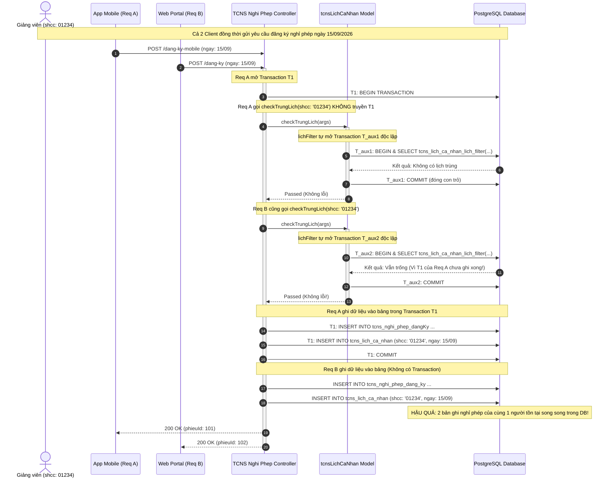

# Báo Cáo Kiểm Toán Các Đường Ghi & Lỗ Hổng Tương Tranh (00B_CONCURRENCY_WRITE_PATH_AUDIT)

**Dự án:** Hệ Thống Quản Lý Nhân Sự (`hrm-be`)  
**Worktree:** `/home/xchinh/workspace/hrm-be-worktree-concurrency`  
**Nhánh:** `refactor/check-trung-lich-advisory-lock`  
**Commit cơ sở:** `15a6e321b93e35fbf18f7ecca883188b1cd3ae46`  
**Tiểu ban thực hiện:** Concurrency Path Auditor Subagent  
**Ngày thực hiện:** 2026-09-09  

---

## 1. Tóm Tắt Điều Hành (Executive Summary)

Kiểm toán mã nguồn trên worktree `hrm-be-worktree-concurrency` tập trung vào mô-đun Lịch cá nhân (`tcns_lich_ca_nhan`) và Nghỉ phép (`tcns_nghi_phep`). Kết quả kiểm toán chỉ ra rằng toàn bộ hệ thống đăng ký và điều chỉnh lịch hiện tại đang tồn tại **lỗ hổng tương tranh nghiêm trọng (Critical Concurrency Flaws)**:
1. **Kiểm tra trùng lịch không có khóa (Non-locking Check-Then-Act):** Phương thức `checkTrungLich` hoàn toàn không hỗ trợ lan truyền giao dịch (`transaction`), đồng thời phương thức nền tảng `lichFilter` tự ý khởi tạo transaction riêng và `commit` lập tức, đóng con trỏ kết quả. Điều này phá vỡ ranh giới giao dịch bên ngoài.
2. **Không có cơ chế khóa tương tranh (Missing Mutex / Advisory Locks):** Không có bất kỳ khóa mức hàng (`FOR UPDATE`) hay khóa ứng dụng (`pg_advisory_xact_lock`) nào được áp dụng theo mã số viên chức (`shcc`). Hai yêu cầu đồng thời từ cùng một nhân viên có thể vượt qua bước kiểm tra tại cùng một thời điểm và chèn hai lịch đè lên nhau (Double-Booking Anomaly).
3. **Thiếu vắng Transaction trên các đường ghi Web & Sửa/Xóa:** Endpoint `POST /dang-ky` (Web) và `PUT /dang-ky` hoàn toàn không chạy trong Transaction. Lệnh `DELETE /dang-ky/:id` thực thi `Promise.all` trên 5 bảng độc lập không có Transaction bảo bọc, tạo nguy cơ mồ côi dữ liệu (Orphan Records).
4. **Vi phạm Atomic State Guard:** Các điều kiện kiểm tra trạng thái (`maQuyTrinh == 'NHAP'`) được thực hiện trên tầng bộ nhớ ứng dụng mà không có mệnh đề `WHERE` nguyên tử trong câu lệnh SQL `UPDATE`, dẫn đến lỗi Lost Update hoặc chuyển trạng thái không hợp lệ.
5. **Rủi ro Dual-Write với Kafka / Notification:** Gửi thông báo qua Kafka (`sendQuyTrinhNotification`) không được gắn với Transaction Hook (`afterCommit`) tại hầu hết các endpoint, dẫn đến nguy cơ phát tán thông báo "ma" (Ghost Events) khi cơ sở dữ liệu gặp lỗi rollback.

---

## 2. Kiểm Toán Chi Tiết: Phương Thức `checkTrungLich`

**Tệp tin:** `modules/md_tcns/tcns_lich_ca_nhan/model/tcns_lich_ca_nhan.model.ts` (Dòng 145-213)

### 2.1. Hiện trạng mã nguồn

```typescript
// tcns_lich_ca_nhan.model.ts
export interface ITcnsLichCaNhan extends IModelStatic<...> {
    /* KHÔNG CÓ options?: { transaction?: Sequelize.Transaction } */
    checkTrungLich: (args: { shcc: string[], ngayBatDau: number, ngayKetThuc: number, period: string, periodKetThuc: string, id: number, phanLoai: string }) => Promise<void>
};

static checkTrungLich = async (
    { shcc, ngayBatDau, ngayKetThuc, period, periodKetThuc, id, phanLoai }: { shcc: string[], ngayBatDau: number, ngayKetThuc: number, period: string, periodKetThuc: string, id: number, phanLoai: string }
) => {
    const startCoef = period == 'SANG' ? 0 : 1,
        endCoef = periodKetThuc == 'SANG' ? 1 : 2;

    // LỖI 1: lichFilter được gọi mà KHÔNG truyền options.transaction
    const { list } = await this.lichFilter(JSON.stringify({ shcc, ngayBatDau: ngayBatDau + startCoef, ngayKetThuc: ngayKetThuc + endCoef })) as unknown as TLichFilter;
    const overlap = list.filter(i => i.phanLoai != phanLoai || i.phieuId != id);
    if (!overlap.length) return;

    // LỖI 2: findAll truy vấn trực tiếp model ngoài transaction
    const khongRoiViTri = await this.model.findAll({
        where: {
            isRoiViTri: false,
            shcc: { [Op.in]: shcc },
            phanLoai: { [Op.in]: [...new Set(overlap.map(i => i.phanLoai))] },
            phieuId: { [Op.in]: [...new Set(overlap.map(i => i.phieuId))] },
        },
        attributes: ['phanLoai', 'phieuId'],
        raw: true,
    });
    const boQua = new Set(khongRoiViTri.map(i => `${i.phanLoai}:${i.phieuId}`));

    const trung = overlap.find(i => !boQua.has(`${i.phanLoai}:${i.phieuId}`));
    if (trung) throw new ValidationError(`Trùng thời gian ${QUY_TRINH_CONSTANT[trung.phanLoai].toLowerCase()}${shcc.length == 1 ? '' : ` của ${trung.hoTen}`}`);
}
```

Và hàm `lichFilter`:
```typescript
static lichFilter = async (filter: string, options: { transaction?: Sequelize.Transaction } = {}): Promise<ILichFilter> => {
    // LỖI 3: Nếu options.transaction không có, tự mở transaction t
    const t = options.transaction || await BkcoretechModel.connection.transaction();
    try {
        const callResults: string[] = [`ref_${this.uniqueId()}`];
        await BkcoretechModel.connection.query(`select tcns_lich_ca_nhan_lich_filter(\'${callResults[0]}\', :filter);`, {
            replacements: { filter: filter }, raw: true, transaction: t
        }) as [Array<{ tcns_lich_ca_nhan_lich_filter: string }>, { rows: unknown[] }];
        const [callResult0] = await Promise.all(callResults.map(i => BkcoretechModel.connection.query(`fetch all in ${i};`, { raw: true, transaction: t }).then(r => r[0])));
        
        // LỖI 4: Commit transaction t ngay lập tức!
        !options.transaction && await t.commit();
        return {
            list: callResult0
        } as unknown as ILichFilter;
    } catch (error) {
        console.error('tcns_lich_ca_nhan_lich_filter', error);
        !options.transaction && await t.rollback();
        throw error;
    }
}
```

### 2.2. Phân tích lỗ hổng kỹ thuật
1. **Thiếu hoàn toàn tham số `options?: { transaction?: Transaction }` trong định nghĩa interface và implementation của `checkTrungLich`:**
   Mọi caller khi gọi `checkTrungLich` không thể chuyển giao ngữ cảnh transaction đang chạy vào bước kiểm tra này.
2. **Inner Transaction Commit sớm (Premature Commit Anomaly):**
   Vì `checkTrungLich` không truyền transaction xuống `lichFilter`, dòng code:
   `const t = options.transaction || await BkcoretechModel.connection.transaction();`
   sẽ tự động xin một database connection khác trong pool và mở một transaction độc lập. Sau khi gọi function và `fetch all`, nó gọi `await t.commit();`. Transaction độc lập này kết thúc ngay lập tức.
3. **Phá vỡ tính cô lập (Broken Isolation):**
   Truy vấn đọc `tcns_lich_ca_nhan_lich_filter` chạy trên snapshot của kết nối độc lập, hoàn toàn không thấy các bản ghi chưa commit của transaction cha (nếu có). Đồng thời, không có cơ chế `LOCK TABLE`, `SELECT FOR UPDATE`, hay `pg_advisory_xact_lock` nào được thiết lập.
4. **Không có khả năng serialize:**
   Khoảng thời gian từ lúc `checkTrungLich` kết thúc (trả về `void`) đến lúc dữ liệu mới được insert vào bảng `tcns_lich_ca_nhan` hoàn toàn không được bảo vệ.

---

## 3. Kiểm Toán Các Endpoint Trong `tcns_nghi_phep/controller.ts`

### 3.1. Endpoint `POST /api/upload/tcns-nghi-phep/dang-ky-mobile` (Dòng 185-246)
* **Transaction Boundary:** Có mở `transaction = await BkcoretechModel.connection.transaction()`.
* **Vị trí gọi `checkTrungLich`:** Dòng 198 gọi `await app.model.tcnsLichCaNhan.checkTrungLich(...)` nằm bên trong khối `try`, nhưng **không truyền `transaction`** vào hàm.
* **Cơ chế Lock:** Hoàn toàn **không có lock**. Không có advisory lock theo `shcc`.
* **Phân tích rủi ro:**
  Mặc dù phần ghi dữ liệu (`tcnsNghiPhepDangKy.create`, `tcnsQuyTrinh.bulkCreate`, `tcnsLichCaNhan.create`) có truyền `{ transaction }`, việc kiểm tra trùng lịch chạy độc lập không khóa. Hai request gửi đồng thời từ ứng dụng di động (hoặc do người dùng bấm đúp, hoặc mạng chập chờn retry) cùng đọc được bảng lịch trống, cùng pass qua dòng 198, sau đó cả hai cùng insert và commit thành công. Kết quả: **2 phiếu nghỉ phép trùng thời gian được chấp thuận vào hệ thống**.

### 3.2. Endpoint `POST /api/upload/tcns-nghi-phep/dang-ky` (Web) (Dòng 131-183)
* **Transaction Boundary:** **HOÀN TOÀN KHÔNG CÓ TRANSACTION**.
* **Vị trí gọi `checkTrungLich`:** Dòng 154 gọi ngoài transaction.
* **Ghi dữ liệu phân mảnh:**
  - Dòng 157: `app.model.tcnsNghiPhepDangKy.create(...)`
  - Dòng 166: `Promise.all([ app.model.tcnsQuyTrinh.bulkCreate(...), app.model.tcnsLichCaNhan.create(...), ... ])`
  - Dòng 175: `await updateHistory(...)` (nếu `isSend`)
* **Phân tích rủi ro:**
  - Race condition tuyệt đối: Không lock, không transaction.
  - Partial Write Failure: Nếu bước `bulkCreate` quy trình hoặc `tcnsLichCaNhan.create` ném lỗi (ví dụ lỗi DB connection, quá tải), bản ghi `tcns_nghi_phep_dang_ky` đã được tạo trước đó ở dòng 157 không bị rollback, trở thành dữ liệu rác không có lịch và không có quy trình duyệt.

### 3.3. Endpoint `PUT /api/upload/tcns-nghi-phep/dang-ky` (Dòng 248-302)
* **Transaction Boundary:** **HOÀN TOÀN KHÔNG CÓ TRANSACTION**.
* **Vị trí gọi `checkTrungLich`:** Dòng 261 gọi trước khi kiểm tra quyền sở hữu phiếu.
* **Thiếu Atomic State Guard (Check-Then-Act Concurrency Bug):**
  - Dòng 263-264: Đọc `phieu` từ DB lên memory, kiểm tra:
    `if (phieu.maQuyTrinh != 'NHAP' && !targets.find(i => i.trangThai == 'GUI_LAI')) throw ...`
  - Đây là thao tác kiểm tra trên bộ nhớ ứng dụng. Nếu ngay tại thời điểm này, cấp trên đang thực hiện duyệt phiếu (`POST /duyet`) hoặc phiếu đang bị thu hồi, trạng thái của phiếu trong DB đã thay đổi.
  - Dòng 289-292:
    ```typescript
    await Promise.all([
        app.model.tcnsNghiPhepDangKy.update({ id }, { ...updateData, ... }),
        app.model.tcnsLichCaNhan.update({ phieuId: id, phanLoai: PHAN_LOAI }, { ngayBatDau, ... })
    ]);
    ```
    Lệnh `update` thực thi câu lệnh SQL dạng:
    `UPDATE tcns_nghi_phep_dang_ky SET ... WHERE id = :id;`
    Câu lệnh **hoàn toàn thiếu mệnh đề guard nguyên tử** `AND ma_quy_trinh = 'NHAP'`, do đó ghi đè mù (Blind Overwrite / Lost Update), làm sai lệch toàn bộ trạng thái đang được duyệt của cấp trên.
* **Cập nhật song song không transaction:** Hai bảng `tcns_nghi_phep_dang_ky` và `tcns_lich_ca_nhan` được update đồng thời qua `Promise.all`. Nếu một lệnh thành công và một lệnh thất bại, thời gian nghỉ phép trong phiếu đăng ký và thời gian trong lịch cá nhân sẽ lệch nhau (Divergent State).
* **`updateHistory` chạy rời rạc:** Dòng 295 gọi `updateHistory` không có transaction, bao gồm nhiều câu lệnh xoá và chèn liên bảng (`tcnsQuyTrinhUser.delete`, `tcnsQuyTrinhHistory.create`, `tcnsQuyTrinhUser.bulkCreate`).

### 3.4. Endpoint `DELETE /api/tcns-nghi-phep/dang-ky/:id` (Dòng 304-321)
* **Transaction Boundary:** **HOÀN TOÀN KHÔNG CÓ TRANSACTION**.
* **Thao tác xóa đa bảng (Dòng 312-318):**
  ```typescript
  await Promise.all([
      app.model.tcnsNghiPhepDangKy.delete({ id }),
      app.model.tcnsLichCaNhan.delete({ phieuId: id, phanLoai: PHAN_LOAI }),
      app.model.tcnsQuyTrinh.delete({ phieuId: id, phanLoai: PHAN_LOAI }),
      app.model.tcnsQuyTrinhHistory.delete({ phieuId: id, phanLoai: PHAN_LOAI }),
      app.model.tcnsQuyTrinhUser.delete({ phieuId: id, phanLoai: PHAN_LOAI }),
  ]);
  ```
* **Phân tích rủi ro:**
  1. **Nguy cơ Zombie / Orphan Records (Bản ghi mồ côi):**
     5 câu lệnh `DELETE` được bắn song song trên 5 kết nối độc lập. Nếu 1 kết nối bị lỗi hoặc chết giữa chừng:
     - Trường hợp `tcnsNghiPhepDangKy` bị xóa nhưng `tcnsLichCaNhan` xóa thất bại: Nhân viên không còn thấy phiếu nghỉ phép để thao tác, nhưng bản ghi lịch cá nhân vẫn tồn tại vĩnh viễn trong DB. Khi nhân viên đăng ký bất kỳ lịch nào trong tương lai vào khoảng ngày này đều bị báo lỗi "Trùng thời gian nghỉ phép" mà không thể tự gỡ được.
     - Trường hợp ngược lại: `tcnsNghiPhepDangKy` còn nguyên nhưng lịch và các bước quy trình bị mất một phần.
  2. **Thiếu Lock & Non-atomic State Check:**
     Không có `SELECT ... FOR UPDATE` khi đọc phiếu ở dòng 306. Nếu người dùng mở 2 tab và bấm Xóa cùng lúc với lúc Leader bấm Duyệt, có thể dẫn đến việc bản ghi bị xóa sau khi đã được phê duyệt.

### 3.5. Endpoint Tra Cứu & Pre-flight: `POST /api/tcns-nghi-phep/validate` (Dòng 81-129)
* **Bản chất:** Read-only endpoint (tra cứu tính hợp lệ trước khi bấm gửi).
* **Đặc tính kỹ thuật:** Gọi `checkTrungLich` và kiểm tra hạn đăng ký trước (`getEarliestAllowedStart`).
* **Vấn đề Concurrency (TOCTOU - Time-Of-Check to Time-Of-Use):**
  Endpoint này trả về `{ isValid: true }` cho Client. Tuy nhiên, kết quả này chỉ có giá trị tại mili-giây nó chạy. Client hiển thị form cho phép nhấn "Lưu", nhưng không có gì đảm bảo tại thời điểm Client nhấn nút submit, khoảng thời gian đó vẫn còn trống. Nếu hệ thống tin tưởng kết quả validate phía client mà không khóa và re-check an toàn tại endpoint ghi, xung đột lịch chắc chắn xảy ra.

### 3.6. Các Endpoint Quản Lý & Phê Duyệt Khác
* `POST /user-phase` (Dòng 323): Khi thu hồi (`THU_HOI`), gọi `tcnsLichCaNhan.delete` và `updateHistory` mà không có transaction.
* `POST /thu-hoi` (Dòng 390): Chạy `Promise.all` trên 4 bảng (`tcnsQuyTrinhHistory`, `tcnsNghiPhepDangKy`, `tcnsLichCaNhan`, `tcnsNghiPhep`) không có transaction.
* `POST /duyet` (Dòng 425): Xử lý duyệt và kết thúc phiếu (`insert` vào bảng chính `tcns_nghi_phep`), hoặc từ chối (`tcnsLichCaNhan.delete`) mà không có transaction bao bọc.

---

## 4. Kiểm Toán Cơ Chế Publish Kafka & Rủi Ro Dual-Write

### 4.1. Kiến trúc phát sự kiện qua Kafka
Trong hệ thống:
1. `modules/md_tcns/tcns_quy_trinh/helper.ts`:
   ```typescript
   export const sendQuyTrinhNotification = async ({
       phanLoai, phieuId, phieuShcc, trangThai, maQuyTrinh, transaction
   }: ISendNotification) => {
       const notificationData = { phanLoai, phieuId, phieuShcc, trangThai, maQuyTrinh };
       if (transaction) {
           transaction.afterCommit(() => executeSendNotification(notificationData));
       } else await executeSendNotification(notificationData);
   };
   ```
2. `executeSendNotification` gọi `app.notification.send(...)`.
3. `config/lib/notification.ts`:
   ```typescript
   export class Notification {
       static async send(data: TNotificationServiceSend) {
           ...
           await app.kafkaClient.send(app.kafkaClient.topics.SEND_NOTIFY_SERVICE.topic, {
               key: data.title,
               value: JSON.stringify(data),
           });
       }
   }
   ```

### 4.2. Lỗ hổng Dual-Write và Thông Báo Ma (Ghost Notification Anomaly)
1. **Bỏ qua Post-commit Hook khi gọi từ `updateHistory`:**
   Tại `tcns_nghi_phep/controller.ts` dòng 62:
   ```typescript
   sendQuyTrinhNotification({ phanLoai: PHAN_LOAI, phieuId: id, phieuShcc, trangThai: trangThai == 'TIEP_TUC' ? 'DUYET' : trangThai, maQuyTrinh });
   ```
   Hàm `updateHistory` **hoàn toàn không nhận và không truyền tham số `transaction`**.
   Do đó, trong `sendQuyTrinhNotification`, nhánh `if (transaction)` bị bỏ qua, hệ thống rơi vào nhánh `else await executeSendNotification(...)`.
2. **Hậu quả của việc kích hoạt Kafka tức thời (Premature Kafka Dispatch):**
   - Message Kafka được gửi tới broker `SEND_NOTIFY_SERVICE` ngay lập tức trước khi hoặc độc lập với việc commit database.
   - Nếu transaction phía ngoài gặp lỗi (hoặc request bị crash, timeout), dữ liệu trong PostgreSQL bị hủy bỏ hoặc không nhất quán, nhưng Consumer bên ngoài đã nhận được event Kafka và bắn Push Notification / Email tới người dùng hoặc cấp quản lý.
   - Người quản lý nhận được thông báo "Bạn có phiếu nghỉ phép cần duyệt", click vào link hệ thống thì nhận lỗi 404 "Phiếu đăng ký không tồn tại".

---

## 5. Bảng Ma Trận Các Đường Ghi (Write Path Audit Matrix)

| Endpoint | Method | Transaction Hiện Tại | Check Trùng Lịch | Khóa Tương Tranh (Lock) | Mức Độ Rủi Ro | Nguy Cơ Concurrency Chi Tiết |
| :--- | :---: | :---: | :---: | :---: | :---: | :--- |
| `/api/upload/tcns-nghi-phep/dang-ky-mobile` | `POST` | **Có** (Cục bộ, không lan truyền) | Có gọi, nhưng **ngoài transaction** | **Không có** | **CRITICAL** | **Double-Booking:** 2 request đồng thời đều vượt qua `checkTrungLich` và tạo 2 lịch đè nhau. |
| `/api/upload/tcns-nghi-phep/dang-ky` | `POST` | **KHÔNG** | Có gọi, độc lập hoàn toàn | **Không có** | **CRITICAL** | **Race Condition & Partial Write:** Vừa bị trùng lịch vừa có nguy cơ tạo bản ghi rác nếu crash ở giữa. |
| `/api/upload/tcns-nghi-phep/dang-ky` | `PUT` | **KHÔNG** | Có gọi, độc lập hoàn toàn | **Không có** | **CRITICAL** | **Lost Update & Divergent State:** Blind update không có atomic state guard; lệch ngày giữa phiếu và lịch. |
| `/api/tcns-nghi-phep/dang-ky/:id` | `DELETE` | **KHÔNG** | Không | **Không có** | **HIGH** | **Orphan Records:** `Promise.all` 5 bảng không atomic; 1 bảng lỗi gây nghẽn lịch vĩnh viễn do lịch không xóa được. |
| `/api/tcns-nghi-phep/validate` | `POST` | **Không cần** (Read-only) | Có gọi (Inner transaction tự commit) | **Không có** | **MEDIUM** | **TOCTOU Anomaly:** Validate trả về hợp lệ nhưng không giữ lock, gây false-positive cho client khi submit. |
| `/api/tcns-nghi-phep/user-phase` | `POST` | **KHÔNG** | Không | **Không có** | **HIGH** | **Race Condition:** Thu hồi và cập nhật trạng thái không atomic; gửi thông báo Kafka ngoài transaction. |
| `/api/upload/tcns-nghi-phep/thu-hoi` | `POST` | **KHÔNG** | Không | **Không có** | **HIGH** | **Inconsistent State:** Cập nhật trạng thái và xoá lịch trên 4 bảng qua `Promise.all` không có transaction. |
| `/api/tcns-nghi-phep/duyet` | `POST` | **KHÔNG** | Không | **Không có** | **HIGH** | **Dual-Write:** Gửi notification duyệt qua Kafka ngay cả khi quá trình ghi dữ liệu sau đó có thể fail. |
| `/api/tcns-nghi-phep/duyet/tiep-tuc`| `POST` | **KHÔNG** | Không check lại | **Không có** | **HIGH** | **Conflict Re-activation:** Tạo lại lịch cá nhân nhưng không check trùng lịch thời điểm duyệt lại. |
| `/api/tcns-nghi-phep/duyet-multiple`| `POST` | **KHÔNG** | Không | **Không có** | **MEDIUM** | **Partial Loop Failure:** Vòng lặp `for` duyệt nhiều phiếu không có transaction cô lập từng phiếu. |

---

## 6. Sequence Diagram: Kịch Bản Trùng Lịch (Double-Booking Anomaly)

Dưới đây là mô tả chi tiết luồng tương tranh xảy ra giữa Request A (từ Mobile) và Request B (từ Web hoặc Mobile retry) của cùng một cán bộ viên chức (`shcc: '01234'`) xin nghỉ cùng ngày `2026-09-15`.



---

## 7. Đề Xuất Kiến Trúc Khắc Phục (Hardening Blueprint)

Để giải quyết triệt để tất cả các lỗ hổng nêu trên, kiến trúc refactor cần tuân thủ 4 trụ cột kỹ thuật:

### 7.1. Trụ cột 1: PostgreSQL Transaction-scoped Advisory Lock
Áp dụng cơ chế khóa tương tranh cấp giao dịch của PostgreSQL thông qua `pg_advisory_xact_lock`. Khóa này tự động được giải phóng ngay khi transaction `COMMIT` hoặc `ROLLBACK`, hoàn toàn loại bỏ rủi ro treo khóa (deadlock leak).

* **Định danh khóa:** Sử dụng hàm băm chuỗi kết hợp tiền tố domain và mã số viên chức để cô lập theo từng người dùng:
  ```sql
  SELECT pg_advisory_xact_lock(hashtext('tcns_lich_ca_nhan:' || :shcc));
  ```
  Nếu một yêu cầu khác của cùng `shcc` đang diễn ra, yêu cầu đến sau sẽ tự động chờ (serialize) cho đến khi yêu cầu đầu tiên hoàn tất commit, đảm bảo tính nhất quán tuyệt đối.

### 7.2. Trụ cột 2: Transaction Propagation Toàn Diện
Tái cấu trúc lại `tcnsLichCaNhan.model.ts`:
1. Mở rộng interface:
   ```typescript
   checkTrungLich: (
       args: { shcc: string[], ngayBatDau: number, ngayKetThuc: number, period: string, periodKetThuc: string, id: number, phanLoai: string },
       options?: { transaction?: Sequelize.Transaction }
   ) => Promise<void>;
   ```
2. Trong `checkTrungLich`:
   Bắt buộc truyền `options` (chứa `transaction`) xuống `lichFilter` và `this.model.findAll`.
3. Trong `lichFilter`:
   Khi nhận `options.transaction`, sử dụng trực tiếp transaction đó và **tuyệt đối không gọi `t.commit()` hay `t.rollback()`**, nhường quyền quản lý vòng đời cho transaction cha ngoài controller.

### 7.3. Trụ cột 3: Atomic State Guard & Comprehensive Transactions Cho Từng Endpoint
1. **Endpoint `POST /dang-ky` (Web) & `POST /dang-ky-mobile`:**
   Bao bọc toàn bộ chu trình trong một `Sequelize.Transaction`. Thực hiện lấy `pg_advisory_xact_lock` ngay sau khi mở transaction trước khi gọi `checkTrungLich`.
2. **Endpoint `PUT /dang-ky`:**
   Mở Transaction + Lấy Advisory Lock.
   Chuyển thao tác kiểm tra trạng thái thành Atomic CAS (Compare-And-Swap) ở tầng SQL:
   ```typescript
   const [affectedRows] = await app.model.tcnsNghiPhepDangKy.update(
       { ...updateData },
       {
           where: {
               id,
               maQuyTrinh: ['NHAP', 'TRA_LAI']
           },
           transaction
       }
   );
   if (affectedRows === 0) {
       throw new ValidationError('Phiếu đăng ký đã thay đổi trạng thái hoặc không hợp lệ');
   }
   ```
3. **Endpoint `DELETE /dang-ky/:id`:**
   Bao bọc 5 câu lệnh xóa trong một transaction duy nhất. Đảm bảo tính nguyên tử: hoặc toàn bộ 5 bảng được làm sạch, hoặc không có bảng nào bị xóa dở dang.

### 7.4. Trụ cột 4: Triệt Tiêu Dual-Write Bằng Post-Commit Hooks
1. Bổ sung tham số `transaction` vào chữ ký của hàm `updateHistory`.
2. Chuyển tiếp `transaction` tới `sendQuyTrinhNotification`.
3. Tận dụng triệt để hook `transaction.afterCommit(() => ...)` đã có sẵn trong `tcns_quy_trinh/helper.ts`: Message Kafka chỉ được phép gửi ra ngoài mạng sau khi cơ sở dữ liệu PostgreSQL đã ghi nhận giao dịch thành công 100%.

---

## 8. Kết Luận Bàn Giao

Toàn bộ các bằng chứng kỹ thuật và phân tích luồng mã nguồn đã được ghi nhận chi tiết và khách quan. Hiện trạng mã nguồn tại commit `15a6e321` trên nhánh `refactor/check-trung-lich-advisory-lock` đã sẵn sàng cho bước triển khai mã nguồn khắc phục lỗi (Hardening Implementation).
