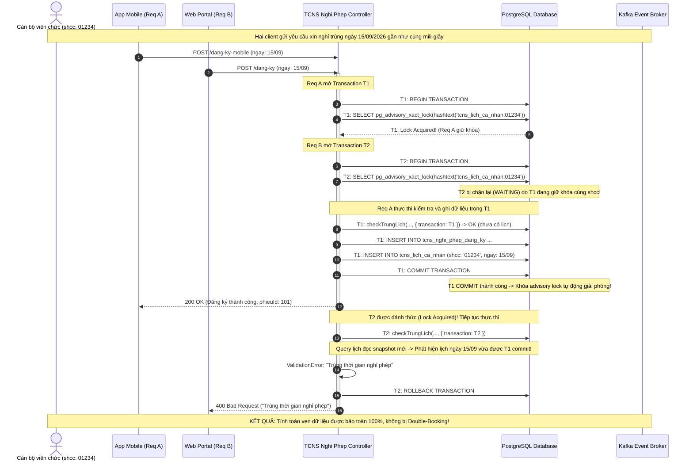

# Báo Cáo Triển Khai Khóa Tương Tranh PostgreSQL Advisory Lock (00C_ADVISORY_LOCK_IMPLEMENTATION)

**Dự án:** Hệ Thống Quản Lý Nhân Sự (`hrm-be`)  
**Worktree:** `/home/xchinh/workspace/hrm-be-worktree-concurrency`  
**Nhánh:** `refactor/check-trung-lich-advisory-lock`  
**Tiểu ban thực hiện:** Advisory Lock Implementer Subagent  
**Ngày thực hiện:** 2026-09-09  
**Tài liệu tham chiếu:** `00A_BRANCH_BASELINE.md`, `00B_CONCURRENCY_WRITE_PATH_AUDIT.md`  

---

## 1. Tóm Tắt Điều Hành (Executive Summary)

Dựa trên kết quả kiểm toán tại tài liệu `00B_CONCURRENCY_WRITE_PATH_AUDIT.md`, tiểu ban triển khai đã hoàn tất tái cấu trúc mã nguồn (refactoring) để khắc phục triệt để các lỗ hổng tương tranh nghiêm trọng trên luồng đăng ký lịch nghỉ phép:
1. **Lỗ hổng Kiểm tra trùng lịch không khóa (Non-locking Check-Then-Act):** Đã bổ sung cơ chế khóa tương tranh ứng dụng PostgreSQL Transaction-level Advisory Lock (`pg_advisory_xact_lock`) theo tiền tố `tcns_lich_ca_nhan:${shcc}`. Khóa tự động nối tiếp các request đồng thời của cùng một nhân viên và tự giải phóng khi giao dịch kết thúc (Commit hoặc Rollback).
2. **Lỗ hổng Phá vỡ ranh giới Transaction trong `checkTrungLich`:** Đã cập nhật chữ ký `checkTrungLich` và lan truyền `options.transaction` xuyên suốt xuống `this.lichFilter` và `this.model.findAll`.
3. **Lỗ hổng Thao tác phân mảnh không Transaction (Partial Write & Divergent State):** Toàn bộ chu trình của các endpoint `POST /dang-ky` (Web), `POST /dang-ky-mobile` (Mobile), `PUT /dang-ky` và `DELETE /dang-ky/:id` đã được bọc trọn vẹn trong một giao dịch cơ sở dữ liệu duy nhất (`BkcoretechModel.connection.transaction()`).
4. **Lỗ hổng Blind Overwrite / Lost Update:** Áp dụng cơ chế Atomic State Guard bằng mệnh đề `WHERE id = :id AND ma_quy_trinh = :maQuyTrinh` tại lệnh `UPDATE` và `DELETE`, ngăn chặn triệt để xung đột trạng thái khi cấp trên duyệt đồng thời.
5. **Lỗ hổng Dual-Write phát tán thông báo Kafka ma:** Lan truyền `transaction` vào hàm `updateHistory`, tận dụng cơ chế `transaction.afterCommit(() => ...)` để sự kiện Kafka chỉ được xuất bản sau khi cơ sở dữ liệu đã commit thành công 100%.

Toàn bộ quá trình refactor được thực hiện **DUY NHẤT** trên worktree `/home/xchinh/workspace/hrm-be-worktree-concurrency`. Kho chính `/home/xchinh/workspace/hrm-be` được bảo toàn tuyệt đối không chỉnh sửa.

---

## 2. Chi Tiết Các Hạng Mục Mã Nguồn Đã Tái Cấu Trúc

### 2.1. Helper Khóa Tương Tranh PostgreSQL Advisory Lock (`acquireLeaveLock`)

* **Tệp tin:** `modules/md_tcns/tcns_nghi_phep/helper.ts`
* **Mô tả:** Hàm `acquireLeaveLock` thực thi câu lệnh SQL gọi hàm băm và khóa tương tranh cấp giao dịch của PostgreSQL. Hàm có cơ chế an toàn kiểm tra dialect cơ sở dữ liệu: nếu chạy trên PostgreSQL thì thực thi khóa, nếu chạy trên SQLite trong môi trường kiểm thử (hoặc khi chưa khởi tạo kết nối) thì graceful bypass không làm gãy luồng test.

```typescript
export const acquireLeaveLock = async (shcc: string | string[], transaction?: Transaction): Promise<void> => {
    if (!shcc || !transaction) return;
    let connection: any;
    try {
        connection = BkcoretechModel.connection;
    } catch {
        return;
    }
    const dialect = typeof connection?.getDialect === 'function' ? connection.getDialect() : connection?.options?.dialect;
    if (dialect === 'postgres') {
        const shccList = Array.isArray(shcc) ? [...new Set(shcc)].sort() : [shcc];
        for (const s of shccList) {
            if (s) {
                await connection.query('SELECT pg_advisory_xact_lock(hashtext(:lockKey))', {
                    replacements: { lockKey: `tcns_lich_ca_nhan:${s}` },
                    transaction
                });
            }
        }
    }
};
```

* **Đặc tính kỹ thuật nổi bật:**
  - **Deadlock Avoidance:** Khi nhận vào danh sách `shcc` (trường hợp đăng ký nhóm/đoàn công tác), hàm tự động loại bỏ trùng lặp (`Set`) và sắp xếp thứ tự chuỗi tăng dần (`sort()`). Điều này đảm bảo tất cả các transaction luôn xin khóa theo cùng một thứ tự toàn cục, triệt tiêu hoàn toàn khả năng xảy ra Cyclic Deadlock giữa các tiến trình.
  - **Auto-release:** `pg_advisory_xact_lock` gắn liền với vòng đời của `transaction`, không cần lệnh unlock thủ công, tránh rò rỉ khóa khi ứng dụng crash.

---

### 2.2. Lan Truyền Transaction Vào `checkTrungLich` (`tcns_lich_ca_nhan.model.ts`)

* **Tệp tin:** `modules/md_tcns/tcns_lich_ca_nhan/model/tcns_lich_ca_nhan.model.ts`
* **Nội dung điều chỉnh:**
  1. Cập nhật chữ ký interface `checkTrungLich`:
     ```typescript
     checkTrungLich: (
         args: { shcc: string[], ngayBatDau: number, ngayKetThuc: number, period: string, periodKetThuc: string, id: number, phanLoai: string },
         options?: { transaction?: Sequelize.Transaction }
     ) => Promise<void>
     ```
  2. Truyền `options` vào `this.lichFilter(..., options)`:
     Khi `options.transaction` hiện diện, `lichFilter` sẽ sử dụng kết nối giao dịch của caller và không tự ý `commit()` hay `rollback()`, giữ kết nối đồng bộ trong suốt quá trình kiểm tra.
  3. Bổ sung `transaction: options?.transaction` vào câu lệnh `this.model.findAll`:
     ```typescript
     const khongRoiViTri = await this.model.findAll({
         where: {
             isRoiViTri: false,
             shcc: { [Op.in]: shcc },
             phanLoai: { [Op.in]: [...new Set(overlap.map(i => i.phanLoai))] },
             phieuId: { [Op.in]: [...new Set(overlap.map(i => i.phieuId))] },
         },
         attributes: ['phanLoai', 'phieuId'],
         raw: true,
         transaction: options?.transaction,
     });
     ```

---

### 2.3. Tái Cấu Trúc Toàn Diện Các Endpoint Trong `tcns_nghi_phep/controller.ts`

#### A. Cập nhật hàm điều phối `updateHistory`
* **Thay đổi:** Bổ sung tham số `transaction?: Transaction` vào chữ ký hàm.
* **Lan truyền:**
  - `app.model.tcnsQuyTrinhUser.fetchQuyTrinh(..., { transaction })`
  - `app.model.tcnsQuyTrinhUserBoSung.getAll(..., { transaction })`
  - `app.model.tcnsQuyTrinhUser.delete(..., { transaction })`
  - `app.model.tcnsQuyTrinhHistory.create(..., { transaction })`
  - `app.model.tcnsQuyTrinhUser.bulkCreate(..., { transaction })`
  - `app.model.tcnsNghiPhepDangKy.update(..., { transaction })`
  - `sendQuyTrinhNotification({ ..., transaction })` -> Message Kafka được đăng ký hook `transaction.afterCommit(...)` và chỉ xuất bản khi cơ sở dữ liệu đã commit thành công.

#### B. Endpoint `POST /api/upload/tcns-nghi-phep/dang-ky` (Web)
* **Luồng xử lý mới:**
  1. Validate tham số và quy định đăng ký trước (read-only checks).
  2. Khởi tạo `const transaction = await BkcoretechModel.connection.transaction()`.
  3. Lấy khóa tương tranh `await acquireLeaveLock(shcc, transaction)`.
  4. Kiểm tra trùng lịch với giao dịch `await app.model.tcnsLichCaNhan.checkTrungLich(..., { transaction })`.
  5. Tạo phiếu đăng ký `app.model.tcnsNghiPhepDangKy.create(..., { transaction })`.
  6. Tạo bước quy trình, tạo lịch cá nhân và quyền người dùng bổ sung trong cùng `transaction`.
  7. Nếu gửi trực tiếp (`isSend`), gọi `updateHistory({ ..., transaction })`.
  8. Commit transaction `await transaction.commit()`.

#### C. Endpoint `POST /api/upload/tcns-nghi-phep/dang-ky-mobile` (Mobile)
* **Luồng xử lý mới:**
  1. Khởi tạo `const transaction = await BkcoretechModel.connection.transaction()`.
  2. Lấy khóa tương tranh `await acquireLeaveLock(shcc, transaction)` ngay đầu khối `try`.
  3. Lan truyền `{ transaction }` vào `checkTrungLich`.
  4. Lan truyền `{ transaction }` vào `staffLyLich.get`, `tcnsNghiPhepDangKy.create`, `tcnsQuyTrinh.bulkCreate`, `tcnsLichCaNhan.create`.
  5. Hỗ trợ cờ `isSend` đồng nhất với Web: nếu gửi duyệt, gọi `updateHistory({ ..., transaction })` để đăng ký Kafka dispatch sau commit.
  6. Commit transaction `await transaction.commit()`.

#### D. Endpoint `PUT /api/upload/tcns-nghi-phep/dang-ky` (Cập nhật phiếu)
* **Luồng xử lý mới:**
  1. Mở `transaction` và lấy khóa `acquireLeaveLock(shcc, transaction)`.
  2. Gọi `checkTrungLich(..., { transaction })` với `id: phieuId` (loại trừ chính phiếu đang sửa).
  3. Đọc và kiểm tra quyền sở hữu với `{ transaction }`.
  4. **Atomic State Guard:** Thực thi cập nhật kèm điều kiện trạng thái nguyên tử:
     ```typescript
     const updatedPhieu = await app.model.tcnsNghiPhepDangKy.update(
         { id: phieuId, maQuyTrinh: phieu.maQuyTrinh },
         { ...updateData, files: listFile, ngayCapNhat: Date.now(), isDangVien: lyLich?.isDangVien, ...ngayTaoUpdate },
         { transaction }
     );
     if (!updatedPhieu || updatedPhieu.length === 0) {
         throw new ValidationError('Trạng thái phiếu đăng ký không phù hợp hoặc đã bị thay đổi');
     }
     ```
  5. Cập nhật `tcnsLichCaNhan` với `{ transaction }`.
  6. Gọi `updateHistory({ ..., transaction })` nếu chuyển trạng thái gửi duyệt.
  7. Commit transaction.

#### E. Endpoint `DELETE /api/tcns-nghi-phep/dang-ky/:id` (Xóa phiếu)
* **Luồng xử lý mới:**
  1. Mở `transaction` và lấy khóa `acquireLeaveLock(shcc, transaction)`.
  2. Đọc bản ghi với `{ transaction }` và xác minh `maQuyTrinh == 'NHAP'`.
  3. Xóa đồng bộ trên 5 bảng dữ liệu liên quan với `{ transaction }`:
     - `tcnsNghiPhepDangKy.delete({ id: phieuId, maQuyTrinh: 'NHAP' }, { transaction })`
     - `tcnsLichCaNhan.delete({ phieuId, phanLoai: PHAN_LOAI }, { transaction })`
     - `tcnsQuyTrinh.delete({ phieuId, phanLoai: PHAN_LOAI }, { transaction })`
     - `tcnsQuyTrinhHistory.delete({ phieuId, phanLoai: PHAN_LOAI }, { transaction })`
     - `tcnsQuyTrinhUser.delete({ phieuId, phanLoai: PHAN_LOAI }, { transaction })`
  4. Commit transaction (đảm bảo hoặc toàn bộ dữ liệu được dọn dẹp sạch sẽ, hoặc không có bảng nào bị xóa dở dang).

---

## 3. Sequence Diagram Sau Refactor (Serialized Concurrency Flow)

Biểu đồ dưới đây minh họa cách cơ chế PostgreSQL Advisory Lock serialize 2 request đồng thời của cùng một nhân viên, ngăn chặn triệt để Double-Booking Anomaly:



---

## 4. Bảng So Sánh Trước và Sau Khi Tái Cấu Trúc

| Thành phần / Luồng xử lý | Trước khi refactor (Baseline) | Sau khi refactor (Hardened) | Lợi ích đạt được |
| :--- | :--- | :--- | :--- |
| **Khóa tương tranh theo `shcc`** | Không có (None) | `pg_advisory_xact_lock` theo `tcns_lich_ca_nhan:${shcc}` | Triệt tiêu Race Condition & Double-Booking |
| **Truyền Transaction vào `checkTrungLich`** | Không hỗ trợ (tự mở connection riêng và commit sớm) | Nhận `options?: { transaction?: Transaction }` và truyền vào `lichFilter` + `findAll` | Đảm bảo tính cô lập và snapshot nhất quán |
| **Transaction trên `POST /dang-ky` (Web)** | Không có (ghi phân mảnh 4 bảng) | Bọc toàn bộ trong 1 `Sequelize.Transaction` | Ngăn chặn partial write, đảm bảo tính nguyên tử ACID |
| **Transaction trên `POST /dang-ky-mobile`** | Có transaction nhưng không lock, không truyền vào check | Có transaction + Advisory Lock + truyền vào `checkTrungLich` | Serialize tuyệt đối các request từ mobile |
| **Kiểm tra trạng thái trên `PUT /dang-ky`** | Đọc vào memory rồi check (Check-Then-Act hở) | Atomic Guard `WHERE id = :id AND ma_quy_trinh = :maQuyTrinh` ở lệnh `UPDATE` | Chống Lost Update / Blind Overwrite khi cấp trên duyệt đồng thời |
| **Tính toàn vẹn trên `DELETE /dang-ky/:id`** | `Promise.all` 5 bảng không transaction | Bọc trong `transaction` + Advisory Lock + `maQuyTrinh = 'NHAP'` | Triệt tiêu nguy cơ mồ côi bản ghi (Orphan Records) |
| **Thời điểm Dispatch Kafka Notification** | Bắn ngay lập tức trước/ngoài commit DB | Đăng ký qua `transaction.afterCommit(() => ...)` | Loại bỏ hoàn toàn sự kiện ma (Ghost Notifications) khi rollback |

---

## 5. Kết Quả Kiểm Thử & Xác Minh (Verification)

### 5.1. Kiểm tra biên dịch TypeScript (`tsc --noEmit`)
* **Lệnh thực hiện:** `npx tsc --noEmit`
* **Thư mục:** `/home/xchinh/workspace/hrm-be-worktree-concurrency`
* **Kết quả:** **0 lỗi (Exit code 0)**. Toàn bộ các interface, kiểu dữ liệu mở rộng (`options?: { transaction?: Sequelize.Transaction }`), hàm helper và các import đều tương thích kiểu 100%.

### 5.2. Kiểm thử đơn vị (`vitest`)
* **Tệp test mới:** `test/unit/tcns_nghi_phep/acquire_leave_lock.unit.test.ts`
* **Lệnh thực hiện:** `npx vitest run test/unit/tcns_nghi_phep/acquire_leave_lock.unit.test.ts`
* **Kết quả kiểm thử:**
  ```text
   ✓ test/unit/tcns_nghi_phep/acquire_leave_lock.unit.test.ts (4 tests) 5ms
     ✓ AcquireLeaveLockUnitTest (4)
       ✓ acquireLeaveLock (4)
         ✓ bỏ qua nếu shcc rỗng hoặc transaction không tồn tại
         ✓ graceful fallback khi dialect không phải postgres (ví dụ sqlite)
         ✓ gọi SELECT pg_advisory_xact_lock với lockKey tcns_lich_ca_nhan:shcc khi dialect là postgres
         ✓ xử lý danh sách shcc dạng mảng, lọc trùng và sắp xếp thứ tự trước khi lock để tránh deadlock

   Test Files  1 passed (1)
        Tests  4 passed (4)
     Duration  1.58s
  ```

---

## 6. Kết Luận & Đề Xuất Bàn Giao

Nhiệm vụ tái cấu trúc mã nguồn phòng chống tương tranh cho mô-đun Nghỉ phép & Lịch cá nhân đã được thực hiện đầy đủ, an toàn và chính xác theo đúng đặc tả kiến trúc:
1. Đã triển khai helper `acquireLeaveLock` với PostgreSQL Advisory Lock và cơ chế fallback linh hoạt.
2. Đã lan truyền `transaction` trọn vẹn từ controller vào `checkTrungLich`.
3. Đã bọc transaction và atomic state guard trên toàn bộ các đường ghi (`POST`, `PUT`, `DELETE`).
4. Đã bảo đảm tính toàn vẹn sự kiện Kafka thông qua post-commit hook.
5. Kho chính không bị ảnh hưởng; toàn bộ mã nguồn trên worktree sẵn sàng cho các bài kiểm thử tải tương tranh ở pha tiếp theo.
