# KHUNG KIỂM THỬ HỆ THỐNG TOÀN DIỆN (COMPREHENSIVE SYSTEM TESTING PLAN)
**Đồ án Tốt nghiệp: Hệ thống Quản trị Đại học Số & Tiện ích Cán bộ (MyHCMUT Mobile - Monorepo Flutter & Node.js Backend)**

---

## I. TỔNG QUAN CHIẾN LƯỢC KIỂM THỬ TOÀN HỆ THỐNG

Chiến lược kiểm thử được thiết kế theo mô hình **Kim tự tháp Kiểm thử (Testing Pyramid)** kết hợp các kỹ thuật thiết kế ca kiểm thử trong Kỹ thuật Phần mềm (Software Engineering). Kế hoạch này bao quát toàn diện từ các gói dùng chung (Shared Packages), các phân hệ nghiệp vụ (Feature Modules: HRM, iOffice, KHCN, News, Notification) cho đến tầng Tích hợp và Luồng liên kết đầu-cuối (End-to-End System Flows).

```text
                 /               /   \     E2E / System Flow (10%)
                /     \    -> Luồng nghiệp vụ khép kín liên module: Mobile App <-> Backend API <-> Database
               /-------             /         \   Integration Test (20-30%)
             /           \  -> BE: Middleware + Controller + Database | FE: Dio Interceptor, Storage, Auth Bridge
            /-------------          /               \  Widget / Component Test (15-20%) [Flutter]
          /                 \ -> Giao diện người dùng, Form Validation đa bước, State Binding, Reactive UI
         /-------------------        /                     \  Unit Test (40-50%)
       /                       \ -> Thuật toán lõi, Riverpod Providers, DTOs & Models, Security & Business Helpers
      ---------------------------
```

### Các Phương pháp Kỹ thuật Thiết kế Ca kiểm thử (Test Design Techniques):
1. **Phân tích Giá trị Biên (Boundary Value Analysis - BVA):** Áp dụng cho các mốc thời gian đăng ký (trước/sau các mốc giờ quy định), số lượng ngày công, hạn ngạch quỹ phép, kích thước và định dạng tệp tải lên (upload limits), phân trang dữ liệu (`page_size`, `offset`).
2. **Phân vùng Tương đương (Equivalence Partitioning):** Nhóm các ngày công tác/lịch làm việc (ngày thường vs cuối tuần vs ngày lễ vs làm bù), phân nhóm định dạng hồ sơ/văn bản (PDF, Word, Ảnh hợp lệ vs Tệp không hỗ trợ), phân nhóm quyền hạn người dùng (Cán bộ, Trưởng đơn vị, Ban Giám hiệu, Phòng Tổ chức Cán bộ, Chuyên viên văn thư).
3. **Kiểm thử Bảng Quyết định (Decision Table Testing):** Kiểm thử ma trận điều kiện phê duyệt đa cấp (Trạng thái đơn, Có giải trình trễ hay không, Vượt hạn mức ngân sách/quỹ phép, Ý kiến chỉ đạo bắt buộc).
4. **Kiểm thử Chuyển đổi Trạng thái (State Transition Testing):** Kiểm thử vòng đời trạng thái của các thực thể nghiệp vụ (Đơn nghỉ phép: `NHAP` $\rightarrow$ `CHO_DUYET` $\rightarrow$ `DA_DUYET` / `TRA_LAI` $\rightarrow$ `KET_THUC`; Văn bản iOffice: `DU_THAO` $\rightarrow$ `TRINH_KY` $\rightarrow$ `DA_KY` $\rightarrow$ `BAN_HANH`).

---

## II. KIẾN TRÚC & PHÂN TẦNG QUY TRÌNH KIỂM THỬ (TESTING FLOW)

```text
===================================================================================
1. KIỂM THỬ ĐƠN VỊ (UNIT TEST) - [Thực thi độc lập ở Backend & Frontend]
===================================================================================
  │
  ├── [Backend Node.js / TypeScript]
  │    ├── Core Helpers & Utils (Tính toán thời gian, Mã hóa JWT/Bcrypt, Định dạng dữ liệu, File parser)
  │    ├── Business Domain Services:
  │    │    ├── Auth Service: Xác thực SSO, Cấp phát/Thu hồi JWT, Kiểm tra quyền hạn RBAC
  │    │    ├── HRM Service: Logic quỹ phép, Kiểm tra trùng lịch nghỉ/công tác, Workflow phê duyệt nhân sự
  │    │    ├── iOffice Service: Quản lý luân chuyển văn bản đến/đi, Xử lý metadata chữ ký số
  │    │    ├── KHCN Service: Validate chỉ tiêu công trình khoa học, đề tài NCKH
  │    │    └── Notification Service: Tạo mẫu thông báo, Gom nhóm và Đẩy qua Firebase Cloud Messaging (FCM)
  │    └── Data Models & DTO Validation (JSON Schema Validation, Type Casting, Sanitization)
  │
  └── [Frontend Flutter / Riverpod 3 Monorepo]
       ├── Packages Dùng chung (Shared & Core Packages):
       │    ├── packages/shared/auth: Token Storage, AuthStateNotifier, UserSessionModel
       │    ├── packages/core/network: Request/Response Converters, Base Exception Handling
       │    ├── packages/core/global_system: Localization (`MultiLanguage`/`AppText`), Theming Tokens
       │    └── packages/core/hcmut_sign: Chữ ký số Helper, Hash Verification
       └── Feature Modules (HRM, iOffice, KHCN, News, Notification):
            ├── Pure Business Logic & Algorithms (Tính ngày công tác/nghỉ phép, Kiểm tra xung đột lịch)
            ├── Freezed Data Models & JSON Serialization (fromJSON/toJSON, Enum Converters)
            └── Riverpod State Notifiers (Quản lý trạng thái form, Bộ lọc, Caching & Invalidation)

===================================================================================
2. KIỂM THỬ GIAO DIỆN & THÀNH PHẦN (WIDGET TEST) - [Frontend Flutter]
===================================================================================
  │
  ├── Shared UI Primitives: AppButton, AppTextField, StatusBadge, CustomCard, AppAvatar
  ├── Tương tác Đa ngôn ngữ (i18n) & Dynamic Theming (Light/Dark mode ColorScheme resolution)
  ├── Form Steps & Validation: Step-by-step Wizards, Form field validation, Date range pickers
  ├── PDF & Document Viewer: Hiển thị văn bản, Thanh công cụ ký số, Loading indicator, Error placeholder
  └── Dialogs & BottomSheets: Confirm Dialogs, Cảnh báo xung đột, Bộ lọc nâng cao

===================================================================================
3. KIỂM THỬ TÍCH HỢP (INTEGRATION TEST) - [API, Middleware & Data Persistence]
===================================================================================
  │
  ├── [Backend Node.js Integration]
  │    ├── Middleware Pipeline (SSO Authentication -> RBAC Authorization -> Rate Limiter -> Request Validator)
  │    ├── API Endpoints & Controllers (Supertest kiểm thử đầy đủ mã HTTP 200, 201, 400, 401, 403, 404, 500)
  │    └── Database Transactions (ACID Compliance, Rollback khi luân chuyển thất bại, Khóa lạc quan/bi quan)
  │
  └── [Frontend Network & Storage Integration]
       ├── Dio Interceptor Chain: Tự động gắn Bearer Token, Xử lý Refresh Token tự động khi 401
       └── Persistence Layer: Đồng bộ `flutter_secure_storage` và `SharedPreferences`

===================================================================================
4. KIỂM THỬ TOÀN DIỆN LUỒNG HỆ THỐNG ĐẦU-CUỐI (E2E / SYSTEM FLOW)
===================================================================================
  │
  ├── [Flow 1: Xác thực SSO, Quản lý Phiên & Phân quyền Vai trò (Auth & RBAC Lifecycle)]
  ├── [Flow 2: Nghiệp vụ Quản lý Nhân sự & Hành chính số (HRM: Nghỉ phép, Công tác)]
  ├── [Flow 3: Quản lý Văn phòng Điện tử & Ký số Tập trung (iOffice: Văn bản đến/đi & HCMUT Sign)]
  ├── [Flow 4: Cổng Thông tin & Quản lý Khoa học Công nghệ (News & KHCN Portfolio)]
  └── [Flow 5: Xử lý Ngoại lệ, Khả năng Chịu lỗi & Bảo mật (Fault-Tolerance & Security Resilience)]

===================================================================================
5. TỰ ĐỘNG HÓA CI/CD & TRÍCH XUẤT BÁO CÁO (AUTOMATION & REPORTING)
===================================================================================
  │
  └── GitHub Actions Pipeline -> Lint & Static Analysis -> Run Automated Suites -> Coverage LCOV -> Render HTML Report
```

---

## III. MA TRẬN & CHECKLIST KIỂM THỬ CHI TIẾT THEO PHÂN HỆ

### 1. Phía Backend (Node.js / Express / TypeScript / REST API)

| Phân hệ / Thành phần | Tầng Test | Nội dung kiểm thử cụ thể | Công cụ thực hiện |
| :--- | :--- | :--- | :--- |
| **Auth & Security** | Unit / Integration | • Xác thực thông tin SSO CAS/OAuth2.<br>• Sinh cặp `AccessToken` (ngắn hạn) và `RefreshToken` (dài hạn).<br>• Middleware kiểm tra JWT hợp lệ và phân quyền theo mã đơn vị / chức vụ (RBAC).<br>• Thu hồi token khi đăng xuất hoặc tài khoản bị khóa. | `Jest`, `Supertest` |
| **Phân hệ HRM (Nhân sự)** | Unit / Integration | • Thuật toán tính ngày nghỉ/công tác thực tế (loại trừ Thứ 7, CN, ngày nghỉ lễ, cộng ngày làm bù).<br>• Kiểm tra mốc đăng ký trễ hạn và ràng buộc giải trình.<br>• Logic kiểm tra xung đột trùng lịch giữa các đơn.<br>• Quản lý và trừ quỹ phép năm, hoàn trả quỹ phép khi hủy đơn.<br>• Luân chuyển trạng thái duyệt đơn đa cấp (`CHO_DUYET` $\rightarrow$ `TRUONG_DON_VI` $\rightarrow$ `TCCB_CAP_SO`). | `Jest`, Mock DB, Test DB |
| **Phân hệ iOffice (Văn bản & Ký số)** | Unit / Integration | • Tiếp nhận, đánh số công văn và phân phối văn bản đến.<br>• Luồng phê duyệt và luân chuyển văn bản đi.<br>• Xử lý gắn chữ ký số, băm tài liệu (SHA-256) và xác thực chứng thư số.<br>• Tạo và cập nhật lịch tuần trường / lịch họp đơn vị. | `Jest`, `Supertest` |
| **Phân hệ KHCN & News** | Unit / Integration | • Kiểm tra định dạng hồ sơ đề tài, bài báo khoa học.<br>• Truy vấn danh sách tin tức theo chuyên mục có phân trang (`page`, `limit`) và bộ nhớ đệm (Cache). | `Jest`, `Supertest` |
| **Notification Engine** | Unit / Integration | • Định dạng payload thông báo FCM theo từng loại sự kiện.<br>• Gửi thông báo đến thiết bị theo Topic hoặc Device Token.<br>• Đánh dấu trạng thái đã đọc/chưa đọc trong cơ sở dữ liệu. | `Jest` |

---

### 2. Phía Frontend Mobile (Flutter Monorepo / Riverpod 3)

| Phân hệ / Package | Tầng Test | Nội dung kiểm thử cụ thể | Công cụ thực hiện |
| :--- | :--- | :--- | :--- |
| **packages/shared/auth** | Unit / Integration | • `AuthNotifier`: Chuyển đổi trạng thái `Initial` $\rightarrow$ `Authenticated` $\rightarrow$ `Unauthenticated`.<br>• Đọc/ghi thông tin phiên an toàn qua `flutter_secure_storage`.<br>• Định tuyến tự động với `GoRouter` dựa trên trạng thái đăng nhập. | `flutter_test`, `ProviderContainer` |
| **packages/core/network** | Unit / Integration | • `DioFactory`: Cấu hình BaseURL, Timeout (Connect/Receive).<br>• `AuthInterceptor`: Tự động đính kèm `Bearer Token` vào Header.<br>• `RefreshTokenInterceptor`: Bắt mã lỗi 401, gọi làm mới token và phát lại request ban đầu một cách liền mạch. | `flutter_test`, `http_mock_adapter` |
| **packages/core/global_system** | Unit / Widget | • `MultiLanguage` & `AppText`: Hiển thị đúng ngôn ngữ theo `currentLocaleProvider` (VI/EN).<br>• Theme Tokens: Màu sắc tự điều chỉnh theo Material 3 `ColorScheme` mà không bị lệch màu giữa Light/Dark mode. | `flutter_test`, `testWidgets` |
| **modules/hrm** | Unit / Widget | • Logic tính ngày `calculate_day`, kiểm tra trùng lặp `check_overlap`, số dư quỹ phép `leave_balance`.<br>• State Notifier: Quản lý Form đăng ký nghỉ phép / công tác đa bước.<br>• Widget Test: Các Step Wizard, `LateJustificationWidget`, `CommitmentWidget`, `VacationBalanceWidget`, Bộ lọc trạng thái `LeaveStatusSelect`. | `flutter_test`, `testWidgets` |
| **modules/ioffice** | Unit / Widget | • DTO Parser cho văn bản đến (`IncomingDocument`), văn bản đi (`OutgoingDocument`), lịch công tác (`Schedule`).<br>• Widget Test: Giao diện xem văn bản, danh sách lịch họp, giao diện xác nhận ký số `DigitalSignerWidget`. | `flutter_test`, `testWidgets` |
| **modules/khcn & news** | Unit / Widget | • Freezed Models: Chuyển đổi dữ liệu công trình khoa học, tin tức.<br>• Widget Test: Danh sách tin tức có tính năng kéo để làm mới (Pull-to-Refresh), Infinite Scroll, hiển thị chi tiết bài viết. | `flutter_test`, `testWidgets` |
| **modules/notification** | Unit / Widget | • Quản lý số lượng thông báo chưa đọc (Unread badge count).<br>• Widget Test: Danh sách thông báo, tab lọc loại thông báo, tương tác đánh dấu đã đọc. | `flutter_test`, `testWidgets` |

---

## IV. CÁC KỊCH BẢN KIỂM THỬ LUỒNG NGHIỆP VỤ ĐẦU-CUỐI (E2E & SYSTEM FLOWS)

```mermaid
flowchart TD
    subgraph Flow1["Flow 1: Xác thực SSO & Quản lý Phiên"]
        A1[Người dùng mở App] --> A2[Đăng nhập SSO HCMUT]
        A2 --> A3[BE cấp JWT + RefreshToken]
        A3 --> A4[Lưu Secure Storage & Điều hướng Home]
        A4 --> A5{Token hết hạn 401?}
        A5 -- Có --> A6[Dio Interceptor tự động Refresh Token]
        A5 -- Không --> A7[Duy trì phiên làm việc bình thường]
    end

    subgraph Flow2["Flow 2: Nghiệp vụ Nhân sự HRM"]
        B1[Cán bộ tạo Đơn Nghỉ phép / Công tác] --> B2[FE & BE Validate Trùng / Trễ / Quỹ phép]
        B2 --> B3[Nộp đơn isSend=1 -> BE thông báo Quản lý]
        B3 --> B4[Trưởng đơn vị Thẩm định & Phê duyệt]
        B4 --> B5[Phòng TCCB Cấp số Quyết định & Kết thúc]
    end

    subgraph Flow3["Flow 3: Văn phòng điện tử & Ký số iOffice"]
        C1[Tiếp nhận / Soạn thảo Văn bản] --> C2[Trình ký Lãnh đạo]
        C2 --> C3[Lãnh đạo kiểm tra nội dung PDF]
        C3 --> C4[Thực hiện Ký số HCMUT Sign]
        C4 --> C5[Gắn chứng thư số, Đóng dấu & Ban hành]
    end
```



### 1. 🔵 Flow 1: Xác thực SSO, Quản lý Phiên & Phân quyền Đa vai trò (Auth & RBAC Lifecycle)
1. **Đăng nhập SSO:** Người dùng đăng nhập thông qua cổng HCMUT SSO.
2. **Khởi tạo Phiên:** Backend xác thực danh tính, kiểm tra vai trò (Cán bộ / Lãnh đạo khoa / Phòng ban / BGH) $\rightarrow$ Trả về `AccessToken` và `RefreshToken`.
3. **Quản lý Phiên phía Client:** Mobile App lưu trữ token vào `flutter_secure_storage` $\rightarrow$ `AuthNotifier` cập nhật trạng thái $\rightarrow$ `GoRouter` chuyển hướng vào Dashboard với danh mục tính năng tương ứng với quyền hạn.
4. **Cơ chế Tự phục hồi Phiên (Silent Refresh):** Khi `AccessToken` hết hạn trong lúc đang gửi yêu cầu $\rightarrow$ `RefreshTokenInterceptor` chặn request, gọi API làm mới token và phát lại request mà không gây gián đoạn cho người dùng.
5. **Đăng xuất & Thu hồi:** Khi người dùng chọn Đăng xuất $\rightarrow$ Xóa sạch token ở Secure Storage, Reset toàn bộ Riverpod Providers và chuyển về màn hình đăng nhập.

---

### 2. 🟢 Flow 2: Luồng Nghiệp vụ Nhân sự & Hành chính số (HRM Workflow)
1. **Khởi tạo Yêu cầu:** Cán bộ chọn loại nghiệp vụ (Đăng ký Nghỉ phép / Đăng ký Đi công tác) $\rightarrow$ Nhập thông tin thời gian, lý do, địa điểm/quốc gia, người bàn giao công việc.
2. **Kiểm tra Ràng buộc Nghiệp vụ (Validation Engine):**
   * Hệ thống tự động tính số ngày làm việc thực tế (bỏ qua ngày nghỉ/lễ, cộng ngày bù).
   * Kiểm tra xung đột thời gian với các lịch nghỉ/công tác đã đăng ký trước đó.
   * Kiểm tra hạn ngạch quỹ phép năm hoặc kinh phí dự toán.
   * Nếu nộp trễ so với quy định $\rightarrow$ Bắt buộc điền mục *Giải trình lý do*.
3. **Nộp đơn & Luân chuyển:** Cán bộ nhấn *Lưu & Gửi* $\rightarrow$ Server tiếp nhận, chuyển trạng thái `CHO_DUYET` $\rightarrow$ Đẩy thông báo (FCM) đến cấp quản lý.
4. **Phê duyệt Đa cấp:** Lãnh đạo đơn vị nhận thông báo $\rightarrow$ Xem chi tiết đơn và các văn bản đính kèm $\rightarrow$ Nhập ý kiến chỉ đạo $\rightarrow$ Chọn *Duyệt* hoặc *Trả lại*.
5. **Cấp số Quyết định & Kết thúc:** Sau khi các cấp phê duyệt hoàn tất $\rightarrow$ Phòng Tổ chức Cán bộ (TCCB) kiểm tra lần cuối, Cấp số Quyết định $\rightarrow$ Đơn chuyển sang trạng thái `KET_THUC` $\rightarrow$ Hệ thống tự động sinh tệp Quyết định và đồng bộ dữ liệu vào hồ sơ cán bộ.

---

### 3. 🟣 Flow 3: Luồng Văn phòng Điện tử, Quản lý Nhiệm vụ & Điểm danh họp (iOffice: Documents, Missions & Attendance)
1. **Tiếp nhận & Xử lý Văn bản đến:** Văn bản đến được số hóa $\rightarrow$ Chuyên viên văn thư nhập sổ, phân loại $\rightarrow$ Lãnh đạo bút phê, giao nhiệm vụ cho cán bộ/đơn vị xử lý.
2. **Soạn thảo & Theo dõi Văn bản đi:** Cán bộ tạo dự thảo văn bản đi $\rightarrow$ Đính kèm tệp PDF $\rightarrow$ Lãnh đạo thẩm định nội dung $\rightarrow$ Ban hành.
3. **Quản lý Nhiệm vụ & Cây Đầu việc Phân cấp (Missions & Tasks):**
   * Người dùng lọc nhiệm vụ theo loại (Trọng tâm / Được giao / Chung) và trạng thái (Cần xử lý, Đang làm, Đã xong).
   * Mở chi tiết nhiệm vụ $\rightarrow$ Xem cây đầu việc (`outlined-tree`), danh sách công việc chi tiết (`tasks`), đợt báo cáo tiến độ và văn bản liên kết.
4. **Điểm danh Cuộc họp Thời gian thực (Meeting Check-in):**
   * Cán bộ mở chi tiết cuộc họp trong khung giờ cho phép (trước giờ họp 1h đến hết ngày kết thúc).
   * Nhấn nút *Điểm danh có mặt* (hoặc *Báo vắng* kèm lý do 1-200 ký tự) $\rightarrow$ Backend khớp danh sách phân công $\rightarrow$ Ghi DB và phát sự kiện WebSocket (`Socket.IO: scheduleCheckin`) $\rightarrow$ Màn hình các đại biểu khác tự động cập nhật trạng thái tức thời.

---

### 4. 🟡 Flow 4: Cổng Thông tin, Khoa học Công nghệ & Đồng bộ Thông báo (News, KHCN & Notification)
1. **Tin tức & Sự kiện:** Cán bộ truy cập xem thông báo nhà trường $\rightarrow$ Ứng dụng tải dữ liệu phân trang từ bộ nhớ đệm (Cache-first strategy) $\rightarrow$ Hiển thị mượt mà ngay cả khi đường truyền yếu.
2. **Kê khai Khoa học Công nghệ (Future Scope):** Cán bộ xem danh mục công trình khoa học $\rightarrow$ Giao diện sẵn sàng tích hợp với Backend API trong giai đoạn tới.
3. **Đồng bộ Thông báo Đẩy (FCM Push & In-app Sync):** Khi có sự kiện phát sinh (đơn được duyệt, có văn bản mới cần xử lý, có nhiệm vụ mới) $\rightarrow$ Firebase Cloud Messaging gửi thông báo đến thiết bị $\rightarrow$ Nhấn vào thông báo sẽ kích hoạt Deep Link (`NotificationRouteParser`) điều hướng trực tiếp đến đúng màn hình chi tiết tương ứng.

---

### 5. 🔴 Flow 5: Kiểm thử Khả năng Chịu lỗi, Tình huống Biên & Bảo mật (Fault-Tolerance & Edge Cases)

| Tình huống Kiểm thử | Cơ chế Xử lý của Hệ thống | Kết quả Mong đợi |
| :--- | :--- | :--- |
| **Mất kết nối mạng / Timeout** | `DioFactory` bắt `connectionTimeout` / `sendTimeout` / `receiveTimeout`. | Hiển thị thông báo `Notify.show` nhẹ nhàng, cho phép thử lại (Retry), tuyệt đối không làm crash ứng dụng. |
| **Xung đột Dữ liệu đồng thời (Race Condition)** | Backend áp dụng Database Lock khi xử lý duyệt đơn hoặc trừ quỹ phép. | Đảm bảo tính nhất quán (ACID), không xảy ra tình trạng trừ âm quỹ phép hoặc trùng số quyết định. |
| **Phiên làm việc hết hạn hoàn toàn** | `RefreshToken` hết hạn hoặc bị thu hồi ở máy chủ. | Hệ thống tự động xóa dữ liệu phiên cục bộ, thông báo "Phiên làm việc hết hạn" và điều hướng an toàn về màn hình Login. |
| **Tải lên Tệp vượt dung lượng / Sai định dạng** | Phía Mobile kiểm tra định dạng và nén ảnh/tệp; Backend kiểm tra kích thước tối đa (Max File Size). | Báo lỗi rõ ràng cho người dùng, ngăn chặn gửi payload quá lớn lên máy chủ. |
| **Truy cập Trái phép (Unauthorized Access)** | Người dùng cố tình gọi API của đơn vị khác hoặc vượt quyền chức vụ. | Backend trả về mã lỗi `403 Forbidden`, Frontend hiển thị thông báo không có quyền truy cập. |

---

## V. TỰ ĐỘNG HÓA CI/CD, TIÊU CHUẨN ĐÁNH GIÁ & MINH CHỨNG CHO LUẬN VĂN

### 1. Chỉ số Độ phủ Mã nguồn Mục tiêu (Code Coverage Targets)
* **Backend (Node.js / Express / TypeScript):**
  * Tầng `Services` & `Domain Logic`: $\ge \mathbf{80\%}$
  * Tầng `Helpers`, `Utils` & `Validators`: $\ge \mathbf{85\%}$
  * Tầng `Controllers` & `Middlewares`: $\ge \mathbf{75\%}$
* **Frontend Mobile (Flutter Monorepo):**
  * Tầng Packages dùng chung (`auth`, `network`, `global_system`): $\ge \mathbf{80\%}$
  * Tầng Feature Models, Utils & Riverpod Notifiers: $\ge \mathbf{75\%}$
  * Tầng Widget Components cốt lõi: $\ge \mathbf{60\%}$

### 2. Tự động hóa Quy trình với CI/CD Pipeline (GitLab CI / GitHub Actions)
Pipeline kiểm thử tự động được cấu hình trong `.gitlab-ci.yml` kích hoạt trên mỗi Merge Request và mỗi lần đẩy mã nguồn lên nhánh `main` / `develop`:
1. **Giai đoạn Setup (`setup`):** Cài đặt môi trường, chạy `melos bootstrap` liên kết các package nội bộ và cache dependencies.
2. **Giai đoạn Quality (`quality` - chạy song song):**
   - `format:check`: Chạy `melos run format:check` đảm bảo chuẩn code style.
   - `analyze`: Chạy `melos run analyze` (Linter tĩnh, bắt lỗi kiểu dữ liệu nghiêm ngặt).
   - `test`: Chạy `melos run test:coverage` xuất báo cáo độ phủ mã nguồn dạng Cobertura XML.
3. **Giai đoạn Build (`build`):** Tự động đóng gói `build:android:dev` (APK) và `build:android:prod:appbundle` (AAB) sau khi toàn bộ quality checks đạt chuẩn.

### 3. Trình bày Minh chứng trong Cuốn Báo cáo Đồ án Tốt nghiệp
* **Biểu đồ Độ phủ (Coverage Dashboard):** Trích xuất hình ảnh HTML Coverage Report (`lcov-report`) minh chứng cho từng module (`hrm`, `ioffice`, `notification`, `auth`, `network`).
* **Ma trận Kiểm thử (Test Traceability Matrix - RTM):** Bảng đối chiếu từ Yêu cầu chức năng (Functional Requirements) $\rightarrow$ Ca kiểm thử (Test Cases) $\rightarrow$ Kết quả thực thi (Pass/Fail).
* **Nhật ký Thực thi (Test Execution Logs):** Đính kèm kết quả chạy tự động của CI/CD làm minh chứng thực nghiệm trong **Chương 5 "Kiểm thử và Đánh giá Hệ thống"**.

---

## VI. ĐO LƯỜNG HIỆU NĂNG & THỜI GIAN PHẢN HỒI (PERFORMANCE & LATENCY BENCHMARKS)

### 1. Phương pháp và Môi trường Đo lường
- **Công cụ đo đạc**:
  - Phía Backend: Postman Runner, Apache Benchmark (`ab -n 100 -c 10`), Express Middleware High-resolution Timer (`process.hrtime`).
  - Phía Mobile Client: Flutter DevTools Performance Overlay & Memory Profiler, Network Inspector.
  - Phía Push Notification: Logging timestamp từ Kafka Publish $\rightarrow$ Consumer Dispatch $\rightarrow$ FCM Client Handler.
- **Môi trường thử nghiệm**:
  - Máy chủ Backend: CPU 4 Cores, 8GB RAM, PostgreSQL 14, Redis 7, Kafka 4.1 KRaft.
  - Thiết bị Client di động: Android 14 (Snapdragon 778G / 8GB RAM) & iOS 17 (iPhone 13 / 4GB RAM) kết nối mạng Wi-Fi băng tần 5GHz.

---

### 2. Bảng Thời gian Phản hồi của các API Endpoints Cốt lõi (Đo trên 100 requests)

| STT | API Endpoint | Phương thức | Dịch vụ Backend | Min (ms) | Max (ms) | **Trung bình (ms)** | **P95 (ms)** | Đánh giá Kỹ thuật |
| :---: | :--- | :---: | :---: | :---: | :---: | :---: | :---: | :---: |
| **1** | `/api/auth/login` | `POST` | `myhcmut-be` | 95 | 210 | **135** | **175** | Rất nhanh (Bcrypt compare & JWT sign) |
| **2** | `/api/state` | `GET` | `myhcmut-be` | 25 | 65 | **38** | **52** | Siêu tốc (Redis Token cache) |
| **3** | `/api/staff/ly-lich/mobile` | `GET` | `hrm-be` | 45 | 130 | **72** | **98** | Rất nhanh (Shared JWT + 11 danh mục) |
| **4** | `/api/tcns-nghi-phep/validate` | `POST` | `hrm-be` | 55 | 160 | **88** | **125** | Nhanh (Kiểm tra ràng buộc 4 tầng) |
| **5** | `/api/tcns-nghi-phep/dang-ky/create`| `POST` | `hrm-be` | 70 | 220 | **115** | **160** | Nhanh (Ghi DB + Publish Kafka) |
| **6** | `/api/e-office/van-ban-den-mobile/page`| `GET` | `ioffice-be` | 60 | 185 | **92** | **130** | Nhanh (Phân trang dữ liệu có index) |
| **7** | `/api/mission/general/page` | `GET` | `ioffice-be` | 65 | 190 | **98** | **140** | Nhanh (Lọc theo vai trò & trạng thái) |
| **8** | `/api/mission/:id` | `GET` | `ioffice-be` | 40 | 110 | **65** | **85** | Rất nhanh (Chi tiết nhiệm vụ) |
| **9** | `/api/schedule/general-item/:id/checkin`| `POST` | `ioffice-be` | 50 | 145 | **82** | **110** | Nhanh (Ghi DB + Phát Socket.IO) |

---

### 3. Bảng Độ trễ Chi tiết của Pipeline Thông báo Đẩy (Kafka $\rightarrow$ FCM $\rightarrow$ Mobile Device)

| Giai đoạn trong Pipeline xử lý | Cơ chế Kỹ thuật | Độ trễ Trung bình (ms) | Tỷ trọng thời gian |
| :--- | :--- | :---: | :---: |
| **1. Backend Trigger & Publish Event** | `Notification.send()` $\rightarrow$ Kafka topic `SEND_NOTIFY_SERVICE` | **25 ms** | 2.5% |
| **2. Kafka Broker Queue & Dispatch** | Kafka Cluster KRaft Event Streaming Broker | **15 ms** | 1.5% |
| **3. Consumer Processing & DB Write** | `NotificationConsumer` ghi `fw_notification` & truy vấn token | **45 ms** | 4.5% |
| **4. Firebase Admin SDK Request** | Gọi Firebase HTTP v1 API qua Google Service Account | **280 ms** | 28.0% |
| **5. Google FCM Cloud $\rightarrow$ Client Device**| Mạng viễn thông / Wi-Fi đẩy Push tới thiết bị di động | **635 ms** | 63.5% |
| **TỔNG THỜI GIAN ĐẦU-CUỐI (E2E Latency)**| **Từ khi Lãnh đạo duyệt đơn $\rightarrow$ Mobile Cán bộ nhận Push** | **~1.000 ms (1.0s)** | **100% (< 2.0s đạt chuẩn UX)** |

---

### 4. Bảng Hiệu năng và Mức Tiêu thụ Tài nguyên của Mobile App (MyHCMUT)

| Chỉ số Hiệu năng (Performance Metric) | Thiết bị Thử nghiệm | Kết quả Thực tế | Tiêu chuẩn Ngành | Đánh giá |
| :--- | :--- | :---: | :---: | :---: |
| **Thời gian Khởi động Nguội (Cold Start)** | Android (Snapdragon 778G / 8GB RAM) | **1.25 giây** | < 2.0 giây | Tốt (Mượt mà) |
| **Thời gian Khởi động Nóng (Warm Start)** | Android (Snapdragon 778G / 8GB RAM) | **0.35 giây** | < 0.5 giây | Rất tốt |
| **Tốc độ Khung hình (Frame Rate / FPS)** | Cuộn danh sách (Missions, Leave Requests) | **58 - 60 FPS** | 60 FPS | Không giật/lag |
| **Bộ nhớ RAM sử dụng (Trạng thái tĩnh)** | Màn hình Home sau khi đăng nhập | **~95 MB** | < 150 MB | Nhẹ và tối ưu |
| **Bộ nhớ RAM sử dụng (Tải tối đa / PDF)** | Xem văn bản PDF & Danh sách Nhiệm vụ | **~145 MB** | < 250 MB | Ổn định, không memory leak |
| **Dung lượng Cài đặt Ứng dụng (APK size)** | Bản Release Android Split ABI | **~24.8 MB** | < 50 MB | Nhẹ, tải nhanh |

