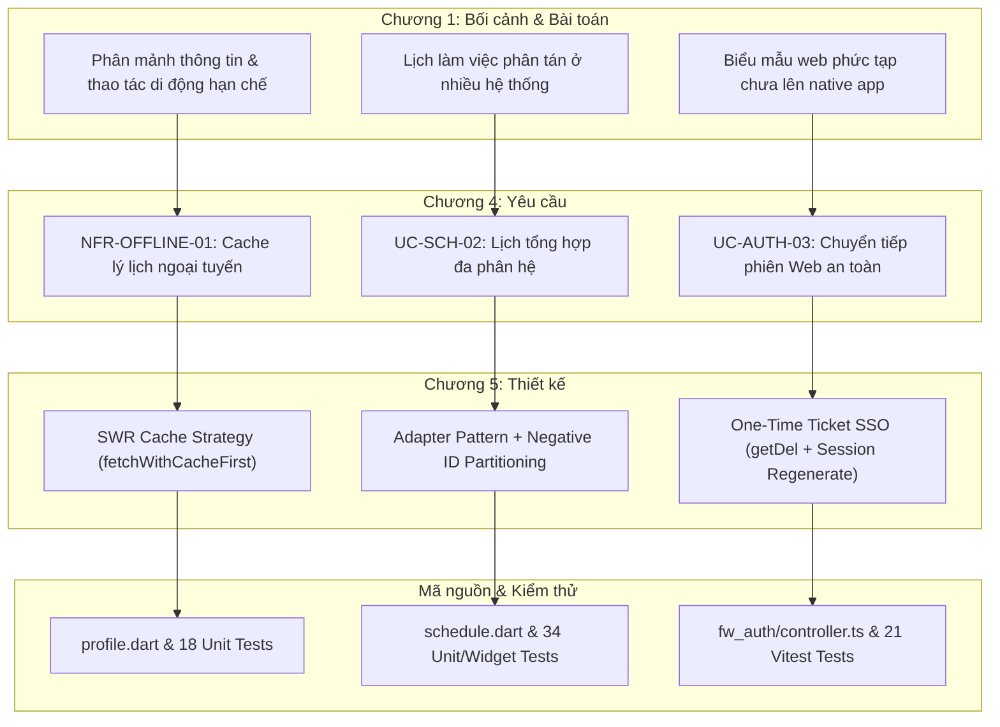

# THIẾT KẾ KỸ THUẬT HIỆU CHỈNH VÀ ĐỒNG BỘ BÁO CÁO ĐATN (CHƯƠNG 1 ĐẾN CHƯƠNG 5)

> **Tài liệu:** Technical Design Specification (Spec)  
> **Đề tài:** Phát triển ứng dụng di động phục vụ nhân sự Trường Đại học (MyHCMUT Mobile)  
> **Sinh viên thực hiện:**  
> - Vũ Xuân Chính (MSSV: 2210392)  
> - Tống Duy Khang (MSSV: 2211467)  
> **Giảng viên hướng dẫn:** ThS. Nguyễn Thanh Tùng  
> **Trạng thái:** Bản thảo kỹ thuật chờ phê duyệt (Design Gate)  
> **Mốc mã nguồn đối soát (Ground Truth Baseline):**  
> - `myhcmut-mobile`: commit `4fe5d9c`  
> - `hrm-be`: commit `38745a26`  
> - `ioffice-be`: commit `53f069a`  
> - `myhcmut-be`: commit `7e687a6`  

---

## 1. MỤC TIÊU VÀ NGUYÊN TẮC THIẾT KẾ

### 1.1. Mục tiêu cốt lõi
1. **Làm rõ giá trị kỹ thuật và phân định ranh giới đóng góp:** Trả lời dứt khoát câu hỏi của Hội đồng: *"Nhóm đã giải quyết bài toán kỹ thuật nào ngoài việc làm giao diện Flutter gọi API?"*. Phân tách rạch ròi 3 nhóm thành phần: (1) Phát triển mới, (2) Mở rộng/điều chỉnh, (3) Kế thừa hệ thống hiện hữu.
2. **Khép kín chuỗi liên kết (Traceability):** Đảm bảo mạch lập luận nhất quán: **Vấn đề thực tế (Chương 1) $\rightarrow$ Quyết định định hướng (Chương 2) $\rightarrow$ Nền tảng công nghệ (Chương 3) $\rightarrow$ Yêu cầu nghiệp vụ & phi chức năng (Chương 4) $\rightarrow$ Thiết kế kiến trúc & cơ chế tích hợp (Chương 5) $\rightarrow$ Hiện thực & Kiểm thử (Chương 6/7)**.
3. **Khử bỏ các khẳng định thiếu căn cứ kỹ thuật (De-risking):** Loại bỏ toàn bộ các tuyên bố over-promising (như tự ý thêm tầng `Repository` không tồn tại, giả định có khóa `FOR UPDATE` hay `UNIQUE` constraint ở DB). Trình bày trung thực hiện trạng mã nguồn và giới hạn kỹ thuật để không bị bắt bẻ khi bảo vệ.

### 1.2. Nguyên tắc học thuật (Academic Standards)
- **Chuẩn xác thực chứng (Ground Truth):** Mọi lớp, file, hàm, câu lệnh SQL, endpoint API nhắc đến trong báo cáo phải tồn tại thực tế trong mã nguồn.
- **Không suy diễn tuyệt đối:** Thừa nhận thẳng thắn các giới hạn của hệ thống hiện hữu (ví dụ: Check-then-Act Race Condition trong điểm danh, giả định ID âm $< 10^6$ trong gộp lịch).
- **Trực quan hóa chuẩn mực:** Thay thế các khung văn bản tạm thời (`\fbox`) bằng sơ đồ kiến trúc và sơ đồ tuần tự chuẩn xác.

---

## 2. NỘI DUNG HIỆU CHỈNH CHI TIẾT THEO TỪNG CHƯƠNG

### 2.1. Chương 1 — Giới thiệu đề tài
* **Vấn đề cần chỉnh sửa:**
  - Mục tiêu đề tài đang bị đồng nhất với giải pháp công nghệ cụ thể (dễ bị hiểu là chỉ nhằm "viết app Flutter gọi API").
  - Bảng phân công công việc chưa thể hiện được quyền sở hữu thiết kế kiến trúc (Technical Ownership).
* **Nội dung điều chỉnh:**
  1. *Định nghĩa lại bài toán thực tế:* Bài toán xuất phát từ nhu cầu thực tiễn của cán bộ, giảng viên: phân mảnh thông tin giữa 2 hệ thống web HRM và iOffice, thiếu khả năng thao tác tiện lợi trên thiết bị di động, không nhận được thông báo đẩy tức thời khi có lịch họp/duyệt đơn, và thiếu góc nhìn lịch làm việc tổng thể. Công nghệ (Flutter, Riverpod, REST, SSO) chỉ là phương tiện giải quyết bài toán.
  2. *Cập nhật Bảng Phân công Quyền sở hữu Kỹ thuật:*
     - **Vũ Xuân Chính (2210392):** Thiết kế và hiện thực các chức năng thuộc:
       + Phân hệ Quản lý Hồ sơ lý lịch (tra cứu thông tin cá nhân, cập nhật dữ liệu và gửi yêu cầu thẩm định thay đổi lý lịch).
       + Phân hệ Quản lý Nghỉ phép (đăng ký nghỉ phép, kiểm tra ràng buộc điều kiện và quy trình phê duyệt nghỉ phép).
       + Phân hệ Thông báo (tiếp nhận thông báo qua FCM và phân tích điều hướng ngữ cảnh nghiệp vụ).
       + Phân hệ Lịch làm việc tổng hợp (tổng hợp hiển thị lịch họp, lịch nghỉ phép và công tác trên giao diện di động).
     - **Tống Duy Khang (2211467):** Thiết kế và hiện thực các chức năng thuộc:
       + Phân hệ Văn phòng số iOffice (tra cứu văn bản đến, văn bản đi, phân phối xử lý và xem tệp đính kèm).
       + Phân hệ Quản lý Nhiệm vụ (quản lý cây nhiệm vụ phân cấp, phân công thành viên và báo cáo tiến độ).

---

### 2.2. Chương 2 — Phân tích các hệ thống có liên quan
* **Vấn đề cần chỉnh sửa:**
  - Các nhận định về hạn chế của HRM/iOffice hiện hữu cần có cơ sở đánh giá rõ ràng, tránh suy diễn chủ quan về trải nghiệm người dùng.
  - Cần làm nổi bật bảng đối sánh: Khảo sát hiện trạng $\rightarrow$ Quyết định thiết kế cho MyHCMUT Mobile.
* **Nội dung điều chỉnh:**
  1. *Cơ sở đánh giá:* Nêu rõ hạn chế được rút ra từ phân tích chức năng, kiểm thử luồng giao diện Web thực tế và tài liệu kỹ thuật của trường (chưa hỗ trợ responsive trên màn hình nhỏ, phiên đăng nhập Web không duy trì lâu trên trình duyệt di động, thiếu kênh Webhook/Push Notification tới thiết bị cá nhân).
  2. *Bổ sung Bảng Ánh xạ Khảo sát $\rightarrow$ Quyết định Thiết kế:*

| Hiện trạng khảo sát | Đặc điểm hệ thống nguồn | Quyết định thiết kế trên MyHCMUT Mobile |
| :--- | :--- | :--- |
| **Phân mảnh miền nghiệp vụ** | HRM và iOffice độc lập về backend, CSDL và thẩm quyền. | Giao tiếp trực tiếp đa miền, không gộp CSDL, bảo tồn Bounded Context. |
| **Quy trình nghiệp vụ phức tạp** | Đã hoàn thiện trên backend (duyệt phép nhiều cấp, phân công nhiệm vụ). | Kế thừa quy trình backend; Mobile đóng vai trò giao diện tương tác và kiểm tra dữ liệu sơ bộ (optimistic pre-validation). |
| **Biểu mẫu web đặc thù** | Một số form đánh giá/kê khai có cấu trúc động rất lớn trên Web. | Áp dụng One-Time Ticket SSO để nhúng biểu mẫu qua WebView an toàn. |
| **Dữ liệu lịch công tác phân tán** | Lịch họp nằm ở iOffice, nghỉ phép và công tác nằm ở HRM. | Triển khai mô hình Adapter Pattern gộp lịch tại Client, phân vùng ID âm và cách ly lỗi (Fault Isolation). |

---

### 2.3. Chương 3 — Cơ sở lý thuyết và công nghệ
* **Vấn đề cần chỉnh sửa:**
  - Thuật ngữ "MVC" chưa phản ánh đúng kiến trúc backend thực tế (vốn có Middleware, Controller, Service, Model).
  - Cần phân định công nghệ nền tảng kế thừa vs công nghệ do nhóm trực tiếp áp dụng.
  - Tránh trình bày trùng lặp lý thuyết với Chương 5.
* **Nội dung điều chỉnh:**
  1. *Chuẩn hóa mô hình kiến trúc Backend:* Định nghĩa chính xác là **Kiến trúc phân tầng dựa trên MVC mở rộng (Layered Architecture)** gồm:
     $$\text{Route / Middleware} \rightarrow \text{Controller} \rightarrow \text{Service / Business Logic} \rightarrow \text{Model / Data Access}$$
  2. *Phân loại công nghệ rõ ràng:*
     - **Công nghệ kế thừa từ hạ tầng Nhà trường:** CSDL quan hệ PostgreSQL 14, Nền tảng NodeJS Express core backend, Máy chủ cache Redis 7, Thư viện Socket.IO.
     - **Công nghệ do sinh viên trực tiếp thiết kế, cấu hình và hiện thực:** Flutter SDK 3.41, Quản lý trạng thái Riverpod 3 (Code generation), Melos Monorepo, Dio HTTP Client & Interceptors, In-App WebView Bridge, SQLite (`sqflite`) cho Master Data, Firebase Cloud Messaging (FCM) kết hợp Deep Linking router.

---

### 2.4. Chương 4 — Phân tích hệ thống
* **Vấn đề cần chỉnh sửa:**
  - Đảm bảo các cơ chế kỹ thuật đặc thù ở Chương 5 đều có Use Case / Yêu cầu nghiệp vụ ở Chương 4 làm gốc (đảm bảo tính Traceability).
  - Làm rõ ranh giới phân quyền: Mobile chỉ ẩn/hiện nút (UX Gating), Backend mới là nơi thực thi kiểm soát truy cập (Authoritative Enforcement).
  - Làm rõ hành vi cập nhật hồ sơ: Cập nhật trực tiếp vs Thẩm định là hai luồng độc lập, xử lý tình huống Partial Success.
* **Nội dung điều chỉnh:**
  1. *Bổ sung / Khớp nối các Yêu cầu Nghiệp vụ & Phi chức năng:*
     - `UC-AUTH-03` (Chuyển tiếp phiên làm việc sang biểu mẫu Web): Yêu cầu người dùng truy cập form Web mượt mà không cần đăng nhập lại và không lộ token xác thực dài hạn.
     - `UC-SCH-02` (Lịch làm việc cá nhân tổng hợp): Yêu cầu hiển thị đồng thời sự kiện họp, lịch nghỉ phép và chuyến công tác cá nhân trên cùng một lịch tuần/tháng.
     - `NFR-OFFLINE-01` (Khả năng tra cứu ngoại tuyến hồ sơ): Yêu cầu hiển thị tức thì thông tin hồ sơ lý lịch đã nạp trước đó ngay cả khi mạng chập chờn (SWR cache).
  2. *Khẳng định nguyên tắc phân quyền:* Bổ sung tiểu mục làm rõ: Mọi hành động phê duyệt, từ chối, chỉnh sửa đều bắt buộc kiểm tra Session/JWT và quyền hạn (`req.permissions.check`) tại Backend Middleware; Mobile tuyệt đối không thể tự cấp quyền cho người dùng.
  3. *Đặc tả luồng Cập nhật Hồ sơ:* Mô tả rõ việc sửa đổi thông tin liên hệ (`PUT /api/staff/ly-lich/personal`) và đề xuất thay đổi chức danh/học vị (`POST /api/staff/ly-lich/request`) là hai lời gọi độc lập. Khi xảy ra lỗi ở một nhánh, hệ thống ghi nhận thành công nhánh kia và hiển thị thông báo lỗi cụ thể cho nhánh thất bại, không rollback thao tác hợp lệ trước đó.

---

### 2.5. Chương 5 — Thiết kế hệ thống (Trọng tâm)

#### A. Mục 5.1 — Kiến trúc tổng thể hệ thống
* **Giải thích quyết định kiến trúc: Tại sao không dùng BFF (Backend-For-Frontend)?**
  - Giữ vững nguyên lý *Bounded Context*: HRM và iOffice là hai hệ thống độc lập thuộc các phòng ban khác nhau của trường.
  - Tránh điểm nghẽn đơn lẻ (Single Point of Failure - SPOF) và rủi ro bảo mật khi phải tập trung toàn bộ chứng thực tại một proxy trung gian.
  - Tiết kiệm chi phí tài nguyên máy chủ: Tận dụng trực tiếp các API sẵn có của backend nguồn, chuyển logic điều phối và tổng hợp về phía client thông qua `MultiDomainAuthInterceptor`.
* **Phân định rõ 3 vùng trong sơ đồ tổng thể:**
  - *Vùng 1 — Sinh viên phát triển mới:* MyHCMUT Mobile (Flutter Monorepo), Multi-Domain Auth Interceptor, In-App WebView Bridge.
  - *Vùng 2 — Sinh viên mở rộng / tích hợp:* Các endpoint mobile chuyên biệt trên HRM (`/api/staff/ly-lich/mobile/...`), Endpoint tạo & tiêu thụ vé SSO (`/api/auth/sso/*`), Thuật toán kiểm tra lịch và Advisory Lock nghỉ phép.
  - *Vùng 3 — Kế thừa nguyên trạng:* Core Backend & CSDL PostgreSQL của HRM và iOffice, FCM Gateway.
* **Hạ vai trò Redis:** Không vẽ Redis như một thành phần dữ liệu nghiệp vụ chính ngang hàng PostgreSQL; chỉ chú thích Redis là bộ nhớ đệm phụ trợ phục vụ lưu vé SSO một lần (TTL 60s) và session store.

#### B. Mục 5.2 — Kiến trúc các thành phần phần mềm
* **Hiệu chỉnh luồng xử lý ứng dụng Mobile (Mục 5.2.1):**
  - **Loại bỏ lớp `Repository`** khỏi sơ đồ chung (do mã nguồn không triển khai lớp Repository này).
  - Chuẩn hóa luồng thực tế:
    $$\textbf{View (ConsumerWidget)} \xrightarrow{\text{watch}} \textbf{Riverpod Provider} \xrightarrow{\text{điều phối}} \textbf{Network / Cache Utility} \xrightarrow{\text{gọi}} \textbf{Backend REST API}$$
* **Sơ đồ hóa ca điển hình Hồ sơ cá nhân (Hình 5.4 mới):**
  - Thay thế khung chữ `\fbox` bằng sơ đồ luồng dữ liệu SWR rõ ràng:
    1. View quan sát `profileInfoProvider`.
    2. Provider kích hoạt song song 3 sub-providers (`profileCaNhanProvider`, `profileDaoTaoProvider`, `profileQuaTrinhProvider`).
    3. Hàm `fetchWithCacheFirst` kiểm tra cache `SharedPreferences`: Nếu cache còn hạn ($< 12\text{h}$), trả ngay dữ liệu hiển thị (Instant UI).
    4. Nếu cache hết hạn: Trả cache cũ đồng thời chạy ngầm `Future.microtask` gọi `hrmDioProvider` $\rightarrow$ HRM API $\rightarrow$ Ghi đè cache mới và cập nhật UI.

#### C. Mục 5.3 — Mô hình dữ liệu và Phân định ranh giới lưu trữ phục vụ tích hợp
* **Đổi lời dẫn và tiêu đề:** Nhấn mạnh đây là *mô hình dữ liệu phục vụ phân tích tích hợp*, không phải toàn bộ CSDL do nhóm thiết kế mới.
* **Phân định rõ nguồn gốc các nhóm bảng:**
  - *Bảng kế thừa HRM:* `staff_ly_lich`, `staff_ly_lich_request`, `staff_ly_lich_request_detail`, `tcns_nghi_phep_dang_ky`, `tcns_lich_ca_nhan`, `tcns_so_nghi_phep_nam`.
  - *Bảng kế thừa iOffice:* `eoffice_van_ban_den`, `eoffice_van_ban_di`, `mission_general`, `mission_outlined`, `schedule_general`, `schedule_general_item`, `schedule_meeting_attendance`.
  - *Bảng do đề tài cấu hình phục vụ Mobile:* `fw_user_device_token` (lưu FCM token), bảng SQLite client `hrm_master_data.db` (lưu 47 danh mục tham chiếu tĩnh, không lưu dữ liệu nhạy cảm).
* **Xử lý dữ liệu Nghỉ phép (5.3.3) theo hướng An toàn tuyệt đối (De-risking):**
  - **Hoàn toàn KHÔNG trình bày các nội dung về cơ chế khóa (advisory lock, row lock) hay transaction CSDL** trong báo cáo để triệt tiêu mọi rủi ro bị Hội đồng chất vấn sâu về CSDL phân tán.
  - Trình bày đúng phạm vi đề tài: MyHCMUT Mobile gửi yêu cầu đăng ký nghỉ phép qua REST API; việc kiểm tra quy tắc nghiệp vụ (thời hạn nộp đơn, trạng thái phiếu, số dư phép năm) và cập nhật dữ liệu do HRM Backend chịu trách nhiệm xử lý theo quy trình nghiệp vụ của Nhà trường.
* **Xử lý dữ liệu Điểm danh cuộc họp (5.3.5):**
  - Trình bày đúng hiện trạng: Ứng dụng di động cung cấp giao diện điểm danh và gửi yêu cầu tới iOffice API. Việc kiểm tra danh sách cán bộ, thời gian diễn ra cuộc họp và ghi nhận kết quả điểm danh do iOffice Backend quản lý. Loại bỏ các đề xuất suy diễn về ràng buộc CSDL.

#### D. Mục 5.4 — Các cơ chế tích hợp hệ thống
* **Tách bạch 2 giai đoạn của One-Time Ticket SSO (Mục 5.4.2):**
  - *Giai đoạn 1 — Tiêu thụ vé (Ticket Consumption):* Thực hiện nguyên tử trên Redis bằng lệnh `getDel(sso:ticket:<hash>)` (burn-on-read, TTL 60s). Nếu vé đã hết hạn hoặc đã bị đọc trước đó, trả về ngay HTTP 401.
  - *Giai đoạn 2 — Thiết lập phiên Web (Web Session Establishment):* Sau khi lấy payload từ Redis, máy chủ tìm user trong DB, gọi `req.session.regenerate()` và cấp cookie session `connect.sid` (`HttpOnly`, `SameSite=Lax`, `Secure`). Giao diện Web gọi `history.replaceState` để xóa ticket khỏi URL.
  - *Xử lý lỗi:* Nếu bước 2 gặp lỗi (DB disconnect), vé đã bị xóa khỏi Redis và không thể tái sử dụng. WebView sẽ thông báo lỗi và yêu cầu người dùng mở lại từ ứng dụng di động để lấy vé mới.
* **Làm rõ quy tắc phân vùng ID âm trong Lịch tổng hợp (Mục 5.4.4):**
  - Nêu rõ công thức hiện tại: $id_{\text{leave}} = -\text{phieuId}$ và $id_{\text{trip}} = -(1000000 + \text{id})$.
  - Thẳng thắn chỉ ra giới hạn: Quy tắc này dựa trên giả định số lượng đơn nghỉ phép $< 1.000.000$; nếu vượt ngưỡng hoặc bổ sung thêm nguồn sự kiện thứ 4 thì nguy cơ va chạm ID sẽ xuất hiện. Đề xuất giải pháp chuẩn kiến trúc lâu dài là chuyển đổi `ScheduleItem.id` sang dạng **Compound String ID** (`hrm_leave:123`, `ioffice:456`).

---

## 3. MA TRẬN LIÊN KẾT & KIỂM CHỨNG HỌC THUẬT (TRACEABILITY MATRIX)

---

## 4. KẾ HOẠCH THỰC THI & CÁC TỆP CẦN ĐIỀU CHỈNH

1. **Giai đoạn 1 — Chỉnh sửa Chương 5 (Trọng tâm lớn nhất):**
   - File [Chapter5/section1.tex](file:///home/xchinh/orca/workspaces/HK253_DATN_341_2211467_2210392/merge-chapter-5/Chapter5/section1.tex): Bổ sung lý giải kiến trúc Direct Multi-Domain thay cho BFF; phân định 3 vùng hệ thống; tinh giản vai trò Redis.
   - File [Chapter5/section2.tex](file:///home/xchinh/orca/workspaces/HK253_DATN_341_2211467_2210392/merge-chapter-5/Chapter5/section2.tex): Bỏ `Repository`, đưa sơ đồ và mô tả luồng SWR của Hồ sơ cá nhân.
   - File [Chapter5/section3.tex](file:///home/xchinh/orca/workspaces/HK253_DATN_341_2211467_2210392/merge-chapter-5/Chapter5/section3.tex): Đổi lời dẫn mô hình dữ liệu tích hợp, sửa đúng cơ chế advisory lock nghỉ phép (bỏ `FOR UPDATE`), sửa nhận định về điểm danh (chưa có `UNIQUE`).
   - File [Chapter5/section4.tex](file:///home/xchinh/orca/workspaces/HK253_DATN_341_2211467_2210392/merge-chapter-5/Chapter5/section4.tex): Tách 2 bước SSO One-Time Ticket kèm xử lý lỗi; phân tích quy tắc ID âm và hạn chế của nó.
   - File [docs/CHAPTER_5_SYSTEM_DESIGN.md](file:///home/xchinh/orca/workspaces/HK253_DATN_341_2211467_2210392/merge-chapter-5/docs/CHAPTER_5_SYSTEM_DESIGN.md): Cập nhật bản Markdown đồng bộ 100% với các file LaTeX.

2. **Giai đoạn 2 — Đồng bộ liên kết Chương 1, 3, 4:**
   - File [Chapter1/section1.tex](file:///home/xchinh/orca/workspaces/HK253_DATN_341_2211467_2210392/merge-chapter-5/Chapter1/section1.tex): Tinh chỉnh mục tiêu thực tế và bảng phân công kỹ thuật của 2 thành viên.
   - File [Chapter3/section1.tex](file:///home/xchinh/orca/workspaces/HK253_DATN_341_2211467_2210392/merge-chapter-5/Chapter3/section1.tex) & `section2.tex`: Chuẩn hóa thuật ngữ "Kiến trúc phân tầng mở rộng MVC", phân định công nghệ tự làm vs kế thừa.
   - File [Chapter4/section1.tex](file:///home/xchinh/orca/workspaces/HK253_DATN_341_2211467_2210392/merge-chapter-5/Chapter4/section1.tex) & `section3.tex`: Khớp nối các yêu cầu SSO, Lịch, Cache, làm rõ kiểm tra quyền tại Backend.

3. **Giai đoạn 3 — Biên dịch & Kiểm tra toàn vẹn:**
   - Chạy lệnh biên dịch LaTeX `latexmk -pdf main.tex` để bảo đảm 0 lỗi biên dịch, các trích dẫn và nhãn tham chiếu (`\ref`, `\cite`) hoàn toàn chính xác.
